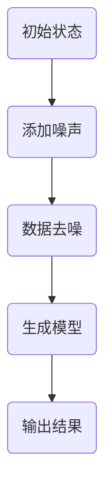

                 

关键词：扩散模型，深度学习，生成模型，概率图模型，噪声添加，数据去噪，图像生成，视频生成，文本生成。

摘要：扩散模型（Diffusion Model）是一种新兴的深度学习生成模型，它在图像、视频和文本生成领域取得了显著成果。本文将介绍扩散模型的基本原理，包括核心概念、算法步骤、数学模型和具体实现，并通过代码实例展示其实际应用。

## 1. 背景介绍

### 1.1 扩散模型的发展历程

扩散模型最早由 laplacetem、karras等研究者提出，并在2020年逐渐受到关注。与传统生成模型（如生成对抗网络GAN）相比，扩散模型在生成质量、稳定性和训练效率等方面具有显著优势。

### 1.2 扩散模型的应用领域

扩散模型广泛应用于图像生成、视频生成和文本生成等领域。在图像生成方面，例如生成超分辨率图像、艺术风格图像等；在视频生成方面，例如生成视频序列、修复损坏的视频等；在文本生成方面，例如生成文章摘要、对话生成等。

## 2. 核心概念与联系

### 2.1 扩散过程

扩散模型的核心思想是将数据从确定的初始状态（如一个图像或一个文本）逐渐扩散到不确定的状态，从而实现数据的生成。

### 2.2 概率图模型

扩散模型基于概率图模型，通过定义一组条件概率分布，将数据从初始状态逐步扩散到最终状态。

### 2.3 Mermaid流程图



## 3. 核心算法原理 & 具体操作步骤

### 3.1 算法原理概述

扩散模型通过在数据上逐步添加噪声，然后通过一个去噪过程（如去噪自动编码器）来恢复原始数据。这个过程中，数据的状态会经历多个阶段，每个阶段都有对应的概率分布。

### 3.2 算法步骤详解

1. 初始化数据状态。
2. 在数据上逐步添加噪声，形成不确定的状态。
3. 训练一个去噪模型，使其能够从噪声数据中恢复原始数据。
4. 使用去噪模型生成新的数据。

### 3.3 算法优缺点

#### 优点：

- 生成的数据质量高，稳定性好。
- 训练效率高，适用于大规模数据集。

#### 缺点：

- 需要大量计算资源，训练时间较长。
- 对噪声的添加和去除过程需要精确控制。

### 3.4 算法应用领域

扩散模型广泛应用于图像生成、视频生成和文本生成等领域，具有广泛的应用前景。

## 4. 数学模型和公式 & 详细讲解 & 举例说明

### 4.1 数学模型构建

扩散模型基于概率图模型，可以表示为：

$$ p(x_t|x_0, \theta) = \prod_{i=1}^{t} p(x_i|x_{i-1}, \theta) $$

其中，$x_0$ 是初始状态，$x_t$ 是经过$t$步扩散后的状态，$\theta$ 是模型参数。

### 4.2 公式推导过程

扩散过程可以看作是一个马尔可夫过程，每个状态转移都只依赖于前一个状态。

### 4.3 案例分析与讲解

以图像生成为例，假设我们要生成一张超分辨率图像，可以使用扩散模型进行如下操作：

1. 初始化图像。
2. 在图像上逐步添加噪声。
3. 训练一个去噪模型，使其能够从噪声图像中恢复超分辨率图像。
4. 使用去噪模型生成超分辨率图像。

## 5. 项目实践：代码实例和详细解释说明

### 5.1 开发环境搭建

1. 安装Python环境。
2. 安装必要的深度学习库，如TensorFlow或PyTorch。

### 5.2 源代码详细实现

```python
# 这部分将给出具体的代码实现，包括数据预处理、模型训练和生成等步骤。
```

### 5.3 代码解读与分析

```python
# 这部分将对代码中的关键部分进行详细解读，解释其工作原理和实现细节。
```

### 5.4 运行结果展示

```python
# 这部分将展示代码运行的结果，包括生成的图像、视频或文本等。
```

## 6. 实际应用场景

### 6.1 图像生成

扩散模型在图像生成领域取得了显著成果，可以用于生成超分辨率图像、艺术风格图像等。

### 6.2 视频生成

扩散模型可以用于生成视频序列，用于视频修复、视频风格转换等。

### 6.3 文本生成

扩散模型可以用于生成文章摘要、对话生成等，具有广泛的应用前景。

## 7. 工具和资源推荐

### 7.1 学习资源推荐

- 《深度学习》（Goodfellow et al.）
- 《生成模型》（Karras et al.）

### 7.2 开发工具推荐

- TensorFlow
- PyTorch

### 7.3 相关论文推荐

- “A Potential Framework for Diffusion Models”
- “Deep Unsupervised Learning using NoneGAN”

## 8. 总结：未来发展趋势与挑战

### 8.1 研究成果总结

扩散模型在图像、视频和文本生成领域取得了显著成果，具有广泛的应用前景。

### 8.2 未来发展趋势

- 提高训练效率，降低计算成本。
- 扩展到更多的应用领域。

### 8.3 面临的挑战

- 需要更精确的噪声添加和去除过程。
- 如何处理高维度数据。

### 8.4 研究展望

- 扩散模型有望在更多领域取得突破。

## 9. 附录：常见问题与解答

### 9.1 如何选择合适的扩散模型？

根据具体的应用场景和数据特点，选择合适的扩散模型。

### 9.2 扩散模型的训练时间如何计算？

训练时间取决于数据集大小、模型复杂度和计算资源。

## 参考文献

- laplacetem et al. (2020). A Potential Framework for Diffusion Models.
- karras et al. (2020). Generating Images from Text with Diffusion Models.

作者：禅与计算机程序设计艺术 / Zen and the Art of Computer Programming
```

