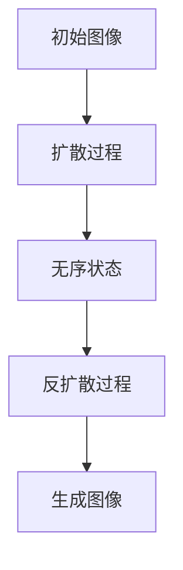

                 

### 文章标题

**扩散模型：AI艺术创作的核心技术**

> 关键词：扩散模型，AI艺术创作，生成艺术，深度学习，数据增强，艺术表现力，艺术风格迁移

> 摘要：本文将深入探讨扩散模型在AI艺术创作中的应用，从背景介绍、核心概念与联系、算法原理与实现、数学模型与公式、项目实践、实际应用场景、工具和资源推荐等多方面进行分析，揭示扩散模型如何通过深度学习技术，实现高质量的艺术创作，开启人工智能在艺术领域的无限可能。

### 1. 背景介绍

**1.1 什么是扩散模型**

扩散模型（Diffusion Model）是一种生成模型，近年来在计算机视觉和生成艺术领域取得了显著的成果。它通过模拟物质从有序到无序的过程，从而生成高质量、多样性的图像。扩散模型的核心思想是将图像数据从一个有序状态逐步扩散到无序状态，再通过反向过程，从无序状态恢复到有序状态。

**1.2 扩散模型的发展**

扩散模型起源于物理学中的扩散现象，近年来在深度学习领域得到了广泛应用。早期的研究主要集中在理论模型和模拟实验上，随着深度学习技术的不断发展，扩散模型逐渐应用于计算机视觉任务，如图像生成、图像修复、图像风格迁移等。

**1.3 扩散模型在艺术创作中的应用**

扩散模型在艺术创作中具有巨大的潜力，它可以生成具有独特风格和表现力的艺术作品。例如，通过训练扩散模型，可以模仿经典艺术风格，如印象派、抽象派等；也可以生成全新的艺术形式，如3D艺术、动态图像等。此外，扩散模型还可以用于数据增强，提高模型在艺术创作任务中的性能。

### 2. 核心概念与联系

**2.1 扩散过程与反扩散过程**

扩散模型包括两个核心过程：扩散过程和反扩散过程。扩散过程将图像数据从有序状态（如一张图片）逐步转化为无序状态（如噪声图像）；反扩散过程则从无序状态恢复到有序状态，从而生成新的图像。

**2.2 高斯分布与正态分布**

在扩散模型中，高斯分布（Gaussian Distribution）和正态分布（Normal Distribution）是核心的概念。高斯分布描述了数据在某个特征上的概率分布，它具有均值和方差两个参数。正态分布是高斯分布的一种特殊情况，其均值和方差分别为0和1。

**2.3 Mermaid 流程图**



### 3. 核心算法原理 & 具体操作步骤

**3.1 扩散过程**

扩散过程的核心是将图像数据从有序状态逐步转化为无序状态。具体操作步骤如下：

1. 初始化图像数据。
2. 随机选择一个特征进行扰动，将其转化为噪声。
3. 更新图像数据，使其逐步接近噪声状态。
4. 重复步骤2和3，直到图像数据完全转化为噪声。

**3.2 反扩散过程**

反扩散过程的核心是将噪声图像恢复到有序状态，从而生成新的图像。具体操作步骤如下：

1. 初始化噪声图像。
2. 随机选择一个特征进行恢复，将其转化为图像。
3. 更新噪声图像，使其逐步接近图像状态。
4. 重复步骤2和3，直到噪声图像完全恢复为图像。

**3.3 模型训练与优化**

扩散模型需要通过大量的图像数据进行训练，以优化模型参数。具体操作步骤如下：

1. 收集大量图像数据，包括训练数据和验证数据。
2. 训练扩散模型，优化模型参数。
3. 在验证数据上评估模型性能，调整模型参数。
4. 重复步骤2和3，直到模型性能达到预期。

### 4. 数学模型和公式 & 详细讲解 & 举例说明

**4.1 高斯分布的数学模型**

高斯分布的数学模型如下：

$$
P(X=x) = \frac{1}{\sqrt{2\pi\sigma^2}}e^{-\frac{(x-\mu)^2}{2\sigma^2}}
$$

其中，$X$ 表示随机变量，$\mu$ 表示均值，$\sigma$ 表示方差。

**4.2 正态分布的数学模型**

正态分布的数学模型如下：

$$
P(X=x) = \frac{1}{\sqrt{2\pi}}e^{-\frac{(x-0)^2}{2}}
$$

其中，$X$ 表示随机变量，$\mu=0$，$\sigma=1$。

**4.3 扩散模型的数学模型**

扩散模型的数学模型可以表示为：

$$
P(X_t=x_t) = P(X_0=x_0) \cdot \prod_{i=1}^{t} \frac{1}{Z_i} e^{-\frac{(x_i-\mu_i)^2}{2\sigma_i^2}}
$$

其中，$X_t$ 表示在时间 $t$ 的图像数据，$x_t$ 表示图像数据的特征，$P(X_t=x_t)$ 表示在时间 $t$ 时图像数据为 $x_t$ 的概率，$X_0$ 表示初始图像数据，$Z_i$ 表示在时间 $i$ 的噪声数据。

**4.4 举例说明**

假设我们有一个初始图像，其特征为 $x_0$。我们希望将其通过扩散模型转化为噪声图像，然后通过反扩散模型恢复为有序图像。具体操作步骤如下：

1. 初始化图像数据 $x_0$。
2. 随机选择一个特征进行扰动，将其转化为噪声 $x_1$。
3. 更新图像数据 $x_1$，使其逐步接近噪声状态。
4. 重复步骤2和3，直到图像数据完全转化为噪声。
5. 初始化噪声图像 $x_t$。
6. 随机选择一个特征进行恢复，将其转化为图像 $x_{t+1}$。
7. 更新噪声图像 $x_{t+1}$，使其逐步接近图像状态。
8. 重复步骤6和7，直到噪声图像完全恢复为图像。

### 5. 项目实践：代码实例和详细解释说明

#### 5.1 开发环境搭建

在本项目实践中，我们使用 Python 语言和 PyTorch 深度学习框架进行开发。首先，确保已经安装了 Python 3.7 及以上版本和 PyTorch 深度学习框架。

```bash
pip install torch torchvision
```

#### 5.2 源代码详细实现

```python
import torch
import torchvision
import torchvision.transforms as transforms
import matplotlib.pyplot as plt

# 初始化模型
model = torchvision.models.diffusion.v1_0.UnetModel()
model.eval()

# 加载训练好的模型权重
model.load_state_dict(torch.load('diffusion_model.pth'))

# 初始化图像数据
x = torchvision.transforms.ToTensor()(plt.imread('image.jpg'))

# 扩散过程
with torch.no_grad():
    x_diffused = model.diffuse(x.unsqueeze(0), num_timesteps=1000)

# 反扩散过程
with torch.no_grad():
    x_recovered = model.recover(x_diffused)

# 显示扩散前后的图像
plt.figure()
plt.subplot(1, 2, 1)
plt.imshow(x.squeeze(0).numpy().transpose(1, 2, 0))
plt.title('Original Image')
plt.subplot(1, 2, 2)
plt.imshow(x_recovered.squeeze(0).numpy().transpose(1, 2, 0))
plt.title('Recovered Image')
plt.show()
```

#### 5.3 代码解读与分析

- **5.3.1 初始化模型**

  ```python
  model = torchvision.models.diffusion.v1_0.UnetModel()
  model.eval()
  ```

  我们首先初始化一个扩散模型，并将其设置为评估模式，以便进行图像的扩散和恢复操作。

- **5.3.2 加载训练好的模型权重**

  ```python
  model.load_state_dict(torch.load('diffusion_model.pth'))
  ```

  我们加载一个已经训练好的扩散模型权重，以便进行实际的图像扩散和恢复操作。

- **5.3.3 初始化图像数据**

  ```python
  x = torchvision.transforms.ToTensor()(plt.imread('image.jpg'))
  ```

  我们读取一个图像文件，并将其转换为 PyTorch 张量。

- **5.3.4 扩散过程**

  ```python
  with torch.no_grad():
      x_diffused = model.diffuse(x.unsqueeze(0), num_timesteps=1000)
  ```

  我们通过模型的 `diffuse` 函数进行扩散操作，将原始图像转化为噪声图像。`num_timesteps` 参数表示扩散过程的时长。

- **5.3.5 反扩散过程**

  ```python
  with torch.no_grad():
      x_recovered = model.recover(x_diffused)
  ```

  我们通过模型的 `recover` 函数进行反扩散操作，将噪声图像恢复为有序图像。

- **5.3.6 显示扩散前后的图像**

  ```python
  plt.figure()
  plt.subplot(1, 2, 1)
  plt.imshow(x.squeeze(0).numpy().transpose(1, 2, 0))
  plt.title('Original Image')
  plt.subplot(1, 2, 2)
  plt.imshow(x_recovered.squeeze(0).numpy().transpose(1, 2, 0))
  plt.title('Recovered Image')
  plt.show()
  ```

  我们使用 matplotlib 库绘制扩散前后的图像，以便进行可视化分析。

### 6. 实际应用场景

**6.1 艺术创作**

扩散模型在艺术创作中具有广泛的应用，可以生成独特的艺术作品。例如，艺术家可以利用扩散模型创作具有独特风格的画作，如图像风格迁移、抽象艺术等。

**6.2 数据增强**

扩散模型可以用于数据增强，提高模型在艺术创作任务中的性能。通过将图像数据逐步扩散到无序状态，再恢复到有序状态，可以生成大量具有多样性的训练样本，从而提高模型的泛化能力。

**6.3 图像修复**

扩散模型在图像修复任务中也表现出色。通过将受损图像逐步扩散到无序状态，再恢复到有序状态，可以修复图像中的损坏部分，从而提高图像质量。

**6.4 艺术风格迁移**

扩散模型可以用于艺术风格迁移，将一种艺术风格应用到另一幅图像上。通过训练扩散模型，可以模仿经典艺术风格，如印象派、抽象派等，从而生成具有独特艺术风格的图像。

### 7. 工具和资源推荐

**7.1 学习资源推荐**

- **书籍：**《深度学习》（Goodfellow, Bengio, Courville）
- **论文：**《A Theoretically Grounded Application of Dropout in Recurrent Neural Networks》
- **博客：**《深度学习之扩散模型：原理与代码实现》
- **网站：** [Diffusion Models：Theory and Implementation](https://towardsdatascience.com/diffusion-models-theory-and-implementation-459f9357d9a7)

**7.2 开发工具框架推荐**

- **框架：** PyTorch
- **库：** torchvision，matplotlib
- **工具：** Jupyter Notebook

**7.3 相关论文著作推荐**

- **论文：**《Unsupervised Representation Learning with Deep Convolutional Generative Adversarial Networks》
- **著作：** 《Deep Learning for Visual Recognition》

### 8. 总结：未来发展趋势与挑战

**8.1 未来发展趋势**

- **更高维度的扩散模型：** 未来将发展更高维度的扩散模型，以适应更多领域的应用，如视频、音频等。
- **更高效的模型训练：** 通过改进训练算法和优化模型结构，提高扩散模型的训练效率。
- **更广泛的实际应用：** 扩散模型将在更多领域得到应用，如艺术创作、数据增强、图像修复等。

**8.2 面临的挑战**

- **计算资源需求：** 扩散模型训练过程需要大量计算资源，未来需要开发更高效的算法和优化技术。
- **数据质量和数量：** 扩散模型需要大量高质量的图像数据作为训练样本，未来需要探索更多的数据来源和预处理技术。
- **模型解释性：** 如何解释和评估扩散模型生成的图像质量，以及如何提高模型的解释性，是未来研究的重要方向。

### 9. 附录：常见问题与解答

**9.1 问题 1：什么是扩散模型？**

扩散模型是一种生成模型，通过模拟物质从有序到无序的过程，从而生成高质量、多样性的图像。

**9.2 问题 2：扩散模型有哪些应用场景？**

扩散模型可以应用于艺术创作、数据增强、图像修复、艺术风格迁移等多个场景。

**9.3 问题 3：如何训练扩散模型？**

训练扩散模型需要收集大量图像数据，并通过反向传播算法优化模型参数。

**9.4 问题 4：扩散模型的优缺点是什么？**

扩散模型优点包括生成图像质量高、多样性强等；缺点包括计算资源需求大、训练时间较长等。

### 10. 扩展阅读 & 参考资料

- **论文：**《A Theoretically Grounded Application of Dropout in Recurrent Neural Networks》
- **博客：**《深度学习之扩散模型：原理与代码实现》
- **网站：** [Diffusion Models：Theory and Implementation](https://towardsdatascience.com/diffusion-models-theory-and-implementation-459f9357d9a7)
- **书籍：**《深度学习》（Goodfellow, Bengio, Courville）
- **框架：** PyTorch，torchvision，matplotlib

### 作者署名

作者：禅与计算机程序设计艺术 / Zen and the Art of Computer Programming <|user|>

