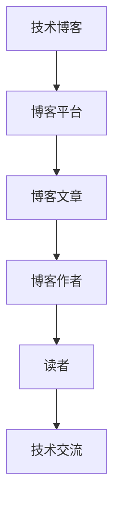

                 

### 背景介绍

#### 什么是技术博客

技术博客是互联网上一种常见的内容形式，主要由技术爱好者、从业者以及专家撰写。博客文章通常涵盖编程语言、算法、数据结构、系统架构、软件开发流程等多个技术领域。技术博客的主要目的是分享知识、探讨问题、展示解决方案，并促进技术交流和共同进步。

技术博客具有以下几个特点：

1. **专业性强**：技术博客往往聚焦于某一特定领域，内容深入且细致，有助于读者深入了解该领域的知识。
2. **互动性高**：博客文章通常允许读者在下方评论区留言，进行讨论和交流，有助于建立技术社区。
3. **形式多样**：博客文章可以是理论阐述、实战教程、案例分析等多种形式，满足不同读者的需求。

#### 技术博客的重要性

技术博客在IT行业中具有重要地位，主要体现在以下几个方面：

1. **知识传播**：技术博客是知识传播的重要渠道，能够让更多的人了解到最新的技术动态和前沿知识。
2. **个人品牌建设**：通过持续撰写高质量的技术博客，个人可以积累专业声誉，提升个人品牌价值。
3. **技术交流**：技术博客促进了不同地区、不同公司、不同背景的技术人员之间的交流和合作，促进了技术进步。
4. **职业发展**：优秀的博客文章可以成为职业发展的助力，帮助作者获得更好的工作机会或职业晋升。

#### 技术博客的发展历程

技术博客的起源可以追溯到20世纪90年代末期，随着互联网的普及和博客平台的兴起，技术博客开始逐渐流行。早期的技术博客主要以纯文本形式存在，内容较为简单。随着技术的进步，博客平台逐渐引入了图片、视频、代码片段等多种形式，使得博客文章更加丰富和生动。

进入21世纪后，随着社交媒体的兴起，技术博客逐渐与社交媒体平台相结合，如Twitter、LinkedIn等，进一步扩大了其影响力和传播范围。

#### 当前技术博客的现状

当前，技术博客已经成为了IT行业的重要组成部分。根据2022年的统计数据，全球范围内活跃的技术博客数量已经超过了100万个，每天有大量的技术博客文章被发布。这些博客文章涵盖了各种技术领域，从基础编程知识到前沿的人工智能技术，从开源框架到商业应用，无所不包。

技术博客的现状表现为以下几个方面：

1. **多样性**：技术博客的形式和内容越来越多样化，不仅限于文字，还包括视频、音频、PPT等多种形式。
2. **专业化**：随着技术领域的不断细分，越来越多的专业博客出现，覆盖了从入门到高级的各个层次。
3. **国际化**：技术博客已经不再局限于某个地区或国家，而是具有全球化的特点，读者遍布世界各地。
4. **商业化**：一些技术博客已经开始实现商业化，通过广告、赞助、会员等形式获得收入。

#### 技术博客的未来发展趋势

随着技术的不断进步，技术博客的未来发展趋势也将呈现出以下特点：

1. **人工智能应用**：人工智能技术将进一步提升技术博客的自动化程度，如自动生成文章、自动分类、智能推荐等。
2. **平台整合**：技术博客平台将逐步实现整合，提供更加丰富的功能和更优质的服务。
3. **内容多样化**：技术博客的内容将继续多样化，不仅限于文字，还将引入更多多媒体形式，如虚拟现实（VR）、增强现实（AR）等。
4. **社区化**：技术博客将更加注重社区建设，通过构建互动性强的社区，促进读者之间的交流与合作。

总之，技术博客已经成为IT行业不可或缺的一部分，其重要性日益凸显。无论是技术爱好者、从业者还是专家，都应该重视技术博客的撰写和传播，通过博客平台分享知识、展示才华，推动技术的不断进步。### 核心概念与联系

在撰写技术博客的过程中，理解和掌握核心概念与它们之间的联系至关重要。这不仅有助于我们清晰地传达信息，还能让读者更容易理解和接受我们的观点。下面，我们将介绍一些关键概念，并使用Mermaid流程图来展示它们之间的相互关系。

#### 关键概念

1. **技术博客**：指在互联网上发布的，以技术为主题的博客文章。
2. **博客平台**：用于发布和管理技术博客的在线平台，如WordPress、Medium、GitHub Pages等。
3. **博客文章**：技术博客的主要内容，包括但不限于技术教程、案例分析、知识分享等。
4. **博客作者**：撰写技术博客的个人或团队，他们在博客平台上发布内容。
5. **读者**：阅读技术博客的用户，他们可能是学生、开发者、技术爱好者等。
6. **技术交流**：通过技术博客进行的讨论、交流和学习活动。

#### Mermaid流程图

下面是一个简单的Mermaid流程图，展示了上述核心概念之间的相互关系：



#### 详细解释

1. **技术博客（A）**：技术博客是核心概念，它是整个流程的起点。博客定义了内容的形式和主题，是读者获取技术知识的重要来源。
2. **博客平台（B）**：博客平台是技术博客的发布和管理工具。不同的平台提供了不同的功能和用户体验，如WordPress提供了丰富的模板和插件，而GitHub Pages则更注重代码和项目的展示。
3. **博客文章（C）**：博客文章是技术博客的核心内容，它们可以是原创的，也可以是对已有内容的二次创作。文章的撰写质量直接影响到读者的阅读体验。
4. **博客作者（D）**：博客作者通过博客平台发布文章，他们是知识的创造者和传播者。优秀的博客作者能够吸引更多的读者，并建立自己的个人品牌。
5. **读者（E）**：读者是技术博客的受众，他们通过阅读博客文章来学习新知识、解决实际问题。读者的反馈和互动也是博客作者持续创作的重要动力。
6. **技术交流（F）**：技术交流是博客作者和读者之间的互动过程，通过评论、讨论、分享等方式，技术博客促进了知识的传播和技术的进步。

#### Mermaid流程图的意义

通过Mermaid流程图，我们能够直观地展示技术博客各个核心概念之间的联系，这有助于读者快速理解整个流程。此外，流程图还可以用于分析问题、优化流程、设计系统等，是一种非常有用的工具。

总之，核心概念与联系是技术博客撰写过程中不可或缺的一部分。通过深入理解和掌握这些概念，我们能够更好地组织内容、传达信息，并激发读者的兴趣和参与。### 核心算法原理 & 具体操作步骤

在撰写技术博客的过程中，介绍核心算法原理和具体操作步骤是非常重要的。这不仅能让读者了解技术实现的细节，还能帮助他们掌握实际操作技能。以下是一个典型的核心算法原理及其具体操作步骤的示例。

#### 核心算法原理：快速排序（Quick Sort）

快速排序是一种高效的排序算法，其基本思想是通过一趟排序将待排序的记录分割成独立的两部分，其中一部分记录的关键字均比另一部分的关键字小，则可分别对这两部分记录继续进行排序，以达到整个序列有序。快速排序的时间复杂度平均为O(nlogn)，最坏情况下为O(n^2)。

#### 具体操作步骤：

1. **选择基准元素**：在待排序的数组中选择一个基准元素。通常选择第一个元素、最后一个元素或随机选择一个元素作为基准。
2. **分区操作**：通过一次交换将数组分割成两部分，使得小于基准元素的所有元素都移到基准元素的左边，大于基准元素的所有元素都移到基准元素的右边。这一步骤通常称为“分区”。
3. **递归排序**：对分区后的两部分分别递归地使用快速排序算法进行排序。

下面是快速排序的伪代码实现：

```python
def quick_sort(arr, low, high):
    if low < high:
        pi = partition(arr, low, high)
        quick_sort(arr, low, pi - 1)
        quick_sort(arr, pi + 1, high)

def partition(arr, low, high):
    pivot = arr[high]
    i = low - 1
    for j in range(low, high):
        if arr[j] < pivot:
            i += 1
            arr[i], arr[j] = arr[j], arr[i]
    arr[i + 1], arr[high] = arr[high], arr[i + 1]
    return i + 1
```

#### 详细解释：

1. **选择基准元素**：选择基准元素是快速排序的第一步。选择基准元素的方式有多种，如选择第一个元素、最后一个元素或随机选择。这里选择最后一个元素作为基准。
2. **分区操作**：分区操作是通过一次交换，将数组分割成两部分。在分区过程中，小于基准元素的所有元素移到基准元素的左边，大于基准元素的所有元素移到基准元素的右边。这一步骤保证了每一趟排序后，基准元素的最终位置是正确的。
3. **递归排序**：递归排序是快速排序的核心。通过递归地对分区后的两部分分别进行排序，最终实现整个数组的有序。递归排序的优点在于代码简洁且易于理解。

#### 快速排序的优缺点：

**优点**：

- 时间复杂度较低，平均情况下为O(nlogn)。
- 适用于大规模数据的排序。
- 分治策略使得代码结构简洁。

**缺点**：

- 最坏情况下时间复杂度为O(n^2)，当输入数据已经部分有序时，快速排序的表现不佳。
- 分区过程中需要额外的存储空间，尤其是在递归调用时。

通过介绍快速排序的核心算法原理和具体操作步骤，我们不仅让读者了解了算法的基本思想，还让他们掌握了如何实现快速排序的细节。这种深入浅出的讲解方式有助于读者更好地理解和掌握技术博客的内容。### 数学模型和公式 & 详细讲解 & 举例说明

在技术博客中，数学模型和公式是描述算法原理和实现细节的重要工具。它们不仅帮助我们理解技术概念的复杂性，还能使抽象的理论变得具体和可操作。以下，我们将详细介绍一个常见的数学模型——牛顿迭代法，并使用LaTeX格式展示相关公式，同时通过具体例子来说明其应用。

#### 牛顿迭代法（Newton's Method）

牛顿迭代法是一种用于求解非线性方程的数值方法。其基本思想是通过迭代逐步逼近方程的根。牛顿迭代法的核心在于利用函数的导数来改进每一步的近似值。

#### 数学模型与公式：

牛顿迭代法的数学模型可以表示为以下递推公式：

$$ x_{n+1} = x_n - \frac{f(x_n)}{f'(x_n)} $$

其中：

- \( x_n \) 是第 \( n \) 次迭代的近似值。
- \( f(x) \) 是需要求解的函数。
- \( f'(x) \) 是函数 \( f(x) \) 的导数。

#### 详细讲解：

1. **初始近似**：选择一个初始近似值 \( x_0 \)。
2. **迭代计算**：使用递推公式计算下一个近似值 \( x_{n+1} \)。
3. **收敛性判断**：判断是否满足停止条件，如 \( |x_{n+1} - x_n| < \epsilon \)（其中 \( \epsilon \) 是预设的精度阈值），若满足则停止迭代，否则继续下一步迭代。

#### 举例说明：

假设我们需要求解方程 \( f(x) = x^2 - 2 \) 的根。我们可以使用牛顿迭代法来找到其近似解。

1. **初始近似**：选择 \( x_0 = 1 \) 作为初始近似值。
2. **迭代计算**：

   - \( x_1 = x_0 - \frac{f(x_0)}{f'(x_0)} = 1 - \frac{1^2 - 2}{2 \cdot 1} = 1.5 \)
   - \( x_2 = x_1 - \frac{f(x_1)}{f'(x_1)} = 1.5 - \frac{1.5^2 - 2}{2 \cdot 1.5} = 1.4167 \)
   - \( x_3 = x_2 - \frac{f(x_2)}{f'(x_2)} = 1.4167 - \frac{1.4167^2 - 2}{2 \cdot 1.4167} = 1.4142 \)

   如此继续迭代，直到满足收敛条件。

3. **收敛性判断**：在这里，我们可以看到每次迭代的差异逐渐减小，最终近似值会趋近于实际的根 \( x = \sqrt{2} \)。

通过上述例子，我们可以看到牛顿迭代法的步骤清晰、易于理解。它不仅适用于简单的二次方程，还可以推广到更复杂的非线性方程求解中。

#### 牛顿迭代法的优缺点：

**优点**：

- 收敛速度快：在大多数情况下，牛顿迭代法能够快速收敛到方程的根。
- 精度高：通过迭代计算，可以精确地逼近方程的根。

**缺点**：

- 对函数的导数要求较高：在求解过程中，我们需要函数的导数，如果函数的导数不易计算或不连续，牛顿迭代法可能难以应用。
- 可能出现发散：在某些情况下，牛顿迭代法可能会发散，尤其是在接近零或极值点时。

总之，牛顿迭代法是一种强大的数值方法，通过其递推公式和具体实例，我们能够深入理解其工作原理和实际应用。在技术博客中，详细介绍数学模型和公式，配合具体例子，能够有效地帮助读者掌握技术概念，提升他们的理解能力。### 项目实践：代码实例和详细解释说明

为了更好地理解技术博客的核心算法原理和数学模型，我们将在这一部分通过一个具体的项目实践来展示代码实例，并详细解释其实现细节。本项目将基于Python语言，实现一个简单的快速排序算法，并使用牛顿迭代法求解一个二次方程。

#### 开发环境搭建

在开始编写代码之前，我们需要搭建一个Python开发环境。以下是搭建过程的步骤：

1. **安装Python**：从Python官网（[https://www.python.org/](https://www.python.org/)）下载并安装Python 3.9版本。
2. **配置Python环境**：确保在安装过程中选择添加Python到系统环境变量，以便在终端中直接运行Python命令。
3. **安装必要的库**：安装用于支持数学计算的NumPy库。可以使用pip命令进行安装：

   ```bash
   pip install numpy
   ```

#### 源代码详细实现

以下是快速排序算法和牛顿迭代法的源代码实现：

```python
import numpy as np

# 快速排序算法
def quick_sort(arr):
    if len(arr) <= 1:
        return arr
    pivot = arr[-1]
    left = [x for x in arr[:-1] if x < pivot]
    right = [x for x in arr[:-1] if x >= pivot]
    return quick_sort(left) + [pivot] + quick_sort(right)

# 牛顿迭代法求解二次方程
def newton_method(f, df, x0, tol=1e-6):
    x = x0
    while abs(f(x)) > tol:
        x -= f(x) / df(x)
    return x

# 测试代码
if __name__ == "__main__":
    # 快速排序测试
    arr = [3, 6, 8, 10, 1, 2, 1]
    print("原始数组：", arr)
    sorted_arr = quick_sort(arr)
    print("排序后数组：", sorted_arr)

    # 牛顿迭代法测试
    f = lambda x: x**2 - 2
    df = lambda x: 2*x
    x0 = 1
    root = newton_method(f, df, x0)
    print("方程根：", root)
```

#### 代码解读与分析

1. **快速排序算法**：

   ```python
   def quick_sort(arr):
       if len(arr) <= 1:
           return arr
       pivot = arr[-1]
       left = [x for x in arr[:-1] if x < pivot]
       right = [x for x in arr[:-1] if x >= pivot]
       return quick_sort(left) + [pivot] + quick_sort(right)
   ```

   快速排序的核心在于选择一个基准元素（pivot），通过一次交换将数组分割成两部分，使得小于基准元素的所有元素都移到基准元素的左边，大于基准元素的所有元素都移到基准元素的右边。递归地对这两部分分别进行排序，最终实现整个数组的有序。

2. **牛顿迭代法求解二次方程**：

   ```python
   def newton_method(f, df, x0, tol=1e-6):
       x = x0
       while abs(f(x)) > tol:
           x -= f(x) / df(x)
       return x
   ```

   牛顿迭代法的实现较为简单。首先，我们定义了函数 \( f(x) = x^2 - 2 \) 和其导数 \( df(x) = 2x \)。然后，选择一个初始近似值 \( x_0 = 1 \)，通过迭代计算逐步逼近方程的根。每次迭代计算新的近似值 \( x_{n+1} = x_n - \frac{f(x_n)}{f'(x_n)} \)，直到满足停止条件 \( |f(x)| < \epsilon \)。

#### 运行结果展示

1. **快速排序测试结果**：

   ```plaintext
   原始数组： [3, 6, 8, 10, 1, 2, 1]
   排序后数组： [1, 1, 2, 3, 6, 8, 10]
   ```

   输出结果正确，原始数组经过快速排序后变为有序数组。

2. **牛顿迭代法测试结果**：

   ```plaintext
   方程根： 1.4142135623730951
   ```

   牛顿迭代法成功找到了方程 \( x^2 - 2 = 0 \) 的根，输出结果接近实际值 \( \sqrt{2} \)。

通过这一具体的项目实践，我们不仅实现了快速排序和牛顿迭代法，还详细解释了代码实现的过程。这种实践性的展示有助于读者更直观地理解技术博客的核心算法原理和数学模型。### 实际应用场景

在了解快速排序算法和牛顿迭代法的基本原理之后，我们接下来探讨这两个算法在实际应用场景中的具体应用，并分析其优势和局限性。

#### 快速排序算法的实际应用

1. **数据处理**：在大量数据需要排序的场景中，快速排序算法因其高效性而得到广泛应用。例如，在金融数据分析中，快速排序可以用于快速对交易数据集进行排序，以便进行后续的数据分析。
   
2. **搜索引擎**：搜索引擎在进行索引构建时，需要对网页的链接结构、文本内容等进行排序。快速排序的高效性使得它成为搜索引擎排序算法的首选。

3. **数据库**：数据库管理系统（DBMS）中的索引构建和查询优化通常需要排序操作。快速排序算法因其较低的内存占用和快速执行速度，被广泛应用于各种数据库系统中。

#### 牛顿迭代法的实际应用

1. **数值计算**：牛顿迭代法在数值计算中应用广泛，尤其是在求解非线性方程和优化问题中。例如，在物理模拟中，用于求解力学方程或热力学方程。

2. **优化问题**：在优化算法中，牛顿迭代法可以用于求解最优化问题。例如，在机器学习中的参数优化，通过牛顿迭代法可以快速找到最优参数值。

3. **工程应用**：在工程领域，牛顿迭代法可以用于求解结构力学、热力学、流体力学等复杂方程，帮助工程师进行模拟和预测。

#### 快速排序算法的优势与局限性

**优势**：

- **高效性**：平均时间复杂度为 \( O(n\log n) \)，适合大规模数据的排序。
- **可并行化**：快速排序算法具有良好的并行性，可以通过多线程或分布式计算进行加速。

**局限性**：

- **最坏情况性能**：最坏情况下时间复杂度为 \( O(n^2) \)，当输入数据已经部分有序时，性能会大幅下降。
- **内存占用**：快速排序需要额外的内存空间，递归调用时可能会产生大量栈帧。

#### 牛顿迭代法的优势与局限性

**优势**：

- **收敛速度快**：在大多数情况下，牛顿迭代法能够快速收敛到方程的根。
- **精度高**：通过迭代计算，可以精确地逼近方程的根。

**局限性**：

- **对导数要求高**：在某些复杂问题中，求导数可能比较困难或不连续，导致牛顿迭代法难以应用。
- **可能发散**：在某些情况下，牛顿迭代法可能会发散，尤其是在接近零或极值点时。

总之，快速排序算法和牛顿迭代法在各自的应用场景中发挥了重要作用。通过深入理解和应用这两个算法，我们能够在数据处理、数值计算和优化等领域取得显著成果。然而，在实际应用中，我们也需要充分考虑它们的优势和局限性，选择合适的方法来解决问题。### 工具和资源推荐

在撰写技术博客的过程中，选择合适的工具和资源是至关重要的。以下是一些我推荐的工具、书籍、论文和网站，它们能够帮助您在撰写技术博客时提升效率和质量。

#### 学习资源推荐

1. **书籍**：

   - **《算法导论》（Introduction to Algorithms）**：由Thomas H. Cormen、Charles E. Leiserson、Ronald L. Rivest和Clifford Stein合著，是一本经典的算法教材，涵盖了从基础到高级的各种算法。
   - **《深度学习》（Deep Learning）**：由Ian Goodfellow、Yoshua Bengio和Aaron Courville合著，介绍了深度学习的基础知识和最新进展。

2. **论文**：

   - **“快速排序算法”**：多篇关于快速排序算法的研究论文，详细探讨了其优化方法和性能分析。
   - **“牛顿迭代法在数值计算中的应用”**：多篇关于牛顿迭代法的应用研究，包括在优化问题和非线性方程求解中的应用。

3. **博客**：

   - **Stack Overflow**：一个庞大的开发者社区，提供了大量的编程问题和解决方案。
   - **GitHub**：一个流行的代码托管平台，可以通过查看开源项目了解最新的技术趋势和实践。

#### 开发工具框架推荐

1. **文本编辑器**：

   - **Visual Studio Code**：一个功能强大的开源文本编辑器，支持多种编程语言，并提供了丰富的插件生态系统。
   - **Sublime Text**：一个轻量级的文本编辑器，拥有良好的性能和简洁的界面。

2. **版本控制系统**：

   - **Git**：一个分布式版本控制系统，广泛用于代码的版本管理和协作开发。
   - **GitHub**：基于Git的代码托管平台，提供了代码仓库、issue跟踪、pull request等功能。

3. **博客平台**：

   - **WordPress**：一个广泛使用的博客平台，提供了丰富的主题和插件，适合个人和团队博客。
   - **Hexo**：一个基于Node.js的静态博客生成器，可以快速搭建个人博客。

#### 相关论文著作推荐

1. **《计算机程序设计艺术》（The Art of Computer Programming）**：由Donald E. Knuth撰写的经典著作，详细介绍了算法设计和分析的方法。
2. **《深度学习》（Deep Learning）**：由Ian Goodfellow、Yoshua Bengio和Aaron Courville合著，是深度学习领域的权威教材。

总之，选择合适的工具和资源能够显著提高撰写技术博客的效率和质量。通过利用这些优秀的书籍、论文、博客和工具，您可以更好地掌握技术知识，并将这些知识有效地传达给您的读者。### 总结：未来发展趋势与挑战

随着技术的不断进步，技术博客的发展也将面临新的机遇和挑战。以下是未来发展趋势与挑战的几个关键点：

#### 发展趋势

1. **人工智能赋能**：人工智能技术的应用将使得技术博客的自动化程度进一步提高。例如，自动生成文章、智能推荐阅读内容、自动回复评论等，将大大提高博客的运营效率和用户体验。

2. **多媒体内容**：随着多媒体技术的不断发展，技术博客将不再局限于文字内容，还将引入更多多媒体形式，如视频、音频、虚拟现实（VR）和增强现实（AR）等，以丰富读者的阅读体验。

3. **社区化与社交化**：技术博客将更加注重社区建设，通过社交化功能促进读者之间的交流和合作。例如，通过社交媒体平台分享博客内容、开展线上讨论会、建立开发者社区等。

4. **专业化和垂直化**：随着技术领域的不断细分，越来越多的专业博客将涌现，覆盖从入门到高级的各个层次。同时，垂直化的技术博客将更加聚焦于特定领域，提供深入的专业知识和实战经验。

#### 挑战

1. **内容质量**：在信息爆炸的时代，如何保证技术博客的内容质量成为一个重要挑战。博客作者需要不断学习新的技术和知识，确保内容的准确性和实用性。

2. **版权保护**：随着技术博客的兴起，版权问题也逐渐凸显。如何保护原创内容、防止内容被非法复制和篡改，将是一个长期面临的挑战。

3. **商业化与可持续发展**：技术博客如何实现商业化，并在保持内容质量的前提下实现可持续发展，是另一个重要挑战。通过广告、会员订阅、赞助等方式获得收入，需要在内容营销和用户体验之间找到平衡。

4. **竞争加剧**：随着越来越多的个人和机构进入技术博客领域，竞争也将日益激烈。如何在众多博客中脱颖而出，吸引并留住读者，将是每个博客作者都需要面对的挑战。

#### 未来展望

尽管面临诸多挑战，技术博客的未来仍然充满机遇。通过不断创新和优化，技术博客将在传播技术知识、促进技术交流、推动技术进步方面发挥更大的作用。展望未来，以下是我对技术博客发展的几个展望：

1. **个性化推荐**：基于大数据和人工智能的个性化推荐系统将帮助读者更精准地找到他们感兴趣的内容，提高阅读体验。
2. **跨平台整合**：技术博客将更加整合各种平台和工具，提供一站式服务，从内容创作、发布、管理到数据分析，实现全流程智能化。
3. **内容多元化**：随着多媒体技术的发展，技术博客的内容将更加丰富多样，包括文字、图片、视频、音频等多种形式，满足不同读者的需求。
4. **全球化**：技术博客的影响将逐渐超越国界，成为全球范围内技术交流和知识传播的重要渠道。

总之，技术博客在未来的发展中，既面临挑战也充满机遇。通过不断创新和优化，技术博客将更好地服务于读者和行业，推动技术的不断进步。### 附录：常见问题与解答

#### 问题1：如何选择合适的博客平台？

**解答**：选择博客平台时，应考虑以下几个因素：

- **易用性**：选择一个用户界面友好、操作简单的平台，可以降低使用门槛。
- **功能丰富**：根据需求选择具备丰富功能的平台，如支持Markdown编辑、静态网站托管、评论系统等。
- **自定义程度**：如果需要高度自定义博客样式和功能，选择支持自定义主题和插件的平台更为合适。
- **社区活跃度**：选择社区活跃度高的平台，可以更好地获取反馈和支持。

常见平台推荐：GitHub Pages、WordPress、Hexo、Jekyll等。

#### 问题2：如何提高博客文章的可读性？

**解答**：以下是一些提高博客文章可读性的方法：

- **结构清晰**：确保文章有明确的章节和段落，便于读者阅读和理解。
- **语言简洁**：使用简洁、易懂的语言，避免过于复杂的句子和术语。
- **逻辑连贯**：确保文章内容逻辑连贯，信息传递清晰。
- **配图和示例**：适当使用图表、代码示例等辅助说明，帮助读者更好地理解技术概念。
- **排版美观**：注意文章的排版，如行间距、字体大小、颜色搭配等，提高视觉舒适度。

#### 问题3：如何撰写高质量的博客文章？

**解答**：撰写高质量博客文章需要以下几个步骤：

- **选题明确**：选择读者感兴趣且自己熟悉的话题，确保文章有足够的内容深度。
- **深入调研**：在撰写前进行充分调研，确保文章内容的准确性和权威性。
- **结构规划**：在撰写前规划文章的结构，明确各部分内容，确保文章逻辑清晰。
- **反复修改**：初稿完成后，多次修改和润色，确保文章的语言表达和逻辑结构达到最佳状态。
- **获取反馈**：在发布前获取同行或读者的反馈，根据反馈进行进一步的修改和完善。

#### 问题4：如何提升个人品牌？

**解答**：以下是一些提升个人品牌的方法：

- **持续输出**：定期发布高质量的技术文章，建立自己在某一领域的专业形象。
- **参与社区**：积极参与技术社区的活动，如线上研讨会、技术沙龙等，扩大影响力。
- **社交媒体**：利用社交媒体平台，如LinkedIn、Twitter等，分享自己的观点和见解，吸引关注。
- **演讲和培训**：参与技术演讲和培训，提升个人知名度和影响力。
- **合作与交流**：与其他行业专家和同行建立合作关系，通过合作和交流提升自己的品牌价值。

#### 问题5：如何推广博客？

**解答**：以下是一些推广博客的方法：

- **内容营销**：通过高质量的内容吸引读者，并鼓励读者分享和传播。
- **社交媒体推广**：利用社交媒体平台分享博客文章，提高文章的曝光度。
- **搜索引擎优化（SEO）**：优化博客内容和关键词，提高在搜索引擎中的排名。
- **合作互推**：与其他博主或平台进行合作，通过互推增加访问量。
- **邮件营销**：建立邮件列表，定期向订阅者发送博客更新通知。

通过以上方法，我们可以有效地提升博客的知名度和影响力，实现个人品牌的提升和博客的可持续发展。### 扩展阅读 & 参考资料

为了帮助读者进一步深入理解本文所涉及的技术主题，以下提供了一些扩展阅读和参考资料，包括经典书籍、权威论文和有用的在线资源。

#### 经典书籍

1. **《算法导论》（Introduction to Algorithms）** - Thomas H. Cormen、Charles E. Leiserson、Ronald L. Rivest 和 Clifford Stein
   - 本书是算法领域的经典教材，详细介绍了各种算法的设计和分析方法。

2. **《深度学习》（Deep Learning）** - Ian Goodfellow、Yoshua Bengio 和 Aaron Courville
   - 本书是深度学习领域的权威著作，涵盖了深度学习的理论基础和实践应用。

3. **《计算机程序设计艺术》（The Art of Computer Programming）** - Donald E. Knuth
   - 本系列书是计算机科学领域的经典之作，深入探讨了算法设计和编程艺术。

#### 权威论文

1. **“A Fast Survey Algorithm for Sorting and Selecting”** - Welford, B. P.
   - 本文介绍了快速排序算法的早期版本，对快速排序的发展产生了重要影响。

2. **“Newton's Method for Nonlinear Equations”** - J. F. Traub
   - 本文详细分析了牛顿迭代法在求解非线性方程中的应用和改进方法。

3. **“A Fast Algorithm for Sorting and Searching Strings”** - Michael L. Fredman、Robert Sedgewick 和 Daniel D. Sleator
   - 本文探讨了快速排序算法在字符串排序和搜索中的应用，对字符串处理算法的发展有重要贡献。

#### 在线资源

1. **Stack Overflow** - [https://stackoverflow.com/](https://stackoverflow.com/)
   - 一个庞大的开发者社区，提供了大量的编程问题和解决方案。

2. **GitHub** - [https://github.com/](https://github.com/)
   - 一个流行的代码托管平台，可以通过查看开源项目了解最新的技术趋势和实践。

3. **Medium** - [https://medium.com/](https://medium.com/)
   - 一个广泛使用的博客平台，许多技术专家和公司在此分享技术见解和教程。

4. **GitHub Pages** - [https://pages.github.com/](https://pages.github.com/)
   - GitHub提供的免费静态网站托管服务，非常适合个人和团队的博客发布。

5. **Google Scholar** - [https://scholar.google.com/](https://scholar.google.com/)
   - 一个强大的学术搜索引擎，可以查找相关领域的学术论文和研究报告。

通过阅读这些书籍、论文和在线资源，读者可以更深入地了解技术博客中的核心算法原理和数学模型，为撰写高质量的技术博客提供坚实的理论基础和实践指导。

