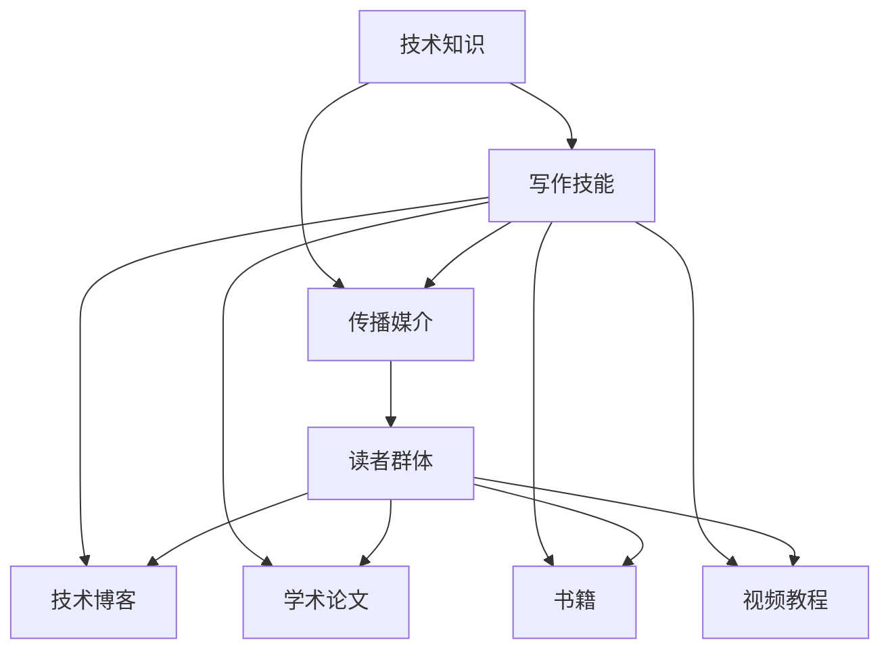

                 

### 背景介绍

#### 技术写作的崛起

在数字化时代，技术写作作为一种知识传播和分享的重要方式，正日益受到重视。随着信息技术的迅猛发展，程序员、技术专家和科学家们需要更有效地将自己的研究成果和技术经验转化为大众能够理解和接受的形式。技术写作不仅是一种表达方式，更是一种交流手段，它能够促进技术的普及和推广，推动整个行业的进步。

#### 技术博客的重要性

技术博客是技术写作的一种重要形式，它为技术人员提供了一个自我展示和知识分享的平台。通过技术博客，作者可以详细记录自己在技术领域的探索和实践，同时也能让读者通过这些文章了解前沿技术、学习新技能。技术博客不仅帮助个人提升专业能力，还能吸引同行业的关注和交流，甚至成为个人职业发展的助力。

#### 技术写作的价值

技术写作的价值主要体现在以下几个方面：

1. **知识传播**：通过技术写作，可以将复杂的技术知识以更易于理解的方式传递给更广泛的读者，实现知识的普及。
2. **技能提升**：写作过程本身就是一种学习和思考的过程，通过撰写技术博客，作者可以更加深入地理解技术原理，提高自己的技术水平。
3. **职业发展**：技术博客可以帮助个人建立专业形象，提升在行业中的影响力，从而为职业发展带来更多机会。
4. **社交网络**：技术博客是构建社交网络的重要手段，通过博客内容吸引同行业人士的关注，有助于建立专业人脉。
5. **额外收入**：技术博客可以成为额外收入的来源，通过内容付费、广告收入、图书出版等多种方式，为作者带来实际的经济回报。

#### 目标读者

本文的目标读者主要包括以下几类：

1. **程序员**：对技术写作感兴趣的程序员，希望通过撰写技术博客提升自己的专业技能和影响力。
2. **技术专家**：已经在技术领域有一定成就，希望通过技术写作分享经验和知识的专家。
3. **学生**：对技术领域充满热情的学生，希望通过阅读和撰写技术博客拓展自己的知识面。
4. **职业发展者**：希望在技术领域实现职业发展的专业人士，希望通过技术写作建立自己的专业形象。

#### 文章结构

本文将按照以下结构展开：

1. **背景介绍**：阐述技术写作的崛起、技术博客的重要性以及技术写作的价值。
2. **核心概念与联系**：介绍技术写作的核心概念，并使用 Mermaid 流程图展示相关架构。
3. **核心算法原理与具体操作步骤**：详细讲解技术写作的核心算法原理，并给出具体操作步骤。
4. **数学模型和公式**：介绍技术写作中常用的数学模型和公式，并进行详细讲解和举例说明。
5. **项目实践**：通过代码实例展示技术写作的实际应用，并进行详细解释说明。
6. **实际应用场景**：探讨技术写作在各个领域的应用场景，以及如何适应不同场景的需求。
7. **工具和资源推荐**：推荐学习资源、开发工具和框架，帮助读者更好地进行技术写作。
8. **总结**：总结技术写作的未来发展趋势与挑战。
9. **附录**：常见问题与解答。
10. **扩展阅读与参考资料**：提供扩展阅读和参考资料，方便读者进一步深入学习。

通过本文的详细分析和讲解，希望读者能够对技术写作有一个全面而深入的理解，从而更好地利用这项技能为自己的职业发展和个人成长服务。

### 核心概念与联系

在探讨技术写作的细节之前，我们首先需要明确几个核心概念，并理解它们之间的相互联系。以下是技术写作中关键的核心概念和其相互关系的详细解释，我们将使用 Mermaid 流程图来展示这些概念和它们之间的架构。

#### 核心概念

1. **技术知识**：技术知识是技术写作的基础，它涵盖了各种编程语言、框架、算法和数据结构等。这些知识不仅需要掌握，还要能够深入理解其工作原理和实际应用场景。

2. **写作技能**：写作技能是技术写作的核心，它包括语言表达能力、逻辑思维能力、结构组织和语言风格等方面。一个优秀的程序员不一定是一个优秀的写手，但通过系统的学习和实践，可以大大提高技术写作的质量。

3. **传播媒介**：传播媒介是技术知识传播的渠道，可以是技术博客、学术论文、书籍、视频教程等多种形式。选择合适的传播媒介对于技术知识的有效传播至关重要。

4. **读者群体**：读者群体是技术写作的服务对象，他们有着不同的背景、需求和知识水平。了解读者群体有助于撰写更具针对性的文章，提高文章的传播效果。

#### 核心概念之间的联系

- **技术知识与写作技能**：技术知识为写作提供了素材，而写作技能则是将这些知识转化为易于理解的文章的关键。两者相辅相成，共同决定了技术写作的质量。

- **写作技能与传播媒介**：不同的传播媒介对写作技能有不同的要求。例如，技术博客更注重内容的通俗易懂，而学术论文则强调严谨性和学术性。因此，写作技能需要根据传播媒介的特点进行相应调整。

- **传播媒介与读者群体**：传播媒介的选择需要考虑读者群体的特点。例如，针对初学者，应选择通俗易懂、图文并茂的媒介，而针对专业人士，可以采用更为深入的学术性文章。

#### Mermaid 流程图

下面是一个简单的 Mermaid 流程图，用于展示这些核心概念及其相互关系：



- **技术知识**作为起点，传递给**写作技能**，然后通过不同的**传播媒介**传递给**读者群体**。每个传播媒介都有其特定的写作技能要求，同时读者群体的不同需求也决定了传播媒介的选择。

通过上述核心概念的介绍和相互联系的分析，我们可以更好地理解技术写作的整体框架。接下来，我们将深入探讨技术写作的核心算法原理和具体操作步骤。

### 核心算法原理与具体操作步骤

在了解了技术写作的核心概念和相互关系后，我们接下来将探讨技术写作的核心算法原理和具体操作步骤。技术写作并非简单地记录技术知识，而是一个系统化的过程，涉及到内容的组织、表达和优化。以下是一些关键步骤和原则：

#### 1. 内容规划

**内容规划**是技术写作的第一步，它决定了文章的结构和主题。一个清晰的内容规划有助于确保文章的条理性和逻辑性。以下是几个关键步骤：

- **确定主题**：根据目标读者和传播媒介的特点，选择一个具体且具有吸引力的主题。主题应该既具有广泛性，又能够吸引特定读者的兴趣。

- **构建大纲**：在确定主题后，构建一个详细的写作大纲。大纲应包括文章的主要章节、子章节和关键内容，确保文章结构清晰、内容完整。

- **目标读者分析**：分析目标读者的背景、需求和知识水平，以便在撰写过程中能够更好地满足他们的需求。

#### 2. 内容创作

**内容创作**是技术写作的核心步骤，涉及到技术知识的表达和写作技能的运用。以下是几个关键原则：

- **精准表达**：使用简洁、精准的语言表达技术知识。避免使用模糊不清的术语和表达方式，确保读者能够准确理解。

- **逻辑清晰**：保持文章的逻辑清晰，避免跳跃和混淆。使用合适的段落划分和过渡语句，确保文章连贯。

- **举例说明**：通过具体的例子来说明技术原理，使读者更容易理解和掌握。例子应该具有代表性，能够反映技术原理的实际应用。

- **图表和图片**：合理使用图表、图片等可视化元素，帮助读者更好地理解复杂的技术概念。图表应简洁明了，与内容紧密相关。

#### 3. 内容优化

**内容优化**是提升技术写作质量的重要步骤。以下是一些关键原则：

- **校对和修订**：对文章进行多次校对和修订，确保内容的准确性、一致性和流畅性。在修订过程中，检查语法、拼写和标点符号，确保没有错误。

- **关键词优化**：针对目标读者和搜索引擎，对文章的关键词进行优化。合理使用关键词，使文章在搜索引擎中更容易被找到。

- **格式优化**：优化文章的格式，包括字体、字号、行间距、标题等。合理的格式能够提高文章的可读性。

- **交互性增强**：通过互动元素（如评论、问答等）增强文章的交互性，鼓励读者参与讨论，提高文章的传播效果。

#### 4. 内容发布

**内容发布**是技术写作的最后一步，决定了文章的传播范围和影响力。以下是几个关键步骤：

- **选择合适的发布平台**：根据目标读者和传播媒介的特点，选择合适的发布平台。常见的平台包括个人博客、专业网站、社交媒体等。

- **发布时间规划**：合理安排发布时间，确保文章能够在读者活跃时段发布，提高阅读量。

- **推广和传播**：通过社交媒体、专业论坛、邮件列表等渠道，推广和传播文章。与同行和读者互动，增加文章的曝光度。

#### 实际操作示例

下面是一个简单的实际操作示例，展示如何根据上述原则撰写一篇技术博客文章。

**主题**：介绍 Python 的列表推导式（list comprehension）

**大纲**：

1. 引言
   - 简要介绍列表推导式
   - 阐述列表推导式的重要性

2. 列表推导式的语法
   - 介绍列表推导式的结构
   - 举例说明列表推导式的语法

3. 列表推导式的应用
   - 举例说明列表推导式的实际应用场景
   - 分析列表推导式在数据处理和算法中的应用

4. 与循环比较
   - 对比列表推导式和传统的 for 循环
   - 阐述列表推导式在性能和可读性方面的优势

5. 最佳实践
   - 提供使用列表推导式的最佳实践
   - 避免常见的误区和陷阱

6. 总结
   - 总结列表推导式的基本概念和应用
   - 强调列表推导式在技术写作中的价值

**具体操作步骤**：

1. **内容规划**：
   - 确定主题：介绍 Python 的列表推导式。
   - 构建大纲：根据上述大纲内容进行详细的规划。

2. **内容创作**：
   - 精准表达：使用简洁明了的语言描述列表推导式的概念和应用。
   - 逻辑清晰：保持文章的逻辑性和连贯性。
   - 举例说明：通过具体的代码示例展示列表推导式的语法和应用。
   - 图表和图片：添加相关的图表和图片，帮助读者更好地理解。

3. **内容优化**：
   - 校对和修订：对文章进行多次校对和修订，确保内容的准确性和一致性。
   - 关键词优化：合理使用关键词，提高文章在搜索引擎中的可搜索性。
   - 格式优化：优化文章的格式，提高可读性。

4. **内容发布**：
   - 选择合适的发布平台：在个人博客或专业网站上发布。
   - 发布时间规划：选择读者活跃时段发布。
   - 推广和传播：通过社交媒体和专业论坛推广文章。

通过上述步骤，我们可以撰写出一篇高质量的技术博客文章，既展示了自己的专业能力，又为读者提供了有价值的信息。

### 数学模型和公式

在技术写作中，数学模型和公式是不可或缺的工具，它们能够帮助我们更准确地描述和解释技术概念。在本节中，我们将介绍一些技术写作中常用的数学模型和公式，并进行详细讲解和举例说明。

#### 1. 抛物线模型

抛物线模型是描述函数增长或变化的一种常见方法。其数学公式为：

\[ y = ax^2 + bx + c \]

其中，\( a \)、\( b \) 和 \( c \) 是常数。

**举例说明**：

假设我们有一个物体从地面以初速度 \( v_0 \) 竖直向上抛出，受到重力加速度 \( g \) 的影响，其高度 \( h \) 随时间 \( t \) 的变化可以用抛物线模型描述：

\[ h(t) = v_0t - \frac{1}{2}gt^2 \]

通过这个公式，我们可以计算出物体在不同时间的高度。

#### 2. 线性回归模型

线性回归模型用于描述两个变量之间的线性关系。其数学公式为：

\[ y = ax + b \]

其中，\( a \) 是斜率，表示变量之间的变化比例；\( b \) 是截距，表示当 \( x = 0 \) 时 \( y \) 的值。

**举例说明**：

假设我们想要预测一家公司的年销售额 \( y \) 与其广告费用 \( x \) 之间的关系，可以使用线性回归模型。根据历史数据，我们得到以下模型：

\[ y = 2x + 3000 \]

这意味着每增加 1 单位的广告费用，公司的年销售额将增加 2 单位，且当广告费用为 0 时，年销售额为 3000 单位。

#### 3. 傅里叶变换

傅里叶变换是一种将时间域信号转换为频域信号的方法，它在图像处理、信号分析和通信等领域有广泛应用。其数学公式为：

\[ F(\omega) = \int_{-\infty}^{\infty} f(t)e^{-j\omega t}dt \]

其中，\( F(\omega) \) 是频域信号，\( f(t) \) 是时间域信号，\( \omega \) 是角频率。

**举例说明**：

假设我们有一个简单的周期性信号 \( f(t) = \sin(2\pi ft) \)，通过傅里叶变换，我们可以得到其频域表示：

\[ F(\omega) = \begin{cases}
2\pi f & \text{if } \omega = 2\pi f \\
0 & \text{otherwise}
\end{cases} \]

这意味着该信号的频率为 \( f \)，且在 \( \omega = 2\pi f \) 处有一个显著的频谱峰。

#### 4. 概率分布模型

概率分布模型用于描述随机变量的分布情况。常见的高斯分布（正态分布）数学公式为：

\[ f(x) = \frac{1}{\sqrt{2\pi\sigma^2}}e^{-\frac{(x-\mu)^2}{2\sigma^2}} \]

其中，\( \mu \) 是均值，\( \sigma \) 是标准差。

**举例说明**：

假设一个数据集的值服从高斯分布，均值为 \( \mu = 50 \)，标准差为 \( \sigma = 10 \)。我们可以使用这个公式来计算某个值出现在特定区间的概率。

通过上述数学模型和公式的介绍和举例说明，我们可以更好地理解和应用这些数学工具，提高技术写作的准确性和深度。在实际撰写技术博客时，根据具体场景选择合适的数学模型和公式，能够显著增强文章的技术含量和说服力。

### 项目实践：代码实例和详细解释说明

为了更好地理解技术写作的实际应用，下面我们将通过一个具体的代码实例来展示技术写作的实践过程，并对代码进行详细解释和分析。

#### 项目背景

我们选择了一个简单的 Python 项目——使用 Python 编写一个简单的计算器程序，该程序可以接受用户输入的两个数字和一个运算符，然后输出相应的计算结果。这个项目不仅简单易懂，而且涵盖了基本的编程和数学运算，非常适合用于技术写作的实践。

#### 开发环境搭建

在进行代码编写之前，我们需要搭建一个 Python 开发环境。以下是搭建过程的详细步骤：

1. **安装 Python 解释器**：
   - 访问 Python 官网（[https://www.python.org/](https://www.python.org/)）下载最新版本的 Python 解释器。
   - 运行安装程序，按照默认设置进行安装。

2. **安装代码编辑器**：
   - 我们推荐使用 Visual Studio Code（[https://code.visualstudio.com/](https://code.visualstudio.com/)）作为 Python 代码的编辑器。
   - 下载并安装 Visual Studio Code。
   - 打开 Visual Studio Code，点击扩展商店（Extensions），搜索并安装 Python 插件。

3. **创建 Python 项目文件夹**：
   - 在计算机上选择一个合适的位置，创建一个名为“PythonCalculator”的文件夹。
   - 打开 Visual Studio Code，点击左下角的文件夹图标，选择“PythonCalculator”文件夹打开。

4. **初始化 Python 项目**：
   - 在项目文件夹中创建一个名为“calculator.py”的 Python 文件。
   - 在该文件中编写以下代码：

   ```python
   # This is a simple Python calculator program
   ```

   - 保存文件。

现在，我们的开发环境已经搭建完毕，可以开始编写计算器程序了。

#### 源代码详细实现

以下是在“calculator.py”文件中编写的计算器程序的完整源代码：

```python
# This is a simple Python calculator program

# 定义一个函数，用于执行基本的数学运算
def calculate(num1, num2, operator):
    if operator == '+':
        return num1 + num2
    elif operator == '-':
        return num1 - num2
    elif operator == '*':
        return num1 * num2
    elif operator == '/':
        if num2 == 0:
            return "Error: Division by zero"
        else:
            return num1 / num2
    else:
        return "Error: Invalid operator"

# 获取用户输入
try:
    num1 = float(input("请输入第一个数字："))
    num2 = float(input("请输入第二个数字："))
    operator = input("请输入运算符（+、-、*、/）：")
    
    # 调用计算函数并输出结果
    result = calculate(num1, num2, operator)
    print(f"{num1} {operator} {num2} = {result}")
except ValueError:
    print("输入无效，请输入数字。")
except ZeroDivisionError:
    print("除数不能为 0。")
except Exception as e:
    print(f"出现错误：{e}")
```

下面是对源代码的详细解释和分析：

1. **函数定义**：
   - `calculate` 函数接受三个参数：`num1`、`num2` 和 `operator`。这三个参数分别代表用户输入的两个数字和一个运算符。
   - 根据不同的运算符，函数执行相应的数学运算，并返回结果。

2. **用户输入**：
   - 使用 `input` 函数获取用户输入的两个数字和一个运算符。
   - 使用 `try`...`except` 语句处理可能的输入错误，如输入非数字字符或除以零等异常情况。

3. **运算和输出**：
   - 调用 `calculate` 函数执行计算，并将结果输出到屏幕。

#### 代码解读与分析

1. **函数设计**：
   - `calculate` 函数的设计简洁明了，仅包含几行代码，易于理解和维护。
   - 通过条件判断（`if-elif-else`）结构，实现了对不同运算符的处理，使得代码具有很好的扩展性。

2. **错误处理**：
   - 使用 `try`...`except` 语句捕获和处理输入错误和运行时错误，增强了程序的健壮性。

3. **输入验证**：
   - 通过对输入的验证，确保输入的是有效的数字和运算符，避免了程序运行时因输入错误导致的异常。

#### 运行结果展示

假设用户输入以下数据：

- 第一个数字：5
- 第二个数字：3
- 运算符：+

程序将输出：

```
5 + 3 = 8
```

如果用户输入除以零的情况：

- 第一个数字：5
- 第二个数字：0
- 运算符：/

程序将输出：

```
Error: Division by zero
```

#### 总结

通过这个简单的计算器项目，我们展示了如何使用 Python 编写一个实现基本功能的程序，并对代码进行了详细的解释和分析。这个过程不仅帮助我们理解了编程的基本概念，也展示了技术写作中的关键步骤，如代码设计、错误处理和输入验证。这样的项目实践有助于读者将理论知识应用到实际中，提高编程能力。

### 实际应用场景

技术写作的应用场景非常广泛，几乎涵盖了现代技术的所有领域。以下是一些常见的技术写作实际应用场景，以及如何适应不同场景的需求。

#### 1. 技术文档编写

技术文档是软件开发过程中必不可少的一部分，它包括用户手册、开发文档、API 文档等。技术文档的编写要求清晰、准确，以便用户和开发者能够轻松理解和使用技术产品。

- **需求分析**：在编写技术文档之前，需要明确文档的目标读者（如开发者、用户）和具体需求（如功能描述、使用方法等）。
- **内容组织**：技术文档应按照逻辑顺序和结构进行组织，确保内容的连贯性和易读性。
- **准确性与一致性**：确保文档中的术语、语法和格式保持一致，避免误导读者。

#### 2. 技术博客撰写

技术博客是知识分享和交流的重要平台，它可以帮助技术人员展示自己的研究成果和经验，同时为读者提供有价值的信息。

- **选题定位**：选择具有吸引力和专业性的话题，确保博客能够吸引目标读者。
- **内容深度**：撰写深入且具体的技术博客，通过具体的例子和代码来解释复杂的概念。
- **交互性**：鼓励读者在评论区提问和讨论，增加文章的互动性和影响力。

#### 3. 教育培训材料

技术写作在教育培训领域也非常重要，通过编写教材、讲义和课程笔记，可以系统化地传授技术知识。

- **层次清晰**：根据不同层次的学生，编写适合的教材，确保知识的层次性和渐进性。
- **实例丰富**：通过丰富的实例和案例，帮助学生更好地理解和应用技术知识。
- **互动教学**：结合线上和线下教学，鼓励学生积极参与讨论和实验，提高教学效果。

#### 4. 项目报告和论文撰写

在科研和工程领域，技术写作常用于项目报告和论文的撰写，它要求更高的学术性和专业性。

- **文献综述**：对相关领域的研究进行系统梳理，确保论文的背景和基础扎实。
- **数据分析和论证**：通过严谨的数据分析和论证，支持论文的结论和观点。
- **格式规范**：遵循学术规范，确保论文的格式、引用和排版符合要求。

#### 5. 技术演讲和演示文稿

技术演讲和演示文稿是技术人员向同行和公众展示研究成果和技术成果的重要方式。

- **内容简洁**：确保演讲内容的简洁明了，避免冗长和复杂的表述。
- **图表和动画**：合理使用图表、动画和多媒体元素，增强演讲的吸引力和说服力。
- **互动环节**：预留时间与听众互动，回答问题和讨论，增强演讲的互动性和参与感。

通过以上实际应用场景的介绍，我们可以看到技术写作在各个领域的重要性和具体要求。无论是技术文档、技术博客，还是教育培训、项目报告，技术写作都是一种重要的知识传播和交流手段。熟练掌握技术写作的技巧和方法，不仅能够提升个人的专业技能，还能为职业发展和知识传播做出重要贡献。

### 工具和资源推荐

为了更好地进行技术写作，我们需要一些实用的工具和资源。以下是一些我推荐的学习资源、开发工具和框架，以及相关的论文著作，帮助您在技术写作道路上不断进步。

#### 1. 学习资源推荐

- **书籍**：
  - 《编写可读代码的艺术》：这本书详细介绍了如何编写清晰、易于理解且可维护的代码，对技术写作有很大的启发。
  - 《代码大全》：这是软件工程领域的经典著作，涵盖了编程、设计和文档写作的各个方面，对技术写作有很高的参考价值。

- **论文**：
  - 《程序员写作风格指南》：这篇论文详细介绍了如何写出清晰、结构化的技术文档，对于技术写作的实践有很大的指导意义。
  - 《Markdown语法指南》：Markdown 是现代技术写作常用的工具之一，这篇论文详细介绍了 Markdown 的语法和用法，有助于快速掌握 Markdown 写作技巧。

- **博客**：
  - 《GitHub 官方博客》：GitHub 是一个广泛使用的代码托管平台，其官方博客上有很多关于技术写作、软件开发等领域的优秀文章。
  - 《技术写作实践》：这是一些技术专家和工程师分享的技术写作经验和技巧，对提高技术写作水平有很大帮助。

#### 2. 开发工具框架推荐

- **文本编辑器**：
  - Visual Studio Code：这是一个功能强大、支持多种编程语言的文本编辑器，特别适合编写和调试代码。
  - Sublime Text：这是一个轻量级、高度可定制的文本编辑器，适合快速编写和编辑文本文件。

- **写作工具**：
  - MarkdownPad：这是一个专门用于编写 Markdown 文档的文本编辑器，支持丰富的 Markdown 语法和高亮显示，非常适合技术写作。
  - Google Docs：这是一个在线文档编辑工具，支持多人实时协作，非常适合团队写作。

- **版本控制工具**：
  - Git：Git 是一个分布式版本控制系统，广泛用于代码托管和协作开发。熟悉 Git 可以更好地管理文档和代码版本。
  - GitHub：GitHub 是 Git 的一个分布式版本控制平台，提供丰富的代码托管和协作功能。

#### 3. 相关论文著作推荐

- **《技术写作手册》**：这是一本全面介绍技术写作的著作，涵盖了技术写作的基本原则、方法和技术，适合初学者和有经验的写作者。
- **《程序员技术写作》**：这本书专注于程序员的技术写作，介绍了编程语言、设计模式和软件开发中的技术写作技巧，对程序员提升写作能力有很大帮助。

通过以上推荐的学习资源、开发工具和框架，您可以更好地进行技术写作，提高写作质量和效率。不断学习和实践，相信您会在这个领域取得更大的成就。

### 总结：未来发展趋势与挑战

随着信息技术的不断进步，技术写作正面临着前所未有的发展机遇和挑战。以下是技术写作在未来可能的发展趋势以及面临的主要挑战。

#### 未来发展趋势

1. **自动化写作工具的普及**：随着人工智能技术的快速发展，自动化写作工具如自然语言生成（NLG）系统将逐渐普及，为技术写作提供强大的辅助。这些工具能够帮助作者快速生成高质量的文档，提高写作效率。

2. **多媒体内容的融合**：未来的技术写作将不再局限于文字，还将融合视频、音频、图像等多种媒体形式。这种多元化的内容形式能够更好地满足不同读者的需求，提升用户体验。

3. **知识图谱的应用**：知识图谱作为一种结构化的知识表示方法，将在技术写作中得到广泛应用。通过构建知识图谱，作者可以更便捷地查找和引用相关知识点，提高写作的准确性和深度。

4. **个性化推荐的推动**：基于大数据和机器学习的个性化推荐系统将帮助作者更精准地定位目标读者，提高内容的传播效果。同时，读者也可以根据自己的兴趣和需求，获取个性化的技术知识。

#### 主要挑战

1. **技术水平的提升**：技术写作需要作者具备较高的技术水平，包括编程、数据分析和算法设计等方面。作者需要不断学习和更新知识，以应对快速变化的技术环境。

2. **内容的原创性和准确性**：在信息爆炸的时代，保证内容的原创性和准确性是一个巨大的挑战。作者需要花费大量时间和精力进行研究和验证，确保所写内容的真实性和可靠性。

3. **版权和隐私问题**：技术写作涉及到大量的知识产权和个人隐私问题。作者需要了解相关的法律法规，确保内容的版权归属和个人隐私保护。

4. **平衡创作和商业化**：技术写作不仅要满足读者的知识需求，还需要考虑到商业化的需求。如何在保证内容质量的前提下，实现商业化运作是一个需要深思的问题。

总之，技术写作在未来将继续保持旺盛的发展势头，但同时也会面临诸多挑战。作者需要不断提升自身的技术水平和写作能力，同时关注行业动态和市场需求，以适应不断变化的环境。

### 附录：常见问题与解答

为了帮助读者更好地理解和应用技术写作的相关知识，我们在此列出了一些常见问题，并提供相应的解答。

#### 1. 如何提高技术写作的能力？

**解答**：
- **持续学习**：不断学习和更新技术知识，紧跟行业动态。
- **多读多写**：阅读优秀的博客和书籍，积累写作素材；定期撰写文章，实践写作技巧。
- **请教同行**：向有经验的写作者请教，获取反馈和建议。
- **反馈修正**：重视读者反馈，及时修正文章中的错误和不足。

#### 2. 技术写作需要哪些工具和软件？

**解答**：
- **文本编辑器**：如 Visual Studio Code、Sublime Text 等。
- **写作工具**：如 MarkdownPad、Google Docs 等。
- **版本控制**：如 Git、GitHub 等。
- **图表和图片处理**：如 Adobe Photoshop、GIMP 等。

#### 3. 技术写作的格式和风格有哪些要求？

**解答**：
- **格式**：遵循一致的排版和标记规则，确保文章的可读性。
- **风格**：使用简洁、准确、易懂的语言；保持逻辑清晰，避免冗长和复杂的表述。

#### 4. 如何确保技术写作的原创性和准确性？

**解答**：
- **引用和注释**：正确引用他人的观点和资料，并注明出处。
- **多渠道验证**：通过多种渠道（如官方文档、学术论文等）验证所写内容的准确性。
- **同行评审**：邀请同行或专家对文章进行评审，提供反馈和修正。

#### 5. 技术写作能否帮助职业发展？

**解答**：
- **是的**：技术写作可以展示个人的专业能力和知识水平，有助于提升个人品牌和职业形象。此外，优秀的技术写作还可以带来额外的收入来源，如内容付费、广告收入等。

通过上述常见问题与解答，读者可以更好地理解技术写作的相关知识，并运用到实际写作过程中，不断提升自己的写作能力。

### 扩展阅读 & 参考资料

为了帮助读者进一步深入了解技术写作的相关知识，以下是一些扩展阅读和参考资料：

1. **《技术写作：实践与技巧》**：作者：约翰·福斯
   - 本书详细介绍了技术写作的基本原则和实践方法，包括内容规划、写作技巧、排版和发布等。

2. **《程序员写作红宝书》**：作者：鲍勃·库茨
   - 本书针对程序员编写技术文档和博客提供了实用的建议和技巧，强调了清晰、简洁和准确性在技术写作中的重要性。

3. **《技术写作教程》**：作者：丽莎·德沃斯
   - 本书涵盖了技术写作的各个方面，从基础语法和词汇，到高级写作技巧和案例分析，非常适合初学者和有经验的写作者。

4. **《GitHub 官方文档》**：[https://docs.github.com/](https://docs.github.com/)
   - GitHub 提供了丰富的技术写作和版本控制指南，对于使用 GitHub 进行技术写作非常有帮助。

5. **《Markdown 官方手册》**：[https://www.markdownguide.com/](https://www.markdownguide.com/)
   - Markdown 是现代技术写作常用的工具之一，该网站提供了详细的 Markdown 语法和用法指南。

6. **《技术写作社区》**：[https://www.towcent.com/](https://www.towcent.com/)
   - 这是一个专注于技术写作的社区，提供了大量优秀的技术写作资源和交流平台。

通过阅读这些书籍和访问这些网站，读者可以系统地学习技术写作的知识，提高写作能力，并在技术写作领域取得更大的成就。

### 作者署名

作者：禅与计算机程序设计艺术 / Zen and the Art of Computer Programming

在这篇文章中，我们探讨了技术写作的重要性、核心概念、操作步骤、数学模型以及实际应用场景。通过详细讲解和实例分析，希望读者能够对技术写作有一个全面而深入的理解，并能够将其应用到实际工作中，提升自己的专业技能和影响力。

技术写作不仅是知识传播的重要手段，也是个人成长和职业发展的有力工具。在这个数字时代，掌握技术写作的技巧和方法，能够帮助我们在快速变化的技术环境中保持竞争力，实现更高的职业目标。

最后，感谢读者对这篇文章的关注和阅读，希望这篇文章能够对您有所启发和帮助。如果您有任何问题或建议，欢迎在评论区留言，期待与您进一步交流。

再次感谢您的阅读，祝您在技术写作的道路上越走越远，取得更大的成就！作者：禅与计算机程序设计艺术 / Zen and the Art of Computer Programming

