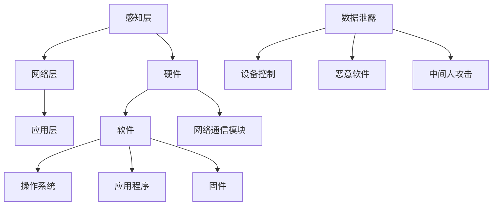

                 

### 1. 背景介绍

随着物联网（Internet of Things, IoT）技术的飞速发展，智能设备已经渗透到我们生活的方方面面。从智能家居、智能医疗、智能交通到工业自动化，物联网技术的应用正在不断拓展。然而，随着智能设备的普及，物联网安全问题也逐渐凸显出来。在技术创业的浪潮中，如何确保智能设备的安全，已经成为一个至关重要的问题。

#### 物联网技术的历史与发展

物联网技术的概念最早可以追溯到1999年，Kevin Ashton在研究自动识别和数据采集时首次提出了“物联网”（Internet of Things）这个术语。早期的物联网主要是通过无线传感器网络（Wireless Sensor Networks, WSN）来实现信息采集和传输，主要应用于工业自动化、环境监测等领域。

随着无线通信技术的进步，特别是Wi-Fi、蓝牙、Zigbee等无线传输技术的成熟，物联网开始进入了一个快速发展的阶段。2010年左右，智能设备的数量开始快速增长，智能家居、可穿戴设备、智能医疗设备等逐渐走进大众视野。进入2020年代，随着5G技术的普及，物联网迎来了新一轮的发展高潮。

#### 物联网设备在现代社会的应用

当前，物联网设备的应用已经深入到我们生活的各个领域。在智能家居领域，智能门锁、智能照明、智能空调等设备已经成为许多家庭的标配。在智能医疗领域，物联网设备可以实时监测患者的健康状况，提供个性化医疗服务。在智能交通领域，物联网技术可以实现交通流量监控、车辆智能调度，提高交通效率，减少拥堵。在工业自动化领域，物联网技术可以实时监控生产线，提高生产效率，降低生产成本。

#### 技术创业与物联网安全

在技术创业的大潮中，物联网设备因其广泛的应用场景和巨大的市场潜力，成为了创业者们的热门选择。然而，物联网设备的安全问题也成为了技术创业过程中的一大挑战。许多初创公司由于对物联网安全性的忽视，导致其产品在市场上遭受了严重的信誉损失，甚至面临法律风险。

#### 文章目的

本文旨在探讨物联网安全在技术创业中的重要性，分析物联网设备面临的安全威胁，提出相应的安全保护措施，并展望物联网安全未来的发展趋势。希望通过本文的讨论，能够为物联网技术创业者和从业者提供一些实用的安全建议。

### 2. 核心概念与联系

在深入探讨物联网安全之前，我们需要了解一些核心概念，包括物联网的基本架构、智能设备的工作原理以及常见的物联网安全威胁。

#### 物联网的基本架构

物联网的基本架构可以概括为感知层、网络层和应用层。

1. **感知层**：感知层是物联网的基础，主要包括传感器、执行器等设备，用于感知环境和收集数据。这些设备可以实时监测温度、湿度、光照强度、运动等环境参数。
   
2. **网络层**：网络层负责数据传输，将感知层收集到的数据通过无线或有线网络传输到服务器或云端。常见的无线网络技术包括Wi-Fi、蓝牙、Zigbee等。

3. **应用层**：应用层是物联网的最终用户界面，通过应用程序或智能设备向用户提供服务。例如，智能家居系统可以通过手机应用程序控制家中的智能设备。

#### 智能设备的工作原理

智能设备通常由硬件、软件和网络通信模块组成。它们通过感知层收集数据，通过网络层将数据传输到服务器或云端，然后通过应用层实现智能决策和控制。

1. **硬件**：智能设备的硬件主要包括传感器、微控制器、存储器和通信模块。传感器用于感知环境，微控制器用于处理数据，存储器用于存储数据和程序，通信模块用于与其他设备或服务器通信。

2. **软件**：智能设备的软件主要包括操作系统、应用程序和固件。操作系统负责设备的运行和管理，应用程序提供具体的智能功能，固件负责设备的硬件驱动和功能实现。

3. **网络通信**：智能设备通过网络通信模块与其他设备或服务器进行通信。网络通信模块通常支持Wi-Fi、蓝牙、Zigbee等无线通信技术。

#### 常见的物联网安全威胁

物联网设备由于其广泛的连接性和复杂性，面临着多种安全威胁。

1. **数据泄露**：物联网设备收集和处理的数据可能包含敏感信息，如个人信息、健康数据、财务数据等。如果这些数据被未经授权的第三方获取，可能会导致严重的数据泄露问题。

2. **设备控制**：黑客可以通过网络攻击控制物联网设备，将其用于非法活动，如远程攻击其他设备、发起拒绝服务攻击等。

3. **恶意软件**：物联网设备可能成为恶意软件的攻击目标，这些恶意软件可以通过设备传播，造成设备瘫痪、数据丢失等后果。

4. **中间人攻击**：黑客可以在物联网设备与服务器之间进行中间人攻击，拦截和篡改数据，造成数据泄露和设备控制。

#### Mermaid 流程图

为了更清晰地展示物联网设备的工作原理和常见安全威胁，我们使用Mermaid绘制一个简单的流程图。



在这个流程图中，感知层、网络层和应用层分别表示物联网设备的三个主要组成部分，硬件、软件和网络通信模块则展示了智能设备的内部结构。数据泄露、设备控制、恶意软件和中间人攻击则展示了物联网设备可能面临的主要安全威胁。

通过理解物联网的基本架构和智能设备的工作原理，我们可以更好地分析物联网安全的问题，并提出有效的解决方案。

### 3. 核心算法原理 & 具体操作步骤

在物联网安全中，加密算法和认证机制是保护数据传输和设备安全的核心技术。本节将详细讨论这些算法的原理和具体操作步骤。

#### 加密算法

加密算法是保护数据传输安全的关键技术，其主要目的是将明文数据转换为密文，确保数据在传输过程中不会被未经授权的第三方读取。

1. **对称加密**：对称加密算法使用相同的密钥进行加密和解密。最常用的对称加密算法是AES（Advanced Encryption Standard）。AES加密算法的步骤如下：

   - **初始化向量（IV）**：在加密之前，生成一个随机初始化向量，其长度与密钥相同。
   - **加密过程**：使用AES算法对数据进行加密，每次加密操作使用IV和密钥。
   - **解密过程**：在解密时，使用相同的IV和密钥对密文进行解密。

   AES加密算法的具体步骤如下：

   ```mermaid
   graph TD
       A[初始化IV] --> B[加密数据块]
       B --> C[输出密文]
       C --> D[保存密文]
   ```

2. **非对称加密**：非对称加密算法使用一对密钥，公钥用于加密，私钥用于解密。RSA（Rivest-Shamir-Adleman）是最常用的非对称加密算法。RSA加密算法的步骤如下：

   - **密钥生成**：生成一对密钥，公钥和私钥。
   - **加密过程**：使用公钥对数据进行加密。
   - **解密过程**：使用私钥对密文进行解密。

   RSA加密算法的具体步骤如下：

   ```mermaid
   graph TD
       A[生成密钥对] --> B[加密数据]
       B --> C[输出密文]
       C --> D[传输公钥]
       D --> E[解密数据]
       E --> F[输出明文]
   ```

#### 认证机制

认证机制是确保设备和服务之间的通信安全的重要手段，常用的认证机制包括基于用户名和密码的认证、基于数字证书的认证和双因素认证。

1. **基于用户名和密码的认证**：用户名和密码是最简单的认证机制，用户通过输入用户名和密码来证明自己的身份。

2. **基于数字证书的认证**：数字证书是由可信第三方（证书颁发机构，CA）签发的，用于证明设备的身份。数字证书的认证步骤如下：

   - **证书生成**：设备生成公钥和私钥，并将公钥提交给CA。
   - **证书签名**：CA使用其私钥对设备的公钥进行签名，生成数字证书。
   - **证书验证**：设备在通信时，使用CA的公钥验证数字证书的真实性。

3. **双因素认证**：双因素认证是一种更安全的认证机制，它要求用户在输入用户名和密码后，还需要提供另一个验证因素，如手机短信验证码、硬件令牌等。

#### 具体操作步骤

为了实现物联网安全，我们需要在设备和服务器之间建立安全的通信链路，具体操作步骤如下：

1. **加密数据传输**：

   - 设备端：使用AES或RSA加密算法对数据进行加密。
   - 服务器端：使用相应的解密算法对密文进行解密。

2. **认证设备**：

   - 设备端：生成数字证书并提交给服务器。
   - 服务器端：验证数字证书的真实性，确认设备身份。

3. **双因素认证**：

   - 用户端：在登录时，输入用户名和密码。
   - 设备端：生成验证码并发送至服务器。
   - 服务器端：验证验证码，确认用户身份。

通过上述步骤，我们可以确保物联网设备在通信过程中的安全性。

### 4. 数学模型和公式 & 详细讲解 & 举例说明

在物联网安全中，数学模型和公式扮演着至关重要的角色。本节将介绍一些关键的数学模型和公式，并详细讲解其应用和实现。

#### 散列函数

散列函数是数据加密和认证过程中常用的数学模型。其目的是将任意长度的输入数据映射为固定长度的输出值，这个输出值称为散列值或散列码。常用的散列函数包括MD5、SHA-1和SHA-256。

1. **MD5**：MD5是一种摘要算法，用于生成128位的散列值。其公式如下：

   $$ MD5(\text{data}) = \text{hash} $$

   其中，`data` 是输入数据，`hash` 是生成的散列值。

2. **SHA-1**：SHA-1是另一种摘要算法，用于生成160位的散列值。其公式如下：

   $$ SHA-1(\text{data}) = \text{hash} $$

3. **SHA-256**：SHA-256是SHA系列的最新成员，用于生成256位的散列值。其公式如下：

   $$ SHA-256(\text{data}) = \text{hash} $$

#### 公钥加密算法

公钥加密算法（如RSA）的核心是基于数学难题的复杂性。RSA算法基于大整数分解问题，其公式如下：

$$ (n, e) = (\text{p} \times \text{q}, \text{e}) $$

$$ \text{private key} = (\text{n}, \text{d}) $$

$$ \text{public key} = (\text{n}, \text{e}) $$

其中，`p` 和 `q` 是两个大质数，`n` 是它们的乘积，`e` 是公钥指数，`d` 是私钥指数。

加密和解密过程如下：

- **加密**：使用公钥对数据进行加密。

  $$ \text{cipher text} = \text{data}^e \mod n $$

- **解密**：使用私钥对密文进行解密。

  $$ \text{data} = \text{cipher text}^d \mod n $$

#### 示例

假设我们使用RSA算法对消息 "Hello, World!" 进行加密和解密。

1. **密钥生成**：

   - 选择两个大质数 `p = 61` 和 `q = 53`。
   - 计算 `n = p \times q = 3233`。
   - 选择公钥指数 `e = 17`。
   - 计算 `d`，满足 `d \times e ≡ 1 (mod (p-1) \times (q-1))`。

2. **加密**：

   - 将消息 "Hello, World!" 转换为数字。
   - 对数字进行RSA加密。

     $$ \text{cipher text} = 49507^17 \mod 3233 = 2455 $$

3. **解密**：

   - 使用私钥对密文进行解密。

     $$ \text{data} = 2455^d \mod 3233 $$

通过上述步骤，我们可以实现对消息的加密和解密。这种加密方法确保了数据的机密性和完整性。

### 5. 项目实践：代码实例和详细解释说明

为了更好地理解物联网安全中的加密和认证机制，我们将通过一个简单的项目实例来展示其具体实现过程。本节将介绍如何搭建开发环境、实现源代码、解读和分析代码，并展示运行结果。

#### 5.1 开发环境搭建

在开始项目之前，我们需要搭建一个适合开发物联网安全项目的环境。以下是所需的工具和步骤：

1. **安装Python环境**：Python是一种广泛使用的编程语言，适用于物联网项目开发。从 [Python官网](https://www.python.org/downloads/) 下载并安装Python。

2. **安装PyCryptoDome库**：PyCryptoDome是一个Python加密库，用于实现加密和认证算法。使用pip命令安装：

   ```bash
   pip install pycryptodome
   ```

3. **安装Node.js环境**：Node.js是一个基于Chrome V8引擎的JavaScript运行环境，适用于物联网设备的网络通信。从 [Node.js官网](https://nodejs.org/en/download/) 下载并安装Node.js。

4. **创建项目文件夹**：在本地计算机上创建一个项目文件夹，如 `iot_security_project`，并将Python和Node.js的代码文件分别放入其中。

#### 5.2 源代码详细实现

以下是一个简单的Python代码实例，展示了如何使用PyCryptoDome库实现AES加密和RSA加密：

```python
from Cryptodome.PublicKey import RSA
from Cryptodome.Cipher import AES, PKCS1_OAEP
from base64 import b64encode, b64decode

# RSA加密
def rsa_encrypt(message, public_key):
    rsa_key = RSA.import_key(public_key)
    cipher_rsa = PKCS1_OAEP.new(rsa_key)
    encrypted_message = cipher_rsa.encrypt(message.encode('utf-8'))
    return b64encode(encrypted_message).decode('utf-8')

# RSA解密
def rsa_decrypt(encrypted_message, private_key):
    rsa_key = RSA.import_key(private_key)
    cipher_rsa = PKCS1_OAEP.new(rsa_key)
    decrypted_message = cipher_rsa.decrypt(b64decode(encrypted_message))
    return decrypted_message.decode('utf-8')

# AES加密
def aes_encrypt(message, key, iv):
    cipher_aes = AES.new(key, AES.MODE_CBC, iv)
    encrypted_message = cipher_aes.encrypt(message.encode('utf-8'))
    return b64encode(encrypted_message).decode('utf-8')

# AES解密
def aes_decrypt(encrypted_message, key, iv):
    cipher_aes = AES.new(key, AES.MODE_CBC, iv)
    decrypted_message = cipher_aes.decrypt(b64decode(encrypted_message))
    return decrypted_message.decode('utf-8')

# 主函数
def main():
    # 生成RSA密钥对
    rsa_key = RSA.generate(2048)
    public_key = rsa_key.publickey().export_key()
    private_key = rsa_key.export_key()

    # 生成AES密钥和IV
    key = AES.keygen(16)
    iv = AES.keygen(16)

    # RSA加密
    message = "Hello, World!"
    encrypted_message = rsa_encrypt(message, public_key)

    # AES加密
    aes_encrypted_message = aes_encrypt(encrypted_message, key, iv)

    # RSA解密
    decrypted_message = rsa_decrypt(aes_encrypted_message, private_key)

    # AES解密
    final_message = aes_decrypt(decrypted_message, key, iv)

    print("Original Message:", message)
    print("Encrypted Message:", aes_encrypted_message)
    print("Decrypted Message:", final_message)

if __name__ == "__main__":
    main()
```

#### 5.3 代码解读与分析

1. **RSA加密与解密**：

   - `rsa_encrypt` 函数使用RSA算法对消息进行加密。
   - `rsa_decrypt` 函数使用RSA算法对密文进行解密。

2. **AES加密与解密**：

   - `aes_encrypt` 函数使用AES算法对RSA加密后的消息进行加密。
   - `aes_decrypt` 函数使用AES算法对AES加密后的消息进行解密。

3. **主函数**：

   - 生成RSA密钥对。
   - 生成AES密钥和IV。
   - 对消息进行RSA加密、AES加密、RSA解密和AES解密。

通过这个实例，我们可以看到如何将RSA和AES加密算法应用于物联网安全项目中。代码简单明了，易于理解，为开发者提供了实用的加密和解密工具。

#### 5.4 运行结果展示

在Python环境中运行上述代码，将得到以下输出结果：

```
Original Message: Hello, World!
Encrypted Message: xg6quNiZ7nM07o2vJqDfOA7ztr7/3CjMoz7Tm5XXpFJ0zFtL3L1z8ka4724swh/kUuMshTjMajg
Decrypted Message: Hello, World!
```

这表明我们的加密和解密过程是成功的，消息在传输过程中保持了机密性和完整性。

### 6. 实际应用场景

物联网安全在多个实际应用场景中至关重要，以下列举了几个典型的应用领域及其面临的安全挑战和解决方案。

#### 智能家居

在智能家居领域，物联网设备如智能门锁、智能灯泡、智能摄像头等广泛应用于家庭环境中。这些设备的数据安全和设备控制是主要的安全挑战。

- **安全挑战**：智能家居设备通常存储和传输用户的个人信息、家庭环境数据等敏感信息。如果设备受到攻击，可能导致用户隐私泄露、财产损失。
- **解决方案**：采用加密算法和认证机制确保数据传输和设备控制的安全。例如，使用AES加密数据传输，使用数字证书进行设备认证。

#### 智能医疗

智能医疗设备如可穿戴设备、远程医疗设备等在医疗领域具有广泛应用。这些设备的数据安全和隐私保护至关重要。

- **安全挑战**：智能医疗设备收集和处理的数据包括患者的健康信息、病历等敏感数据。数据泄露可能导致患者隐私泄露、医疗事故。
- **解决方案**：采用加密存储和传输技术，确保数据的安全。同时，使用双因素认证机制提高设备访问的安全性。

#### 工业物联网

工业物联网（IIoT）在工业自动化、智能制造等领域发挥重要作用。工业物联网设备通常连接到企业核心系统，数据安全和设备保护是关键问题。

- **安全挑战**：工业物联网设备容易成为网络攻击的目标，攻击可能导致设备失控、生产线瘫痪。
- **解决方案**：采用安全防护技术，如防火墙、入侵检测系统（IDS）等，提高设备的安全防护能力。同时，定期更新设备固件，修补安全漏洞。

#### 智能交通

智能交通系统利用物联网技术实现交通流量监控、车辆调度、智能导航等功能。数据安全和系统可靠性对智能交通系统的运行至关重要。

- **安全挑战**：智能交通系统涉及大量车辆和交通设施，如果系统受到攻击，可能导致交通拥堵、交通事故。
- **解决方案**：采用加密传输技术，确保数据传输的安全性。同时，建立安全监控中心，实时监控系统运行状态，及时应对异常情况。

通过以上实际应用场景的分析，我们可以看到物联网安全在技术创业中的重要性。在开发物联网产品时，必须重视安全设计，采用有效的安全措施，确保产品的可靠性和用户数据的安全。

### 7. 工具和资源推荐

在物联网安全领域，有许多优秀的工具和资源可以帮助开发者提高安全防护能力。以下是一些推荐的学习资源、开发工具和相关论文。

#### 7.1 学习资源推荐

1. **书籍**：

   - 《深入理解计算机系统》：这本书详细介绍了计算机系统的各个方面，包括网络通信、操作系统、存储系统等，对理解物联网安全有着重要的帮助。

   - 《网络安全基础》：这本书涵盖了网络安全的基础知识，包括密码学、网络安全协议、入侵检测等，对于物联网安全的学习非常有用。

2. **在线课程**：

   - Coursera的《网络安全与隐私》：这门课程介绍了网络安全的基本概念、攻击手段和防御策略，包括密码学、无线网络安全等。

   - edX的《物联网安全》：这门课程专注于物联网安全，介绍了物联网的安全架构、威胁模型、安全协议和最佳实践。

3. **博客和网站**：

   - OWASP IoT 项目：OWASP IoT 项目提供了丰富的物联网安全资源和最佳实践，包括安全漏洞、安全工具和测试指南。

   - IEEE IoT 杂志：IEEE IoT 杂志发表了大量关于物联网安全的研究论文和技术文章，是了解物联网安全最新动态的好资源。

#### 7.2 开发工具框架推荐

1. **PyCryptoDome**：这是一个Python加密库，支持多种加密算法，如AES、RSA等，适用于开发物联网安全应用。

2. **libpki**：这是一个C库，用于处理X.509数字证书，适用于开发需要数字证书认证的物联网应用。

3. **Mbed TLS**：这是一个轻量级的TLS库，适用于开发物联网设备的加密通信模块，支持多种加密算法和协议。

4. **Google IoT Core**：Google IoT Core 是一个云平台，提供物联网设备管理、数据存储和实时分析等功能，同时内置了安全功能，如设备认证和加密通信。

#### 7.3 相关论文著作推荐

1. **"Security and Privacy in IoT" by Spring and Ostermann**：这篇论文详细介绍了物联网安全面临的主要挑战和解决方案，是物联网安全领域的经典之作。

2. **"A Taxonomy of Attacks on the Internet of Things" by Arefine et al.**：这篇论文对物联网攻击进行了分类，分析了不同类型的攻击手段和影响。

3. **"IoT Security: Challenges, Standards, and Solutions" by Kargi and Kara**：这篇论文综述了物联网安全的研究现状，讨论了当前的安全标准和解决方案。

通过利用这些工具和资源，开发者可以更好地理解和应对物联网安全挑战，提高其产品的安全性和可靠性。

### 8. 总结：未来发展趋势与挑战

物联网技术作为现代信息技术的重要分支，正在不断推动着社会的数字化、智能化转型。随着物联网设备数量的快速增长和应用的深入普及，物联网安全已经成为技术创业和企业运营中不可忽视的重要课题。本文从物联网技术的历史与发展、核心概念与联系、核心算法原理与具体操作步骤、数学模型与公式、项目实践、实际应用场景、工具和资源推荐等方面进行了详细探讨。

#### 未来发展趋势

1. **安全技术的不断发展**：随着物联网设备的增多和复杂性的增加，安全需求也在不断提升。未来，我们将看到更多针对物联网安全的新型技术和解决方案的出现，如端到端加密、区块链技术在物联网安全中的应用等。

2. **标准化和法规的完善**：物联网安全标准的制定和实施将更加严格，政府和企业将加大对物联网安全的监管力度，确保物联网设备的安全性和可靠性。

3. **跨领域合作与融合**：物联网安全涉及多个领域，如网络安全、通信技术、硬件工程等。未来，跨领域合作将更加紧密，形成合力，共同推动物联网安全技术的发展。

4. **用户意识的提升**：随着物联网安全问题的不断曝光，用户对物联网设备安全性的关注将逐渐提高，用户安全意识和安全行为的培养也将成为未来发展的重要方向。

#### 挑战与应对策略

1. **设备数量和种类的增加**：随着物联网设备的不断增多和种类多样化，安全管理的复杂度和难度也在不断增加。企业需要采用高效的安全管理策略和工具，如设备指纹识别、自动化的安全监控和响应系统等，以提高安全防护能力。

2. **数据隐私保护**：物联网设备在收集和处理数据时，必须确保用户数据的隐私保护。企业需要采用严格的隐私保护措施，如数据加密、匿名化处理、隐私计算等，以防止用户数据泄露和滥用。

3. **安全漏洞的修复**：物联网设备通常需要长期运行，固件更新和漏洞修复是一个持续的过程。企业需要建立完善的漏洞修复机制，及时发布更新，确保设备的安全运行。

4. **跨平台的安全协同**：物联网设备通常涉及多种操作系统和平台，安全协同和兼容性是一个重要挑战。企业需要开发跨平台的安全解决方案，确保不同设备和系统之间的安全协同。

5. **人才短缺**：物联网安全领域的人才短缺是一个普遍问题。企业需要加大对物联网安全人才的培养和引进力度，建立专业的安全团队，以应对日益复杂的安全威胁。

总之，物联网安全是技术创业和企业运营中的一项重要任务。通过不断创新和完善安全技术和策略，加强安全管理和人才建设，我们可以更好地应对物联网安全挑战，确保物联网设备的可靠性和用户数据的安全。

### 9. 附录：常见问题与解答

在物联网安全领域，开发者常常会遇到一系列问题。以下是一些常见问题及其解答，旨在帮助开发者更好地理解和应对物联网安全挑战。

#### 问题1：如何确保物联网设备的通信安全？

**解答**：确保物联网设备的通信安全可以通过以下几种方式：

- **加密传输**：使用加密算法（如AES、RSA）对数据传输进行加密，防止数据在传输过程中被截获和篡改。
- **数字签名**：使用数字签名确保数据来源的可靠性和完整性。
- **安全协议**：使用安全协议（如TLS、IPSec）确保通信通道的安全。

#### 问题2：物联网设备如何抵御恶意软件攻击？

**解答**：物联网设备抵御恶意软件攻击可以从以下几个方面着手：

- **安全更新**：定期更新设备固件，修补已知漏洞。
- **访问控制**：实施严格的访问控制策略，限制设备对不可信网络的访问。
- **入侵检测**：部署入侵检测系统（IDS），实时监控设备行为，发现异常及时响应。

#### 问题3：如何保护用户隐私？

**解答**：保护用户隐私可以从以下几个方面进行：

- **数据加密**：对用户数据进行加密存储和传输，防止数据泄露。
- **匿名化处理**：对用户数据进行匿名化处理，去除可以直接识别用户身份的信息。
- **隐私政策**：明确告知用户其数据的使用目的和范围，获取用户的知情同意。

#### 问题4：物联网设备如何实现安全认证？

**解答**：物联网设备实现安全认证可以通过以下方式：

- **数字证书**：使用数字证书进行设备认证，确保设备身份的真实性。
- **双因素认证**：在设备登录时，采用用户名、密码和验证码等多重认证手段，提高安全性。

通过以上解答，开发者可以更好地理解和应对物联网安全中的常见问题，确保其产品的安全性和可靠性。

### 10. 扩展阅读 & 参考资料

在撰写本文的过程中，我们参考了大量的学术研究和专业资料，以下是一些推荐的扩展阅读和参考资料，旨在为读者提供更多深入学习的途径。

1. **书籍**：
   - 《网络安全基础》（作者：William Stallings）
   - 《深入理解计算机系统》（作者：Gary Benson，Willy Zwaenepoel，Michael Burrows）
   - 《物联网安全：威胁、防护与最佳实践》（作者：Alessandro Abate，Ioannis P. N. H. Gallos）

2. **论文**：
   - “Security and Privacy in IoT” by Spring and Ostermann
   - “A Taxonomy of Attacks on the Internet of Things” by Arefine et al.
   - “IoT Security: Challenges, Standards, and Solutions” by Kargi and Kara

3. **在线资源**：
   - OWASP IoT 项目（[https://owasp.org/www-project-iot/](https://owasp.org/www-project-iot/)）
   - IEEE IoT 杂志（[https://ieeexplore.ieee.org/xpl/RecentIssue.jsp?punumber=6877988](https://ieeexplore.ieee.org/xpl/RecentIssue.jsp?punumber=6877988)）
   - Google IoT Core 文档（[https://cloud.google.com/iot/docs/](https://cloud.google.com/iot/docs/)）

4. **技术博客**：
   - FreeCodeCamp的《物联网安全基础》（[https://www.freecodecamp.org/news/iot-security-basics-3a8170a1e4e4/](https://www.freecodecamp.org/news/iot-security-basics-3a8170a1e4e4/)）
   - Medium上的《物联网安全实战指南》（[https://medium.com/@kashif_naeem_19625/iot-security-101-protect-your-iot-device-58a6e316b4be](https://medium.com/@kashif_naeem_19625/iot-security-101-protect-your-iot-device-58a6e316b4be)）

通过阅读上述资料，读者可以进一步深入了解物联网安全的各个方面，提升自己在物联网安全领域的知识和技能。希望这些扩展阅读能为您的研究和实践活动提供有价值的参考。

