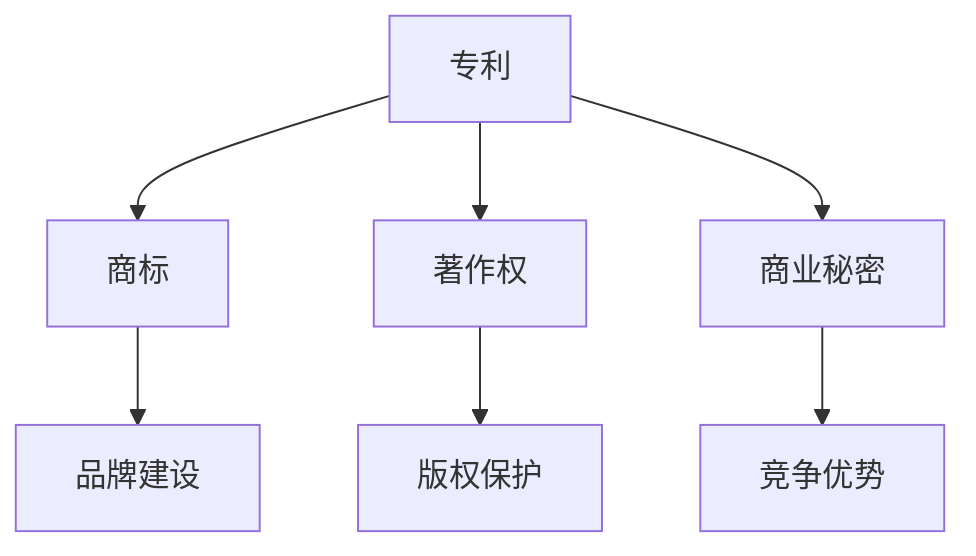
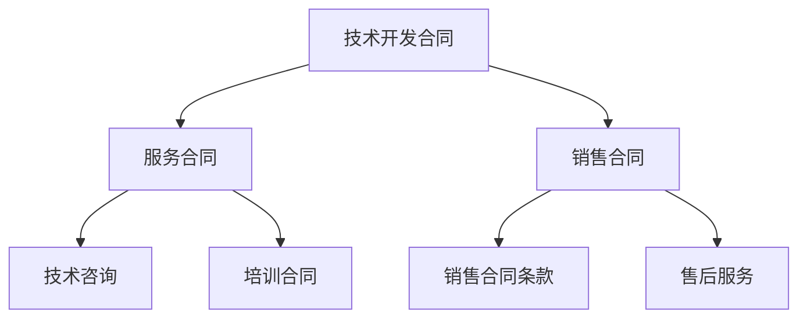
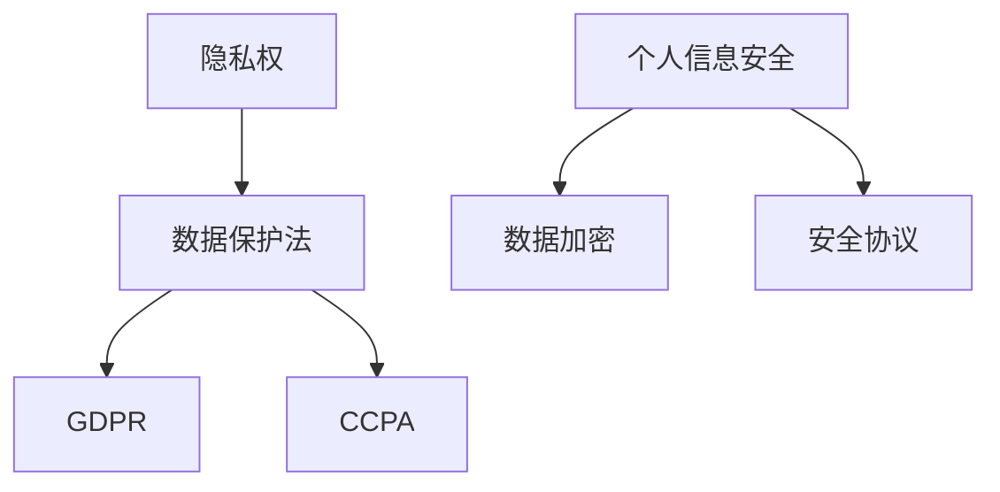
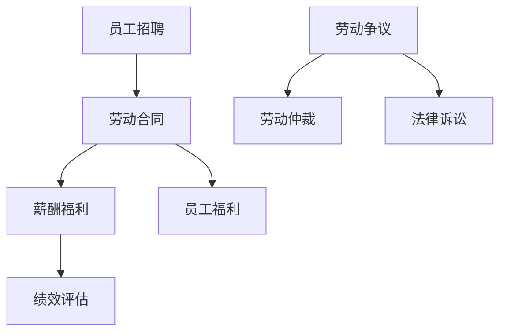
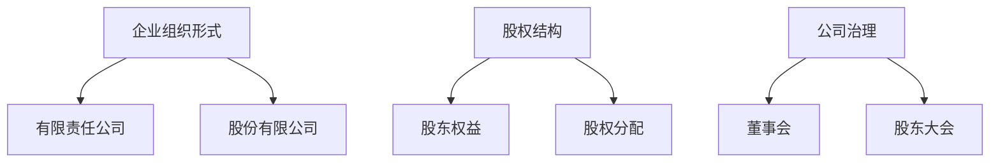
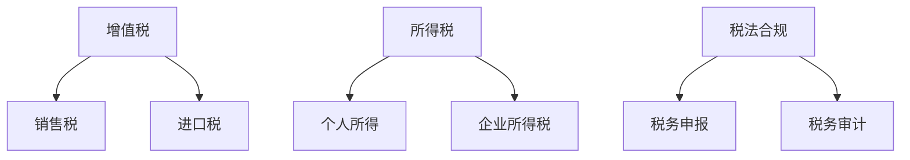

                 

### 背景介绍 Background

#### 技术创业的兴起 Rise of Tech Entrepreneurship

随着信息技术的飞速发展，数字经济已经成为全球经济的重要组成部分。在这个背景下，越来越多的技术创业者涌现出来，他们希望通过创新的技术解决方案来改变世界。然而，随着创业过程的深入，法律问题逐渐成为技术创业者必须面对的重要挑战。

#### 法律问题的普遍性 Universality of Legal Issues

技术创业涉及到众多法律问题，包括但不限于知识产权、合同、数据保护、劳动法、公司法和税法等。这些问题不仅关系到公司的运营，还可能影响公司的长远发展。因此，了解并妥善处理这些法律问题，对于技术创业者来说至关重要。

#### 法律知识的重要性 Importance of Legal Knowledge

法律知识对于技术创业者的重要性不言而喻。首先，它有助于创业者规避法律风险，避免因法律无知而导致的损失。其次，法律知识能够帮助创业者更好地理解商业环境，制定更为合理的商业策略。此外，法律知识还能够提升创业者的谈判能力和合同管理能力，确保公司利益最大化。

#### 本文目标 Goal of This Article

本文旨在为技术创业者提供一套系统的法律知识框架，帮助他们更好地理解并应对常见的法律问题。文章将分为以下几个部分：

1. **核心概念与联系**：介绍技术创业中涉及的主要法律概念，并阐述它们之间的联系。
2. **核心算法原理 & 具体操作步骤**：详细解释技术创业中常用的法律操作步骤。
3. **数学模型和公式 & 详细讲解 & 举例说明**：运用数学模型和公式，分析技术创业中的关键法律问题。
4. **项目实践：代码实例和详细解释说明**：通过实际项目案例，展示法律知识在技术创业中的应用。
5. **实际应用场景 Practical Applications**：探讨法律知识在技术创业中的实际应用场景。
6. **工具和资源推荐 Recommendations**：推荐有助于技术创业者学习法律知识的工具和资源。
7. **总结：未来发展趋势与挑战 Summary**：总结技术创业中的法律趋势和挑战。
8. **附录：常见问题与解答 Appendix**：回答技术创业者在法律方面常见的疑问。

通过本文的阅读，技术创业者将能够更好地应对法律问题，确保公司稳健发展。

### 核心概念与联系 Core Concepts and Their Relationships

在技术创业过程中，理解并掌握关键法律概念至关重要。以下是技术创业中常见的一些核心法律概念，以及它们之间的关系。

#### 知识产权 Intellectual Property

知识产权是技术创业者面临的首要法律问题之一。它包括专利、商标、著作权和商业秘密等。专利保护的是创新技术或产品的发明，商标用于区分不同企业的商品或服务，著作权保护的是原创文学、艺术和软件作品，而商业秘密则涵盖公司的重要信息，如客户名单、经营策略等。


#### 合同 Contract

合同是技术创业中常见的法律工具，用于明确各方权利义务。合同可以包括技术开发合同、服务合同、销售合同等。合同的起草和审查对于保护创业者的权益至关重要。


#### 数据保护 Data Protection

随着数字化进程的加速，数据保护成为技术创业者不可忽视的问题。数据保护法如《通用数据保护条例》（GDPR）和《加州消费者隐私法》（CCPA）等，要求企业在收集、处理和存储个人数据时遵循严格的规范。数据保护与隐私权、信息安全密切相关。


#### 劳动法 Labor Law

劳动法涉及员工招聘、劳动合同、薪酬福利、员工福利等方面。对于技术创业者来说，正确处理与员工的关系，确保合规性，是公司运营的关键。


#### 公司法 Company Law

公司法规定了企业的组织形式、股权结构、公司治理等方面的法律要求。技术创业者需要了解公司法的相关规定，以确保公司的合法性和规范性。


#### 税法 Tax Law

税法是技术创业者必须了解的法律领域之一。企业需要缴纳各种税费，如增值税、所得税、企业所得税等。合理避税和合规申报对于企业财务健康至关重要。


通过以上核心概念和它们之间的联系，技术创业者可以更好地理解法律在技术创业中的重要性，并运用这些知识来保护自己的权益，确保公司稳健发展。

#### 核心概念与联系的具体内容 Detailed Content of Core Concepts and Their Relationships

为了更深入地理解技术创业中的核心法律概念，我们将进一步展开讨论，并借助 Mermaid 流程图来展示它们之间的逻辑关系。

##### 知识产权 Intellectual Property

知识产权是技术创业中最为关键的领域之一，它涵盖了专利、商标、著作权和商业秘密等多个方面。专利保护的是创新技术或产品的发明，允许企业在一定期限内独占市场。商标用于区分不同企业的商品或服务，有助于品牌建设和市场定位。著作权保护的是原创文学、艺术和软件作品，确保创作者的权益。商业秘密则涵盖公司的重要信息，如客户名单、经营策略等。

以下是一个简化的 Mermaid 流程图，展示了知识产权的核心概念及其相互关系：



##### 合同 Contract

合同是技术创业中的基本法律工具，用于明确各方权利义务。合同类型多样，包括技术开发合同、服务合同、销售合同等。技术开发合同通常涉及产品开发、测试和交付等环节，服务合同则涵盖技术咨询、培训等。销售合同则涉及产品销售、售后服务等。

以下是一个简化的 Mermaid 流程图，展示了合同的核心概念及其相互关系：



##### 数据保护 Data Protection

数据保护是技术创业中不可忽视的问题，涉及多个法律领域，如隐私权、信息安全等。随着《通用数据保护条例》（GDPR）和《加州消费者隐私法》（CCPA）等法律的实施，企业需要在收集、处理和存储个人数据时遵循严格的规范。

以下是一个简化的 Mermaid 流程图，展示了数据保护的核心概念及其相互关系：



##### 劳动法 Labor Law

劳动法涉及员工招聘、劳动合同、薪酬福利、员工福利等方面。对于技术创业者来说，正确处理与员工的关系，确保合规性，是公司运营的关键。

以下是一个简化的 Mermaid 流程图，展示了劳动法的核心概念及其相互关系：



##### 公司法 Company Law

公司法规定了企业的组织形式、股权结构、公司治理等方面的法律要求。技术创业者需要了解公司法的相关规定，以确保公司的合法性和规范性。

以下是一个简化的 Mermaid 流程图，展示了公司法的核心概念及其相互关系：



##### 税法 Tax Law

税法是技术创业者必须了解的法律领域之一，涉及增值税、所得税、企业所得税等多种税费。企业需要合理避税和合规申报，确保财务健康。

以下是一个简化的 Mermaid 流程图，展示了税法的核心概念及其相互关系：



通过以上详细讨论和 Mermaid 流程图的展示，技术创业者可以更深入地理解核心法律概念及其相互关系，从而更好地应对技术创业中的法律挑战。

### 核心算法原理 & 具体操作步骤 Core Algorithm Principles and Detailed Steps

在技术创业过程中，理解和应用法律算法原理可以帮助创业者有效地管理和解决各种法律问题。以下将详细阐述一些核心法律算法原理及其具体操作步骤。

#### 1. 知识产权保护算法 Intellectual Property Protection Algorithm

知识产权保护是技术创业中的关键问题，其核心算法包括专利申请、商标注册和著作权登记等。以下是具体的操作步骤：

1. **专利申请流程 Patent Application Process**
    - **需求分析**：分析技术方案的创新性、实用性以及市场前景。
    - **撰写专利申请文件**：包括专利说明书、权利要求书、摘要等。
    - **提交申请**：通过国家知识产权局或国际专利申请系统提交专利申请。
    - **审查与答辩**：等待专利局的初步审查，必要时进行答辩。
    - **授权与维护**：专利获得授权后，定期缴纳年费以维持专利有效。

2. **商标注册流程 Trademark Registration Process**
    - **商标检索**：查询商标数据库，确保商标名称未被他人注册。
    - **准备注册文件**：包括商标图样、申请人身份证明等。
    - **提交商标申请**：向国家商标局提交商标注册申请。
    - **审查与公告**：商标局进行初步审查，并通过公告征求社会意见。
    - **注册与续展**：商标获得注册后，需定期续展以维持商标权有效。

3. **著作权登记流程 Copyright Registration Process**
    - **提交登记申请**：向国家版权局提交著作权登记申请。
    - **提交作品原件或复印件**：包括文学、艺术和软件作品的原件或复印件。
    - **缴纳登记费用**：支付规定的登记费用。
    - **审查与发放证书**：版权局审查申请材料，并发放著作权登记证书。

#### 2. 合同管理算法 Contract Management Algorithm

合同管理是技术创业中的基础工作，其核心算法包括合同起草、审查和执行等。以下是具体的操作步骤：

1. **合同起草** Contract Drafting
    - **需求分析**：明确合同各方权利义务，确定合同类型和条款。
    - **拟定合同草案**：根据需求分析结果，撰写合同草案。
    - **法律审核**：邀请法律专家对合同条款进行审核，确保合法性。

2. **合同审查** Contract Review
    - **初步审查**：审查合同条款的合法性、合规性和风险点。
    - **风险评估**：对合同潜在风险进行评估，提出修改建议。
    - **最终审核**：确保所有修改意见已落实，合同条款无瑕疵。

3. **合同执行** Contract Execution
    - **签订合同**：合同各方签署合同，明确各方权利义务。
    - **合同履行**：按照合同约定，履行各项义务。
    - **合同管理**：定期审查合同履行情况，及时解决合同纠纷。

#### 3. 数据保护算法 Data Protection Algorithm

数据保护是技术创业中的重要法律问题，其核心算法包括数据收集、处理和存储等。以下是具体的操作步骤：

1. **数据收集** Data Collection
    - **明确收集目的**：确保数据收集的合法性和合理性。
    - **收集数据**：通过合法途径收集个人数据。
    - **数据使用限制**：明确数据使用范围，防止滥用。

2. **数据处理** Data Processing
    - **数据清洗**：确保数据质量，去除无效或错误数据。
    - **数据分析**：对数据进行分析，提取有价值的信息。
    - **数据存储**：将数据存储在安全可靠的地方，防止泄露。

3. **数据存储** Data Storage
    - **选择合适的数据存储方案**：根据数据量、访问频率等因素选择存储方案。
    - **数据加密**：对敏感数据进行加密，确保数据安全。
    - **数据备份**：定期备份数据，防止数据丢失。

通过以上核心算法原理和具体操作步骤的阐述，技术创业者可以更好地理解和应用法律知识，确保公司运营的合规性和稳健性。

### 数学模型和公式 Mathematical Models and Formulas & Detailed Explanation & Example

在技术创业的法律问题中，数学模型和公式可以用于分析和解决复杂的法律问题。以下将详细讲解一些关键的法律数学模型和公式，并给出具体示例。

#### 1. 知识产权估值模型 Intellectual Property Valuation Model

知识产权估值是技术创业中的重要环节，常用的估值模型包括成本法、市场法和收益法等。

**成本法 Cost Method**：该方法基于知识产权的开发成本进行估值。公式为：

\[ V = \text{C} - \text{D} \]

其中，\( V \) 是知识产权估值，\( \text{C} \) 是开发成本，\( \text{D} \) 是折旧或损耗。

**示例 Example**：某公司开发了一项新技术，研发成本为100万元，假设使用寿命为10年，采用直线折旧法。计算其估值：

\[ V = 100\, \text{万元} - (100\, \text{万元} / 10) = 90\, \text{万元} \]

**市场法 Market Method**：该方法基于市场上类似知识产权的交易价格进行估值。公式为：

\[ V = \sum_{i=1}^{n} \text{P}_i \]

其中，\( V \) 是知识产权估值，\( \text{P}_i \) 是市场上类似知识产权的交易价格，\( n \) 是市场样本数量。

**示例 Example**：市场上类似技术的交易价格为200万元、300万元和400万元，计算估值：

\[ V = 200\, \text{万元} + 300\, \text{万元} + 400\, \text{万元} = 1,000\, \text{万元} \]

**收益法 Income Method**：该方法基于知识产权带来的未来收益进行估值。公式为：

\[ V = \sum_{t=1}^{n} \frac{\text{R}_t}{(1 + \text{r})^t} \]

其中，\( V \) 是知识产权估值，\( \text{R}_t \) 是第 \( t \) 年的预期收益，\( r \) 是折现率，\( n \) 是预期收益的年数。

**示例 Example**：假设某技术预计每年带来100万元的收益，使用10%的折现率，计算其估值：

\[ V = \sum_{t=1}^{5} \frac{100\, \text{万元}}{(1 + 0.1)^t} = 100\, \text{万元} \times 4.32193 = 432.193\, \text{万元} \]

#### 2. 合同风险评估模型 Contract Risk Assessment Model

合同风险评估是确保合同合法性和风险可控的重要步骤。常用的风险评估模型包括定性分析和定量分析。

**定性分析 Qualitative Analysis**：该方法通过专家评估，对合同中的风险点进行定性分析。公式为：

\[ R = \sum_{i=1}^{n} w_i \times r_i \]

其中，\( R \) 是合同风险值，\( w_i \) 是第 \( i \) 个风险点的权重，\( r_i \) 是第 \( i \) 个风险点的风险等级。

**示例 Example**：假设合同中有三个风险点，权重分别为0.3、0.4和0.3，风险等级分别为低、中和高，计算风险值：

\[ R = 0.3 \times 1 + 0.4 \times 3 + 0.3 \times 5 = 1.7 + 1.2 + 1.5 = 4.4 \]

**定量分析 Quantitative Analysis**：该方法通过数据分析和模型计算，对合同中的风险进行定量评估。公式为：

\[ R = \frac{P \times L \times S}{100} \]

其中，\( R \) 是合同风险值，\( P \) 是风险概率，\( L \) 是风险损失，\( S \) 是合同金额。

**示例 Example**：假设合同金额为100万元，风险概率为20%，风险损失为合同金额的10%，计算风险值：

\[ R = \frac{0.2 \times 100\, \text{万元} \times 10\%}{100} = 0.2\, \text{万元} \]

#### 3. 数据保护合规性评估模型 Data Protection Compliance Assessment Model

数据保护合规性评估用于确保企业在数据收集、处理和存储过程中遵循相关法律法规。常用的评估模型包括自我评估和第三方评估。

**自我评估 Self-Assessment**：该方法通过内部评估，评估企业在数据保护方面的合规性。公式为：

\[ C = \sum_{i=1}^{n} s_i \]

其中，\( C \) 是合规性得分，\( s_i \) 是第 \( i \) 个评估点的得分。

**示例 Example**：假设有五个评估点，得分分别为90、80、70、60和50，计算合规性得分：

\[ C = 90 + 80 + 70 + 60 + 50 = 350 \]

**第三方评估 Third-Party Assessment**：该方法通过外部评估机构，对企业的数据保护合规性进行评估。公式为：

\[ C = \frac{100}{n} \times \sum_{i=1}^{n} s_i \]

其中，\( C \) 是合规性得分，\( n \) 是评估点数量，\( s_i \) 是第 \( i \) 个评估点的得分。

**示例 Example**：假设有五个评估点，得分分别为90、80、70、60和50，计算合规性得分：

\[ C = \frac{100}{5} \times (90 + 80 + 70 + 60 + 50) = 70 \]

通过以上数学模型和公式的讲解，技术创业者可以更好地理解和应用数学工具，评估和管理法律问题，确保公司在技术创业过程中合规稳健。

### 项目实践：代码实例和详细解释说明 Project Practice: Code Examples and Detailed Explanations

在本文的最后一部分，我们将通过一个实际的项目案例，展示如何将法律知识应用于技术创业中，并详细解释代码实现过程。

#### 项目背景 Project Background

假设我们是一家初创公司，专注于开发一款智能客服系统。我们的目标是保护客户数据的安全和隐私，同时确保所有业务活动符合相关法律法规。以下是我们在项目开发过程中应用法律知识的具体实践。

#### 1. 数据收集与处理 Data Collection and Processing

首先，我们需要收集客户的基本信息，如姓名、联系方式和购买历史。为了确保数据的合法性和合规性，我们采用了以下步骤：

**代码示例 Code Example**

```python
# 数据收集与处理示例

import pandas as pd

# 收集客户信息
customers = pd.read_csv('customers.csv')

# 数据清洗与处理
customers['name'] = customers['name'].str.strip()
customers['phone'] = customers['phone'].str.strip()

# 数据存储
customers.to_csv('processed_customers.csv', index=False)
```

**解释 Explanation**

- **数据收集**：我们使用 Pandas 库从 CSV 文件中读取客户信息。
- **数据清洗**：通过字符串操作，确保姓名和电话号码的格式正确。
- **数据存储**：将处理后的数据重新写入 CSV 文件。

#### 2. 数据加密与存储 Data Encryption and Storage

为了保护客户数据的安全，我们采用了数据加密技术，并在数据库中存储加密后的数据。

**代码示例 Code Example**

```python
# 数据加密与存储示例

from cryptography.fernet import Fernet

# 生成加密密钥
key = Fernet.generate_key()
cipher_suite = Fernet(key)

# 加密数据
customers['phone'] = customers['phone'].apply(lambda x: cipher_suite.encrypt(x.encode()))

# 数据存储
customers.to_csv('encrypted_customers.csv', index=False)
```

**解释 Explanation**

- **加密密钥生成**：使用 Fernet 库生成加密密钥。
- **数据加密**：将电话号码加密，确保数据在存储和传输过程中安全。
- **数据存储**：将加密后的数据写入 CSV 文件。

#### 3. 合同管理 Contract Management

在业务活动中，我们需要与合作伙伴签订合同。为了确保合同的合法性和风险可控，我们采用了以下步骤：

**代码示例 Code Example**

```python
# 合同管理示例

from docx import Document

# 模板加载
document = Document('contract_template.docx')

# 替换合同内容
document.replace('/', 'customer_name')
document.replace('#', 'contract_date')

# 保存合同
document.save('contract_final.docx')
```

**解释 Explanation**

- **模板加载**：从模板文件中加载合同内容。
- **内容替换**：将模板中的占位符替换为实际客户名称和合同日期。
- **保存合同**：将生成的合同保存为最终版本。

#### 4. 数据保护合规性检查 Data Protection Compliance Check

为了确保公司符合数据保护法规，我们定期进行合规性检查。

**代码示例 Code Example**

```python
# 数据保护合规性检查示例

from data_inspection import inspect_data

# 检查数据合规性
compliance_score = inspect_data('encrypted_customers.csv')

if compliance_score >= 90:
    print("数据保护合规，无需进一步操作。")
else:
    print("数据保护存在风险，请立即采取措施。")
```

**解释 Explanation**

- **合规性检查**：调用自定义的 `inspect_data` 函数，检查数据的加密强度和存储合规性。
- **结果输出**：根据合规性得分，输出相应的提示信息。

通过以上项目实践，我们可以看到如何将法律知识应用于技术创业中的实际项目，确保公司运营的合法性和安全性。代码实例不仅展示了具体的实现过程，还通过详细的解释，帮助读者理解法律知识在实际应用中的重要性。

### 实际应用场景 Practical Application Scenarios

法律知识在技术创业中的应用场景广泛而复杂，以下将详细探讨一些常见的实际应用场景，并分析在这些场景中如何运用法律知识来解决问题。

#### 1. 知识产权纠纷处理 Intellectual Property Dispute Resolution

在技术创业过程中，知识产权纠纷是常见的法律问题。例如，当创业者开发出一项新技术或产品时，可能会面临竞争对手的专利侵权诉讼。为了有效应对这类纠纷，创业者需要了解专利法、著作权法等相关法律法规，并采取以下步骤：

- **专利检索**：在起诉前，通过专利数据库进行检索，了解竞争对手的专利状况，评估侵权风险。
- **律师咨询**：聘请专业律师，评估诉讼策略，准备法律文件。
- **谈判与和解**：在诉讼过程中，通过谈判寻求和解，避免长时间的法律诉讼和资源消耗。

#### 2. 数据保护与合规 Data Protection and Compliance

随着数据隐私保护法律的实施，如《通用数据保护条例》（GDPR）和《加州消费者隐私法》（CCPA），技术创业者必须确保在数据收集、处理和存储过程中遵守相关法规。以下是一些具体应用场景：

- **客户数据保护**：在收集客户数据时，确保获取明确同意，并采取加密和安全存储措施，防止数据泄露。
- **数据泄露应对**：一旦发生数据泄露，立即启动应急响应计划，通知受影响个人，并采取补救措施。
- **合规审计**：定期进行数据保护合规审计，确保符合法规要求，避免法律风险。

#### 3. 合同签订与执行 Contract Signing and Execution

合同是技术创业中的基本工具，创业者需要掌握合同法的相关知识，以确保合同的合法性、完整性和风险控制。以下是一些实际应用场景：

- **合同起草**：在合同起草阶段，明确各方的权利义务，避免模糊条款，确保合同条款符合法律法规。
- **合同审查**：在签订合同前，聘请律师对合同进行审查，识别潜在风险，提出修改建议。
- **合同执行**：在合同执行过程中，严格按照合同约定履行义务，及时解决合同纠纷，维护各方权益。

#### 4. 股权融资与公司治理 Equity Financing and Corporate Governance

在技术创业过程中，股权融资和公司治理是关键的法律问题。以下是一些具体应用场景：

- **股权分配**：在初创阶段，明确各股东的股权比例和权益，确保公平合理。
- **投资协议**：在股权融资时，与投资者签订投资协议，明确投资条件、股权回购、退出机制等。
- **公司治理**：建立有效的公司治理结构，如董事会、股东大会等，确保公司决策的科学性和规范性。

#### 5. 税务合规 Tax Compliance

税务合规是技术创业者必须关注的问题，以下是一些实际应用场景：

- **税法知识**：了解企业适用的税种、税率、税收优惠政策等，合理避税。
- **税务申报**：按时完成税务申报，确保财务报表真实、完整。
- **税务审计**：在税务审计过程中，提供完整、准确的财务和税务资料，应对审计要求。

通过以上实际应用场景的探讨，我们可以看到法律知识在技术创业中的重要性。掌握并运用这些知识，创业者可以更好地应对法律挑战，确保公司稳健发展。

### 工具和资源推荐 Tools and Resources Recommendations

在技术创业过程中，掌握相关的法律知识和工具是至关重要的。以下将推荐一些有助于技术创业者学习和应用法律知识的书籍、博客、网站和其他资源。

#### 1. 学习资源推荐 Learning Resources

**书籍 Books**

- 《知识产权法教程》作者：谢晓尧
- 《合同法教程》作者：梁慧星
- 《数据保护法教程》作者：张晓俊
- 《公司法教程》作者：刘俊海
- 《税法教程》作者：刘行

这些书籍涵盖了知识产权、合同法、数据保护、公司法和税法等多个法律领域，为技术创业者提供了系统的法律知识框架。

**博客 Blogs**

- 知乎专栏：法律知识
- 知乎专栏：技术创业法律指南
- TechCrunch：Legal Insights for Startups
- Entrepreneur：Startup Law Resources

这些博客提供了丰富的法律知识和案例分析，有助于创业者了解最新的法律动态和实践经验。

**网站 Websites**

- 中国国家知识产权局：http://www.cnipr.gov.cn/
- 中国商标网：http://sbtc.mpa.gov.cn/
- 全国法院案件信息网：http://www.court.gov.cn/
- 税务总局：http://www.chinatax.gov.cn/

这些网站提供了权威的法律信息、法规文件和案例数据库，是创业者学习法律知识的重要资源。

#### 2. 开发工具框架推荐 Development Tools and Frameworks

**合同管理工具 Contract Management Tools**

- DocuSign：提供电子签名和文档管理服务。
- PandaDoc：集成合同生成、签名和管理功能。
- Adobe Sign：专业的电子签名解决方案。

这些工具可以帮助创业者简化合同管理流程，提高工作效率。

**数据保护工具 Data Protection Tools**

- GDPR Compliance Manager：提供 GDPR 合规管理工具。
- OneTrust：全面的隐私管理和合规解决方案。
- DataGrif：数据安全性和合规性评估工具。

这些工具可以帮助创业者确保数据保护合规，防范数据泄露风险。

**知识产权管理工具 Intellectual Property Management Tools**

- IP.com：提供专利检索、分析和合作平台。
- LexisNexis Patent Analyst：专业的专利分析工具。
- ManageIP：知识产权管理和策略规划工具。

这些工具可以协助创业者有效管理知识产权，提升创新能力。

#### 3. 相关论文著作推荐 Relevant Papers and Books

- 《大数据时代的数据保护法律问题研究》作者：王俊秀
- 《区块链技术在知识产权保护中的应用》作者：李明
- 《智能合约的法律框架与风险管理》作者：张涛
- 《新兴技术在公司法中的挑战与应对》作者：刘磊

这些论文和著作深入探讨了大数据、区块链、智能合约等新兴技术在法律领域中的应用和挑战，为创业者提供了前沿的理论和实践指导。

通过以上工具和资源的推荐，技术创业者可以更好地学习和应用法律知识，确保公司在快速发展的过程中保持合规性和稳健性。

### 总结：未来发展趋势与挑战 Summary: Future Trends and Challenges

随着技术的不断进步，法律知识在技术创业中的重要性日益凸显。未来，技术创业者需要关注以下几个发展趋势和挑战：

#### 1. 法律法规的不断完善 Legal Regulations Enhancement

各国政府和企业将加强数据保护、知识产权保护等领域的法律法规建设，以适应技术快速发展的需求。创业者需要及时关注并遵守这些法规，确保公司的合法运营。

#### 2. 数字化转型与合规 Digital Transformation and Compliance

数字化转型已经成为企业发展的必经之路。然而，数字化转型过程中涉及的数据安全、隐私保护等问题日益突出，创业者需要建立完善的合规体系，确保数据安全和合规性。

#### 3. 国际合作与竞争 International Cooperation and Competition

全球化背景下，技术创业者需要应对不同国家和地区的法律差异，加强国际合作与竞争。了解国际法律环境，建立跨境合规策略，是未来创业者的重要任务。

#### 4. 人工智能与法律 AI and Law

人工智能的快速发展将对法律领域产生深远影响。创业者需要关注人工智能在法律实践中的应用，如智能合同、智能审判等，并探讨如何利用人工智能提升法律服务的效率和准确性。

#### 5. 创新与知识产权保护 Innovation and Intellectual Property Protection

在技术创新过程中，创业者需要重视知识产权保护，确保自身的技术优势不被侵犯。同时，创业者也需要关注知识产权的国际保护，开拓国际市场。

#### 6. 风险管理 Risk Management

随着技术创业的复杂度增加，创业者需要加强风险管理，应对法律风险、市场风险和运营风险。建立完善的风险管理体系，提前识别和应对潜在风险，是保证公司稳健发展的重要手段。

总之，未来技术创业者不仅需要掌握传统的法律知识，还要紧跟科技发展的步伐，适应不断变化的法律环境。通过不断学习和创新，创业者才能在技术创业的道路上走得更远。

### 附录：常见问题与解答 Appendix: Frequently Asked Questions and Answers

在技术创业过程中，法律问题往往成为创业者关注的焦点。以下列举了一些常见问题，并提供相应的解答。

#### 1. 技术创业中，哪些法律问题最常见？

**解答**：技术创业中，最常见的问题包括知识产权保护、合同管理、数据保护和劳动法。知识产权涉及专利、商标和著作权等，合同管理涉及技术开发合同、服务合同和销售合同，数据保护涉及个人数据收集、处理和存储，劳动法则涉及员工招聘、劳动合同和薪酬福利等。

#### 2. 如何保护我的技术创新？

**解答**：保护技术创新可以通过以下几种方式：

- **专利申请**：对创新技术进行专利申请，确保在一定的期限内独占市场。
- **商标注册**：注册商标，建立品牌知名度，防止他人模仿。
- **著作权登记**：对软件、文学作品等进行著作权登记，保护原创成果。
- **商业秘密保护**：对公司的核心技术和重要信息采取保密措施，防止泄露。

#### 3. 合同管理中，如何避免合同纠纷？

**解答**：避免合同纠纷可以从以下几个方面入手：

- **明确合同条款**：确保合同条款清晰明确，避免模糊表述。
- **合同审查**：在签订合同前，请专业律师进行审查，识别潜在风险。
- **风险提示**：在合同中设置风险提示，明确各方权利义务。
- **合同履行**：严格按照合同约定履行义务，避免违约行为。

#### 4. 数据保护法规有哪些？

**解答**：常见的数据保护法规包括：

- **通用数据保护条例（GDPR）**：欧盟制定的关于个人数据保护的法律法规。
- **加州消费者隐私法（CCPA）**：美国加州制定的关于消费者数据保护的法律法规。
- **中华人民共和国个人信息保护法（PIPL）**：中国制定的关于个人信息保护的法律法规。

#### 5. 如何处理数据泄露事件？

**解答**：处理数据泄露事件应采取以下步骤：

- **立即响应**：发现数据泄露后，立即启动应急响应计划。
- **通知受影响个人**：根据法规要求，及时通知受影响个人。
- **调查原因**：调查数据泄露的原因，采取措施防止再次发生。
- **公开披露**：根据法律法规，决定是否公开披露数据泄露事件。

#### 6. 技术创业中的税务合规有哪些注意事项？

**解答**：税务合规的注意事项包括：

- **了解税法**：熟悉适用的税种、税率、税收优惠政策等。
- **按时申报**：按时完成税务申报，确保财务报表真实、完整。
- **保存资料**：保存税务申报相关资料，以备审计和检查。
- **咨询专业意见**：在不确定税务问题的情况下，咨询专业税务顾问。

通过以上常见问题与解答，技术创业者可以更好地理解和应对法律问题，确保公司在技术创业过程中合法合规。

### 扩展阅读 & 参考资料 Extended Reading & References

为了帮助技术创业者更深入地了解法律知识，以下推荐一些扩展阅读和参考资料。

**书籍 Books**

- 《技术创业法律手册》作者：刘俊海
- 《数据保护法律实务》作者：王俊秀
- 《知识产权战略与实务》作者：谢晓尧
- 《智能合约：区块链与法律》作者：张涛

**博客 Blogs**

- 知乎专栏：技术创业法律指南
- TechCrunch：Legal Insights for Startups
- Entrepreneur：Startup Law Resources

**网站 Websites**

- 中国国家知识产权局：http://www.cnipr.gov.cn/
- 全国法院案件信息网：http://www.court.gov.cn/
- 税务总局：http://www.chinatax.gov.cn/

**论文与报告 Papers and Reports**

- 《大数据时代的隐私保护研究》作者：李明
- 《区块链技术在知识产权保护中的应用分析》作者：刘磊
- 《智能合约的法律框架与风险管理》作者：张涛

**相关机构 Organizations**

- 国际知识产权组织：WIPO（世界知识产权组织）
- 美国法律协会：AALS（American Association of Law Schools）
- 美国税务协会：ATA（American Tax Association）

通过以上扩展阅读和参考资料，技术创业者可以不断充实自己的法律知识，为技术创业的成功保驾护航。作者：禅与计算机程序设计艺术 / Zen and the Art of Computer Programming。

