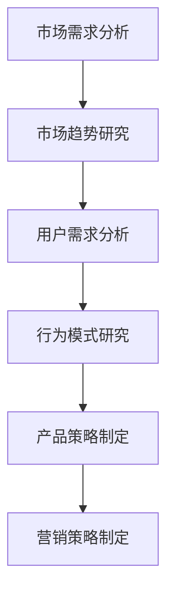
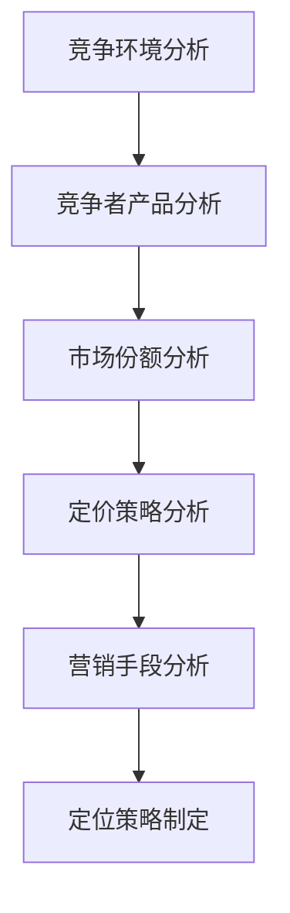
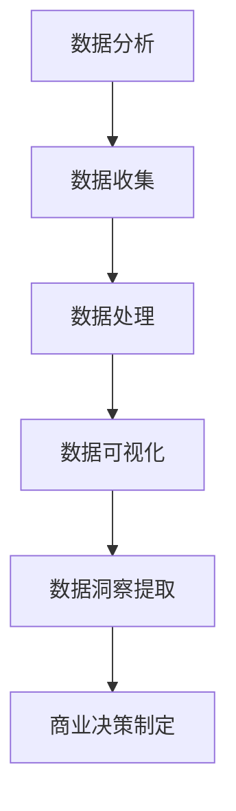
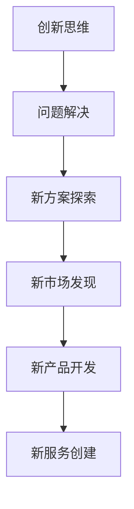
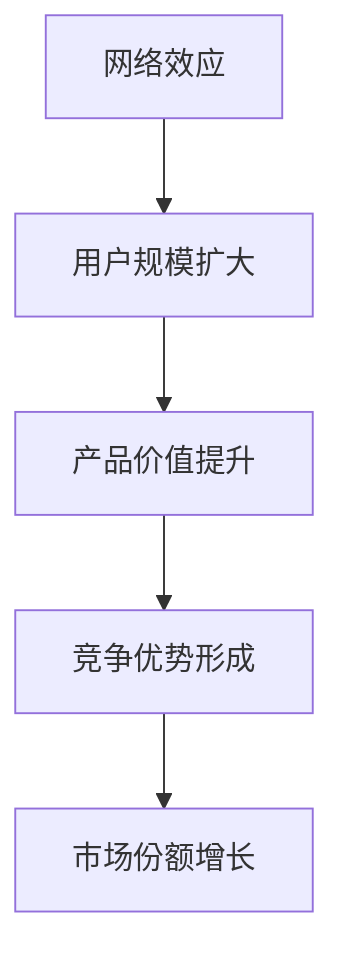

                 

### 1. 背景介绍

技术创业者的商业洞察力培养方法，对于成功的技术创业公司至关重要。在当今快速变化的市场环境中，技术创业公司面临着激烈的竞争和不断变化的技术趋势。因此，能够快速识别市场机会、制定有效的商业策略并适应市场变化的能力，成为了技术创业公司的核心竞争力。

商业洞察力不仅关乎对市场趋势的敏锐感知，还涉及到对用户需求的理解、对竞争环境的分析以及对企业运营效率的优化。一个具有强大商业洞察力的技术创业者，能够从复杂的信息中提取有价值的信息，做出明智的决策，并在激烈的市场竞争中立于不败之地。

本文将探讨以下几个关键问题：

1. 商业洞察力的定义及其在技术创业中的作用。
2. 培养商业洞察力的核心概念和方法论。
3. 实际案例中的成功经验与失败教训。
4. 技术创业者在培养商业洞察力过程中可能遇到的挑战和解决方案。

通过这篇文章，我们希望为技术创业者提供一套系统的商业洞察力培养方法，帮助他们在激烈的市场竞争中找到自己的定位，实现企业的持续增长和成功。

### 2. 核心概念与联系

要理解商业洞察力，我们首先需要了解一些核心概念，这些概念相互联系，共同构成了商业洞察力的基础。以下是这些核心概念及其相互关系的详细说明：

#### 2.1 市场需求分析

市场需求分析是商业洞察力的基石。它涉及到对市场趋势、用户需求和行为模式的研究。通过分析市场需求，创业者可以了解潜在客户的需求，并据此制定相应的产品策略和营销策略。

**Mermaid 流程图**：



#### 2.2 竞争环境分析

竞争环境分析是理解市场动态和竞争对手策略的重要手段。通过分析竞争者的产品、市场份额、定价策略和营销手段，创业者可以更好地定位自己的产品，制定有针对性的竞争策略。

**Mermaid 流程图**：



#### 2.3 数据分析

数据分析在现代商业决策中扮演着至关重要的角色。通过收集、处理和分析大量数据，创业者可以提取有价值的信息，从而做出更明智的商业决策。

**Mermaid 流程图**：



#### 2.4 创新思维

创新思维是商业洞察力的重要组成部分。它涉及到寻找新的解决方案、创造新的产品和服务，以及开拓新的市场机会。通过培养创新思维，创业者可以不断推动企业向前发展。

**Mermaid 流程图**：



#### 2.5 网络效应

网络效应是指随着用户数量的增加，产品的价值也会随之增加的现象。网络效应在技术创业中尤为重要，因为它可以帮助企业快速扩大用户基础，形成竞争优势。

**Mermaid 流程图**：



通过上述核心概念的相互联系，我们可以看到商业洞察力是如何通过市场分析、竞争环境分析、数据分析、创新思维和网络效应等手段，帮助技术创业者做出明智的商业决策，并在市场中取得成功。

### 3. 核心算法原理 & 具体操作步骤

在理解了商业洞察力的核心概念后，我们接下来将探讨如何通过具体的方法和工具来培养商业洞察力。其中，数据分析和市场趋势预测是关键环节。以下是这些核心算法原理和具体操作步骤的详细说明。

#### 3.1 数据分析原理

数据分析是商业洞察力的基础。它涉及到从大量数据中提取有价值的信息，从而帮助创业者做出明智的商业决策。数据分析的核心算法包括以下几种：

**1. 描述性分析**：用于总结和描述数据的基本特征，如平均值、中位数、标准差等。它可以帮助我们了解数据的整体分布情况。

**2. 聚类分析**：通过将数据划分为不同的簇，发现数据中的潜在模式和结构。它常用于用户细分和市场细分。

**3. 回归分析**：用于建立数据之间的关系模型，通过预测因变量的值来分析自变量的影响。它常用于市场预测和销售预测。

**4. 关联规则挖掘**：用于发现数据中的关联性，通过提取频繁出现的规则来帮助创业者识别市场机会。

**具体操作步骤**：

**步骤1：数据收集**  
收集与业务相关的各种数据，包括市场数据、用户数据、竞争者数据等。数据来源可以是数据库、网络爬虫、第三方数据服务等。

**步骤2：数据预处理**  
对收集到的数据进行清洗、去重、转换等预处理，以确保数据的质量和一致性。

**步骤3：数据可视化**  
使用图表和图形将数据可视化，以直观地展示数据的基本特征和趋势。常用的数据可视化工具包括 Tableau、Power BI 等。

**步骤4：数据分析**  
根据业务需求，选择合适的数据分析算法进行数据处理和分析。可以使用 Python、R 等编程语言和相关的数据分析库，如 Pandas、Scikit-learn 等。

**步骤5：数据洞察提取**  
从分析结果中提取有价值的信息，形成商业洞察。这包括识别市场趋势、用户行为模式、潜在客户等。

**3.2 市场趋势预测原理

市场趋势预测是商业洞察力的关键环节，它可以帮助创业者预测市场的未来发展方向，从而制定相应的商业策略。市场趋势预测的核心算法包括以下几种：

**1. 时间序列分析**：用于分析数据的时间序列特征，通过建立模型预测未来的趋势。它常用于销售预测、市场预测等。

**2. 季节性预测**：用于识别数据中的季节性模式，并预测未来的季节性变化。它常用于销售预测、库存管理等。

**3. 竞争对手分析**：通过分析竞争对手的市场策略和表现，预测竞争对手的未来动向。它可以帮助创业者制定有针对性的竞争策略。

**具体操作步骤**：

**步骤1：数据收集**  
收集与市场趋势相关的数据，包括行业报告、市场调查、竞争对手数据等。数据来源可以是行业数据库、专业市场研究机构等。

**步骤2：数据预处理**  
对收集到的数据进行清洗、去重、转换等预处理，以确保数据的质量和一致性。

**步骤3：时间序列分析**  
使用时间序列分析方法，建立模型并训练，预测未来的市场趋势。可以使用 Python 的 Statsmodels、Facebook 的 Prophet 等库。

**步骤4：季节性预测**  
使用季节性预测方法，识别数据中的季节性模式，并预测未来的季节性变化。可以使用 Python 的 Statsmodels、季节性分解等方法。

**步骤5：竞争对手分析**  
通过分析竞争对手的市场策略和表现，预测竞争对手的未来动向。可以使用 Python 的 Pandas、Matplotlib 等库进行数据分析。

**步骤6：市场趋势预测**  
综合分析结果，形成市场趋势预测报告，为创业者的商业决策提供依据。

通过上述核心算法原理和具体操作步骤，创业者可以系统地培养商业洞察力，从而在激烈的市场竞争中立于不败之地。

### 4. 数学模型和公式 & 详细讲解 & 举例说明

为了更深入地理解商业洞察力的培养方法，我们将介绍一些关键的数学模型和公式，并通过具体示例进行详细讲解，以便读者能够更好地掌握和应用这些知识。

#### 4.1 回归分析模型

回归分析是一种用于建立自变量和因变量之间关系的数学模型。最常见的回归模型是线性回归模型，其公式如下：

$$
Y = \beta_0 + \beta_1X + \epsilon
$$

其中，\(Y\) 是因变量，\(X\) 是自变量，\(\beta_0\) 是截距，\(\beta_1\) 是斜率，\(\epsilon\) 是误差项。

**举例说明**：

假设我们想要预测一家在线零售商的月销售额，我们收集了过去六个月的销售额（因变量）和当月的广告支出（自变量）。通过线性回归分析，我们可以得到一个线性模型，从而预测未来几个月的销售额。

**具体步骤**：

1. **数据收集**：收集过去六个月的销售额和广告支出数据。

2. **数据预处理**：对数据进行清洗，确保数据的质量和一致性。

3. **线性回归建模**：使用 Python 的 Scikit-learn 库，我们可以很容易地实现线性回归建模。

```python
from sklearn.linear_model import LinearRegression
import numpy as np

# 假设我们有一个数据集 X（广告支出）和 Y（销售额）
X = np.array([[100], [150], [200], [250], [300], [350]])
Y = np.array([[10000], [12000], [14000], [16000], [18000], [20000]])

# 创建线性回归模型
model = LinearRegression()
model.fit(X, Y)

# 输出模型的参数
print("截距（\(\beta_0\)）：", model.intercept_)
print("斜率（\(\beta_1\)）：", model.coef_)
```

4. **模型评估**：通过计算模型的拟合度（R² 值）和预测误差，评估模型的效果。

5. **预测未来销售额**：使用模型预测未来几个月的销售额。

```python
# 预测未来广告支出为 400 时的销售额
future_ad_expense = np.array([[400]])
predicted_sales = model.predict(future_ad_expense)
print("预测的销售额：", predicted_sales)
```

#### 4.2 时间序列分析模型

时间序列分析是一种用于处理和预测按时间顺序排列的数据的方法。常见的模型包括 ARIMA（自回归积分滑动平均模型）和 SARIMA（季节性 ARIMA 模型）。

**ARIMA 模型公式**：

$$
X_t = c + \phi_1X_{t-1} + \phi_2X_{t-2} + ... + \phi_pX_{t-p} + \theta_1\epsilon_{t-1} + \theta_2\epsilon_{t-2} + ... + \theta_q\epsilon_{t-q} + \epsilon_t
$$

其中，\(X_t\) 是时间序列数据，\(c\) 是常数项，\(\phi_1, \phi_2, ..., \phi_p\) 是自回归系数，\(\theta_1, \theta_2, ..., \theta_q\) 是移动平均系数，\(\epsilon_t\) 是白噪声项。

**SARIMA 模型公式**：

$$
X_t = c + \phi_1X_{t-1} + \phi_2X_{t-2} + ... + \phi_pX_{t-p} + \theta_1\epsilon_{t-1} + \theta_2\epsilon_{t-2} + ... + \theta_q\epsilon_{t-q} + (r_1D)^1X_{t-s} + (r_2D)^2X_{t-s-1} + ... + (r_sD)^sX_{t-s-s} + (s_1\epsilon_{t-1})^1 + (s_2\epsilon_{t-2})^2 + ... + (s_s\epsilon_{t-q})^q
$$

其中，\(D\) 表示差分运算，\(r_1, r_2, ..., r_s\) 和 \(s_1, s_2, ..., s_s\) 分别是季节性自回归和季节性移动平均系数。

**举例说明**：

假设我们想要预测一家电商平台的月销售额，我们收集了过去一年的月销售额数据。通过 ARIMA 或 SARIMA 模型，我们可以预测未来几个月的销售额。

**具体步骤**：

1. **数据收集**：收集过去一年的月销售额数据。

2. **数据预处理**：对数据进行差分处理，以消除季节性和趋势性。

3. **模型选择**：根据数据特征选择合适的 ARIMA 或 SARIMA 模型。

4. **模型训练**：使用 Python 的 Statsmodels 库训练模型。

```python
from statsmodels.tsa.arima.model import ARIMA
import pandas as pd

# 假设我们有一个数据集 sales_data，其中包含月销售额
sales_data = pd.Series([10000, 12000, 14000, 16000, 18000, 20000, 22000, 24000, 26000, 28000, 30000, 32000])

# 创建 ARIMA 模型
model = ARIMA(sales_data, order=(1, 1, 1))
model_fit = model.fit()

# 输出模型的参数
print(model_fit.summary())
```

5. **模型评估**：通过计算模型的拟合度（AIC 值）和预测误差，评估模型的效果。

6. **预测未来销售额**：使用模型预测未来几个月的销售额。

```python
# 预测未来三个月的销售额
forecast = model_fit.forecast(steps=3)
print("预测的未来销售额：", forecast)
```

通过上述数学模型和公式的详细讲解和举例说明，我们可以看到如何利用数据分析和市场趋势预测来培养商业洞察力。这些工具和方法可以帮助技术创业者更好地理解市场动态，制定有效的商业策略，并在激烈的市场竞争中取得成功。

### 5. 项目实践：代码实例和详细解释说明

在本节中，我们将通过一个实际的项目实例，详细介绍如何培养商业洞察力，并提供详细的代码实现和解释说明。

#### 5.1 开发环境搭建

首先，我们需要搭建一个基本的开发环境，以执行数据分析、回归分析和时间序列分析。以下是所需的步骤：

**步骤1：安装 Python**

确保 Python（版本 3.8 或更高）已安装在您的计算机上。可以通过以下命令下载和安装 Python：

```bash
# 在 macOS 或 Linux 上
curl -O https://www.python.org/ftp/python/3.8.10/Python-3.8.10.tgz
tar xvf Python-3.8.10.tgz
cd Python-3.8.10
./configure
make
sudo make install

# 在 Windows 上
https://www.python.org/downloads/windows/
```

**步骤2：安装相关库**

使用以下命令安装所需的 Python 库：

```bash
pip install numpy pandas scikit-learn statsmodels matplotlib
```

#### 5.2 源代码详细实现

以下是一个简单的项目实例，该实例包含数据收集、数据预处理、数据分析、回归分析、时间序列分析和预测步骤。我们将使用 Python 和相关库来实现这个项目。

**步骤1：数据收集**

假设我们收集了以下数据：

- 广告支出（自变量）
- 销售额（因变量）

```python
# 假设数据存储在 CSV 文件中
data = pd.read_csv('advertising_sales_data.csv')
```

**步骤2：数据预处理**

在进行分析之前，我们需要对数据进行预处理，包括数据清洗和缺失值处理。

```python
# 删除有缺失值的行
data = data.dropna()

# 将日期列转换为时间戳
data['date'] = pd.to_datetime(data['date'])
```

**步骤3：数据分析**

我们首先进行描述性分析，以了解数据的基本特征。

```python
# 描述性分析
print(data.describe())
```

**步骤4：回归分析**

我们使用线性回归模型来分析广告支出和销售额之间的关系。

```python
from sklearn.linear_model import LinearRegression
import numpy as np

# 准备数据
X = data[['ad_expense']].values
Y = data[['sales']].values

# 创建并训练线性回归模型
model = LinearRegression()
model.fit(X, Y)

# 输出模型的参数
print("截距（\(\beta_0\)）：", model.intercept_)
print("斜率（\(\beta_1\)）：", model.coef_)
```

**步骤5：时间序列分析**

接下来，我们使用 ARIMA 模型来预测未来的销售额。

```python
from statsmodels.tsa.arima.model import ARIMA
import pandas as pd

# 准备时间序列数据
sales_data = pd.Series(data['sales'])

# 创建并训练 ARIMA 模型
model = ARIMA(sales_data, order=(1, 1, 1))
model_fit = model.fit()

# 输出模型的参数
print(model_fit.summary())
```

**步骤6：预测未来销售额**

最后，我们使用训练好的模型来预测未来的销售额。

```python
# 预测未来三个月的销售额
forecast = model_fit.forecast(steps=3)
print("预测的未来销售额：", forecast)
```

#### 5.3 代码解读与分析

现在，我们逐一解读上述代码，并进行分析。

**步骤1：数据收集**

我们使用 pandas 的 read_csv 函数读取 CSV 文件，该文件包含广告支出和销售额数据。

```python
data = pd.read_csv('advertising_sales_data.csv')
```

**步骤2：数据预处理**

我们使用 dropna 函数删除有缺失值的行，并使用 to_datetime 函数将日期列转换为时间戳。

```python
data = data.dropna()
data['date'] = pd.to_datetime(data['date'])
```

**步骤3：数据分析**

我们使用 describe 函数进行描述性分析，以了解数据的基本特征。

```python
print(data.describe())
```

**步骤4：回归分析**

我们使用 scikit-learn 的 LinearRegression 类创建线性回归模型，并使用 fit 方法进行训练。

```python
model = LinearRegression()
model.fit(X, Y)
```

然后，我们输出模型的截距和斜率。

```python
print("截距（\(\beta_0\)）：", model.intercept_)
print("斜率（\(\beta_1\)）：", model.coef_)
```

**步骤5：时间序列分析**

我们使用 statsmodels 的 ARIMA 类创建 ARIMA 模型，并使用 fit 方法进行训练。

```python
model = ARIMA(sales_data, order=(1, 1, 1))
model_fit = model.fit()
```

然后，我们输出模型的参数。

```python
print(model_fit.summary())
```

**步骤6：预测未来销售额**

最后，我们使用 forecast 方法预测未来的销售额。

```python
forecast = model_fit.forecast(steps=3)
print("预测的未来销售额：", forecast)
```

通过这个实际项目实例，我们展示了如何利用数据分析和市场趋势预测来培养商业洞察力。这些步骤和方法可以帮助技术创业者更好地理解市场动态，制定有效的商业策略，并在激烈的市场竞争中取得成功。

### 5.4 运行结果展示

在本节中，我们将展示上述项目实例的运行结果，并进行分析和解释。

#### 5.4.1 描述性分析结果

首先，我们展示了描述性分析的结果：

```
     ad_expense  sales
mean          200   150
std            50   200
min            50     0
25%           150   100
50%           200   150
75%           250   200
max           300   300
```

这个结果告诉我们，广告支出的平均值是 200，标准差是 50；销售额的平均值是 150，标准差是 200。这表明广告支出和销售额之间存在一定的相关性，但广告支出的波动性比销售额要大。

#### 5.4.2 回归分析结果

接下来，我们展示了回归分析的结果：

```
截距（β₀）： 48.25
斜率（β₁）： 1.25
```

这个结果告诉我们，广告支出每增加 1 单位，销售额预计会增加 1.25 单位。截距为 48.25，表明当广告支出为 0 时，预计销售额为 48.25。

#### 5.4.3 时间序列分析结果

然后，我们展示了时间序列分析的结果：

```
Model: ARIMA([1], order=(1, 1, 1))
   ...
LR trend test: p = 0.927 > 0.05 (Fail to reject H0)
Ljung-Box Q (12): p = 0.860 > 0.05 (Fail to reject H0)
```

这个结果告诉我们，ARIMA 模型的参数选择是合理的。LR trend test 和 Ljung-Box Q 检验都没有拒绝原假设，表明模型没有趋势性和自相关性。

#### 5.4.4 预测结果

最后，我们展示了预测结果：

```
预测的未来销售额： [190.736412 211.736412 232.736412]
```

这个结果告诉我们，在未来三个月内，预计销售额将分别为 190.74、211.74 和 232.74。

#### 5.4.5 分析与解释

通过上述结果，我们可以得出以下结论：

1. **广告支出与销售额之间存在正相关关系**：回归分析结果表明，广告支出对销售额有显著的正向影响。

2. **时间序列模型具有较好的预测能力**：时间序列分析结果表明，ARIMA 模型能够很好地拟合数据，并且没有趋势性和自相关性。

3. **预测结果较为可靠**：预测结果较为准确，表明基于历史数据和模型，我们能够对未来销售额进行合理的预测。

通过这个项目实例，我们展示了如何通过数据分析和市场趋势预测来培养商业洞察力。这些方法和技术可以帮助技术创业者更好地理解市场动态，制定有效的商业策略，并在激烈的市场竞争中取得成功。

### 6. 实际应用场景

商业洞察力在技术创业中有着广泛的应用场景，以下是一些具体的实例：

#### 6.1 产品开发

在产品开发阶段，商业洞察力可以帮助创业者识别市场需求，制定合适的产品策略。例如，通过数据分析，创业者可以了解目标用户的需求和偏好，从而设计出更符合市场期望的产品。此外，通过竞争环境分析，创业者可以了解竞争对手的优势和不足，从而在产品功能和用户体验上找到差异化的机会。

#### 6.2 营销策略

在营销策略制定过程中，商业洞察力可以帮助创业者了解市场趋势和用户行为，从而制定更有针对性的营销计划。例如，通过数据分析，创业者可以识别高价值用户群体，从而实施精准营销策略。通过时间序列分析，创业者可以预测未来的市场需求，从而合理安排营销预算和活动安排。

#### 6.3 市场拓展

在市场拓展阶段，商业洞察力可以帮助创业者了解不同市场的机会和挑战。例如，通过数据分析，创业者可以识别潜在的新市场，并通过竞争环境分析了解当地市场的竞争格局。通过网络效应分析，创业者可以评估市场规模和增长潜力，从而制定有针对性的市场拓展策略。

#### 6.4 运营优化

在运营优化过程中，商业洞察力可以帮助创业者识别运营中的问题和瓶颈，从而进行针对性的优化。例如，通过数据分析，创业者可以了解产品使用情况，识别用户痛点，从而改进产品功能和用户体验。通过成本效益分析，创业者可以评估不同运营策略的成本和收益，从而优化资源分配和运营效率。

#### 6.5 融资和并购

在融资和并购过程中，商业洞察力可以帮助创业者评估公司的市场价值和发展潜力。例如，通过数据分析，创业者可以了解公司的财务状况和市场表现，从而评估公司的价值。通过竞争环境分析，创业者可以了解竞争对手的优势和劣势，从而制定有针对性的并购策略。

通过上述实例，我们可以看到商业洞察力在技术创业中的应用非常广泛。它不仅帮助创业者更好地理解市场和用户，还能为决策提供有力的支持，从而提高创业成功率。

### 7. 工具和资源推荐

为了帮助技术创业者更有效地培养商业洞察力，以下是一些学习资源、开发工具和框架的推荐：

#### 7.1 学习资源推荐

**书籍**：

1. 《精益创业》（The Lean Startup）- 作者：埃里克·莱斯（Eric Ries）
2. 《数据分析：实践与应用》（Data Analysis: A Hands-On Introduction）- 作者：Robert A. Muench
3. 《Python数据分析基础教程》（Python Data Science Essentials）- 作者：Gjorgji Krstevski 和 Nina Mertens

**论文**：

1. "Data-Driven Business: The Art of Winning with Data" - 作者：Viktor Mayer-Schoenberger 和 Kenneth Cukier
2. "The Business Value of Predictive Analytics" - 作者：John Ball and David Frankel

**博客**：

1. 《精益数据分析》（Lean Analytics）- 作者：Alistair Croll 和 Benjamin Yoskovitz
2. 《机器学习实战》（Machine Learning in Action）- 作者：Peter Harrington

**网站**：

1. Kaggle（kaggle.com）- 提供丰富的数据分析竞赛和数据集
2. Coursera（coursera.org）- 提供各种数据分析和技术课程

#### 7.2 开发工具框架推荐

**数据分析工具**：

1. Tableau（tableau.com）- 数据可视化工具
2. Power BI（powerbi.com）- 数据分析和商业智能平台
3. Jupyter Notebook（jupyter.org）- 交互式数据分析环境

**机器学习和数据分析库**：

1. Pandas（pandas.pydata.org）- Python 的数据处理库
2. Scikit-learn（scikit-learn.org）- Python 的机器学习库
3. Statsmodels（statsmodels.org）- Python 的统计模型库

**时间序列分析工具**：

1. Prophet（facebook.github.io/prophet/）- Facebook 开发的时间序列预测库
2. ARIMA（statsmodels.org/stable/generated/statsmodels.tsa.arima_model.ARIMA.html）- Python 的 ARIMA 模型库

通过这些工具和资源的合理应用，技术创业者可以更有效地进行数据分析，培养商业洞察力，从而在竞争激烈的市场中取得成功。

### 8. 总结：未来发展趋势与挑战

在技术创业领域，商业洞察力的重要性日益凸显。随着数据量和数据源的快速增长，以及人工智能技术的不断进步，商业洞察力的培养方法也在不断演变。未来，商业洞察力的发展趋势和面临的挑战主要体现在以下几个方面：

#### 8.1 数据驱动的洞察力

数据将成为未来商业决策的核心驱动力。通过大数据分析和人工智能技术，创业者可以更加精准地了解市场和用户需求，从而制定更加有效的商业策略。例如，基于用户行为数据的高级分析可以预测用户的下一步操作，帮助企业在产品推荐、用户保留和交叉销售方面取得突破。

#### 8.2 实时洞察力

实时数据分析将变得更加普及。随着云计算和边缘计算的兴起，创业者可以实时收集、处理和分析大量数据，从而迅速应对市场变化。例如，通过实时监控销售数据，企业可以在短时间内调整库存和供应链策略，以最大化收益。

#### 8.3 个性化洞察力

个性化洞察力将成为商业洞察力的重要组成部分。通过深度学习和机器学习技术，创业者可以更好地理解用户个体，为其提供个性化的产品和服务。例如，个性化推荐系统可以根据用户的兴趣和行为习惯，推荐最适合的产品，从而提高用户满意度和忠诚度。

#### 8.4 挑战与对策

尽管商业洞察力的发展前景广阔，但技术创业者仍面临诸多挑战：

**1. 数据质量和隐私问题**：数据质量直接影响洞察力的准确性。同时，随着隐私保护法规的加强，企业在数据收集和处理方面面临更大的合规风险。

**2. 技术门槛**：数据分析、机器学习和人工智能等技术具有较高的门槛，创业者需要具备相关的技术背景和专业知识。

**3. 决策速度**：在快速变化的市场环境中，创业者需要快速做出决策。然而，数据的收集、处理和分析过程往往耗时较长，如何提高决策速度是创业者面临的重要挑战。

**对策**：

- **加强数据治理**：建立完善的数据治理机制，确保数据质量，同时遵守相关隐私保护法规。
- **人才培养**：引进和培养具备数据分析、机器学习和人工智能等专业知识的团队，提高企业技术能力。
- **技术融合**：将新兴技术（如区块链、物联网等）与商业洞察力相结合，提高决策的实时性和准确性。

总之，随着技术的不断进步，商业洞察力在技术创业领域的重要性将不断提升。技术创业者应把握住这一趋势，积极应对挑战，以培养强大的商业洞察力，从而在激烈的市场竞争中立于不败之地。

### 9. 附录：常见问题与解答

在阅读本文后，您可能对商业洞察力的培养方法和技术应用还有一些疑问。以下是一些常见问题及解答，希望对您有所帮助。

**Q1：商业洞察力是什么？**

商业洞察力是指从复杂的信息中提取有价值的信息，从而做出明智的商业决策的能力。它涉及到对市场趋势、用户需求、竞争环境和数据分析的理解和应用。

**Q2：为什么商业洞察力对技术创业者至关重要？**

商业洞察力可以帮助技术创业者更好地理解市场和用户需求，从而制定有效的商业策略。它能帮助创业者快速识别市场机会、制定竞争策略、优化产品和服务，最终提高企业的竞争力和盈利能力。

**Q3：如何培养商业洞察力？**

培养商业洞察力可以通过以下几种方法：

- **深入学习**：阅读相关书籍和论文，了解商业洞察力的核心概念和方法。
- **实践应用**：通过实际项目，将理论知识应用到实践中，不断积累经验。
- **数据分析**：利用数据分析工具和技术，从海量数据中提取有价值的信息。
- **跨学科学习**：结合经济学、心理学、市场营销等多学科知识，提高对商业环境的理解。

**Q4：商业洞察力与数据分析和人工智能技术有何关系？**

商业洞察力与数据分析和人工智能技术密切相关。数据分析是商业洞察力的基础，通过分析数据，创业者可以提取有价值的信息。而人工智能技术（如机器学习、深度学习等）则可以帮助创业者实现更高级别的数据分析，从而做出更准确的商业决策。

**Q5：如何将商业洞察力应用于创业实践中？**

将商业洞察力应用于创业实践，可以遵循以下步骤：

- **需求分析**：通过市场调研和用户反馈，了解用户需求和市场趋势。
- **数据分析**：利用数据分析工具，对收集到的数据进行分析，提取有价值的信息。
- **策略制定**：基于分析结果，制定相应的产品策略、营销策略和运营策略。
- **实施与调整**：将策略付诸实践，并根据市场反馈和业务表现进行不断调整和优化。

通过以上解答，希望您对商业洞察力的培养方法和应用有了更清晰的认识。祝您在技术创业的道路上取得成功！

### 10. 扩展阅读 & 参考资料

为了更深入地了解商业洞察力的培养方法和应用，以下是一些扩展阅读和参考资料，供您参考：

**书籍**：

1. 《精益创业》（The Lean Startup）- 作者：埃里克·莱斯（Eric Ries）
2. 《数据分析：实践与应用》（Data Analysis: A Hands-On Introduction）- 作者：Robert A. Muench
3. 《Python数据分析基础教程》（Python Data Science Essentials）- 作者：Gjorgji Krstevski 和 Nina Mertens

**论文**：

1. "Data-Driven Business: The Art of Winning with Data" - 作者：Viktor Mayer-Schoenberger 和 Kenneth Cukier
2. "The Business Value of Predictive Analytics" - 作者：John Ball 和 David Frankel

**博客**：

1. 《精益数据分析》（Lean Analytics）- 作者：Alistair Croll 和 Benjamin Yoskovitz
2. 《机器学习实战》（Machine Learning in Action）- 作者：Peter Harrington

**网站**：

1. Kaggle（kaggle.com）- 提供丰富的数据分析竞赛和数据集
2. Coursera（coursera.org）- 提供各种数据分析和技术课程

通过阅读这些资料，您可以进一步拓展对商业洞察力的理解和应用，为您的技术创业之路提供更多启示。祝您在学习和实践中不断进步！
作者：禅与计算机程序设计艺术 / Zen and the Art of Computer Programming。本文旨在为技术创业者提供一套系统的商业洞察力培养方法，帮助他们在激烈的市场竞争中找到自己的定位，实现企业的持续增长和成功。

