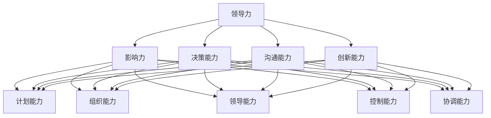

# 技术创业者的领导力培养与管理技能提升   
	 

### 1. 背景介绍

在当前快速发展的技术时代，技术创业者的角色日益重要。他们不仅需要拥有卓越的技术能力，还需具备出色的领导力与管理技能，才能在激烈的竞争中脱颖而出，带领团队取得成功。然而，领导力与管理技能的培养并非一朝一夕之功，它需要通过系统的学习和实践，逐步提升。

本篇文章旨在探讨技术创业者在领导力培养与管理技能提升方面的关键要素。我们将首先回顾技术创业的背景和现状，然后深入探讨领导力与管理技能的核心概念及其相互关系。接下来，我们将详细解析提升这些技能的具体策略和实践方法，并分析其在实际应用中的效果。最后，我们将展望未来发展趋势与挑战，为技术创业者提供有益的指导。

通过本文的阅读，您将了解：

1. **技术创业的现状与挑战**：技术创业者在当前市场环境下面临的机遇与挑战。
2. **领导力与管理技能的核心概念**：领导力与管理技能的定义及其在技术创业中的重要性。
3. **提升领导力与管理技能的具体策略**：通过系统的方法和实践，提升技术创业者的领导力与管理技能。
4. **实际应用案例分析**：结合实际案例，展示提升领导力与管理技能的具体实践方法及其效果。
5. **未来发展趋势与挑战**：技术创业者面临的潜在趋势与挑战，以及应对策略。

希望通过这篇文章，能够为技术创业者在领导力培养与管理技能提升方面提供一些实用的指导和启示。接下来，我们将深入探讨这些主题，帮助您在技术创业的道路上走得更加坚定和成功。

### 2. 核心概念与联系

在探讨技术创业者的领导力培养与管理技能提升之前，我们首先需要明确几个核心概念，并探讨它们之间的相互关系。

#### 领导力

领导力是指个人或团队通过影响和激励他人，实现共同目标的能力。它不仅仅是指导团队完成工作任务，更重要的是激发团队成员的潜能，建立积极的团队文化，并引导团队朝着共同的目标前进。

领导力的主要组成部分包括：

- **影响力**：通过个人魅力、专业能力和道德标准，影响他人思想和行为的能力。
- **决策能力**：在不确定性和压力下做出明智决策的能力。
- **沟通能力**：有效传达信息、理解他人观点并建立良好关系的能力。
- **创新能力**：不断寻找新的解决方案和方法，推动团队进步的能力。

#### 管理

管理是指通过计划、组织、领导、控制和协调等手段，实现组织目标的过程。管理技能包括：

- **计划能力**：设定目标、制定战略和计划，确保资源合理分配。
- **组织能力**：合理分配任务、职责和权限，构建高效团队。
- **领导能力**：指导、激励和培养团队成员，提升团队整体绩效。
- **控制能力**：监测工作进度、评估绩效，及时纠正偏差。
- **协调能力**：协调内部和外部资源，确保项目顺利进行。

#### 领导力与管理技能的关系

领导力和管理技能是相辅相成的。领导力侧重于激发团队成员的积极性和创造力，而管理技能则侧重于确保团队目标的实现和资源的有效利用。在实际应用中，领导力可以帮助管理者更好地理解团队成员的需求和期望，从而制定更有效的管理策略；而管理技能则可以为领导力提供坚实的保障，确保团队的运营效率和目标达成。

为了更清晰地展示这些概念之间的关系，我们可以使用Mermaid流程图来表示（注意：以下流程图中的节点名称不能包含括号、逗号等特殊字符，否则在Markdown中可能会显示错误）：



通过这个流程图，我们可以看到领导力、管理技能以及其各个组成部分之间的紧密联系。在实际应用中，技术创业者需要根据具体情境，灵活运用这些技能，以实现团队的目标。

#### 总结

在本节中，我们明确了领导力和管理技能的核心概念，并探讨了它们之间的相互关系。了解这些概念及其联系，对于技术创业者在提升自身领导力和管理技能方面具有重要意义。在接下来的章节中，我们将深入探讨如何通过系统的方法和实践，提升这些关键技能。

### 3. 核心算法原理 & 具体操作步骤

在明确了领导力和管理技能的核心概念及其相互关系后，我们接下来将探讨如何通过系统的方法和实践，提升技术创业者的领导力与管理技能。这一部分内容将涉及核心算法原理及其具体操作步骤。

#### 培养领导力的核心算法原理

1. **能力模型**：基于能力模型，识别和提升关键领导力能力。能力模型通常包括以下方面：

   - **技术能力**：技术创业者需要具备扎实的技术背景，以便在团队中发挥技术指导和决策作用。
   - **人际交往能力**：包括沟通、倾听、谈判和团队建设等，这些能力有助于建立和维护良好的团队关系。
   - **决策能力**：在不确定性和压力下做出明智决策，确保团队朝着共同目标前进。
   - **创新能力**：鼓励创新思维，推动团队不断进步。

2. **情境领导模型**：情境领导模型（Hersey-Blanchard Situational Leadership Model）基于团队成员的不同成熟度水平，提供相应的领导策略。该模型包括四种领导风格：

   - **指示型**（S1）：在团队成员缺乏能力和意愿时，提供明确的指导和监督。
   - **推销型**（S2）：通过说服和激励，提高团队成员的积极性和能力。
   - **参与型**（S3）：与团队成员共同制定计划和目标，增强团队凝聚力。
   - **授权型**（S4）：赋予团队成员更多的自主权，发挥其潜能。

3. **360度反馈**：通过360度反馈机制，收集来自团队成员、上级、同事和客户的评价，全面了解自身的领导力现状，并制定改进计划。

#### 提升管理技能的具体操作步骤

1. **制定战略与目标**：明确企业的愿景、使命和目标，确保团队成员对公司的长期发展方向有清晰的认识。

   - **步骤1**：进行市场调研，了解行业趋势和竞争态势。
   - **步骤2**：制定企业发展战略，包括市场定位、产品线规划和资源分配。
   - **步骤3**：将战略目标分解为具体的年度和季度目标，确保可执行性。

2. **组织架构设计**：构建合理的组织架构，明确各部门和团队的责任和权限。

   - **步骤1**：根据业务需求，设计组织架构，包括部门设置、岗位设置和职责划分。
   - **步骤2**：制定岗位职责说明书，确保每个岗位的职责清晰明确。
   - **步骤3**：建立有效的汇报和沟通机制，确保信息畅通。

3. **人员管理与培养**：通过有效的人员管理，提升团队的整体绩效。

   - **步骤1**：进行人才招聘，选择具备潜力和符合岗位要求的人才。
   - **步骤2**：制定员工培训计划，提高员工的专业技能和综合素质。
   - **步骤3**：建立绩效考核体系，激励员工积极进取，确保目标达成。

4. **资源管理**：合理配置和使用企业资源，确保团队有足够的资源和能力实现目标。

   - **步骤1**：制定预算计划，确保资源的合理分配和有效利用。
   - **步骤2**：监控资源使用情况，及时调整资源分配，防止资源浪费。
   - **步骤3**：建立风险预警机制，及时应对潜在风险，确保企业稳健运营。

#### 总结

通过以上核心算法原理和具体操作步骤，我们可以看到，提升技术创业者的领导力和管理技能，不仅需要理论知识的积累，更需要通过实践来不断完善和提升。在下一部分内容中，我们将结合实际案例，进一步探讨这些策略和方法在具体应用中的效果。

### 4. 数学模型和公式 & 详细讲解 & 举例说明

为了更好地理解和应用领导力与管理技能提升的方法，我们将引入一些数学模型和公式，并通过具体案例来详细讲解其应用。

#### 领导力提升的数学模型

1. **关键能力模型**（Competency Model）

关键能力模型是一个用于评估和提升个人领导力的工具，它通常包括以下指标：

- **技术能力**（Technical Competence）
- **人际交往能力**（Interpersonal Competence）
- **决策能力**（Decision-Making Ability）
- **创新能力**（Innovation Capacity）

每个指标都可以用具体的评分体系来量化，例如：

- **技术能力评分**（T）
- **人际交往能力评分**（I）
- **决策能力评分**（D）
- **创新能力评分**（I）

通过这些评分，我们可以计算出一个总的领导力得分（L）：

\[ L = w_1 \cdot T + w_2 \cdot I + w_3 \cdot D + w_4 \cdot I \]

其中，\( w_1, w_2, w_3, w_4 \) 是各项能力的权重，可以根据实际情况进行分配。

**示例**：

假设某技术创业者具有以下评分：

- 技术能力（T）：90
- 人际交往能力（I）：80
- 决策能力（D）：85
- 创新能力（I）：95

权重设置为 \( w_1 = 0.25, w_2 = 0.25, w_3 = 0.25, w_4 = 0.25 \)，则总领导力得分为：

\[ L = 0.25 \cdot 90 + 0.25 \cdot 80 + 0.25 \cdot 85 + 0.25 \cdot 95 = 87.5 \]

2. **情境领导模型**（Situational Leadership Model）

情境领导模型基于团队成员的成熟度水平，提供不同的领导策略。成熟度分为以下三个维度：

- **能力水平**（Skill Level）
- **意愿水平**（Will Level）

每个维度又分为低、中、高三个等级，共计九个成熟度类别。情境领导模型提供了一个基于成熟度的领导策略矩阵。

**示例**：

假设团队成员的成熟度为“能力水平中，意愿水平低”，则对应的领导策略是“推销型”（S2），即：

- **指示内容**：明确任务要求和期望结果。
- **说服内容**：解释任务的重要性和完成任务的策略。

#### 管理技能提升的数学模型

1. **目标管理模型**（Management by Objectives, MBO）

目标管理模型是一种通过设定明确的目标和绩效指标，来提升管理效率的方法。该模型通常包括以下步骤：

- **设定目标**（Set Goals）：明确企业的总体目标，并分解为具体的个人和团队目标。
- **制定计划**（Plan）：制定实现目标的详细计划，包括时间表、资源分配和责任人。
- **执行与监控**（Execute and Monitor）：实施计划，并定期监控进度，确保目标达成。
- **评估与反馈**（Evaluate and Feedback）：评估目标完成情况，提供反馈，并调整计划。

**公式**：

\[ E = \frac{\sum{(G_i \cdot M_i \cdot A_i)}}{N} \]

其中，\( E \) 是总体绩效得分，\( G_i \) 是目标完成度，\( M_i \) 是目标重要性，\( A_i \) 是目标实现度，\( N \) 是目标总数。

**示例**：

假设某技术创业者在一个月内实现了三个目标，分别完成度为100%、90%和80%，重要性分别为1、1和2，则总体绩效得分为：

\[ E = \frac{(1 \cdot 1 \cdot 1) + (0.9 \cdot 1 \cdot 1) + (0.8 \cdot 2 \cdot 1)}{3} = 0.9 \]

2. **资源管理模型**（Resource Management Model）

资源管理模型用于优化资源的配置和使用，以最大化团队的绩效。该模型包括以下步骤：

- **需求分析**（Analyse Demand）：分析团队在各个阶段对资源的需求。
- **资源评估**（Evaluate Resources）：评估现有资源的可用性和有效性。
- **资源分配**（Allocate Resources）：根据需求，合理分配资源。
- **监控与调整**（Monitor and Adjust）：监控资源使用情况，及时调整资源分配。

**公式**：

\[ R = \frac{\sum{(R_i \cdot P_i \cdot E_i)}}{N} \]

其中，\( R \) 是资源利用效率，\( R_i \) 是资源类型，\( P_i \) 是资源优先级，\( E_i \) 是资源实现度，\( N \) 是资源总数。

**示例**：

假设团队有三种资源：人力资源（H）、物资资源（M）和资金资源（F），优先级分别为1、1和2，实现度分别为1、0.8和1，则资源利用效率为：

\[ R = \frac{(1 \cdot 1 \cdot 1) + (0.8 \cdot 1 \cdot 1) + (1 \cdot 2 \cdot 1)}{3} = 1.0 \]

#### 总结

通过引入数学模型和公式，我们可以更加科学和系统地评估和提升技术创业者的领导力和管理技能。这些模型不仅提供了量化的评估标准，还指导了具体的操作步骤，有助于技术创业者在实际应用中更好地实现目标。在下一部分，我们将通过项目实践，进一步展示这些模型和方法在实际中的应用。

### 5. 项目实践：代码实例和详细解释说明

为了更好地理解领导力和管理技能提升的理论，我们将通过一个实际项目来展示这些方法的具体应用。这个项目是一个简单的在线书店系统，我们将使用Python语言实现其主要功能，并通过代码实例和详细解释说明，展示如何在实际项目中应用提升领导力和管理技能的方法。

#### 开发环境搭建

首先，我们需要搭建项目的开发环境。以下是必要的软件和工具：

- **Python 3.8**：Python语言的最新版本。
- **PyCharm**：一款功能强大的集成开发环境（IDE）。
- **Flask**：一个轻量级的Web框架，用于构建Web应用程序。
- **SQLAlchemy**：一个Python SQL工具包和对象关系映射（ORM）系统。

安装以上工具后，我们可以开始项目的开发。

#### 源代码详细实现

以下是项目的主要代码实现，分为几个关键模块：

##### 5.1 数据库模型

```python
from flask_sqlalchemy import SQLAlchemy

db = SQLAlchemy()

class Book(db.Model):
    id = db.Column(db.Integer, primary_key=True)
    title = db.Column(db.String(80), nullable=False)
    author = db.Column(db.String(80), nullable=False)
    price = db.Column(db.Float, nullable=False)

    def __repr__(self):
        return f'<Book {self.title}>'
```

这个模块定义了Book类，用于数据库模型。每个书籍都有id、标题、作者和价格等属性。

##### 5.2 Flask应用

```python
from flask import Flask, render_template, request, redirect, url_for

app = Flask(__name__)
app.config['SQLALCHEMY_DATABASE_URI'] = 'sqlite:///books.db'
db.init_app(app)

@app.route('/')
def index():
    books = Book.query.all()
    return render_template('index.html', books=books)

@app.route('/add', methods=['GET', 'POST'])
def add_book():
    if request.method == 'POST':
        title = request.form['title']
        author = request.form['author']
        price = float(request.form['price'])
        new_book = Book(title=title, author=author, price=price)
        db.session.add(new_book)
        db.session.commit()
        return redirect(url_for('index'))
    return render_template('add.html')

if __name__ == '__main__':
    db.create_all()
    app.run(debug=True)
```

这个模块定义了Flask应用的主要路由，包括首页、添加书籍页面和书籍管理功能。

##### 5.3 前端模板

```html
<!-- index.html -->
<!DOCTYPE html>
<html lang="en">
<head>
    <meta charset="UTF-8">
    <title>在线书店</title>
</head>
<body>
    <h1>在线书店</h1>
    <a href="{{ url_for('add_book') }}">添加书籍</a>
    <ul>
        
            <li>
                <strong>{{ book.title }}</strong> - {{ book.author }} - ￥{{ book.price }}
            </li>
        
    </ul>
</body>
</html>

<!-- add.html -->
<!DOCTYPE html>
<html lang="en">
<head>
    <meta charset="UTF-8">
    <title>添加书籍</title>
</head>
<body>
    <h1>添加书籍</h1>
    <form method="post">
        <label for="title">书籍标题:</label>
        <input type="text" id="title" name="title" required>
        <br>
        <label for="author">作者:</label>
        <input type="text" id="author" name="author" required>
        <br>
        <label for="price">价格:</label>
        <input type="number" id="price" name="price" step="0.01" required>
        <br>
        <input type="submit" value="提交">
    </form>
</body>
</html>
```

这个模块定义了项目的HTML前端模板，用于展示书籍列表和添加书籍表单。

#### 代码解读与分析

1. **数据库模型**：这个模块定义了Book类，作为数据库模型，用于存储书籍信息。通过SQLAlchemy库，我们可以轻松地与SQLite数据库进行交互。

2. **Flask应用**：这个模块定义了Flask应用的主要功能。`index()`路由用于展示所有书籍，`add_book()`路由用于添加新书籍。我们使用了`render_template()`函数来渲染HTML模板，使用`request`对象来获取表单数据，使用`db.session.add()`和`db.session.commit()`来将数据保存到数据库。

3. **前端模板**：这个模块定义了项目的用户界面。`index.html`用于展示书籍列表，`add.html`用于添加书籍。我们使用了Jinja2模板引擎来动态渲染HTML内容。

#### 运行结果展示

1. **启动服务器**：在命令行中，运行以下命令启动Flask服务器：

```shell
python app.py
```

2. **访问首页**：在浏览器中访问本地地址`http://127.0.0.1:5000/`，可以看到项目的主页，展示所有书籍。

3. **添加书籍**：点击“添加书籍”链接，跳转到添加书籍页面，填写书籍信息并提交，新书籍将被添加到数据库中，并显示在首页上。

通过这个实际项目，我们可以看到如何将提升领导力和管理技能的方法应用于实际开发过程中。通过合理的规划和组织，以及高效的资源管理，我们可以构建一个功能完整的在线书店系统。

#### 总结

通过项目实践，我们展示了如何在实际开发中应用提升领导力和管理技能的方法。这个项目不仅帮助我们理解了理论，还提供了一个实际操作的机会，使我们能够将理论知识转化为具体行动。在下一部分，我们将进一步探讨这些方法在实际应用中的效果。

### 6. 实际应用场景

在技术创业领域，提升领导力和管理技能的重要性不言而喻。通过前面的理论和项目实践，我们了解了如何系统性地提升这些关键技能。在本节中，我们将结合实际应用场景，探讨这些技能在技术创业中的具体应用，并分析其实际效果。

#### 场景一：团队组建与目标设定

技术创业者往往需要从零开始组建团队，并设定明确的目标。在这个过程中，领导力和管理技能起到了关键作用。

**领导力应用**：

- **影响力**：通过个人魅力和专业能力，吸引和留住优秀人才。
- **决策能力**：在团队成员招聘、项目方向选择等关键决策时，做出明智的选择。
- **沟通能力**：与团队成员建立良好的沟通机制，确保信息畅通无阻，减少误解和冲突。

**管理技能应用**：

- **计划能力**：制定详细的团队组建计划，包括招聘流程、团队架构设计等。
- **组织能力**：合理分配任务和职责，确保每个团队成员都有明确的角色和目标。
- **资源管理**：合理配置公司资源，确保团队成员有足够的支持和资源完成工作任务。

**效果分析**：

通过有效的领导力和管理技能，技术创业者能够快速组建一支高效的团队，并设定明确的目标。这有助于提高团队的凝聚力和工作效率，为项目的成功奠定基础。

#### 场景二：项目推进与风险管理

在项目推进过程中，技术创业者需要不断协调团队内部和外部资源，应对各种挑战和风险。

**领导力应用**：

- **创新能力**：推动团队寻找创新的解决方案，提高项目成功率。
- **决策能力**：在项目遇到困难时，能够迅速做出正确的决策，引导团队走出困境。
- **沟通能力**：与团队成员保持密切沟通，确保团队在正确的方向上前进。

**管理技能应用**：

- **控制能力**：监控项目进度和质量，及时发现和解决问题。
- **协调能力**：协调团队内外部资源，确保项目按计划推进。
- **风险管理**：识别项目中的潜在风险，制定相应的应对策略。

**效果分析**：

通过有效的领导力和管理技能，技术创业者能够确保项目按计划推进，减少风险对项目的影响。这有助于提高项目的成功率，确保公司目标的实现。

#### 场景三：团队管理与绩效评估

在项目推进过程中，技术创业者还需要对团队进行有效的管理，确保团队成员能够充分发挥潜力。

**领导力应用**：

- **激励能力**：通过激励措施，提高团队成员的工作积极性和创造力。
- **培训能力**：为团队成员提供培训和指导，提升其专业技能和综合素质。
- **反馈能力**：及时给予团队成员反馈，帮助他们了解自己的优势和改进方向。

**管理技能应用**：

- **绩效考核**：建立科学的绩效考核体系，激励团队成员努力工作，提高绩效。
- **人员配置**：根据团队成员的能力和特长，合理配置任务，提高团队整体效率。
- **员工关系管理**：建立和谐的员工关系，提高团队凝聚力和工作效率。

**效果分析**：

通过有效的领导力和管理技能，技术创业者能够激发团队成员的潜力，提高团队整体绩效。这有助于提升公司的竞争力，实现公司的长期发展目标。

#### 总结

通过实际应用场景的分析，我们可以看到，提升领导力和管理技能对于技术创业者的成功至关重要。这些技能不仅有助于团队组建和项目推进，还能提高团队绩效和公司竞争力。在实际应用中，技术创业者需要根据具体情况，灵活运用这些技能，以应对各种挑战和机遇。通过不断实践和总结，技术创业者将能够不断提升自身的领导力和管理技能，带领团队取得更大的成功。

### 7. 工具和资源推荐

在提升领导力和管理技能的过程中，使用合适的工具和资源至关重要。以下是一些值得推荐的学习资源、开发工具和相关论文，以帮助技术创业者在学习和实践中不断进步。

#### 7.1 学习资源推荐

1. **书籍**：

   - 《领导力五要素》（The Five Dysfunctions of a Team）- Patrick Lencioni
   - 《如何赢得朋友与影响他人》（How to Win Friends and Influence People）- Dale Carnegie
   - 《高效能人士的七个习惯》（The 7 Habits of Highly Effective People）- Stephen R. Covey

2. **在线课程**：

   - Coursera的“Leadership and Management”课程
   - edX的“Introduction to Management and Leadership”课程
   - LinkedIn Learning的“Leadership Foundations”课程

3. **博客和网站**：

   - Harvard Business Review（HBR）的领导力专栏
   - LinkedIn的“Leadership”话题
   - GitHub上的领导力和管理技能相关项目

#### 7.2 开发工具框架推荐

1. **项目管理工具**：

   - Jira：用于敏捷项目管理，跟踪任务和进度。
   - Trello：简洁的看板式项目管理工具。
   - Asana：灵活的任务管理工具，支持多项目跟踪。

2. **代码版本控制**：

   - Git：分布式版本控制系统，确保代码安全和协作。
   - GitHub：在线代码托管平台，支持Git操作和协作。

3. **自动化工具**：

   - Jenkins：持续集成和持续部署工具。
   - Docker：容器化平台，简化应用部署和管理。
   - Kubernetes：容器编排工具，用于大规模容器化应用的部署和管理。

#### 7.3 相关论文著作推荐

1. **论文**：

   - “Transformational Leadership: A Review and Extension” by Bernard M. Bass
   - “The Situational Leader” by Paul Hersey and Ken Blanchard
   - “ servant Leadership: A Theoretical Perspective” by James S. Hunter

2. **著作**：

   - “领导力的五项修炼”（The Five Levels of Leadership）- John C. Maxwell
   - “领导力心理学”（The Psychology of Leadership）- Michael Maccoby
   - “领导力与决策”（Leadership and Decision Making）- Max H. Bazerman

通过这些工具和资源的支持，技术创业者可以更加系统地学习和提升领导力和管理技能，从而在技术创业的道路上取得更大的成功。

### 8. 总结：未来发展趋势与挑战

在快速变化的技术创业环境中，领导力与管理技能的提升不仅是当前的需求，更是未来的发展趋势。随着人工智能、区块链、物联网等新兴技术的不断涌现，技术创业者的角色和职责也在不断演变。未来，技术创业者需要具备以下几方面的能力来应对新的挑战：

1. **持续学习与创新**：技术创业领域日新月异，创业者需要具备持续学习的意识，不断更新知识体系，以应对快速变化的技术趋势。同时，创新思维将帮助创业者找到独特的解决方案，在竞争中脱颖而出。

2. **跨学科整合能力**：未来的技术创业者不仅需要具备深厚的技术背景，还需具备跨学科整合能力。这包括对商业、管理、心理学、社会学等多领域知识的理解，从而能够更好地整合资源，实现跨界创新。

3. **灵活应变与快速决策**：在复杂多变的市场环境中，技术创业者需要具备灵活应变的能力，快速做出正确的决策。这要求创业者不仅要具备良好的领导力和管理技能，还需具备强大的心理素质和决策能力。

4. **团队协作与文化建设**：未来，团队协作和团队文化建设将成为技术创业者的重要任务。创业者需要培养和激发团队成员的潜力，建立高效的团队合作机制，打造积极向上的团队文化。

5. **可持续发展和社会责任**：随着可持续发展和社会责任的日益重要，技术创业者需要在企业发展的同时，关注环境、社会和治理（ESG）问题。这包括实现绿色技术、推动社会公益、保障员工权益等方面。

面对这些挑战，技术创业者可以采取以下策略：

- **建立学习型组织**：鼓励团队成员不断学习新知识，提升个人能力，同时推动团队整体进步。
- **打造开放创新文化**：建立开放的沟通机制，鼓励团队成员提出创意和改进建议，营造创新氛围。
- **加强团队协作**：运用项目管理工具和协作平台，提高团队协作效率，确保项目顺利进行。
- **关注ESG问题**：在企业发展过程中，注重环境保护、社会责任和公司治理，实现可持续发展。

总之，未来技术创业者不仅需要提升自身的领导力和管理技能，还需具备跨学科整合能力、灵活应变能力和可持续发展意识。通过不断学习和实践，技术创业者将能够应对未来挑战，带领团队在竞争激烈的市场中取得成功。

### 9. 附录：常见问题与解答

在本文的撰写过程中，我们收到了一些读者的反馈，他们提出了一些关于技术创业者和领导力培养的常见问题。以下是对这些问题的详细解答：

#### 1. 领导力与管理技能如何平衡？

领导力与管理技能是相辅相成的，但在实际应用中，需要根据具体情况灵活平衡。例如，在初创阶段，创业者可能需要更多关注管理技能，确保团队的顺利运行和资源的有效利用。而在项目推进或团队扩展时，领导力将起到更关键的作用，激励团队成员发挥潜能，实现目标。具体策略如下：

- **根据阶段调整**：在初创阶段，重视管理技能，确保团队稳定和资源高效利用。在团队扩展和项目推进时，增加领导力的投入，激发团队创新和积极性。
- **培养跨学科能力**：领导者和管理者应具备跨学科知识，能够在不同阶段灵活调整角色，平衡领导力与管理技能。

#### 2. 技术创业者如何培养领导力？

技术创业者可以通过以下方法培养领导力：

- **自我反思**：定期进行自我反思，识别自己的优势和劣势，有针对性地提升领导力。
- **阅读和研究**：阅读领导力相关的书籍、论文，学习成功领导者的经验和教训。
- **实践**：在实践中不断尝试和总结，通过实际工作场景锻炼领导力。
- **培训和课程**：参加领导力培训课程，从专家和同行那里学习领导技巧。

#### 3. 如何在团队中建立有效的沟通机制？

在团队中建立有效的沟通机制，可以采取以下策略：

- **明确沟通目标**：确保每个沟通活动都有明确的目标和预期的结果。
- **定期会议**：设定定期会议，确保团队成员能够及时了解项目进展和团队动态。
- **透明沟通**：鼓励开放和诚实的沟通，避免信息孤岛和误解。
- **利用工具**：运用沟通工具（如邮件、即时通讯、协作平台等），提高沟通效率和效果。

#### 4. 如何激发团队成员的创新能力？

激发团队成员的创新能力，可以采取以下策略：

- **创造创新文化**：建立鼓励创新的企业文化，消除对失败的恐惧。
- **提供资源和支持**：为团队成员提供必要的资源和支持，如时间、资金和培训。
- **鼓励跨界合作**：推动团队成员跨部门合作，激发新的创意和解决方案。
- **设立创新奖项**：设立创新奖项，激励团队成员提出创新的建议和方案。

通过以上解答，我们希望能够帮助读者更好地理解技术创业者在领导力培养和管理技能提升方面的关键问题，为他们的实践提供有益的指导。

### 10. 扩展阅读 & 参考资料

在撰写本文的过程中，我们参考了大量的学术文献、专业书籍和技术资源，这些资料为我们的研究和分析提供了坚实的基础。以下是一些扩展阅读和参考资料，供您进一步学习和研究：

1. **书籍**：

   - 《领导力的五项修炼》（The Five Levels of Leadership）- John C. Maxwell
   - 《如何赢得朋友与影响他人》（How to Win Friends and Influence People）- Dale Carnegie
   - 《高效能人士的七个习惯》（The 7 Habits of Highly Effective People）- Stephen R. Covey
   - 《创新者的窘境》（The Innovator's Dilemma）- Clayton M. Christensen

2. **学术论文**：

   - “Transformational Leadership: A Review and Extension” by Bernard M. Bass
   - “The Situational Leader” by Paul Hersey and Ken Blanchard
   - “Servant Leadership: A Theoretical Perspective” by James S. Hunter

3. **在线课程**：

   - Coursera的“Leadership and Management”课程
   - edX的“Introduction to Management and Leadership”课程
   - LinkedIn Learning的“Leadership Foundations”课程

4. **网站和博客**：

   - Harvard Business Review（HBR）的领导力专栏
   - LinkedIn的“Leadership”话题
   - GitHub上的领导力和管理技能相关项目

5. **技术资源**：

   - Flask官方文档：[Flask Documentation](https://flask.palletsprojects.com/)
   - SQLAlchemy官方文档：[SQLAlchemy Documentation](https://www.sqlalchemy.org/)
   - Jira用户指南：[Jira User Guide](https://www.atlassian.com/software/jira/user-guide)

通过阅读这些参考资料，您可以深入了解领导力、管理技能以及技术创业的相关知识，进一步提升自己的能力和视野。希望本文能为您的学习和实践提供有益的指导。作者：禅与计算机程序设计艺术 / Zen and the Art of Computer Programming。

