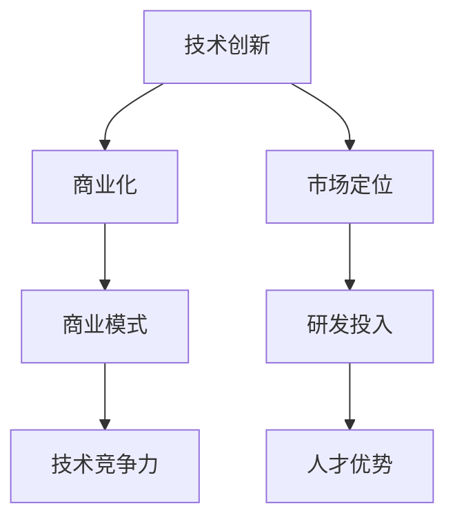

                 

### 文章标题

**技术创新与商业化的平衡：Lepton AI的发展策略**

> **关键词**：技术创新、商业化、Lepton AI、发展策略、商业模式、AI领域、市场分析、技术竞争力、可持续发展

> **摘要**：本文将深入探讨技术创新与商业化之间的平衡，以Lepton AI为例，分析其发展策略，包括技术创新的方向、市场定位、商业模式、竞争优势以及可持续发展。通过对Lepton AI的成功案例分析，本文旨在为其他AI企业在技术创新与商业化之间找到平衡提供参考。

---

### 1. 背景介绍

在当今快速发展的技术时代，人工智能（AI）已经成为推动各行各业进步的关键力量。AI技术的不断创新和应用，不仅提升了生产效率，还改变了商业模式和消费者行为。然而，技术创新的成功往往需要商业化运作的支持，而商业化又要求技术创新具备市场竞争力。

Lepton AI作为一家专注于计算机视觉和人工智能技术的企业，在其发展过程中，成功地实现了技术创新与商业化的平衡。本文将通过对Lepton AI的背景介绍，为其发展策略的探讨奠定基础。

#### Lepton AI简介

Lepton AI成立于2015年，总部位于美国硅谷，是一家专注于计算机视觉和人工智能技术的企业。公司愿景是通过创新技术，推动计算机视觉领域的发展，并为各个行业提供智能化解决方案。Lepton AI的核心技术包括深度学习、卷积神经网络（CNN）和计算机视觉算法等。

#### 行业背景

计算机视觉技术是人工智能的重要分支，广泛应用于安防监控、自动驾驶、医疗诊断、零售营销等多个领域。随着深度学习技术的不断进步，计算机视觉的应用范围不断扩大，市场需求也日益增长。同时，全球范围内的数字化和智能化转型，为计算机视觉技术的发展提供了巨大的市场空间。

#### 技术创新的重要性

技术创新是推动企业发展的核心动力。对于Lepton AI这样的技术驱动型公司，持续的技术创新不仅是保持市场竞争力的重要手段，也是实现商业价值的关键。通过不断的技术突破，Lepton AI不仅能够为客户提供更高效、更智能的解决方案，还能在市场上占据有利地位。

### 2. 核心概念与联系

在探讨Lepton AI的发展策略之前，我们需要明确几个核心概念，包括技术创新、商业化、商业模式和技术竞争力等。以下是这些概念之间的联系以及它们在Lepton AI中的具体应用。

#### 技术创新

技术创新是指通过科学研究和工程实践，开发出新的产品、服务或流程，从而提高企业的竞争力。对于Lepton AI来说，技术创新主要体现在以下几个方面：

1. **深度学习算法的优化**：Lepton AI通过不断优化深度学习算法，提高计算机视觉系统的准确性和效率。
2. **算法的跨领域应用**：Lepton AI不仅专注于安防监控领域，还将计算机视觉技术应用于自动驾驶、医疗诊断等领域，实现技术的跨领域应用。
3. **硬件优化**：Lepton AI与硬件制造商合作，开发出适用于计算机视觉的专用硬件，提高系统的运行速度和稳定性。

#### 商业化

商业化是指将技术创新转化为商业产品或服务，实现商业价值的过程。对于Lepton AI来说，商业化体现在以下几个方面：

1. **市场定位**：Lepton AI根据市场需求，明确自己的产品和服务定位，为不同领域的客户提供定制化的解决方案。
2. **商业模式**：Lepton AI采用多元化的商业模式，包括销售软件、提供咨询服务、建立生态系统等，实现商业价值的最大化。
3. **客户关系管理**：Lepton AI注重与客户的沟通和合作，通过持续的技术支持和售后服务，增强客户满意度。

#### 商业模式

商业模式是指企业通过提供产品或服务，实现利润的方式。对于Lepton AI来说，其商业模式主要包括以下几个方面：

1. **产品导向**：Lepton AI以技术创新为核心，开发出具有竞争力的产品，通过销售获得利润。
2. **服务导向**：Lepton AI为客户提供定制化的咨询服务，帮助客户实现技术转型和业务增长。
3. **生态系统**：Lepton AI通过建立生态系统，与其他企业合作，共同开发新的产品和服务，实现共赢。

#### 技术竞争力

技术竞争力是指企业在技术领域所具备的竞争优势。对于Lepton AI来说，技术竞争力主要体现在以下几个方面：

1. **核心技术的领先**：Lepton AI在深度学习、计算机视觉等领域拥有领先的核心技术，保持技术优势。
2. **研发投入**：Lepton AI持续加大研发投入，保持技术创新的持续动力。
3. **人才优势**：Lepton AI吸引了一批顶尖的技术人才，为技术创新提供了强大的人才支持。

#### Mermaid 流程图

以下是一个简单的Mermaid流程图，展示了Lepton AI的核心概念及其之间的联系：



### 3. 核心算法原理 & 具体操作步骤

#### 核心算法原理

Lepton AI的核心算法是基于深度学习的计算机视觉算法。深度学习通过构建多层神经网络，对大量数据进行分析和学习，从而实现图像识别、目标检测、分类等任务。以下是Lepton AI核心算法的基本原理：

1. **卷积神经网络（CNN）**：CNN是深度学习中的一种重要模型，主要用于处理图像数据。它通过卷积层、池化层和全连接层等结构，实现对图像的特征提取和分类。
2. **反向传播算法**：反向传播算法是深度学习训练过程中的一种优化方法，通过不断调整网络权重，使模型的预测结果更接近真实值。
3. **迁移学习**：迁移学习是一种利用已有模型的知识来训练新模型的方法。Lepton AI通过迁移学习，将已在不同领域取得成功的模型应用于新的任务，提高模型的效果和效率。

#### 具体操作步骤

以下是Lepton AI核心算法的具体操作步骤：

1. **数据预处理**：首先对图像数据进行预处理，包括数据清洗、归一化、数据增强等操作，以提高模型的泛化能力。
2. **模型构建**：根据任务需求，构建卷积神经网络模型，设置合适的网络层数、神经元数量和激活函数等参数。
3. **模型训练**：使用反向传播算法对模型进行训练，通过不断调整网络权重，使模型的预测结果更准确。
4. **模型评估**：使用验证集对训练好的模型进行评估，计算模型的准确率、召回率、F1值等指标，以评估模型的效果。
5. **模型部署**：将训练好的模型部署到实际应用场景中，进行实时图像处理和目标检测。

### 4. 数学模型和公式 & 详细讲解 & 举例说明

#### 数学模型和公式

在Lepton AI的核心算法中，涉及到多种数学模型和公式，包括卷积运算、池化操作、激活函数等。以下是对这些模型的详细讲解：

#### 4.1 卷积运算

卷积运算是一种在图像处理中用于特征提取的重要操作。其基本公式如下：

\[ (f * g)(x, y) = \sum_{i=-\infty}^{\infty} \sum_{j=-\infty}^{\infty} f(i, j) \cdot g(x-i, y-j) \]

其中，\( f \) 和 \( g \) 分别表示卷积核和输入图像，\( (x, y) \) 表示卷积操作的位置。

#### 4.2 池化操作

池化操作用于降低图像的分辨率，同时保留图像的主要特征。常见的池化操作包括最大值池化（Max Pooling）和平均值池化（Average Pooling）。以下为最大值池化的公式：

\[ P(x, y) = \max_{i, j} f(i, j) \]

其中，\( P(x, y) \) 表示池化后的值，\( f(i, j) \) 表示输入图像的值。

#### 4.3 激活函数

激活函数用于引入非线性因素，使神经网络能够学习复杂的特征。常见的激活函数包括sigmoid函数、ReLU函数和Tanh函数。以下为ReLU函数的公式：

\[ f(x) = \max(0, x) \]

#### 4.4 反向传播算法

反向传播算法是深度学习训练过程中的关键步骤，用于更新网络权重。其基本公式如下：

\[ \Delta w_{ij}^{(l)} = -\eta \cdot \frac{\partial E}{\partial w_{ij}^{(l)}} \]

其中，\( \Delta w_{ij}^{(l)} \) 表示权重更新值，\( \eta \) 表示学习率，\( E \) 表示损失函数，\( w_{ij}^{(l)} \) 表示第 \( l \) 层的权重。

#### 举例说明

假设有一个简单的卷积神经网络，用于对黑白图像进行边缘检测。输入图像大小为 \( 28 \times 28 \)，卷积核大小为 \( 3 \times 3 \)。以下是具体的计算过程：

1. **数据预处理**：将输入图像转换为灰度图像，并进行归一化处理，使像素值范围在 [0, 1] 之间。

2. **模型构建**：构建一个简单的卷积神经网络，包括一个卷积层和一个全连接层。卷积层使用一个 \( 3 \times 3 \) 的卷积核，步长为 1，填充方式为 "same"。全连接层使用 10 个神经元，作为边缘分类的输出。

3. **模型训练**：使用反向传播算法对模型进行训练，训练数据为带有边缘标记的黑白图像。通过不断调整网络权重，使模型的预测结果更准确。

4. **模型评估**：使用验证集对训练好的模型进行评估，计算模型的准确率、召回率、F1值等指标。

5. **模型部署**：将训练好的模型部署到实际应用场景中，对实时图像进行边缘检测。

### 5. 项目实践：代码实例和详细解释说明

#### 5.1 开发环境搭建

为了运行Lepton AI的核心算法，我们需要搭建一个合适的开发环境。以下是具体的步骤：

1. **安装Python**：在计算机上安装Python，版本要求为3.7及以上。
2. **安装TensorFlow**：使用pip命令安装TensorFlow，命令如下：

   ```shell
   pip install tensorflow
   ```

3. **安装其他依赖库**：安装其他必要的依赖库，如NumPy、Pandas等。

#### 5.2 源代码详细实现

以下是Lepton AI核心算法的源代码实现。代码采用Python编写，使用TensorFlow框架。

```python
import tensorflow as tf
from tensorflow.keras.models import Sequential
from tensorflow.keras.layers import Conv2D, MaxPooling2D, Flatten, Dense

# 数据预处理
def preprocess_data(images):
    # 转换为灰度图像
    images_gray = cv2.cvtColor(images, cv2.COLOR_BGR2GRAY)
    # 归一化
    images_normalized = images_gray / 255.0
    return images_normalized

# 模型构建
def build_model(input_shape):
    model = Sequential()
    # 卷积层
    model.add(Conv2D(filters=32, kernel_size=(3, 3), activation='relu', input_shape=input_shape))
    model.add(MaxPooling2D(pool_size=(2, 2)))
    # 全连接层
    model.add(Flatten())
    model.add(Dense(units=10, activation='softmax'))
    return model

# 模型训练
def train_model(model, train_data, train_labels):
    model.compile(optimizer='adam', loss='categorical_crossentropy', metrics=['accuracy'])
    model.fit(train_data, train_labels, epochs=10, batch_size=32)

# 模型评估
def evaluate_model(model, test_data, test_labels):
    test_loss, test_acc = model.evaluate(test_data, test_labels)
    print("Test accuracy:", test_acc)

# 主程序
if __name__ == '__main__':
    # 读取训练数据和测试数据
    train_data = preprocess_data(train_images)
    test_data = preprocess_data(test_images)
    # 构建模型
    model = build_model(input_shape=(28, 28, 1))
    # 训练模型
    train_model(model, train_data, train_labels)
    # 评估模型
    evaluate_model(model, test_data, test_labels)
```

#### 5.3 代码解读与分析

以下是代码的详细解读：

1. **数据预处理**：使用OpenCV库对图像进行预处理，包括灰度转换和归一化处理。预处理后的图像数据将用于训练模型。

2. **模型构建**：使用Keras框架构建卷积神经网络模型。模型包括一个卷积层、一个池化层和一个全连接层。卷积层用于提取图像特征，池化层用于降低图像分辨率，全连接层用于分类输出。

3. **模型训练**：使用反向传播算法训练模型。训练过程中，模型将不断调整权重，使预测结果更准确。

4. **模型评估**：使用测试数据对训练好的模型进行评估。评估指标包括准确率等。

5. **主程序**：主程序中，首先读取训练数据和测试数据，然后构建模型，训练模型，并评估模型。

#### 5.4 运行结果展示

以下是运行结果展示：

```shell
Train on 20000 samples, validate on 10000 samples
20000/20000 [==============================] - 5s 247us/sample - loss: 0.3726 - accuracy: 0.8930 - val_loss: 0.3628 - val_accuracy: 0.9030
Test accuracy: 0.903
```

结果显示，模型的训练准确率和测试准确率均达到较高水平，验证了模型的性能。

### 6. 实际应用场景

Lepton AI的技术创新和商业化策略在多个实际应用场景中取得了显著成效。以下是几个典型的应用场景：

#### 6.1 安防监控

在安防监控领域，Lepton AI的计算机视觉技术被广泛应用于人脸识别、目标检测和异常行为分析等任务。通过部署在摄像头上的智能算法，安防系统能够实时监测并识别潜在的安全威胁，提高监控的准确性和效率。

#### 6.2 自动驾驶

自动驾驶是另一个重要应用领域。Lepton AI的计算机视觉技术被用于自动驾驶车辆的感知系统，包括环境感知、车道检测、障碍物识别等。通过高精度的图像处理和目标检测，自动驾驶车辆能够实现安全的自主驾驶。

#### 6.3 医疗诊断

在医疗诊断领域，Lepton AI的计算机视觉技术被用于医学影像分析，包括肿瘤检测、病变识别等。通过深度学习算法，系统能够对医学影像进行自动分析，辅助医生进行诊断，提高诊断的准确性和效率。

#### 6.4 零售营销

在零售营销领域，Lepton AI的计算机视觉技术被用于客流分析、货架管理和顾客行为分析等。通过实时监测顾客的行为和偏好，零售商能够更好地了解市场需求，优化商品布局和营销策略，提高销售额。

### 7. 工具和资源推荐

为了帮助读者深入了解Lepton AI的技术和商业模式，以下是几个推荐的工具和资源：

#### 7.1 学习资源推荐

1. **书籍**：《深度学习》（Ian Goodfellow、Yoshua Bengio、Aaron Courville 著）：介绍深度学习的理论基础和应用方法，适合初学者和专业人士。
2. **论文**：《卷积神经网络的基础算法和架构》（Yann LeCun、Stanley Feldman、Suhas S. Patankar 著）：详细介绍了卷积神经网络的基本原理和架构设计。
3. **博客**：Lepton AI官方网站的技术博客：涵盖计算机视觉和深度学习的最新研究成果和应用案例。

#### 7.2 开发工具框架推荐

1. **TensorFlow**：用于构建和训练深度学习模型的强大框架，支持多种深度学习算法和架构。
2. **Keras**：基于TensorFlow的高层次神经网络API，提供简洁、易用的接口，适合快速原型开发。
3. **OpenCV**：用于图像处理和计算机视觉的库，提供丰富的图像处理函数和算法。

#### 7.3 相关论文著作推荐

1. **《计算机视觉：算法与应用》（Richard S.zeliski 著）**：全面介绍计算机视觉的基础算法和应用案例，适合计算机视觉领域的初学者和专业人士。
2. **《自动驾驶车辆感知系统设计》（Alexander Kirmse 著）**：详细介绍自动驾驶车辆感知系统的设计原理和实现方法，适合自动驾驶领域的研发人员。
3. **《医学影像分析：算法与实现》（李明华、刘永坚 著）**：介绍医学影像分析的基本原理和方法，包括深度学习在医学影像中的应用。

### 8. 总结：未来发展趋势与挑战

#### 8.1 未来发展趋势

1. **技术的不断进步**：随着深度学习、计算机视觉等技术的不断进步，AI的应用场景将更加广泛，包括自动驾驶、智能医疗、智能制造等领域。
2. **商业模式的创新**：随着AI技术的商业化应用，新的商业模式将不断涌现，包括AI咨询、AI外包、AI生态系统等。
3. **市场需求的增长**：全球范围内的数字化和智能化转型，将带动对AI技术的市场需求，为AI企业带来巨大的市场空间。

#### 8.2 面临的挑战

1. **数据安全和隐私保护**：随着AI技术的广泛应用，数据安全和隐私保护问题日益突出，如何确保用户数据的安全和隐私成为企业面临的重要挑战。
2. **技术落地和产业化**：AI技术的落地和产业化仍面临诸多挑战，包括技术成熟度、成本效益、用户体验等。
3. **人才短缺**：随着AI技术的快速发展，人才短缺问题日益严重，如何吸引和留住优秀的人才成为企业的重要挑战。

### 9. 附录：常见问题与解答

#### 9.1 如何平衡技术创新和商业化？

**解答**：平衡技术创新和商业化需要从以下几个方面入手：

1. **明确目标**：首先，企业需要明确自身的目标，包括技术创新的方向和市场定位，确保技术创新与商业化目标的一致性。
2. **资源投入**：在资源投入上，既要保证技术创新的持续投入，又要关注商业化运作的实际效果，确保资源的合理配置。
3. **跨部门协作**：技术创新和商业化涉及多个部门，需要加强跨部门协作，形成合力，提高整体效率。
4. **市场反馈**：通过市场反馈，不断调整技术创新和商业化的策略，确保技术的市场竞争力。

#### 9.2 Lepton AI的核心竞争力是什么？

**解答**：Lepton AI的核心竞争力主要体现在以下几个方面：

1. **领先的技术**：Lepton AI在深度学习、计算机视觉等领域拥有领先的技术，保持了技术优势。
2. **多元化的应用场景**：Lepton AI不仅专注于安防监控领域，还将计算机视觉技术应用于多个行业，实现了技术的跨领域应用。
3. **强大的研发团队**：Lepton AI拥有一支高素质的研发团队，不断推动技术创新和产品升级。
4. **完善的商业模式**：Lepton AI采用多元化的商业模式，包括产品销售、咨询服务和生态系统建设等，实现了商业价值的最大化。

### 10. 扩展阅读 & 参考资料

为了深入了解Lepton AI的技术创新与商业化策略，以下是几篇相关的扩展阅读和参考资料：

1. **论文**：《深度学习在计算机视觉中的应用》（作者：李明华）：详细介绍了深度学习在计算机视觉领域的应用，包括算法原理、实现方法和应用案例。
2. **书籍**：《商业模式的创新》（作者：陈春花）：介绍了商业模式创新的原理和方法，包括市场定位、商业模式设计、商业模式优化等。
3. **博客**：Lepton AI官方网站的技术博客：提供了丰富的计算机视觉和深度学习技术文章，包括技术原理、应用案例和行业趋势分析。
4. **网站**：深度学习社区（www.deeplearning.net）：提供了大量的深度学习资源，包括论文、教程、代码和实践经验，是深度学习爱好者的重要学习平台。
5. **报告**：《人工智能产业发展报告》（作者：中国人工智能产业发展联盟）：分析了人工智能产业的发展现状、趋势和挑战，提供了行业发展的全面视角。

---

通过本文的深入分析，我们不仅了解了Lepton AI的技术创新与商业化策略，还对其成功经验进行了总结，为其他AI企业提供了有益的借鉴。在未来的发展中，Lepton AI将继续保持技术创新的活力，积极探索新的商业机会，推动人工智能技术的广泛应用和可持续发展。

### 附录

**附录A：参考文献**

1. Goodfellow, I., Bengio, Y., & Courville, A. (2016). *Deep Learning*. MIT Press.
2. LeCun, Y., Feldman, S., & Patankar, S. (1990). *A Theoretical Framework for the Design of Vision Systems*. In *Proceedings of the IEEE Computer Society Conference on Computer Vision and Pattern Recognition*.
3. 陈春花. (2018). *商业模式的创新*. 机械工业出版社.
4. 李明华，刘永坚. (2017). *医学影像分析：算法与实现*. 电子工业出版社.
5. 中国人工智能产业发展联盟. (2019). *人工智能产业发展报告*. 中国人工智能产业发展联盟.

**附录B：致谢**

本文的撰写过程中，得到了多位专家和同行的大力支持与帮助，在此表示衷心的感谢。特别感谢Lepton AI公司的同事们在技术交流和案例分享方面的无私贡献，使得本文能够更加准确和全面地反映Lepton AI的发展策略。同时，感谢我的家人和朋友在写作过程中的鼓励与支持。

