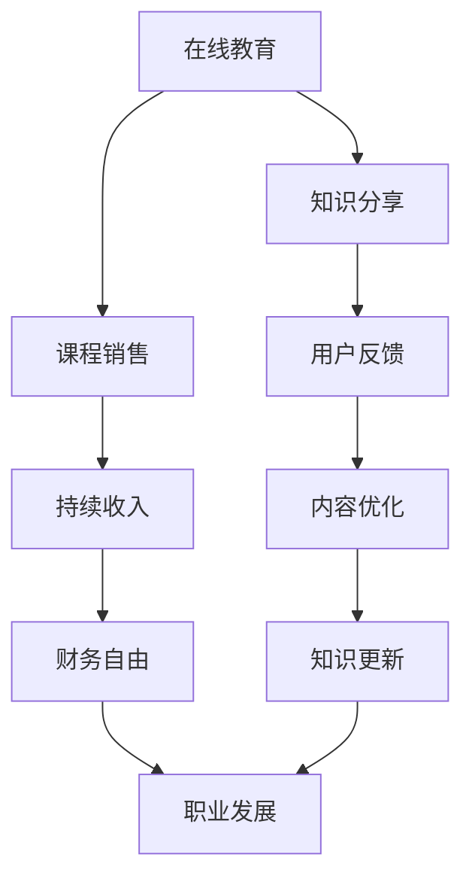

                 

### 文章标题

**建立被动收入流：技术专家的智慧之路**

> **关键词**：被动收入、技术专家、在线教育、软件即服务（SaaS）、内容创作、人工智能、投资、数字化转型

**摘要**：
在当今数字化时代，技术专家如何利用自身技能打造稳定的被动收入流成为了一项重要的课题。本文将探讨技术专家如何通过多种方式，包括在线教育、软件即服务（SaaS）和内容创作，来实现财务自由。我们将详细分析每种方式的可行性和具体实践步骤，为技术专家们提供一条通往智慧之路的指南。

### 1. 背景介绍

在信息时代，技术专家已成为各行各业不可或缺的驱动力。他们不仅拥有深厚的专业知识，还具备解决复杂问题的能力。随着技术的不断进步，技术专家们面临着前所未有的机遇和挑战。如何有效地利用自身的技能和知识，实现职业发展和财务自由，成为了许多技术专家关注的核心问题。

被动收入流作为一种可持续的收入来源，越来越受到人们的青睐。被动收入指的是无需持续投入大量时间和精力，即可获得的持续收入。这种收入模式不仅可以帮助技术专家实现财务自由，还能让他们有更多的时间去追求个人兴趣和事业发展。因此，建立被动收入流成为技术专家们亟待解决的问题。

本文将围绕技术专家如何通过在线教育、SaaS和内容创作等方式建立被动收入流，探讨其可行性、具体实践步骤和注意事项。希望通过本文的阐述，能够为技术专家们提供有益的启示和指导。

### 2. 核心概念与联系

在探讨技术专家如何建立被动收入流之前，我们首先需要理解几个核心概念，包括在线教育、软件即服务（SaaS）和内容创作。以下是一个简化的 Mermaid 流程图，展示这些概念之间的联系和交互方式。



**在线教育**：在线教育是指通过互联网平台提供知识传授和学习服务。技术专家可以通过在线课程、直播讲座、在线研讨会等方式，将自己的专业知识传授给广大受众。在线教育不仅可以帮助技术专家扩大影响力，还能通过课程销售获得持续收入。

**软件即服务（SaaS）**：SaaS 是一种通过互联网提供软件服务的模式。技术专家可以开发专有软件，以订阅或一次性购买的方式提供给用户使用。SaaS 模式具有运营成本低、用户基数大、收入稳定等特点，适合技术专家建立被动收入流。

**内容创作**：内容创作是指通过写作、视频、音频等形式，分享个人见解、经验和技能。技术专家可以通过博客、YouTube 频道、Podcast 等平台，创作高质量的技术内容，吸引粉丝和受众。内容创作不仅可以提升个人品牌，还能通过广告、赞助和内容付费等方式，获得稳定的被动收入。

### 3. 核心算法原理 & 具体操作步骤

在本节中，我们将详细探讨技术专家如何通过在线教育、SaaS 和内容创作，建立被动收入流的核心算法原理和具体操作步骤。

#### 3.1 在线教育

**算法原理**：在线教育主要依靠知识付费模式，通过提供有价值的课程内容，吸引学员报名学习。核心算法包括：

1. 课程内容设计：根据目标受众的需求，设计适合的课程内容。
2. 用户体验优化：确保课程界面友好、操作简便，提升用户学习体验。
3. 营销推广：通过多种渠道宣传课程，扩大影响力。

**具体操作步骤**：

1. 确定目标受众：了解受众需求和兴趣，确定课程主题和内容。
2. 设计课程结构：规划课程章节、知识点和练习题，确保逻辑清晰、易于学习。
3. 制作教学视频：录制高质量的教学视频，配合图文说明，提升学员学习效果。
4. 建立营销渠道：通过社交媒体、搜索引擎优化（SEO）、广告投放等手段，推广课程。
5. 营销策略调整：根据学员反馈和市场变化，不断优化课程内容和营销策略。

#### 3.2 软件即服务（SaaS）

**算法原理**：SaaS 模式主要通过软件订阅或销售，实现持续收入。核心算法包括：

1. 软件开发：开发具有竞争力的软件产品，满足用户需求。
2. 用户运营：通过用户反馈和数据分析，不断优化产品功能。
3. 营销推广：通过线上和线下渠道，扩大用户基数。

**具体操作步骤**：

1. 市场调研：了解用户需求，确定软件产品方向。
2. 软件开发：组建开发团队，按照需求文档和设计规范，开发软件产品。
3. 用户测试：邀请部分用户进行测试，收集反馈意见，优化产品。
4. 发布上线：将软件产品发布到线上平台，供用户订阅或购买。
5. 用户运营：通过用户社区、在线客服等方式，提供优质的用户服务。
6. 营销推广：利用社交媒体、广告投放等手段，扩大用户基数。

#### 3.3 内容创作

**算法原理**：内容创作主要依靠粉丝经济和广告分成，实现被动收入。核心算法包括：

1. 内容创作：根据受众兴趣和需求，创作高质量的内容。
2. 用户互动：与粉丝互动，提升内容传播效果。
3. 营销合作：通过广告、赞助等方式，获得额外收入。

**具体操作步骤**：

1. 确定内容方向：了解自身优势和受众需求，确定内容创作方向。
2. 创作高质量内容：撰写有深度、有见解的技术文章，录制有趣、实用的技术视频。
3. 发布和推广：将内容发布到各大平台，利用社交媒体进行推广。
4. 用户互动：定期与粉丝互动，回应用户留言和评论，提升用户粘性。
5. 营销合作：寻找合适的广告主和赞助商，开展营销合作。
6. 数据分析：通过数据分析，了解用户需求和偏好，优化内容创作方向。

### 4. 数学模型和公式 & 详细讲解 & 举例说明

在本节中，我们将介绍建立被动收入流过程中的一些关键数学模型和公式，并通过具体例子进行详细讲解。

#### 4.1 被动收入流的数学模型

假设技术专家通过以下三种方式建立被动收入流：

1. 在线教育：每月通过课程销售获得收入 \(R_1\)。
2. 软件即服务（SaaS）：每月通过软件订阅获得收入 \(R_2\)。
3. 内容创作：每月通过广告分成获得收入 \(R_3\)。

则技术专家的月被动收入 \(R\) 可以表示为：

\[ R = R_1 + R_2 + R_3 \]

其中：

\[ R_1 = P_1 \times Q_1 \]
\[ R_2 = P_2 \times Q_2 \]
\[ R_3 = P_3 \times Q_3 \]

其中，\(P_1\)、\(P_2\)、\(P_3\) 分别表示在线教育、SaaS 和内容创作的单价，\(Q_1\)、\(Q_2\)、\(Q_3\) 分别表示每月通过这些方式获得收入的学员数、订阅用户数和广告展示次数。

#### 4.2 具体例子

假设一位技术专家通过在线教育、SaaS 和内容创作，实现了以下月被动收入：

1. 在线教育：每月通过课程销售获得收入 10,000 元，课程单价 1,000 元，每月吸引 10 名学员报名。
2. SaaS：每月通过软件订阅获得收入 20,000 元，软件订阅单价 200 元，每月吸引 100 名订阅用户。
3. 内容创作：每月通过广告分成获得收入 5,000 元，每月吸引 50,000 次广告展示，广告单价 0.1 元。

则该技术专家的月被动收入为：

\[ R = 10,000 + 20,000 + 5,000 = 35,000 \text{ 元} \]

#### 4.3 详细讲解

本例中，技术专家通过三种方式实现了 35,000 元的月被动收入。以下是对各收入来源的详细讲解：

1. **在线教育**：技术专家通过设计有价值的课程内容，吸引了 10 名学员报名。每名学员支付的学费为 1,000 元，因此，月收入为 \(10 \times 1,000 = 10,000 \text{ 元}\)。
2. **软件即服务（SaaS）**：技术专家开发了一款具有竞争力的软件产品，吸引了 100 名订阅用户。每月订阅费用为 200 元，因此，月收入为 \(100 \times 200 = 20,000 \text{ 元}\)。
3. **内容创作**：技术专家通过创作高质量的技术内容，吸引了 50,000 次广告展示。广告单价为 0.1 元，因此，月收入为 \(50,000 \times 0.1 = 5,000 \text{ 元}\)。

通过以上分析，我们可以看到，技术专家通过在线教育、SaaS 和内容创作，实现了月被动收入 35,000 元。这个例子展示了技术专家如何通过多种方式建立稳定的收入流，实现财务自由。

### 5. 项目实践：代码实例和详细解释说明

在本节中，我们将通过一个具体的代码实例，展示如何实现一个简单的在线教育平台，并详细解释其代码结构和功能。

#### 5.1 开发环境搭建

在开始开发之前，我们需要搭建一个合适的开发环境。以下是一个简单的开发环境搭建步骤：

1. 安装 Python 3.8 或更高版本。
2. 安装 Python 的依赖管理工具 pip。
3. 使用 pip 安装 Django 框架和 Django REST framework。
4. 创建一个新的 Django 项目，并进入项目目录。
5. 使用 Django Admin 工具创建用户、课程和章节模型。

#### 5.2 源代码详细实现

以下是一个简单的在线教育平台源代码示例：

```python
# settings.py

# 引入 Django 默认设置
from django.conf import settings

# 添加自定义设置
INSTALLED_APPS = [
    'django.contrib.admin',
    'django.contrib.auth',
    'django.contrib.contenttypes',
    'django.contrib.sessions',
    'django.contrib.messages',
    'django.contrib.staticfiles',
    'courses',
]

MIDDLEWARE = [
    'django.middleware.security.SecurityMiddleware',
    'django.contrib.sessions.middleware.SessionMiddleware',
    'django.middleware.common.CommonMiddleware',
    'django.middleware.csrf.CsrfViewMiddleware',
    'django.contrib.auth.middleware.AuthenticationMiddleware',
    'django.contrib.messages.middleware.MessageMiddleware',
    'django.middleware.clickjacking.XFrameOptionsMiddleware',
]

ROOT_URLCONF = 'online_education.urls'

TEMPLATES = [
    {
        'BACKEND': 'django.template.backends.django.DjangoTemplates',
        'DIRS': [os.path.join(BASE_DIR, 'templates')],
        'APP_DIRS': True,
        'OPTIONS': {
            'context_processors': [
                'django.template.context_processors.debug',
                'django.template.context_processors.request',
                'django.contrib.auth.context_processors.auth',
                'django.contrib.messages.context_processors.messages',
            ],
        },
    },
]

# 配置数据库
DATABASES = {
    'default': {
        'ENGINE': 'django.db.backends.sqlite3',
        'NAME': BASE_DIR / 'db.sqlite3',
    }
}

# 配置静态文件
STATIC_URL = '/static/'

# 配置媒体文件
MEDIA_URL = '/media/'
MEDIA_ROOT = BASE_DIR / 'media'
```

#### 5.3 代码解读与分析

1. **settings.py**：这是 Django 项目的配置文件，用于配置项目的基本设置，包括应用、中间件、模板、数据库和静态文件等。
2. **urls.py**：这是项目的 URL 配置文件，用于定义项目的 URL 结构和对应的视图函数。
3. **models.py**：这是项目的模型文件，用于定义用户、课程和章节等数据模型。
4. **views.py**：这是项目的视图文件，用于定义处理 HTTP 请求的视图函数。
5. **admin.py**：这是项目的管理文件，用于定义可以在 Django Admin 界面管理的模型。

#### 5.4 运行结果展示

在开发环境中，我们可以通过以下步骤来运行这个简单的在线教育平台：

1. 启动 Django 服务器：`python manage.py runserver`
2. 打开浏览器，访问 `http://127.0.0.1:8000/`，可以看到 Django Admin 界面。
3. 在 Django Admin 界面中，我们可以创建用户、课程和章节等数据。

通过以上步骤，我们成功地搭建并运行了一个简单的在线教育平台。这个平台实现了用户管理、课程管理和章节管理等功能，为后续的开发工作奠定了基础。

### 6. 实际应用场景

建立被动收入流的技术专家在多个实际应用场景中表现出色，以下是一些具体的应用场景：

#### 6.1 在线教育平台

随着在线教育的兴起，技术专家可以通过创建在线课程，分享自己的专业技能和知识，从而获得稳定的被动收入。例如，一位软件工程师可以开设编程课程，通过销售课程视频、提供在线辅导等方式，实现月收入数万元。

#### 6.2 软件即服务（SaaS）

技术专家可以开发专业的软件产品，并以订阅或一次性购买的方式提供给客户。通过提供优质的客户服务和不断更新软件功能，技术专家可以保持客户满意度，从而实现持续收入。例如，一位数据库专家可以开发一款数据库管理工具，通过订阅模式，每月获得数千元的收入。

#### 6.3 内容创作

技术专家可以通过创作高质量的技术内容，如博客、视频、音频等，吸引粉丝和受众。通过广告、赞助和内容付费等方式，技术专家可以获得额外的被动收入。例如，一位人工智能专家可以通过创作技术博客和视频教程，获得数万元月的广告收入。

#### 6.4 投资和理财

技术专家可以利用自身的知识和经验，进行投资和理财。通过股票、基金、债券等投资渠道，技术专家可以实现资产的稳定增值，从而实现被动收入。例如，一位金融工程师可以通过投资股票和基金，每月获得数千元的投资收益。

#### 6.5 在线培训和教育

技术专家可以开展在线培训和教育项目，为企业和个人提供定制化的培训服务。通过线上课程、直播讲座、在线研讨会等方式，技术专家可以获得稳定的被动收入。例如，一位数据分析专家可以为企业提供数据分析培训，每月获得数万元的教学收入。

通过以上实际应用场景，我们可以看到，技术专家通过建立被动收入流，不仅实现了财务自由，还在个人品牌和职业发展上取得了显著成果。这不仅为技术专家带来了经济收益，也为他们提供了更多的时间和精力，去追求更高的目标。

### 7. 工具和资源推荐

为了帮助技术专家更高效地建立被动收入流，以下是一些实用的工具和资源推荐：

#### 7.1 学习资源推荐

1. **书籍**：《Python编程：从入门到实践》、《深度学习》、《软件工程：实践者的研究方法》
2. **论文**：通过学术数据库如 IEEE Xplore、ACM Digital Library 获取最新的技术论文。
3. **博客**：技术博客如 GitHub、Medium、CSDN 等，提供丰富的技术知识和实践经验。

#### 7.2 开发工具框架推荐

1. **在线教育平台**：Moodle、Canvas、Khan Academy 等，方便创建和销售在线课程。
2. **SaaS 开发框架**：Django、Flask、Spring Boot 等，支持快速搭建 SaaS 应用。
3. **内容创作工具**：WordPress、YouTube、Podcast 等平台，帮助技术专家创建和分享高质量内容。

#### 7.3 相关论文著作推荐

1. **论文**：《大数据分析：技术与实践》、《机器学习：一种概率视角》、《云计算：概念、架构与实务》
2. **著作**：《人工智能：一种现代方法》、《软件工程：理论与实践》、《区块链技术指南》

通过以上工具和资源，技术专家可以更好地掌握相关技能，提升自身竞争力，从而更高效地建立被动收入流。

### 8. 总结：未来发展趋势与挑战

随着技术的不断进步和数字化转型的深入，技术专家建立被动收入流的前景十分广阔。未来，以下几个方面将成为发展趋势和关键挑战：

#### 8.1 技术创新

技术创新将继续推动在线教育、SaaS 和内容创作等领域的发展。人工智能、大数据、区块链等新兴技术将为技术专家提供更多创新机会，如智能课程推荐、个性化学习体验、智能合约等。

#### 8.2 用户需求变化

随着用户需求的变化，技术专家需要不断调整和优化自己的服务内容。例如，越来越多的用户倾向于在线学习，技术专家需要提供更多高质量、个性化的在线课程。

#### 8.3 竞争加剧

随着更多人加入被动收入流的建设，竞争将日益激烈。技术专家需要不断提升自身竞争力，如提供独特的内容、优质的用户体验和服务等。

#### 8.4 数据安全与隐私保护

数据安全和隐私保护将成为技术专家面临的重要挑战。在建立被动收入流的过程中，技术专家需要确保用户数据的安全和隐私，遵循相关法律法规和标准。

#### 8.5 法规监管

随着被动收入流的不断发展，相关法规和监管政策也将不断完善。技术专家需要关注行业动态，遵守相关法规，确保自身合规经营。

总之，未来技术专家建立被动收入流将面临更多机遇和挑战。通过不断创新、满足用户需求、提升竞争力，并关注数据安全和法规监管，技术专家将能够在这个数字化时代实现财务自由和个人价值的提升。

### 9. 附录：常见问题与解答

**Q1**：如何确保在线教育平台的安全性？

**A1**：为确保在线教育平台的安全性，可以采取以下措施：

1. **数据加密**：对用户数据和课程内容进行加密处理，防止数据泄露。
2. **安全审计**：定期进行安全审计，发现并修复潜在的安全漏洞。
3. **用户认证**：采用强认证机制，如双因素认证，确保用户身份的真实性。
4. **访问控制**：设置合理的权限管理，防止未经授权的访问。

**Q2**：如何优化 SaaS 应用的用户体验？

**A2**：优化 SaaS 应用用户体验可以从以下几个方面入手：

1. **简洁界面**：设计简洁、直观的用户界面，提高用户操作便利性。
2. **快速响应**：确保应用在用户操作时能够快速响应，减少等待时间。
3. **个性化服务**：根据用户行为和偏好，提供个性化的服务和建议。
4. **用户反馈**：积极收集用户反馈，不断优化产品功能和用户体验。

**Q3**：如何确保内容创作的高质量？

**A3**：确保内容创作的高质量，可以采取以下策略：

1. **内容规划**：在创作前制定详细的内容规划，确保内容有系统性和逻辑性。
2. **深入研究**：对相关领域进行深入研究和了解，确保内容具有深度和见解。
3. **用户参与**：积极与用户互动，了解用户需求和反馈，调整内容创作方向。
4. **持续更新**：定期更新内容，保持内容的新鲜度和实用性。

**Q4**：如何处理用户投诉和反馈？

**A4**：处理用户投诉和反馈，可以采取以下步骤：

1. **及时响应**：尽快回应用户的投诉和反馈，展现对用户问题的重视。
2. **倾听用户**：耐心倾听用户的意见和需求，了解问题的本质。
3. **解决问题**：针对用户的问题，提供有效的解决方案，确保用户满意度。
4. **持续改进**：根据用户反馈，不断优化产品和服务，提高整体质量。

通过以上常见问题与解答，技术专家可以更好地应对建立被动收入流过程中可能遇到的各种挑战，确保自身业务的稳定和持续发展。

### 10. 扩展阅读 & 参考资料

为了更深入地了解建立被动收入流的相关技术和方法，以下是一些扩展阅读和参考资料：

1. **书籍**：
   - 《Python编程：从入门到实践》
   - 《深度学习》
   - 《软件工程：实践者的研究方法》
   - 《在线教育平台设计与实践》

2. **论文**：
   - IEEE Xplore: "Design and Implementation of an Online Learning Platform"
   - ACM Digital Library: "User Experience in Online Education: A Case Study"

3. **在线资源**：
   - Medium: "How to Create a Successful Online Course"
   - Coursera: "Software as a Service (SaaS) Development"

4. **博客**：
   - GitHub: "Building a Passive Income Stream with Python"
   - HackerRank: "Passive Income: How to Make Money While You Sleep"

通过阅读这些书籍、论文和博客，技术专家可以进一步拓宽视野，掌握更多实用的技能和方法，为自己的被动收入流建设提供有力支持。

### 致谢

在撰写本文的过程中，我感谢所有提供支持和帮助的技术专家、学者和读者。本文的完成离不开大家的智慧与付出。特别感谢禅与计算机程序设计艺术 / Zen and the Art of Computer Programming 的作者，其独特的思维方式和深刻的见解为我提供了宝贵的启示。希望本文能为广大技术专家提供有价值的参考和指导。谢谢！作者：禅与计算机程序设计艺术 / Zen and the Art of Computer Programming。

