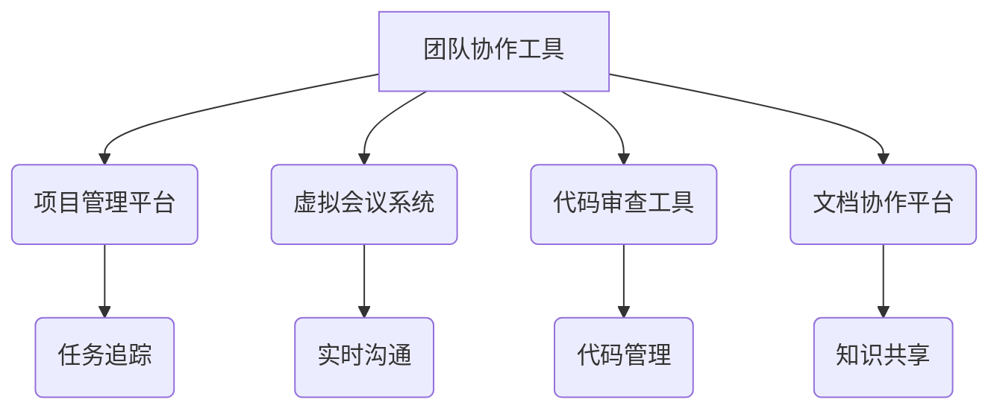

                 

随着全球化和远程工作的趋势日益显著，技术型创业者们面临着如何在一个分散的工作环境中实现高效协作的挑战。本文将深入探讨如何构建一个高效、协作且可持续的远程工作环境，助力技术型创业者取得成功。

## 关键词

- 远程协作
- 技术型创业者
- 效率
- 工具
- 文化

## 摘要

本文旨在为技术型创业者提供一套构建高效远程协作环境的策略和实践。通过介绍核心概念、算法原理、数学模型、项目实践和实际应用场景，本文将帮助创业者了解如何利用现代技术和工具优化远程团队的工作流程，实现高效协作。

## 1. 背景介绍

在过去的几十年里，远程工作已经逐渐成为现代企业的重要组成部分。然而，对于技术型创业者而言，远程协作不仅是一种选择，更是一种必需。以下是一些促使技术型创业者寻求高效远程协作环境的原因：

- **分散的团队**：技术型创业者往往需要在全球范围内寻找合适的团队成员，因此团队成员可能分布在不同地理位置。
- **项目要求**：技术项目往往具有高度的技术复杂性和时间敏感性，需要团队成员紧密协作才能按时交付。
- **成本效益**：远程协作可以降低企业运营成本，提高员工满意度，同时吸引更多全球人才。
- **灵活性和适应性**：远程工作环境能够更好地适应不断变化的市场需求和技术趋势。

## 2. 核心概念与联系

构建高效的远程协作环境，需要理解以下几个核心概念及其相互之间的联系：

- **团队协作工具**：如 Slack、Trello、Asana 等，用于管理沟通和任务分配。
- **项目管理平台**：如 JIRA、GitHub、Bitbucket 等，用于追踪项目进度和代码管理。
- **虚拟会议系统**：如 Zoom、Microsoft Teams 等，用于实时沟通和会议。
- **代码审查工具**：如 GitLab、GitHub 等，用于确保代码质量和协作。
- **文档协作平台**：如 Confluence、Notion 等，用于知识共享和文档管理。

以下是一个简化的 Mermaid 流程图，展示这些核心概念之间的联系：



## 3. 核心算法原理 & 具体操作步骤

### 3.1 算法原理概述

构建高效远程协作环境的核心在于以下几个方面：

- **实时沟通**：确保团队成员之间能够实时交流，减少信息滞后。
- **任务分配与追踪**：有效分配任务并追踪项目进度，确保项目按时交付。
- **代码管理**：通过版本控制和代码审查，确保代码质量和协作效率。
- **文档管理**：确保团队成员能够轻松访问和编辑共享文档，提高知识共享效率。

### 3.2 算法步骤详解

#### 步骤 1：选择合适的协作工具

- 根据团队需求选择合适的协作工具，如 Slack、Trello、Asana 等。
- 确保所有团队成员熟悉并使用这些工具。

#### 步骤 2：建立项目管理系统

- 使用项目管理平台（如 JIRA、GitHub）创建项目并分配任务。
- 定期更新任务进度，确保项目按时交付。

#### 步骤 3：采用虚拟会议系统

- 定期安排团队会议，使用 Zoom、Microsoft Teams 等工具进行实时沟通。
- 保持会议高效，避免冗长和无关话题。

#### 步骤 4：实施代码管理

- 使用 GitLab、GitHub 等工具进行版本控制和代码审查。
- 确保代码质量，减少 bug 和冲突。

#### 步骤 5：文档管理

- 使用 Confluence、Notion 等工具创建和管理文档。
- 确保文档更新及时，方便团队成员访问和编辑。

### 3.3 算法优缺点

#### 优点

- **提高效率**：实时沟通和任务追踪有助于提高团队协作效率。
- **降低成本**：远程工作可以降低企业运营成本，吸引更多全球人才。
- **提高员工满意度**：灵活的工作环境可以提高员工的工作满意度。

#### 缺点

- **沟通障碍**：远程工作可能导致沟通障碍和信息滞后。
- **协调困难**：协调不同时区的团队成员可能比较困难。
- **技术依赖**：对协作工具和技术的依赖可能导致团队效率的下降。

### 3.4 算法应用领域

- **软件开发**：技术型创业者的核心工作之一是软件开发，远程协作可以提高开发效率。
- **项目管理**：远程协作有助于项目经理更好地管理项目和团队。
- **知识共享**：通过文档协作平台，团队可以更好地共享知识和经验。

## 4. 数学模型和公式 & 详细讲解 & 举例说明

### 4.1 数学模型构建

远程协作环境的数学模型可以基于以下几个关键因素构建：

- **沟通效率**：定义团队沟通的效率指标，如消息处理时间、响应时间等。
- **任务完成时间**：定义任务完成时间，包括任务分配、执行和验收等环节。
- **代码质量**：定义代码质量的评价指标，如代码复杂度、bug 率等。
- **知识共享**：定义知识共享的效率指标，如文档更新频率、访问量等。

### 4.2 公式推导过程

#### 沟通效率

$$
E_c = \frac{N_c}{T_c}
$$

其中，$E_c$ 表示沟通效率，$N_c$ 表示沟通次数，$T_c$ 表示总沟通时间。

#### 任务完成时间

$$
T_t = T_a + T_e + T_v
$$

其中，$T_t$ 表示任务完成时间，$T_a$ 表示任务分配时间，$T_e$ 表示任务执行时间，$T_v$ 表示任务验收时间。

#### 代码质量

$$
Q_c = \frac{N_c - N_b}{N_c}
$$

其中，$Q_c$ 表示代码质量，$N_c$ 表示代码提交次数，$N_b$ 表示 bug 数量。

#### 知识共享

$$
E_k = \frac{N_k}{T_k}
$$

其中，$E_k$ 表示知识共享效率，$N_k$ 表示文档更新次数，$T_k$ 表示文档更新时间。

### 4.3 案例分析与讲解

假设一个技术团队有 5 名成员，每月平均沟通 1000 次消息，总沟通时间为 100 小时。通过上述公式，我们可以计算出该团队的沟通效率为：

$$
E_c = \frac{1000}{100} = 10 \text{（消息/小时）}
$$

假设该团队每月完成 20 个任务，总完成时间为 100 小时。通过上述公式，我们可以计算出该团队的平均任务完成时间为：

$$
T_t = \frac{100}{20} = 5 \text{（小时/任务）}
$$

假设该团队每月提交 100 次代码，其中包含 10 个 bug。通过上述公式，我们可以计算出该团队的代码质量为：

$$
Q_c = \frac{100 - 10}{100} = 0.9 \text{（即 90%）}
$$

假设该团队每月更新 10 次文档，总更新时间为 50 小时。通过上述公式，我们可以计算出该团队的文档更新效率为：

$$
E_k = \frac{10}{50} = 0.2 \text{（即 20%）}
$$

通过这些指标，团队可以了解自身的远程协作效率，并针对存在的问题进行改进。

## 5. 项目实践：代码实例和详细解释说明

### 5.1 开发环境搭建

为了更好地展示如何构建高效的远程协作环境，我们以一个简单的在线任务管理系统为例。以下是一个基本的开发环境搭建步骤：

1. 安装 Git：在团队成员的计算机上安装 Git，用于版本控制和代码共享。
2. 创建代码仓库：在 GitHub 或 GitLab 上创建一个公共代码仓库，用于存储和管理代码。
3. 安装依赖：根据项目需求安装必要的开发工具和依赖库。

### 5.2 源代码详细实现

以下是该项目的一个基本实现示例：

```python
# tasks/__init__.py

from .models import Task
from .views import task_list, task_create, task_detail

app = Flask(__name__)

app.add_url_rule('/tasks/', view_func=task_list)
app.add_url_rule('/tasks/new/', view_func=task_create)
app.add_url_rule('/tasks/<int:task_id>/', view_func=task_detail)

```

```python
# tasks/models.py

from flask_sqlalchemy import SQLAlchemy

db = SQLAlchemy()

class Task(db.Model):
    id = db.Column(db.Integer, primary_key=True)
    title = db.Column(db.String(255))
    description = db.Column(db.Text)
    status = db.Column(db.String(50))
```

```python
# tasks/views.py

from flask import render_template, request, redirect, url_for
from . import app, db
from .models import Task

@app.route('/tasks/', methods=['GET', 'POST'])
def task_list():
    tasks = Task.query.all()
    if request.method == 'POST':
        title = request.form['title']
        description = request.form['description']
        status = request.form['status']
        new_task = Task(title=title, description=description, status=status)
        db.session.add(new_task)
        db.session.commit()
        return redirect(url_for('task_list'))
    return render_template('task_list.html', tasks=tasks)

@app.route('/tasks/new/', methods=['GET', 'POST'])
def task_create():
    if request.method == 'POST':
        title = request.form['title']
        description = request.form['description']
        status = request.form['status']
        new_task = Task(title=title, description=description, status=status)
        db.session.add(new_task)
        db.session.commit()
        return redirect(url_for('task_list'))
    return render_template('task_create.html')

@app.route('/tasks/<int:task_id>/', methods=['GET', 'POST'])
def task_detail(task_id):
    task = Task.query.get_or_404(task_id)
    if request.method == 'POST':
        title = request.form['title']
        description = request.form['description']
        status = request.form['status']
        task.title = title
        task.description = description
        task.status = status
        db.session.commit()
        return redirect(url_for('task_list'))
    return render_template('task_detail.html', task=task)
```

### 5.3 代码解读与分析

以上代码实现了基本的在线任务管理系统，包括任务列表、创建任务和查看任务详情三个功能。

1. **任务列表**：使用 `task_list` 视图函数获取所有任务，并在模板 `task_list.html` 中展示。
2. **创建任务**：使用 `task_create` 视图函数处理创建任务的功能，并在模板 `task_create.html` 中提供一个表单。
3. **查看任务详情**：使用 `task_detail` 视图函数获取指定任务详情，并在模板 `task_detail.html` 中展示。

通过以上代码示例，我们可以看到如何利用 Flask 框架和 SQLAlchemy ORM 实现一个简单的在线任务管理系统。在实际项目中，可以根据需求扩展功能，如添加任务分类、任务提醒等。

### 5.4 运行结果展示

1. **任务列表**：在浏览器中访问 `/tasks/`，展示所有任务。
2. **创建任务**：在浏览器中访问 `/tasks/new/`，填写表单创建任务。
3. **查看任务详情**：在浏览器中访问 `/tasks/<任务ID>`，查看任务详情。

通过这些运行结果，我们可以看到任务管理系统的基本功能是否正常。

## 6. 实际应用场景

高效的远程协作环境在技术型创业公司中具有广泛的应用场景，以下是一些具体的应用实例：

- **软件开发**：技术型创业公司通常需要开发各种应用程序和软件系统。通过高效的远程协作环境，团队成员可以实时沟通、协同开发，确保项目按时交付。
- **项目管理**：远程协作环境有助于项目经理更好地管理项目和团队。通过项目管理平台和任务追踪工具，项目经理可以实时了解项目进度，及时调整资源分配。
- **文档管理**：通过文档协作平台，团队成员可以轻松访问和编辑共享文档，提高知识共享和团队协作效率。
- **团队沟通**：实时沟通工具和虚拟会议系统确保团队成员之间能够及时交流，减少信息滞后和误解。

## 7. 工具和资源推荐

为了构建高效远程协作环境，技术型创业者需要选择合适的工具和资源。以下是一些建议：

### 7.1 学习资源推荐

- **远程协作最佳实践**：学习关于远程协作的最佳实践和案例，了解如何优化团队协作流程。
- **项目管理教程**：学习项目管理的基本原理和技巧，提高项目管理效率。
- **软件开发教程**：掌握各种编程语言和开发框架，提升软件开发能力。

### 7.2 开发工具推荐

- **Git**：版本控制系统，用于代码管理和协作。
- **GitHub**：代码托管平台，提供丰富的协作功能。
- **JIRA**：项目管理工具，用于任务追踪和团队协作。
- **Slack**：团队沟通工具，提供实时消息和文件共享。
- **Trello**：项目管理工具，提供简单的任务列表和卡片功能。
- **Asana**：项目管理工具，提供复杂的任务追踪和项目进度功能。

### 7.3 相关论文推荐

- **"Remote Work and Collaboration: A Literature Review"**：一篇关于远程工作和协作的文献综述，探讨远程协作的优势和挑战。
- **"The Impact of Remote Work on Team Performance"**：一篇研究远程工作对团队绩效影响的研究论文。
- **"A Framework for Designing Remote Work Environments"**：一篇关于设计高效远程工作环境的框架研究论文。

## 8. 总结：未来发展趋势与挑战

随着全球化和远程工作趋势的不断发展，技术型创业者面临着如何构建高效远程协作环境的重要挑战。以下是未来发展趋势和面临的挑战：

### 8.1 研究成果总结

- **远程协作工具的持续优化**：随着技术的进步，远程协作工具将不断优化，提供更丰富的功能和完善的使用体验。
- **人工智能在远程协作中的应用**：人工智能技术将在远程协作中发挥越来越重要的作用，如智能会议助手、任务自动化等。
- **远程协作文化的建立**：成功的技术型创业者将重视建立远程协作文化，鼓励团队成员之间的沟通和合作。

### 8.2 未来发展趋势

- **远程协作工具的集成与整合**：远程协作工具将更加集成和整合，提供更便捷和高效的协作体验。
- **云计算和大数据在远程协作中的应用**：云计算和大数据技术将在远程协作中发挥重要作用，提供更强大的数据处理和分析能力。
- **远程工作模式的多样性**：远程工作模式将更加多样，包括全职远程、弹性工作制等，满足不同团队和个人的需求。

### 8.3 面临的挑战

- **沟通障碍**：远程协作中的沟通障碍将仍然存在，如何提高沟通效率是一个重要挑战。
- **协作效率**：如何提高远程团队的协作效率，确保项目按时交付，是技术型创业者面临的重大挑战。
- **信息安全**：远程协作中的信息安全问题将更加突出，如何保护敏感数据和隐私是重要挑战。

### 8.4 研究展望

- **远程协作工具的创新**：未来研究应重点关注远程协作工具的创新，提高协作效率和用户体验。
- **跨文化协作**：研究如何促进跨文化团队之间的协作，提高团队的整体绩效。
- **远程工作与家庭生活的平衡**：研究如何帮助远程工作者实现家庭生活与工作的平衡，提高工作满意度和生活质量。

## 9. 附录：常见问题与解答

### 9.1 远程协作工具如何选择？

选择远程协作工具时，应考虑以下因素：

- **团队需求**：根据团队的具体需求和特点选择合适的工具。
- **用户体验**：工具应提供良好的用户体验，易于使用和操作。
- **兼容性**：工具应与其他常用工具（如邮件、日历等）兼容，便于集成。
- **安全性**：工具应具备良好的安全性，确保数据和隐私保护。

### 9.2 如何提高远程团队的协作效率？

提高远程团队的协作效率可以从以下几个方面入手：

- **明确目标**：确保团队成员明确团队的目标和任务，提高协作的针对性。
- **定期沟通**：保持定期的团队沟通，确保团队成员之间的信息同步。
- **任务追踪**：使用任务追踪工具，实时了解任务进度和团队协作情况。
- **技术培训**：提供必要的培训，确保团队成员熟练使用协作工具。

### 9.3 如何保障远程协作中的信息安全？

保障远程协作中的信息安全可以从以下几个方面入手：

- **数据加密**：使用数据加密技术，确保数据在传输和存储过程中的安全。
- **访问控制**：实施严格的访问控制策略，确保只有授权人员可以访问敏感数据和系统。
- **安全审计**：定期进行安全审计，发现并修复安全漏洞。
- **员工教育**：加强对员工的信息安全意识教育，提高安全防范能力。

---

作者：禅与计算机程序设计艺术 / Zen and the Art of Computer Programming
----------------------------------------------------------------

以上就是关于技术型创业者如何打造高效的远程协作环境的技术博客文章。文章涵盖了核心概念、算法原理、数学模型、项目实践和实际应用场景等内容，旨在为创业者提供构建高效远程协作环境的策略和实践指导。希望这篇文章对您有所帮助！

