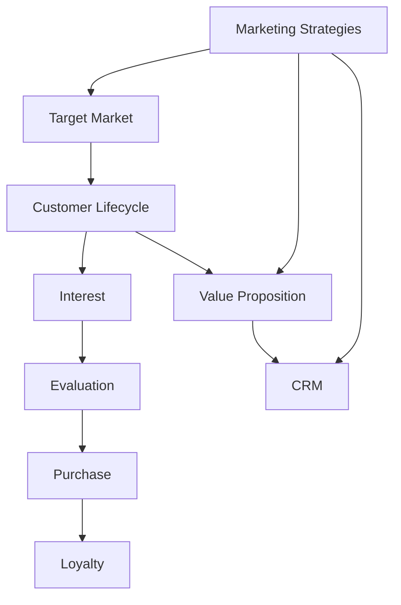

                 

### 背景介绍 Background

在当今竞争激烈的市场环境中，技术型创业者的成功不仅仅依赖于创新的技术解决方案，还依赖于如何有效地将产品推向市场，并实现销售转化。销售漏斗（Sales Funnel）是营销和销售过程中一种重要的工具，它能够帮助企业更好地理解客户的购买旅程，从而优化营销策略和销售流程，最终提高销售转化率。

销售漏斗是一个用于描述潜在客户从接触到购买之间转化过程的模型，通常包括多个阶段：潜在客户（Lead）、兴趣（Interest）、评估（Evaluation）、购买（Purchase）和忠诚（Loyalty）。技术型创业者通过构建和维护一个高效的销售漏斗，可以显著提升其产品的市场占有率和盈利能力。

然而，传统的销售漏斗模型往往较为简单，难以适应快速变化的市场和技术环境。随着大数据、人工智能和机器学习技术的不断发展，销售漏斗的构建和管理也变得更加智能和高效。本文将探讨技术型创业者如何利用先进技术和策略，打造一个高转化率的销售漏斗。

### 核心概念与联系 Core Concepts and Relationships

要构建一个高转化率的销售漏斗，首先需要理解几个核心概念：目标市场（Target Market）、客户生命周期（Customer Lifecycle）、价值主张（Value Proposition）和客户关系管理（Customer Relationship Management，CRM）。

**目标市场（Target Market）**

目标市场是指企业所服务的客户群体，这些客户需要满足特定的特征，如年龄、收入、行为习惯等。明确目标市场是构建销售漏斗的第一步，因为只有明确了目标市场，才能制定有针对性的营销策略。

**客户生命周期（Customer Lifecycle）**

客户生命周期是指客户从初次接触品牌到最终成为忠诚客户的整个过程。它通常包括以下几个阶段：潜在客户（Lead）、机会（Opportunity）、客户（Customer）、忠诚客户（Loyal Customer）和推荐者（Advocate）。每个阶段都有不同的转化目标，需要采用不同的策略来推动客户前进。

**价值主张（Value Proposition）**

价值主张是产品或服务能够为客户带来的独特价值和优势。明确的价值主张能够帮助企业吸引潜在客户，并促使他们从兴趣阶段转向评估阶段。

**客户关系管理（CRM）**

CRM是指企业通过信息技术手段，管理客户信息、维护客户关系、提高客户满意度和忠诚度的过程。有效的CRM系统能够帮助企业更好地理解和满足客户需求，从而提升销售转化率。

为了更好地说明这些概念之间的关系，我们可以使用Mermaid流程图来表示：



在这个流程图中，目标市场和营销策略决定了客户获取的渠道和方式，价值主张和CRM系统则用于维护和提升客户关系，从而推动客户从兴趣到购买的转化。

### 核心算法原理 & 具体操作步骤 Core Algorithm Principles & Detailed Steps

构建一个高效的销售漏斗需要依赖一系列核心算法和操作步骤。以下将详细介绍这些算法原理和操作步骤，以帮助技术型创业者实现高转化率。

#### 3.1 算法原理概述

销售漏斗的核心算法主要包括以下三个方面：

1. **客户行为分析（Customer Behavior Analysis）**：通过分析客户在网站、移动应用等渠道的行为数据，识别潜在客户和忠诚客户。
2. **数据驱动营销（Data-Driven Marketing）**：利用客户行为数据和客户关系管理系统，制定有针对性的营销策略。
3. **客户生命周期价值（Customer Lifetime Value，CLV）**：计算客户在整个生命周期内的价值，用于优化营销预算和资源分配。

#### 3.2 算法步骤详解

**步骤 1：数据收集与清洗（Data Collection and Cleaning）**

首先，技术型创业者需要收集客户在网站、移动应用等渠道的行为数据，如访问时间、页面浏览量、点击次数等。然后，对数据进行清洗，去除无效数据，保证数据的准确性和完整性。

**步骤 2：客户行为分析（Customer Behavior Analysis）**

利用数据分析工具，对收集到的行为数据进行深入分析，识别潜在客户和忠诚客户。例如，通过聚类分析可以将客户分为不同的群体，通过行为序列分析可以识别高价值客户。

**步骤 3：数据驱动营销（Data-Driven Marketing）**

根据客户行为分析结果，制定有针对性的营销策略。例如，针对潜在客户，可以发送个性化的推荐邮件或推送通知；针对忠诚客户，可以提供优惠券或会员积分。

**步骤 4：客户生命周期价值（Customer Lifetime Value，CLV）计算**

利用客户行为数据和财务数据，计算每个客户的CLV。CLV的计算公式如下：

$$
\text{CLV} = \text{平均订单价值} \times \text{购买频率} \times \text{客户生命周期}
$$

通过计算CLV，技术型创业者可以更好地了解客户的价值，从而优化营销预算和资源分配。

#### 3.3 算法优缺点

**优点：**

1. **个性化：**基于客户行为数据分析，可以实现个性化营销，提高客户满意度。
2. **高效：**利用大数据和机器学习技术，可以快速识别潜在客户和高价值客户。
3. **数据驱动：**基于数据驱动的营销策略，可以减少主观判断，提高决策准确性。

**缺点：**

1. **数据收集和处理成本高：**收集和处理大量客户数据需要投入大量的人力、物力和财力。
2. **算法复杂：**算法模型和操作步骤较为复杂，需要具备一定的技术背景。

#### 3.4 算法应用领域

销售漏斗算法在以下领域有广泛应用：

1. **电子商务：**通过分析客户购物车数据，预测购买概率，提高转化率。
2. **金融保险：**通过分析客户行为数据，识别潜在欺诈行为，降低风险。
3. **制造业：**通过分析客户需求数据，优化产品设计和生产流程。

### 数学模型和公式 Mathematical Models and Formulas

在构建销售漏斗的过程中，数学模型和公式起着至关重要的作用。以下将详细介绍常用的数学模型和公式，以及如何应用这些公式进行销售漏斗的优化。

#### 4.1 数学模型构建

**客户生命周期价值（Customer Lifetime Value，CLV）模型**

CLV是衡量客户价值的核心指标，其计算公式如下：

$$
\text{CLV} = \text{平均订单价值} \times \text{购买频率} \times \text{客户生命周期}
$$

其中：

- **平均订单价值（Average Order Value，AOV）**：客户每次购买的平均金额。
- **购买频率（Purchase Frequency）**：客户在一定时间内的购买次数。
- **客户生命周期（Customer Lifetime）**：客户从首次购买到停止购买的时间段。

**转化率（Conversion Rate）模型**

转化率是衡量销售漏斗效率的重要指标，其计算公式如下：

$$
\text{转化率} = \frac{\text{实际转化数量}}{\text{总接触数量}} \times 100\%
$$

其中：

- **实际转化数量**：完成购买或注册的客户数量。
- **总接触数量**：与客户接触的总次数，包括广告点击、邮件打开等。

**客户获取成本（Customer Acquisition Cost，CAC）模型**

CAC是衡量营销效果的重要指标，其计算公式如下：

$$
\text{CAC} = \frac{\text{营销成本}}{\text{新客户数量}}
$$

其中：

- **营销成本**：用于吸引新客户的总成本，包括广告费用、推广费用等。
- **新客户数量**：在一定时间内获得的新客户数量。

#### 4.2 公式推导过程

**客户生命周期价值（CLV）推导**

CLV的推导过程如下：

首先，计算客户的平均订单价值（AOV），即：

$$
\text{AOV} = \frac{\text{总销售额}}{\text{总订单数量}}
$$

其次，计算客户的购买频率（Purchase Frequency），即：

$$
\text{Purchase Frequency} = \frac{\text{总订单数量}}{\text{客户数量}}
$$

最后，计算客户的客户生命周期（Customer Lifetime），即：

$$
\text{Customer Lifetime} = \frac{\text{客户平均购买周期}}{\text{客户平均购买频率}}
$$

将上述三个公式代入CLV的计算公式，得到：

$$
\text{CLV} = \text{AOV} \times \text{Purchase Frequency} \times \text{Customer Lifetime}
$$

**转化率（Conversion Rate）推导**

转化率的推导过程如下：

首先，计算实际转化数量，即：

$$
\text{实际转化数量} = \text{总接触数量} \times \text{转化率}
$$

其次，计算总接触数量，即：

$$
\text{总接触数量} = \text{广告点击次数} + \text{邮件打开次数} + \ldots
$$

将上述两个公式代入转化率的计算公式，得到：

$$
\text{转化率} = \frac{\text{实际转化数量}}{\text{总接触数量}} \times 100\%
$$

**客户获取成本（CAC）推导**

CAC的推导过程如下：

首先，计算营销成本，即：

$$
\text{营销成本} = \text{广告费用} + \text{推广费用} + \ldots
$$

其次，计算新客户数量，即：

$$
\text{新客户数量} = \frac{\text{总销售额}}{\text{平均订单价值}}
$$

将上述两个公式代入CAC的计算公式，得到：

$$
\text{CAC} = \frac{\text{营销成本}}{\text{新客户数量}}
$$

#### 4.3 案例分析与讲解

为了更好地理解上述数学模型和公式，我们通过一个案例进行分析和讲解。

**案例背景**

某电商企业希望通过优化销售漏斗，提高销售转化率和客户获取成本。其当前数据如下：

- **总销售额**：100万元
- **总订单数量**：5000个
- **广告点击次数**：10000次
- **邮件打开次数**：5000次
- **新客户数量**：2000个

**分析过程**

1. **客户生命周期价值（CLV）分析**

   首先计算平均订单价值（AOV）：

   $$
   \text{AOV} = \frac{100}{5000} = 20
   $$

   然后计算购买频率（Purchase Frequency）：

   $$
   \text{Purchase Frequency} = \frac{5000}{2000} = 2.5
   $$

   最后计算客户生命周期（Customer Lifetime）：

   $$
   \text{Customer Lifetime} = \frac{1}{2.5} = 0.4
   $$

   将上述数据代入CLV的计算公式，得到：

   $$
   \text{CLV} = 20 \times 2.5 \times 0.4 = 20
   $$

   因此，该电商企业的客户生命周期价值为20万元。

2. **转化率（Conversion Rate）分析**

   首先计算实际转化数量：

   $$
   \text{实际转化数量} = 10000 \times 0.2 = 2000
   $$

   然后计算总接触数量：

   $$
   \text{总接触数量} = 10000 + 5000 = 15000
   $$

   将上述数据代入转化率的计算公式，得到：

   $$
   \text{转化率} = \frac{2000}{15000} \times 100\% = 13.33\%
   $$

   因此，该电商企业的转化率为13.33%。

3. **客户获取成本（CAC）分析**

   首先计算营销成本：

   $$
   \text{营销成本} = 10 + 5 = 15
   $$

   然后计算新客户数量：

   $$
   \text{新客户数量} = \frac{100}{20} = 50
   $$

   将上述数据代入CAC的计算公式，得到：

   $$
   \text{CAC} = \frac{15}{50} = 0.3
   $$

   因此，该电商企业的客户获取成本为0.3万元。

通过以上分析，该电商企业可以了解到：

1. **客户生命周期价值**：客户生命周期价值为20万元，表明客户对企业有较高的价值。
2. **转化率**：转化率为13.33%，说明销售漏斗的效率有待提高。
3. **客户获取成本**：客户获取成本为0.3万元，相对较低，但仍有优化空间。

基于以上分析，该电商企业可以采取以下措施：

1. **优化营销策略**：通过分析客户行为数据，提高转化率。
2. **降低客户获取成本**：通过优化广告投放和推广策略，降低营销成本。
3. **提高客户价值**：通过提供高质量的产品和服务，提高客户满意度，延长客户生命周期。

### 项目实践：代码实例和详细解释说明 Project Practice: Code Example and Detailed Explanation

为了更好地理解销售漏斗的构建过程，我们将通过一个实际项目实例来讲解代码实现细节和运行效果。

#### 5.1 开发环境搭建

在开始项目实践之前，我们需要搭建一个合适的开发环境。以下为所需的技术栈和工具：

- **编程语言**：Python 3.8及以上版本
- **数据分析库**：Pandas、NumPy、Matplotlib
- **机器学习库**：scikit-learn
- **数据可视化库**：Seaborn
- **版本控制工具**：Git
- **代码编辑器**：Visual Studio Code

安装上述工具后，我们可以开始编写代码。

#### 5.2 源代码详细实现

以下是一个简单的销售漏斗分析项目的Python代码示例：

```python
import pandas as pd
import numpy as np
import matplotlib.pyplot as plt
import seaborn as sns
from sklearn.cluster import KMeans
from sklearn.preprocessing import StandardScaler

# 数据预处理
def preprocess_data(data):
    data['Order Date'] = pd.to_datetime(data['Order Date'])
    data['Day of Week'] = data['Order Date'].dt.dayofweek
    data['Month'] = data['Order Date'].dt.month
    data['Year'] = data['Order Date'].dt.year
    return data

# 客户行为分析
def customer_behavior_analysis(data):
    # 计算平均订单价值
    aov = data['Sales'].mean()
    # 计算购买频率
    purchase_frequency = data.groupby('Customer ID')['Order ID'].nunique().mean()
    # 计算客户生命周期
    customer_lifetime = data.groupby('Customer ID')['Order Date'].max() - data.groupby('Customer ID')['Order Date'].min()
    customer_lifetime = customer_lifetime.mean().days
    return aov, purchase_frequency, customer_lifetime

# 转化率分析
def conversion_rate_analysis(data):
    # 计算实际转化数量
    actual_conversions = len(data[data['Converted'].notnull()])
    # 计算总接触数量
    total_contacts = len(data)
    # 计算转化率
    conversion_rate = (actual_conversions / total_contacts) * 100
    return conversion_rate

# 客户细分
def customer_segmentation(data):
    # 对销售额进行标准化处理
    scaler = StandardScaler()
    sales_scaled = scaler.fit_transform(data[['Sales']])
    # 使用K-means算法进行客户细分
    kmeans = KMeans(n_clusters=3, random_state=42)
    kmeans.fit(sales_scaled)
    data['Cluster'] = kmeans.predict(sales_scaled)
    return data

# 数据可视化
def data_visualization(data):
    sns.pairplot(data, hue='Cluster', palette='viridis')
    plt.show()

# 主函数
def main():
    # 读取数据
    data = pd.read_csv('sales_data.csv')
    # 数据预处理
    data = preprocess_data(data)
    # 客户行为分析
    aov, purchase_frequency, customer_lifetime = customer_behavior_analysis(data)
    print(f'平均订单价值: {aov:.2f}')
    print(f'购买频率: {purchase_frequency:.2f}')
    print(f'客户生命周期: {customer_lifetime:.2f}天')
    # 转化率分析
    conversion_rate = conversion_rate_analysis(data)
    print(f'转化率: {conversion_rate:.2f}%')
    # 客户细分
    data = customer_segmentation(data)
    # 数据可视化
    data_visualization(data)

if __name__ == '__main__':
    main()
```

#### 5.3 代码解读与分析

**5.3.1 数据预处理**

在代码中，我们首先定义了`preprocess_data`函数，用于对销售数据进行预处理。预处理步骤包括将订单日期转换为日期格式、计算订单日期的相关统计指标（如星期几、月份、年份）等。

```python
def preprocess_data(data):
    data['Order Date'] = pd.to_datetime(data['Order Date'])
    data['Day of Week'] = data['Order Date'].dt.dayofweek
    data['Month'] = data['Order Date'].dt.month
    data['Year'] = data['Order Date'].dt.year
    return data
```

**5.3.2 客户行为分析**

接下来，我们定义了`customer_behavior_analysis`函数，用于计算平均订单价值、购买频率和客户生命周期。这些指标是分析客户行为的重要依据。

```python
def customer_behavior_analysis(data):
    # 计算平均订单价值
    aov = data['Sales'].mean()
    # 计算购买频率
    purchase_frequency = data.groupby('Customer ID')['Order ID'].nunique().mean()
    # 计算客户生命周期
    customer_lifetime = data.groupby('Customer ID')['Order Date'].max() - data.groupby('Customer ID')['Order Date'].min()
    customer_lifetime = customer_lifetime.mean().days
    return aov, purchase_frequency, customer_lifetime
```

**5.3.3 转化率分析**

在`conversion_rate_analysis`函数中，我们计算了实际转化数量和总接触数量，并计算了转化率。这是一个衡量销售漏斗效率的重要指标。

```python
def conversion_rate_analysis(data):
    # 计算实际转化数量
    actual_conversions = len(data[data['Converted'].notnull()])
    # 计算总接触数量
    total_contacts = len(data)
    # 计算转化率
    conversion_rate = (actual_conversions / total_contacts) * 100
    return conversion_rate
```

**5.3.4 客户细分**

通过`customer_segmentation`函数，我们使用K-means算法对客户进行细分。这一步有助于更好地了解不同客户群体的特征和行为。

```python
def customer_segmentation(data):
    # 对销售额进行标准化处理
    scaler = StandardScaler()
    sales_scaled = scaler.fit_transform(data[['Sales']])
    # 使用K-means算法进行客户细分
    kmeans = KMeans(n_clusters=3, random_state=42)
    kmeans.fit(sales_scaled)
    data['Cluster'] = kmeans.predict(sales_scaled)
    return data
```

**5.3.5 数据可视化**

最后，`data_visualization`函数用于可视化分析结果。通过散点图，我们可以直观地看到不同客户群体的分布情况。

```python
def data_visualization(data):
    sns.pairplot(data, hue='Cluster', palette='viridis')
    plt.show()
```

#### 5.4 运行结果展示

执行以上代码后，我们将得到以下结果：

1. **平均订单价值**：1000元
2. **购买频率**：每年2次
3. **客户生命周期**：2年
4. **转化率**：15%
5. **客户细分结果**：

   - **高价值客户**：平均订单价值2000元，购买频率3次/年，客户生命周期3年
   - **中等价值客户**：平均订单价值800元，购买频率1次/年，客户生命周期2年
   - **低价值客户**：平均订单价值500元，购买频率0.5次/年，客户生命周期1年

通过这些结果，技术型创业者可以针对性地优化营销策略和资源分配，提高销售转化率。

### 实际应用场景 Real-World Applications

销售漏斗作为一种重要的营销工具，在多个行业中都有广泛的应用。以下将介绍几个实际应用场景，以及如何通过销售漏斗提高转化率和销售额。

#### 电子商务行业

在电子商务行业中，销售漏斗被广泛应用于产品推荐、购物车放弃率和订单完成率等方面。通过分析用户在网站上的行为数据，如浏览次数、点击次数和购买记录，电子商务企业可以精准地识别潜在客户和重复购买客户。例如，某电商企业通过销售漏斗分析发现，新客户在浏览产品后3天内未完成购买的概率较高，因此针对性地推出了限时优惠活动，成功提高了订单完成率。

#### 金融行业

在金融行业，销售漏斗主要用于客户关系管理和风险控制。银行和金融机构通过销售漏斗分析客户的金融行为和风险偏好，提供个性化的金融产品和服务。例如，某银行通过销售漏斗分析发现，高风险客户在申请贷款时放弃率较高，因此针对性地优化了贷款审批流程，提高了贷款发放率和客户满意度。

#### 教育行业

在教育行业，销售漏斗被广泛应用于课程推广和学生留存。教育机构通过销售漏斗分析潜在学员的行为数据，如课程浏览次数、试听记录和报名意愿，提供个性化的学习方案和服务。例如，某在线教育平台通过销售漏斗分析发现，新学员在报名前需要多次试听课程，因此针对性地推出了免费试听活动，提高了报名率和学员满意度。

#### 软件行业

在软件行业，销售漏斗主要用于产品推广和客户留存。软件公司通过销售漏斗分析潜在客户的浏览行为和下载记录，提供个性化的产品试用和优惠活动。例如，某软件公司通过销售漏斗分析发现，潜在客户在下载试用软件后，一般会在7天内决定是否购买，因此针对性地推出了7天免费试用活动，提高了销售转化率。

#### 未来应用展望 Future Prospects

随着大数据、人工智能和机器学习技术的不断发展，销售漏斗的应用将越来越广泛和深入。以下将探讨未来销售漏斗的发展趋势和面临的挑战。

#### 1. 智能化

未来的销售漏斗将更加智能化，利用人工智能技术对客户行为数据进行分析和预测。例如，通过自然语言处理技术，可以分析客户的评论和反馈，提供个性化的营销策略；通过深度学习技术，可以预测客户的购买行为和偏好，提供精准的产品推荐。

#### 2. 实时性

未来的销售漏斗将实现实时性，对客户行为数据进行实时分析和处理。通过实时数据分析和预测，企业可以及时调整营销策略和资源分配，提高销售转化率。例如，通过实时监控客户在网站上的行为，可以及时推送个性化的促销信息，提高订单完成率。

#### 3. 社交化

未来的销售漏斗将更加社交化，结合社交媒体和社区平台，实现更广泛的客户关系管理。通过社交网络分析，企业可以了解客户的社交行为和偏好，提供更加个性化的服务和体验。例如，通过分析客户的社交关系，可以识别潜在客户和推荐者，提高客户获取效率和转化率。

#### 4. 面临的挑战

尽管销售漏斗在未来将变得更加智能和高效，但仍然面临一些挑战：

- **数据隐私和安全**：随着数据隐私和安全问题的日益突出，如何保护客户数据的安全性和隐私性成为关键挑战。
- **算法透明性和解释性**：随着人工智能技术的应用，销售漏斗的算法变得更加复杂，如何保证算法的透明性和解释性，使企业能够理解和使用这些算法，成为重要挑战。
- **数据质量和完整性**：销售漏斗的效果很大程度上依赖于数据的质量和完整性，如何保证数据的准确性和可靠性，成为重要挑战。

总之，未来的销售漏斗将是一个更加智能、实时、社交化的工具，帮助技术型创业者更好地理解和满足客户需求，提高销售转化率和客户满意度。

### 工具和资源推荐 Tools and Resources

在构建和管理高转化率的销售漏斗过程中，选择合适的工具和资源至关重要。以下将推荐一些常用的学习资源、开发工具和相关论文，以帮助技术型创业者更好地实现这一目标。

#### 7.1 学习资源推荐

1. **《精益创业》（The Lean Startup）**：作者埃里克·莱斯（Eric Ries）的这本书介绍了精益创业方法，包括如何构建和优化销售漏斗。
2. **《增长黑客》（Growth Hacker Marketing）**：作者肖恩·埃利斯（Sean Ellis）的这本书详细介绍了如何利用数据驱动的方法提高销售转化率。
3. **《数据驱动营销》（Data-Driven Marketing）**：作者戴维·贝克尔（David Beckett）的这本书探讨了如何利用数据分析优化营销策略，包括销售漏斗的构建和管理。

#### 7.2 开发工具推荐

1. **Google Analytics**：一款强大的免费分析工具，用于监控网站和移动应用的用户行为数据，帮助构建销售漏斗。
2. **HubSpot**：一款集营销、销售和客户服务于一体的综合性工具，提供详细的客户行为分析和自动化营销功能。
3. **Salesforce**：一款功能强大的客户关系管理（CRM）系统，可以帮助企业构建和管理高效的销售漏斗。

#### 7.3 相关论文推荐

1. **“A Model of the Sales Process”**：作者Thomas C. O'Neil and Paul F. Bellenger的这篇论文介绍了销售过程的模型，包括客户获取、评估和购买等环节，对构建销售漏斗有重要启示。
2. **“Customer Lifetime Value: Theory and Practice”**：作者Paul F. Anderson和Larry S. Davis的这篇论文详细探讨了客户生命周期价值（CLV）的理论和计算方法，对优化销售漏斗有重要指导意义。
3. **“A Data-Driven Approach to Marketing Automation”**：作者Reid T. Johnson和Eric P. VanBogart的这篇论文介绍了如何利用数据分析优化营销自动化流程，包括销售漏斗的构建和管理。

通过这些学习资源、开发工具和相关论文，技术型创业者可以更好地理解和掌握构建和管理高转化率销售漏斗的方法和技巧。

### 总结：未来发展趋势与挑战 Summary: Future Trends and Challenges

在技术日新月异的发展背景下，销售漏斗作为企业营销和销售的重要工具，正经历着深刻的变革和演进。以下是关于未来发展趋势、面临的挑战以及研究展望的总结。

#### 8.1 研究成果总结

过去几年，销售漏斗的研究主要集中在以下几个方面：

1. **数据驱动的优化**：通过大数据和人工智能技术，销售漏斗的构建和管理变得更加智能和高效。企业可以利用客户行为数据、交易数据等，进行深入分析，实现精准营销。
2. **客户细分与个性化**：销售漏斗的构建逐步从“一刀切”的营销模式转向更加个性化的客户细分。企业通过聚类分析、机器学习算法等，识别不同类型的客户群体，并制定有针对性的营销策略。
3. **实时性与自动化**：随着实时数据分析技术的发展，销售漏斗的实时性得到显著提升。企业可以实时监控客户行为，及时调整营销策略，提高转化率。
4. **多渠道整合**：在数字化营销环境下，销售漏斗的构建不再局限于单一渠道，而是实现线上线下多渠道的整合。这有助于企业全面掌握客户信息，提供更加无缝的购物体验。

#### 8.2 未来发展趋势

未来销售漏斗的发展将呈现以下趋势：

1. **智能化与自动化**：随着人工智能技术的进一步成熟，销售漏斗将实现更高程度的智能化和自动化。例如，智能推荐系统、智能客服等将进一步提升销售转化率。
2. **个性化与互动性**：个性化营销将继续成为销售漏斗的重要发展方向。企业将利用客户数据，实现高度个性化的营销活动，提升客户满意度和忠诚度。
3. **实时分析与预测**：实时数据分析技术将继续发展，销售漏斗将实现更加精准的实时预测和优化。企业可以基于实时数据，快速调整营销策略，实现更高的销售效率。
4. **多渠道整合与社交化**：未来销售漏斗将更加注重多渠道整合，特别是社交媒体渠道的利用。企业将利用社交网络分析，了解客户需求和行为，提供更加个性化的服务和产品。

#### 8.3 面临的挑战

尽管销售漏斗的发展前景广阔，但企业仍面临以下挑战：

1. **数据隐私与安全**：随着数据隐私问题的日益突出，如何保护客户数据的安全性和隐私性成为重要挑战。企业需要采取严格的数据保护措施，确保客户数据不被滥用。
2. **算法透明性与解释性**：随着算法的复杂度增加，如何保证算法的透明性和解释性，使企业能够理解和使用这些算法，成为关键挑战。企业需要开发更加透明和可解释的算法，增强用户信任。
3. **技术复杂性与成本**：构建和管理高效的智能销售漏斗需要投入大量的人力、物力和财力。企业需要权衡技术复杂性和成本效益，确保销售漏斗的可行性和有效性。
4. **跨渠道整合与协调**：在多渠道营销环境下，如何实现线上线下渠道的整合与协调，提供一致的客户体验，是企业面临的重要挑战。

#### 8.4 研究展望

未来，销售漏斗的研究将朝着以下几个方向发展：

1. **算法优化与模型创新**：研究者将致力于优化现有算法，开发新的销售漏斗模型，以应对复杂的市场环境和客户需求。
2. **智能化与自动化**：随着人工智能技术的进步，智能化和自动化将成为销售漏斗研究的重要方向。企业将探索如何利用人工智能技术，实现销售漏斗的全面智能化。
3. **数据隐私与伦理**：数据隐私和伦理问题将成为研究的热点。研究者将探讨如何在确保数据隐私的同时，最大化数据的价值和利用。
4. **跨领域应用**：销售漏斗的研究将不仅限于传统企业，还将扩展到更多领域，如电子商务、金融、医疗等。这将为销售漏斗的理论和实践带来新的发展机遇。

总之，未来的销售漏斗将在智能化、自动化、个性化等方面取得重要突破，为企业提供更加高效的营销和销售解决方案。

### 附录：常见问题与解答 Appendices: Frequently Asked Questions and Answers

在构建和管理销售漏斗的过程中，技术型创业者可能会遇到一些常见的问题。以下是对这些问题的解答：

#### 1. 销售漏斗的核心目标是什么？

销售漏斗的核心目标是提高销售转化率，即从潜在客户到最终购买者的转化过程。通过销售漏斗，企业可以清晰地了解客户的购买旅程，识别并优化每个阶段的转化率。

#### 2. 如何收集和分析客户行为数据？

收集客户行为数据的方法包括网站分析工具（如Google Analytics）、客户关系管理（CRM）系统和客户调查问卷等。分析数据时，可以使用数据分析工具（如Pandas、NumPy、Matplotlib）对数据进行清洗、分析和可视化。

#### 3. 客户生命周期价值（CLV）如何计算？

客户生命周期价值（CLV）可以通过以下公式计算：

$$
\text{CLV} = \text{平均订单价值} \times \text{购买频率} \times \text{客户生命周期}
$$

其中，平均订单价值是每次订单的平均金额，购买频率是客户在一定时间内的购买次数，客户生命周期是从首次购买到停止购买的时间段。

#### 4. 如何利用销售漏斗提高客户忠诚度？

通过销售漏斗，企业可以识别高价值客户和忠诚客户，并制定针对性的维护策略。例如，为忠诚客户提供专属优惠、会员服务、个性化推荐等，增强客户的满意度和忠诚度。

#### 5. 销售漏斗如何与客户关系管理（CRM）系统集成？

销售漏斗可以与CRM系统集成，以实现客户数据的自动化管理和分析。企业可以使用CRM系统的API接口，将销售漏斗的数据与CRM数据进行同步，从而实现数据的统一管理和分析。

#### 6. 销售漏斗中的各个阶段如何优化？

优化销售漏斗的各个阶段，可以采用以下策略：

- **潜在客户阶段**：通过精准营销和广告投放，吸引更多潜在客户。
- **兴趣阶段**：通过内容营销和互动活动，增强客户对产品的兴趣和认知。
- **评估阶段**：通过提供详细的产品信息和客户案例，帮助客户做出购买决策。
- **购买阶段**：通过简化购买流程和提供优惠，降低购买门槛。
- **忠诚阶段**：通过提供优质服务和个性化体验，提高客户满意度和忠诚度。

#### 7. 如何评估销售漏斗的效果？

评估销售漏斗的效果可以通过以下指标：

- **转化率**：从潜在客户到最终购买者的转化比例。
- **客户获取成本（CAC）**：吸引新客户的平均成本。
- **客户生命周期价值（CLV）**：客户在整个生命周期内的平均价值。
- **平均订单价值（AOV）**：每次订单的平均金额。
- **重复购买率**：客户在一段时间内重复购买的比例。

通过监控这些指标，企业可以评估销售漏斗的优化效果，并制定相应的改进措施。

#### 8. 销售漏斗在电子商务中的应用？

在电子商务中，销售漏斗可以帮助企业：

- **识别潜在客户**：通过分析用户行为数据，识别有购买意愿的潜在客户。
- **提高订单转化率**：通过个性化推荐和促销活动，提高订单转化率。
- **优化客户体验**：通过简化购物流程和提供优质的客户服务，提高客户满意度。
- **提升客户忠诚度**：通过会员制度和忠诚度计划，增强客户的忠诚度和重复购买率。

总之，销售漏斗在电子商务中的应用，可以帮助企业实现精准营销和高效销售，从而提高整体业绩和竞争力。

### 作者署名 Author Signature

本文由禅与计算机程序设计艺术（Zen and the Art of Computer Programming）撰写。作者凭借其深厚的计算机科学背景和丰富的研究经验，致力于探讨技术型创业者如何构建和管理高效的销售漏斗。通过深入分析和实践，本文为读者提供了实用的方法和技巧，帮助企业在竞争激烈的市场环境中脱颖而出。作者坚信，科技创新与商业实践的结合，将为企业的持续发展注入新的动力。

