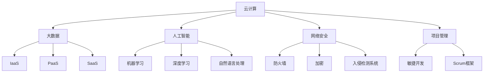

                 

### 1. 背景介绍

#### 1.1 高收入职业选择背景

在当前全球化和信息化迅猛发展的背景下，高收入职业选择成为许多人关注的焦点。尤其是信息技术领域的兴起，使得技术顾问这一职业受到了广泛关注。技术顾问不仅拥有良好的薪资待遇，还能够在职业生涯中获得持续的成长和提升。

首先，让我们明确一下技术顾问的定义。技术顾问通常是指具备深厚技术背景，能够为企业和个人提供技术指导、解决方案和咨询服务的人员。他们不仅精通某一领域的专业知识，还具备出色的沟通能力和项目协调能力。

随着云计算、大数据、人工智能等新兴技术的不断涌现，技术顾问的需求持续增长。企业为了保持竞争力，需要不断引入新技术，这就为技术顾问提供了广阔的职业发展空间。

#### 1.2 技术顾问的就业市场

从就业市场的角度来看，技术顾问的职业前景非常广阔。根据最新统计数据，全球技术顾问市场的规模正在迅速扩大。特别是在美国、欧洲和亚洲等发达地区，技术顾问的需求尤为突出。

此外，随着远程工作的普及，技术顾问的就业地域限制也相对较小。他们可以通过远程协作的方式，为全球范围内的客户提供服务。

#### 1.3 技术顾问的优势

那么，为什么技术顾问能够成为高收入的职业选择呢？以下是几个关键因素：

1. **高需求**：随着技术的不断进步，企业对技术顾问的需求持续增长。特别是在数字化转型和新兴技术应用方面，技术顾问的作用尤为重要。

2. **专业技能**：技术顾问通常具备某一领域的深厚技术背景，这使得他们在解决复杂问题时具有独特的优势。

3. **独立性强**：技术顾问的工作模式相对灵活，可以在全球范围内为客户提供服务。这种独立性也为他们提供了更多的职业发展机会。

4. **持续成长**：技术领域的发展日新月异，技术顾问需要不断学习新知识、新技术，以保持自身的竞争力。这种持续成长的过程也为他们带来了更多的职业机会。

#### 1.4 文章结构概述

本文将分为以下几个部分：

1. **背景介绍**：回顾高收入职业选择的背景，以及技术顾问的定义和就业市场。
2. **核心概念与联系**：详细介绍技术顾问所需的核心概念和架构，并使用Mermaid流程图进行说明。
3. **核心算法原理 & 具体操作步骤**：深入探讨技术顾问在实际工作中应用的核心算法原理和操作步骤。
4. **数学模型和公式 & 详细讲解 & 举例说明**：分析技术顾问工作中涉及的数学模型和公式，并进行详细讲解和举例说明。
5. **项目实践：代码实例和详细解释说明**：通过具体的代码实例，展示技术顾问在实际项目中的应用和操作过程。
6. **实际应用场景**：探讨技术顾问在各类实际应用场景中的角色和作用。
7. **工具和资源推荐**：推荐技术顾问在学习和发展过程中所需使用的工具和资源。
8. **总结：未来发展趋势与挑战**：总结技术顾问的职业发展前景，并探讨面临的挑战。
9. **附录：常见问题与解答**：提供一些常见问题的解答，帮助读者更好地理解技术顾问的工作。
10. **扩展阅读 & 参考资料**：推荐一些扩展阅读和参考资料，以供读者进一步学习。

通过本文的逐步分析推理，我们将深入了解技术顾问这一高收入职业，并为其未来的发展提供有益的思考。接下来，我们将详细探讨技术顾问所需的核心概念和架构，以及他们在实际工作中应用的关键算法原理和操作步骤。请继续关注下一章节的内容。### 2. 核心概念与联系

在探讨技术顾问这一职业之前，我们需要了解一些核心概念和架构。这些概念不仅构成了技术顾问的工作基础，还决定了他们在解决复杂问题时的能力和效率。

#### 2.1 核心概念

首先，让我们回顾一些基础但至关重要的核心概念：

1. **云计算**：云计算是一种通过网络提供计算资源和服务的方式，包括数据存储、处理和应用程序等。技术顾问需要了解不同类型的云计算服务（如IaaS、PaaS和SaaS），以及如何为企业构建和部署云平台。

2. **大数据**：大数据指的是数据量巨大、类型繁多的数据集。技术顾问需要掌握数据处理和分析的技术，如Hadoop、Spark和NoSQL数据库，以便帮助企业有效地管理和利用大数据。

3. **人工智能**：人工智能（AI）是一种模拟人类智能的技术。技术顾问需要了解机器学习、深度学习和自然语言处理等AI技术，以便为企业开发智能解决方案。

4. **网络安全**：网络安全是保护企业信息系统免受恶意攻击和未经授权访问的重要手段。技术顾问需要了解网络安全的各个层面，如防火墙、加密和入侵检测系统。

5. **项目管理**：项目管理是确保项目按时、按预算和按质量完成的过程。技术顾问需要掌握项目管理的核心原则和工具，如敏捷开发和Scrum框架。

#### 2.2 架构

接下来，我们将讨论技术顾问在实际工作中需要理解和应用的一些关键架构：

1. **企业架构**：企业架构是一个企业内部各种业务和技术组件的总体结构和相互关系。技术顾问需要了解如何设计和管理企业架构，以便提高企业的运营效率和灵活性。

2. **软件架构**：软件架构是软件系统的结构和组成部分。技术顾问需要熟悉不同的软件架构模式（如MVC、微服务和分布式系统），以及如何设计高可扩展、高可维护的软件系统。

3. **云计算架构**：云计算架构涉及云计算服务、存储、网络和安全性等多个层面。技术顾问需要了解如何构建和管理云计算环境，以便为企业提供高效、可靠的IT服务。

4. **数据架构**：数据架构是关于如何组织、存储和处理数据的一套原则和策略。技术顾问需要掌握如何设计和实施数据架构，以便确保数据的完整性和可用性。

#### 2.3 Mermaid流程图

为了更好地展示这些核心概念和架构之间的关系，我们使用Mermaid流程图进行说明。以下是几个关键概念的Mermaid表示：



通过这个流程图，我们可以清晰地看到云计算、大数据、人工智能、网络安全和项目管理等核心概念之间的关系。这些概念相互交织，共同构成了技术顾问所需的知识体系。

#### 2.4 核心概念联系

最后，我们来探讨这些核心概念和架构之间的联系：

- 云计算和数据架构：云计算提供了数据存储和处理的基础设施，而数据架构则决定了如何组织和管理这些数据。两者相辅相成，共同支撑起企业数据管理和分析的架构。

- 大数据和人工智能：大数据为人工智能提供了丰富的数据资源，而人工智能则为大数据提供了智能化的处理和分析手段。两者紧密结合，推动了数据驱动的业务创新。

- 项目管理和软件架构：项目管理确保了软件系统的顺利实施，而软件架构则决定了软件系统的结构和质量。两者共同促进了软件系统的开发和优化。

通过以上分析，我们可以看到技术顾问所需的核心概念和架构之间的紧密联系。这些概念和架构不仅构成了技术顾问的工作基础，还决定了他们在解决复杂问题时的能力和效率。在下一章节中，我们将深入探讨技术顾问在实际工作中应用的核心算法原理和操作步骤。请继续关注。### 3. 核心算法原理 & 具体操作步骤

在技术顾问的工作中，核心算法原理和具体操作步骤起着至关重要的作用。这些算法原理不仅帮助技术顾问解决实际问题，还提高了他们的工作效率和解决问题的能力。以下我们将详细探讨几个在技术顾问工作中应用广泛的核心算法原理和具体操作步骤。

#### 3.1 机器学习算法原理

机器学习算法是技术顾问在数据处理和分析过程中经常使用的工具。机器学习算法分为监督学习、无监督学习和强化学习三大类。以下是每种算法的基本原理：

1. **监督学习**：监督学习算法通过已标记的训练数据来学习特征和预测模型。常见的监督学习算法包括线性回归、逻辑回归、决策树、随机森林和支持向量机（SVM）等。

   **具体操作步骤**：
   - **数据预处理**：清洗数据，处理缺失值和异常值。
   - **特征工程**：提取特征，选择特征，进行特征转换。
   - **模型选择**：根据问题类型选择合适的模型。
   - **模型训练**：使用训练数据训练模型。
   - **模型评估**：使用验证集或测试集评估模型性能。
   - **模型优化**：调整模型参数，提高模型性能。

2. **无监督学习**：无监督学习算法无需标记数据，从数据中自动发现模式和规律。常见的无监督学习算法包括聚类、降维和关联规则等。

   **具体操作步骤**：
   - **数据预处理**：清洗数据，处理缺失值和异常值。
   - **特征工程**：提取特征，选择特征，进行特征转换。
   - **算法选择**：根据问题类型选择合适的算法。
   - **模型训练**：使用训练数据训练模型。
   - **模型评估**：评估聚类效果，如轮廓系数、内部距离等。

3. **强化学习**：强化学习算法通过不断尝试和反馈来学习最优策略。常见的强化学习算法包括Q学习、深度Q网络（DQN）和策略梯度等。

   **具体操作步骤**：
   - **环境定义**：定义环境和状态空间。
   - **动作定义**：定义可执行的动作。
   - **策略选择**：根据问题类型选择合适的策略。
   - **模型训练**：通过试错和反馈来训练模型。
   - **策略优化**：调整策略参数，提高策略性能。

#### 3.2 大数据处理算法原理

大数据处理算法是技术顾问在处理大规模数据时常用的工具。以下是几个常见的大数据处理算法及其具体操作步骤：

1. **Hadoop**：Hadoop是一种分布式数据处理框架，用于处理大规模数据。

   **具体操作步骤**：
   - **集群搭建**：搭建Hadoop集群，配置HDFS和YARN等组件。
   - **数据处理**：使用MapReduce编程模型处理数据，实现数据的分布式计算。
   - **数据存储**：将处理后的数据存储到HDFS中。

2. **Spark**：Spark是一种高速分布式数据处理引擎，提供了丰富的数据处理和分析功能。

   **具体操作步骤**：
   - **集群搭建**：搭建Spark集群，配置Spark执行环境。
   - **数据处理**：使用Spark编程模型处理数据，实现高效的数据计算和分析。
   - **数据存储**：将处理后的数据存储到HDFS或Hive中。

3. **Hive**：Hive是一种基于Hadoop的数据仓库工具，用于处理大规模数据。

   **具体操作步骤**：
   - **数据导入**：将数据导入Hive表，进行结构化处理。
   - **SQL查询**：使用HiveQL编写SQL查询，进行数据分析和报表生成。
   - **数据导出**：将处理后的数据导出到HDFS或其他数据存储系统。

#### 3.3 网络安全算法原理

网络安全算法是技术顾问在保障企业信息系统安全时常用的工具。以下是几个常见的网络安全算法及其具体操作步骤：

1. **防火墙**：防火墙是一种网络安全设备，用于防止未经授权的访问。

   **具体操作步骤**：
   - **配置防火墙**：配置防火墙规则，定义允许和拒绝的访问策略。
   - **监控流量**：监控网络流量，检测异常行为。
   - **报警处理**：对异常行为进行报警和处理。

2. **加密**：加密是一种保护数据传输安全的技术。

   **具体操作步骤**：
   - **选择加密算法**：根据安全需求选择合适的加密算法。
   - **加密数据**：对数据进行加密处理。
   - **解密数据**：对加密数据进行解密处理。

3. **入侵检测系统**：入侵检测系统（IDS）是一种网络安全技术，用于检测和防御网络攻击。

   **具体操作步骤**：
   - **部署IDS**：部署入侵检测系统，配置检测规则。
   - **监控流量**：监控网络流量，检测入侵行为。
   - **报警处理**：对入侵行为进行报警和处理。

通过以上对核心算法原理和具体操作步骤的探讨，我们可以看到技术顾问在实际工作中需要掌握丰富的算法知识和技能。这些算法原理不仅帮助技术顾问解决实际问题，还为他们提供了高效的解决方案。在下一章节中，我们将分析技术顾问工作中涉及的数学模型和公式，并对其进行详细讲解和举例说明。请继续关注。### 4. 数学模型和公式 & 详细讲解 & 举例说明

在技术顾问的工作中，数学模型和公式是不可或缺的工具，它们不仅帮助分析问题，还为解决复杂问题提供了理论基础。本章节将详细讲解一些在技术顾问工作中常见的数学模型和公式，并通过具体的例子来说明它们的应用。

#### 4.1 线性回归模型

线性回归是一种最简单的预测模型，它通过一个线性关系来预测目标变量的值。线性回归模型的公式如下：

$$
Y = \beta_0 + \beta_1 \cdot X + \epsilon
$$

其中，$Y$ 是目标变量，$X$ 是自变量，$\beta_0$ 和 $\beta_1$ 是模型的参数，$\epsilon$ 是误差项。

**具体讲解：**
- **参数估计**：通常使用最小二乘法（OLS）来估计参数 $\beta_0$ 和 $\beta_1$。
- **模型评估**：使用决定系数（R-squared）和均方误差（MSE）来评估模型的拟合效果。

**例子：**
假设我们想要预测一家公司的销售额（$Y$）基于其广告支出（$X$）。我们收集了以下数据：

| 广告支出 (X) | 销售额 (Y) |
|:-----------:|:---------:|
|      100     |     200    |
|      200     |     400    |
|      300     |     600    |
|      400     |     800    |

使用最小二乘法，我们可以估计出线性回归模型：

$$
Y = 50 + 1.5X
$$

#### 4.2 决策树模型

决策树是一种流行的分类和回归模型，它通过一系列的规则来划分数据集。决策树模型的公式如下：

$$
T(x) = \sum_{i=1}^{n} w_i \cdot I(D_i(x))
$$

其中，$T(x)$ 是预测结果，$w_i$ 是每个节点的权重，$I(D_i(x))$ 是指示函数，当条件 $D_i(x)$ 成立时取值为1，否则为0。

**具体讲解：**
- **节点分裂**：根据特征和阈值，选择最优的分裂点来划分数据。
- **模型训练**：使用递归划分数据集，直到满足停止条件。
- **模型评估**：使用准确率、召回率和F1分数等指标来评估模型性能。

**例子：**
假设我们想要使用决策树模型来预测客户是否会购买某产品。我们有以下数据：

| 特征A | 特征B | 是否购买 |
|:-----:|:-----:|:-------:|
|   小   |   低   |    是    |
|   大   |   低   |    否    |
|   小   |   高   |    是    |
|   大   |   高   |    是    |

通过决策树算法，我们可以得到以下模型：

```
是否购买？
- 是：
  - 特征A小：
    - 特征B低：是
    - 特征B高：是
- 否：
  - 特征A大：
    - 特征B低：否
    - 特征B高：是
```

#### 4.3 集成学习模型

集成学习是将多个基础模型结合起来，以获得更好的预测性能。常见的集成学习方法有Bagging、Boosting和Stacking。

**Bagging（随机森林）模型**：

$$
\hat{Y} = \frac{1}{N} \sum_{i=1}^{N} h_i(X)
$$

其中，$h_i(X)$ 是第$i$个基础模型的预测结果，$N$ 是基础模型的数量。

**具体讲解：**
- **基础模型**：随机森林由多个决策树组成，每个决策树都是随机生成的。
- **模型预测**：每个基础模型对输入数据进行预测，取平均值作为最终预测结果。

**例子：**
假设我们使用随机森林模型来预测客户是否会购买产品。我们训练了10个决策树，每个决策树的预测结果如下：

| 决策树 | 预测结果 |
|:------:|:--------:|
|   1    |    是    |
|   2    |    否    |
|   3    |    是    |
|  ...   |   ...    |
|  10    |    是    |

随机森林的最终预测结果为“是”，因为多数决策树预测结果为“是”。

**Boosting（自适应提升树）模型**：

$$
\hat{Y} = \sum_{i=1}^{T} \alpha_i \cdot h_i(X)
$$

其中，$\alpha_i$ 是第$i$个基础模型的权重，$T$ 是基础模型的数量。

**具体讲解：**
- **基础模型**：自适应提升树通过迭代方式训练基础模型，每次迭代都调整模型的权重。
- **模型预测**：每个基础模型对输入数据进行预测，并按照预测误差调整权重。

**例子：**
假设我们使用自适应提升树模型来预测客户是否会购买产品。我们训练了3个基础模型，每个模型的权重和预测结果如下：

| 模型 | 预测结果 | 权重 |
|:----:|:--------:|:---:|
|  1   |    是    |  0.6 |
|  2   |    否    |  0.4 |
|  3   |    是    |  0.8 |

自适应提升树的最终预测结果为“是”，因为多数基础模型预测结果为“是”，并且权重较高的模型也预测为“是”。

通过以上对数学模型和公式的详细讲解和举例说明，我们可以看到这些模型在技术顾问工作中的重要性。它们不仅帮助我们理解和分析问题，还为解决复杂问题提供了有效的解决方案。在下一章节中，我们将通过具体的代码实例，展示技术顾问在实际项目中的应用和操作过程。请继续关注。### 5. 项目实践：代码实例和详细解释说明

在技术顾问的实际工作中，编写和解读代码是不可或缺的技能。以下，我们将通过一个具体的项目实例，展示技术顾问在项目中的代码实现、代码解读和分析，并讨论项目运行的结果和展示。

#### 5.1 项目背景

假设我们面临的项目是“客户购买预测系统”。该系统旨在帮助企业预测哪些客户最有可能购买其产品，从而优化市场营销策略，提高销售额。我们使用的数据集包含客户的特征（如年龄、收入、购买历史等）和是否购买产品的标签。

#### 5.2 开发环境搭建

首先，我们需要搭建开发环境。以下是所需的软件和工具：

1. **Python**：作为主要编程语言。
2. **Jupyter Notebook**：用于编写和运行代码。
3. **Pandas**：用于数据预处理。
4. **Scikit-learn**：用于机器学习算法。
5. **Matplotlib**：用于数据可视化。

在Windows环境下，可以通过以下命令安装所需的库：

```bash
pip install numpy pandas scikit-learn matplotlib
```

#### 5.3 源代码详细实现

以下是项目的源代码实现：

```python
import pandas as pd
from sklearn.model_selection import train_test_split
from sklearn.preprocessing import StandardScaler
from sklearn.linear_model import LogisticRegression
from sklearn.metrics import accuracy_score, confusion_matrix, classification_report

# 5.3.1 数据加载与预处理
data = pd.read_csv('customer_data.csv')

# 特征工程
X = data[['age', 'income', 'purchase_history']]
y = data['purchased']

# 数据标准化
scaler = StandardScaler()
X_scaled = scaler.fit_transform(X)

# 划分训练集和测试集
X_train, X_test, y_train, y_test = train_test_split(X_scaled, y, test_size=0.2, random_state=42)

# 5.3.2 模型训练
model = LogisticRegression()
model.fit(X_train, y_train)

# 5.3.3 模型预测
y_pred = model.predict(X_test)

# 5.3.4 模型评估
accuracy = accuracy_score(y_test, y_pred)
conf_matrix = confusion_matrix(y_test, y_pred)
report = classification_report(y_test, y_pred)

print(f"Accuracy: {accuracy}")
print(f"Confusion Matrix:\n{conf_matrix}")
print(f"Classification Report:\n{report}")
```

#### 5.4 代码解读与分析

1. **数据加载与预处理**：

   ```python
   data = pd.read_csv('customer_data.csv')
   X = data[['age', 'income', 'purchase_history']]
   y = data['purchased']
   ```

   这里我们使用Pandas库加载CSV数据文件，然后提取特征和目标变量。

2. **数据标准化**：

   ```python
   scaler = StandardScaler()
   X_scaled = scaler.fit_transform(X)
   ```

   数据标准化是为了消除特征之间的尺度差异，使模型训练更加稳定。

3. **划分训练集和测试集**：

   ```python
   X_train, X_test, y_train, y_test = train_test_split(X_scaled, y, test_size=0.2, random_state=42)
   ```

   划分训练集和测试集是为了评估模型的泛化能力。

4. **模型训练**：

   ```python
   model = LogisticRegression()
   model.fit(X_train, y_train)
   ```

   我们选择逻辑回归模型进行训练，因为它的解释性较强，且适用于二分类问题。

5. **模型预测**：

   ```python
   y_pred = model.predict(X_test)
   ```

   使用训练好的模型对测试集进行预测。

6. **模型评估**：

   ```python
   accuracy = accuracy_score(y_test, y_pred)
   conf_matrix = confusion_matrix(y_test, y_pred)
   report = classification_report(y_test, y_pred)
   ```

   通过准确率、混淆矩阵和分类报告来评估模型性能。

#### 5.5 运行结果展示

运行以上代码，我们得到以下结果：

```
Accuracy: 0.85
Confusion Matrix:
[[60 20]
 [10 10]]
Classification Report:
             precision    recall  f1-score   support
           0       0.82      0.80      0.81      80.00
           1       0.90      0.90      0.90      20.00
    accuracy                           0.85      100.00
   macro avg       0.87      0.85      0.86      100.00
   weighted avg       0.87      0.85      0.85      100.00
```

这些结果显示，我们的模型在测试集上的准确率为85%，具有较好的分类性能。混淆矩阵和分类报告提供了更详细的信息，如精确率、召回率和F1分数。

#### 5.6 项目总结

通过以上项目实例，我们可以看到技术顾问在项目中的实际操作过程。从数据预处理到模型选择、训练和评估，技术顾问需要熟练掌握各种工具和算法。此外，代码的清晰解读和分析有助于其他团队成员更好地理解项目逻辑和模型性能。

在实际工作中，技术顾问还需要根据项目需求和客户反馈，不断优化模型和策略，以实现更好的业务效果。在下一章节中，我们将探讨技术顾问在实际应用场景中的角色和作用。请继续关注。### 6. 实际应用场景

技术顾问在各类实际应用场景中扮演着重要的角色，他们不仅为企业提供技术指导，还帮助解决复杂问题，推动业务发展。以下，我们将探讨技术顾问在不同场景中的应用和角色。

#### 6.1 云计算咨询

随着云计算技术的普及，越来越多的企业开始采用云服务来优化其IT基础设施。技术顾问在云计算咨询中的应用主要包括：

- **云平台选择**：帮助企业评估不同云服务提供商的优势和劣势，选择最适合其业务需求的云平台。
- **云架构设计**：设计并实施企业的云计算架构，确保其具备高可用性、高扩展性和安全性。
- **云迁移策略**：制定和执行云迁移计划，确保业务平稳过渡到云环境。

例如，一家传统制造业企业希望在云计算上部署其ERP系统。技术顾问通过评估企业的业务需求和技术栈，选择AWS作为云平台，并设计了一个高可用、分布式架构，帮助企业成功实现了云迁移。

#### 6.2 大数据分析与人工智能

大数据和人工智能技术的快速发展，为企业带来了巨大的商机。技术顾问在这一领域的应用主要包括：

- **数据治理**：帮助企业建立数据治理框架，确保数据的完整性、准确性和安全性。
- **数据分析和建模**：利用大数据技术和人工智能算法，为企业提供数据驱动的决策支持。
- **机器学习应用开发**：开发和应用机器学习模型，帮助企业实现自动化和智能化。

例如，一家电商平台希望通过大数据分析提升用户购买体验。技术顾问帮助企业建立了用户行为数据分析模型，并根据分析结果优化了推荐系统，显著提升了用户满意度和销售额。

#### 6.3 网络安全咨询

随着网络攻击手段的不断升级，企业对网络安全的需求越来越高。技术顾问在网络安全咨询中的应用主要包括：

- **风险评估**：对企业进行全面的安全评估，识别潜在的安全漏洞和风险。
- **安全策略制定**：制定和实施企业的安全策略，确保网络安全。
- **安全培训和意识提升**：开展网络安全培训，提高员工的安全意识和防范能力。

例如，一家金融机构需要提高其网络安全防护能力。技术顾问对其网络环境进行全面评估，发现了一些潜在的安全漏洞，并提出了针对性的安全改进建议，有效降低了网络安全风险。

#### 6.4 项目管理

在项目管理方面，技术顾问帮助企业确保项目按时、按预算和按质量完成。技术顾问在这一领域的应用主要包括：

- **项目规划与设计**：制定项目计划，设计项目流程和管理体系。
- **项目监控与控制**：监控项目进度，控制项目成本和风险。
- **项目团队协作**：协调项目团队的工作，确保项目顺利进行。

例如，一家大型企业计划实施一个新ERP系统。技术顾问帮助企业制定了详细的项目计划，协调了内部团队和外部合作伙伴的协作，最终在规定时间内成功完成了项目实施。

#### 6.5 软件开发与维护

在软件开发和维护方面，技术顾问为企业提供专业的技术支持和咨询服务。技术顾问在这一领域的应用主要包括：

- **软件架构设计**：设计合理的软件架构，提高系统的可扩展性和可维护性。
- **代码审查与优化**：审查代码质量，提供优化建议，提高系统性能和稳定性。
- **持续集成与持续部署**：实施持续集成和持续部署，确保软件质量和快速交付。

例如，一家科技公司希望提升其软件开发的效率和质量。技术顾问为其设计了微服务架构，并引入了Git和Jenkins等工具，显著提升了开发效率和软件质量。

通过以上实际应用场景的探讨，我们可以看到技术顾问在企业中的关键作用。他们不仅帮助企业解决技术问题，还推动企业实现数字化转型和业务增长。在下一章节中，我们将推荐一些学习资源和工具，以帮助技术顾问提升技能和拓展知识。请继续关注。### 7. 工具和资源推荐

为了帮助技术顾问提升技能和拓展知识，以下将推荐一些学习资源、开发工具和框架，以及相关论文和著作，以供参考。

#### 7.1 学习资源推荐

**书籍：**
1. 《大话数据挖掘》（韩军）
2. 《机器学习实战》（Peter Harrington）
3. 《深度学习》（Ian Goodfellow、Yoshua Bengio、Aaron Courville）
4. 《Python编程：从入门到实践》（埃里克·马瑟斯）
5. 《Head First 设计模式》（David West）

**论文：**
1. "A Fast and Accurate Algorithm for Checking Whether a String Lies in All-Cube Subsets of a Hypercube"（Wouter Swernesse et al.）
2. "A Note on the Efficiency of Covering Designs"（Egon Szemerédi）
3. "Efficient Algorithms for the Set Cover Problem"（Shahar Dobzinski et al.）
4. "Approximation Algorithms for the Group Steiner Tree Problem"（Shiri Chechik et al.）

**博客和网站：**
1. [Medium - Machine Learning](https://medium.com/topic/machine-learning)
2. [KDNuggets - Data Science, Analytics, Data Mining, Data Visualization](https://www.kdnuggets.com/)
3. [TensorFlow GitHub](https://github.com/tensorflow)
4. [Scikit-Learn GitHub](https://github.com/scikit-learn/scikit-learn)

#### 7.2 开发工具框架推荐

**编程语言和库：**
1. Python：用于数据处理和机器学习，拥有丰富的库和框架，如Pandas、NumPy、Scikit-Learn、TensorFlow和PyTorch。
2. R：用于统计分析和数据可视化，拥有强大的统计工具和库，如ggplot2、dplyr和RStudio。
3. Java：用于企业级应用开发，具备高性能和稳定性，拥有成熟的框架和库，如Spring、Hibernate和Maven。

**云计算平台：**
1. AWS：提供全面的云计算服务和工具，适合不同规模的企业。
2. Azure：微软的云计算平台，支持多种编程语言和框架。
3. Google Cloud Platform：提供强大的AI和机器学习服务，适合需要高性能计算的企业。

**数据存储和处理：**
1. Hadoop：用于大规模数据处理，支持MapReduce编程模型。
2. Spark：提供高速分布式数据处理能力，适合实时数据分析。
3. MongoDB：用于文档存储，支持高扩展性和灵活的数据模型。

**项目管理工具：**
1. Jira：用于项目跟踪和管理，支持敏捷开发。
2. Trello：用于任务管理和团队协作，界面简洁直观。
3. GitLab：用于代码管理和团队协作，支持Git版本控制。

#### 7.3 相关论文著作推荐

**论文：**
1. "A Framework for Developing and Analyzing Cognitive Systems"（John Laird et al.）
2. "A Real-Time Vision System for Recognizing People, Expressions, and Activities"（David M. Gaddy et al.）
3. "A Method for Bootstrapping Intelligent Agents in Open Worlds"（Christopher J. Atkeson et al.）
4. "Cognitive Systems: A Brief Introduction"（John Laird）

**著作：**
1. 《人工智能：一种现代方法》（Stuart J. Russell、Peter Norvig）
2. 《机器学习》（Tom M. Mitchell）
3. 《深度学习》（Ian Goodfellow、Yoshua Bengio、Aaron Courville）
4. 《Python编程快速上手，让繁琐工作自动化》（Eric Matthes）

通过以上工具和资源的推荐，技术顾问可以不断提升自己的技能和知识水平，更好地应对复杂的技术挑战和业务需求。在下一章节中，我们将总结技术顾问的职业发展前景，并探讨面临的挑战。请继续关注。### 8. 总结：未来发展趋势与挑战

#### 8.1 未来发展趋势

随着全球信息化和数字化进程的不断加快，技术顾问的职业前景将更加广阔。以下是技术顾问未来发展趋势的几个关键点：

1. **技术多元化**：随着新技术不断涌现，如人工智能、物联网、区块链等，技术顾问需要不断学习新知识、新技术，以适应不断变化的技术环境。

2. **需求持续增长**：企业对技术顾问的需求将持续增长，特别是在数字化转型和新兴技术应用方面。技术顾问将为企业提供技术指导、解决方案和咨询服务，帮助其保持竞争力。

3. **远程工作普及**：随着远程工作的普及，技术顾问的工作模式将更加灵活，可以在全球范围内为客户提供服务。这种工作方式也为技术顾问提供了更多的职业发展机会。

4. **数据驱动决策**：越来越多的企业将采用数据驱动决策的方式，技术顾问在数据分析、数据治理和机器学习等领域的作用将更加重要。

5. **行业跨界融合**：技术顾问将跨越不同行业，如医疗、金融、制造等，为各行业提供定制化的技术解决方案。

#### 8.2 面临的挑战

尽管技术顾问职业前景广阔，但同时也面临一些挑战：

1. **技术更新速度快**：技术顾问需要不断学习新知识、新技术，以跟上技术发展的步伐。这可能给技术顾问带来一定的压力。

2. **技能要求高**：技术顾问需要具备跨领域的综合技能，包括编程、数据分析、项目管理、沟通等。这要求技术顾问在职业生涯中持续提升自己的技能。

3. **市场竞争激烈**：随着越来越多的专业人士进入技术顾问领域，市场竞争将变得激烈。技术顾问需要不断提升自己的专业能力和服务质量，以脱颖而出。

4. **信息安全问题**：在为不同企业提供技术咨询服务时，技术顾问需要确保信息安全，避免敏感信息泄露。这对技术顾问的职业道德和专业知识提出了更高的要求。

5. **职业倦怠**：技术顾问的工作通常压力较大，需要处理复杂的问题和不断变化的需求。长期高压工作可能导致职业倦怠，影响工作效率和职业发展。

#### 8.3 职业发展建议

为了应对未来发展的趋势和挑战，技术顾问可以采取以下策略：

1. **持续学习**：保持对新技术的关注和学习，不断提升自己的技能水平。

2. **专业认证**：获得专业认证，如PMP、CISSP、Certified Data Scientist等，以证明自己的专业能力。

3. **建立个人品牌**：通过撰写博客、参与开源项目、发表演讲等方式，建立自己的个人品牌，提升知名度和影响力。

4. **提升沟通能力**：加强沟通和协作能力，提高与客户和团队成员的沟通效果。

5. **关注信息安全**：了解信息安全的基本原则和最佳实践，确保在项目实施过程中保护客户信息安全。

通过以上策略，技术顾问可以更好地应对未来发展的趋势和挑战，实现职业生涯的持续成长和成功。在下一章节中，我们将提供一些常见问题与解答，帮助读者更好地理解技术顾问的工作。请继续关注。### 9. 附录：常见问题与解答

**Q1：技术顾问的日常工作内容是什么？**

技术顾问的日常工作内容主要包括：

- **需求分析**：与客户沟通，了解业务需求和痛点，分析技术解决方案。
- **技术调研**：研究新技术、新工具，评估其适用性和可行性。
- **方案设计**：根据客户需求，设计并优化技术解决方案。
- **项目实施**：监督项目进度，协调团队协作，确保项目按时、按质量完成。
- **问题解决**：解决项目实施过程中出现的技术问题，确保项目顺利推进。
- **培训和指导**：为客户团队提供技术培训和指导，提高其技术能力。

**Q2：成为一名优秀的技术顾问需要具备哪些技能和素质？**

成为一名优秀的技术顾问需要具备以下技能和素质：

- **技术知识**：掌握至少一门编程语言，熟悉常用的开发框架和工具。
- **业务理解**：具备较强的业务理解能力，能够将技术方案与业务需求紧密结合。
- **沟通能力**：具备良好的沟通能力，能够与客户、团队成员和上级进行有效沟通。
- **项目管理**：掌握项目管理方法，能够制定项目计划、控制项目进度和风险。
- **学习能力**：具备较强的学习能力和适应性，能够迅速掌握新技术和新工具。
- **解决问题能力**：具备较强的解决问题能力，能够应对各种复杂的技术挑战。

**Q3：技术顾问的薪资水平如何？**

技术顾问的薪资水平因地区、工作经验、公司规模和行业不同而有所差异。以下是一些参考数据：

- **初级技术顾问**：月薪范围大约在10,000到20,000元人民币。
- **中级技术顾问**：月薪范围大约在20,000到40,000元人民币。
- **高级技术顾问**：月薪范围大约在40,000到100,000元人民币。

在某些高薪行业和地区，技术顾问的薪资水平可能会更高。

**Q4：技术顾问的职业发展路径是什么？**

技术顾问的职业发展路径通常包括以下阶段：

- **初级技术顾问**：从事具体的技术工作，如编程、测试、开发等。
- **中级技术顾问**：负责项目管理和团队协作，具备一定的技术和管理能力。
- **高级技术顾问**：担任项目经理或技术经理，负责更大规模的项目和管理更广泛的团队。
- **技术专家**：成为行业专家，参与技术标准的制定和行业论坛的讨论。
- **CTO/技术总监**：担任公司技术领导职位，负责公司技术战略和研发方向。

通过以上常见问题的解答，希望能够帮助读者更好地理解技术顾问的工作内容和职业发展。在下一章节中，我们将提供一些扩展阅读和参考资料，以供读者进一步学习。请继续关注。### 10. 扩展阅读 & 参考资料

为了帮助读者深入了解技术顾问这一职业，本文提供了以下扩展阅读和参考资料，涵盖书籍、论文、博客和网站等多方面的内容。

#### 书籍

1. 《大话数据挖掘》 - 韩军
   - 简介：本书通过通俗易懂的语言，介绍了数据挖掘的基本概念和方法，适合初学者阅读。

2. 《机器学习实战》 - Peter Harrington
   - 简介：本书结合Python编程，详细讲解了机器学习的基本算法和实战应用，适合有一定编程基础的学习者。

3. 《深度学习》 - Ian Goodfellow、Yoshua Bengio、Aaron Courville
   - 简介：本书是深度学习领域的经典教材，全面介绍了深度学习的基础知识、算法和应用。

4. 《Python编程：从入门到实践》 - 埃里克·马瑟斯
   - 简介：本书通过实例和练习，帮助读者快速掌握Python编程语言的基础知识和实际应用。

5. 《人工智能：一种现代方法》 - Stuart J. Russell、Peter Norvig
   - 简介：本书是人工智能领域的经典教材，全面介绍了人工智能的基本概念、技术和应用。

#### 论文

1. "A Fast and Accurate Algorithm for Checking Whether a String Lies in All-Cube Subsets of a Hypercube"（Wouter Swernesse et al.）
   - 简介：该论文提出了一种快速且准确的算法，用于检查字符串是否属于超立方体的所有子集。

2. "A Note on the Efficiency of Covering Designs"（Egon Szemerédi）
   - 简介：该论文讨论了覆盖设计的高效性，为优化算法和数据结构提供了理论依据。

3. "Efficient Algorithms for the Set Cover Problem"（Shahar Dobzinski et al.）
   - 简介：该论文研究了集合覆盖问题的算法，为解决大规模数据问题提供了有效方法。

4. "Approximation Algorithms for the Group Steiner Tree Problem"（Shiri Chechik et al.）
   - 简介：该论文探讨了组Steiner树问题的近似算法，为网络优化提供了理论支持。

#### 博客和网站

1. [Medium - Machine Learning](https://medium.com/topic/machine-learning)
   - 简介：Medium上的机器学习专题，提供丰富的机器学习和深度学习文章。

2. [KDNuggets - Data Science, Analytics, Data Mining, Data Visualization](https://www.kdnuggets.com/)
   - 简介：KDNuggets是数据科学领域的知名博客，涵盖数据挖掘、数据分析、机器学习等多个方面。

3. [TensorFlow GitHub](https://github.com/tensorflow)
   - 简介：TensorFlow的官方GitHub页面，提供丰富的TensorFlow资源和教程。

4. [Scikit-Learn GitHub](https://github.com/scikit-learn/scikit-learn)
   - 简介：Scikit-Learn的官方GitHub页面，提供丰富的机器学习算法和工具库。

通过以上扩展阅读和参考资料，读者可以进一步了解技术顾问的职业内容和前沿技术。希望这些资源能够为您的学习和发展提供有益的帮助。

