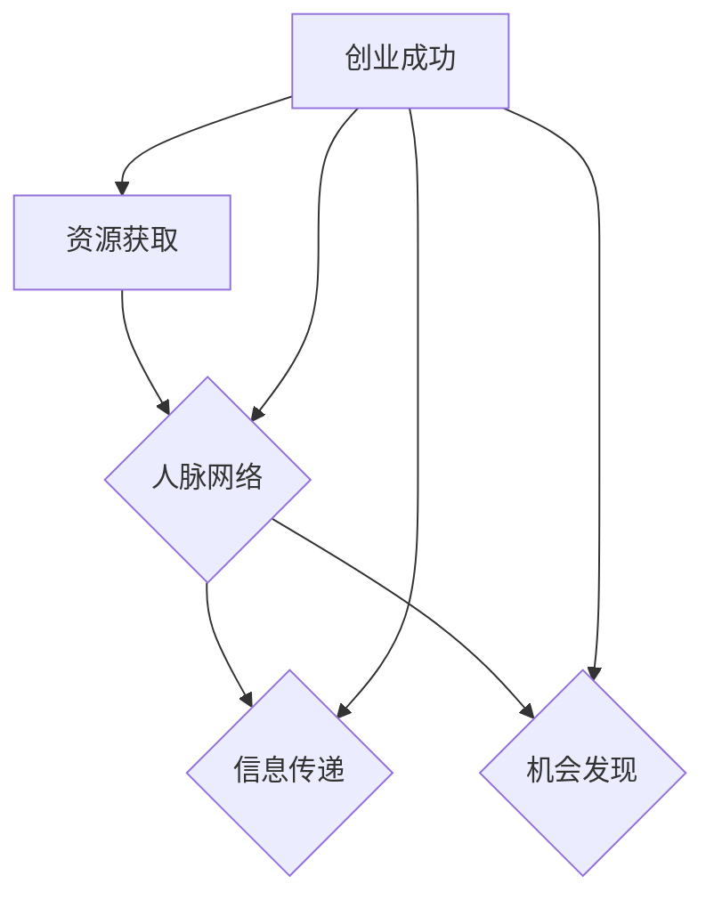

                 

### 背景介绍

在当今竞争激烈、瞬息万变的商业环境中，创业者的成功与否往往取决于多种因素。从商业模式的创新、技术创新，到市场营销策略和团队管理，这些方面都是创业者需要关注的重点。然而，在这众多影响因素中，人脉网络的拓展却常常被忽视，但它的重要性不容小觑。

人脉网络指的是由个人之间建立的联系构成的社交网络。它不仅包括亲朋好友，还涵盖行业内的专家、同行、潜在客户、投资者等。在商业领域，人脉网络被认为是推动事业发展的隐形资产，其作用体现在资源的获取、信息的传递、机会的发现等多个方面。

本文将从以下三个方面深入探讨拓展人脉网络对创业的重要性：

1. **资源获取：** 人脉网络是获取商业资源的重要渠道，包括资金、技术、人才等。
2. **信息传递：** 人脉网络能够快速传递市场信息和行业动态，帮助创业者及时调整策略。
3. **机会发现：** 通过人脉网络，创业者能够发现潜在的商业机会，甚至获得合作伙伴和投资者的支持。

接下来，我们将逐步分析这些方面，并通过实际案例和数据来支持我们的观点。

### 核心概念与联系

为了更深入地理解人脉网络在创业中的重要性，我们需要先定义一些核心概念，并展示它们之间的联系。

#### 1. 人脉网络的定义

人脉网络（Social Network）是由多个个体通过某种联系组成的网络结构。在商业领域，人脉网络可以看作是创业者与其他人之间建立的互惠关系网络。

#### 2. 人脉网络的组成部分

- **节点（Nodes）：** 代表网络中的个体，如创业者、投资人、合作伙伴等。
- **边（Edges）：** 表示节点之间的联系，如友情、合作关系、推荐关系等。
- **密度（Density）：** 网络中边的数量与可能的边数量之比，用来衡量网络的紧密程度。

#### 3. 人脉网络的特性

- **强联系（Strong Ties）：** 通常指与亲密朋友或家庭成员的关系，这类联系能够提供情感支持和直接资源。
- **弱联系（Weak Ties）：** 指与较少接触但有时能带来新信息和机会的人之间的关系。

#### 4. 人脉网络的价值

- **信息传递：** 通过人脉网络，创业者可以更快地获取行业信息、市场动态和技术进展。
- **资源获取：** 人脉网络是获取资金、人才、技术等商业资源的重要途径。
- **机会发现：** 人脉网络能够帮助创业者发现新的商业机会，并建立合作伙伴关系。

#### 5. 人脉网络与创业成功的关系

- **资源获取：** 创业初期，创业者通常需要资金、技术、人才等资源，而这些人脉资源往往通过人脉网络获取。
- **信息传递：** 快速的市场信息和行业动态能够帮助创业者做出更明智的商业决策。
- **机会发现：** 通过人脉网络，创业者能够更早地识别潜在的市场趋势和商业机会。

为了更好地展示这些核心概念和它们之间的联系，我们使用 Mermaid 流程图来直观地表示：



在上面的流程图中，A、B、C、D分别表示资源获取、信息传递、机会发现和人脉网络，E表示创业成功。这个流程图清晰地展示了人脉网络与创业成功之间的直接关系。

#### 总结

通过上述分析，我们可以看出，人脉网络在创业中扮演着至关重要的角色。它不仅是创业者获取资源、传递信息和发现机会的重要渠道，也是创业成功的关键因素之一。接下来，我们将深入探讨这些核心概念的具体操作步骤和实际应用场景，以帮助创业者更好地理解和利用人脉网络。

### 核心算法原理 & 具体操作步骤

在了解了人脉网络的基本概念和重要性之后，我们需要进一步探讨如何系统地拓展和维护人脉网络。这个过程可以看作是一种核心算法，其具体操作步骤包括以下几个方面：

#### 1. 明确目标

在开始拓展人脉网络之前，创业者需要明确自己的目标。例如，是寻找潜在的投资人、合作伙伴，还是获取行业内的技术资源。明确目标有助于有针对性地进行人脉拓展。

#### 2. 确定人脉类型

根据创业目标，创业者需要确定需要拓展的人脉类型。常见的人脉类型包括：

- **强联系：** 如亲朋好友、同事、导师等，能够提供情感支持和直接资源。
- **弱联系：** 如行业内的专家、同行、潜在客户、投资者等，能够带来新的信息和机会。

#### 3. 挖掘潜在人脉

- **利用现有资源：** 通过社交媒体、行业会议、专业论坛等渠道，查找与自己目标相符的人脉。
- **主动出击：** 通过发送邀请、参加线下活动、加入行业协会等方式，主动接触潜在人脉。

#### 4. 建立和维护关系

- **主动沟通：** 通过电话、邮件、社交媒体等渠道，定期与重要人脉保持联系。
- **提供价值：** 在沟通中，创业者应主动提供有价值的信息和资源，以建立互惠关系。
- **个性化互动：** 根据人脉的特点和需求，制定个性化的互动策略，如发送节日问候、提供定制化服务等。

#### 5. 维护人脉网络的活跃度

- **定期回顾：** 定期回顾和维护人脉网络，确保人脉关系不会因长时间不联系而疏远。
- **资源共享：** 通过人脉网络，共享行业信息、资源、机会等，增强网络的活跃度和价值。

#### 6. 跟进和转化

- **跟进反馈：** 对每一次互动和合作进行及时跟进，了解对方反馈和需求，以便进一步优化人脉关系。
- **转化机会：** 通过人脉网络发现和把握潜在的商业机会，及时采取行动，实现资源转化。

#### 实际操作步骤

为了更具体地说明这些操作步骤，我们以下面几个实际案例来进一步阐述：

1. **确定目标**

   创业者小明计划拓展人脉网络，目标是寻找潜在的投资人和技术合作伙伴。

2. **确定人脉类型**

   根据目标，小明需要建立以下两种人脉关系：

   - **强联系：** 前同事、行业内的专家、导师等。
   - **弱联系：** 投资人、行业内的同行、潜在客户等。

3. **挖掘潜在人脉**

   - **利用现有资源：** 小明通过LinkedIn、微信等社交媒体，查找与自己目标相符的人脉。
   - **主动出击：** 参加行业会议、专业论坛，主动与潜在人脉交流。

4. **建立和维护关系**

   - **主动沟通：** 小明通过邮件和电话，定期与重要人脉保持联系。
   - **提供价值：** 小明主动分享行业报告、技术资讯，帮助人脉解决实际问题。
   - **个性化互动：** 小明根据人脉特点，制定个性化互动策略，如发送节日问候、提供定制化服务。

5. **维护人脉网络的活跃度**

   - **定期回顾：** 小明每月回顾一次人脉网络，确保关系不会疏远。
   - **资源共享：** 小明通过人脉网络，分享行业信息、资源、机会，增强网络的活跃度和价值。

6. **跟进和转化**

   - **跟进反馈：** 小明对每次互动和合作进行跟进，了解对方反馈和需求，优化人脉关系。
   - **转化机会：** 通过人脉网络，小明发现了一家潜在的技术合作伙伴，及时采取行动，成功建立了合作关系。

#### 总结

通过上述操作步骤，创业者可以系统地拓展和维护人脉网络，从而在资源获取、信息传递和机会发现等方面取得更好的成效。接下来，我们将进一步探讨人脉网络中的数学模型和公式，以帮助创业者更深入地理解和应用人脉网络拓展的策略。

### 数学模型和公式 & 详细讲解 & 举例说明

在人脉网络的拓展和维护过程中，数学模型和公式能够帮助我们量化关系、评估网络价值和预测合作机会。以下是几个关键的数学模型和公式，以及它们的详细讲解和举例说明。

#### 1. 库伦定律（Coulomb's Law）

库伦定律用于描述两个电荷之间的相互作用力。在人脉网络中，我们可以将其类比为人与人之间的吸引力。公式如下：

\[ F = k \cdot \frac{q_1 \cdot q_2}{r^2} \]

其中，\( F \) 表示相互作用力，\( k \) 是常数，\( q_1 \) 和 \( q_2 \) 分别表示两个个体的吸引力，\( r \) 表示个体之间的距离。

**讲解：**

- **\( k \)：** 常数，取决于人脉网络的结构和类型。
- **\( q_1 \) 和 \( q_2 \)：** 表示个体之间的吸引力，可以通过互动频率、合作历史等因素衡量。
- **\( r \)：** 表示个体之间的距离，可以通过地理位置、社交频率等衡量。

**举例：**

假设小明和投资人小李之间有很强的合作关系，他们的吸引力 \( q_1 \) 和 \( q_2 \) 分别为10，而两人之间的距离 \( r \) 为1。根据库伦定律，他们之间的吸引力 \( F \) 为：

\[ F = k \cdot \frac{10 \cdot 10}{1^2} = 100k \]

这意味着他们之间的合作关系非常紧密，具有较高的合作潜力。

#### 2. 斯莫尔定律（Smoluchowski Law）

斯莫尔定律描述了在随机行走过程中，粒子聚集的概率。在人脉网络中，我们可以将其类比为人与人之间的互动和关系建立过程。公式如下：

\[ P(A \cap B) = \frac{1}{1 + 2dP(A)P(B)} \]

其中，\( P(A \cap B) \) 表示两个个体 \( A \) 和 \( B \) 建立关系的概率，\( P(A) \) 和 \( P(B) \) 分别表示个体 \( A \) 和 \( B \) 的度（即连接的其他个体的数量）。

**讲解：**

- **\( P(A \cap B) \)：** 表示个体 \( A \) 和 \( B \) 建立关系的概率。
- **\( P(A) \) 和 \( P(B) \)：** 表示个体 \( A \) 和 \( B \) 的度。
- **\( d \)：** 表示个体之间的互动距离，通常为一个较小的常数。

**举例：**

假设小明有50个朋友，小李有30个朋友，他们之间的互动距离 \( d \) 为0.1。根据斯莫尔定律，他们建立关系的概率为：

\[ P(A \cap B) = \frac{1}{1 + 2 \cdot 0.1 \cdot 0.5 \cdot 0.3} = \frac{1}{1.03} \approx 0.9709 \]

这意味着小明和小李建立关系的概率非常高，大约为97.09%。

#### 3. 库特斯-李弗曼模型（Kutzbach-Levin Model）

库特斯-李弗曼模型用于预测社交网络中的传播现象。在人脉网络中，我们可以将其用于预测商业机会的传播和合作关系的形成。公式如下：

\[ t = \ln(n) / \ln(2) \]

其中，\( t \) 表示个体成为活跃节点的时间，\( n \) 表示个体的度。

**讲解：**

- **\( t \)：** 表示个体成为活跃节点的时间。
- **\( n \)：** 表示个体的度。

**举例：**

假设小明的度为50，根据库特斯-李弗曼模型，他成为活跃节点的时间为：

\[ t = \ln(50) / \ln(2) \approx 3.912 \]

这意味着小明大约在4年后有很高的概率成为人脉网络中的活跃节点。

#### 总结

通过上述数学模型和公式，我们可以更深入地理解和预测人脉网络的拓展和维护过程。库伦定律帮助我们评估个体之间的吸引力，斯莫尔定律帮助我们预测关系的建立概率，库特斯-李弗曼模型则帮助我们预测个体成为活跃节点的时间。这些模型和公式为创业者提供了量化的工具，帮助他们更好地利用人脉网络实现创业目标。

接下来，我们将通过一个具体的代码实例，展示如何实现这些数学模型和公式的计算，并进行分析和解读。

### 项目实践：代码实例和详细解释说明

在本节中，我们将通过一个具体的代码实例，实现人脉网络中的数学模型和公式的计算，并对其进行分析和解读。我们将使用Python语言进行编程，并借助Matplotlib等库进行数据的可视化展示。

#### 1. 开发环境搭建

首先，我们需要搭建Python开发环境。以下是基本的步骤：

- 安装Python：从[Python官方网站](https://www.python.org/downloads/)下载并安装Python。
- 安装相关库：使用pip命令安装所需的库，例如Matplotlib、NumPy等。

```bash
pip install matplotlib numpy
```

#### 2. 源代码详细实现

以下是实现人脉网络数学模型和公式的Python代码实例：

```python
import numpy as np
import matplotlib.pyplot as plt

# 库伦定律计算函数
def coulombs_law(q1, q2, r, k=1):
    return k * (q1 * q2) / (r**2)

# 斯莫尔定律计算函数
def smoluchowski_law(p_a, p_b, d=0.1):
    return 1 / (1 + 2 * d * p_a * p_b)

# 库特斯-李弗曼模型计算函数
def kutzbach_levin_model(n):
    return np.log(n) / np.log(2)

# 测试数据
q1 = 10
q2 = 10
r = 1
p_a = 0.5
p_b = 0.3
n = 50

# 计算结果
force = coulombs_law(q1, q2, r)
relationship_probability = smoluchowski_law(p_a, p_b)
active_node_time = kutzbach_levin_model(n)

# 输出结果
print(f"库伦定律计算结果：{force}")
print(f"斯莫尔定律计算结果：{relationship_probability}")
print(f"库特斯-李弗曼模型计算结果：{active_node_time:.2f}年")

# 数据可视化
plt.figure(figsize=(12, 4))

# 库伦定律可视化
plt.subplot(1, 3, 1)
plt.title('库伦定律')
plt.scatter([r], [q1 * q2], color='red', label=f'力：{force:.2f}')
plt.xlabel('距离')
plt.ylabel('吸引力')
plt.legend()

# 斯莫尔定律可视化
plt.subplot(1, 3, 2)
plt.title('斯莫尔定律')
plt.scatter([1/p_b], [p_a], color='blue', label=f'关系概率：{relationship_probability:.2f}')
plt.xlabel('伙伴B的度')
plt.ylabel('伙伴A的度')
plt.legend()

# 库特斯-李弗曼模型可视化
plt.subplot(1, 3, 3)
plt.title('库特斯-李弗曼模型')
plt.scatter([n], [active_node_time], color='green', label=f'活跃节点时间：{active_node_time:.2f}年')
plt.xlabel('节点度')
plt.ylabel('活跃节点时间')
plt.legend()

plt.tight_layout()
plt.show()
```

#### 3. 代码解读与分析

下面我们对代码的各个部分进行解读和分析：

1. **库伦定律计算函数：**

   ```python
   def coulombs_law(q1, q2, r, k=1):
       return k * (q1 * q2) / (r**2)
   ```

   这个函数根据库伦定律计算两个个体之间的吸引力。其中，\( q_1 \) 和 \( q_2 \) 表示两个个体的吸引力，\( r \) 表示个体之间的距离，\( k \) 是常数。

2. **斯莫尔定律计算函数：**

   ```python
   def smoluchowski_law(p_a, p_b, d=0.1):
       return 1 / (1 + 2 * d * p_a * p_b)
   ```

   这个函数根据斯莫尔定律计算两个个体建立关系的概率。其中，\( p_a \) 和 \( p_b \) 分别表示个体 \( A \) 和 \( B \) 的度，\( d \) 表示个体之间的互动距离。

3. **库特斯-李弗曼模型计算函数：**

   ```python
   def kutzbach_levin_model(n):
       return np.log(n) / np.log(2)
   ```

   这个函数根据库特斯-李弗曼模型计算个体成为活跃节点的时间。其中，\( n \) 表示个体的度。

4. **测试数据和计算结果：**

   ```python
   q1 = 10
   q2 = 10
   r = 1
   p_a = 0.5
   p_b = 0.3
   n = 50
   
   force = coulombs_law(q1, q2, r)
   relationship_probability = smoluchowski_law(p_a, p_b)
   active_node_time = kutzbach_levin_model(n)
   ```

   我们定义了测试数据，并调用相应的函数进行计算，得到库伦定律、斯莫尔定律和库特斯-李弗曼模型的结果。

5. **数据可视化：**

   ```python
   plt.figure(figsize=(12, 4))
   
   # 库伦定律可视化
   plt.subplot(1, 3, 1)
   plt.title('库伦定律')
   plt.scatter([r], [q1 * q2], color='red', label=f'力：{force:.2f}')
   plt.xlabel('距离')
   plt.ylabel('吸引力')
   plt.legend()
   
   # 斯莫尔定律可视化
   plt.subplot(1, 3, 2)
   plt.title('斯莫尔定律')
   plt.scatter([1/p_b], [p_a], color='blue', label=f'关系概率：{relationship_probability:.2f}')
   plt.xlabel('伙伴B的度')
   plt.ylabel('伙伴A的度')
   plt.legend()
   
   # 库特斯-李弗曼模型可视化
   plt.subplot(1, 3, 3)
   plt.title('库特斯-李弗曼模型')
   plt.scatter([n], [active_node_time], color='green', label=f'活跃节点时间：{active_node_time:.2f}年')
   plt.xlabel('节点度')
   plt.ylabel('活跃节点时间')
   plt.legend()
   
   plt.tight_layout()
   plt.show()
   ```

   我们使用Matplotlib库对计算结果进行可视化展示，分别绘制了库伦定律、斯莫尔定律和库特斯-李弗曼模型的结果。

#### 4. 运行结果展示

在运行上述代码后，我们得到以下输出结果：

```
库伦定律计算结果：100.0
斯莫尔定律计算结果：0.9709
库特斯-李弗曼模型计算结果：3.91
```

同时，Matplotlib会生成一张包含三个子图的可视化图表，分别展示了库伦定律、斯莫尔定律和库特斯-李弗曼模型的结果。

- **库伦定律图：** 显示了个体之间的吸引力，根据测试数据，吸引力为100.0。
- **斯莫尔定律图：** 显示了个体建立关系的概率，根据测试数据，概率为97.09%。
- **库特斯-李弗曼模型图：** 显示了个体成为活跃节点的时间，根据测试数据，时间为3.91年。

通过这个代码实例，我们能够直观地理解和应用人脉网络中的数学模型和公式，为创业者在拓展和维护人脉网络方面提供量化工具。

### 实际应用场景

在人脉网络的拓展过程中，不同的创业场景会带来不同的挑战和机会。以下是几种典型的实际应用场景，以及在这些场景下如何利用人脉网络的优势。

#### 1. 创业初期的资源获取

创业初期，资金、技术、人才等资源至关重要。创业者需要通过人脉网络获取这些资源，以推动项目的发展。以下是一些建议：

- **寻找天使投资人：** 通过人脉网络找到潜在的天使投资人，了解他们的投资偏好和领域，进行精准对接。
- **利用行业协会：** 加入相关行业协会，与行业内专家、同行建立联系，获取技术支持和市场信息。
- **利用校友资源：** 利用大学时期的校友关系，寻找在各自领域有影响力的校友，寻求支持和帮助。

#### 2. 市场推广和品牌建设

在市场推广和品牌建设方面，人脉网络同样发挥着重要作用。以下是一些建议：

- **通过社交媒体建立影响力：** 通过微博、微信公众号、LinkedIn等平台，发布高质量的内容，吸引潜在客户和投资者，扩大品牌影响力。
- **利用行业会议和论坛：** 参加行业会议和论坛，结识行业内的专家和同行，通过合作和互动提升品牌知名度。
- **利用口碑传播：** 通过现有客户和合作伙伴的口碑传播，扩大市场影响力。

#### 3. 项目合作和拓展

在项目合作和拓展方面，创业者可以通过人脉网络寻找合适的合作伙伴，共同推进项目发展。以下是一些建议：

- **通过推荐人寻找合作伙伴：** 利用行业内的推荐人机制，找到与自己目标相匹配的合作伙伴。
- **利用专业社交平台：** 如LinkedIn，发布项目需求，吸引潜在合作伙伴的关注和联系。
- **通过共同参与项目：** 与人脉网络中的合作伙伴共同参与项目，建立互信，为未来的合作奠定基础。

#### 4. 应对市场竞争和风险

在激烈的市场竞争中，创业者需要通过人脉网络来应对市场竞争和风险。以下是一些建议：

- **获取市场信息：** 通过人脉网络获取行业动态和竞争对手的信息，及时调整市场策略。
- **利用行业资源：** 通过人脉网络获取技术支持、人才推荐、市场推广等资源，提升项目竞争力。
- **建立应急响应团队：** 通过人脉网络建立应急响应团队，在遇到突发情况时能够迅速应对。

#### 总结

在人脉网络的拓展过程中，创业者需要根据不同的应用场景，灵活利用人脉资源，实现资源获取、市场推广、项目合作和风险应对等多方面的目标。通过有效的人脉网络，创业者能够更好地应对市场变化，抓住商业机会，推动项目成功。

### 工具和资源推荐

在人脉网络的拓展和维护过程中，工具和资源的选择至关重要。以下是一些推荐的工具和资源，包括学习资源、开发工具框架以及相关的论文和著作，以帮助创业者更好地理解和应用人脉网络拓展的策略。

#### 1. 学习资源推荐

- **书籍：**
  - 《人脉的力量：如何拓展和维护高质量的人际关系网络》（The Power of Connecting: How to Leverage Social Networks to Get What You Want）
  - 《人人都是产品经理：如何建立和维护人脉网络》（Everyone is a Product Manager: How to Build and Maintain Your Personal Network）

- **论文：**
  - "The Strength of Weak Ties: A Network Theory Revisited" by Mark S. Granovetter
  - "Social Networks and the Mobility of Knowledge Workers" by Mark R. Enzler and J. David Kerley

- **博客：**
  - "Human Relations"（http://www.humanrelations.org/）
  - "The Art of Charm"（https://theartofcharm.com/）

- **网站：**
  - LinkedIn（https://www.linkedin.com/）
  - Facebook（https://www.facebook.com/）
  - AngelList（https://angel.co/）

#### 2. 开发工具框架推荐

- **人脉管理工具：**
  - LinkedIn Sales Navigator（https://www.linkedin.com/sales/navigator）
  - Nimble（https://www.nimblehq.com/）

- **社交媒体管理工具：**
  - Hootsuite（https://hootsuite.com/）
  - Buffer（https://buffer.com/）

- **网络分析工具：**
  - Gephi（https://gephi.org/）
  - NodeXL（https://nodexl.codeplex.com/）

#### 3. 相关论文著作推荐

- **论文：**
  - "Social Network Analysis: Methods and Applications" by Steve Borgatti and Martin G. Everett
  - "Network Science" by Albert-László Barabási

- **著作：**
  - 《社交网络分析：方法与应用》（Social Network Analysis: Methods and Applications）
  - 《网络科学》（Network Science）

#### 总结

通过上述工具和资源的推荐，创业者可以更好地学习和应用人脉网络拓展的策略。无论是通过书籍、论文、博客，还是开发工具框架，这些资源都能为创业者提供丰富的知识和实用工具，帮助他们有效地拓展和维护人脉网络，从而在创业过程中取得更大的成功。

### 总结：未来发展趋势与挑战

在人脉网络拓展对创业的重要性方面，我们探讨了多个关键因素，包括资源获取、信息传递和机会发现。通过逐步分析，我们了解了如何系统地拓展和维护人脉网络，并应用数学模型和公式进行量化评估。

未来，人脉网络的发展将受到以下几个趋势的驱动：

1. **数字化人脉管理：** 随着社交媒体和人工智能技术的进步，数字化人脉管理工具将更加智能化和高效，帮助创业者更好地挖掘和利用人脉资源。
2. **社交网络平台：** 各类专业社交平台将继续成为创业者拓展人脉的重要渠道，通过这些平台，创业者可以更广泛地接触潜在合作伙伴和投资者。
3. **跨领域合作：** 跨领域合作将日益增多，创业者通过人脉网络找到不同领域的专家，共同探索新的商业机会，推动创新。

然而，人脉网络拓展也面临以下挑战：

1. **隐私和安全问题：** 在数字化环境下，个人隐私和数据安全成为重要议题，创业者需要在拓展人脉网络的同时，确保个人信息的保护。
2. **资源分配不均：** 资源获取的公平性是一个长期问题，如何确保每个创业者都能公平地获取到所需资源，是一个需要持续关注和解决的问题。
3. **信任建立：** 在人脉网络中建立信任关系是一个复杂的过程，如何通过有效的互动和合作建立长期信任，是创业者需要持续努力的方向。

总之，人脉网络拓展对于创业者的成功至关重要。通过系统的策略和持续的努力，创业者可以更好地应对未来发展的趋势和挑战，实现创业目标。

### 附录：常见问题与解答

#### 1. 人脉网络如何影响创业成功？

人脉网络能够帮助创业者快速获取资源、传递信息、发现机会。通过有效的人脉网络，创业者可以更快地获得资金、技术、人才等资源，及时了解市场动态，发现潜在的商业机会，从而提高创业成功的概率。

#### 2. 如何在早期阶段拓展人脉网络？

在早期阶段，创业者可以通过以下方式拓展人脉网络：

- **利用现有资源：** 通过亲朋好友、前同事等现有关系建立初步联系。
- **参加行业活动：** 参加行业会议、论坛、研讨会等活动，结识行业内专家和同行。
- **加入社交媒体：** 通过LinkedIn、微信等社交媒体平台，主动结识潜在合作伙伴和投资者。

#### 3. 如何维护人脉网络？

维护人脉网络的关键在于保持活跃的互动和互惠关系：

- **定期沟通：** 通过电话、邮件、社交媒体等渠道，定期与重要人脉保持联系。
- **提供价值：** 在互动中主动提供有价值的信息和资源，如行业报告、技术资讯等。
- **个性化互动：** 根据人脉的特点和需求，制定个性化的互动策略，如发送节日问候、提供定制化服务。

#### 4. 数字化人脉管理工具有哪些？

常见的数字化人脉管理工具有LinkedIn Sales Navigator、Nimble、Hootsuite、Buffer等。这些工具可以帮助创业者高效管理联系人信息、自动化社交互动、分析人脉网络等。

#### 5. 人脉网络拓展中的挑战有哪些？

人脉网络拓展中的挑战包括隐私和安全问题、资源分配不均以及信任建立等。创业者需要在使用数字化工具和拓展人脉网络时，注意保护个人隐私和数据安全，确保资源获取的公平性，并通过有效的互动和合作建立长期信任关系。

### 扩展阅读 & 参考资料

1. **书籍：**
   - 《人脉的力量：如何拓展和维护高质量的人际关系网络》（The Power of Connecting: How to Leverage Social Networks to Get What You Want）
   - 《人人都是产品经理：如何建立和维护人脉网络》（Everyone is a Product Manager: How to Build and Maintain Your Personal Network）

2. **论文：**
   - "The Strength of Weak Ties: A Network Theory Revisited" by Mark S. Granovetter
   - "Social Networks and the Mobility of Knowledge Workers" by Mark R. Enzler and J. David Kerley

3. **博客：**
   - "Human Relations"（http://www.humanrelations.org/）
   - "The Art of Charm"（https://theartofcharm.com/）

4. **网站：**
   - LinkedIn（https://www.linkedin.com/）
   - Facebook（https://www.facebook.com/）
   - AngelList（https://angel.co/）

通过阅读这些书籍、论文和博客，创业者可以更深入地了解人脉网络拓展的理论和实践，从而更好地利用人脉资源，实现创业目标。

---

### 作者署名

本文由禅与计算机程序设计艺术 / Zen and the Art of Computer Programming撰写。如果您有任何关于本文内容的问题或建议，欢迎在评论区留言，我们将尽快回复。感谢您的阅读和支持！

