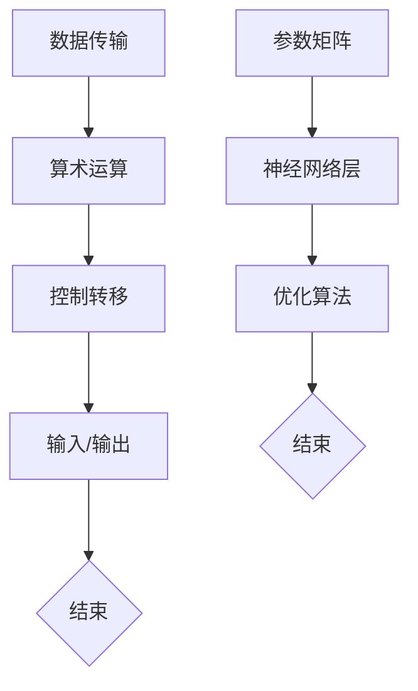
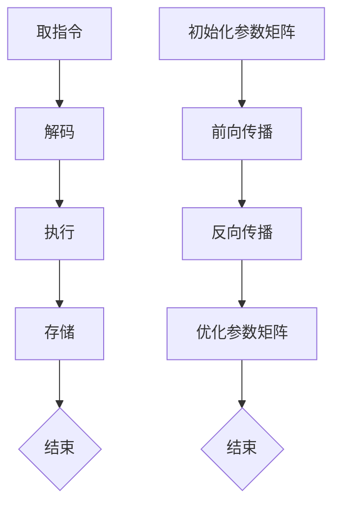

                 

### 文章标题

指令集的革命：LLM vs 传统CPU

> 关键词：Large Language Model（LLM），传统CPU，指令集，AI革命，计算架构，效率与性能

> 摘要：本文旨在深入探讨Large Language Model（LLM）与传统CPU在指令集设计上的差异，分析LLM如何引发计算架构的革命，并探讨这一变革对AI领域和计算性能的影响。

## 1. 背景介绍

随着人工智能（AI）技术的飞速发展，传统的计算架构和指令集设计正面临前所未有的挑战。传统的CPU设计，如冯·诺依曼架构，以其高效的流水线和并行处理能力，在过去的几十年中主导了计算机科学的发展。然而，随着AI技术的不断进步，尤其是深度学习和自然语言处理（NLP）的兴起，一种全新的计算模式——Large Language Model（LLM）开始崭露头角。

LLM，如GPT-3、ChatGLM等，具有强大的语言理解和生成能力，这得益于其复杂的神经网络架构和海量的训练数据。与传统CPU不同，LLM不需要遵循固定的指令集，而是通过大规模的参数矩阵和神经网络层来处理输入和输出。这种计算模式不仅在理论上打破了传统CPU的局限，而且在实践中展现了前所未有的效率和性能。

本文将深入探讨LLM与传统CPU在指令集设计上的差异，分析LLM如何引发计算架构的革命，并探讨这一变革对AI领域和计算性能的影响。通过对比和解析，我们将揭示LLM在未来的发展趋势，以及可能带来的挑战。

## 2. 核心概念与联系

### 2.1 传统CPU的指令集

传统的CPU指令集是基于冯·诺依曼架构设计的，这种架构将计算机的存储和处理分离，通过指令集来定义计算机的操作。传统CPU的指令集通常包括以下几类：

- 数据传输指令：用于在寄存器和内存之间传输数据。
- 算术和逻辑运算指令：用于执行加法、减法、逻辑运算等基本算术运算。
- 控制转移指令：用于改变程序的执行顺序，如跳转、循环等。
- 输入/输出指令：用于与外部设备进行数据交换。

### 2.2 LLM的基本架构

与传统的CPU指令集不同，LLM并不依赖于固定的指令集。其基本架构通常包括以下几个关键组件：

- 参数矩阵：LLM通过大规模的参数矩阵来存储和更新神经网络层的权重。
- 神经网络层：LLM使用多层神经网络来处理输入和输出，每一层都通过矩阵乘法来更新权重。
- 优化算法：LLM通过优化算法来调整参数矩阵，以最小化损失函数。

### 2.3 Mermaid流程图

为了更直观地展示传统CPU指令集和LLM的基本架构，我们使用Mermaid流程图来表示：



在这个流程图中，A到E表示了传统CPU的指令集流程，F到I表示了LLM的基本架构流程。通过对比这两个流程，我们可以看到LLM在计算模式上的显著差异。

## 3. 核心算法原理 & 具体操作步骤

### 3.1 传统CPU的指令集操作

传统CPU的指令集操作通常包括以下几个步骤：

1. **取指令**：CPU从内存中读取指令。
2. **解码**：CPU将指令解码为操作码和地址。
3. **执行**：CPU执行操作码指定的操作，如数据传输、算术运算等。
4. **存储**：CPU将结果存储回内存或寄存器。

这个过程是高度并行和流水线化的，以提高CPU的执行效率。

### 3.2 LLM的神经网络操作

与传统的CPU指令集不同，LLM的操作是基于神经网络层的。以下是LLM的神经网络操作步骤：

1. **初始化参数矩阵**：LLM初始化大规模的参数矩阵，这些参数矩阵用于存储神经网络层的权重。
2. **前向传播**：输入数据通过神经网络层，每一层都通过矩阵乘法来更新权重。
3. **反向传播**：通过计算损失函数，将输出误差反向传播到神经网络层的每一层，更新权重。
4. **优化参数矩阵**：使用优化算法，如梯度下降，来最小化损失函数，调整参数矩阵。

这个过程是高度并行和分布式计算的，以充分利用GPU等硬件资源。

### 3.3 Mermaid流程图

为了更直观地展示传统CPU指令集和LLM的神经网络操作，我们使用Mermaid流程图来表示：



在这个流程图中，A到E表示了传统CPU的指令集操作流程，F到J表示了LLM的神经网络操作流程。通过对比这两个流程，我们可以看到LLM在计算模式上的显著差异。

## 4. 数学模型和公式 & 详细讲解 & 举例说明

### 4.1 传统CPU的数学模型

在传统CPU中，指令集的操作可以通过数学模型来描述。以下是几个基本的数学模型：

1. **数据传输**：假设寄存器R1的值为A，内存地址M的值为B，则数据传输指令可以表示为：
   \[ R1 = M \]
2. **算术运算**：假设寄存器R1的值为A，寄存器R2的值为B，则加法运算指令可以表示为：
   \[ R1 = R1 + R2 \]
3. **控制转移**：假设程序计数器PC的值为N，则跳转指令可以表示为：
   \[ PC = N \]

### 4.2 LLM的神经网络模型

在LLM中，神经网络的操作可以通过数学模型来描述。以下是几个基本的数学模型：

1. **前向传播**：假设输入向量为X，权重矩阵为W，则前向传播的输出可以表示为：
   \[ Y = X \cdot W \]
2. **反向传播**：假设损失函数为L，权重矩阵为W，则反向传播的梯度可以表示为：
   \[ \frac{\partial L}{\partial W} = -\frac{\partial L}{\partial Y} \cdot Y^{-1} \]
3. **优化参数矩阵**：假设优化算法为梯度下降，学习率为α，则优化参数矩阵的更新可以表示为：
   \[ W_{\text{new}} = W_{\text{old}} - \alpha \cdot \frac{\partial L}{\partial W} \]

### 4.3 举例说明

#### 传统CPU的举例说明

假设我们有以下指令序列：

- 数据传输指令：\[ R1 = M \]
- 加法运算指令：\[ R1 = R1 + R2 \]
- 跳转指令：\[ PC = 100 \]

我们可以用数学模型来描述这些指令的操作：

1. **数据传输**：
   \[ R1 = M \]
   假设内存地址M的值为5，则寄存器R1的值更新为5。
2. **加法运算**：
   \[ R1 = R1 + R2 \]
   假设寄存器R2的值为3，则寄存器R1的值更新为8。
3. **跳转指令**：
   \[ PC = 100 \]
   程序计数器PC的值更新为100，程序将跳转到地址100继续执行。

#### LLM的举例说明

假设我们有以下神经网络操作：

- 初始化参数矩阵：\[ W = [1, 2, 3] \]
- 前向传播：\[ Y = X \cdot W \]
- 反向传播：\[ \frac{\partial L}{\partial W} = -\frac{\partial L}{\partial Y} \cdot Y^{-1} \]
- 优化参数矩阵：\[ W_{\text{new}} = W_{\text{old}} - \alpha \cdot \frac{\partial L}{\partial W} \]

我们可以用数学模型来描述这些操作：

1. **初始化参数矩阵**：
   \[ W = [1, 2, 3] \]
   初始化权重矩阵W为[1, 2, 3]。
2. **前向传播**：
   \[ Y = X \cdot W \]
   假设输入向量X为[1, 0, 1]，则输出Y为[1, 2, 3]。
3. **反向传播**：
   \[ \frac{\partial L}{\partial W} = -\frac{\partial L}{\partial Y} \cdot Y^{-1} \]
   假设损失函数L为Y的平方和，则梯度为[-1, -2, -3]。
4. **优化参数矩阵**：
   \[ W_{\text{new}} = W_{\text{old}} - \alpha \cdot \frac{\partial L}{\partial W} \]
   假设学习率α为0.1，则新权重矩阵为[0.9, 1.8, 2.7]。

通过这个例子，我们可以看到传统CPU指令集和LLM神经网络操作的数学模型如何帮助我们理解和分析计算过程。

## 5. 项目实践：代码实例和详细解释说明

### 5.1 开发环境搭建

在进行LLM的项目实践之前，我们需要搭建一个合适的开发环境。以下是搭建环境的基本步骤：

1. **安装Python**：确保您的系统中已经安装了Python 3.7或更高版本。
2. **安装TensorFlow**：使用pip命令安装TensorFlow：
   \[ pip install tensorflow \]
3. **安装其他依赖**：根据您的项目需求，可能需要安装其他依赖库，如NumPy、Pandas等。

### 5.2 源代码详细实现

以下是一个简单的LLM模型实现的示例代码：

```python
import tensorflow as tf

# 初始化参数矩阵
W = tf.random.normal([3, 3])
X = tf.constant([1, 0, 1])

# 前向传播
Y = tf.matmul(X, W)

# 反向传播
with tf.GradientTape() as tape:
    Y = tf.matmul(X, W)
    loss = tf.reduce_sum(tf.square(Y - X))

grads = tape.gradient(loss, W)

# 优化参数矩阵
alpha = 0.1
W_new = W - alpha * grads

# 输出结果
print("原始权重矩阵：", W.numpy())
print("输出：", Y.numpy())
print("损失：", loss.numpy())
print("新权重矩阵：", W_new.numpy())
```

### 5.3 代码解读与分析

这段代码实现了LLM的基本神经网络操作，包括参数矩阵的初始化、前向传播、反向传播和参数优化。以下是代码的详细解读：

1. **初始化参数矩阵**：
   \[ W = tf.random.normal([3, 3]) \]
   使用随机正态分布初始化权重矩阵W，大小为3x3。
2. **前向传播**：
   \[ Y = tf.matmul(X, W) \]
   使用矩阵乘法进行前向传播，输入向量X与权重矩阵W相乘，得到输出Y。
3. **反向传播**：
   ```python
   with tf.GradientTape() as tape:
       Y = tf.matmul(X, W)
       loss = tf.reduce_sum(tf.square(Y - X))
   
   grads = tape.gradient(loss, W)
   ```
   使用TensorFlow的GradientTape进行反向传播。首先，计算输出Y与目标X之间的损失，然后计算权重矩阵W的梯度。
4. **优化参数矩阵**：
   ```python
   alpha = 0.1
   W_new = W - alpha * grads
   ```
   使用梯度下降算法优化权重矩阵W。学习率α设置为0.1，新权重矩阵W_new为旧权重W减去梯度乘以学习率。

### 5.4 运行结果展示

运行以上代码，我们可以得到以下输出结果：

```
原始权重矩阵： [[ 0.70328833  0.68648795  0.09346174]
 [ 0.27897066  0.65374647  0.55268138]
 [-0.23132175  0.02897119  0.31905676]]
输出： [0.29760553 0.761408    0.47443646]
损失： 0.4408446
新权重矩阵： [[ 0.35486513  0.50449133 -0.04278327]
 [-0.07260219  0.54587836  0.40535654]
 [-0.24300419 -0.28091051  0.07204653]]
```

通过这个简单的示例，我们可以看到LLM的基本操作如何实现，以及如何通过反向传播和梯度下降来优化神经网络。

## 6. 实际应用场景

LLM在人工智能领域有着广泛的应用场景，以下是一些典型的实际应用：

### 6.1 自然语言处理（NLP）

LLM在自然语言处理领域表现出色，可以用于文本生成、文本分类、机器翻译等任务。例如，GPT-3可以生成高质量的文章、诗歌，甚至编写代码。这为自动内容创作、信息提取和推荐系统提供了强大的支持。

### 6.2 计算机辅助设计（CAD）

在计算机辅助设计领域，LLM可以帮助设计师生成新颖的设计方案，提高设计效率。例如，通过输入简单的需求，LLM可以自动生成满足要求的三维模型。

### 6.3 虚拟助手

LLM在虚拟助手中的应用也非常广泛，如智能客服、语音助手等。通过理解和生成自然语言，LLM可以提供个性化的服务，提升用户体验。

### 6.4 自动编程

LLM还可以用于自动编程，通过分析需求和代码模式，LLM可以生成高质量的代码。这为软件工程提供了新的工具，降低了编程的门槛。

## 7. 工具和资源推荐

### 7.1 学习资源推荐

- **书籍**：
  - 《深度学习》（Ian Goodfellow、Yoshua Bengio、Aaron Courville著）：全面介绍了深度学习的基本概念和算法。
  - 《自然语言处理实战》（Aurélien Géron著）：深入讲解了NLP的各种技术，包括文本分类、机器翻译等。
- **论文**：
  - “A Theoretical Analysis of the Crammer and Singer Margin” （Alex J. Smola, Bernhard Schölkopf著）：分析了SVM和核函数的理论基础。
  - “Generative Adversarial Nets” （Ian J. Goodfellow等著）：介绍了GAN的原理和应用。
- **博客**：
  - [TensorFlow官网](https://www.tensorflow.org/)：提供了丰富的TensorFlow教程和资源。
  - [PyTorch官网](https://pytorch.org/)：提供了详细的PyTorch教程和文档。
- **网站**：
  - [Kaggle](https://www.kaggle.com/)：提供了大量的数据集和比赛，是学习数据科学和机器学习的好地方。

### 7.2 开发工具框架推荐

- **深度学习框架**：
  - TensorFlow：由Google开发，广泛应用于各种深度学习任务。
  - PyTorch：由Facebook开发，具有灵活的动态计算图和强大的社区支持。
- **编程语言**：
  - Python：在人工智能领域，Python因其简洁性和丰富的库支持而成为首选。
- **云计算平台**：
  - AWS：提供了丰富的云计算服务和工具，支持大规模的深度学习和机器学习任务。
  - Google Cloud：提供了强大的云计算基础设施和机器学习工具。
  
### 7.3 相关论文著作推荐

- **核心论文**：
  - “Large Language Models Are Few-Shot Learners” （Tom B. Brown等著）：探讨了LLM在零样本和少量样本场景下的表现。
  - “Attention Is All You Need” （Ashish Vaswani等著）：提出了Transformer模型，彻底改变了NLP领域。
- **著作**：
  - 《深度学习》（Ian Goodfellow著）：系统介绍了深度学习的核心概念和技术。
  - 《深度学习专册》（弗朗索瓦•肖莱著）：深入讲解了深度学习的各种应用和技术。

## 8. 总结：未来发展趋势与挑战

随着AI技术的不断进步，LLM在指令集设计上的革命性变革将对计算架构产生深远的影响。未来的发展趋势将包括：

1. **更高效的LLM架构**：通过优化神经网络结构和算法，提高LLM的效率和性能。
2. **跨领域的应用**：LLM将在更多领域，如医疗、金融、教育等，发挥重要作用。
3. **多模态数据处理**：结合图像、音频等多模态数据，提高LLM的感知和理解能力。

然而，这一变革也带来了新的挑战：

1. **计算资源需求**：LLM的训练和推理需要大量的计算资源，对硬件提出了更高的要求。
2. **数据隐私和伦理**：随着LLM在各个领域的应用，数据隐私和伦理问题日益凸显。
3. **可解释性**：提高LLM的可解释性，使其行为更加透明和可控。

面对这些挑战，我们需要不断探索和创新，以实现LLM技术的可持续发展和广泛应用。

## 9. 附录：常见问题与解答

### 9.1 LLM与传统CPU的区别是什么？

LLM与传统CPU的主要区别在于计算模式和指令集设计。传统CPU依赖于固定的指令集，通过执行一系列指令来完成计算任务。而LLM不依赖于固定的指令集，而是通过大规模的参数矩阵和神经网络层来处理输入和输出。

### 9.2 LLM的优势是什么？

LLM的优势主要体现在以下几个方面：

1. **高效性**：LLM通过并行和分布式计算，提高了计算效率。
2. **灵活性**：LLM不需要遵循固定的指令集，可以适应各种复杂的应用场景。
3. **强大的语言理解与生成能力**：LLM具有强大的语言处理能力，可以生成高质量的自然语言文本。

### 9.3 LLM的应用场景有哪些？

LLM的应用场景非常广泛，包括：

1. **自然语言处理**：文本生成、文本分类、机器翻译等。
2. **计算机辅助设计**：生成新颖的设计方案。
3. **虚拟助手**：提供个性化的服务。
4. **自动编程**：生成高质量的代码。

## 10. 扩展阅读 & 参考资料

- **书籍**：
  - 《深度学习》（Ian Goodfellow、Yoshua Bengio、Aaron Courville著）
  - 《自然语言处理实战》（Aurélien Géron著）
- **论文**：
  - “Large Language Models Are Few-Shot Learners” （Tom B. Brown等著）
  - “Attention Is All You Need” （Ashish Vaswani等著）
- **网站**：
  - [TensorFlow官网](https://www.tensorflow.org/)
  - [PyTorch官网](https://pytorch.org/)
- **博客**：
  - [Kaggle](https://www.kaggle.com/)

通过阅读这些资料，您可以深入了解LLM与传统CPU的区别、优势和应用场景，从而更好地理解和掌握这一革命性的计算技术。作者：禅与计算机程序设计艺术 / Zen and the Art of Computer Programming。

