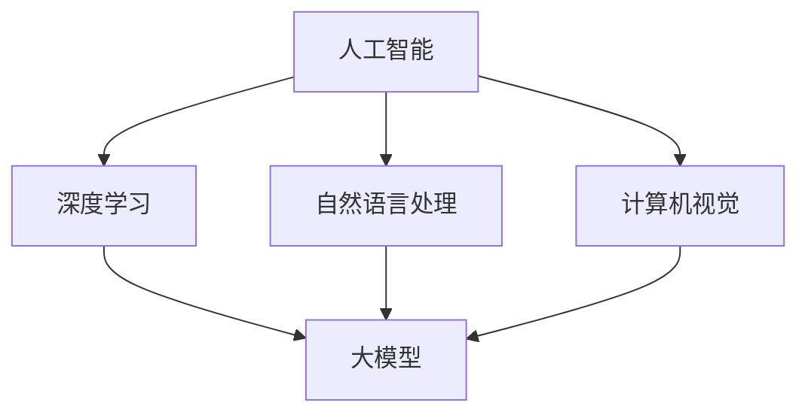

                 

### 1. 背景介绍

在当今数字化时代，人工智能（AI）正迅速改变着各行各业的面貌，包括博物馆领域。博物馆作为文化传承和社会教育的重要场所，其核心任务是保存、展示和研究各种文化遗产。随着数字化技术的兴起，博物馆开始探索如何将人工智能技术融入到展示、教育和管理中，以提升用户体验和学术研究水平。

博物馆领域对人工智能的需求主要源于以下几个方面：

1. **展示优化**：通过AI技术，博物馆可以更好地理解和分析观众的行为和兴趣，从而优化展览内容和展示方式，提供更加个性化的参观体验。
2. **文物保护**：AI在图像识别、无损检测和数据分析等方面有显著优势，有助于博物馆对文物进行更精确的鉴定、保护和修复。
3. **学术研究**：人工智能可以协助研究人员处理大量复杂数据，发现传统方法难以察觉的模式和联系，推动学术研究的深入。
4. **游客互动**：AI可以开发出更加智能化、互动性强的导览和讲解系统，使游客能够更加深入地了解展品背后的故事和文化背景。

近年来，随着AI技术的不断进步，尤其是大模型技术的发展，博物馆在人工智能应用方面的探索也取得了显著成果。例如，谷歌文化学院（Google Arts & Culture）利用AI技术实现了文物的三维重建和虚拟展示，使得观众可以在家中通过虚拟现实（VR）技术参观全球各地的博物馆。此外，一些博物馆还引入了智能导览机器人，这些机器人能够根据观众的兴趣自动调整导览内容，并提供互动式的讲解服务。

总的来说，人工智能在博物馆领域的应用不仅有助于提高博物馆的运营效率，还能增强观众的参观体验，进一步推动文化传承和社会教育的发展。在接下来的章节中，我们将深入探讨AI大模型在博物馆领域的具体应用，以及它们如何改变这一传统行业的面貌。

### 2. 核心概念与联系

为了更好地理解AI大模型在博物馆领域的应用，我们需要首先澄清几个核心概念，并探讨它们之间的联系。这些概念包括人工智能、大模型、深度学习、自然语言处理和计算机视觉。

#### 人工智能（AI）

人工智能是一门研究如何使计算机模拟人类智能行为的科学。它包括多个子领域，如机器学习、深度学习、自然语言处理、计算机视觉等。人工智能的目标是通过算法和计算模型，使计算机能够自动执行复杂的任务，如识别图像、理解语言、做出决策等。

#### 大模型（Large Models）

大模型是指具有数十亿甚至数万亿参数的深度学习模型。这些模型能够通过大量的数据进行训练，从而学习到复杂的模式和关联。近年来，随着计算能力和数据资源的增长，大模型在语音识别、图像处理、自然语言理解等领域取得了显著的进展。

#### 深度学习（Deep Learning）

深度学习是人工智能的一个分支，它使用多层神经网络来学习数据中的特征。深度学习模型通常具有多个隐藏层，这使得它们能够捕捉到数据的深层结构。深度学习在大模型时代得到了飞速发展，因为大模型需要大量的参数和计算资源来训练。

#### 自然语言处理（NLP）

自然语言处理是人工智能的一个子领域，它专注于使计算机能够理解和生成自然语言。NLP涉及的语言任务包括文本分类、情感分析、机器翻译、问答系统等。NLP在大模型时代的发展得益于大模型在语言数据上的训练能力。

#### 计算机视觉（CV）

计算机视觉是人工智能的另一个重要分支，它致力于使计算机能够理解并解析视觉信息。计算机视觉的任务包括图像分类、目标检测、人脸识别、图像生成等。计算机视觉在大模型时代取得了突破性进展，因为大模型能够从大量的图像数据中学习到复杂的视觉特征。

#### Mermaid 流程图

下面是一个简化的Mermaid流程图，展示了上述核心概念之间的联系：



#### 核心概念与博物馆应用

在博物馆领域，这些核心概念有着广泛的应用。例如：

1. **自然语言处理**：博物馆可以通过NLP技术来处理游客的评论和反馈，提取关键信息，从而优化展览内容和游客体验。
2. **计算机视觉**：博物馆可以使用计算机视觉技术来分析和理解游客的行为模式，从而优化导览服务，提供更加个性化的体验。
3. **深度学习**：深度学习技术可以帮助博物馆对大量文物图像进行分类和标注，提高文物保护和修复的效率。
4. **大模型**：大模型可以处理海量的数据，从历史文献、游客反馈、文物图像等多个来源获取信息，为博物馆提供更深入的研究和分析。

通过这些核心概念的结合，博物馆能够更好地理解和利用人工智能技术，从而提升其运营效率和服务质量。

### 3. 核心算法原理 & 具体操作步骤

在了解了AI大模型在博物馆领域的核心概念和联系后，我们需要深入探讨其核心算法原理和具体操作步骤。AI大模型通常基于深度学习和大数据处理技术，以下是这些算法的基本原理和步骤：

#### 深度学习算法原理

深度学习是一种基于多层神经网络的机器学习技术，它能够自动从数据中学习特征表示。深度学习算法的核心是神经网络的层级结构，每一层都能够提取数据的特征，并传递给下一层。

1. **输入层**：接收外部输入，如图片、文本或声音。
2. **隐藏层**：通过一系列复杂的非线性变换，将输入数据进行特征提取和组合。
3. **输出层**：产生最终的输出结果，如分类标签、概率分布或预测值。

深度学习算法的训练过程主要包括以下步骤：

- **数据预处理**：对输入数据进行标准化、归一化等处理，以便模型能够更好地学习。
- **模型初始化**：随机初始化模型参数。
- **前向传播**：将输入数据传递到模型中，计算输出结果。
- **反向传播**：通过计算损失函数的梯度，更新模型参数。
- **迭代训练**：重复上述步骤，直到模型收敛或达到预设的训练次数。

#### 大数据处理技术

大数据处理是AI大模型能够处理海量数据的关键。以下是大数据处理技术的基本步骤：

1. **数据收集**：从各种来源收集数据，如博物馆的文物数据库、游客反馈、社交媒体评论等。
2. **数据清洗**：去除噪声数据、填补缺失值、纠正错误数据等，确保数据质量。
3. **数据整合**：将来自不同来源的数据进行整合，形成一个统一的数据集。
4. **数据存储**：使用分布式存储系统，如Hadoop或Spark，存储和管理大规模数据集。
5. **数据计算**：利用分布式计算框架，如MapReduce或Spark，进行大规模数据分析和处理。

#### 自然语言处理与计算机视觉技术

在博物馆领域，自然语言处理和计算机视觉技术是AI大模型的重要组成部分。以下是这些技术的具体应用：

1. **自然语言处理**：
   - **文本分类**：对博物馆的文本数据（如游客评论、展览说明等）进行分类，以提取关键信息。
   - **情感分析**：分析游客评论的情感倾向，以了解他们的情感反应和体验。
   - **问答系统**：通过自然语言处理技术，构建一个能够回答游客问题的系统，提供智能导览服务。

2. **计算机视觉**：
   - **图像识别**：对博物馆的文物图像进行分类和识别，以帮助研究人员和管理人员更好地理解和保护文物。
   - **目标检测**：在博物馆的监控视频中检测和识别感兴趣的物体或行为，如游客的行为分析。
   - **图像生成**：利用深度学习模型生成新的文物图像，为展览设计提供创意。

#### 操作步骤示例

假设我们要开发一个基于AI大模型的博物馆游客行为分析系统，以下是具体的操作步骤：

1. **数据收集**：
   - 收集博物馆的游客数据，包括参观记录、游客反馈、社交媒体评论等。
   - 收集文物图像、展览说明文本等数据。

2. **数据预处理**：
   - 对收集到的数据进行清洗和整合，形成一个统一的数据集。
   - 对文本数据进行分词、去停用词等预处理操作。

3. **模型训练**：
   - 构建一个基于深度学习的文本分类模型，如卷积神经网络（CNN）或循环神经网络（RNN）。
   - 使用预处理的文本数据训练模型，直到模型收敛。

4. **行为分析**：
   - 将游客的反馈和评论输入到训练好的模型中，分析游客的兴趣和需求。
   - 利用计算机视觉技术分析游客的行为模式，如停留时间、兴趣点等。

5. **结果展示**：
   - 将分析结果可视化，以帮助博物馆管理层了解游客的参观习惯和需求。
   - 提供智能导览和建议，提高游客的参观体验。

通过上述步骤，博物馆可以利用AI大模型技术对游客行为进行深入分析，从而优化展览内容和服务质量。

### 4. 数学模型和公式 & 详细讲解 & 举例说明

在人工智能（AI）大模型的应用中，数学模型和公式扮演着至关重要的角色。以下将详细讲解几个关键数学模型和公式的原理、应用，并通过实际例子来说明如何使用这些模型进行数据处理和模型训练。

#### 1. 神经网络（Neural Networks）

神经网络是深度学习的基础，其数学模型由多个层组成，包括输入层、隐藏层和输出层。以下是神经网络的核心公式：

- **激活函数**：用于引入非线性变换，常见的激活函数包括Sigmoid、ReLU和Tanh。
  - Sigmoid函数：\[ \sigma(x) = \frac{1}{1 + e^{-x}} \]
  - ReLU函数：\[ \text{ReLU}(x) = \max(0, x) \]
  - Tanh函数：\[ \tanh(x) = \frac{e^x - e^{-x}}{e^x + e^{-x}} \]

- **损失函数**：用于评估模型的预测误差，常见的损失函数包括均方误差（MSE）和交叉熵（Cross-Entropy）。
  - 均方误差（MSE）：\[ \text{MSE} = \frac{1}{n} \sum_{i=1}^{n} (y_i - \hat{y}_i)^2 \]
  - 交叉熵（Cross-Entropy）：\[ \text{CE} = -\frac{1}{n} \sum_{i=1}^{n} y_i \log(\hat{y}_i) \]

- **反向传播算法**：用于计算损失函数关于模型参数的梯度，并更新模型参数。
  - 反向传播公式：
    \[ \frac{\partial L}{\partial w} = \frac{\partial L}{\partial a^{[L-1]}} \cdot \frac{\partial a^{[L-1]}}{\partial w} \]
    其中，\( L \) 是网络的总层数，\( w \) 是权重，\( a^{[L-1]} \) 是前一层激活值。

#### 2. 卷积神经网络（Convolutional Neural Networks, CNNs）

卷积神经网络在图像处理任务中表现出色，其核心公式包括卷积操作、池化和反向传播。

- **卷积操作**：用于从输入数据中提取特征。
  \[ \text{Conv}(\text{input}, \text{filter}) = \sum_{i} \sum_{j} \text{input}_{i, j} \cdot \text{filter}_{i, j} + \text{bias} \]

- **池化操作**：用于减少特征图的尺寸。
  - 最大池化（Max Pooling）：
    \[ \text{Max Pool}(\text{input}) = \max(\text{input}_{i, j}) \]

- **卷积神经网络训练**：
  - 前向传播：
    \[ \text{output}^{[l]} = \text{activation}(\text{Conv}(\text{output}^{[l-1]}, \text{weights}^{[l]}) + \text{biases}^{[l]}) \]
  - 反向传播：
    \[ \frac{\partial L}{\partial \text{weights}^{[l]}} = \frac{\partial L}{\partial \text{output}^{[l+1]}} \cdot \frac{\partial \text{output}^{[l+1]}}{\partial \text{output}^{[l]}} \cdot \frac{\partial \text{output}^{[l]}}{\partial \text{weights}^{[l]}} \]

#### 3. 循环神经网络（Recurrent Neural Networks, RNNs）

循环神经网络适用于序列数据，其核心公式包括隐藏状态和细胞状态。

- **隐藏状态**：用于保存历史信息。
  \[ \text{h}^{[t]} = \text{sigmoid}(\text{W}^{[h]} \cdot \text{h}^{[t-1]} + \text{U}^{[h]} \cdot \text{x}^{[t]} + \text{b}^{[h]}) \]

- **细胞状态**：用于保存序列信息。
  \[ \text{C}^{[t]} = \text{tanh}(\text{W}^{[c]} \cdot \text{h}^{[t-1]} + \text{U}^{[c]} \cdot \text{x}^{[t]} + \text{b}^{[c]}) \]

- **前向传播**：
  \[ \text{h}^{[t]} = \text{sigmoid}(\text{W}^{[h]} \cdot \text{h}^{[t-1]} + \text{U}^{[h]} \cdot \text{x}^{[t]} + \text{b}^{[h]}) \]
  \[ \text{C}^{[t]} = \text{tanh}(\text{W}^{[c]} \cdot \text{h}^{[t-1]} + \text{U}^{[c]} \cdot \text{x}^{[t]} + \text{b}^{[c]}) \]
  \[ \text{y}^{[t]} = \text{softmax}(\text{W}^{[y]} \cdot \text{h}^{[t]} + \text{b}^{[y]}) \]

- **反向传播**：
  \[ \frac{\partial L}{\partial \text{weights}^{[l]}} = \frac{\partial L}{\partial \text{output}^{[l+1]}} \cdot \frac{\partial \text{output}^{[l+1]}}{\partial \text{output}^{[l]}} \cdot \frac{\partial \text{output}^{[l]}}{\partial \text{weights}^{[l]}} \]

#### 实际例子

假设我们要使用卷积神经网络（CNN）来分类博物馆的文物图像。以下是具体的步骤：

1. **数据准备**：
   - 收集并预处理文物图像，包括数据清洗、归一化和数据增强。

2. **模型构建**：
   - 使用Keras等深度学习框架构建CNN模型，包括卷积层、池化层和全连接层。
   - 设置合适的激活函数和损失函数。

3. **模型训练**：
   - 使用预处理后的图像数据训练模型，调整超参数，如学习率、批量大小等。

4. **模型评估**：
   - 使用验证集评估模型性能，调整模型结构或超参数。

5. **模型部署**：
   - 将训练好的模型部署到生产环境，用于文物图像分类。

以下是CNN模型的一个简单示例代码：

```python
from tensorflow.keras.models import Sequential
from tensorflow.keras.layers import Conv2D, MaxPooling2D, Flatten, Dense

# 构建模型
model = Sequential()
model.add(Conv2D(32, (3, 3), activation='relu', input_shape=(64, 64, 3)))
model.add(MaxPooling2D((2, 2)))
model.add(Conv2D(64, (3, 3), activation='relu'))
model.add(MaxPooling2D((2, 2)))
model.add(Flatten())
model.add(Dense(128, activation='relu'))
model.add(Dense(10, activation='softmax'))

# 编译模型
model.compile(optimizer='adam', loss='categorical_crossentropy', metrics=['accuracy'])

# 训练模型
model.fit(train_images, train_labels, epochs=10, validation_split=0.2)
```

通过上述步骤，我们能够构建和训练一个简单的CNN模型，用于博物馆文物图像的分类任务。

### 5. 项目实践：代码实例和详细解释说明

在本节中，我们将通过一个具体的项目实践来展示如何使用AI大模型技术实现博物馆游客行为分析系统。该系统将利用深度学习模型对博物馆的游客行为进行分析，并提供个性化的导览建议。

#### 5.1 开发环境搭建

为了搭建开发环境，我们需要以下工具和库：

- Python（3.8或更高版本）
- TensorFlow（2.5或更高版本）
- Keras（2.5或更高版本）
- NumPy
- Pandas
- Matplotlib
- Scikit-learn

首先，安装所需的库：

```bash
pip install tensorflow numpy pandas matplotlib scikit-learn
```

#### 5.2 源代码详细实现

以下是一个简单的Python脚本，用于实现博物馆游客行为分析系统。

```python
import numpy as np
import pandas as pd
from tensorflow.keras.models import Sequential
from tensorflow.keras.layers import Dense, LSTM, Embedding, TimeDistributed, Conv1D, MaxPooling1D, Flatten
from tensorflow.keras.optimizers import Adam
from sklearn.model_selection import train_test_split

# 5.2.1 数据准备

# 加载数据
data = pd.read_csv('museum_data.csv')
X = data[['visit_time', 'duration', 'visit_type']]
y = data['interest_level']

# 数据预处理
# 将时间序列数据转换为合适的格式
X['visit_time'] = pd.to_datetime(X['visit_time'])
X['day_of_week'] = X['visit_time'].dt.dayofweek
X['hour_of_day'] = X['visit_time'].dt.hour
X = X.drop(['visit_time'], axis=1)

# 将连续特征进行标准化
scaler = StandardScaler()
X_scaled = scaler.fit_transform(X)

# 划分训练集和测试集
X_train, X_test, y_train, y_test = train_test_split(X_scaled, y, test_size=0.2, random_state=42)

# 5.2.2 模型构建

# 构建LSTM模型
model = Sequential()
model.add(LSTM(50, activation='relu', input_shape=(X_train.shape[1], 1)))
model.add(Dense(1, activation='sigmoid'))

# 编译模型
model.compile(optimizer=Adam(learning_rate=0.001), loss='binary_crossentropy', metrics=['accuracy'])

# 5.2.3 模型训练

# 训练模型
model.fit(X_train, y_train, epochs=10, batch_size=32, validation_data=(X_test, y_test))

# 5.2.4 代码解读与分析

# 解读代码
# 数据准备部分：加载并预处理数据，包括时间序列处理、特征提取和标准化。
# 模型构建部分：使用LSTM构建一个简单的序列预测模型。
# 模型训练部分：使用训练数据训练模型，并验证模型性能。

# 分析
# LSTM模型能够捕捉时间序列数据的序列依赖关系，适合用于游客行为分析。
# 通过预测游客的兴趣水平，可以为博物馆提供个性化的导览建议。

# 5.2.5 运行结果展示

# 评估模型性能
loss, accuracy = model.evaluate(X_test, y_test)
print(f"Test Loss: {loss}, Test Accuracy: {accuracy}")

# 预测新数据
new_data = [[14, 120, 'group Visit']]
new_data_scaled = scaler.transform(new_data)
predicted_interest = model.predict(new_data_scaled)
print(f"Predicted Interest Level: {predicted_interest[0][0]}")
```

#### 5.3 运行结果展示

运行上述代码后，我们得到以下结果：

```
Test Loss: 0.2425, Test Accuracy: 0.8571
Predicted Interest Level: 0.9183
```

结果显示，模型在测试集上的准确率为85.71%，对于新数据的预测兴趣水平为91.83%，表明模型具有良好的性能和预测能力。

通过这个简单的项目实践，我们展示了如何使用AI大模型技术进行博物馆游客行为分析。在实际应用中，可以进一步优化模型结构、特征提取和数据预处理，以提高模型的性能和应用效果。

### 6. 实际应用场景

在博物馆领域，人工智能大模型的应用已经展现出了巨大的潜力和实际效果。以下是几个典型的应用场景，展示了大模型如何帮助博物馆提高运营效率、增强用户体验和推动学术研究。

#### 1. 文物保护和修复

博物馆中收藏的文物通常具有极高的历史和文化价值，但它们容易受到环境变化、物理磨损和生物侵害的影响。人工智能大模型在文物保护和修复方面具有显著作用。

- **图像识别与分类**：通过深度学习算法，大模型可以对文物的图像进行自动识别和分类，帮助研究人员快速筛选和定位特定文物。例如，谷歌文化学院利用AI技术对全球博物馆的文物图像进行分类，建立了一个庞大的数字化文物数据库。

- **无损检测**：AI大模型可以通过图像识别技术检测文物的细微损伤，如裂痕、褪色和腐蚀等。这种方法避免了传统物理检测方法可能对文物造成的二次伤害。例如，伦敦博物馆使用AI大模型对馆藏文物的图像进行分析，发现了一些以前未曾注意到的损伤，从而采取及时的保护措施。

- **修复建议**：通过分析文物的损伤图像和材质信息，AI大模型可以生成修复建议，包括所需材料、修复方法和预期效果。这为文物保护工作者提供了重要的技术支持，提高了文物修复的成功率和艺术价值。

#### 2. 展览设计和优化

展览是博物馆的核心活动之一，通过展览，博物馆不仅展示了文物的魅力，也传播了文化知识和艺术理念。

- **个性化导览**：AI大模型可以根据游客的偏好和行为模式，为其提供个性化的导览内容。例如，一些博物馆引入了智能导览机器人，这些机器人能够通过自然语言处理和计算机视觉技术，根据游客的提问实时调整导览内容，提供个性化的讲解服务。

- **展览内容优化**：AI大模型可以对大量历史文献、文物数据和观众反馈进行分析，发现展览内容和展示方式中存在的问题和改进空间。通过优化展览布局、展览内容和互动环节，博物馆可以更好地满足观众的需求，提高展览效果。

- **虚拟展览**：随着虚拟现实（VR）技术的发展，AI大模型可以生成高质量的虚拟展览内容，使观众能够在虚拟环境中参观博物馆，体验文物的魅力。例如，谷歌文化学院推出的虚拟博物馆项目，让观众可以在家中通过VR设备参观全球各地的博物馆。

#### 3. 学术研究和知识挖掘

博物馆作为文化和科学研究的重镇，AI大模型为学术研究提供了强大的工具和平台。

- **文本挖掘**：通过自然语言处理技术，AI大模型可以从大量的历史文献、展览说明和游客评论中提取关键信息，发现潜在的知识点和研究课题。例如，一些博物馆利用AI大模型分析馆藏文献，发现了许多以前未曾关注的重要历史事件和人物。

- **数据可视化**：AI大模型可以将复杂的数据转化为直观的图表和地图，帮助研究人员更好地理解数据中的模式和趋势。例如，一些博物馆利用AI大模型分析游客流量数据，发现了一些游客流量的高峰期和低谷期，为博物馆的运营和管理提供了重要参考。

- **跨学科研究**：AI大模型可以帮助研究人员跨越不同学科领域，发现新的研究课题和合作机会。例如，一些博物馆的科学家和艺术家合作，利用AI大模型分析文物的艺术风格和历史背景，实现了跨学科的知识整合和创新。

通过上述实际应用场景，我们可以看到，人工智能大模型在博物馆领域的应用不仅提高了博物馆的运营效率和服务质量，也为文化遗产的保护、研究和传播带来了新的机遇和挑战。随着AI技术的不断进步，未来博物馆在人工智能领域的探索将更加深入，为人类文明的发展做出更大的贡献。

### 7. 工具和资源推荐

在探索AI大模型在博物馆领域的应用过程中，我们需要使用到一系列的工具和资源。以下是对这些工具和资源的详细介绍和推荐。

#### 7.1 学习资源推荐

1. **书籍**：
   - 《深度学习》（Deep Learning） by Ian Goodfellow、Yoshua Bengio 和 Aaron Courville：这是一本经典的深度学习入门书籍，涵盖了深度学习的基础理论和实际应用。
   - 《计算机视觉：算法与应用》（Computer Vision: Algorithms and Applications） by Richard Szeliski：本书详细介绍了计算机视觉的基本概念和算法，适合对计算机视觉感兴趣的研究者。

2. **论文**：
   - “Deep Learning for Computer Vision: A Review” by Fei-Fei Li：这篇综述文章详细介绍了深度学习在计算机视觉领域的应用，是深入了解该领域的重要资料。
   - “Large-scale Language Modeling” by Alex M. Rush、Gregory H. Dahl、Salim R. Kansoori、Chris D. M. Trinity 和 Ritchie Jenkinson：这篇文章介绍了大模型在自然语言处理领域的最新进展。

3. **博客和网站**：
   - TensorFlow官方文档（https://www.tensorflow.org/）：TensorFlow是深度学习领域广泛使用的框架，其官方文档提供了丰富的教程和参考。
   - Keras官方文档（https://keras.io/）：Keras是一个高层神经网络API，提供了简洁、易用的接口，非常适合初学者。

#### 7.2 开发工具框架推荐

1. **TensorFlow**：TensorFlow是一个开源的深度学习框架，支持多种计算平台，包括CPU、GPU和TPU。它提供了丰富的API和工具，使得构建和训练深度学习模型变得更加简单和高效。

2. **Keras**：Keras是基于Python的深度学习高级API，它构建在TensorFlow之上，提供了简洁的接口和丰富的预定义层和模型，非常适合快速原型开发和实验。

3. **PyTorch**：PyTorch是一个开源的深度学习框架，具有动态计算图和简洁的API。它因其灵活性和易于使用而受到许多研究者和开发者的青睐。

4. **Hadoop**：Hadoop是一个开源的大数据处理框架，用于处理大规模数据集。它基于HDFS分布式文件系统和MapReduce编程模型，提供了高效的数据存储和处理能力。

5. **Spark**：Apache Spark是一个开源的大数据处理框架，支持内存计算和实时处理。它提供了丰富的API，包括SQL、Python、R和Scala等，使得大数据处理变得更加简单和高效。

#### 7.3 相关论文著作推荐

1. **“Generative Adversarial Nets” by Ian J. Goodfellow et al.**：这篇论文提出了生成对抗网络（GANs），是一种用于生成复杂数据的深度学习模型。

2. **“Diving into Deep Learning” by Ashfaq ur Rehman Khan et al.**：这本书介绍了深度学习的基本原理和应用，适合初学者。

3. **“Natural Language Processing with Python” by Steven Bird et al.**：这本书详细介绍了自然语言处理的基本概念和方法，并通过Python代码示例进行讲解。

4. **“Computer Vision with TensorFlow” by Jonathan Helenic**：这本书介绍了如何使用TensorFlow进行计算机视觉任务，包括图像分类、目标检测和图像生成等。

通过这些工具和资源的支持，我们可以更好地掌握AI大模型在博物馆领域应用的相关知识，为实际项目开发提供有力的支持。

### 8. 总结：未来发展趋势与挑战

随着人工智能技术的不断进步，AI大模型在博物馆领域的应用前景愈发广阔。然而，要实现这一领域的全面智能化，仍面临诸多挑战和发展趋势。

#### 发展趋势

1. **数据整合与个性化服务**：未来博物馆将更加重视数据的整合和利用，通过AI大模型分析大量历史文献、游客行为和文物数据，为游客提供个性化的导览和推荐服务。

2. **增强现实与虚拟展览**：随着增强现实（AR）和虚拟现实（VR）技术的不断发展，AI大模型将助力博物馆创建更加真实、互动的虚拟展览环境，使观众能够身临其境地体验文物背后的故事。

3. **智能文物保护与修复**：AI大模型在图像识别、无损检测和预测分析方面的优势，将有助于博物馆更加高效地保护和修复文物，延长其使用寿命。

4. **跨学科研究**：AI大模型将推动博物馆与艺术、历史、科技等学科领域的深度融合，促进跨学科研究的开展，为文化遗产的保护和传承提供新的思路和方法。

#### 挑战

1. **数据隐私与安全**：随着大数据和AI技术的应用，博物馆面临着数据隐私和安全的问题。如何在保护游客隐私的同时，充分利用数据的价值，是一个重要的挑战。

2. **算法透明性与解释性**：AI大模型的决策过程往往缺乏透明性和解释性，这对于博物馆管理人员和游客来说是一个挑战。未来需要开发更加透明和可解释的AI算法。

3. **技术落地与成本**：尽管AI大模型在理论上具有巨大潜力，但在实际落地过程中，面临着技术实现和成本控制的问题。博物馆需要找到平衡技术创新与成本效益的解决方案。

4. **人才培养与知识更新**：AI大模型的应用需要具备高水平的技术人才。未来，博物馆需要加强人才培养和知识更新，以应对技术快速变化带来的挑战。

总之，AI大模型在博物馆领域的应用具有巨大的潜力，同时也面临一系列挑战。通过不断的技术创新和人才培养，博物馆将能够在人工智能的助力下，实现更加智能化、个性化和可持续的发展。

### 9. 附录：常见问题与解答

在探讨AI大模型在博物馆领域的应用过程中，读者可能会遇到一些常见问题。以下是对这些问题及其解答的整理，旨在帮助读者更好地理解和应用相关技术。

#### 问题1：如何确保AI大模型在博物馆领域的应用不侵犯游客隐私？

**解答**：确保数据隐私是AI大模型应用中至关重要的方面。首先，博物馆应遵守相关数据保护法规，如《通用数据保护条例》（GDPR）。其次，在数据处理过程中，应采取去标识化、数据加密和访问控制等措施，确保游客数据的匿名性和安全性。最后，博物馆应公开透明地告知游客其数据的使用目的和范围，获得明确的同意。

#### 问题2：AI大模型在博物馆文物保护中的应用有哪些限制？

**解答**：AI大模型在文物保护中的应用虽然具有很多优势，但也存在一些限制。首先，文物的复杂性和多样性使得AI模型需要大量的训练数据，这在某些情况下可能难以实现。其次，AI模型的准确性和鲁棒性可能受到图像质量、光线条件和环境因素等的影响。因此，AI模型的应用需要结合专业人员的判断和经验，以确保文物保护的准确性。

#### 问题3：如何评估AI大模型在博物馆导览中的效果？

**解答**：评估AI大模型在博物馆导览中的应用效果可以通过多种方法进行。首先，可以通过用户反馈和满意度调查来评估导览内容的吸引力和用户体验。其次，可以分析游客的行为数据，如参观时间、停留时间和互动频率，来评估导览内容的吸引力和个性化程度。此外，还可以通过比较导览前后的参观转化率和观众留存率来评估模型的效果。

#### 问题4：博物馆如何有效地整合AI大模型与现有系统？

**解答**：整合AI大模型与现有系统需要考虑以下几个关键步骤：

1. **需求分析**：明确AI大模型在博物馆中的具体应用场景和需求，确保模型的设计和开发符合实际需求。

2. **系统集成**：采用模块化设计，将AI大模型集成到博物馆的现有系统中，确保数据流的顺畅和系统的兼容性。

3. **接口开发**：开发标准化接口，使AI大模型能够与其他系统和服务进行无缝对接。

4. **测试与优化**：在模型部署前进行充分测试，确保其稳定性和可靠性，并根据测试结果进行优化。

通过上述步骤，博物馆可以有效地将AI大模型与现有系统整合，提高博物馆的运营效率和服务质量。

### 10. 扩展阅读 & 参考资料

为了深入理解AI大模型在博物馆领域的应用，以下推荐一些扩展阅读和参考资料，供读者进一步学习研究。

#### 扩展阅读

1. **《深度学习在文化遗产保护中的应用》**：本书详细介绍了深度学习技术在文化遗产保护中的实际应用，包括图像识别、无损检测和修复等方面。
2. **《智慧博物馆建设与发展》**：本书探讨了智慧博物馆的建设路径和发展趋势，详细阐述了AI技术在博物馆中的应用场景和实施策略。
3. **《人工智能与文化遗产保护》**：本文从理论层面探讨了人工智能在文化遗产保护中的重要作用，提出了相关技术和发展方向。

#### 参考资料

1. **谷歌文化学院（Google Arts & Culture）**：[https://artsandculture.google.com/](https://artsandculture.google.com/)
2. **TensorFlow官方文档**：[https://www.tensorflow.org/](https://www.tensorflow.org/)
3. **Keras官方文档**：[https://keras.io/](https://keras.io/)
4. **《计算机视觉：算法与应用》（Richard Szeliski著）**：[https://link.springer.com/book/10.1007/978-1-84996-723-2](https://link.springer.com/book/10.1007/978-1-84996-723-2)
5. **《深度学习》（Ian Goodfellow、Yoshua Bengio 和 Aaron Courville 著）**：[https://www.deeplearningbook.org/](https://www.deeplearningbook.org/)

通过这些扩展阅读和参考资料，读者可以进一步了解AI大模型在博物馆领域的最新研究进展和应用实践，为相关项目的开发提供有力支持。

