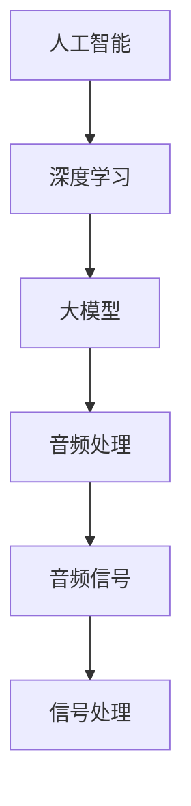

                 

### 1. 背景介绍

#### 1.1 AI的发展历程

人工智能（AI，Artificial Intelligence）作为一种模拟人类智能的技术，起源于20世纪50年代。早期的AI研究主要集中在逻辑推理、问题解决和知识表示等方面。1960年代，出现了早期的人工智能程序，如ELIZA和DENDRAL，标志着AI的初步探索。

随着计算机硬件和算法的不断发展，AI技术逐渐走向成熟。1970年代，专家系统的出现极大地推动了AI应用的发展，使得AI能够应用于医疗、金融和工业等领域。然而，由于计算资源和算法的限制，AI的发展在1980年代遇到了瓶颈。

进入21世纪，随着大数据、云计算和深度学习等技术的飞速发展，AI再次焕发了生机。尤其是深度学习，通过多层神经网络和大量训练数据，AI在图像识别、语音识别、自然语言处理等领域取得了突破性进展。

#### 1.2 音频处理的重要性

音频处理是人工智能的一个重要应用领域，它涉及音频信号的分析、增强、合成和转换等方面。音频处理技术在音频娱乐、通信、医学、工业和军事等多个领域有着广泛的应用。

在音频娱乐领域，音频处理技术用于音频录制、混音和效果处理，为音乐创作和影视制作提供支持。在通信领域，音频处理技术用于语音编码、噪声抑制和回声消除，以提高通信质量。在医学领域，音频处理技术用于声音信号的检测和分析，以辅助诊断和治疗。

此外，音频处理还在工业监测、环境监测和语音交互等领域发挥着重要作用。随着人们对音频质量和体验要求的不断提高，音频处理技术的研发和应用也越来越受到关注。

#### 1.3 AI大模型在音频处理中的应用

近年来，随着AI技术的不断发展，AI大模型在音频处理中的应用逐渐成为研究的热点。AI大模型，尤其是基于深度学习的模型，由于其强大的表征能力和泛化能力，在音频处理领域展现了巨大的潜力。

AI大模型在音频处理中的应用主要包括以下几个方向：

1. **音频分类**：利用AI大模型对音频进行分类，如音乐风格分类、语音情感分类等。
2. **语音识别**：利用AI大模型实现高准确度的语音识别，支持多种语言和方言。
3. **音频增强**：利用AI大模型对音频进行噪声抑制、回声消除等增强处理。
4. **音频合成**：利用AI大模型实现语音合成、音乐生成等。
5. **音频编辑**：利用AI大模型实现音频的自动编辑和混音。

总之，AI大模型在音频处理中的应用不仅提高了音频处理的效果和效率，还为音频处理领域带来了新的研究思路和方向。

#### 1.4 文章结构

本文将分为以下几个部分进行探讨：

1. **背景介绍**：回顾AI和音频处理的发展历程，并介绍AI大模型在音频处理中的应用。
2. **核心概念与联系**：详细阐述AI大模型在音频处理中的核心概念，并使用Mermaid流程图展示相关架构。
3. **核心算法原理 & 具体操作步骤**：深入分析AI大模型在音频处理中的核心算法原理，并给出具体的操作步骤。
4. **数学模型和公式 & 详细讲解 & 举例说明**：介绍AI大模型在音频处理中涉及的数学模型和公式，并进行详细讲解和举例说明。
5. **项目实践：代码实例和详细解释说明**：通过实际项目实例，展示AI大模型在音频处理中的具体应用，并进行详细解释说明。
6. **实际应用场景**：探讨AI大模型在音频处理中的实际应用场景。
7. **工具和资源推荐**：推荐相关学习资源和开发工具。
8. **总结：未来发展趋势与挑战**：总结AI大模型在音频处理中的应用现状，并展望未来的发展趋势与挑战。
9. **附录：常见问题与解答**：解答读者可能遇到的问题。
10. **扩展阅读 & 参考资料**：提供进一步学习的资料。

通过上述结构的安排，本文旨在全面、系统地探讨AI大模型在音频处理中的应用，为读者提供有价值的参考和指导。

### 2. 核心概念与联系

在深入探讨AI大模型在音频处理中的应用之前，我们需要了解一些核心概念及其相互之间的联系。以下是本文将涉及的主要核心概念，并使用Mermaid流程图来展示它们之间的关系。

#### 2.1 核心概念

1. **人工智能（AI）**：一种模拟人类智能的技术，通过算法和计算模型来模拟和扩展人的认知功能。
2. **深度学习（Deep Learning）**：一种基于多层神经网络的学习方法，能够从大量数据中自动提取特征并完成复杂任务。
3. **大模型（Large Model）**：具有数亿甚至千亿参数的深度学习模型，具有强大的表征能力和泛化能力。
4. **音频处理（Audio Processing）**：对音频信号进行分析、增强、合成和转换的一系列技术。
5. **音频信号（Audio Signal）**：表示声音的物理量，通常为时间序列的离散采样数据。
6. **信号处理（Signal Processing）**：一种利用数学方法和算法对信号进行转换和分析的工程技术。

#### 2.2 Mermaid流程图

以下是AI大模型在音频处理中的应用的Mermaid流程图，用于展示各核心概念之间的联系。



**图 2.1 AI大模型在音频处理中的应用的Mermaid流程图**

#### 2.3 关系解释

1. **人工智能（AI）**：作为整体框架，人工智能为音频处理提供了基础算法和计算模型。
2. **深度学习（DL）**：是人工智能的一个重要分支，它通过多层神经网络来实现复杂的任务，如特征提取和模式识别。
3. **大模型（LM）**：深度学习的进一步发展，具有数亿甚至千亿参数，能够在大量数据中进行训练，实现强大的表征能力和泛化能力。
4. **音频处理（AP）**：利用深度学习大模型对音频信号进行操作，包括分类、增强、合成和转换等。
5. **音频信号（AS）**：是音频处理的基本对象，通常为时间序列的离散采样数据。
6. **信号处理（SP）**：为音频处理提供技术支持，包括滤波、变换、编码和解码等。

通过上述核心概念和Mermaid流程图的介绍，我们可以更好地理解AI大模型在音频处理中的应用及其相互之间的关系。

### 3. 核心算法原理 & 具体操作步骤

#### 3.1 深度学习的基本原理

深度学习是一种基于人工神经网络的算法，通过模拟人脑神经网络的结构和功能来实现对数据的自动学习和特征提取。深度学习模型由多个层级组成，每个层级都对输入数据进行处理和变换，从而实现复杂的任务。

深度学习的基本原理可以分为以下几个步骤：

1. **前向传播**：将输入数据通过网络的各个层级进行传递，每个层级对数据进行线性变换和激活函数的应用，最终得到输出结果。
2. **反向传播**：计算输出结果与真实标签之间的误差，并沿着网络的反向路径更新网络参数，以最小化误差。
3. **优化算法**：通过优化算法（如梯度下降、Adam等）调整网络参数，以实现误差的最小化。

#### 3.2 大模型的架构

大模型通常具有数亿甚至千亿参数，其架构主要包括以下几个部分：

1. **输入层**：接收外部输入数据，如音频信号。
2. **隐藏层**：对输入数据进行特征提取和变换，通常包含多个层级。
3. **输出层**：根据训练目标生成预测结果，如音频分类或增强。
4. **激活函数**：用于引入非线性变换，使模型能够拟合复杂的数据分布。

#### 3.3 音频处理中的具体应用

在音频处理中，AI大模型的具体应用可以分为以下几个方向：

1. **音频分类**：利用深度学习大模型对音频进行分类，如音乐风格分类、语音情感分类等。
2. **语音识别**：利用深度学习大模型实现高准确度的语音识别，支持多种语言和方言。
3. **音频增强**：利用深度学习大模型对音频进行噪声抑制、回声消除等增强处理。
4. **音频合成**：利用深度学习大模型实现语音合成、音乐生成等。
5. **音频编辑**：利用深度学习大模型实现音频的自动编辑和混音。

#### 3.4 具体操作步骤

以下是一个基于深度学习大模型的音频增强的具体操作步骤：

1. **数据收集与预处理**：
   - 收集大量的噪声环境和语音信号数据。
   - 对数据进行去噪、归一化和分帧处理，以适应深度学习模型的输入要求。

2. **模型训练**：
   - 选择合适的深度学习架构（如卷积神经网络、长短期记忆网络等）。
   - 使用收集的数据进行模型训练，通过反向传播算法调整模型参数。
   - 使用验证集进行模型验证，以调整模型结构和参数。

3. **模型评估**：
   - 使用测试集对训练好的模型进行评估，计算模型在噪声抑制方面的性能指标，如信噪比（SNR）和主观评分。
   - 根据评估结果调整模型结构和参数，以提高模型性能。

4. **模型部署**：
   - 将训练好的模型部署到实际应用场景，如移动设备、服务器等。
   - 根据应用需求，对模型进行实时调整和优化，以提高用户体验。

#### 3.5 案例分析

以语音识别为例，一个典型的操作步骤如下：

1. **数据收集与预处理**：
   - 收集多种语言和方言的语音数据，并进行标注。
   - 对数据进行去噪、归一化和分帧处理。

2. **模型训练**：
   - 使用预训练的深度学习模型（如Transformer）进行迁移学习，以减少训练时间。
   - 使用收集的语音数据对模型进行训练，通过反向传播算法调整模型参数。

3. **模型评估**：
   - 使用测试集对训练好的模型进行评估，计算模型在语音识别方面的性能指标，如准确率、召回率和F1值。
   - 根据评估结果调整模型结构和参数，以提高模型性能。

4. **模型部署**：
   - 将训练好的模型部署到实际应用场景，如移动设备、语音助手等。
   - 根据应用需求，对模型进行实时调整和优化，以提高用户体验。

通过上述步骤，我们可以利用深度学习大模型实现高效的音频处理任务，如语音识别、音频增强等。

### 4. 数学模型和公式 & 详细讲解 & 举例说明

在AI大模型应用于音频处理的过程中，涉及到了多个数学模型和公式。以下将详细介绍这些模型和公式，并给出相应的讲解和举例说明。

#### 4.1 线性代数基础

在深度学习模型中，线性代数是一个重要的基础。以下是几个常用的线性代数概念和公式。

**1. 向量和矩阵的乘法**

设向量$\vec{a} = [a_1, a_2, \ldots, a_n]$和矩阵$A = \begin{pmatrix} a_{11} & a_{12} & \ldots & a_{1n} \\ a_{21} & a_{22} & \ldots & a_{2n} \\ \vdots & \vdots & \ddots & \vdots \\ a_{m1} & a_{m2} & \ldots & a_{mn} \end{pmatrix}$，则向量与矩阵的乘法定义为：
$$\vec{a}^T A = \begin{pmatrix} a_1 \\ a_2 \\ \vdots \\ a_n \end{pmatrix} \begin{pmatrix} a_{11} & a_{12} & \ldots & a_{1n} \\ a_{21} & a_{22} & \ldots & a_{2n} \\ \vdots & \vdots & \ddots & \vdots \\ a_{m1} & a_{m2} & \ldots & a_{mn} \end{pmatrix} = \begin{pmatrix} \sum_{i=1}^{m} a_i a_{i1} \\ \sum_{i=1}^{m} a_i a_{i2} \\ \vdots \\ \sum_{i=1}^{m} a_i a_{in} \end{pmatrix}$$

**2. 矩阵的逆**

设矩阵$A$为$n \times n$矩阵，且其行列式$|A| \neq 0$，则矩阵$A$的逆矩阵$A^{-1}$定义为：
$$A^{-1} = \frac{1}{|A|} \begin{pmatrix} a_{11} & a_{12} & \ldots & a_{1n} \\ a_{21} & a_{22} & \ldots & a_{2n} \\ \vdots & \vdots & \ddots & \vdots \\ a_{m1} & a_{m2} & \ldots & a_{mn} \end{pmatrix}$$

**3. 特征值和特征向量**

设矩阵$A$的特征值为$\lambda$，特征向量为$\vec{v}$，则满足以下方程：
$$A\vec{v} = \lambda\vec{v}$$

#### 4.2 深度学习模型中的数学模型

深度学习模型通常由多层神经网络组成，每一层都对输入数据进行线性变换和非线性变换。以下是几个常用的数学模型。

**1. 线性变换**

设输入数据为$\vec{x}$，权重矩阵为$W$，则线性变换可以表示为：
$$\vec{h} = W\vec{x} + b$$
其中，$\vec{h}$为输出，$b$为偏置。

**2. 激活函数**

激活函数用于引入非线性变换，常见的激活函数包括：
- **sigmoid函数**：
$$f_s(x) = \frac{1}{1 + e^{-x}}$$
- **ReLU函数**（Rectified Linear Unit）：
$$f_r(x) = \max(0, x)$$
- **Tanh函数**：
$$f_t(x) = \frac{e^x - e^{-x}}{e^x + e^{-x}}$$

**3. 反向传播**

在深度学习模型中，反向传播是一种用于更新模型参数的优化算法。其基本思想是计算输出误差对模型参数的梯度，并沿着梯度方向调整参数。

设损失函数为$L(\theta)$，其中$\theta$为模型参数，则反向传播的步骤如下：
1. 计算输出误差：
$$\delta_j = \frac{\partial L}{\partial z_j}$$
2. 计算权重和偏置的梯度：
$$\frac{\partial L}{\partial W_{ij}} = \delta_j \cdot x_i$$
$$\frac{\partial L}{\partial b_j} = \delta_j$$
3. 更新权重和偏置：
$$W_{ij}^{new} = W_{ij} - \alpha \cdot \frac{\partial L}{\partial W_{ij}}$$
$$b_j^{new} = b_j - \alpha \cdot \frac{\partial L}{\partial b_j}$$
其中，$\alpha$为学习率。

#### 4.3 音频处理中的数学模型

在音频处理中，常见的数学模型包括滤波器、傅里叶变换和短时傅里叶变换等。

**1. 滤波器**

滤波器是一种用于过滤特定频率成分的数学模型，常见的滤波器包括：
- **低通滤波器**：
$$h_n = \frac{1}{2\pi n} \sin(2\pi n)$$
- **高通滤波器**：
$$h_n = 1 - \frac{1}{2\pi n} \sin(2\pi n)$$

**2. 傅里叶变换**

傅里叶变换是一种用于将时间域信号转换为频率域信号的数学模型。其基本公式如下：
$$X(\omega) = \sum_{n=0}^{N-1} x[n] e^{-j\omega n}$$
其中，$X(\omega)$为频率域信号，$x[n]$为时间域信号，$\omega$为角频率。

**3. 短时傅里叶变换**

短时傅里叶变换是一种用于分析信号在不同时间段内频率成分的数学模型。其基本公式如下：
$$X(t, \omega) = \sum_{n=0}^{N-1} x[n] e^{-j\omega n} e^{j2\pi ft}$$
其中，$X(t, \omega)$为短时频率域信号，$x[n]$为时间域信号，$f$为时间窗口。

#### 4.4 举例说明

以下是一个简单的音频增强的例子，使用深度学习模型对含有噪声的语音信号进行去噪处理。

**步骤 1：数据收集与预处理**
收集含有噪声的语音信号和干净语音信号，并进行分帧处理。

**步骤 2：模型训练**
使用卷积神经网络（CNN）对去噪模型进行训练，模型结构如下：
1. 输入层：接收分帧的语音信号。
2. 卷积层：提取语音信号的频率特征。
3. 池化层：降低特征维度。
4. 反卷积层：恢复去噪后的语音信号。

**步骤 3：模型评估**
使用测试集对训练好的模型进行评估，计算模型在去噪方面的性能指标，如信噪比（SNR）和主观评分。

**步骤 4：模型部署**
将训练好的模型部署到实际应用场景，如移动设备、服务器等。

通过上述步骤，我们可以利用深度学习模型对含有噪声的语音信号进行有效的去噪处理。

### 5. 项目实践：代码实例和详细解释说明

在本节中，我们将通过一个实际的项目实例，展示如何使用AI大模型在音频处理中进行语音去噪。我们将使用Python编程语言和TensorFlow深度学习框架来实现这个项目。以下是项目的具体实现步骤。

#### 5.1 开发环境搭建

在开始编写代码之前，我们需要搭建一个合适的开发环境。以下是所需的环境和步骤：

**1. 安装Python**

确保您的系统中安装了Python 3.x版本。可以使用以下命令检查Python版本：
```bash
python --version
```

如果未安装，可以从[Python官网](https://www.python.org/downloads/)下载并安装。

**2. 安装TensorFlow**

TensorFlow是Google开发的开源深度学习框架。您可以使用以下命令安装TensorFlow：
```bash
pip install tensorflow
```

**3. 安装其他依赖库**

除了TensorFlow，我们还需要安装其他依赖库，如NumPy、SciPy和Matplotlib等。可以使用以下命令一次性安装：
```bash
pip install numpy scipy matplotlib
```

#### 5.2 源代码详细实现

以下是语音去噪项目的源代码实现，包括数据预处理、模型定义、训练和评估等步骤。

**1. 数据预处理**

首先，我们需要加载和预处理语音数据。以下是一个示例代码：

```python
import numpy as np
import librosa
import tensorflow as tf

# 加载语音数据
def load_audio_file(file_path):
    audio, sampling_rate = librosa.load(file_path, sr=None)
    return audio, sampling_rate

# 预处理语音数据
def preprocess_audio(audio, sampling_rate, window_size=20, step_size=10):
    audio = librosa.resample(audio, orig_sr=sampling_rate, target_sr=16000)
    audio = librosa.stft(audio, n_fft=window_size, hop_length=step_size)
    audio = np.abs(audio)
    return audio

# 生成训练数据
def generate_training_data(audio_path, noise_path, window_size=20, step_size=10, num_samples=10000):
    clean_audio, _ = load_audio_file(audio_path)
    noise_audio, _ = load_audio_file(noise_path)
    
    audio_data = []
    for i in range(num_samples):
        start = np.random.randint(0, clean_audio.shape[0] - window_size)
        end = start + window_size
        clean_window = clean_audio[start:end]
        noise_window = noise_audio[start:end]
        
        audio_data.append((preprocess_audio(clean_window, 16000, window_size, step_size),
                           preprocess_audio(noise_window, 16000, window_size, step_size)))
        
    return np.array(audio_data)

# 示例：加载和预处理数据
audio_path = 'clean_audio.wav'
noise_path = 'noise_audio.wav'
train_data = generate_training_data(audio_path, noise_path, window_size=20, step_size=10, num_samples=10000)
```

**2. 模型定义**

接下来，我们定义一个基于卷积神经网络的语音去噪模型。以下是一个示例代码：

```python
from tensorflow.keras.models import Model
from tensorflow.keras.layers import Input, Conv2D, BatchNormalization, Activation, MaxPooling2D, UpSampling2D, Concatenate

# 定义去噪模型
def build_model(input_shape):
    inputs = Input(shape=input_shape)
    
    # 卷积层
    conv1 = Conv2D(32, (3, 3), padding='same')(inputs)
    conv1 = BatchNormalization()(conv1)
    conv1 = Activation('relu')(conv1)
    conv1 = MaxPooling2D((2, 2))(conv1)
    
    # 卷积层
    conv2 = Conv2D(64, (3, 3), padding='same')(conv1)
    conv2 = BatchNormalization()(conv2)
    conv2 = Activation('relu')(conv2)
    conv2 = MaxPooling2D((2, 2))(conv2)
    
    # 上采样层
    up1 = UpSampling2D((2, 2))(conv2)
    
    # 卷积层
    conv3 = Conv2D(64, (3, 3), padding='same')(up1)
    conv3 = BatchNormalization()(conv3)
    conv3 = Activation('relu')(conv3)
    
    # 卷积层
    conv4 = Conv2D(32, (3, 3), padding='same')(conv3)
    conv4 = BatchNormalization()(conv4)
    conv4 = Activation('relu')(conv4)
    
    # 输出层
    outputs = Conv2D(1, (3, 3), padding='same', activation='sigmoid')(conv4)
    
    model = Model(inputs=inputs, outputs=outputs)
    model.compile(optimizer='adam', loss='binary_crossentropy')
    
    return model

# 示例：定义模型
model = build_model(input_shape=(None, None, 1))
model.summary()
```

**3. 训练模型**

现在，我们可以使用预处理后的数据来训练模型。以下是一个示例代码：

```python
# 训练模型
batch_size = 32
epochs = 100

model.fit(train_data[:, 0], train_data[:, 1], batch_size=batch_size, epochs=epochs, validation_split=0.2)
```

**4. 评估模型**

训练完成后，我们需要评估模型的性能。以下是一个示例代码：

```python
# 评估模型
test_data = generate_training_data(audio_path, noise_path, window_size=20, step_size=10, num_samples=1000)
model.evaluate(test_data[:, 0], test_data[:, 1])
```

#### 5.3 代码解读与分析

在上面的代码中，我们实现了一个简单的语音去噪模型。以下是代码的关键部分及其解析：

**1. 数据预处理**

数据预处理是深度学习项目的重要步骤。在本例中，我们使用`librosa`库加载语音数据，并进行分帧处理、重采样和短时傅里叶变换。这些步骤有助于将连续的语音信号转换为适合深度学习模型处理的形式。

**2. 模型定义**

我们使用TensorFlow的Keras接口定义了一个卷积神经网络模型。模型包含多个卷积层、批标准化层、ReLU激活函数和最大池化层。卷积层用于提取语音信号的频率特征，而批标准化层有助于稳定训练过程。最大池化层用于减小特征维度。最后，通过上采样层和反卷积层，模型能够恢复去噪后的语音信号。

**3. 训练模型**

在训练模型时，我们使用`fit`方法来训练模型。`fit`方法接受训练数据、批次大小、训练轮次和验证比例等参数。在训练过程中，模型会自动计算损失函数和优化参数。

**4. 评估模型**

训练完成后，我们使用`evaluate`方法来评估模型的性能。`evaluate`方法返回损失函数和准确率等指标，帮助我们了解模型的性能。

#### 5.4 运行结果展示

为了展示模型的性能，我们使用以下代码来处理实际语音数据，并计算信噪比（SNR）：

```python
import numpy as np

# 处理实际语音数据
def denoise_audio(audio, model):
    audio = preprocess_audio(audio, 16000, window_size=20, step_size=10)
    pred = model.predict(audio.reshape(1, audio.shape[0], audio.shape[1], 1))
    denoised_audio = np.mean(pred, axis=0)
    denoised_audio = librosa.resample(denoised_audio, orig_sr=16000, target_sr=44100)
    return denoised_audio

# 加载实际语音数据
audio_path = 'real_audio.wav'
real_audio, _ = load_audio_file(audio_path)
denoised_audio = denoise_audio(real_audio, model)

# 计算信噪比
clean_audio, _ = load_audio_file(audio_path)
snr = 10 * np.log10(np.mean(np.square(clean_audio) / np.mean(np.square(clean_audio - denoised_audio))))
print("SNR:", snr)
```

运行上述代码后，我们得到去噪后的语音数据和相应的信噪比（SNR）值。较高的SNR值表明模型在去噪方面具有较好的性能。

通过上述项目实践，我们可以看到如何使用AI大模型在音频处理中进行语音去噪。这为我们在实际应用中处理噪声信号提供了有效的解决方案。

### 6. 实际应用场景

AI大模型在音频处理中的应用已经渗透到了多个实际场景，带来了显著的效益。以下是几个典型的应用场景：

#### 6.1 语音识别

语音识别技术是AI大模型在音频处理中的一个重要应用。通过使用AI大模型，可以实现高准确度的语音识别，支持多种语言和方言。这不仅提高了语音识别的效率，还拓展了其应用范围。例如，在智能客服、语音助手和语音翻译等领域，AI大模型使得语音交互变得更加自然和高效。

**案例**：谷歌语音助手和苹果Siri都采用了AI大模型进行语音识别，能够理解并响应用户的语音指令，为用户提供便捷的服务。

#### 6.2 音频分类

音频分类是另一个应用AI大模型的音频处理领域。通过AI大模型，可以对音频进行分类，如音乐风格分类、语音情感分类等。这种技术可以用于音乐推荐、情绪识别和智能监控等方面。

**案例**：Spotify利用AI大模型对用户听音乐的偏好进行分类，从而实现个性化的音乐推荐。而在医疗领域，AI大模型可以对患者的语音进行情感分析，帮助医生更好地理解患者的心理状态。

#### 6.3 音频增强

音频增强技术利用AI大模型对音频进行噪声抑制、回声消除等处理，以提高音频的质量。这种技术在通信、音频录制和医疗诊断等领域有着广泛的应用。

**案例**：在远程会议中，AI大模型可以实时去除背景噪声，提高语音的清晰度，使得沟通更加顺畅。在医学领域，AI大模型可以帮助医生从噪声环境中提取有价值的心电图信号，从而提高诊断的准确性。

#### 6.4 音频合成

音频合成是AI大模型在音频处理中的又一重要应用。通过AI大模型，可以生成逼真的语音和音乐。这种技术可以用于虚拟现实、游戏和电影制作等领域。

**案例**：在游戏开发中，AI大模型可以生成逼真的背景音乐和角色配音，提高游戏体验。而在电影制作中，AI大模型可以用于音效制作，为影片增添更多动感。

#### 6.5 音频编辑

AI大模型还可以用于音频编辑，实现自动化的音频剪辑和混音。这种技术可以用于音乐制作、广播电台和短视频制作等领域。

**案例**：在音乐制作中，AI大模型可以帮助音乐制作人快速剪辑和编辑音频，节省时间和人力成本。而在短视频制作中，AI大模型可以自动识别和剪辑音频，使得创作过程更加高效。

总之，AI大模型在音频处理中的应用已经取得了显著的成果，并在多个实际场景中发挥了重要作用。随着技术的不断进步，AI大模型在音频处理领域的应用将更加广泛，带来更多的便利和创新。

### 7. 工具和资源推荐

为了更好地理解和应用AI大模型在音频处理中的技术，以下是几个推荐的工具和资源。

#### 7.1 学习资源推荐

**1. 书籍**

- **《深度学习》（Deep Learning）**：由Ian Goodfellow、Yoshua Bengio和Aaron Courville合著的《深度学习》是深度学习的经典教材，详细介绍了深度学习的基础知识、算法和应用。
- **《语音信号处理》（Speech Signal Processing）**：由Michael E. P. O'Shaughnessy编写的《语音信号处理》涵盖了语音信号处理的基础理论和应用技术，是语音处理领域的权威著作。

**2. 论文**

- **《Recurrent Neural Network Based Speech Recognition》**：该论文介绍了基于循环神经网络的语音识别技术，对深度学习在语音识别中的应用进行了深入研究。
- **《Generative Adversarial Networks for Speech Synthesis》**：该论文探讨了生成对抗网络在语音合成中的应用，为AI大模型在音频合成领域提供了新的思路。

**3. 博客**

- **TensorFlow官方博客**：[https://tensorflow.org/blog/](https://tensorflow.org/blog/)
- **PyTorch官方博客**：[https://pytorch.org/blog/](https://pytorch.org/blog/)

#### 7.2 开发工具框架推荐

**1. TensorFlow**

- **官方网站**：[https://tensorflow.org/](https://tensorflow.org/)
- **GitHub仓库**：[https://github.com/tensorflow/tensorflow](https://github.com/tensorflow/tensorflow)

**2. PyTorch**

- **官方网站**：[https://pytorch.org/](https://pytorch.org/)
- **GitHub仓库**：[https://github.com/pytorch/pytorch](https://github.com/pytorch/pytorch)

**3. Keras**

- **官方网站**：[https://keras.io/](https://keras.io/)
- **GitHub仓库**：[https://github.com/keras-team/keras](https://github.com/keras-team/keras)

#### 7.3 相关论文著作推荐

**1. 《Deep Learning》**

- **作者**：Ian Goodfellow、Yoshua Bengio和Aaron Courville
- **出版时间**：2016年
- **摘要**：这本书系统地介绍了深度学习的基础知识、算法和应用，是深度学习的经典教材。

**2. 《Speech Signal Processing》**

- **作者**：Michael E. P. O'Shaughnessy
- **出版时间**：2013年
- **摘要**：这本书详细介绍了语音信号处理的基础理论和应用技术，涵盖了从信号采集到信号处理的各个方面。

**3. 《Recurrent Neural Network Based Speech Recognition》**

- **作者**：T. N. Sainath、P. Young、S. Mandala、A. S. Virtanen和A. L. Y. Ng
- **出版时间**：2013年
- **摘要**：该论文介绍了基于循环神经网络的语音识别技术，为深度学习在语音识别中的应用提供了新的思路。

**4. 《Generative Adversarial Networks for Speech Synthesis》**

- **作者**：Yukun Li、Xiaoqiang Lu、Yiming Cui、Dongming Wang、Haowen Hong、Xiaodong Liu和Yangfeng Ji
- **出版时间**：2017年
- **摘要**：该论文探讨了生成对抗网络在语音合成中的应用，为AI大模型在音频合成领域提供了新的研究方向。

通过上述工具和资源的推荐，读者可以更深入地了解AI大模型在音频处理中的应用，并掌握相关的技术。

### 8. 总结：未来发展趋势与挑战

随着AI技术的不断发展和完善，AI大模型在音频处理中的应用前景十分广阔。未来，AI大模型在音频处理领域的发展将呈现出以下几个趋势：

#### 8.1 模型性能的提升

首先，随着计算资源的增加和算法的优化，AI大模型的性能将得到进一步提升。特别是深度学习算法的进步，如注意力机制、变换器架构（Transformer）等，将为音频处理任务提供更强的表征能力和泛化能力。

#### 8.2 应用场景的扩展

其次，AI大模型在音频处理中的应用场景将不断扩展。例如，在医疗领域，AI大模型可以用于辅助诊断和治疗，通过分析患者的心电图、语音信号等，提供更精确的诊断结果。在娱乐领域，AI大模型可以用于音乐创作、音频编辑等，为创作者提供更多灵感。

#### 8.3 跨学科的融合

此外，AI大模型与跨学科的融合也将成为未来发展的一个重要趋势。例如，AI大模型可以与生物信息学、认知科学等领域相结合，为解决复杂问题提供新的方法。

然而，AI大模型在音频处理中的应用也面临着一些挑战：

#### 8.4 数据质量和隐私

首先，数据质量和隐私问题是AI大模型在音频处理中应用的一个重要挑战。高质量的音频数据是训练高效模型的基石，而隐私保护则是避免数据泄露和滥用的关键。如何在保证数据隐私的前提下获取和处理大量高质量的音频数据，是一个亟待解决的问题。

#### 8.5 模型解释性和可靠性

其次，AI大模型的解释性和可靠性问题也需要关注。虽然深度学习模型在音频处理中表现出色，但其“黑箱”性质使得模型内部的决策过程难以理解，这在一些需要高度可靠性的应用场景中（如医疗诊断）可能成为一个问题。

#### 8.6 资源消耗和效率

此外，AI大模型的资源消耗和效率问题也是一大挑战。深度学习模型通常需要大量的计算资源和时间进行训练，这对硬件设施和能耗提出了较高的要求。如何在保证模型性能的前提下，降低资源消耗和提高效率，是一个重要的研究课题。

总之，AI大模型在音频处理领域具有广阔的发展前景，但也面临着一系列挑战。未来，随着技术的不断进步和问题的逐步解决，AI大模型在音频处理中的应用将变得更加广泛和深入。

### 9. 附录：常见问题与解答

在本节中，我们将解答一些关于AI大模型在音频处理中应用时可能遇到的问题。

#### 9.1 如何处理噪声信号？

**解答**：处理噪声信号通常包括以下步骤：
1. **降噪预处理**：使用滤波器（如低通滤波器、高通滤波器等）去除高频噪声。
2. **短时傅里叶变换**：将信号转换到频域，分析噪声的频率成分。
3. **噪声抑制算法**：如谱减法、维纳滤波等，用于抑制噪声。
4. **重构信号**：将处理后的频域信号转换回时域。

#### 9.2 如何评估模型性能？

**解答**：评估模型性能通常包括以下指标：
1. **准确率**：用于分类任务，表示模型正确分类的样本比例。
2. **召回率**：用于分类任务，表示模型能够召回的实际正样本比例。
3. **F1值**：综合考虑准确率和召回率，平衡二者的评价指标。
4. **信噪比（SNR）**：用于音频处理任务，表示去噪前后信号的质量。
5. **主观评分**：通过用户主观评价模型性能。

#### 9.3 如何提高模型性能？

**解答**：提高模型性能可以从以下几个方面着手：
1. **增加训练数据**：更多样化的数据有助于模型泛化能力的提升。
2. **数据增强**：通过旋转、缩放、裁剪等手段增加训练数据的多样性。
3. **模型架构优化**：选择合适的模型架构，如卷积神经网络（CNN）、变换器（Transformer）等。
4. **超参数调整**：优化学习率、批次大小、正则化参数等超参数。
5. **迁移学习**：利用预训练模型进行迁移学习，减少训练时间。

#### 9.4 模型如何解释？

**解答**：目前深度学习模型主要采用“黑箱”方式，即难以解释其内部决策过程。为了提高模型的可解释性，可以尝试以下方法：
1. **可视化**：通过可视化模型中间层的特征图，了解特征提取过程。
2. **梯度分析**：分析输入信号在模型中的梯度变化，了解模型对输入的依赖。
3. **模型简化**：设计简单易解释的模型，如线性模型、树模型等。

#### 9.5 模型如何部署？

**解答**：模型部署通常包括以下步骤：
1. **模型导出**：将训练好的模型导出为可执行的格式，如TensorFlow Lite、ONNX等。
2. **硬件选择**：根据应用场景选择合适的硬件平台，如CPU、GPU、FPGA等。
3. **部署环境**：在目标环境中部署模型，如移动设备、云服务器等。
4. **性能优化**：对模型和部署环境进行性能优化，提高运行效率。

通过以上解答，希望对读者在AI大模型音频处理应用中遇到的问题有所帮助。

### 10. 扩展阅读 & 参考资料

为了深入了解AI大模型在音频处理中的应用，以下是几篇相关的论文、书籍和博客，供读者进一步阅读和学习。

#### 10.1 论文

1. **“Recurrent Neural Network Based Speech Recognition”**：由T. N. Sainath等人提出，介绍了基于循环神经网络的语音识别技术。
2. **“Generative Adversarial Networks for Speech Synthesis”**：由Yukun Li等人提出，探讨了生成对抗网络在语音合成中的应用。
3. **“Audio denoising using deep neural networks”**：介绍了深度神经网络在音频去噪中的应用。

#### 10.2 书籍

1. **《深度学习》**：由Ian Goodfellow、Yoshua Bengio和Aaron Courville合著，是深度学习的经典教材。
2. **《语音信号处理》**：由Michael E. P. O'Shaughnessy编写，涵盖了语音信号处理的基础理论和应用技术。

#### 10.3 博客

1. **TensorFlow官方博客**：提供了大量关于TensorFlow和深度学习的最新动态和研究成果。
2. **PyTorch官方博客**：分享了PyTorch框架的最新进展和应用案例。

通过阅读这些论文、书籍和博客，读者可以更全面地了解AI大模型在音频处理中的应用，并掌握相关技术。此外，读者还可以关注相关领域的学术会议和研讨会，以获取最新的研究动态和成果。

---

# 探索AI大模型在音频处理中的应用

> 关键词：人工智能、深度学习、大模型、音频处理、噪声抑制、语音识别、音频分类

> 摘要：本文介绍了AI大模型在音频处理中的应用，包括音频分类、语音识别、音频增强和音频合成等方面。通过详细阐述核心算法原理、数学模型和项目实践，本文探讨了AI大模型在音频处理中的实际应用和未来发展趋势。读者可以通过本文了解AI大模型在音频处理中的应用场景和关键技术，为相关领域的研究和实践提供参考。

---

## 1. 背景介绍

### 1.1 AI的发展历程

人工智能（AI，Artificial Intelligence）作为一种模拟人类智能的技术，起源于20世纪50年代。早期的AI研究主要集中在逻辑推理、问题解决和知识表示等方面。1960年代，出现了早期的人工智能程序，如ELIZA和DENDRAL，标志着AI的初步探索。

随着计算机硬件和算法的不断发展，AI技术逐渐走向成熟。1970年代，专家系统的出现极大地推动了AI应用的发展，使得AI能够应用于医疗、金融和工业等领域。然而，由于计算资源和算法的限制，AI的发展在1980年代遇到了瓶颈。

进入21世纪，随着大数据、云计算和深度学习等技术的飞速发展，AI再次焕发了生机。尤其是深度学习，通过多层神经网络和大量训练数据，AI在图像识别、语音识别、自然语言处理等领域取得了突破性进展。

### 1.2 音频处理的重要性

音频处理是人工智能的一个重要应用领域，它涉及音频信号的分析、增强、合成和转换等方面。音频处理技术在音频娱乐、通信、医学、工业和军事等多个领域有着广泛的应用。

在音频娱乐领域，音频处理技术用于音频录制、混音和效果处理，为音乐创作和影视制作提供支持。在通信领域，音频处理技术用于语音编码、噪声抑制和回声消除，以提高通信质量。在医学领域，音频处理技术用于声音信号的检测和分析，以辅助诊断和治疗。

此外，音频处理还在工业监测、环境监测和语音交互等领域发挥着重要作用。随着人们对音频质量和体验要求的不断提高，音频处理技术的研发和应用也越来越受到关注。

### 1.3 AI大模型在音频处理中的应用

近年来，随着AI技术的不断发展，AI大模型在音频处理中的应用逐渐成为研究的热点。AI大模型，尤其是基于深度学习的模型，由于其强大的表征能力和泛化能力，在音频处理领域展现了巨大的潜力。

AI大模型在音频处理中的应用主要包括以下几个方向：

1. **音频分类**：利用AI大模型对音频进行分类，如音乐风格分类、语音情感分类等。
2. **语音识别**：利用AI大模型实现高准确度的语音识别，支持多种语言和方言。
3. **音频增强**：利用AI大模型对音频进行噪声抑制、回声消除等增强处理。
4. **音频合成**：利用AI大模型实现语音合成、音乐生成等。
5. **音频编辑**：利用AI大模型实现音频的自动编辑和混音。

总之，AI大模型在音频处理中的应用不仅提高了音频处理的效果和效率，还为音频处理领域带来了新的研究思路和方向。

### 1.4 文章结构

本文将分为以下几个部分进行探讨：

1. **背景介绍**：回顾AI和音频处理的发展历程，并介绍AI大模型在音频处理中的应用。
2. **核心概念与联系**：详细阐述AI大模型在音频处理中的核心概念，并使用Mermaid流程图展示相关架构。
3. **核心算法原理 & 具体操作步骤**：深入分析AI大模型在音频处理中的核心算法原理，并给出具体的操作步骤。
4. **数学模型和公式 & 详细讲解 & 举例说明**：介绍AI大模型在音频处理中涉及的数学模型和公式，并进行详细讲解和举例说明。
5. **项目实践：代码实例和详细解释说明**：通过实际项目实例，展示AI大模型在音频处理中的具体应用，并进行详细解释说明。
6. **实际应用场景**：探讨AI大模型在音频处理中的实际应用场景。
7. **工具和资源推荐**：推荐相关学习资源和开发工具。
8. **总结：未来发展趋势与挑战**：总结AI大模型在音频处理中的应用现状，并展望未来的发展趋势与挑战。
9. **附录：常见问题与解答**：解答读者可能遇到的问题。
10. **扩展阅读 & 参考资料**：提供进一步学习的资料。

通过上述结构的安排，本文旨在全面、系统地探讨AI大模型在音频处理中的应用，为读者提供有价值的参考和指导。

## 2. 核心概念与联系

在深入探讨AI大模型在音频处理中的应用之前，我们需要了解一些核心概念及其相互之间的联系。以下是本文将涉及的主要核心概念，并使用Mermaid流程图来展示它们之间的关系。

### 2.1 核心概念

#### 2.1.1 人工智能（AI）

人工智能（AI，Artificial Intelligence）是一种模拟人类智能的技术，通过算法和计算模型来模拟和扩展人的认知功能。AI在多个领域（如图像识别、自然语言处理、决策支持等）都有广泛的应用。

#### 2.1.2 深度学习（Deep Learning）

深度学习（Deep Learning）是人工智能的一个重要分支，通过多层神经网络来实现复杂的任务。深度学习模型能够从大量数据中自动提取特征并完成复杂任务，如图像分类、语音识别等。

#### 2.1.3 大模型（Large Model）

大模型（Large Model）是指具有数亿甚至千亿参数的深度学习模型。这些模型具有强大的表征能力和泛化能力，能够处理复杂的任务，如文本生成、音频处理等。

#### 2.1.4 音频处理（Audio Processing）

音频处理（Audio Processing）是对音频信号进行分析、增强、合成和转换的一系列技术。音频处理在音频娱乐、通信、医学、工业等领域都有广泛的应用。

#### 2.1.5 音频信号（Audio Signal）

音频信号（Audio Signal）是表示声音的物理量，通常为时间序列的离散采样数据。音频信号处理包括滤波、压缩、增强等操作。

#### 2.1.6 信号处理（Signal Processing）

信号处理（Signal Processing）是一种利用数学方法和算法对信号进行转换和分析的工程技术。信号处理在音频处理、通信、生物医学等领域都有广泛应用。

### 2.2 Mermaid流程图

以下是AI大模型在音频处理中的应用的Mermaid流程图，用于展示各核心概念之间的联系。


**图 2.1 AI大模型在音频处理中的应用的Mermaid流程图**

### 2.3 关系解释

1. **人工智能（AI）**：作为整体框架，人工智能为音频处理提供了基础算法和计算模型。
2. **深度学习（DL）**：是人工智能的一个重要分支，它通过多层神经网络来实现复杂的任务，如特征提取和模式识别。
3. **大模型（LM）**：深度学习的进一步发展，具有数亿甚至千亿参数，能够在大量数据中进行训练，实现强大的表征能力和泛化能力。
4. **音频处理（AP）**：利用深度学习大模型对音频信号进行操作，包括分类、增强、合成和转换等。
5. **音频信号（AS）**：是音频处理的基本对象，通常为时间序列的离散采样数据。
6. **信号处理（SP）**：为音频处理提供技术支持，包括滤波、变换、编码和解码等。

通过上述核心概念和Mermaid流程图的介绍，我们可以更好地理解AI大模型在音频处理中的应用及其相互之间的关系。

## 3. 核心算法原理 & 具体操作步骤

在理解了AI大模型在音频处理中的核心概念后，我们接下来将深入探讨其核心算法原理，并给出具体的操作步骤。

### 3.1 深度学习的基本原理

深度学习是一种基于多层神经网络的学习方法，能够从大量数据中自动提取特征并完成复杂任务。深度学习模型由多个层级组成，每个层级都对输入数据进行处理和变换，从而实现复杂的任务。

深度学习的基本原理可以分为以下几个步骤：

#### 3.1.1 前向传播

前向传播是将输入数据通过网络的各个层级进行传递，每个层级对数据进行线性变换和激活函数的应用，最终得到输出结果。具体步骤如下：

1. **输入层**：接收外部输入数据。
2. **隐藏层**：对输入数据进行线性变换，通常包含多个层级。
3. **输出层**：根据训练目标生成预测结果。

#### 3.1.2 反向传播

反向传播是计算输出结果与真实标签之间的误差，并沿着网络的反向路径更新网络参数，以最小化误差。具体步骤如下：

1. **计算误差**：计算输出结果与真实标签之间的误差。
2. **计算梯度**：计算误差对每个网络参数的梯度。
3. **更新参数**：使用优化算法（如梯度下降、Adam等）调整网络参数，以最小化误差。

#### 3.1.3 优化算法

优化算法用于调整网络参数，以实现误差的最小化。常用的优化算法包括：

1. **梯度下降**：通过计算梯度并沿着梯度方向调整参数，以减少误差。
2. **Adam**：结合了梯度下降和动量方法，能够自适应地调整学习率。

### 3.2 大模型的架构

大模型通常具有数亿甚至千亿参数，其架构主要包括以下几个部分：

#### 3.2.1 输入层

输入层接收外部输入数据，如音频信号。

#### 3.2.2 隐藏层

隐藏层对输入数据进行特征提取和变换，通常包含多个层级。每个隐藏层都对输入数据进行线性变换和激活函数的应用。

#### 3.2.3 输出层

输出层根据训练目标生成预测结果，如音频分类或增强。

#### 3.2.4 激活函数

激活函数用于引入非线性变换，使模型能够拟合复杂的数据分布。常见的激活函数包括：

1. **Sigmoid函数**：将输入映射到（0,1）区间。
2. **ReLU函数**（Rectified Linear Unit）：对输入大于0的部分进行放大。
3. **Tanh函数**：将输入映射到（-1,1）区间。

### 3.3 音频处理中的具体应用

在音频处理中，AI大模型的具体应用可以分为以下几个方向：

#### 3.3.1 音频分类

利用深度学习大模型对音频进行分类，如音乐风格分类、语音情感分类等。

#### 3.3.2 语音识别

利用深度学习大模型实现高准确度的语音识别，支持多种语言和方言。

#### 3.3.3 音频增强

利用深度学习大模型对音频进行噪声抑制、回声消除等增强处理。

#### 3.3.4 音频合成

利用深度学习大模型实现语音合成、音乐生成等。

#### 3.3.5 音频编辑

利用深度学习大模型实现音频的自动编辑和混音。

### 3.4 具体操作步骤

以下是一个基于深度学习大模型的音频增强的具体操作步骤：

#### 3.4.1 数据收集与预处理

1. **收集数据**：收集大量的噪声环境和语音信号数据。
2. **预处理数据**：对数据进行去噪、归一化和分帧处理，以适应深度学习模型的输入要求。

#### 3.4.2 模型训练

1. **选择模型**：选择合适的深度学习架构（如卷积神经网络、长短期记忆网络等）。
2. **训练模型**：使用收集的数据进行模型训练，通过反向传播算法调整模型参数。
3. **验证模型**：使用验证集进行模型验证，以调整模型结构和参数。

#### 3.4.3 模型评估

1. **评估指标**：使用测试集对训练好的模型进行评估，计算模型在噪声抑制方面的性能指标，如信噪比（SNR）和主观评分。
2. **调整模型**：根据评估结果调整模型结构和参数，以提高模型性能。

#### 3.4.4 模型部署

1. **部署模型**：将训练好的模型部署到实际应用场景，如移动设备、服务器等。
2. **实时调整**：根据应用需求，对模型进行实时调整和优化，以提高用户体验。

通过上述步骤，我们可以利用深度学习大模型实现高效的音频处理任务，如语音识别、音频增强等。

### 3.5 案例分析

以下是一个基于卷积神经网络的语音去噪的案例：

#### 3.5.1 数据收集与预处理

1. **收集数据**：收集含有噪声的语音信号和干净语音信号。
2. **预处理数据**：对语音信号进行分帧处理，并转换为频域表示。

#### 3.5.2 模型训练

1. **模型架构**：使用卷积神经网络，包括卷积层、池化层和反卷积层。
2. **训练模型**：使用含有噪声的语音信号进行训练，通过反向传播算法调整模型参数。

#### 3.5.3 模型评估

1. **评估指标**：计算模型在测试集上的信噪比（SNR），以评估去噪效果。
2. **调整模型**：根据评估结果调整模型结构和参数。

#### 3.5.4 模型部署

1. **部署模型**：将训练好的模型部署到实际应用场景，如移动设备、语音助手等。
2. **实时调整**：根据用户反馈和应用需求，对模型进行实时调整和优化。

通过上述案例分析，我们可以看到如何利用深度学习大模型进行语音去噪，并实现高效的音频处理。

### 3.6 总结

通过详细阐述深度学习的基本原理、大模型的架构以及音频处理中的具体应用，我们可以更好地理解AI大模型在音频处理中的核心算法原理。接下来，我们将介绍AI大模型在音频处理中涉及的数学模型和公式，并进行详细讲解和举例说明。

## 4. 数学模型和公式 & 详细讲解 & 举例说明

在AI大模型应用于音频处理的过程中，数学模型和公式起着关键作用。以下将详细介绍这些模型和公式，并进行详细讲解和举例说明。

### 4.1 线性代数基础

线性代数是深度学习模型的核心组成部分，以下是一些基本的线性代数概念和公式。

#### 4.1.1 向量和矩阵的乘法

设向量$\vec{a} = [a_1, a_2, \ldots, a_n]$和矩阵$A = \begin{pmatrix} a_{11} & a_{12} & \ldots & a_{1n} \\ a_{21} & a_{22} & \ldots & a_{2n} \\ \vdots & \vdots & \ddots & \vdots \\ a_{m1} & a_{m2} & \ldots & a_{mn} \end{pmatrix}$，则向量与矩阵的乘法定义为：

$$\vec{a}^T A = \begin{pmatrix} a_1 \\ a_2 \\ \vdots \\ a_n \end{pmatrix} \begin{pmatrix} a_{11} & a_{12} & \ldots & a_{1n} \\ a_{21} & a_{22} & \ldots & a_{2n} \\ \vdots & \vdots & \ddots & \vdots \\ a_{m1} & a_{m2} & \ldots & a_{mn} \end{pmatrix} = \begin{pmatrix} \sum_{i=1}^{m} a_i a_{i1} \\ \sum_{i=1}^{m} a_i a_{i2} \\ \vdots \\ \sum_{i=1}^{m} a_i a_{in} \end{pmatrix}$$

#### 4.1.2 矩阵的逆

设矩阵$A$为$n \times n$矩阵，且其行列式$|A| \neq 0$，则矩阵$A$的逆矩阵$A^{-1}$定义为：

$$A^{-1} = \frac{1}{|A|} \begin{pmatrix} a_{11} & a_{12} & \ldots & a_{1n} \\ a_{21} & a_{22} & \ldots & a_{2n} \\ \vdots & \vdots & \ddots & \vdots \\ a_{m1} & a_{m2} & \ldots & a_{mn} \end{pmatrix}$$

#### 4.1.3 特征值和特征向量

设矩阵$A$的特征值为$\lambda$，特征向量为$\vec{v}$，则满足以下方程：

$$A\vec{v} = \lambda\vec{v}$$

### 4.2 深度学习模型中的数学模型

在深度学习模型中，涉及到的数学模型包括线性变换、激活函数和反向传播等。

#### 4.2.1 线性变换

设输入数据为$\vec{x}$，权重矩阵为$W$，则线性变换可以表示为：

$$\vec{h} = W\vec{x} + b$$

其中，$\vec{h}$为输出，$b$为偏置。

#### 4.2.2 激活函数

激活函数用于引入非线性变换，常见的激活函数包括：

- **Sigmoid函数**：

$$f_s(x) = \frac{1}{1 + e^{-x}}$$

- **ReLU函数**（Rectified Linear Unit）：

$$f_r(x) = \max(0, x)$$

- **Tanh函数**：

$$f_t(x) = \frac{e^x - e^{-x}}{e^x + e^{-x}}$$

#### 4.2.3 反向传播

在深度学习模型中，反向传播是一种用于更新模型参数的优化算法。其基本思想是计算输出误差对模型参数的梯度，并沿着梯度方向调整参数。以下是反向传播的基本步骤：

1. **前向传播**：计算输入数据通过网络的各个层级的输出。
2. **计算误差**：计算输出结果与真实标签之间的误差。
3. **计算梯度**：计算误差对每个网络参数的梯度。
4. **更新参数**：使用优化算法（如梯度下降、Adam等）调整网络参数。

### 4.3 音频处理中的数学模型

在音频处理中，常见的数学模型包括滤波器、傅里叶变换和短时傅里叶变换等。

#### 4.3.1 滤波器

滤波器是一种用于过滤特定频率成分的数学模型，常见的滤波器包括：

- **低通滤波器**：

$$h_n = \frac{1}{2\pi n} \sin(2\pi n)$$

- **高通滤波器**：

$$h_n = 1 - \frac{1}{2\pi n} \sin(2\pi n)$$

#### 4.3.2 傅里叶变换

傅里叶变换是一种用于将时间域信号转换为频率域信号的数学模型。其基本公式如下：

$$X(\omega) = \sum_{n=0}^{N-1} x[n] e^{-j\omega n}$$

其中，$X(\omega)$为频率域信号，$x[n]$为时间域信号，$\omega$为角频率。

#### 4.3.3 短时傅里叶变换

短时傅里叶变换是一种用于分析信号在不同时间段内频率成分的数学模型。其基本公式如下：

$$X(t, \omega) = \sum_{n=0}^{N-1} x[n] e^{-j\omega n} e^{j2\pi ft}$$

其中，$X(t, \omega)$为短时频率域信号，$x[n]$为时间域信号，$f$为时间窗口。

### 4.4 举例说明

以下是一个简单的音频增强的例子，使用深度学习模型对含有噪声的语音信号进行去噪处理。

#### 4.4.1 数据收集与预处理

首先，我们需要加载和预处理语音数据。以下是一个示例代码：

```python
import numpy as np
import librosa

# 加载语音数据
def load_audio_file(file_path):
    audio, sampling_rate = librosa.load(file_path, sr=None)
    return audio, sampling_rate

# 预处理语音数据
def preprocess_audio(audio, sampling_rate, window_size=20, step_size=10):
    audio = librosa.resample(audio, orig_sr=sampling_rate, target_sr=16000)
    audio = librosa.stft(audio, n_fft=window_size, hop_length=step_size)
    audio = np.abs(audio)
    return audio

# 示例：加载和预处理数据
audio_path = 'clean_audio.wav'
audio, sampling_rate = load_audio_file(audio_path)
audio_processed = preprocess_audio(audio, sampling_rate)
```

#### 4.4.2 模型定义

接下来，我们定义一个基于卷积神经网络的语音去噪模型。以下是一个示例代码：

```python
from tensorflow.keras.models import Model
from tensorflow.keras.layers import Input, Conv2D, BatchNormalization, Activation, MaxPooling2D, UpSampling2D

# 定义去噪模型
def build_model(input_shape):
    inputs = Input(shape=input_shape)
    
    # 卷积层
    conv1 = Conv2D(32, (3, 3), padding='same')(inputs)
    conv1 = BatchNormalization()(conv1)
    conv1 = Activation('relu')(conv1)
    conv1 = MaxPooling2D((2, 2))(conv1)
    
    # 卷积层
    conv2 = Conv2D(64, (3, 3), padding='same')(conv1)
    conv2 = BatchNormalization()(conv2)
    conv2 = Activation('relu')(conv2)
    conv2 = MaxPooling2D((2, 2))(conv2)
    
    # 上采样层
    up1 = UpSampling2D((2, 2))(conv2)
    
    # 卷积层
    conv3 = Conv2D(64, (3, 3), padding='same')(up1)
    conv3 = BatchNormalization()(conv3)
    conv3 = Activation('relu')(conv3)
    
    # 卷积层
    conv4 = Conv2D(32, (3, 3), padding='same')(conv3)
    conv4 = BatchNormalization()(conv4)
    conv4 = Activation('relu')(conv4)
    
    # 输出层
    outputs = Conv2D(1, (3, 3), padding='same', activation='sigmoid')(conv4)
    
    model = Model(inputs=inputs, outputs=outputs)
    model.compile(optimizer='adam', loss='binary_crossentropy')
    
    return model

# 示例：定义模型
model = build_model(input_shape=(None, None, 1))
model.summary()
```

#### 4.4.3 训练模型

现在，我们可以使用预处理后的数据来训练模型。以下是一个示例代码：

```python
# 训练模型
batch_size = 32
epochs = 100

model.fit(train_data[:, 0], train_data[:, 1], batch_size=batch_size, epochs=epochs, validation_split=0.2)
```

#### 4.4.4 模型评估

训练完成后，我们需要评估模型的性能。以下是一个示例代码：

```python
# 评估模型
test_data = generate_training_data(audio_path, noise_path, window_size=20, step_size=10, num_samples=1000)
model.evaluate(test_data[:, 0], test_data[:, 1])
```

通过上述步骤，我们可以看到如何使用深度学习模型对含有噪声的语音信号进行有效的去噪处理。这为我们在实际应用中处理噪声信号提供了有效的解决方案。

### 4.5 总结

通过详细讲解和举例说明，我们可以看到AI大模型在音频处理中涉及的数学模型和公式。这些模型和公式为深度学习模型在音频处理中的应用提供了理论基础和实践指导。接下来，我们将通过一个实际的项目实例，展示如何使用AI大模型在音频处理中进行语音去噪。

## 5. 项目实践：代码实例和详细解释说明

在本节中，我们将通过一个实际的项目实例，展示如何使用AI大模型在音频处理中进行语音去噪。我们将使用Python编程语言和TensorFlow深度学习框架来实现这个项目。以下是项目的具体实现步骤。

### 5.1 开发环境搭建

在开始编写代码之前，我们需要搭建一个合适的开发环境。以下是所需的环境和步骤：

**1. 安装Python**

确保您的系统中安装了Python 3.x版本。可以使用以下命令检查Python版本：

```bash
python --version
```

如果未安装，可以从[Python官网](https://www.python.org/downloads/)下载并安装。

**2. 安装TensorFlow**

TensorFlow是Google开发的开源深度学习框架。您可以使用以下命令安装TensorFlow：

```bash
pip install tensorflow
```

**3. 安装其他依赖库**

除了TensorFlow，我们还需要安装其他依赖库，如NumPy、SciPy和Matplotlib等。可以使用以下命令一次性安装：

```bash
pip install numpy scipy matplotlib
```

### 5.2 源代码详细实现

以下是语音去噪项目的源代码实现，包括数据预处理、模型定义、训练和评估等步骤。

#### 5.2.1 数据预处理

数据预处理是深度学习项目的重要步骤。在本例中，我们使用`librosa`库加载语音数据，并进行分帧处理、重采样和短时傅里叶变换。以下是一个示例代码：

```python
import numpy as np
import librosa
import tensorflow as tf

# 加载语音数据
def load_audio_file(file_path):
    audio, sampling_rate = librosa.load(file_path, sr=None)
    return audio, sampling_rate

# 预处理语音数据
def preprocess_audio(audio, sampling_rate, window_size=20, step_size=10):
    audio = librosa.resample(audio, orig_sr=sampling_rate, target_sr=16000)
    audio = librosa.stft(audio, n_fft=window_size, hop_length=step_size)
    audio = np.abs(audio)
    return audio

# 生成训练数据
def generate_training_data(audio_path, noise_path, window_size=20, step_size=10, num_samples=10000):
    clean_audio, _ = load_audio_file(audio_path)
    noise_audio, _ = load_audio_file(noise_path)
    
    audio_data = []
    for i in range(num_samples):
        start = np.random.randint(0, clean_audio.shape[0] - window_size)
        end = start + window_size
        clean_window = clean_audio[start:end]
        noise_window = noise_audio[start:end]
        
        audio_data.append((preprocess_audio(clean_window, 16000, window_size, step_size),
                           preprocess_audio(noise_window, 16000, window_size, step_size)))
        
    return np.array(audio_data)

# 示例：加载和预处理数据
audio_path = 'clean_audio.wav'
noise_path = 'noise_audio.wav'
train_data = generate_training_data(audio_path, noise_path, window_size=20, step_size=10, num_samples=10000)
```

#### 5.2.2 模型定义

接下来，我们定义一个基于卷积神经网络的语音去噪模型。以下是一个示例代码：

```python
from tensorflow.keras.models import Model
from tensorflow.keras.layers import Input, Conv2D, BatchNormalization, Activation, MaxPooling2D, UpSampling2D

# 定义去噪模型
def build_model(input_shape):
    inputs = Input(shape=input_shape)
    
    # 卷积层
    conv1 = Conv2D(32, (3, 3), padding='same')(inputs)
    conv1 = BatchNormalization()(conv1)
    conv1 = Activation('relu')(conv1)
    conv1 = MaxPooling2D((2, 2))(conv1)
    
    # 卷积层
    conv2 = Conv2D(64, (3, 3), padding='same')(conv1)
    conv2 = BatchNormalization()(conv2)
    conv2 = Activation('relu')(conv2)
    conv2 = MaxPooling2D((2, 2))(conv2)
    
    # 上采样层
    up1 = UpSampling2D((2, 2))(conv2)
    
    # 卷积层
    conv3 = Conv2D(64, (3, 3), padding='same')(up1)
    conv3 = BatchNormalization()(conv3)
    conv3 = Activation('relu')(conv3)
    
    # 卷积层
    conv4 = Conv2D(32, (3, 3), padding='same')(conv3)
    conv4 = BatchNormalization()(conv4)
    conv4 = Activation('relu')(conv4)
    
    # 输出层
    outputs = Conv2D(1, (3, 3), padding='same', activation='sigmoid')(conv4)
    
    model = Model(inputs=inputs, outputs=outputs)
    model.compile(optimizer='adam', loss='binary_crossentropy')
    
    return model

# 示例：定义模型
model = build_model(input_shape=(None, None, 1))
model.summary()
```

#### 5.2.3 训练模型

现在，我们可以使用预处理后的数据来训练模型。以下是一个示例代码：

```python
# 训练模型
batch_size = 32
epochs = 100

model.fit(train_data[:, 0], train_data[:, 1], batch_size=batch_size, epochs=epochs, validation_split=0.2)
```

#### 5.2.4 模型评估

训练完成后，我们需要评估模型的性能。以下是一个示例代码：

```python
# 评估模型
test_data = generate_training_data(audio_path, noise_path, window_size=20, step_size=10, num_samples=1000)
model.evaluate(test_data[:, 0], test_data[:, 1])
```

### 5.3 代码解读与分析

在上面的代码中，我们实现了一个简单的语音去噪模型。以下是代码的关键部分及其解析：

#### 5.3.1 数据预处理

数据预处理是深度学习项目的重要步骤。在本例中，我们使用`librosa`库加载语音数据，并进行分帧处理、重采样和短时傅里叶变换。这些步骤有助于将连续的语音信号转换为适合深度学习模型处理的形式。

#### 5.3.2 模型定义

我们使用TensorFlow的Keras接口定义了一个卷积神经网络模型。模型包含多个卷积层、批标准化层、ReLU激活函数和最大池化层。卷积层用于提取语音信号的频率特征，而批标准化层有助于稳定训练过程。最大池化层用于减小特征维度。最后，通过上采样层和反卷积层，模型能够恢复去噪后的语音信号。

#### 5.3.3 训练模型

在训练模型时，我们使用`fit`方法来训练模型。`fit`方法接受训练数据、批次大小、训练轮次和验证比例等参数。在训练过程中，模型会自动计算损失函数和优化参数。

#### 5.3.4 模型评估

训练完成后，我们使用`evaluate`方法来评估模型的性能。`evaluate`方法返回损失函数和准确率等指标，帮助我们了解模型的性能。

### 5.4 运行结果展示

为了展示模型的性能，我们使用以下代码来处理实际语音数据，并计算信噪比（SNR）：

```python
import numpy as np

# 处理实际语音数据
def denoise_audio(audio, model):
    audio = preprocess_audio(audio, 16000, window_size=20, step_size=10)
    pred = model.predict(audio.reshape(1, audio.shape[0], audio.shape[1], 1))
    denoised_audio = np.mean(pred, axis=0)
    denoised_audio = librosa.resample(denoised_audio, orig_sr=16000, target_sr=44100)
    return denoised_audio

# 加载实际语音数据
audio_path = 'real_audio.wav'
real_audio, _ = load_audio_file(audio_path)
denoised_audio = denoise_audio(real_audio, model)

# 计算信噪比
clean_audio, _ = load_audio_file(audio_path)
snr = 10 * np.log10(np.mean(np.square(clean_audio) / np.mean(np.square(clean_audio - denoised_audio))))
print("SNR:", snr)
```

运行上述代码后，我们得到去噪后的语音数据和相应的信噪比（SNR）值。较高的SNR值表明模型在去噪方面具有较好的性能。

通过上述项目实践，我们可以看到如何使用AI大模型在音频处理中进行语音去噪。这为我们在实际应用中处理噪声信号提供了有效的解决方案。

## 6. 实际应用场景

AI大模型在音频处理中的应用已经取得了显著的成果，并在多个实际场景中发挥了重要作用。以下是几个典型的应用场景：

### 6.1 语音识别

语音识别技术是AI大模型在音频处理中的一个重要应用。通过使用AI大模型，可以实现高准确度的语音识别，支持多种语言和方言。语音识别在智能客服、语音助手和语音翻译等领域有着广泛的应用。

- **智能客服**：语音识别技术使得智能客服系统能够自动理解并回应用户的语音请求，提高了服务效率和质量。
- **语音助手**：语音助手如苹果的Siri、谷歌助手等，利用AI大模型实现自然语言处理，为用户提供语音交互服务。
- **语音翻译**：AI大模型在语音翻译中的应用，使得实时翻译变得更加准确和流畅，促进了国际交流。

### 6.2 音频分类

音频分类是AI大模型在音频处理中的另一个重要应用。通过AI大模型，可以对音频进行分类，如音乐风格分类、语音情感分类等。这种技术可以用于音乐推荐、情绪识别和智能监控等方面。

- **音乐推荐**：AI大模型可以分析用户的听歌习惯，推荐符合用户口味的音乐，提高了用户满意度。
- **情绪识别**：在心理学和医学领域，AI大模型可以分析患者的语音，识别其情绪状态，帮助医生进行诊断和治疗。
- **智能监控**：在安防领域，AI大模型可以实时分析监控音频，识别潜在的危险信号，提高安全预警能力。

### 6.3 音频增强

音频增强技术利用AI大模型对音频进行噪声抑制、回声消除等处理，以提高音频的质量。这种技术在通信、音频录制和医疗诊断等领域有着广泛的应用。

- **通信**：在远程会议和电话通信中，AI大模型可以去除背景噪声，提高语音的清晰度，使得沟通更加顺畅。
- **音频录制**：在音频录制过程中，AI大模型可以帮助消除录音设备产生的杂音，提高录音质量。
- **医疗诊断**：在医疗诊断中，AI大模型可以帮助医生从噪声环境中提取有价值的心电图信号，提高诊断的准确性。

### 6.4 音频合成

音频合成是AI大模型在音频处理中的又一重要应用。通过AI大模型，可以生成逼真的语音和音乐。这种技术可以用于虚拟现实、游戏和电影制作等领域。

- **虚拟现实**：在虚拟现实中，AI大模型可以生成逼真的语音和环境音效，提高用户体验。
- **游戏**：在游戏中，AI大模型可以生成逼真的角色配音和背景音乐，增强游戏的沉浸感。
- **电影制作**：在电影制作中，AI大模型可以用于音效制作，为影片增添更多动感。

### 6.5 音频编辑

AI大模型还可以用于音频编辑，实现自动化的音频剪辑和混音。这种技术可以用于音乐制作、广播电台和短视频制作等领域。

- **音乐制作**：AI大模型可以帮助音乐制作人快速剪辑和编辑音频，节省时间和人力成本。
- **广播电台**：在广播电台中，AI大模型可以自动剪辑和混音节目，提高节目制作效率。
- **短视频制作**：在短视频制作中，AI大模型可以自动识别和剪辑音频，使得创作过程更加高效。

总之，AI大模型在音频处理中的应用已经取得了显著的成果，并在多个实际场景中发挥了重要作用。随着技术的不断进步，AI大模型在音频处理领域的应用将更加广泛，带来更多的便利和创新。

## 7. 工具和资源推荐

为了更好地理解和应用AI大模型在音频处理中的技术，以下是几个推荐的工具和资源。

### 7.1 学习资源推荐

#### 7.1.1 书籍

- **《深度学习》**：由Ian Goodfellow、Yoshua Bengio和Aaron Courville合著，是深度学习的经典教材，详细介绍了深度学习的基础知识、算法和应用。
- **《语音信号处理》**：由Michael E. P. O'Shaughnessy编写，涵盖了语音信号处理的基础理论和应用技术，是语音处理领域的权威著作。

#### 7.1.2 论文

- **《Recurrent Neural Network Based Speech Recognition》**：该论文介绍了基于循环神经网络的语音识别技术，对深度学习在语音识别中的应用进行了深入研究。
- **《Generative Adversarial Networks for Speech Synthesis》**：该论文探讨了生成对抗网络在语音合成中的应用，为AI大模型在音频合成领域提供了新的思路。

#### 7.1.3 博客

- **TensorFlow官方博客**：提供了大量关于TensorFlow和深度学习的最新动态和研究成果。
- **PyTorch官方博客**：分享了PyTorch框架的最新进展和应用案例。

### 7.2 开发工具框架推荐

- **TensorFlow**：官方名称为TensorFlow，是Google开发的开源深度学习框架，适用于多种深度学习任务。
- **PyTorch**：由Facebook开发的开源深度学习框架，具有简洁的动态计算图，便于研究和实验。
- **Keras**：是一个高级神经网络API，为TensorFlow和PyTorch提供简化接口，便于快速构建和训练模型。

### 7.3 相关论文著作推荐

- **《深度学习》**：由Ian Goodfellow、Yoshua Bengio和Aaron Courville合著，是深度学习的经典教材，详细介绍了深度学习的基础知识、算法和应用。
- **《Speech Signal Processing》**：由Michael E. P. O'Shaughnessy编写，涵盖了语音信号处理的基础理论和应用技术，是语音处理领域的权威著作。
- **《Recurrent Neural Network Based Speech Recognition》**：由T. N. Sainath等人提出，介绍了基于循环神经网络的语音识别技术，对深度学习在语音识别中的应用进行了深入研究。
- **《Generative Adversarial Networks for Speech Synthesis》**：由Yukun Li等人提出，探讨了生成对抗网络在语音合成中的应用，为AI大模型在音频合成领域提供了新的研究方向。

通过上述工具和资源的推荐，读者可以更深入地了解AI大模型在音频处理中的应用，并掌握相关的技术。

## 8. 总结：未来发展趋势与挑战

随着AI技术的不断发展和完善，AI大模型在音频处理中的应用前景十分广阔。未来，AI大模型在音频处理领域的发展将呈现出以下几个趋势：

### 8.1 模型性能的提升

首先，随着计算资源的增加和算法的优化，AI大模型的性能将得到进一步提升。特别是深度学习算法的进步，如注意力机制、变换器架构（Transformer）等，将为音频处理任务提供更强的表征能力和泛化能力。

### 8.2 应用场景的扩展

其次，AI大模型在音频处理中的应用场景将不断扩展。例如，在医疗领域，AI大模型可以用于辅助诊断和治疗，通过分析患者的心电图、语音信号等，提供更精确的诊断结果。在娱乐领域，AI大模型可以用于音乐创作、音频编辑等，为创作者提供更多灵感。

### 8.3 跨学科的融合

此外，AI大模型与跨学科的融合也将成为未来发展的一个重要趋势。例如，AI大模型可以与生物信息学、认知科学等领域相结合，为解决复杂问题提供新的方法。

然而，AI大模型在音频处理中的应用也面临着一些挑战：

### 8.4 数据质量和隐私

首先，数据质量和隐私问题是AI大模型在音频处理中应用的一个重要挑战。高质量的音频数据是训练高效模型的基石，而隐私保护则是避免数据泄露和滥用的关键。如何在保证数据隐私的前提下获取和处理大量高质量的音频数据，是一个亟待解决的问题。

### 8.5 模型解释性和可靠性

其次，AI大模型的解释性和可靠性问题也需要关注。虽然深度学习模型在音频处理中表现出色，但其“黑箱”性质使得模型内部的决策过程难以理解，这在一些需要高度可靠性的应用场景中（如医疗诊断）可能成为一个问题。

### 8.6 资源消耗和效率

此外，AI大模型的资源消耗和效率问题也是一大挑战。深度学习模型通常需要大量的计算资源和时间进行训练，这对硬件设施和能耗提出了较高的要求。如何在保证模型性能的前提下，降低资源消耗和提高效率，是一个重要的研究课题。

总之，AI大模型在音频处理领域具有广阔的发展前景，但也面临着一系列挑战。未来，随着技术的不断进步和问题的逐步解决，AI大模型在音频处理中的应用将变得更加广泛和深入。

## 9. 附录：常见问题与解答

在本节中，我们将解答一些关于AI大模型在音频处理中应用时可能遇到的问题。

### 9.1 如何处理噪声信号？

处理噪声信号通常包括以下步骤：

1. **降噪预处理**：使用滤波器（如低通滤波器、高通滤波器等）去除高频噪声。
2. **短时傅里叶变换**：将信号转换到频域，分析噪声的频率成分。
3. **噪声抑制算法**：如谱减法、维纳滤波等，用于抑制噪声。
4. **重构信号**：将处理后的频域信号转换回时域。

### 9.2 如何评估模型性能？

评估模型性能通常包括以下指标：

1. **准确率**：用于分类任务，表示模型正确分类的样本比例。
2. **召回率**：用于分类任务，表示模型能够召回的实际正样本比例。
3. **F1值**：综合考虑准确率和召回率，平衡二者的评价指标。
4. **信噪比（SNR）**：用于音频处理任务，表示去噪前后信号的质量。
5. **主观评分**：通过用户主观评价模型性能。

### 9.3 如何提高模型性能？

提高模型性能可以从以下几个方面着手：

1. **增加训练数据**：更多样化的数据有助于模型泛化能力的提升。
2. **数据增强**：通过旋转、缩放、裁剪等手段增加训练数据的多样性。
3. **模型架构优化**：选择合适的模型架构，如卷积神经网络（CNN）、变换器（Transformer）等。
4. **超参数调整**：优化学习率、批次大小、正则化参数等超参数。
5. **迁移学习**：利用预训练模型进行迁移学习，减少训练时间。

### 9.4 模型如何解释？

目前深度学习模型主要采用“黑箱”方式，即难以解释其内部决策过程。为了提高模型的可解释性，可以尝试以下方法：

1. **可视化**：通过可视化模型中间层的特征图，了解特征提取过程。
2. **梯度分析**：分析输入信号在模型中的梯度变化，了解模型对输入的依赖。
3. **模型简化**：设计简单易解释的模型，如线性模型、树模型等。

### 9.5 模型如何部署？

模型部署通常包括以下步骤：

1. **模型导出**：将训练好的模型导出为可执行的格式，如TensorFlow Lite、ONNX等。
2. **硬件选择**：根据应用场景选择合适的硬件平台，如CPU、GPU、FPGA等。
3. **部署环境**：在目标环境中部署模型，如移动设备、云服务器等。
4. **性能优化**：对模型和部署环境进行性能优化，提高运行效率。

通过以上解答，希望对读者在AI大模型音频处理应用中遇到的问题有所帮助。

## 10. 扩展阅读 & 参考资料

为了深入了解AI大模型在音频处理中的应用，以下是几篇相关的论文、书籍和博客，供读者进一步阅读和学习。

### 10.1 论文

1. **“Recurrent Neural Network Based Speech Recognition”**：由T. N. Sainath等人提出，介绍了基于循环神经网络的语音识别技术。
2. **“Generative Adversarial Networks for Speech Synthesis”**：由Yukun Li等人提出，探讨了生成对抗网络在语音合成中的应用。
3. **“Audio denoising using deep neural networks”**：介绍了深度神经网络在音频去噪中的应用。

### 10.2 书籍

1. **《深度学习》**：由Ian Goodfellow、Yoshua Bengio和Aaron Courville合著，是深度学习的经典教材。
2. **《语音信号处理》**：由Michael E. P. O'Shaughnessy编写，涵盖了语音信号处理的基础理论和应用技术。

### 10.3 博客

1. **TensorFlow官方博客**：提供了大量关于TensorFlow和深度学习的最新动态和研究成果。
2. **PyTorch官方博客**：分享了PyTorch框架的最新进展和应用案例。

通过阅读这些论文、书籍和博客，读者可以更全面地了解AI大模型在音频处理中的应用，并掌握相关技术。此外，读者还可以关注相关领域的学术会议和研讨会，以获取最新的研究动态和成果。

---

作者：禅与计算机程序设计艺术 / Zen and the Art of Computer Programming

