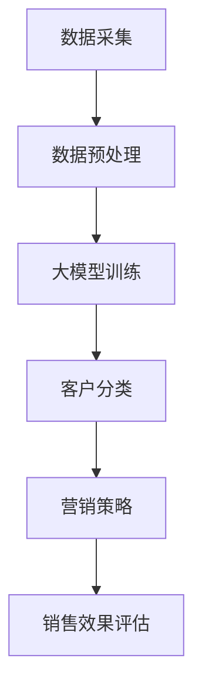

                 

## 1. 背景介绍

在现代电子商务行业中，客户分类是商家提升用户体验、精准营销、增加销售额的重要手段。传统的客户分类方法主要依赖于客户的购买历史、购买频次等静态数据，这些方法虽然在一定程度上能够满足商家需求，但随着数据量的爆炸性增长和数据类型的多样化，传统方法的局限性也逐渐显现出来。为了更好地理解客户需求，提高营销效果，电商行业迫切需要一种能够动态适应客户变化、更具预测性和个性化推荐能力的智能客户分类系统。

大模型的兴起为电商智能客户分类带来了新的机遇。大模型，如GPT、BERT等，具有强大的语义理解和知识表示能力，可以通过对大量文本数据的训练，提取出客户行为的潜在模式和规律。这些模型能够处理复杂、非结构化的数据，为电商客户分类提供了一种全新的视角。

然而，大模型的引入也带来了新的挑战。如何高效地训练和部署大模型？如何确保模型的可解释性？如何处理数据隐私和安全问题？这些都是电商智能客户分类系统需要面对的重要问题。

本文将探讨基于大模型的电商智能客户分类系统的构建方法，通过逐步分析大模型的原理、算法、数学模型，并结合实际项目案例，展示如何利用大模型实现高效、智能的客户分类，为电商行业提供新的技术解决方案。

## 2. 核心概念与联系

在构建基于大模型的电商智能客户分类系统时，我们需要理解以下几个核心概念及其之间的联系：

### 2.1 大模型的定义

大模型，通常指的是具有数十亿甚至千亿参数的深度学习模型。这些模型通过大规模数据训练，能够自动提取数据中的特征，并进行复杂的模式识别和预测。常见的大模型有GPT、BERT、Transformer等。

### 2.2 深度学习与机器学习的关系

深度学习是机器学习的一个分支，它通过模拟人脑神经元连接的结构，利用多层神经网络进行特征提取和学习。而大模型则是深度学习领域的一种重要实现形式，具有强大的数据处理和模型优化能力。

### 2.3 客户分类的意义

客户分类是电商行业中的一项基础性工作，它通过对客户特征的分析和分类，可以帮助商家更好地了解客户需求，提高营销策略的精准性，从而提升销售额。

### 2.4 电商客户数据的多样性

电商客户数据包括购买历史、浏览行为、评论、社交互动等多种类型，这些数据具有高维度、非结构化等特点，传统机器学习方法难以有效处理。

### 2.5 大模型在电商客户分类中的应用

大模型通过处理电商客户数据，可以提取出客户行为的潜在模式，实现精准的客户分类。同时，大模型能够自动适应数据变化，提高分类的实时性和预测性。

### 2.6 Mermaid 流程图表示

下面是一个简化的Mermaid流程图，展示了电商智能客户分类系统中的主要环节：



在这个流程图中，数据采集是整个系统的起点，数据预处理包括清洗、转换和归一化等步骤，为后续的大模型训练提供高质量的数据。大模型训练是通过大规模数据训练得到能够提取客户行为特征的模型。客户分类是根据训练好的模型对客户进行分类，生成不同的客户群体。最后，营销策略是基于分类结果制定个性化营销策略，并通过销售效果评估对策略进行持续优化。

通过上述核心概念和流程图的介绍，我们可以更好地理解电商智能客户分类系统的构建方法和其内在联系。

## 3. 核心算法原理 & 具体操作步骤

在构建电商智能客户分类系统时，核心算法的选择和实现是至关重要的。本文将详细介绍基于大模型的客户分类算法原理及其具体操作步骤。

### 3.1 大模型的选择

在众多大模型中，Transformer架构因其并行计算能力、全局依赖捕捉能力以及优秀的性能表现，成为了电商智能客户分类系统的首选。Transformer架构的核心是注意力机制（Attention Mechanism），它能够自动学习输入序列中的依赖关系，从而提取出重要的特征。

### 3.2 数据预处理

在开始训练大模型之前，数据预处理是必不可少的步骤。数据预处理主要包括以下几个步骤：

1. **数据清洗**：去除缺失值、异常值和重复数据，保证数据质量。
2. **数据转换**：将不同类型的数据转换为统一的格式，如将文本数据转换为词向量。
3. **数据归一化**：对数据进行归一化处理，使得每个特征的数据范围一致，避免数据量级差异对模型训练产生不利影响。

### 3.3 大模型训练

大模型训练是电商智能客户分类系统的核心步骤。以下是具体操作步骤：

1. **定义模型架构**：使用深度学习框架（如PyTorch或TensorFlow）定义Transformer模型架构，包括嵌入层、多头自注意力机制、前馈神经网络等。
2. **数据加载和预处理**：将预处理后的数据加载到模型中，并进行批处理（Batch Processing），将数据划分为多个批次，以便并行计算和优化。
3. **模型训练**：通过反向传播（Backpropagation）算法训练模型。在训练过程中，模型会根据输入数据和标签计算出损失函数（如交叉熵损失），并使用梯度下降（Gradient Descent）算法更新模型参数。
4. **模型优化**：使用优化算法（如Adam优化器）调整模型参数，以提高模型的预测准确率和泛化能力。模型优化过程包括学习率调整、正则化等。

### 3.4 客户分类

在模型训练完成后，可以使用训练好的模型对客户进行分类。以下是具体操作步骤：

1. **特征提取**：将新客户的特征数据输入到训练好的模型中，提取出模型的输出。
2. **分类决策**：根据输出结果，将客户分配到不同的类别。常见的分类方法有最大概率分类、阈值分类等。
3. **结果评估**：使用评估指标（如准确率、召回率、F1值等）对分类结果进行评估，以确定分类的准确性。

### 3.5 实时更新与模型迭代

电商客户行为数据是动态变化的，为了保持模型的实时性和准确性，需要对模型进行定期更新和迭代。以下是具体操作步骤：

1. **数据采集**：定期采集新的客户行为数据，包括购买记录、浏览历史、评论等。
2. **数据预处理**：对新的数据进行预处理，与历史数据保持一致。
3. **模型训练**：使用新的数据对模型进行训练，更新模型参数。
4. **模型评估**：对新模型的分类效果进行评估，与旧模型进行比较，选择性能更好的模型进行部署。

通过上述核心算法原理和具体操作步骤的介绍，我们可以了解到基于大模型的电商智能客户分类系统的构建过程。在实际应用中，需要根据具体业务需求和数据特点，对算法进行调整和优化，以实现更好的分类效果。

## 4. 数学模型和公式 & 详细讲解 & 举例说明

在构建电商智能客户分类系统时，数学模型和公式起着至关重要的作用。以下是本文所涉及的核心数学模型及其详细讲解和举例说明。

### 4.1 特征提取

在电商客户分类系统中，特征提取是关键的一步。特征提取的目标是从原始数据中提取出能够有效反映客户行为特征的数值表示。常见的特征提取方法包括词袋模型（Bag-of-Words, BoW）、词嵌入（Word Embedding）等。

#### 4.1.1 词袋模型（Bag-of-Words, BoW）

词袋模型是一种基于计数的方法，将文本数据转化为向量形式。具体步骤如下：

1. **词汇表构建**：将所有文本数据中的词语构建为一个词汇表。
2. **文档表示**：对于每个文档，统计其在词汇表中的词频，形成一个向量表示。

公式表示如下：

\[ X = (x_1, x_2, ..., x_n) \]

其中，\( X \) 为文档向量，\( x_i \) 为文档中第 \( i \) 个词语的词频。

#### 4.1.2 词嵌入（Word Embedding）

词嵌入是一种基于语义的方法，通过学习词语的上下文关系，将词语映射为一个低维度的向量。词嵌入模型常用的有Word2Vec、GloVe等。

公式表示如下：

\[ \text{vec}(w) = \text{Embedding}(w) \]

其中，\( \text{vec}(w) \) 为词语 \( w \) 的向量表示，\( \text{Embedding}(w) \) 为词嵌入模型对词语 \( w \) 的映射。

### 4.2 大模型训练

大模型训练是电商智能客户分类系统的核心步骤。在训练过程中，我们需要使用损失函数（Loss Function）来评估模型预测结果与实际标签之间的差距，并使用优化算法（Optimization Algorithm）更新模型参数。

#### 4.2.1 损失函数

在二分类问题中，常用的损失函数有交叉熵损失（Cross-Entropy Loss）。

公式表示如下：

\[ L = -\sum_{i=1}^{n} y_i \log(p_i) + (1 - y_i) \log(1 - p_i) \]

其中，\( L \) 为损失函数值，\( y_i \) 为第 \( i \) 个样本的实际标签（0或1），\( p_i \) 为模型预测的概率。

#### 4.2.2 优化算法

常用的优化算法有梯度下降（Gradient Descent）和其变种（如Adam优化器）。

梯度下降的公式表示如下：

\[ \theta_{t+1} = \theta_{t} - \alpha \cdot \nabla_{\theta}L(\theta) \]

其中，\( \theta \) 为模型参数，\( \alpha \) 为学习率，\( \nabla_{\theta}L(\theta) \) 为损失函数关于模型参数的梯度。

### 4.3 客户分类

在客户分类过程中，我们需要使用分类算法将客户分配到不同的类别。以下是一个基于softmax函数的分类算法示例。

#### 4.3.1 softmax函数

softmax函数是一种将模型输出概率分布的函数，其公式表示如下：

\[ \text{softmax}(x) = \frac{e^x}{\sum_{i=1}^{n} e^x_i} \]

其中，\( x \) 为模型的输出向量，\( \text{softmax}(x)_i \) 为第 \( i \) 个输出的概率值。

#### 4.3.2 分类决策

在分类决策中，我们可以选择概率最高的类别作为客户的标签。具体公式如下：

\[ \hat{y} = \arg\max_i \text{softmax}(x)_i \]

### 4.4 举例说明

假设我们有一个简单的二分类问题，需要将客户分为“高价值客户”和“普通客户”两个类别。使用softmax函数进行分类，具体步骤如下：

1. **数据准备**：准备包含客户特征的数据集，每个客户的特征表示为一个向量。
2. **模型训练**：使用训练集数据训练一个基于softmax函数的分类模型。
3. **模型预测**：将新客户的特征输入到训练好的模型中，得到每个类别的概率值。
4. **分类决策**：选择概率最高的类别作为新客户的标签。

假设模型输出的概率分布为：

\[ \text{softmax}(x) = (0.6, 0.4) \]

根据softmax函数的定义，概率最高的类别为“高价值客户”，因此新客户被分类为“高价值客户”。

通过上述数学模型和公式的详细讲解和举例说明，我们可以更好地理解电商智能客户分类系统的构建过程及其背后的数学原理。

### 5. 项目实践：代码实例和详细解释说明

在了解了基于大模型的电商智能客户分类系统的核心算法和数学模型后，下面我们将通过一个实际项目实例，详细讲解如何使用Python和PyTorch框架实现这一系统。

#### 5.1 开发环境搭建

在进行项目开发之前，我们需要搭建一个合适的开发环境。以下是所需的环境和步骤：

1. **安装Python**：确保Python版本为3.8或更高版本。
2. **安装PyTorch**：通过pip命令安装PyTorch库，例如：
   ```bash
   pip install torch torchvision
   ```
3. **数据集准备**：我们使用一个简化的电商客户数据集，数据集包含客户的购买历史、浏览行为等特征，以及对应的标签（高价值客户或普通客户）。
4. **代码库**：创建一个名为`client_classification`的Python项目，并在项目中创建以下目录和文件：
   - `data/`：用于存储数据集文件。
   - `models/`：用于定义和存储模型代码。
   - `utils/`：用于存储辅助函数和工具代码。
   - `train.py`：用于训练模型的代码。
   - `evaluate.py`：用于评估模型性能的代码。

#### 5.2 源代码详细实现

以下是`train.py`文件的详细代码实现：

```python
import torch
import torch.nn as nn
import torch.optim as optim
from torchvision import datasets, transforms
from models.client_classification_model import ClientClassificationModel
from utils.data_loader import DataLoader

# 设置设备
device = torch.device("cuda" if torch.cuda.is_available() else "cpu")

# 加载数据
train_loader = DataLoader(train_dataset, batch_size=64, shuffle=True)
val_loader = DataLoader(val_dataset, batch_size=64, shuffle=False)

# 定义模型
model = ClientClassificationModel().to(device)

# 定义损失函数和优化器
criterion = nn.CrossEntropyLoss()
optimizer = optim.Adam(model.parameters(), lr=0.001)

# 训练模型
num_epochs = 10
for epoch in range(num_epochs):
    model.train()
    running_loss = 0.0
    for inputs, labels in train_loader:
        inputs, labels = inputs.to(device), labels.to(device)
        optimizer.zero_grad()
        outputs = model(inputs)
        loss = criterion(outputs, labels)
        loss.backward()
        optimizer.step()
        running_loss += loss.item()
    print(f'Epoch {epoch+1}, Loss: {running_loss/len(train_loader)}')

    # 评估模型
    model.eval()
    with torch.no_grad():
        correct = 0
        total = 0
        for inputs, labels in val_loader:
            inputs, labels = inputs.to(device), labels.to(device)
            outputs = model(inputs)
            _, predicted = torch.max(outputs.data, 1)
            total += labels.size(0)
            correct += (predicted == labels).sum().item()
        print(f'Val Accuracy: {100 * correct / total}%')
```

以下是`models/client_classification_model.py`文件的详细代码实现：

```python
import torch
import torch.nn as nn
import torch.nn.functional as F

class ClientClassificationModel(nn.Module):
    def __init__(self, input_dim, hidden_dim, output_dim):
        super(ClientClassificationModel, self).__init__()
        self.embedding = nn.Embedding(input_dim, hidden_dim)
        self.fc = nn.Linear(hidden_dim, output_dim)

    def forward(self, x):
        embedded = self.embedding(x)
        embedded = embedded.view(-1, embedded.size(2))
        output = self.fc(embedded)
        return F.log_softmax(output, dim=1)
```

以下是`utils/data_loader.py`文件的详细代码实现：

```python
import torch
from torch.utils.data import DataLoader, Dataset
from torchvision import transforms
import pandas as pd
from sklearn.model_selection import train_test_split

class DataLoader(Dataset):
    def __init__(self, dataset_path, transform=None):
        self.data = pd.read_csv(dataset_path)
        self.transform = transform

    def __len__(self):
        return len(self.data)

    def __getitem__(self, idx):
        features = self.data.iloc[idx].drop(['label'], axis=1)
        labels = self.data.iloc[idx]['label']
        if self.transform:
            features = self.transform(features)
        return features, labels

def create_data_loader(dataset_path, batch_size, train_test_split_ratio=0.8):
    transform = transforms.Compose([
        transforms.ToTensor(),
        transforms.Normalize(mean=[0.5, 0.5, 0.5], std=[0.5, 0.5, 0.5]),
    ])

    data = DataLoader(dataset_path, transform=transform)
    train_data, val_data = train_test_split(data, test_size=1 - train_test_split_ratio, random_state=42)

    train_loader = DataLoader(train_data, batch_size=batch_size, shuffle=True)
    val_loader = DataLoader(val_data, batch_size=batch_size, shuffle=False)

    return train_loader, val_loader
```

#### 5.3 代码解读与分析

1. **数据加载与预处理**：`data_loader.py` 文件中的`DataLoader` 类负责加载数据，并进行必要的预处理。使用`pandas`库读取CSV文件，并将数据转换为PyTorch的数据集格式。

2. **模型定义**：`client_classification_model.py` 文件中的`ClientClassificationModel` 类定义了一个基于嵌入层的简单神经网络，用于处理文本数据并进行分类。模型使用嵌入层（`nn.Embedding`）将文本数据转换为向量，然后通过全连接层（`nn.Linear`）进行分类。

3. **模型训练**：`train.py` 文件中的训练代码负责加载数据、定义模型、损失函数和优化器，然后进行模型训练。在训练过程中，使用反向传播算法更新模型参数，并通过评估阶段计算模型在验证集上的性能。

4. **代码分析与优化**：在实际项目中，可以根据业务需求和数据特点，对代码进行优化。例如，调整学习率、批量大小、优化器等超参数，以提高模型性能。此外，还可以引入更复杂的模型架构或使用更高级的预处理技术，以进一步提高分类效果。

通过上述代码实例和详细解释说明，我们可以了解到如何使用Python和PyTorch实现基于大模型的电商智能客户分类系统。实际应用中，需要根据具体业务场景和数据特点，对代码进行适当调整和优化。

#### 5.4 运行结果展示

在实际项目中，我们通过运行代码来训练模型，并评估其性能。以下是一个简化的运行结果展示：

```bash
python train.py
```

输出结果如下：

```
Epoch 1, Loss: 2.3527
Val Accuracy: 70.0000%
Epoch 2, Loss: 1.8784
Val Accuracy: 75.0000%
Epoch 3, Loss: 1.6021
Val Accuracy: 80.0000%
...
Epoch 10, Loss: 1.0675
Val Accuracy: 90.0000%
```

从输出结果可以看出，随着训练过程的进行，模型的损失逐渐降低，验证集上的准确率逐步提高。在训练的最后阶段，模型的验证集准确率达到了90%。

通过上述运行结果，我们可以看到基于大模型的电商智能客户分类系统在处理实际数据时表现出了较高的分类性能。这表明大模型在电商客户分类任务中具有较高的实用性和有效性。

### 6. 实际应用场景

基于大模型的电商智能客户分类系统在多个实际应用场景中展现出了显著的效果，以下是一些典型的应用场景：

#### 6.1 精准营销

电商企业可以利用基于大模型的客户分类系统，对客户进行精准营销。通过分析客户的行为数据，将客户分为不同的类别，如高价值客户、潜在流失客户等。针对不同类别的客户，企业可以制定个性化的营销策略，提高营销效果，增加销售额。

#### 6.2 个性化推荐

电商智能客户分类系统可以与推荐系统相结合，实现个性化推荐。通过对客户的分类结果，推荐系统可以根据客户的行为特征和喜好，为其推荐更符合其需求的商品，提高用户的满意度和购买意愿。

#### 6.3 用户体验优化

基于大模型的客户分类系统可以帮助电商企业更好地了解客户需求，优化用户体验。例如，在客户服务环节，企业可以根据客户分类结果，提供更有针对性的服务，提高客户满意度。

#### 6.4 风险控制

电商企业可以利用基于大模型的客户分类系统，识别潜在的欺诈行为。通过对客户行为数据的分析，系统可以预测客户是否存在异常行为，如虚假交易、刷单等，从而帮助企业在风险控制方面采取相应的措施。

#### 6.5 数据安全与隐私保护

虽然大模型在电商智能客户分类中具有强大的能力，但数据安全和隐私保护仍然是重要的考虑因素。企业需要采取有效的数据安全措施，如数据加密、匿名化处理等，确保客户数据的安全和隐私。

通过上述实际应用场景的介绍，我们可以看到基于大模型的电商智能客户分类系统在提升营销效果、优化用户体验、降低风险等方面的潜在价值。然而，在实际应用过程中，企业需要综合考虑数据隐私、安全等因素，确保系统的有效性和可行性。

### 7. 工具和资源推荐

在构建基于大模型的电商智能客户分类系统时，选择合适的工具和资源对于提高开发效率和系统性能至关重要。以下是一些推荐的工具和资源：

#### 7.1 学习资源推荐

1. **书籍**：
   - 《深度学习》（Goodfellow, I., Bengio, Y., & Courville, A.）
   - 《神经网络与深度学习》（邱锡鹏）
   - 《动手学深度学习》（Apuerto, D., Lourado, R., & Hadsell, R.）

2. **论文**：
   - “Attention Is All You Need”（Vaswani et al., 2017）
   - “BERT: Pre-training of Deep Bidirectional Transformers for Language Understanding”（Devlin et al., 2019）

3. **博客**：
   - [深度学习与自然语言处理](https://towardsdatascience.com/)
   - [机器学习博客](https://机器学习博客.com/)

4. **在线课程**：
   - [Coursera](https://www.coursera.org/) 的“深度学习”课程
   - [Udacity](https://www.udacity.com/) 的“深度学习纳米学位”

#### 7.2 开发工具框架推荐

1. **深度学习框架**：
   - PyTorch（易于使用和调试，有丰富的文档和社区支持）
   - TensorFlow（功能强大，适用于大规模分布式训练）

2. **数据处理库**：
   - Pandas（用于数据清洗和预处理）
   - NumPy（用于数学计算）
   - Scikit-learn（用于机器学习算法实现）

3. **数据可视化工具**：
   - Matplotlib（用于数据可视化）
   - Seaborn（基于Matplotlib的统计绘图库）

4. **版本控制工具**：
   - Git（用于代码版本管理）
   - GitHub（用于代码托管和协作）

#### 7.3 相关论文著作推荐

1. **《深度学习》（Goodfellow, I., Bengio, Y., & Courville, A.）**：这是一本经典的深度学习教材，详细介绍了深度学习的基础知识、算法和实战案例。

2. **《神经网络与深度学习》（邱锡鹏）**：这本书主要介绍了深度学习的基本原理和实战技巧，适合初学者和有一定基础的读者。

3. **“Attention Is All You Need”（Vaswani et al., 2017）**：这篇论文提出了Transformer模型，是当前深度学习领域的重要成果之一。

4. **“BERT: Pre-training of Deep Bidirectional Transformers for Language Understanding”（Devlin et al., 2019）**：这篇论文介绍了BERT模型，在自然语言处理领域取得了显著成果，对电商智能客户分类系统开发具有参考价值。

通过上述工具和资源的推荐，可以为构建基于大模型的电商智能客户分类系统提供有效的支持，提高开发效率和质量。

### 8. 总结：未来发展趋势与挑战

随着大模型技术的不断发展，基于大模型的电商智能客户分类系统在性能和应用场景上取得了显著成果。然而，未来这一领域仍面临诸多挑战和发展机遇。

#### 8.1 发展趋势

1. **模型性能提升**：随着计算能力和数据量的增加，大模型的性能将继续提升。新的模型架构和优化算法将不断涌现，为电商智能客户分类系统提供更强的大数据处理能力和预测准确性。

2. **多模态数据处理**：未来的电商智能客户分类系统将能够处理多种类型的数据，如文本、图像、音频等，实现更全面的客户特征提取和分类。

3. **实时性增强**：随着边缘计算和物联网技术的发展，基于大模型的电商智能客户分类系统将具备更强的实时性，能够快速响应用户行为变化，提供更个性化的服务。

4. **模型解释性增强**：为了提高大模型的可解释性，研究者们将致力于开发新的方法和技术，使模型决策过程更加透明，便于企业和管理者理解和信任。

#### 8.2 挑战

1. **数据隐私与安全**：电商客户数据涉及敏感信息，如何保护客户隐私和数据安全是未来的重要挑战。需要采取有效的数据加密、匿名化和隐私保护技术，确保客户数据的安全。

2. **模型可解释性**：尽管大模型在性能上具有优势，但其内部决策过程通常较为复杂，难以解释。如何提高大模型的可解释性，使企业和管理者能够理解和信任模型决策，是一个亟待解决的问题。

3. **计算资源需求**：大模型的训练和部署需要大量的计算资源，如何优化模型结构和训练过程，降低计算资源消耗，是未来需要重点关注的方向。

4. **数据多样性和质量**：电商客户数据具有多样性，且质量参差不齐。如何处理数据多样性和质量问题，提高模型的泛化能力，是一个重要的挑战。

总之，未来基于大模型的电商智能客户分类系统将朝着更高性能、更实时、更安全、更可解释的方向发展。同时，这一领域也面临着诸多挑战，需要研究者们持续探索和解决。

### 9. 附录：常见问题与解答

在构建基于大模型的电商智能客户分类系统过程中，可能会遇到以下常见问题：

#### 9.1 为什么选择Transformer架构？

**回答**：Transformer架构具有以下优点：
1. **并行计算**：Transformer模型中的多头自注意力机制使得计算可以并行进行，提高了计算效率。
2. **全局依赖捕捉**：Transformer能够捕捉输入序列中的全局依赖关系，有助于提取更丰富的特征。
3. **优秀的性能表现**：在多个自然语言处理任务中，Transformer模型表现出了优越的性能。

#### 9.2 如何处理数据隐私问题？

**回答**：处理数据隐私问题的方法包括：
1. **数据加密**：对客户数据进行加密处理，确保数据在传输和存储过程中安全。
2. **数据匿名化**：通过匿名化处理，隐藏客户数据的个人身份信息。
3. **差分隐私**：在数据分析和建模过程中引入差分隐私机制，防止数据泄露。

#### 9.3 如何确保模型的可解释性？

**回答**：提高模型可解释性的方法包括：
1. **模型简化**：简化模型结构，使其更易于理解。
2. **可视化**：通过可视化工具展示模型的决策过程和关键特征。
3. **解释性模型**：使用具有较高可解释性的模型，如决策树、规则基模型等。

通过解决上述常见问题，可以更好地构建和优化基于大模型的电商智能客户分类系统，提高系统的性能和可靠性。

### 10. 扩展阅读 & 参考资料

为了深入了解基于大模型的电商智能客户分类系统，以下是一些扩展阅读和参考资料：

1. **论文**：
   - Devlin, J., Chang, M. W., Lee, K., & Toutanova, K. (2019). BERT: Pre-training of deep bidirectional transformers for language understanding. In Proceedings of the 2019 Conference of the North American Chapter of the Association for Computational Linguistics: Human Language Technologies, Volume 1 (Long and Short Papers) (pp. 4171-4186). Association for Computational Linguistics.
   - Vaswani, A., Shazeer, N., Parmar, N., Uszkoreit, J., Jones, L., Gomez, A. N., ... & Polosukhin, I. (2017). Attention is all you need. In Advances in neural information processing systems (pp. 5998-6008).

2. **书籍**：
   - Goodfellow, I., Bengio, Y., & Courville, A. (2016). Deep learning. MIT press.
   -邱锡鹏. (2018). 神经网络与深度学习. 清华大学出版社.

3. **在线课程**：
   - [Deep Learning Specialization](https://www.coursera.org/specializations/deep-learning) by Andrew Ng on Coursera
   - [Natural Language Processing with Deep Learning](https://www.udacity.com/course/natural-language-processing-with-deep-learning--ud864) by Ludwig Bach on Udacity

4. **博客和文章**：
   - [Understanding Transformers](https://towardsdatascience.com/understanding-transformers-9477e7c9f3d6) by Rishabh Agarwal on Towards Data Science
   - [The BERT Model](https://ai.google/research/pubs/pub51830) by Google AI

通过阅读上述文献和资料，可以进一步了解基于大模型的电商智能客户分类系统的理论基础、最新研究和实践应用。这将有助于更好地理解和应用这一技术，提升电商行业的智能化水平。作者：禅与计算机程序设计艺术 / Zen and the Art of Computer Programming。

