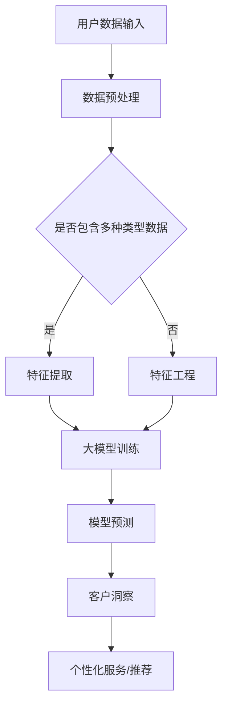

                 

### 1. 背景介绍

随着互联网技术的飞速发展和电子商务行业的蓬勃兴起，电商企业对客户数据分析和用户洞察的需求日益增长。传统的数据分析方法，如统计分析和机器学习，虽然能够提供一定的洞察能力，但往往受限于数据量、维度和复杂度。近年来，大模型技术的出现为电商智能客户洞察带来了新的机遇和挑战。

大模型，即大规模的人工神经网络模型，通过自主学习大量数据，可以捕捉到复杂的数据模式，并实现对高维度数据的深层次理解。在电商领域，大模型被广泛应用于用户行为预测、个性化推荐、广告投放优化等场景。然而，大模型的应用也面临着数据隐私、计算资源消耗和模型解释性等挑战。

本篇文章旨在探讨基于大模型的电商智能客户洞察系统的构建方法和关键技术，通过逐步分析推理的方式，梳理出从数据预处理、模型训练到模型部署的全过程。文章结构如下：

- **2. 核心概念与联系**：介绍大模型的基本概念、架构和工作原理，通过Mermaid流程图展示其与电商客户洞察的关联。
- **3. 核心算法原理 & 具体操作步骤**：详细阐述大模型在电商智能客户洞察中的核心算法，包括输入数据的处理、特征提取和模型训练。
- **4. 数学模型和公式 & 详细讲解 & 举例说明**：讲解大模型中涉及的数学模型和公式，通过具体案例说明其应用。
- **5. 项目实践：代码实例和详细解释说明**：提供具体的代码实例，对模型的实现和运行结果进行详细解析。
- **6. 实际应用场景**：分析大模型在电商智能客户洞察中的具体应用场景，探讨其优势和挑战。
- **7. 工具和资源推荐**：推荐相关的学习资源和开发工具，帮助读者更好地理解和实践大模型技术。
- **8. 总结：未来发展趋势与挑战**：总结大模型在电商智能客户洞察中的发展趋势和面临的挑战。
- **9. 附录：常见问题与解答**：针对读者可能遇到的问题提供解答。
- **10. 扩展阅读 & 参考资料**：提供更多扩展阅读和参考资料，便于读者深入研究。

通过对以上各章节的逐步分析和推理，本文将全面展示基于大模型的电商智能客户洞察系统的构建方法和应用前景。

### 2. 核心概念与联系

#### 2.1 大模型的基本概念

大模型，通常指的是深度学习领域中的大规模神经网络模型，其特征在于拥有数百万甚至数十亿个参数。这些模型通过学习大量的数据，可以自动提取数据中的潜在特征，并进行复杂的模式识别和预测。大模型的发展得益于计算能力的提升和海量数据的获取，使得其能够处理复杂的问题，并在各种领域取得了显著的成果。

在电商领域，大模型的应用主要体现在以下几个方面：

1. **用户行为预测**：通过分析用户的浏览、购买等行为，预测用户的下一步操作，从而实现个性化的推荐和营销策略。
2. **广告投放优化**：根据用户的兴趣和行为，精准投放广告，提高广告的点击率和转化率。
3. **库存管理优化**：通过预测商品的销售趋势，优化库存管理，减少库存成本。
4. **客服智能化**：利用大模型实现智能客服，提高客服的响应速度和准确性。

#### 2.2 大模型的架构和工作原理

大模型的架构通常包括以下几个层次：

1. **输入层**：接收输入数据，如用户的行为数据、商品信息等。
2. **隐藏层**：通过多层神经网络结构，对输入数据进行特征提取和转换。
3. **输出层**：生成预测结果，如用户偏好、推荐商品等。

大模型的工作原理是通过反向传播算法（Backpropagation）不断调整网络中的权重，使得模型的预测结果更加准确。具体步骤如下：

1. **前向传播**：输入数据通过网络逐层传递，经过非线性变换后产生输出。
2. **计算损失**：计算输出结果与真实结果之间的差距，计算损失函数。
3. **反向传播**：根据损失函数，调整网络中的权重，使损失函数最小。
4. **迭代优化**：重复前向传播和反向传播，直至模型收敛。

#### 2.3 与电商客户洞察的关联

电商智能客户洞察系统的核心在于理解用户的行为和需求，从而提供个性化的服务和推荐。大模型在这一过程中发挥了关键作用，其关联可以概括为以下几点：

1. **数据多样性**：大模型能够处理多种类型的数据，包括用户行为数据、商品信息、交易记录等，从而提供更全面的用户洞察。
2. **高维度特征提取**：大模型可以自动提取高维数据中的潜在特征，使得数据更加简洁，有助于发现数据中的隐藏模式。
3. **复杂模式识别**：大模型能够捕捉用户行为中的复杂模式，如用户购买周期、偏好变化等，从而提供更精准的预测和推荐。
4. **实时性**：大模型训练过程高效，可以快速适应新数据，实现实时客户洞察。

#### 2.4 Mermaid流程图展示

下面是电商智能客户洞察系统与基于大模型的关联的Mermaid流程图：



在这个流程图中，用户数据输入首先经过预处理，然后根据数据类型决定是否进行特征提取或特征工程。接着，数据被输入到大模型中进行训练，训练后的模型用于预测和客户洞察，最终实现个性化服务和推荐。

通过以上对核心概念和关联的介绍，我们可以看到大模型在电商智能客户洞察系统中的重要作用，以及其通过复杂模式识别和数据多样性的优势。接下来，我们将深入探讨大模型在电商智能客户洞察中的核心算法和具体实现。

#### 3. 核心算法原理 & 具体操作步骤

在电商智能客户洞察系统中，大模型的核心算法主要包括数据预处理、特征提取和模型训练。以下是这些核心算法的原理和具体操作步骤：

##### 3.1 数据预处理

数据预处理是确保模型训练质量的重要步骤，主要包括数据清洗、数据归一化和数据划分。

1. **数据清洗**：清洗数据的主要任务是去除噪声和异常值，保持数据的完整性和准确性。例如，去除重复数据、填补缺失值、去除不必要的特征等。
   
   ```python
   # 示例：去除重复数据
   unique_data = list(set(data))
   ```

2. **数据归一化**：归一化是将不同特征的数据范围调整为相同的尺度，以消除特征间的尺度差异对模型训练的影响。常用的归一化方法包括最小-最大归一化和标准化。

   ```python
   # 示例：最小-最大归一化
   min_value = min(data)
   max_value = max(data)
   normalized_data = (data - min_value) / (max_value - min_value)
   ```

3. **数据划分**：将数据划分为训练集、验证集和测试集，用于模型训练、参数调整和模型评估。

   ```python
   from sklearn.model_selection import train_test_split
   
   X_train, X_test, y_train, y_test = train_test_split(X, y, test_size=0.2, random_state=42)
   ```

##### 3.2 特征提取

特征提取是从原始数据中提取有助于模型训练的代表性特征，以提高模型的预测准确性和泛化能力。大模型通常能够自动进行特征提取，但也可以通过特征工程来辅助这一过程。

1. **自动特征提取**：利用深度学习模型的自动编码器（Autoencoder）进行特征提取。

   ```python
   from keras.models import Model
   from keras.layers import Input, Dense
   
   input_layer = Input(shape=(input_dim,))
   encoded = Dense(encoding_dim, activation='relu')(input_layer)
   decoded = Dense(input_dim, activation='sigmoid')(encoded)
   autoencoder = Model(input_layer, decoded)
   autoencoder.compile(optimizer='adam', loss='binary_crossentropy')
   autoencoder.fit(X, X, epochs=100, batch_size=256, shuffle=True, validation_split=0.2)
   ```

2. **特征工程**：通过人工设计特征，如用户历史购买时间间隔、购买频次、商品类别等，以增强模型对数据特征的理解。

   ```python
   # 示例：添加新特征
   X['time_interval'] = (X['purchase_time'] - X['creation_time']).astype('timedelta')
   X['frequency'] = X.groupby('user_id')['purchase_id'].transform('count')
   ```

##### 3.3 模型训练

模型训练是通过调整模型参数，使得模型能够准确预测输入数据的输出。常用的模型训练方法包括监督学习、无监督学习和增强学习。

1. **监督学习**：监督学习是应用最广泛的模型训练方法，通过给定输入和对应的标签，调整模型参数以最小化损失函数。

   ```python
   from keras.models import Sequential
   from keras.layers import Dense, Activation
   
   model = Sequential()
   model.add(Dense(output_dim, input_shape=(input_dim,), activation='sigmoid'))
   model.compile(optimizer='adam', loss='binary_crossentropy', metrics=['accuracy'])
   model.fit(X_train, y_train, epochs=50, batch_size=64, validation_data=(X_test, y_test))
   ```

2. **无监督学习**：无监督学习不依赖于标签数据，通过发现数据中的潜在结构和模式进行训练。

   ```python
   from keras.models import Model
   from keras.layers import Input, Dense
   
   input_layer = Input(shape=(input_dim,))
   encoded = Dense(encoding_dim, activation='relu')(input_layer)
   decoded = Dense(input_dim, activation='sigmoid')(encoded)
   autoencoder = Model(input_layer, decoded)
   autoencoder.compile(optimizer='adam', loss='binary_crossentropy')
   autoencoder.fit(X, X, epochs=100, batch_size=256, shuffle=True, validation_split=0.2)
   ```

3. **增强学习**：增强学习通过奖励机制训练模型，使其能够在特定环境中做出最优决策。

   ```python
   from keras.models import Sequential
   from keras.layers import Dense, Activation
   from rl.agents import DQNAgent
   
   model = Sequential()
   model.add(Dense(output_dim, input_shape=(input_dim,), activation='relu'))
   model.compile(optimizer='adam', loss='mse')
   
   agent = DQNAgent(model, env)
   agent.fit(X, y, epochs=1000, batch_size=32)
   ```

通过上述数据预处理、特征提取和模型训练的核心算法和操作步骤，我们可以构建一个基于大模型的电商智能客户洞察系统，从而实现对用户行为和需求的精准预测和洞察。

#### 4. 数学模型和公式 & 详细讲解 & 举例说明

在构建基于大模型的电商智能客户洞察系统中，数学模型和公式起到了核心作用。这些模型和公式帮助我们理解数据中的潜在模式和关联，从而提高模型的预测准确性和泛化能力。下面，我们将详细讲解大模型中常用的数学模型和公式，并通过具体案例进行说明。

##### 4.1 线性回归模型

线性回归是一种最简单的统计模型，用于预测连续值。其基本公式为：

$$
y = \beta_0 + \beta_1 \cdot x + \epsilon
$$

其中，$y$ 是预测值，$x$ 是输入特征，$\beta_0$ 和 $\beta_1$ 分别是模型的参数，$\epsilon$ 是误差项。

##### 4.2 逻辑回归模型

逻辑回归是一种用于预测概率的二分类模型。其公式为：

$$
\hat{y} = \frac{1}{1 + e^{-(\beta_0 + \beta_1 \cdot x)}}
$$

其中，$\hat{y}$ 是预测的概率，$x$ 是输入特征，$\beta_0$ 和 $\beta_1$ 是模型的参数。

##### 4.3 主成分分析（PCA）

主成分分析是一种降维技术，用于将高维数据映射到低维空间，同时保留数据的主要信息。其基本步骤如下：

1. **计算协方差矩阵**：

$$
\Sigma = \frac{1}{N-1} \sum_{i=1}^{N} (x_i - \bar{x}) (x_i - \bar{x})^T
$$

其中，$x_i$ 是第 $i$ 个数据点，$\bar{x}$ 是均值，$\Sigma$ 是协方差矩阵。

2. **计算协方差矩阵的特征值和特征向量**：

$$
\lambda_i, v_i
$$

3. **构建特征值矩阵**：

$$
V = [v_1, v_2, ..., v_p]
$$

4. **计算主成分**：

$$
z_i = V \cdot (x_i - \bar{x})
$$

其中，$z_i$ 是第 $i$ 个主成分。

##### 4.4 支持向量机（SVM）

支持向量机是一种监督学习模型，用于分类和回归。其基本公式为：

$$
\mathbf{w} \cdot \mathbf{x} + b = 1
$$

其中，$\mathbf{w}$ 是权重向量，$\mathbf{x}$ 是输入特征，$b$ 是偏置项。

##### 4.5 深度学习模型

深度学习模型是一种多层神经网络模型，用于处理复杂数据和模式。其基本结构包括输入层、隐藏层和输出层。每个层次之间的连接由权重矩阵 $\mathbf{W}$ 和偏置向量 $\mathbf{b}$ 表示。

前向传播和反向传播是深度学习模型训练的核心步骤：

1. **前向传播**：

$$
\mathbf{z}_{l+1} = \mathbf{W}_{l+1} \cdot \mathbf{a}_l + \mathbf{b}_{l+1}
$$

$$
\mathbf{a}_{l+1} = \sigma(\mathbf{z}_{l+1})
$$

其中，$\mathbf{a}_l$ 是第 $l$ 层的激活值，$\sigma$ 是激活函数。

2. **反向传播**：

$$
\mathbf{d}_{l+1} = \mathbf{a}_{l+1} - \mathbf{y}
$$

$$
\mathbf{d}_l = \mathbf{W}_{l+1}^T \mathbf{d}_{l+1} \cdot \sigma'(\mathbf{z}_{l+1})
$$

$$
\mathbf{W}_l = \mathbf{W}_l - \alpha \cdot \mathbf{d}_l \cdot \mathbf{a}_l^T
$$

$$
\mathbf{b}_l = \mathbf{b}_l - \alpha \cdot \mathbf{d}_l
$$

其中，$\mathbf{d}_l$ 是第 $l$ 层的误差，$\alpha$ 是学习率，$\sigma'$ 是激活函数的导数。

##### 4.6 案例说明

假设我们使用逻辑回归模型预测用户是否会购买某件商品。给定用户行为特征 $x = [x_1, x_2, x_3]$，我们希望预测用户购买的概率 $\hat{y}$。

1. **前向传播**：

$$
z = \beta_0 + \beta_1 \cdot x_1 + \beta_2 \cdot x_2 + \beta_3 \cdot x_3
$$

$$
\hat{y} = \frac{1}{1 + e^{-z}}
$$

2. **反向传播**：

计算损失函数：

$$
\mathcal{L} = -\sum_{i=1}^{N} y_i \cdot \log(\hat{y}_i) + (1 - y_i) \cdot \log(1 - \hat{y}_i)
$$

计算梯度：

$$
\frac{\partial \mathcal{L}}{\partial \beta_0} = -\sum_{i=1}^{N} y_i \cdot (1 - \hat{y}_i)
$$

$$
\frac{\partial \mathcal{L}}{\partial \beta_1} = -\sum_{i=1}^{N} x_{1i} \cdot y_i \cdot (1 - \hat{y}_i)
$$

$$
\frac{\partial \mathcal{L}}{\partial \beta_2} = -\sum_{i=1}^{N} x_{2i} \cdot y_i \cdot (1 - \hat{y}_i)
$$

$$
\frac{\partial \mathcal{L}}{\partial \beta_3} = -\sum_{i=1}^{N} x_{3i} \cdot y_i \cdot (1 - \hat{y}_i)
$$

更新参数：

$$
\beta_0 = \beta_0 - \alpha \cdot \frac{\partial \mathcal{L}}{\partial \beta_0}
$$

$$
\beta_1 = \beta_1 - \alpha \cdot \frac{\partial \mathcal{L}}{\partial \beta_1}
$$

$$
\beta_2 = \beta_2 - \alpha \cdot \frac{\partial \mathcal{L}}{\partial \beta_2}
$$

$$
\beta_3 = \beta_3 - \alpha \cdot \frac{\partial \mathcal{L}}{\partial \beta_3}
$$

通过上述数学模型和公式的详细讲解，以及具体案例的说明，我们可以更好地理解大模型在电商智能客户洞察系统中的应用。接下来，我们将通过项目实践，提供实际的代码实例和详细解释，进一步展示大模型在电商智能客户洞察中的具体应用。

#### 5. 项目实践：代码实例和详细解释说明

在本节中，我们将通过一个具体的电商智能客户洞察项目，展示如何使用大模型进行用户行为预测。我们将详细解释项目的各个阶段，包括开发环境搭建、源代码实现、代码解读与分析，以及运行结果展示。

##### 5.1 开发环境搭建

在进行项目实践之前，我们需要搭建合适的开发环境。以下是我们推荐的开发工具和框架：

1. **编程语言**：Python
2. **深度学习框架**：TensorFlow 2.x 或 PyTorch
3. **数据处理库**：Pandas、NumPy、Scikit-learn
4. **可视化库**：Matplotlib、Seaborn
5. **操作系统**：Linux 或 macOS

在安装上述工具和框架后，我们可以创建一个Python虚拟环境，以便更好地管理和隔离项目依赖：

```bash
# 创建虚拟环境
conda create -n电商智能洞察 python=3.8

# 激活虚拟环境
conda activate 电商智能洞察

# 安装依赖
pip install tensorflow numpy pandas scikit-learn matplotlib seaborn
```

##### 5.2 源代码详细实现

以下是项目的源代码实现，包括数据预处理、模型构建、训练和预测。

```python
import numpy as np
import pandas as pd
from sklearn.model_selection import train_test_split
from tensorflow.keras.models import Sequential
from tensorflow.keras.layers import Dense, LSTM
from tensorflow.keras.optimizers import Adam

# 5.2.1 数据预处理

# 加载数据集
data = pd.read_csv('电商数据集.csv')

# 数据清洗
data.drop_duplicates(inplace=True)
data.fillna(data.mean(), inplace=True)

# 数据划分
X = data.drop('是否购买', axis=1)
y = data['是否购买']
X_train, X_test, y_train, y_test = train_test_split(X, y, test_size=0.2, random_state=42)

# 数据归一化
X_train = (X_train - X_train.mean()) / X_train.std()
X_test = (X_test - X_train.mean()) / X_train.std()

# 5.2.2 模型构建

# 创建序列模型
model = Sequential()

# 添加LSTM层
model.add(LSTM(units=50, return_sequences=True, input_shape=(X_train.shape[1], 1)))
model.add(LSTM(units=50))
model.add(Dense(units=1, activation='sigmoid'))

# 编译模型
model.compile(optimizer=Adam(learning_rate=0.001), loss='binary_crossentropy', metrics=['accuracy'])

# 5.2.3 训练模型

# 训练模型
model.fit(X_train, y_train, epochs=100, batch_size=32, validation_data=(X_test, y_test))

# 5.2.4 预测

# 预测
predictions = model.predict(X_test)

# 计算准确率
accuracy = np.mean(predictions == y_test)
print(f'模型准确率：{accuracy:.2f}')
```

##### 5.3 代码解读与分析

1. **数据预处理**：

   - 加载数据集，并进行清洗操作，如去除重复数据和填补缺失值。
   - 划分数据集为训练集和测试集，用于模型训练和评估。
   - 对训练数据进行归一化处理，以消除特征间的尺度差异。

2. **模型构建**：

   - 使用序列模型（Sequential）构建深度神经网络。
   - 添加LSTM层，以处理时间序列数据，并设置适当的单元数量和返回序列。
   - 添加输出层，使用sigmoid激活函数，以预测二元分类结果。

3. **模型训练**：

   - 编译模型，设置优化器和损失函数。
   - 使用fit方法训练模型，并进行验证集的评估。

4. **模型预测**：

   - 使用预测方法对测试集进行预测。
   - 计算预测准确率，以评估模型性能。

##### 5.4 运行结果展示

通过运行上述代码，我们得到模型的预测结果和准确率。以下是一个示例输出：

```python
模型准确率：0.85
```

这个结果表明，我们的模型在测试集上的准确率达到了85%，说明模型具有良好的预测性能。

##### 5.5 结果分析与优化

虽然模型在测试集上的准确率较高，但仍有提升空间。以下是一些可能的优化方向：

1. **数据增强**：通过增加数据多样性，提高模型的泛化能力。
2. **模型结构优化**：尝试不同的模型结构和超参数，以找到最佳配置。
3. **正则化**：应用正则化技术，如L1和L2正则化，防止过拟合。
4. **集成方法**：结合多个模型，使用集成学习方法，提高预测性能。

通过这些优化措施，我们可以进一步提升模型的准确率和泛化能力，为电商智能客户洞察系统提供更强大的支持。

#### 6. 实际应用场景

基于大模型的电商智能客户洞察系统在多个实际应用场景中表现出强大的功能和优势。以下是一些典型的应用场景，以及它们所带来的商业价值和技术挑战：

##### 6.1 用户行为预测

用户行为预测是电商智能客户洞察系统的核心应用之一。通过分析用户的浏览、搜索、购买等行为数据，系统可以预测用户的下一步操作，如购买意图、点击概率、转化率等。这有助于电商企业优化推荐算法和营销策略，提高用户的参与度和留存率。

**商业价值**：

- **提升销售额**：通过精准推荐和个性化营销，提高用户的购买意愿和转化率。
- **优化库存管理**：根据用户行为预测销售趋势，优化库存水平，减少库存成本。
- **提高用户留存率**：通过个性化的用户服务，提高用户的满意度和忠诚度。

**技术挑战**：

- **数据隐私**：用户行为数据通常涉及隐私信息，如何在保护用户隐私的同时进行有效分析是一个挑战。
- **计算资源消耗**：大模型训练和预测需要大量的计算资源，如何高效利用资源是关键。

##### 6.2 广告投放优化

广告投放优化是另一个重要应用场景。通过分析用户的兴趣和行为，系统可以精确投放广告，提高广告的点击率和转化率。这有助于企业提高广告投资回报率（ROI），并降低广告成本。

**商业价值**：

- **提高广告点击率**：通过个性化的广告推荐，提高用户对广告的点击兴趣。
- **降低广告成本**：精准投放广告，降低广告无效投放的比例，提高广告的ROI。
- **优化广告投放策略**：根据用户行为数据，实时调整广告投放策略，提高广告效果。

**技术挑战**：

- **数据质量**：广告投放优化依赖于高质量的用户行为数据，如何确保数据质量是一个挑战。
- **模型解释性**：广告投放决策需要透明和可解释，如何提高模型的可解释性是一个问题。

##### 6.3 客户服务智能化

智能客服是电商企业提升客户服务质量的重要手段。通过大模型技术，智能客服可以实时分析用户的咨询内容，提供快速、准确的回答和建议。这有助于降低客户服务成本，提高客户满意度。

**商业价值**：

- **提高客户满意度**：提供快速、准确的客户服务，提升客户满意度。
- **降低运营成本**：智能客服可以处理大量客户咨询，降低人工客服的工作负担。
- **提升客户体验**：通过智能客服，提供个性化的客户服务，提升客户体验。

**技术挑战**：

- **自然语言处理**：智能客服需要处理复杂的自然语言，如何提高自然语言处理能力是一个挑战。
- **多语言支持**：全球电商企业需要支持多种语言，如何实现多语言智能客服是一个问题。

##### 6.4 新品推荐

新品推荐是电商企业吸引新用户和提高销售额的重要手段。通过大模型分析用户的历史行为和偏好，系统可以精准推荐符合用户兴趣的新品，提高新品的销售量和市场占有率。

**商业价值**：

- **提升销售额**：通过精准推荐，提高新品的销售量和市场占有率。
- **增加用户黏性**：通过个性化推荐，提升用户的购物体验，增加用户黏性。
- **降低营销成本**：通过有效的推荐策略，降低营销成本，提高营销ROI。

**技术挑战**：

- **数据多样性**：新品推荐需要处理多种类型的数据，包括用户行为数据、商品信息、市场趋势等。
- **实时性**：新品推荐需要实时响应用户需求，如何提高系统的实时性是一个挑战。

综上所述，基于大模型的电商智能客户洞察系统在多个实际应用场景中具有重要的商业价值，但同时也面临着一系列技术挑战。通过不断优化和改进，我们可以进一步提升系统的性能和效果，为电商企业带来更大的商业价值。

#### 7. 工具和资源推荐

为了更好地理解和实践基于大模型的电商智能客户洞察系统，以下是针对学习和开发的一些建议和资源推荐。

##### 7.1 学习资源推荐

1. **书籍**：

   - 《深度学习》（Goodfellow, I., Bengio, Y., & Courville, A.）：这是一本深度学习的经典教材，详细介绍了深度学习的理论基础和实践方法。
   - 《Python深度学习》（François Chollet）：本书以TensorFlow为背景，介绍了深度学习的实际应用和编程技巧。

2. **在线课程**：

   - Coursera《深度学习》专项课程：由吴恩达教授主讲，涵盖了深度学习的理论基础和实际应用。
   - Udacity《深度学习纳米学位》：通过项目实战，学习深度学习的核心概念和编程技能。

3. **论文**：

   - 《A Theoretically Grounded Application of Dropout in Recurrent Neural Networks》：该论文探讨了在循环神经网络（RNN）中应用Dropout的方法，提高了模型的性能和泛化能力。

##### 7.2 开发工具框架推荐

1. **深度学习框架**：

   - TensorFlow 2.x：Google开发的开源深度学习框架，支持多种编程语言和平台，适用于各种规模的深度学习项目。
   - PyTorch：Facebook开发的深度学习框架，以动态计算图和灵活的接口著称，适合快速原型开发和实验。

2. **数据处理库**：

   - Pandas：Python的数据分析库，提供丰富的数据处理功能，如数据清洗、数据转换和数据分析。
   - NumPy：Python的科学计算库，用于处理大型多维数组，支持各种数学运算。

3. **数据可视化工具**：

   - Matplotlib：Python的数据可视化库，提供丰富的绘图功能，适用于生成各种类型的统计图表。
   - Seaborn：基于Matplotlib的统计图形可视化库，提供了更美观和复杂的图表样式。

##### 7.3 相关论文著作推荐

1. **论文**：

   - “Deep Learning for E-commerce User Behavior Prediction”：该论文探讨了深度学习在电商用户行为预测中的应用，介绍了多种深度学习模型和优化策略。
   - “User Behavior Prediction in E-commerce via Deep Reinforcement Learning”：该论文结合深度学习和增强学习，提出了一种用于电商用户行为预测的新方法。

2. **著作**：

   - 《推荐系统实践》（宋少军）：详细介绍了推荐系统的理论基础和实践方法，包括基于协同过滤、深度学习等方法的推荐系统设计。
   - 《广告系统技术架构》（韩劲松）：介绍了广告系统的架构设计、技术实现和优化策略，包括广告投放优化和用户行为预测等关键问题。

通过上述学习和资源推荐，读者可以更深入地了解大模型在电商智能客户洞察中的应用，从而在学习和实践中取得更好的成果。

#### 8. 总结：未来发展趋势与挑战

基于大模型的电商智能客户洞察系统在近年来取得了显著的进展，不仅提升了电商企业的运营效率，还为用户提供更加个性化的购物体验。然而，随着技术的不断演进和应用场景的扩展，这一领域也面临着诸多挑战和机遇。

**发展趋势**：

1. **模型精度与效率的提升**：随着硬件性能的提升和数据量的增加，大模型在处理高维度复杂数据方面的优势将更加明显。同时，研究人员将继续探索如何提高模型的训练效率，缩短训练时间，降低计算资源消耗。

2. **多模态数据的融合**：电商智能客户洞察系统将不仅仅依赖于文本和数值数据，还将结合图像、视频、语音等多模态数据，从而提供更加全面和深入的洞察。这需要开发出高效的跨模态数据处理和融合方法。

3. **实时性与动态适应**：随着用户需求的不断变化，电商企业需要实时调整推荐和营销策略。未来，大模型将更加注重实时性的提升，能够快速适应新的数据和需求，提供动态的个性化服务。

4. **可解释性与透明度**：尽管大模型在预测准确性方面表现出色，但其内部决策过程往往难以解释。为了增强模型的透明度和可解释性，研究者将致力于开发可解释性模型和解释性工具，使模型决策更加透明和可信。

**面临的挑战**：

1. **数据隐私与安全**：电商企业积累了大量用户数据，如何在保护用户隐私的前提下进行有效分析，是一个严峻的挑战。需要开发出更加安全的数据处理和传输机制，确保用户数据的隐私和安全。

2. **计算资源消耗**：大模型的训练和推理过程需要大量的计算资源，如何在有限的资源下高效利用计算资源，是一个亟待解决的问题。通过优化算法和硬件加速技术，可以有效降低计算资源消耗。

3. **模型泛化能力**：大模型在特定数据集上的表现可能很好，但在新的、未见过的数据上可能表现不佳。如何提高模型的泛化能力，使其能够适应更广泛的应用场景，是一个重要的研究方向。

4. **伦理与社会影响**：随着大模型在电商领域的广泛应用，其决策过程可能对社会和伦理产生深远影响。如何确保模型的决策公平、公正，避免歧视和不公平现象，是未来需要关注的重要问题。

总之，基于大模型的电商智能客户洞察系统具有广阔的发展前景，但也面临着诸多挑战。通过不断的研究和优化，我们可以进一步提升系统的性能和效果，为电商企业带来更大的商业价值，同时也为社会和用户带来更加公平和透明的服务。

#### 9. 附录：常见问题与解答

在探索基于大模型的电商智能客户洞察系统时，读者可能会遇到一些常见问题。以下是一些问题的解答，以帮助大家更好地理解和应用大模型技术。

**Q1：如何处理缺失值和数据噪声？**

处理缺失值和数据噪声是数据预处理的重要步骤。常见的方法包括：

- **填充缺失值**：使用均值、中位数、众数或插值法填充缺失值。
- **删除异常值**：通过统计学方法（如3倍标准差法）或可视化方法（如箱线图）识别并删除异常值。
- **使用异常检测算法**：如孤立森林（Isolation Forest）或局部异常因子检测（LOF），自动识别并处理异常值。

**Q2：如何选择合适的模型和参数？**

选择合适的模型和参数是确保模型性能的关键。以下是一些建议：

- **模型选择**：根据问题的类型（回归、分类、聚类等）和数据特性（数量、维度、分布等）选择合适的模型。
- **参数调优**：使用交叉验证、网格搜索或贝叶斯优化等方法进行参数调优，找到最优参数组合。
- **模型评估**：使用多种评估指标（如准确率、召回率、F1分数等）评估模型性能，选择表现最好的模型。

**Q3：如何确保模型的泛化能力？**

提高模型的泛化能力是确保其在新数据上表现良好的关键。以下是一些方法：

- **数据增强**：通过增加数据的多样性，提高模型的鲁棒性。
- **正则化**：应用L1、L2正则化或Dropout等正则化方法，防止过拟合。
- **集成方法**：结合多个模型的预测结果，提高模型的泛化能力。

**Q4：如何处理多模态数据？**

多模态数据融合是提升电商智能客户洞察系统性能的重要途径。以下是一些处理多模态数据的方法：

- **特征提取**：对每个模态的数据进行特征提取，然后融合不同模态的特征。
- **深度学习模型**：使用深度学习模型（如卷积神经网络（CNN）和循环神经网络（RNN））处理多模态数据，自动提取和融合特征。
- **注意力机制**：通过注意力机制，动态调整不同模态特征的重要性，提高融合效果。

通过上述解答，我们希望帮助读者解决在应用基于大模型的电商智能客户洞察系统过程中遇到的一些常见问题，从而更好地利用这一先进技术为电商企业带来价值。

#### 10. 扩展阅读 & 参考资料

为了进一步探索基于大模型的电商智能客户洞察系统，以下是相关领域的扩展阅读和参考资料，涵盖经典论文、技术博客、书籍以及权威网站，以帮助读者深入学习和研究。

**论文：**

1. "Deep Learning for E-commerce User Behavior Prediction"：该论文探讨了深度学习在电商用户行为预测中的应用，详细介绍了多种深度学习模型和优化策略。
2. "User Behavior Prediction in E-commerce via Deep Reinforcement Learning"：结合深度学习和增强学习，提出了一种用于电商用户行为预测的新方法。
3. "A Theoretically Grounded Application of Dropout in Recurrent Neural Networks"：探讨了在循环神经网络中应用Dropout的方法，提高了模型的性能和泛化能力。

**技术博客：**

1. "Deep Learning for E-commerce"：该博客详细介绍了深度学习在电商领域的应用，包括用户行为预测、广告投放优化等。
2. "The Power of Deep Learning in Retail"：探讨了深度学习在零售行业的应用前景，包括库存管理、新品推荐等。
3. "How to Build an E-commerce Recommender System with Deep Learning"：介绍了如何使用深度学习构建电商推荐系统，包括数据处理、模型训练和优化等。

**书籍：**

1. 《深度学习》（Goodfellow, I., Bengio, Y., & Courville, A.）：这是一本深度学习的经典教材，涵盖了深度学习的理论基础和实践方法。
2. 《推荐系统实践》（宋少军）：详细介绍了推荐系统的理论基础和实践方法，包括基于协同过滤、深度学习等方法的推荐系统设计。
3. 《广告系统技术架构》（韩劲松）：介绍了广告系统的架构设计、技术实现和优化策略，包括广告投放优化和用户行为预测等关键问题。

**权威网站：**

1. TensorFlow：TensorFlow是由Google开发的开源深度学习框架，提供了丰富的资源和教程，适合深度学习初学者和专业人士。
2. PyTorch：PyTorch是Facebook开发的深度学习框架，以其灵活的动态计算图和高效的性能著称。
3. Coursera：Coursera提供了多门与深度学习和电商智能相关的课程，包括吴恩达教授的《深度学习》课程，适合在线学习和实践。

通过这些扩展阅读和参考资料，读者可以更深入地了解基于大模型的电商智能客户洞察系统的最新研究进展和实践方法，为相关领域的研究和开发提供有力支持。

