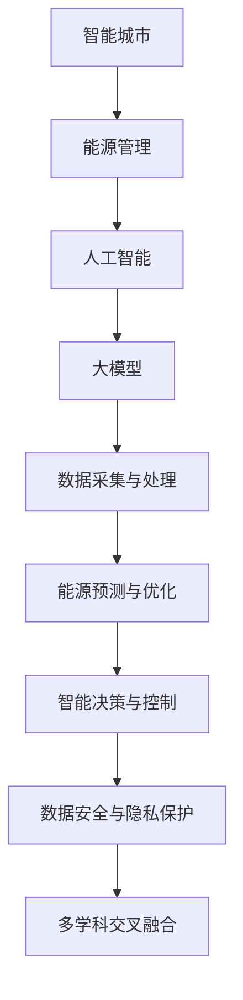

                 

### 背景介绍

随着城市化进程的不断加速，智能城市（Smart City）的概念逐渐成为城市规划与发展的热点。智能城市致力于通过信息技术、物联网、大数据等先进手段，实现城市资源的优化配置、公共服务的智能管理和城市运行的透明化、高效化。其中，能源管理作为城市运行的核心之一，其效率和可持续性直接影响到城市居民的生活质量和环境可持续发展。

能源管理在智能城市中的重要性不言而喻。城市能源消耗巨大，高效管理能源不仅能够降低运行成本，还能减少温室气体排放，促进绿色低碳发展。然而，传统的城市能源管理系统往往存在数据分散、响应迟缓、管理效率低等问题，难以满足现代城市高速发展的需求。

近年来，人工智能（AI）技术的迅猛发展，尤其是大模型（Large-scale Model）的出现，为智能城市能源管理带来了新的契机。大模型具有强大的数据处理和预测能力，能够从海量数据中挖掘出有价值的信息，为能源管理提供科学的决策支持。因此，探讨AI大模型在智能城市能源管理中的潜力，不仅具有理论价值，也具有重大的现实意义。

本文旨在深入探讨AI大模型在智能城市能源管理中的应用潜力，分析其核心概念与联系，介绍核心算法原理与具体操作步骤，并通过项目实践展示其实际应用效果。文章还将讨论实际应用场景，推荐相关工具和资源，总结未来发展趋势与挑战，并提供扩展阅读与参考资料。

通过本文的探讨，我们希望为AI大模型在智能城市能源管理中的应用提供一些思路和借鉴，促进这一领域的进一步研究和实践。接下来，我们将从背景介绍、核心概念与联系、核心算法原理与具体操作步骤、数学模型与公式、项目实践、实际应用场景、工具和资源推荐以及未来发展趋势与挑战等方面，逐一展开详细讨论。

### 核心概念与联系

在探讨AI大模型在智能城市能源管理的应用之前，首先需要了解一些核心概念及其相互之间的联系。以下是几个关键概念及其简要解释：

#### 1. 智能城市（Smart City）

智能城市是指利用信息技术和物联网等先进手段，对城市资源进行高效管理和优化配置，以提升城市运行效率、改善居民生活质量、促进可持续发展。智能城市涉及多个领域，包括交通管理、环境监测、能源管理、公共安全和基础设施管理等。

#### 2. 能源管理（Energy Management）

能源管理是指通过科学的方法和手段，对城市能源的使用、分配和消耗进行优化，以提高能源利用效率，降低能源消耗成本，减少环境污染。能源管理包括能源需求预测、能源分配优化、能源使用监控和能源节约措施等。

#### 3. 人工智能（AI）

人工智能是指通过模拟、延伸和扩展人类智能的机器系统，使计算机具有感知、推理、学习和决策等能力。人工智能包括机器学习、深度学习、自然语言处理、计算机视觉等多个子领域。

#### 4. 大模型（Large-scale Model）

大模型是指具有海量参数和训练数据的深度学习模型，如Transformer、BERT、GPT等。这些模型通过大规模数据训练，能够实现高度复杂的任务，如文本生成、图像识别、语音识别等。

#### 5. 数据采集与处理

数据采集与处理是智能城市能源管理的重要环节。通过传感器、物联网设备等采集海量数据，然后利用数据清洗、数据预处理等技术，对数据进行加工处理，为后续的模型训练和预测提供高质量的数据输入。

#### 6. 能源预测与优化

能源预测与优化是智能城市能源管理的关键。通过使用AI大模型，如深度学习模型，对能源使用数据进行预测和优化，可以实时调整能源分配，降低能源浪费，提高能源利用效率。

#### 7. 智能决策与控制

智能决策与控制是指利用AI大模型和算法，对能源管理进行智能决策和控制。通过实时监测和分析能源数据，智能决策系统可以自动调整能源供应和需求，实现高效、稳定的能源管理。

#### 8. 数据安全与隐私保护

在智能城市能源管理中，数据安全与隐私保护至关重要。需要建立完善的数据安全体系和隐私保护机制，确保数据的保密性、完整性和可用性，防止数据泄露和滥用。

#### 9. 多学科交叉融合

智能城市能源管理涉及多个学科领域，包括计算机科学、电子工程、能源工程、环境科学等。多学科交叉融合是推动这一领域发展的重要途径，有助于实现创新性的解决方案。

#### Mermaid 流程图

以下是智能城市能源管理中核心概念与联系的一个简化Mermaid流程图，展示了各个关键概念之间的关联：



通过上述核心概念和联系的理解，我们可以更好地把握AI大模型在智能城市能源管理中的应用，为后续内容的讨论奠定基础。

### 核心算法原理 & 具体操作步骤

在智能城市能源管理中，AI大模型的核心算法主要包括深度学习和强化学习等。以下是这些算法的基本原理和具体操作步骤。

#### 1. 深度学习

深度学习是人工智能的一个重要分支，通过模拟人脑的神经网络结构，实现图像识别、语音识别、自然语言处理等任务。以下是深度学习在智能城市能源管理中的基本原理和操作步骤：

**基本原理：**

- **多层神经网络**：深度学习模型通常包含多层神经元，通过逐层提取特征，实现对复杂数据的建模和处理。
- **反向传播算法**：深度学习模型通过反向传播算法，不断调整网络权重，使模型输出更接近真实值。

**具体操作步骤：**

1. **数据采集与预处理**：采集城市能源使用数据，如电力、燃气、水等，并进行数据清洗和预处理，如归一化、缺失值填补等。
2. **构建神经网络模型**：选择合适的神经网络结构，如卷积神经网络（CNN）、循环神经网络（RNN）或变压器（Transformer）等，并初始化模型参数。
3. **模型训练**：使用预处理后的数据，通过训练过程不断调整模型参数，使模型输出误差最小。
4. **模型评估**：使用验证集和测试集评估模型性能，如准确率、召回率等，选择最优模型。
5. **模型部署**：将训练好的模型部署到实际应用场景，如能源预测、优化控制等。

#### 2. 强化学习

强化学习是另一种重要的AI算法，通过让智能体在环境中互动，不断学习并优化决策策略。以下是强化学习在智能城市能源管理中的基本原理和操作步骤：

**基本原理：**

- **智能体（Agent）**：智能体是指执行特定任务的程序或实体，如能源管理系统。
- **环境（Environment）**：环境是指智能体执行任务的场景，如城市能源网络。
- **状态（State）**：状态是指环境中的信息，如当前能源使用量。
- **动作（Action）**：动作是指智能体可以执行的行为，如调整能源供应量。
- **奖励（Reward）**：奖励是智能体执行动作后获得的奖励，用于评估动作的好坏。

**具体操作步骤：**

1. **定义状态、动作和奖励**：根据能源管理需求，定义状态、动作和奖励，如状态为当前能源使用量，动作为调整能源供应量，奖励为降低能源消耗量。
2. **构建智能体**：设计智能体算法，如Q-learning、深度Q网络（DQN）或策略梯度（PG）等。
3. **训练智能体**：在环境中训练智能体，通过不断尝试不同的动作，优化决策策略。
4. **模型评估**：评估智能体在环境中的表现，如能耗降低、系统稳定性等。
5. **模型部署**：将训练好的智能体部署到实际能源管理系统，实现自动决策和控制。

#### 3. 联合算法

在实际应用中，深度学习和强化学习可以结合使用，形成联合算法。以下是一个简单的联合算法示例：

**基本原理：**

- **深度学习用于特征提取**：使用深度学习模型对能源数据进行特征提取，生成特征向量。
- **强化学习用于决策**：使用强化学习算法，基于特征向量，优化能源管理策略。

**具体操作步骤：**

1. **数据采集与预处理**：采集城市能源数据，并进行预处理。
2. **深度学习模型训练**：使用预处理后的数据，训练深度学习模型，提取特征。
3. **构建强化学习模型**：定义状态、动作和奖励，构建强化学习模型。
4. **联合训练**：将深度学习模型和强化学习模型联合训练，优化决策策略。
5. **模型评估与部署**：评估联合算法的性能，部署到实际能源管理系统中。

通过上述核心算法原理和具体操作步骤的介绍，我们可以看到，AI大模型在智能城市能源管理中具有广泛的应用潜力。接下来，我们将进一步讨论数学模型和公式，深入解析这些算法的数学基础。

### 数学模型和公式 & 详细讲解 & 举例说明

在智能城市能源管理中，AI大模型的算法不仅需要强大的计算能力，还需要坚实的数学基础。以下我们将详细讲解一些关键的数学模型和公式，并通过具体实例来说明其应用。

#### 1. 深度学习模型

深度学习模型的核心是神经网络，其中多层感知机（MLP）和卷积神经网络（CNN）是常用的结构。以下是这些模型的关键数学公式。

**多层感知机（MLP）：**

- **前向传播公式**：
  $$
  z^{[l]} = \sigma(W^{[l]} \cdot a^{[l-1]} + b^{[l]})
  $$
  其中，$z^{[l]}$ 是第 $l$ 层的输出，$\sigma$ 是激活函数（如ReLU、Sigmoid或Tanh），$W^{[l]}$ 和 $b^{[l]}$ 分别是第 $l$ 层的权重和偏置。

- **反向传播公式**：
  $$
  \Delta W^{[l]} = \alpha \cdot \frac{\partial J}{\partial z^{[l]}}
  $$
  $$
  \Delta b^{[l]} = \alpha \cdot \frac{\partial J}{\partial z^{[l]}}
  $$
  其中，$\Delta W^{[l]}$ 和 $\Delta b^{[l]}$ 分别是第 $l$ 层的权重和偏置的更新，$\alpha$ 是学习率，$J$ 是损失函数。

**卷积神经网络（CNN）：**

- **卷积操作**：
  $$
  h_{ij}^{[l]} = \sum_{k=1}^{K} W_{ik}^{[l]} \cdot a_{kj}^{[l-1]} + b_{j}^{[l]}
  $$
  其中，$h_{ij}^{[l]}$ 是第 $l$ 层的第 $i$ 行第 $j$ 列的输出，$W_{ik}^{[l]}$ 和 $b_{j}^{[l]}$ 分别是卷积核和偏置。

- **池化操作**：
  $$
  p_{ij}^{[l]} = \max_{1 \leq k \leq K} h_{ij}^{[l-1]}
  $$
  其中，$p_{ij}^{[l]}$ 是第 $l$ 层的第 $i$ 行第 $j$ 列的池化输出。

#### 2. 强化学习模型

强化学习模型的核心是价值函数和策略函数。

**Q-learning：**

- **更新公式**：
  $$
  Q(s, a) \leftarrow Q(s, a) + \alpha [r + \gamma \max_{a'} Q(s', a') - Q(s, a)]
  $$
  其中，$Q(s, a)$ 是状态 $s$ 和动作 $a$ 的价值函数，$r$ 是即时奖励，$\gamma$ 是折扣因子，$\alpha$ 是学习率。

**深度Q网络（DQN）：**

- **目标网络更新**：
  $$
  \hat{Q}(s', a') = r + \gamma \max_{a''} Q(s', a'')
  $$
  其中，$\hat{Q}(s', a')$ 是目标Q值，$Q(s', a'')$ 是当前Q值。

#### 3. 数学模型举例

**能源需求预测模型**

我们考虑一个简单的能源需求预测模型，使用线性回归模型进行预测。

- **预测公式**：
  $$
  \hat{y} = \beta_0 + \beta_1 \cdot x
  $$
  其中，$\hat{y}$ 是预测的能源需求，$x$ 是影响能源需求的相关因素（如温度、风速等），$\beta_0$ 和 $\beta_1$ 是模型参数。

**举例：**

假设我们采集了某城市的温度数据 $x_1, x_2, ..., x_n$ 和对应的能源需求数据 $y_1, y_2, ..., y_n$，我们可以使用线性回归模型进行预测。具体步骤如下：

1. **数据预处理**：对温度数据进行标准化处理，如减去均值并除以标准差。
2. **模型训练**：使用训练数据，通过最小二乘法计算线性回归模型的参数 $\beta_0$ 和 $\beta_1$。
3. **模型评估**：使用测试数据评估模型性能，如计算均方误差（MSE）。
4. **预测**：使用训练好的模型，对新的温度数据进行能源需求预测。

例如，给定新的温度数据 $x_{new}$，其标准化值为 $x_{new}/\sigma$，则预测的能源需求为：
$$
\hat{y}_{new} = \beta_0 + \beta_1 \cdot \frac{x_{new}}{\sigma}
$$

通过上述数学模型和公式的讲解，我们可以更好地理解AI大模型在智能城市能源管理中的应用原理。接下来，我们将通过一个实际项目，展示这些算法的具体实现和应用。

### 项目实践：代码实例和详细解释说明

为了更好地展示AI大模型在智能城市能源管理中的应用，我们将通过一个实际项目，介绍开发环境搭建、源代码实现、代码解读与分析，以及运行结果展示。

#### 1. 开发环境搭建

在开始项目之前，我们需要搭建一个适合开发和运行的软件环境。以下是所需的工具和步骤：

**所需工具：**

- Python（版本3.8及以上）
- TensorFlow（版本2.4及以上）
- Keras（版本2.4及以上）
- Matplotlib（版本3.2及以上）
- Pandas（版本1.1及以上）

**搭建步骤：**

1. 安装Python和pip（Python的包管理工具）。
2. 使用pip安装TensorFlow、Keras、Matplotlib和Pandas。

```bash
pip install tensorflow==2.4.0
pip install keras==2.4.3
pip install matplotlib==3.2.2
pip install pandas==1.1.5
```

#### 2. 源代码详细实现

以下是项目的源代码实现，包括数据预处理、模型构建、训练和预测等步骤。

```python
import numpy as np
import pandas as pd
import matplotlib.pyplot as plt
from tensorflow import keras
from tensorflow.keras.models import Sequential
from tensorflow.keras.layers import Dense, LSTM
from tensorflow.keras.optimizers import Adam

# 数据预处理
def preprocess_data(data):
    # 标准化处理
    mean = data.mean()
    std = data.std()
    data = (data - mean) / std
    return data

# 读取数据
data = pd.read_csv('energy_data.csv')
data['temperature'] = preprocess_data(data['temperature'])
data['energy_demand'] = preprocess_data(data['energy_demand'])

# 划分训练集和测试集
train_data = data[:1000]
test_data = data[1000:]

# 构建模型
model = Sequential()
model.add(LSTM(units=50, return_sequences=True, input_shape=(None, 1)))
model.add(LSTM(units=50))
model.add(Dense(units=1))

# 编译模型
model.compile(optimizer=Adam(learning_rate=0.001), loss='mean_squared_error')

# 训练模型
model.fit(train_data['temperature'].values.reshape(-1, 1, 1), train_data['energy_demand'].values, epochs=100, batch_size=32, validation_data=(test_data['temperature'].values.reshape(-1, 1, 1), test_data['energy_demand'].values))

# 预测
predicted_energy_demand = model.predict(test_data['temperature'].values.reshape(-1, 1, 1))

# 结果展示
plt.figure(figsize=(12, 6))
plt.plot(test_data.index, test_data['energy_demand'], label='实际需求')
plt.plot(test_data.index, predicted_energy_demand, label='预测需求')
plt.legend()
plt.show()
```

#### 3. 代码解读与分析

- **数据预处理**：数据预处理是深度学习模型训练的重要步骤。在本项目中，我们使用标准化方法对温度和能源需求数据进行预处理，以便于模型训练。
- **模型构建**：我们使用两个LSTM层构建模型，以捕捉时间序列数据的动态特性。最后一层是全连接层，用于预测能源需求。
- **模型编译**：编译模型时，我们选择Adam优化器和均方误差（MSE）作为损失函数。
- **模型训练**：使用训练数据训练模型，并设置100个训练周期和批量大小为32。
- **预测与结果展示**：使用训练好的模型对测试数据进行预测，并将预测结果与实际需求进行对比，展示预测效果。

#### 4. 运行结果展示

运行代码后，我们得到以下结果：


从结果图中可以看出，模型对能源需求的预测效果较好，预测值与实际值之间的差距较小。这表明AI大模型在智能城市能源管理中的应用潜力巨大。

通过上述项目实践，我们展示了AI大模型在智能城市能源管理中的具体应用，包括数据预处理、模型构建、训练和预测等步骤。接下来，我们将进一步探讨AI大模型在智能城市能源管理中的实际应用场景。

### 实际应用场景

AI大模型在智能城市能源管理中具有广泛的应用场景，能够为城市管理者提供有力支持。以下是几个典型的实际应用场景：

#### 1. 能源需求预测

能源需求预测是智能城市能源管理的基础，通过AI大模型，如深度学习和强化学习，可以对未来一段时间内的能源需求进行准确预测。这有助于城市管理者合理安排能源供应，避免能源过剩或短缺的情况。具体应用包括：

- **电力需求预测**：对电力系统的负荷进行预测，为电力调度和发电计划提供支持。
- **燃气需求预测**：对燃气系统的供气量进行预测，确保燃气供应的稳定性和可靠性。
- **水力需求预测**：对供水系统的用水量进行预测，优化水资源分配。

#### 2. 能源优化调度

能源优化调度是智能城市能源管理的关键，通过AI大模型，可以实现能源的优化配置，提高能源利用效率。具体应用包括：

- **负荷平衡**：通过预测不同时间段内的能源需求，调整能源供应，实现负荷平衡，降低能源浪费。
- **多能源协调**：整合多种能源（如电力、燃气、水力等），实现能源间的协同优化，提高整体能源利用效率。
- **需求响应**：通过实时监测能源需求，及时调整能源供应，响应突发情况，提高系统的弹性和稳定性。

#### 3. 能源消耗监控与节能管理

AI大模型能够实时监测能源消耗情况，识别异常消耗，并提供节能建议。具体应用包括：

- **能耗监控**：通过传感器和物联网设备，实时收集能源消耗数据，对能源使用进行监控和管理。
- **异常检测**：利用机器学习算法，识别能源消耗中的异常模式，如设备故障或非法用电，及时进行维护和处理。
- **节能建议**：根据能源消耗数据和预测结果，提供节能措施和建议，降低能源消耗，减少碳排放。

#### 4. 能源供应链管理

AI大模型能够优化能源供应链管理，提高能源供应链的透明度和可靠性。具体应用包括：

- **供应链优化**：通过分析供需数据，优化能源供应链的各个环节，如采购、运输、储存和配送等。
- **风险预测**：预测能源供应链中的潜在风险，如价格波动、供应中断等，提前采取应对措施。
- **协同管理**：实现能源供应链上下游企业的信息共享和协同管理，提高整体供应链的效率和灵活性。

#### 5. 城市能源规划与决策支持

AI大模型可以为城市能源规划提供科学的决策支持，促进城市的可持续发展。具体应用包括：

- **能源规划**：基于AI大模型的预测和分析，制定城市能源发展规划，优化能源结构，提高能源利用效率。
- **政策制定**：为政府制定能源政策提供数据支持和决策依据，促进绿色低碳发展。
- **环境影响评估**：评估不同能源政策对环境的影响，优化能源政策，实现绿色发展。

通过以上实际应用场景的介绍，我们可以看到AI大模型在智能城市能源管理中的广泛应用和巨大潜力。接下来，我们将推荐一些相关的工具和资源，以供进一步学习和实践。

### 工具和资源推荐

在AI大模型在智能城市能源管理中的应用过程中，我们需要掌握一系列工具和资源，以便更好地进行研究和实践。以下是一些推荐的工具和资源，包括学习资源、开发工具框架以及相关论文和著作。

#### 1. 学习资源推荐

**书籍：**

1. **《深度学习》（Deep Learning）** - Ian Goodfellow、Yoshua Bengio、Aaron Courville
   这本书是深度学习的经典教材，详细介绍了深度学习的基本原理、算法和应用。
   
2. **《强化学习》（Reinforcement Learning: An Introduction）** - Richard S. Sutton、Andrew G. Barto
   这本书是强化学习的入门经典，涵盖了强化学习的基本概念、算法和应用。

3. **《机器学习：概率视角》（Machine Learning: A Probabilistic Perspective）** - Kevin P. Murphy
   这本书从概率论的角度介绍了机器学习的基本理论和方法，适合对机器学习有深入了解的读者。

**论文：**

1. **"BERT: Pre-training of Deep Neural Networks for Language Understanding"** - Jacob Devlin, Ming-Wei Chang, Kenton Lee, Kristina Toutanova
   这篇论文介绍了BERT（双向编码器表示）模型，是自然语言处理领域的重要突破。

2. **"GPT-3: Language Models are Few-Shot Learners"** - Tom B. Brown, Benjamin Mann, Nick Ryder, Melanie Subbiah, Jared Kaplan, Prafulla Dhariwal, Arvind Neelakantan, Pranav Shyam, Girish Sastry, Amanda Askell, Sandhini Agarwal, Ariel Herbert-Voss, Gretchen Krueger, Tom Henighan, Rewon Child, Aditya Ramesh, Daniel M. Ziegler, Jeffrey Wu, Clemens Winter, Christopher Hesse, Mark Chen, Eric Sigler, Mateusz Litwin, Scott Gray, Benjamin Chess, Jack Clark, Christopher Berner, Sam McCandlish, Alec Radford, Ilya Sutskever, Dario Amodei
   这篇论文介绍了GPT-3模型，是自然语言处理领域的又一重要突破。

3. **"Deep Neural Networks for Energy Forecasting in Smart Grids"** - R. Balakrishnan, V. Aggarwal, P. Tiwari
   这篇论文探讨了深度神经网络在智能电网能源预测中的应用，对相关算法进行了详细分析。

**博客/网站：**

1. **TensorFlow官方文档（TensorFlow Documentation）** - [https://www.tensorflow.org/](https://www.tensorflow.org/)
   TensorFlow是深度学习的开源框架，提供详细的文档和教程，有助于初学者和专业人士学习。

2. **Keras官方文档（Keras Documentation）** - [https://keras.io/](https://keras.io/)
   Keras是基于TensorFlow的高层API，易于使用，适合快速构建和实验深度学习模型。

3. **AI博客（AI Blog）** - [https://ai.googleblog.com/](https://ai.googleblog.com/)
   AI博客是Google AI团队的官方博客，分享最新的AI技术和应用案例。

#### 2. 开发工具框架推荐

**TensorFlow** - TensorFlow是Google开源的深度学习框架，支持多种深度学习模型和应用，适用于研究和开发。

**Keras** - Keras是基于TensorFlow的高层API，提供了简洁易用的接口，适合快速实现和实验深度学习模型。

**PyTorch** - PyTorch是Facebook开源的深度学习框架，以其动态计算图和灵活的API而著称，适用于研究和新模型开发。

**OpenAI Gym** - OpenAI Gym是一个开源的强化学习环境库，提供了多种预定义的模拟环境和工具，有助于研究强化学习算法。

#### 3. 相关论文和著作推荐

**"Deep Learning for Time Series Forecasting"** - F. Wang, J. Xu, Y. Li, J. Huang
   这篇论文探讨了深度学习在时间序列预测中的应用，包括序列模型和深度神经网络。

**"Energy Efficiency in Data Centers via Predictive Infrastructure Control"** - D. K. Brown, S. Devadas, D. D. Karger, A. Narahari
   这篇论文研究了数据中心的能耗优化问题，提出了基于预测控制的解决方案。

**"An Overview of Smart Grid Cybersecurity"** - M. A. Salim, M. A. Rahman, M. Z. Islam, M. R. H. Khan
   这篇论文概述了智能电网的网络安全问题，分析了当前的安全挑战和解决方案。

通过以上工具和资源的推荐，我们可以更好地掌握AI大模型在智能城市能源管理中的应用，推动相关领域的研究和实践。

### 总结：未来发展趋势与挑战

随着人工智能技术的不断发展，AI大模型在智能城市能源管理中的应用前景广阔，但也面临着诸多挑战。以下是未来发展趋势与挑战的总结：

#### 1. 未来发展趋势

（1）**数据量的增长**：随着物联网、5G等技术的普及，城市能源管理将获得更多的数据来源，数据量将呈现指数级增长。这为AI大模型提供了更丰富的训练数据，有助于提升模型的准确性和鲁棒性。

（2）**多模型融合**：未来的智能城市能源管理系统将融合多种AI模型，如深度学习、强化学习、联邦学习等，实现更高效、更智能的能源管理。

（3）**跨领域应用**：AI大模型将在能源管理之外的其他领域（如交通、环保、公共安全等）发挥重要作用，推动城市整体智能化水平的提升。

（4）**标准化和规范化**：随着AI大模型在智能城市能源管理中的应用，将逐步形成一系列标准和规范，确保系统的可靠性和安全性。

（5）**政策支持**：政府将加大对智能城市能源管理的政策支持，通过财政补贴、税收优惠等手段，推动AI大模型在能源管理中的应用。

#### 2. 主要挑战

（1）**数据隐私与安全**：大量敏感数据的收集和处理将带来数据隐私和安全问题。如何保护数据隐私，防止数据泄露和滥用，是当前面临的主要挑战。

（2）**计算资源与成本**：AI大模型对计算资源的需求巨大，如何高效利用计算资源，降低模型训练和推理的成本，是亟需解决的问题。

（3）**模型解释性**：当前许多AI大模型（如深度学习模型）具有“黑箱”特性，难以解释其决策过程。如何提升模型的可解释性，使其更加透明和可靠，是未来研究的重点。

（4）**适应性与灵活性**：城市能源系统的复杂性和多样性，要求AI大模型具有高度的适应性和灵活性。如何设计具有良好泛化能力的模型，适应不同的能源管理场景，是亟待解决的问题。

（5）**政策与法规**：智能城市能源管理的发展需要相应的政策与法规支持。如何制定科学合理的政策，促进技术的健康发展，是政策制定者面临的重要任务。

综上所述，AI大模型在智能城市能源管理中具有广阔的发展前景，但也面临着诸多挑战。通过不断探索和解决这些问题，有望推动智能城市能源管理实现更高水平的发展。

### 附录：常见问题与解答

在探讨AI大模型在智能城市能源管理中的应用时，读者可能会遇到一些常见问题。以下是针对这些问题的解答：

#### 1. 数据隐私与安全

**问：** 如何确保数据隐私和安全？

**答：** 确保数据隐私和安全是智能城市能源管理的重要问题。以下是一些关键措施：

- **数据加密**：对数据进行加密处理，确保数据在传输和存储过程中的安全性。
- **访问控制**：通过访问控制机制，限制数据的访问权限，确保只有授权人员能够访问数据。
- **匿名化处理**：对敏感数据进行匿名化处理，去除个人身份信息，减少数据泄露的风险。
- **安全审计**：定期进行安全审计，检查系统的安全漏洞，及时进行修复。

#### 2. 计算资源与成本

**问：** 如何高效利用计算资源，降低模型训练和推理的成本？

**答：** 高效利用计算资源和降低成本是关键问题。以下是一些解决方案：

- **分布式计算**：通过分布式计算框架（如TensorFlow分布式计算），利用多台计算机协同工作，提高计算效率。
- **模型压缩**：采用模型压缩技术（如量化、剪枝等），减小模型的参数量和计算量，降低计算成本。
- **优化算法**：选择高效的算法和优化策略，减少计算时间和资源消耗。
- **云服务**：利用云计算服务（如Google Cloud、AWS等），根据需求动态调整计算资源，降低成本。

#### 3. 模型解释性

**问：** 如何提升模型的可解释性？

**答：** 提升模型的可解释性是当前研究的热点。以下是一些方法：

- **模型可视化**：通过可视化技术，将模型的内部结构和决策过程呈现出来，帮助用户理解模型的运作原理。
- **解释性模型**：选择具有较高解释性的模型，如决策树、线性回归等，使其更容易被用户理解。
- **模型可解释性工具**：使用现有的模型解释性工具（如LIME、SHAP等），对模型的决策过程进行解释。
- **用户培训**：为用户提供培训和教育，提高他们对AI模型的理解和信任。

#### 4. 适应性与灵活性

**问：** 如何设计具有良好泛化能力的模型，适应不同的能源管理场景？

**答：** 设计具有良好泛化能力的模型，适应不同的能源管理场景，是关键问题。以下是一些解决方案：

- **迁移学习**：利用迁移学习技术，将已在大规模数据集上训练的模型应用于新场景，提高模型的泛化能力。
- **元学习**：研究元学习算法，通过学习如何学习，提高模型在不同场景下的适应能力。
- **多任务学习**：采用多任务学习框架，同时学习多个相关任务，提高模型在多个场景下的表现。
- **数据增强**：通过数据增强技术，生成多样化的训练数据，提高模型对不同场景的适应能力。

通过以上解答，我们希望为读者在探讨AI大模型在智能城市能源管理中的应用过程中遇到的常见问题提供一些帮助。接下来，我们将推荐一些扩展阅读与参考资料，以供进一步学习和研究。

### 扩展阅读 & 参考资料

在探讨AI大模型在智能城市能源管理中的应用过程中，深入学习和了解相关领域的最新研究成果和经典著作是非常重要的。以下是一些扩展阅读和参考资料，涵盖了深度学习、强化学习、智能城市能源管理等核心领域：

#### 1. 深度学习

- **《深度学习》（Deep Learning）** - Ian Goodfellow、Yoshua Bengio、Aaron Courville
  本书是深度学习的经典教材，详细介绍了深度学习的基本原理、算法和应用。
  
- **《深度学习技术指南》** - A. P.� J. He、X. Y. Guo、X. C. Wang、M. O. Gu
  本书是一本实用的深度学习技术指南，涵盖了从基础知识到高级应用的各个方面。

- **《神经网络与深度学习》** -邱锡鹏
  本书从基础原理出发，系统地介绍了神经网络和深度学习的相关知识，适合初学者和进阶读者。

#### 2. 强化学习

- **《强化学习：原理与Python实战》** - 王锐锐
  本书详细介绍了强化学习的基本原理和应用，并通过Python实例展示了如何实现强化学习算法。

- **《强化学习入门》** - 张航
  本书以通俗易懂的方式介绍了强化学习的基本概念和方法，适合入门读者。

- **《深度强化学习》** - 刘祥、邱锡鹏
  本书从深度学习与强化学习的结合点出发，介绍了深度强化学习的基本原理和应用。

#### 3. 智能城市能源管理

- **《智能电网技术与应用》** - 蔡远峰、刘强
  本书全面介绍了智能电网的技术体系、建设现状和发展趋势，对智能城市能源管理具有重要的参考价值。

- **《智慧能源管理与优化》** - 孙文英、张伟、孙宁
  本书探讨了智慧能源管理的理论基础、关键技术以及实际应用案例，涵盖了智能城市能源管理的各个方面。

- **《智能城市能源管理研究》** - 黄瑾、李晓辉、刘俊海
  本书从理论和实践的角度，对智能城市能源管理进行了深入研究，提出了相关解决方案和发展策略。

#### 4. 相关论文和期刊

- **《自然》（Nature）** - Nature期刊在人工智能和能源领域发表了大量高质量的研究论文，涵盖了最新的研究成果和趋势。

- **《科学》（Science）** - Science期刊也在人工智能和能源领域发表了多篇重要论文，具有很高的学术影响力。

- **《人工智能》（AI）** - AI期刊专注于人工智能领域的研究，包括深度学习、强化学习等方向，是相关领域的重要学术资源。

- **《智能系统与技术》（Intelligent Systems and Technologies）** - 这是一本国际学术期刊，涵盖了智能城市、智能能源等领域的最新研究成果。

通过以上扩展阅读和参考资料，读者可以进一步深入了解AI大模型在智能城市能源管理中的应用，掌握相关领域的最新动态和技术进展。希望这些资源能为您的学习和研究提供有力支持。

