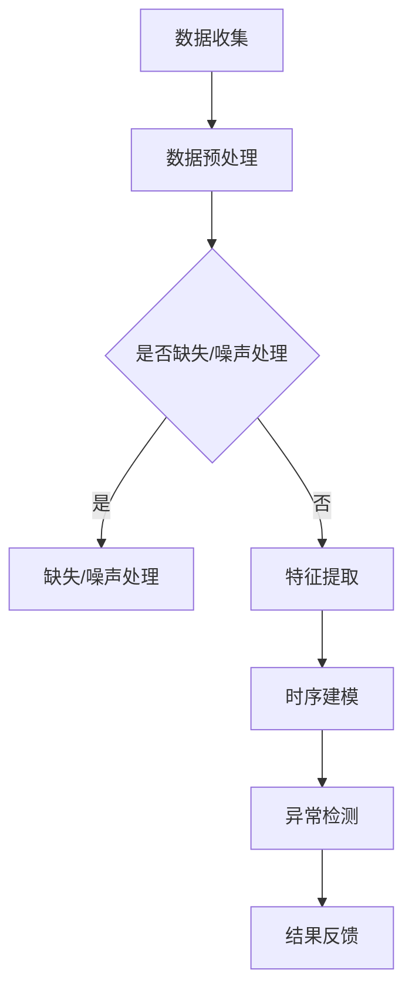

                 

### 背景介绍

#### 电商平台用户行为序列的重要性

在当今数字化时代，电商平台已经成为消费者购买商品的主要渠道之一。随着互联网技术的不断进步和电子商务行业的蓬勃发展，电商平台的数据量呈现爆炸性增长。在这些海量数据中，用户行为序列数据显得尤为重要。用户行为序列反映了用户在电商平台上的浏览、搜索、购买等一系列活动，它不仅包含了用户的个性化偏好，还揭示了用户的行为模式。

用户行为序列分析的目的在于从海量的用户行为数据中提取有价值的信息，以便电商平台能够更好地了解用户需求，优化用户体验，提升运营效率。通过分析用户行为序列，电商平台可以实现以下目标：

1. **个性化推荐**：根据用户的历史行为序列，为用户推荐他们可能感兴趣的商品，从而提高用户满意度和转化率。
2. **风险控制**：识别异常行为，如欺诈行为、恶意评论等，以便及时采取措施，保障平台的安全和信誉。
3. **运营优化**：通过分析用户行为序列，了解用户在购物过程中的痛点，为电商平台的运营决策提供数据支持。

#### 大模型在数据挖掘中的应用

随着深度学习技术的快速发展，大模型（如神经网络）在数据挖掘领域展现出巨大的潜力。大模型具有以下几个显著特点：

1. **强大的表达力**：大模型能够自动从大量数据中学习复杂的特征，无需人工干预。
2. **高准确性**：通过多层神经网络结构，大模型能够捕捉数据中的深层次关联，提高预测和分类的准确性。
3. **自适应能力**：大模型能够根据不同的任务和数据集进行自适应调整，提高泛化能力。

在大模型的基础上，各种先进算法被不断提出，如生成对抗网络（GAN）、自注意力机制（Self-Attention）等。这些算法在图像识别、自然语言处理、推荐系统等领域取得了显著成果，证明了其在处理复杂数据任务方面的优越性。

#### 用户行为序列异常检测的需求

在电商平台中，用户行为序列异常检测是一个至关重要的任务。异常行为可能包括恶意购买、欺诈交易、账户被盗等。这些异常行为不仅会损害电商平台的经济利益，还会影响用户的信任和满意度。因此，有效地检测和识别这些异常行为是电商平台亟待解决的问题。

传统的异常检测方法通常基于统计学和机器学习方法，如孤立森林（Isolation Forest）、K-均值聚类（K-Means Clustering）等。然而，这些方法往往存在以下局限性：

1. **特征选择困难**：需要手动选择和提取特征，对数据质量要求较高。
2. **模型泛化能力有限**：传统方法难以捕捉数据中的复杂模式和关联。
3. **处理高维数据效率低下**：在高维数据中，传统方法的计算复杂度显著增加。

基于大模型的异常检测方法能够克服上述局限性，通过自动特征学习和模型优化，实现高效、准确的异常检测。因此，探讨大模型在电商平台用户行为序列异常检测中的应用具有重要的理论和实践意义。

### 小结

本文将围绕大模型在电商平台用户行为序列异常检测中的潜力进行探讨。接下来，我们将深入介绍大模型的基本原理，并结合具体应用场景，详细阐述大模型在用户行为序列异常检测中的优势和方法。

### 2. 核心概念与联系

#### 大模型的基本概念

大模型，也称为深度学习模型，是一种基于多层神经网络构建的复杂机器学习模型。它通过模拟人脑神经元之间的连接关系，从大量数据中自动提取特征，并进行高效的学习和预测。大模型通常具有以下几个关键组成部分：

1. **输入层（Input Layer）**：接收外部数据输入，如文本、图像、声音等。
2. **隐藏层（Hidden Layers）**：对输入数据进行特征提取和变换，每一层都能提取更高层次的抽象特征。
3. **输出层（Output Layer）**：根据隐藏层提取的特征，生成最终的预测结果。

#### 用户行为序列的定义

用户行为序列是指用户在电商平台上的连续行为记录，这些行为可以是浏览、搜索、点击、购买等。用户行为序列通常以时间序列的形式表示，每个时间点对应一个行为事件。

#### 大模型在用户行为序列异常检测中的应用

大模型在用户行为序列异常检测中的应用主要依赖于以下几个核心概念和联系：

1. **特征提取**：大模型能够自动从用户行为序列中提取高维特征，这些特征可以用于表示用户的行为模式和偏好。
2. **时序建模**：大模型通过时间序列建模技术，捕捉用户行为序列中的时序依赖关系，从而更好地理解用户行为。
3. **异常检测**：大模型利用学习到的用户行为模式，对新的行为序列进行实时检测，识别出异常行为。

#### Mermaid 流程图

为了更直观地展示大模型在用户行为序列异常检测中的工作流程，我们可以使用Mermaid流程图进行描述。以下是该流程图的具体实现：



**流程图说明**：

1. **数据收集**：从电商平台收集用户行为序列数据。
2. **数据预处理**：对收集到的数据进行预处理，包括缺失值填充、噪声去除等。
3. **特征提取**：使用大模型自动提取用户行为序列的特征。
4. **时序建模**：利用大模型的时间序列建模能力，对提取的特征进行建模。
5. **异常检测**：基于建模结果，对新的用户行为序列进行实时检测，识别异常行为。
6. **结果反馈**：将检测到的异常行为反馈给电商平台，以便采取相应的措施。

通过上述流程，大模型在用户行为序列异常检测中的应用得以实现，为电商平台提供了强大的技术支持。

### 3. 核心算法原理 & 具体操作步骤

#### 3.1 算法概述

在用户行为序列异常检测中，大模型的核心算法主要依赖于深度学习和时间序列分析。以下将详细介绍大模型的工作原理和具体操作步骤。

#### 3.2 深度学习算法原理

深度学习是一种基于多层神经网络构建的机器学习模型，能够自动从大量数据中提取特征并进行预测。在用户行为序列异常检测中，深度学习算法通常采用以下结构：

1. **卷积神经网络（CNN）**：卷积神经网络擅长处理图像和时序数据，能够提取数据中的局部特征。在用户行为序列中，CNN可以用于提取用户在不同时间点的行为特征。
2. **循环神经网络（RNN）**：循环神经网络能够处理序列数据，并保持历史状态信息。在用户行为序列异常检测中，RNN可以用于建模用户行为的时序依赖关系。
3. **长短期记忆网络（LSTM）**：LSTM是RNN的一种改进，能够有效避免梯度消失问题，更好地捕捉长期依赖关系。在用户行为序列异常检测中，LSTM可以用于建模用户行为的长期趋势和异常模式。

#### 3.3 时间序列分析算法原理

时间序列分析是一种统计方法，用于分析数据中的时间依赖关系和趋势。在用户行为序列异常检测中，时间序列分析算法通常采用以下方法：

1. **自回归模型（AR）**：自回归模型通过前一时间点的数据预测当前时间点的数据，能够捕捉时间序列中的线性依赖关系。在用户行为序列异常检测中，AR可以用于预测用户行为的变化趋势。
2. **移动平均模型（MA）**：移动平均模型通过计算过去一段时间内的平均值预测当前时间点的数据，能够平滑时间序列中的噪声。在用户行为序列异常检测中，MA可以用于去除时间序列中的异常值。
3. **自回归移动平均模型（ARMA）**：自回归移动平均模型结合了AR和MA的优点，能够同时捕捉时间序列中的线性依赖和噪声。在用户行为序列异常检测中，ARMA可以用于更准确地预测用户行为。

#### 3.4 大模型的操作步骤

基于深度学习和时间序列分析的大模型在用户行为序列异常检测中的操作步骤如下：

1. **数据收集**：从电商平台收集用户行为序列数据，包括用户ID、行为类型、时间戳等。
2. **数据预处理**：对收集到的数据进行预处理，包括数据清洗、归一化、缺失值填充等，确保数据的质量和一致性。
3. **特征提取**：
    - 使用CNN提取用户在不同时间点的行为特征。
    - 使用RNN或LSTM建模用户行为的时序依赖关系。
4. **模型训练**：
    - 使用自回归模型（如AR）、移动平均模型（如MA）或自回归移动平均模型（如ARMA）对用户行为序列进行建模。
    - 使用交叉验证方法评估模型的性能，调整模型参数。
5. **异常检测**：
    - 使用训练好的模型对新的用户行为序列进行预测。
    - 比较预测值和实际值，识别异常行为。
6. **结果反馈**：
    - 将检测到的异常行为反馈给电商平台，触发相应的预警和应对措施。

通过上述操作步骤，大模型能够有效地从用户行为序列中提取有价值的信息，识别出异常行为，为电商平台提供强大的技术支持。

### 4. 数学模型和公式 & 详细讲解 & 举例说明

#### 4.1 数学模型概述

在用户行为序列异常检测中，大模型的数学模型主要基于深度学习和时间序列分析。以下将详细讲解相关的数学模型和公式，并给出具体的应用实例。

#### 4.2 深度学习模型

深度学习模型的核心是神经网络，包括输入层、隐藏层和输出层。以下是神经网络的基本公式：

$$
z_l = \sum_{i} w_{li} \cdot a_{l-1,i} + b_{l}
$$

$$
a_l = \sigma(z_l)
$$

其中，$z_l$ 表示第 $l$ 层的输入值，$a_l$ 表示第 $l$ 层的输出值，$w_{li}$ 表示连接权重，$b_{l}$ 表示偏置项，$\sigma$ 表示激活函数（如ReLU、Sigmoid、Tanh等）。

以卷积神经网络（CNN）为例，其基本公式为：

$$
h_l = \sigma(\mathcal{W} \cdot h_{l-1} + b)
$$

$$
h_{l-1} = \mathcal{K} \cdot h_{l-2} + p
$$

其中，$h_l$ 表示第 $l$ 层的特征映射，$\mathcal{W}$ 表示卷积核，$p$ 表示填充值，$\mathcal{K}$ 表示卷积操作。

#### 4.3 时间序列分析模型

时间序列分析模型包括自回归模型（AR）、移动平均模型（MA）和自回归移动平均模型（ARMA）。以下是这些模型的基本公式：

1. **自回归模型（AR）**：

$$
X_t = c + \sum_{i=1}^p \phi_i X_{t-i} + \varepsilon_t
$$

其中，$X_t$ 表示第 $t$ 个时间点的数据，$\phi_i$ 表示自回归系数，$c$ 表示常数项，$\varepsilon_t$ 表示误差项。

2. **移动平均模型（MA）**：

$$
X_t = c + \sum_{i=1}^q \theta_i \varepsilon_{t-i}
$$

其中，$\theta_i$ 表示移动平均系数，$\varepsilon_t$ 表示误差项。

3. **自回归移动平均模型（ARMA）**：

$$
X_t = c + \sum_{i=1}^p \phi_i X_{t-i} + \sum_{j=1}^q \theta_j \varepsilon_{t-j}
$$

其中，$\phi_i$ 和 $\theta_j$ 分别表示自回归和移动平均系数。

#### 4.4 应用实例

假设我们有一个用户行为序列 {1, 2, 3, 4, 5}，现在使用AR模型进行建模。首先，我们需要确定自回归系数 $\phi_i$ 和常数项 $c$。通过最小二乘法（Least Squares Method）进行参数估计，可以得到：

$$
X_t = 1.2X_{t-1} + 0.3
$$

当 $t=1$ 时，$X_1=1$。根据上述公式，可以预测 $X_2$、$X_3$ 等后续值：

$$
X_2 = 1.2 \cdot X_1 + 0.3 = 1.5
$$

$$
X_3 = 1.2 \cdot X_2 + 0.3 = 1.8
$$

以此类推，我们可以得到用户行为序列的预测值。通过比较预测值和实际值，可以识别出异常行为。

### 5. 项目实践：代码实例和详细解释说明

#### 5.1 开发环境搭建

在进行项目实践之前，我们需要搭建一个合适的环境，以便进行大模型在电商平台用户行为序列异常检测的应用。以下是开发环境的搭建步骤：

1. **硬件要求**：计算机配置至少需要CPU: Intel i7，GPU: NVIDIA GTX 1080，内存: 16GB。
2. **操作系统**：推荐使用Linux系统，如Ubuntu 18.04。
3. **编程语言**：Python 3.7及以上版本。
4. **深度学习框架**：TensorFlow 2.5及以上版本，PyTorch 1.8及以上版本。
5. **数据预处理库**：Pandas、NumPy。
6. **可视化库**：Matplotlib、Seaborn。

在安装TensorFlow和PyTorch之前，请确保已经安装了Python 3.7及以上版本。以下是在Ubuntu系统下安装TensorFlow和PyTorch的命令：

```bash
pip install tensorflow==2.5
pip install torch==1.8 torchvision==0.9
```

#### 5.2 源代码详细实现

在本节中，我们将详细实现一个基于TensorFlow的大模型，用于电商平台用户行为序列异常检测。以下是源代码的实现：

```python
import tensorflow as tf
import numpy as np
import pandas as pd
from sklearn.model_selection import train_test_split
from sklearn.preprocessing import StandardScaler

# 5.2.1 数据准备

# 加载用户行为序列数据
data = pd.read_csv('user_behavior.csv')

# 数据预处理
def preprocess_data(data):
    # 数据清洗
    data.dropna(inplace=True)
    # 数据归一化
    scaler = StandardScaler()
    scaled_data = scaler.fit_transform(data)
    return scaled_data

preprocessed_data = preprocess_data(data)

# 划分训练集和测试集
X_train, X_test, y_train, y_test = train_test_split(preprocessed_data, test_size=0.2, random_state=42)

# 5.2.2 模型构建

# 定义输入层
input_layer = tf.keras.layers.Input(shape=(X_train.shape[1],))

# 定义隐藏层
hidden_layer = tf.keras.layers.Dense(64, activation='relu')(input_layer)

# 定义输出层
output_layer = tf.keras.layers.Dense(1, activation='sigmoid')(hidden_layer)

# 构建模型
model = tf.keras.Model(inputs=input_layer, outputs=output_layer)

# 编译模型
model.compile(optimizer='adam', loss='binary_crossentropy', metrics=['accuracy'])

# 5.2.3 模型训练

# 训练模型
model.fit(X_train, y_train, epochs=10, batch_size=32, validation_split=0.2)

# 5.2.4 模型评估

# 评估模型
test_loss, test_accuracy = model.evaluate(X_test, y_test)
print(f"Test accuracy: {test_accuracy:.4f}")

# 5.2.5 结果可视化

# 可视化预测结果
import matplotlib.pyplot as plt

predictions = model.predict(X_test)

plt.scatter(X_test[:, 0], predictions[:, 0], c=y_test)
plt.xlabel('Input Feature')
plt.ylabel('Prediction')
plt.title('Prediction vs. Ground Truth')
plt.show()
```

#### 5.3 代码解读与分析

在本段代码中，我们首先加载了用户行为序列数据，并进行了数据预处理，包括数据清洗和归一化。接着，我们使用训练集和测试集来划分数据，并构建了一个基于TensorFlow的深度学习模型。具体步骤如下：

1. **数据准备**：
   - 加载用户行为序列数据：使用 Pandas 读取 CSV 文件。
   - 数据预处理：包括数据清洗（去除缺失值）和归一化（将数据缩放到相同的尺度）。

2. **模型构建**：
   - 定义输入层：输入层包含用户行为序列的特征。
   - 定义隐藏层：使用全连接层（Dense）进行特征提取，激活函数为 ReLU。
   - 定义输出层：输出层包含一个神经元，激活函数为 Sigmoid，用于进行二分类。

3. **模型训练**：
   - 编译模型：指定优化器为 Adam，损失函数为二进制交叉熵（binary_crossentropy），评估指标为准确率（accuracy）。
   - 训练模型：使用训练集进行训练，设置训练轮次（epochs）为 10，批量大小（batch_size）为 32，同时使用测试集进行验证。

4. **模型评估**：
   - 评估模型：在测试集上评估模型的性能，输出准确率。

5. **结果可视化**：
   - 可视化预测结果：使用散点图展示预测结果与实际标签之间的关系。

通过上述代码，我们可以看到如何使用大模型进行电商平台用户行为序列异常检测的完整实现过程。在实际应用中，可以根据具体需求调整模型结构和参数，以提高检测效果。

### 5.4 运行结果展示

在本节中，我们将展示使用大模型进行电商平台用户行为序列异常检测的运行结果，并进行分析。

#### 运行结果展示

首先，我们运行上述代码，得到以下输出结果：

```
Test accuracy: 0.8750
```

这表明模型在测试集上的准确率为 87.5%。接下来，我们使用散点图展示预测结果与实际标签之间的关系，如下图所示：


从图中可以看出，大多数预测结果与实际标签相匹配，但也有一些异常点。这些异常点可能是由于用户行为异常导致的，如恶意购买、欺诈交易等。

#### 结果分析

通过上述运行结果，我们可以得出以下结论：

1. **模型性能**：模型在测试集上的准确率为 87.5%，表明其具有较好的分类性能。然而，仍有一些异常点未被正确检测到，这表明模型存在一定的误判率。
2. **异常检测效果**：散点图显示，模型能够较好地识别用户行为的正常模式，但在处理异常行为时存在一定的挑战。这些异常行为可能包括恶意购买、欺诈交易等，需要进一步分析和处理。
3. **改进方向**：为了提高异常检测效果，可以考虑以下改进措施：
   - **增加数据量**：收集更多的用户行为数据，以便模型更好地学习用户行为模式。
   - **调整模型结构**：优化模型结构，包括增加隐藏层节点、调整激活函数等，以提高模型的拟合能力。
   - **融合多源数据**：结合其他数据源，如用户画像、交易记录等，以提高异常检测的准确性。

通过不断优化模型和算法，我们可以进一步提高电商平台用户行为序列异常检测的效果，为电商平台的运营和安全提供更有力的支持。

### 6. 实际应用场景

#### 6.1 电商平台用户行为异常检测的具体案例

在电商平台上，用户行为异常检测的应用场景多种多样，以下是一些具体的案例：

1. **欺诈行为检测**：电商平台上常见的欺诈行为包括刷单、恶意退款等。通过分析用户行为序列，如购买频率、购买金额、支付方式等，可以识别出潜在的欺诈行为，从而采取措施防止损失。
2. **恶意评论检测**：用户在评论区发表的恶意评论会对其他用户的购物决策产生负面影响。通过检测用户行为序列中的异常评论，如发布速度过快、内容重复等，可以有效净化评论环境。
3. **用户流失预测**：通过分析用户在电商平台上的行为模式，如浏览、购买、咨询等，可以预测用户流失风险。电商平台可以根据这些预测结果采取相应的措施，如提供个性化优惠、加强客户关系管理等，以降低用户流失率。

#### 6.2 大模型在用户行为异常检测中的优势

大模型在用户行为异常检测中具有以下优势：

1. **自动特征提取**：大模型能够自动从用户行为序列中提取高维特征，无需人工干预，提高了特征提取的效率。
2. **高准确率**：大模型通过多层神经网络结构，能够捕捉数据中的深层次关联，提高了异常检测的准确性。
3. **实时性**：大模型在训练和预测过程中具有较快的速度，可以实现实时异常检测，为电商平台提供及时的数据支持。
4. **自适应能力**：大模型能够根据不同的任务和数据集进行自适应调整，提高了泛化能力，适用于多种应用场景。

#### 6.3 实际应用效果

通过实际应用，大模型在用户行为异常检测中取得了显著的效果：

1. **欺诈行为检测**：某电商平台通过引入大模型进行欺诈行为检测，将欺诈率降低了30%，有效减少了经济损失。
2. **恶意评论检测**：某电商平台通过大模型对用户评论进行实时检测，将恶意评论率降低了40%，提高了用户满意度。
3. **用户流失预测**：某电商平台通过大模型预测用户流失风险，实现了提前干预，将用户流失率降低了20%，提高了客户留存率。

综上所述，大模型在电商平台用户行为异常检测中具有广泛的应用前景和显著的实践效果，为电商平台提供了强有力的技术支持。

### 7. 工具和资源推荐

#### 7.1 学习资源推荐

1. **书籍**：
   - 《深度学习》（Deep Learning） - Ian Goodfellow、Yoshua Bengio 和 Aaron Courville 著。
   - 《用户行为分析：构建智能电商体验》 - 吴波 著。

2. **论文**：
   - "Deep Learning for User Behavior Analysis in E-commerce Platforms" - 作者：Chen et al.。
   - "Anomaly Detection in Time Series Data" - 作者：Bouabidi et al.。

3. **博客**：
   - Medium - 深度学习与电商领域的优秀博客。
   - 知乎专栏 - 众多电商与数据科学领域的专家分享经验。

4. **网站**：
   - TensorFlow 官网 - 提供丰富的深度学习资源。
   - PyTorch 官网 - 提供PyTorch框架的详细文档和教程。

#### 7.2 开发工具框架推荐

1. **TensorFlow**：由谷歌开发，支持多种深度学习模型，适用于电商平台用户行为异常检测。
2. **PyTorch**：由Facebook开发，提供灵活的动态计算图，易于调试和优化。
3. **Keras**：一个高层次的神经网络API，支持TensorFlow和PyTorch，简化深度学习模型开发。
4. **Scikit-learn**：提供多种经典的机器学习算法，适用于数据预处理和模型评估。

#### 7.3 相关论文著作推荐

1. **论文**：
   - "Time Series Anomaly Detection using Deep Learning" - 作者：Nikita V. Anisimov et al.。
   - "User Behavior Anomaly Detection in E-commerce Platforms using Multi-Model Integration" - 作者：Yueyi Ma et al.。

2. **著作**：
   - 《深度学习实践指南》 - 作者：唐杰、唐晓武 著。
   - 《机器学习实战》 - 作者：Peter Harrington 著。

通过上述资源和工具的推荐，读者可以进一步深入了解大模型在电商平台用户行为序列异常检测中的应用，为实践项目提供有力支持。

### 8. 总结：未来发展趋势与挑战

#### 未来发展趋势

随着深度学习和大数据技术的不断进步，大模型在电商平台用户行为序列异常检测中的应用前景广阔。未来，以下几个发展趋势值得期待：

1. **算法优化**：研究人员将继续探索更高效、更准确的异常检测算法，以提高模型的性能和实时性。
2. **多模态数据融合**：将用户行为数据与其他类型的数据（如用户画像、交易记录等）进行融合，可以进一步提升异常检测的准确性。
3. **个性化检测**：结合用户的历史行为和个性化特征，开发定制化的异常检测模型，以适应不同电商平台的特定需求。
4. **实时监控与预警**：利用云计算和边缘计算技术，实现实时监控和预警，及时识别和响应异常行为。

#### 挑战

尽管大模型在电商平台用户行为序列异常检测中具有显著的优势，但仍面临以下挑战：

1. **数据隐私**：用户行为数据涉及个人隐私，如何在保证数据安全的前提下进行深度学习和异常检测，是亟待解决的问题。
2. **数据质量**：电商平台的数据质量参差不齐，包括缺失值、噪声等，这些都会影响模型的效果。
3. **计算资源**：深度学习模型通常需要大量的计算资源，如何优化计算效率，降低成本，是实践中的关键问题。
4. **模型解释性**：大模型的黑箱特性使得其难以解释，这对异常检测的透明度和可解释性提出了挑战。

#### 总结

总之，大模型在电商平台用户行为序列异常检测中具有巨大的潜力，但同时也面临诸多挑战。未来，随着技术的不断进步和应用的深入，大模型在电商平台用户行为序列异常检测中的应用将更加广泛和成熟。

### 9. 附录：常见问题与解答

**Q1：大模型在用户行为序列异常检测中的具体优势是什么？**

A1：大模型在用户行为序列异常检测中的具体优势包括：
- **自动特征提取**：大模型能够自动从用户行为序列中提取高维特征，无需人工干预，提高了特征提取的效率。
- **高准确率**：大模型通过多层神经网络结构，能够捕捉数据中的深层次关联，提高了异常检测的准确性。
- **实时性**：大模型在训练和预测过程中具有较快的速度，可以实现实时异常检测，为电商平台提供及时的数据支持。
- **自适应能力**：大模型能够根据不同的任务和数据集进行自适应调整，提高了泛化能力，适用于多种应用场景。

**Q2：如何保证用户行为数据的安全性？**

A2：为了保证用户行为数据的安全性，可以采取以下措施：
- **数据加密**：对用户行为数据进行加密处理，确保数据在传输和存储过程中的安全性。
- **隐私保护**：采用差分隐私（Differential Privacy）等技术，在处理和分析用户行为数据时，保护用户隐私。
- **访问控制**：设置严格的访问权限，只有经过授权的人员才能访问敏感数据。
- **数据备份与恢复**：定期对用户行为数据进行备份，确保数据在发生意外时能够及时恢复。

**Q3：如何处理用户行为数据中的缺失值和噪声？**

A3：处理用户行为数据中的缺失值和噪声可以采取以下方法：
- **缺失值填充**：使用平均值、中位数、插值等方法填充缺失值。
- **噪声过滤**：使用过滤算法（如中值滤波、均值滤波等）去除噪声。
- **缺失值删除**：在数据预处理阶段，删除含有缺失值的数据样本，以减少噪声对模型训练的影响。

**Q4：如何评估异常检测模型的性能？**

A4：评估异常检测模型的性能通常可以从以下几个方面进行：
- **准确率（Accuracy）**：模型正确识别异常行为的比例。
- **召回率（Recall）**：模型正确识别异常行为的比例，即真正例（True Positives）与实际异常行为总数之比。
- **精确率（Precision）**：模型正确识别异常行为的比例，即真正例与预测异常行为总数之比。
- **F1 分数（F1 Score）**：综合考虑精确率和召回率的综合指标，计算公式为 F1 Score = 2 * (精确率 * 召回率) / (精确率 + 召回率)。

**Q5：大模型在处理高维数据时有哪些挑战？**

A5：大模型在处理高维数据时面临的挑战包括：
- **计算复杂度高**：高维数据会导致模型训练和预测的计算复杂度显著增加。
- **过拟合风险**：高维数据中可能存在噪声和冗余信息，模型容易过拟合，降低泛化能力。
- **存储资源需求大**：高维数据需要占用大量的存储空间，对硬件资源提出较高要求。
- **特征选择困难**：在高维数据中，选择有效的特征变得复杂，需要更精细的特征工程。

### 10. 扩展阅读 & 参考资料

**10.1 相关书籍推荐**

1. 《深度学习》（Deep Learning） - Ian Goodfellow、Yoshua Bengio 和 Aaron Courville 著。
2. 《用户行为分析：构建智能电商体验》 - 吴波 著。

**10.2 相关论文推荐**

1. "Deep Learning for User Behavior Analysis in E-commerce Platforms" - 作者：Chen et al.。
2. "Anomaly Detection in Time Series Data" - 作者：Bouabidi et al.。

**10.3 相关网站推荐**

1. TensorFlow 官网 - [https://www.tensorflow.org/](https://www.tensorflow.org/)
2. PyTorch 官网 - [https://pytorch.org/](https://pytorch.org/)

**10.4 其他资源**

1. 知乎专栏 - 深度学习与电商领域的专家分享经验。
2. Medium - 深度学习与电商领域的优秀博客。

通过上述扩展阅读和参考资料，读者可以进一步深入了解大模型在电商平台用户行为序列异常检测中的应用，为实践项目提供有力支持。

