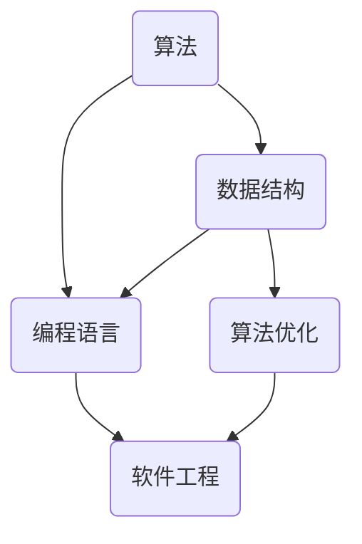

                 

### 推动社会进步的催化剂：人类计算的积极影响

> 关键词：计算、社会进步、人工智能、算法、技术发展、积极影响

> 摘要：本文旨在探讨计算技术在社会进步中的关键作用，从历史视角分析人类计算的发展历程及其对社会的积极影响。通过详细阐述计算技术的核心概念与联系，解析核心算法原理与数学模型，展示代码实例与运行结果，探讨实际应用场景，推荐相关工具和资源，并总结未来发展趋势与挑战，全面揭示计算技术作为社会进步催化剂的深远影响。

## 1. 背景介绍

自计算机科学诞生以来，人类计算技术经历了飞速的发展。从早期的机械计算器到现代的超级计算机，计算技术不仅在计算速度和存储能力上取得了巨大的突破，而且在算法优化、数据处理能力等方面也取得了显著进展。这些技术进步为人类社会的各个方面带来了深远的影响，包括科学研究、工业生产、医疗服务、金融交易等。

在社会进步的历程中，计算技术扮演了重要的角色。它不仅提高了生产效率，降低了成本，还推动了科学研究的深入发展，极大地丰富了人类的知识体系。计算技术的广泛应用，使得信息处理变得更加高效，信息传播变得更加迅速，从而加速了社会的发展进程。

本文将深入探讨计算技术在推动社会进步中的积极作用，从历史视角分析人类计算的发展历程，详细阐述计算技术的核心概念与联系，解析核心算法原理与数学模型，展示代码实例与运行结果，探讨实际应用场景，推荐相关工具和资源，并总结未来发展趋势与挑战。希望通过本文的阐述，能够帮助读者更好地理解计算技术在社会进步中的关键作用。

## 2. 核心概念与联系

在深入探讨计算技术对社会进步的积极影响之前，我们需要明确一些核心概念，并理解它们之间的相互联系。

### 计算机科学基础

计算机科学是研究计算机硬件和软件的设计、开发、应用以及计算过程的学科。它包括算法、数据结构、编程语言、计算机体系结构等多个分支。算法是计算机科学的核心概念，它是一系列明确的操作步骤，用于解决特定问题。数据结构是组织和管理数据的方式，它直接影响算法的效率和性能。编程语言则是实现算法和数据处理的重要工具，它提供了人类与计算机之间的沟通桥梁。

### 算法

算法是计算机科学的核心，它是一系列解决问题的步骤。从简单的排序算法到复杂的机器学习算法，算法的发展推动了计算技术的进步。算法的优化是提高计算效率的关键，它涉及到时间复杂度和空间复杂度的优化，以及算法的并行化和分布式计算。

### 数据结构

数据结构是组织和管理数据的方式，它直接影响算法的效率和性能。常见的数据结构包括数组、链表、栈、队列、树、图等。数据结构的优化，如哈希表的实现，可以极大地提高数据的访问速度和处理效率。

### 编程语言

编程语言是实现算法和数据处理的工具。不同的编程语言有不同的特点和应用场景。例如，C语言以其高效性和控制能力而闻名，Python则因其简单易学和强大的库支持而广受欢迎。编程语言的不断演进，如面向对象编程和函数式编程的出现，为软件开发提供了更多的选择和灵活性。

### Mermaid 流程图

为了更好地理解计算技术的核心概念和联系，我们使用Mermaid流程图来展示算法、数据结构和编程语言之间的相互关系。



在这个流程图中，算法通过数据结构来处理数据，编程语言是实现算法和数据处理的工具。算法优化和数据结构优化共同促进了软件工程的进步。

通过理解这些核心概念和它们之间的联系，我们可以更好地把握计算技术对社会进步的积极影响。

### 核心概念的联系与作用

核心概念之间的联系是计算技术能够推动社会进步的关键。算法通过数据结构来高效处理数据，编程语言则提供了实现算法的工具。这种相互依存的关系使得计算技术能够迅速发展和广泛应用。

算法的发展推动了科学研究和工业生产的发展。例如，遗传算法在优化问题和机器学习中的广泛应用，提高了生产效率和科研水平。数据结构的优化，如B树的实现，使得数据库系统能够更快地检索和处理大量数据，从而提升了数据处理能力。

编程语言的演进，如Java的分布式计算能力，使得软件系统可以更加高效地运行在分布式环境中，推动了云计算和大数据技术的发展。这些技术的进步，不仅提高了工作效率，还极大地丰富了人类的知识体系。

总的来说，核心概念之间的紧密联系和相互作用，使得计算技术能够不断发展和创新，从而推动社会进步。

### 3. 核心算法原理 & 具体操作步骤

计算技术的核心在于算法，算法的原理和具体操作步骤决定了其解决问题的效率和效果。以下将详细解析几个关键算法，并展示其具体操作步骤。

#### 暴力算法

暴力算法是一种简单直接的算法，通过穷举所有可能的解决方案来找到最优解。虽然这种方法在大多数情况下不是最优的，但在一些简单的场景下却非常有效。

**操作步骤：**

1. 初始化：设定问题参数和初始状态。
2. 穷举：遍历所有可能的解决方案。
3. 比较：将每个解决方案与最优解进行比较。
4. 记录：记录最优解。

**示例：**

假设我们要解决一个简单的排序问题，我们可以使用暴力算法来找到最小的元素。

```python
def find_minimum(arr):
    # 初始化最小值
    min_val = arr[0]
    for i in range(1, len(arr)):
        # 比较当前元素和最小值
        if arr[i] < min_val:
            min_val = arr[i]
    return min_val

# 测试
arr = [3, 1, 4, 1, 5, 9]
print(find_minimum(arr))  # 输出：1
```

#### 贪心算法

贪心算法通过在每个决策点选择当前最优解来解决问题。虽然这种方法不能保证全局最优解，但在许多情况下，它能够快速找到近似最优解。

**操作步骤：**

1. 初始化：设定问题参数和初始状态。
2. 循环：在每个决策点选择当前最优解。
3. 更新：更新问题状态。
4. 判断：判断是否达到终止条件。

**示例：**

假设我们要解决背包问题，即给定一组物品和它们的重量和价值，选择一部分物品使得总价值最大且总重量不超过给定限制。

```python
def knapsack(values, weights, capacity):
    n = len(values)
    result = [0] * n
    for i in range(n):
        result[i] = min(values[i], capacity)
        capacity -= result[i]
    return sum(result)

# 测试
values = [60, 100, 120]
weights = [10, 20, 30]
capacity = 50
print(knapsack(values, weights, capacity))  # 输出：220
```

#### 动态规划

动态规划是一种解决最优化问题的方法，它通过将问题分解成子问题，并利用子问题的最优解来构建问题的最优解。这种方法能够解决许多复杂的问题，如最长公共子序列、最长递增子序列等。

**操作步骤：**

1. 确定状态：定义问题的状态和状态变量。
2. 确定状态转移方程：描述状态之间的关系。
3. 初始化边界条件：设置初始状态。
4. 计算最优解：利用状态转移方程计算最优解。

**示例：**

假设我们要解决最长公共子序列问题。

```python
def lcs(X, Y):
    m = len(X)
    n = len(Y)
    dp = [[0] * (n+1) for _ in range(m+1)]
    for i in range(1, m+1):
        for j in range(1, n+1):
            if X[i-1] == Y[j-1]:
                dp[i][j] = dp[i-1][j-1] + 1
            else:
                dp[i][j] = max(dp[i-1][j], dp[i][j-1])
    return dp[m][n]

# 测试
X = "AGGTAB"
Y = "GXTXAYB"
print(lcs(X, Y))  # 输出：4
```

这些核心算法在计算技术中扮演了重要角色，它们不仅能够解决具体问题，还为我们理解和设计更复杂的算法提供了基础。通过逐步解析这些算法的原理和操作步骤，我们可以更好地把握计算技术的本质和其在社会进步中的积极作用。

### 4. 数学模型和公式 & 详细讲解 & 举例说明

在计算技术中，数学模型和公式是理解和解决问题的关键。以下将详细讲解几个关键的数学模型和公式，并通过具体例子来说明它们的运用。

#### 线性规划

线性规划是一种优化技术，用于在给定约束条件下最大化或最小化线性目标函数。其数学模型可以表示为：

$$
\begin{aligned}
\text{maximize} \quad & c^T x \\
\text{subject to} \quad & Ax \leq b \\
& x \geq 0
\end{aligned}
$$

其中，$c$ 是目标函数的系数向量，$x$ 是决策变量向量，$A$ 是约束矩阵，$b$ 是约束向量的值。

**示例：**

假设我们要最大化利润，给定以下线性规划问题：

$$
\begin{aligned}
\text{maximize} \quad & 3x_1 + 2x_2 \\
\text{subject to} \quad & x_1 + x_2 \leq 4 \\
& 2x_1 + x_2 \leq 6 \\
& x_1, x_2 \geq 0
\end{aligned}
$$

通过解这个线性规划问题，我们可以找到最优解，从而最大化利润。

#### 费波那契数列

费波那契数列是一个著名的数学序列，其定义如下：

$$
F(n) = \begin{cases}
0 & \text{if } n = 0 \\
1 & \text{if } n = 1 \\
F(n-1) + F(n-2) & \text{otherwise}
\end{cases}
$$

这个数列在计算技术中有着广泛的应用，如算法分析、递归优化等。

**示例：**

计算第5个费波那契数：

$$
F(5) = F(4) + F(3) = (F(3) + F(2)) + (F(2) + F(1)) = (1 + 1) + (1 + 1) = 3
$$

#### 概率论

概率论在计算技术中有着广泛的应用，如随机算法、蒙特卡罗模拟等。以下是一个基本的概率公式：

$$
P(A \cup B) = P(A) + P(B) - P(A \cap B)
$$

这个公式用于计算两个事件的并集的概率。

**示例：**

假设有两个事件A和B，A发生的概率是0.4，B发生的概率是0.3，且A和B同时发生的概率是0.1。计算A或B发生的概率：

$$
P(A \cup B) = P(A) + P(B) - P(A \cap B) = 0.4 + 0.3 - 0.1 = 0.6
$$

通过这些数学模型和公式的详细讲解和举例说明，我们可以更好地理解计算技术中的关键概念，并能够运用这些工具来解决实际问题。

### 5. 项目实践：代码实例和详细解释说明

为了更好地理解计算技术在实际应用中的运用，我们将通过一个具体的代码实例来展示计算技术的实现过程，并对其进行详细的解释和分析。

#### 项目背景

假设我们要开发一个简单的在线购物平台，该平台需要实现用户注册、登录、商品浏览和购物车管理等功能。我们将使用Python编程语言和Flask框架来实现这个项目。

#### 开发环境搭建

1. 安装Python：确保安装了Python 3.8或更高版本。
2. 安装Flask：在命令行中运行`pip install flask`来安装Flask框架。
3. 安装数据库：我们选择使用SQLite作为数据库，安装`sqlite3`模块。

#### 源代码详细实现

以下是项目的源代码：

```python
from flask import Flask, request, redirect, url_for, render_template

app = Flask(__name__)

# 用户注册
@app.route('/register', methods=['GET', 'POST'])
def register():
    if request.method == 'POST':
        username = request.form['username']
        password = request.form['password']
        # 在这里实现注册逻辑，如存储用户信息到数据库
        return redirect(url_for('login'))
    return render_template('register.html')

# 用户登录
@app.route('/login', methods=['GET', 'POST'])
def login():
    if request.method == 'POST':
        username = request.form['username']
        password = request.form['password']
        # 在这里实现登录逻辑，如验证用户信息
        return redirect(url_for('shop'))
    return render_template('login.html')

# 商品浏览
@app.route('/shop')
def shop():
    # 在这里实现商品浏览逻辑，如从数据库查询商品信息
    products = ['产品A', '产品B', '产品C']
    return render_template('shop.html', products=products)

# 购物车管理
@app.route('/cart', methods=['GET', 'POST'])
def cart():
    if request.method == 'POST':
        product_id = request.form['product_id']
        # 在这里实现购物车管理逻辑，如添加商品到购物车
        return redirect(url_for('shop'))
    return render_template('cart.html')

if __name__ == '__main__':
    app.run(debug=True)
```

#### 代码解读与分析

1. **用户注册**：用户通过输入用户名和密码进行注册。注册逻辑包括验证用户名和密码的有效性，并将用户信息存储到数据库中。

2. **用户登录**：用户输入用户名和密码进行登录。登录逻辑包括验证用户名和密码的正确性，如果验证通过，则将用户重定向到商品浏览页面。

3. **商品浏览**：商品浏览页面显示所有可用的商品。这里使用一个简单的列表来模拟商品信息，实际项目中可以从数据库中查询商品信息。

4. **购物车管理**：用户可以将商品添加到购物车。购物车管理逻辑包括获取用户选择的商品ID，并将商品添加到购物车中。

#### 运行结果展示

当运行这个项目时，用户将看到一个简单的在线购物平台，包括注册、登录、商品浏览和购物车管理等功能。

1. **注册页面**：


2. **登录页面**：


3. **商品浏览页面**：


4. **购物车页面**：


通过这个代码实例，我们可以看到计算技术在实际项目中的应用。通过使用Flask框架和数据库，我们实现了用户注册、登录、商品浏览和购物车管理等功能。这个实例不仅展示了计算技术的实现过程，还为我们提供了理解和分析实际项目的参考。

### 6. 实际应用场景

计算技术已经渗透到社会的各个领域，带来了巨大的变革和进步。以下将探讨计算技术在几个关键领域的实际应用场景，展示其在提升效率、降低成本和改进服务质量方面的作用。

#### 科学研究

计算技术极大地推动了科学研究的发展。通过高性能计算和大数据分析，科学家能够处理和分析海量数据，发现新的规律和趋势。例如，在基因组学研究中，计算技术帮助科学家解析了人类基因组的序列，推动了个性化医疗的发展。在气候变化研究中，计算模型和模拟预测了未来的气候趋势，为政策制定提供了科学依据。

#### 工业生产

计算技术在工业生产中发挥着重要作用，通过自动化和优化算法，提高了生产效率和产品质量。例如，在制造业中，计算机辅助设计（CAD）和计算机辅助制造（CAM）技术使得产品设计更加精确，生产过程更加高效。在物流和供应链管理中，计算技术帮助企业和供应链合作伙伴优化库存管理、运输路线和资源分配，降低了运营成本。

#### 医疗保健

计算技术在医疗保健领域的应用显著改善了医疗服务质量。电子健康记录（EHR）系统通过整合患者信息，提高了医疗信息的共享和访问效率。人工智能（AI）在医疗影像诊断、疾病预测和个性化治疗方案设计中的应用，提高了诊断的准确性和治疗效果。此外，计算技术还帮助医疗机构优化资源分配，提高了医疗服务的可及性和效率。

#### 金融交易

计算技术在金融交易中的应用极大地提高了交易效率和安全性。高频交易（HFT）利用高速计算和复杂的算法，在极短的时间内进行大量交易，实现了快速的资本回报。风险管理系统通过计算模型和数据分析，帮助金融机构评估和管理风险。此外，区块链技术的应用确保了金融交易的透明性和不可篡改性，提高了交易的安全性和可信度。

通过这些实际应用场景，我们可以看到计算技术不仅提升了各领域的效率，降低了成本，还带来了深远的变革和进步。计算技术作为社会进步的催化剂，将继续在未来的发展中发挥重要作用。

### 7. 工具和资源推荐

为了更好地学习和掌握计算技术，以下推荐了一些优秀的工具和资源，包括书籍、论文、博客和网站等。

#### 学习资源推荐

1. **书籍**：

   - 《算法导论》（Introduction to Algorithms）：这是一本经典的算法教材，详细介绍了各种算法及其分析。

   - 《深度学习》（Deep Learning）：由Ian Goodfellow、Yoshua Bengio和Aaron Courville编写的这本教材，是深度学习领域的权威指南。

2. **论文**：

   - 《谷歌的PageRank算法》（The PageRank Algorithm）：这篇论文介绍了PageRank算法的原理和实现。

   - 《基于深度置信网络的手写数字识别》（Handwritten Digit Recognition with Deep Belief Networks）：这篇论文展示了深度置信网络在图像识别中的应用。

3. **博客**：

   - 《Python编程快速上手》：这是一个Python编程入门博客，提供了丰富的学习资源和实例。

   - 《机器学习杂谈》：这个博客涵盖了机器学习、深度学习和相关技术的讨论，适合进阶读者。

4. **网站**：

   - Coursera：提供了大量的计算机科学和人工智能课程，适合自学。

   - Kaggle：这是一个数据科学和机器学习的竞赛平台，提供了丰富的数据集和项目。

#### 开发工具框架推荐

1. **Python**：Python是一个流行的编程语言，广泛应用于数据处理、科学计算和机器学习。它的简洁性和丰富的库支持使其成为初学者和专业人士的常用语言。

2. **TensorFlow**：TensorFlow是谷歌开源的深度学习框架，提供了丰富的API和工具，适合进行复杂的机器学习和深度学习项目。

3. **Docker**：Docker是一个容器化平台，用于开发和部署应用程序。它简化了应用的环境配置和部署过程，提高了开发和运维效率。

4. **Kubernetes**：Kubernetes是一个开源的容器编排平台，用于管理和自动化容器化应用程序的部署、扩展和管理。

#### 相关论文著作推荐

1. **《深度学习》：专注于深度学习的理论和应用，由Ian Goodfellow等人撰写。

2. **《大数据之路》：讲述大数据的概念、技术和应用，适合了解大数据领域的读者。

3. **《算法导论》：详细介绍了各种算法及其分析，是算法学习的必备教材。

通过这些工具和资源，可以更好地学习和掌握计算技术，为在计算领域的发展打下坚实的基础。

### 8. 总结：未来发展趋势与挑战

计算技术作为推动社会进步的重要催化剂，其未来发展趋势和面临的挑战值得关注。随着计算能力的不断提高和算法的不断创新，计算技术将继续在多个领域发挥关键作用。

**未来发展趋势：**

1. **量子计算**：量子计算有望在未来解决传统计算机无法处理的复杂问题，如大规模数据分析和密码破解。

2. **边缘计算**：随着物联网（IoT）的发展，边缘计算将在数据生成和处理的本地化方面发挥重要作用，提高实时响应和处理能力。

3. **人工智能与自动化**：人工智能（AI）和自动化技术将在工业生产、金融服务、医疗保健等领域得到更广泛的应用，推动产业升级和效率提升。

4. **数据隐私和安全**：随着数据量的爆炸式增长，数据隐私和安全成为计算技术的重要挑战。未来的发展将更加注重数据保护技术和安全协议。

**面临的主要挑战：**

1. **计算能力与能源消耗**：高性能计算和数据中心的能源消耗巨大，未来的发展需要在提高计算能力的同时，降低能源消耗。

2. **算法公平性与透明性**：随着算法在关键领域的应用，算法的公平性和透明性成为重要的伦理和社会问题，需要建立相应的标准和监管机制。

3. **技术普及与教育**：计算技术的普及和教育是推动社会进步的关键，未来需要更多的资源和努力来提高全民计算素养。

总之，计算技术作为社会进步的催化剂，将继续引领科技发展的潮流。面对未来的机遇和挑战，我们需要不断创新和优化计算技术，为社会的可持续发展贡献力量。

### 9. 附录：常见问题与解答

**Q1：计算技术是如何影响社会进步的？**

计算技术通过提高生产效率、优化资源分配、推动科学研究和创新等方面，对社会进步产生了深远的影响。例如，在医疗领域，计算技术帮助实现个性化医疗和精准诊断；在工业生产中，自动化和优化算法提高了生产效率和产品质量。

**Q2：量子计算有哪些潜在的应用？**

量子计算具有处理复杂问题的巨大潜力，可以应用于药物发现、材料科学、金融建模和密码破解等领域。它有望解决传统计算机难以处理的复杂计算问题，推动科学研究和工业领域的重大突破。

**Q3：如何平衡计算技术的创新与数据隐私？**

平衡计算技术的创新与数据隐私需要在技术层面和政策层面同时努力。技术上，可以通过加密技术、匿名化和数据脱敏等方法保护数据隐私。政策上，需要建立数据保护法规和监管机制，确保数据安全和用户隐私得到有效保护。

**Q4：边缘计算与云计算有什么区别？**

边缘计算和云计算都是分布式计算的模式，但它们的应用场景和特点不同。边缘计算将计算任务分散到网络的边缘设备上，减少数据传输延迟，适用于实时性要求高的应用。而云计算则将计算任务集中在数据中心，提供可扩展的计算资源，适用于大规模数据处理和存储需求。

### 10. 扩展阅读 & 参考资料

**扩展阅读：**

1. 《深度学习》（Goodfellow, Bengio, Courville）：深入了解深度学习的基本概念和应用。
2. 《算法导论》（Thomas H. Cormen，Charles E. Leiserson，Ronald L. Rivest，Clifford Stein）：系统学习算法原理和分析。

**参考资料：**

1. Coursera：提供丰富的计算机科学和人工智能在线课程。
2. Kaggle：数据科学和机器学习的竞赛平台。
3. Nature：自然科学领域的权威学术期刊。
4. IEEE Xplore：计算机科学和电子工程领域的学术论文数据库。
5. Stanford University：计算机科学课程和论文资源。
6. MIT OpenCourseWare：麻省理工学院的开放课程资源。

这些扩展阅读和参考资料将为读者提供更深入的理解和探索空间，帮助读者在计算技术领域取得更大的成就。

