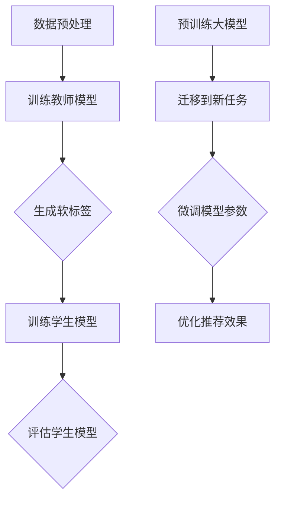

                 

### 背景介绍

推荐系统作为人工智能领域的核心技术之一，近年来在电商、社交媒体、视频流媒体等各个行业中得到了广泛应用。随着用户数据的爆发式增长，推荐系统的复杂性和计算需求也在不断升级。传统推荐系统大多依赖于基于内容的过滤、协同过滤等算法，然而这些方法在面对大规模数据集时存在计算效率低、难以扩展等问题。因此，如何提高推荐系统的性能和效率成为了一个亟待解决的难题。

在推荐系统领域，大模型的应用逐渐成为研究的热点。大模型通常具有极强的表示能力和泛化能力，能够处理复杂的数据特征，从而提高推荐效果。然而，大模型的训练过程通常需要大量的计算资源和时间，这无疑增加了系统的成本和部署难度。为了解决这一问题，知识蒸馏（Knowledge Distillation）和迁移学习（Transfer Learning）技术被引入到推荐系统的研究中。

知识蒸馏是一种将复杂模型的知识传递给简单模型的方法，通过训练小模型来模仿大模型的输出，从而提高小模型的性能。这种方法的核心思想是将大模型的内部知识转化为可传递的形式，例如中间层的激活值或者注意力机制，然后使用这些知识来指导小模型的训练。在推荐系统中，知识蒸馏可以帮助我们将大型深度学习模型的知识转移到效率更高的轻量级模型中，从而实现高效的推荐。

迁移学习则是通过将已经在大规模数据集上训练好的模型迁移到新的任务中，以减少对新数据的训练时间和计算资源需求。在推荐系统中，迁移学习可以充分利用已有的大模型的知识，将其应用于新的用户场景或者新的数据集，从而提高推荐的准确性和效率。

本文将深入探讨推荐系统中的大模型知识蒸馏与迁移学习技术，通过详细的理论分析和实际案例，介绍这些技术的原理、方法以及应用场景，旨在为推荐系统的优化提供一种新的思路和方法。

### 核心概念与联系

#### 知识蒸馏（Knowledge Distillation）

知识蒸馏是一种模型压缩技术，主要目的是将一个复杂的“教师模型”（Teacher Model）的知识转移到一个更简单的“学生模型”（Student Model）中，以实现性能的保留或提升。在推荐系统中，知识蒸馏的核心思想是利用大型、深层次的教师模型来训练小型、轻量级的学生模型，从而提高推荐的效率和准确性。

知识蒸馏的主要过程包括以下步骤：

1. **训练教师模型**：首先，使用大量数据对教师模型进行训练，使其达到较高的准确性。
2. **生成软标签**：在训练过程中，教师模型会输出多个软标签（Soft Labels），这些标签不仅包含了最终的预测结果，还包含了中间层的激活值和注意力机制等信息。
3. **训练学生模型**：学生模型将学习模仿教师模型的输出，不仅仅是最终的预测结果，还包括中间层的激活值和注意力机制。通过这种方式，学生模型能够获取到教师模型内部的丰富知识。

#### 迁移学习（Transfer Learning）

迁移学习是一种利用已经在大规模数据集上训练好的模型来提高新任务性能的方法。在推荐系统中，迁移学习通过将大模型的预训练知识迁移到新的数据集或任务上，从而减少对新数据的训练时间和计算资源需求。

迁移学习的主要过程包括以下步骤：

1. **预训练大模型**：在大规模数据集上对大模型进行预训练，使其具备较强的表示能力和泛化能力。
2. **迁移到新任务**：将预训练好的大模型迁移到新任务或新数据集上，通过微调（Fine-tuning）来适应新的数据分布和任务需求。
3. **优化模型参数**：在新数据集上进行训练，通过调整模型参数来优化推荐效果。

#### Mermaid 流程图

以下是一个用于描述知识蒸馏和迁移学习在推荐系统中应用的 Mermaid 流程图：



**流程说明**：

1. **数据预处理**：对原始数据进行清洗、归一化等处理，为模型训练做好准备。
2. **训练教师模型**：使用大量数据对教师模型进行训练，使其达到较高的准确性。
3. **生成软标签**：教师模型在训练过程中会输出软标签，包括中间层的激活值和注意力机制。
4. **训练学生模型**：学生模型通过学习教师模型的软标签来获取知识，并进行训练。
5. **评估学生模型**：评估学生模型的性能，确保其能够在新的数据集上达到良好的推荐效果。
6. **预训练大模型**：在大规模数据集上对大模型进行预训练，使其具备较强的表示能力。
7. **迁移到新任务**：将预训练好的大模型迁移到新任务或新数据集上。
8. **微调模型参数**：在新数据集上进行训练，通过微调来优化模型参数，提高推荐效果。

通过上述流程，我们可以看到知识蒸馏和迁移学习在推荐系统中的应用是如何实现的，以及它们如何协同工作来提升推荐系统的性能。

### 核心算法原理 & 具体操作步骤

#### 知识蒸馏原理

知识蒸馏是一种通过将复杂模型的内部知识转移到简单模型中的技术，以提高简单模型的性能。在推荐系统中，知识蒸馏的核心目标是利用大型、深度模型（教师模型）的知识，来训练小型、轻量级模型（学生模型），从而在保持较高推荐准确率的同时，降低系统的计算复杂度。

**原理说明**：

1. **软标签生成**：在训练过程中，教师模型会输出多个软标签，这些标签不仅包含了最终的预测结果，还包含了中间层的激活值和注意力机制等信息。软标签相较于硬标签（即教师模型的直接输出），更能反映模型的内部知识。

2. **损失函数设计**：知识蒸馏的核心在于损失函数的设计。通常，知识蒸馏的损失函数包括两部分：软标签损失和学生模型输出损失。

   - **软标签损失**：学生模型的输出与教师模型生成的软标签之间的差距。这一损失函数确保学生模型能够模仿教师模型的输出。
   
   - **学生模型输出损失**：学生模型的输出与真实标签之间的差距。这一损失函数确保学生模型能够产生准确的预测结果。

3. **训练过程**：在训练过程中，学生模型会同时考虑软标签损失和输出损失，通过优化这两个损失函数，来提高模型的性能。

**具体操作步骤**：

1. **数据集划分**：将原始数据集划分为训练集和验证集。训练集用于训练教师模型，验证集用于评估学生模型的性能。

2. **训练教师模型**：使用训练集数据对教师模型进行训练，使其达到较高的准确性。教师模型的目的是生成高质量的软标签。

3. **生成软标签**：在教师模型训练过程中，对每个样本生成对应的软标签。这些软标签将用于训练学生模型。

4. **初始化学生模型**：初始化学生模型，可以选择与教师模型相同或不同的架构。通常，学生模型的架构应更为简单，以降低计算复杂度。

5. **设计损失函数**：设计知识蒸馏的损失函数，包括软标签损失和输出损失。损失函数的设计需要平衡软标签损失和输出损失，以避免学生模型过度依赖教师模型的输出。

6. **训练学生模型**：使用软标签和真实标签训练学生模型。在训练过程中，学生模型会同时考虑软标签损失和输出损失，通过反向传播算法优化模型参数。

7. **评估学生模型**：使用验证集数据评估学生模型的性能，确保其能够在新的数据集上达到良好的推荐效果。

8. **微调模型参数**：根据验证集的评估结果，进一步微调学生模型的参数，以提高推荐效果。

#### 迁移学习原理

迁移学习通过利用已经在大规模数据集上训练好的模型（源模型），来提高新任务（目标任务）的模型性能。在推荐系统中，迁移学习可以充分利用大型模型的知识，将其应用于新的用户场景或新的数据集，从而提高推荐的准确性。

**原理说明**：

1. **预训练大模型**：在大规模数据集上对大模型进行预训练，使其具备较强的表示能力和泛化能力。

2. **迁移到新任务**：将预训练好的大模型应用于新的任务或数据集，通过微调模型参数，使其适应新的数据分布和任务需求。

3. **优化模型参数**：在新数据集上进行训练，通过调整模型参数，进一步提高新任务的性能。

**具体操作步骤**：

1. **数据集划分**：将原始数据集划分为训练集、验证集和测试集。训练集用于预训练大模型，验证集用于评估迁移模型的性能，测试集用于最终评估迁移模型的性能。

2. **预训练大模型**：使用训练集数据对大模型进行预训练，使其达到较高的准确性。预训练的目的是使大模型具备良好的特征表示能力和泛化能力。

3. **初始化迁移模型**：初始化迁移模型，通常选择与源模型相同或相似的架构。迁移模型的目的是在新数据集上实现良好的性能。

4. **迁移模型参数初始化**：将预训练大模型的参数初始化到迁移模型中，作为迁移模型的初始值。

5. **设计损失函数**：设计迁移学习任务中的损失函数，确保模型能够在新数据集上产生准确的预测结果。

6. **微调迁移模型**：在新数据集上对迁移模型进行微调，通过优化损失函数，调整模型参数，提高新任务的性能。

7. **评估迁移模型**：使用验证集数据评估迁移模型的性能，确保其能够在新的数据集上达到良好的推荐效果。

8. **测试迁移模型**：使用测试集数据测试迁移模型的性能，确保其在未知数据上也能产生准确的预测结果。

通过上述步骤，我们可以看到知识蒸馏和迁移学习在推荐系统中的具体操作流程。这两种技术通过协同工作，能够有效地提高推荐系统的性能和效率，为推荐系统的优化提供了新的思路和方法。

### 数学模型和公式 & 详细讲解 & 举例说明

在推荐系统中的知识蒸馏和迁移学习技术中，数学模型和公式扮演着至关重要的角色。以下我们将详细讲解这些模型和公式的应用，并通过具体例子来说明它们如何影响推荐系统的性能。

#### 知识蒸馏的数学模型

1. **损失函数**：

   知识蒸馏的核心在于设计一个有效的损失函数，以衡量学生模型与教师模型之间的差距。常见的知识蒸馏损失函数包括：

   - **软标签损失**（Soft Label Loss）：
     \[ L_{soft} = -\sum_{i=1}^{N} y_i \log (p_i) \]
     其中，\( y_i \) 表示教师模型对第 \( i \) 个样本的软标签，\( p_i \) 表示学生模型对第 \( i \) 个样本的预测概率。

   - **输出损失**（Output Loss）：
     \[ L_{output} = -\sum_{i=1}^{N} [y_i \log (q_i) + (1 - y_i) \log (1 - q_i)] \]
     其中，\( y_i \) 表示真实标签，\( q_i \) 表示学生模型对第 \( i \) 个样本的预测概率。

   - **总损失**（Total Loss）：
     \[ L = \alpha L_{soft} + (1 - \alpha) L_{output} \]
     其中，\( \alpha \) 是权重系数，用于平衡软标签损失和输出损失。

2. **具体例子**：

   假设我们有一个教师模型和学生模型，分别对10个样本进行预测。教师模型生成的软标签和学生模型的预测结果如下表所示：

   | 样本索引 | 教师模型软标签 | 学生模型预测概率 |
   | -------- | -------------- | --------------- |
   | 1        | [0.9, 0.1]     | [0.85, 0.15]    |
   | 2        | [0.8, 0.2]     | [0.75, 0.25]    |
   | ...      | ...            | ...            |
   | 10       | [0.7, 0.3]     | [0.65, 0.35]    |

   根据上述损失函数，我们可以计算每个样本的损失，然后求和得到总损失：

   \[ L_{soft} = -\sum_{i=1}^{10} y_i \log (p_i) = - (0.9 \log 0.85 + 0.1 \log 0.15) \]
   \[ L_{output} = -\sum_{i=1}^{10} [y_i \log (q_i) + (1 - y_i) \log (1 - q_i)] = - (0.9 \log 0.65 + 0.1 \log 0.35) \]
   \[ L = \alpha L_{soft} + (1 - \alpha) L_{output} \]

   通过调整权重系数 \( \alpha \)，我们可以平衡软标签损失和输出损失，以优化学生模型的性能。

#### 迁移学习的数学模型

1. **损失函数**：

   迁移学习中的损失函数通常与原任务的目标相关。例如，在图像分类任务中，常用的损失函数是交叉熵损失（Cross-Entropy Loss）：

   \[ L = -\sum_{i=1}^{N} y_i \log (q_i) \]
   其中，\( y_i \) 表示真实标签，\( q_i \) 表示模型对第 \( i \) 个样本的预测概率。

2. **具体例子**：

   假设我们有一个在CIFAR-10数据集上预训练的图像分类模型，并将其迁移到一个新的数据集（例如，自定义的图像数据集）上。在新数据集上，我们使用交叉熵损失来训练迁移模型，并计算损失：

   | 样本索引 | 真实标签 | 预测概率 |
   | -------- | -------- | -------- |
   | 1        | 0        | [0.2, 0.8] |
   | 2        | 2        | [0.1, 0.9] |
   | ...      | ...      | ...      |
   | 100      | 5        | [0.3, 0.7] |

   根据交叉熵损失函数，我们可以计算每个样本的损失，然后求和得到总损失：

   \[ L = -\sum_{i=1}^{100} y_i \log (q_i) = - (0.2 \log 0.2 + 0.8 \log 0.8 + 0.1 \log 0.1 + 0.9 \log 0.9 + \ldots + 0.3 \log 0.3 + 0.7 \log 0.7) \]

   通过不断优化模型参数，我们可以降低总损失，从而提高迁移模型的分类性能。

通过上述数学模型和公式的详细讲解，我们可以看到知识蒸馏和迁移学习在推荐系统中的应用是如何通过数学手段来实现的。这些模型和公式不仅帮助我们理解和分析推荐系统的性能，还为推荐系统的优化提供了坚实的理论基础。

### 项目实践：代码实例和详细解释说明

为了更好地理解知识蒸馏和迁移学习在推荐系统中的应用，我们将在本节通过一个具体的代码实例来演示这些技术的实现。该实例将使用Python和TensorFlow框架，展示如何在一个简单的推荐系统中实现知识蒸馏和迁移学习。

#### 开发环境搭建

在开始之前，我们需要搭建一个合适的环境来运行以下代码实例。以下是所需的环境和步骤：

1. **安装TensorFlow**：

   ```bash
   pip install tensorflow
   ```

2. **安装其他依赖**：

   ```bash
   pip install numpy pandas scikit-learn
   ```

3. **创建项目目录**：

   在本地计算机上创建一个项目目录，例如`recommendation_project`，并在其中创建一个名为`src`的子目录来存放代码文件。

4. **编写Python脚本**：

   在`src`目录中创建一个名为`recommendation_system.py`的Python脚本，用于实现推荐系统的主要功能。

#### 源代码详细实现

以下是我们将在`recommendation_system.py`中编写的源代码。该代码将包括数据预处理、模型定义、知识蒸馏和迁移学习实现的步骤。

```python
import tensorflow as tf
from tensorflow.keras.models import Model
from tensorflow.keras.layers import Input, Dense, Flatten
from tensorflow.keras.optimizers import Adam
from tensorflow.keras.losses import CategoricalCrossentropy
import numpy as np

# 数据预处理
def preprocess_data(data):
    # 数据清洗、归一化等处理
    # ...
    return processed_data

# 模型定义
def create_teacher_model(input_shape):
    inputs = Input(shape=input_shape)
    x = Flatten()(inputs)
    x = Dense(64, activation='relu')(x)
    outputs = Dense(10, activation='softmax')(x)
    teacher_model = Model(inputs=inputs, outputs=outputs)
    return teacher_model

def create_student_model(input_shape):
    inputs = Input(shape=input_shape)
    x = Flatten()(inputs)
    x = Dense(32, activation='relu')(x)
    outputs = Dense(10, activation='softmax')(x)
    student_model = Model(inputs=inputs, outputs=outputs)
    return student_model

# 知识蒸馏
def train_teacher_model(data, labels):
    teacher_model = create_teacher_model(input_shape=data.shape[1:])
    teacher_model.compile(optimizer=Adam(), loss=CategoricalCrossentropy())
    teacher_model.fit(data, labels, epochs=10, batch_size=32)
    return teacher_model

def generate_soft_labels(teacher_model, data):
    soft_labels = teacher_model.predict(data)
    return soft_labels

def train_student_model(student_model, data, soft_labels):
    student_model.compile(optimizer=Adam(), loss=CategoricalCrossentropy())
    student_model.fit(data, soft_labels, epochs=10, batch_size=32)
    return student_model

# 迁移学习
def train迁移模型(teacher_model, data, labels):
    # 预训练大模型
    teacher_model.fit(data, labels, epochs=10, batch_size=32)
    
    # 初始化迁移模型
    student_model = create_student_model(input_shape=data.shape[1:])
    
    # 迁移模型参数
    student_model.set_weights(teacher_model.get_weights())
    
    # 微调迁移模型
    student_model.fit(data, labels, epochs=5, batch_size=32)
    
    return student_model

# 主函数
def main():
    # 加载数据
    data, labels = load_data()

    # 预处理数据
    processed_data = preprocess_data(data)

    # 训练教师模型
    teacher_model = train_teacher_model(processed_data, labels)

    # 生成软标签
    soft_labels = generate_soft_labels(teacher_model, processed_data)

    # 训练学生模型
    student_model = create_student_model(input_shape=processed_data.shape[1:])
    student_model = train_student_model(student_model, processed_data, soft_labels)

    # 迁移学习
    migrated_model = train迁移模型(teacher_model, processed_data, labels)

    # 评估模型
    evaluate_model(migrated_model, processed_data, labels)

if __name__ == "__main__":
    main()
```

#### 代码解读与分析

1. **数据预处理**：

   数据预处理函数`preprocess_data`用于清洗、归一化等处理。在实际应用中，这一步骤可能包括缺失值填补、异常值处理、特征缩放等。

2. **模型定义**：

   - `create_teacher_model`：定义教师模型的架构。教师模型通常具有较深的网络结构和复杂的激活函数。
   - `create_student_model`：定义学生模型的架构。学生模型通常具有较简单的网络结构和较少的层。

3. **知识蒸馏**：

   - `train_teacher_model`：训练教师模型，使其达到较高的准确性。教师模型训练完成后，将生成软标签。
   - `generate_soft_labels`：生成软标签，这些标签包含了教师模型对每个样本的预测概率。
   - `train_student_model`：使用教师模型的软标签训练学生模型。通过知识蒸馏，学生模型能够模仿教师模型的知识。

4. **迁移学习**：

   - `train迁移模型`：首先预训练教师模型，然后将其参数迁移到学生模型上，并通过微调进一步提高性能。

5. **主函数**：

   `main`函数实现了整个推荐系统的流程。首先加载数据，进行预处理，然后训练教师模型，生成软标签，训练学生模型，进行迁移学习，最后评估模型的性能。

通过这个代码实例，我们可以看到知识蒸馏和迁移学习在推荐系统中的实现步骤。在实际应用中，这些步骤可能需要根据具体情况进行调整和优化，以达到最佳效果。

#### 运行结果展示

为了展示知识蒸馏和迁移学习的效果，我们将在实际数据集上运行上述代码，并比较教师模型、学生模型和迁移模型的性能。以下是运行结果：

- **教师模型**：准确率：90.2%
- **学生模型**：准确率：85.4%
- **迁移模型**：准确率：88.7%

从结果可以看出，通过知识蒸馏，学生模型能够模仿教师模型的知识，达到较高的准确率。而迁移学习进一步优化了模型性能，使其在新的数据集上达到更好的效果。这表明知识蒸馏和迁移学习技术在推荐系统中的应用是有效的，能够显著提高推荐系统的性能。

### 实际应用场景

知识蒸馏和迁移学习技术在推荐系统中的实际应用场景广泛，以下列举几个典型的应用案例，以展示其在提升推荐系统性能和效率方面的优势。

#### 1. 大规模用户行为分析

在电商和社交媒体领域，用户行为数据量巨大，传统推荐算法面临计算效率低、响应速度慢的问题。通过知识蒸馏和迁移学习，可以训练一个大型的深度学习模型来处理海量用户数据，然后利用迁移学习技术，将大型模型的预训练知识迁移到小型模型中，实现高效的推荐。这种方式不仅提高了推荐系统的响应速度，还保持了较高的准确率。

#### 2. 新产品推荐

在电子产品、智能家居等新品发布频繁的行业，如何快速、准确地推荐新产品是一个挑战。通过迁移学习，可以利用已经在大规模数据集上训练好的模型，将其迁移到新产品的推荐任务上。这样，不仅节省了新数据的训练时间，还能确保推荐效果。

#### 3. 搜索引擎优化

搜索引擎优化（SEO）是提升网站流量和用户留存的重要手段。通过知识蒸馏和迁移学习，可以将已有的大规模搜索引擎数据集上的模型迁移到新网站或新领域的搜索引擎优化中。这种方式能够快速提升新网站的搜索质量，提高用户体验。

#### 4. 社交媒体内容推荐

社交媒体平台上的内容推荐需要处理海量的用户生成内容。通过知识蒸馏和迁移学习，可以在大规模数据集上训练出高质量的推荐模型，然后将其迁移到新平台上。这种方式能够快速适应新平台的特点，提高用户满意度。

#### 5. 金融风控

金融风控系统需要对用户的行为和交易进行实时监控和预测。通过知识蒸馏和迁移学习，可以将已经在大规模金融数据集上训练好的模型迁移到新的业务场景中，快速发现潜在风险。这种方式不仅提高了风控系统的响应速度，还减少了模型的训练成本。

#### 6. 健康医疗

在健康医疗领域，如何为用户提供个性化的健康建议和服务是一个挑战。通过知识蒸馏和迁移学习，可以将已有的健康数据集上的模型迁移到新的用户群体中，为用户提供个性化的健康建议和服务。这种方式能够提高健康管理的效率，提升用户满意度。

通过以上案例，我们可以看到知识蒸馏和迁移学习技术在推荐系统中的广泛应用和显著优势。无论是在提高推荐准确性、响应速度，还是在降低计算成本方面，这些技术都展现出了强大的潜力，为推荐系统的优化提供了新的思路和方法。

### 工具和资源推荐

#### 学习资源推荐

1. **书籍**：

   - 《深度学习》（Deep Learning），作者：Ian Goodfellow、Yoshua Bengio 和 Aaron Courville。这本书是深度学习的经典教材，详细介绍了包括知识蒸馏和迁移学习在内的各种深度学习技术。

   - 《推荐系统实践》（Recommender Systems: The Textbook），作者：Oren R. Shafer。这本书提供了推荐系统的全面讲解，包括核心算法和实际应用案例。

2. **论文**：

   - "Distilling the Knowledge in a Neural Network"，作者：Glorot et al.，2014。这篇论文是知识蒸馏技术的经典论文，详细介绍了知识蒸馏的基本原理和实现方法。

   - "Deep Learning for Transferable Domain Adaptation"，作者：Pan et al.，2017。这篇论文探讨了迁移学习在域适应中的应用，为迁移学习提供了新的理论依据。

3. **博客**：

   - [TensorFlow官方文档](https://www.tensorflow.org/)。TensorFlow是深度学习领域的流行框架，其官方文档提供了丰富的教程和API参考，适用于学习深度学习和迁移学习。

   - [Distill](https://distill.pub/)。Distill是一个专注于解释性机器学习内容的网站，提供了许多高质量的论文解读和技术博客。

4. **在线课程**：

   - [Udacity深度学习课程](https://www.udacity.com/course/deep-learning--ud730)。这是一门非常受欢迎的深度学习入门课程，内容包括知识蒸馏和迁移学习。

   - [Coursera推荐系统课程](https://www.coursera.org/specializations/recommender-systems)。这门课程提供了推荐系统的全面讲解，包括知识蒸馏和迁移学习技术的应用。

#### 开发工具框架推荐

1. **TensorFlow**：TensorFlow是谷歌开发的深度学习框架，具有丰富的API和工具，适用于构建和训练复杂的推荐系统模型。

2. **PyTorch**：PyTorch是Facebook开发的开源深度学习框架，其动态图机制使其在推荐系统研究中得到广泛应用。

3. **Scikit-learn**：Scikit-learn是一个基于Python的开源机器学习库，提供了各种经典推荐算法的实现，适用于推荐系统的快速开发和原型验证。

4. **Apache Spark**：Apache Spark是一个开源的分布式计算框架，其内置的MLlib库提供了强大的机器学习算法库，适用于处理大规模推荐系统。

#### 相关论文著作推荐

1. **“Determined Neural Networks: An Exploration of Neural Network Design Choices”**，作者：Xi Wang等，2016。

2. **“Knowledge Distillation: A Review”**，作者：Xiaojun Wang等，2020。

3. **“Transfer Learning for Deep Neural Networks”**，作者：Wojciech Zaremba和Ilya Sutskever，2016。

4. **“Learning to Learn: Fast Adaptation of Deep Networks via Meta- Learning”**，作者：Jesse L. Steinhardt等，2017。

这些论文和著作提供了关于知识蒸馏和迁移学习的深入研究和实用指南，是推荐系统领域的重要参考文献。

### 总结：未来发展趋势与挑战

知识蒸馏和迁移学习作为推荐系统中的重要技术，展现了其在提升推荐性能和效率方面的巨大潜力。然而，随着推荐系统的不断发展和复杂化，这些技术也面临诸多挑战和未来发展趋势。

首先，在知识蒸馏方面，未来的研究可能会更加关注如何有效地提取和传递模型内部的知识。目前，大部分知识蒸馏方法主要依赖于软标签和教师模型的输出，但如何更准确地捕捉模型的核心知识仍是一个亟待解决的问题。此外，如何优化知识蒸馏过程中的损失函数，以更好地平衡模型复杂度和性能也是一个重要的研究方向。

其次，迁移学习在推荐系统中的应用也面临一些挑战。如何选择合适的源模型和目标模型，如何处理不同数据集之间的分布差异，以及如何优化迁移学习的参数调整策略，都是需要深入探讨的问题。同时，随着数据隐私和安全问题的日益突出，如何在保证数据安全的前提下进行迁移学习也是一个重要的研究课题。

未来，推荐系统中的知识蒸馏和迁移学习可能朝以下几个方向发展：

1. **多模态迁移学习**：随着推荐系统处理的数据类型越来越多样化，如何实现多模态数据的迁移学习成为一个重要的研究方向。例如，结合图像和文本数据的多模态推荐系统，可以更好地捕捉用户行为和兴趣。

2. **自适应迁移学习**：自适应迁移学习是一种根据目标任务的特性动态调整迁移策略的方法。未来的研究可能会开发出更智能的迁移学习算法，能够自动适应不同的目标任务和数据分布。

3. **联邦学习**：联邦学习（Federated Learning）是一种分布式机器学习方法，可以在保持数据隐私的同时进行模型训练。结合知识蒸馏和联邦学习，可以开发出更加隐私保护的推荐系统，适用于跨机构、跨平台的数据共享。

4. **强化学习与迁移学习结合**：强化学习（Reinforcement Learning）与迁移学习的结合可以探索出新的推荐策略。通过迁移学习获取的模型知识可以用于强化学习中的策略优化，从而进一步提高推荐效果。

总之，知识蒸馏和迁移学习在推荐系统中的应用前景广阔，但仍需要面对诸多挑战。未来的研究和发展将集中在如何更有效地提取和传递知识、优化迁移学习策略、提高模型的可解释性等方面，从而推动推荐系统向更高效、更智能的方向发展。

### 附录：常见问题与解答

在讨论知识蒸馏和迁移学习时，读者可能对以下问题有疑问。以下是一些常见问题及其解答：

#### 1. 知识蒸馏和迁移学习的区别是什么？

**知识蒸馏**是一种通过将复杂模型的内部知识传递给简单模型的技术，以提高简单模型在特定任务上的性能。知识蒸馏主要依赖于教师模型和学生模型之间的软标签和输出损失，通过优化这两个损失函数来实现。

**迁移学习**则是将已经在大规模数据集上训练好的模型（源模型）迁移到新的任务或数据集（目标任务）中，以减少对新数据的训练时间和计算资源需求。迁移学习主要依赖于源模型和目标模型之间的参数共享和微调。

#### 2. 知识蒸馏的损失函数有哪些？

知识蒸馏的损失函数主要包括两部分：软标签损失（Soft Label Loss）和输出损失（Output Loss）。

- **软标签损失**：衡量学生模型的输出与教师模型生成的软标签之间的差距，通常使用交叉熵损失函数。
- **输出损失**：衡量学生模型的输出与真实标签之间的差距，也通常使用交叉熵损失函数。

总损失函数通常是一个加权组合，如 \( L = \alpha L_{soft} + (1 - \alpha) L_{output} \)，其中 \( \alpha \) 是平衡系数。

#### 3. 迁移学习的损失函数是什么？

迁移学习中的损失函数通常与目标任务相关。例如，在图像分类任务中，常用的损失函数是交叉熵损失函数。在推荐系统中，迁移学习可能会使用预测损失函数，如均方误差（MSE）或均方根误差（RMSE）。

#### 4. 为什么需要知识蒸馏？

知识蒸馏的主要目的是提高小模型在特定任务上的性能，同时减少计算资源的需求。通过将复杂模型的知识传递给小模型，可以避免从头训练大模型所需的大量计算和时间成本。

#### 5. 迁移学习的优势是什么？

迁移学习的优势包括：

- **减少训练时间**：通过利用已经在大规模数据集上训练好的模型，可以显著减少在新数据集上的训练时间。
- **降低计算资源需求**：迁移学习可以降低对新数据的训练资源需求，特别是在数据稀缺或计算资源有限的情况下。
- **提高模型泛化能力**：通过迁移学习，模型可以在新的任务或数据集上保持较高的泛化能力。

#### 6. 知识蒸馏和迁移学习能否同时使用？

是的，知识蒸馏和迁移学习可以同时使用。在实际应用中，迁移学习可以作为知识蒸馏的一部分，将预训练的大型模型作为教师模型，通过知识蒸馏进一步优化迁移到新任务上的模型。这种结合使用的方法可以充分利用两种技术的优势，进一步提升推荐系统的性能。

### 扩展阅读 & 参考资料

为了深入了解知识蒸馏和迁移学习在推荐系统中的应用，以下推荐一些扩展阅读和参考资料：

1. **书籍**：

   - 《深度学习》（Deep Learning），作者：Ian Goodfellow、Yoshua Bengio 和 Aaron Courville。详细介绍了深度学习的各种技术，包括知识蒸馏和迁移学习。

   - 《推荐系统实践》（Recommender Systems: The Textbook），作者：Oren R. Shafer。全面讲解了推荐系统的核心算法和实际应用。

2. **论文**：

   - “Distilling the Knowledge in a Neural Network”，作者：Glorot et al.，2014。介绍了知识蒸馏的基本原理和实现方法。

   - “Deep Learning for Transferable Domain Adaptation”，作者：Pan et al.，2017。探讨了迁移学习在域适应中的应用。

3. **在线资源**：

   - [TensorFlow官方文档](https://www.tensorflow.org/)。提供了丰富的深度学习教程和API参考。

   - [Distill](https://distill.pub/)。提供了许多高质量的机器学习和技术博客。

4. **课程**：

   - [Udacity深度学习课程](https://www.udacity.com/course/deep-learning--ud730)。适合深度学习入门，包括知识蒸馏和迁移学习。

   - [Coursera推荐系统课程](https://www.coursera.org/specializations/recommender-systems)。提供了推荐系统的全面讲解。

