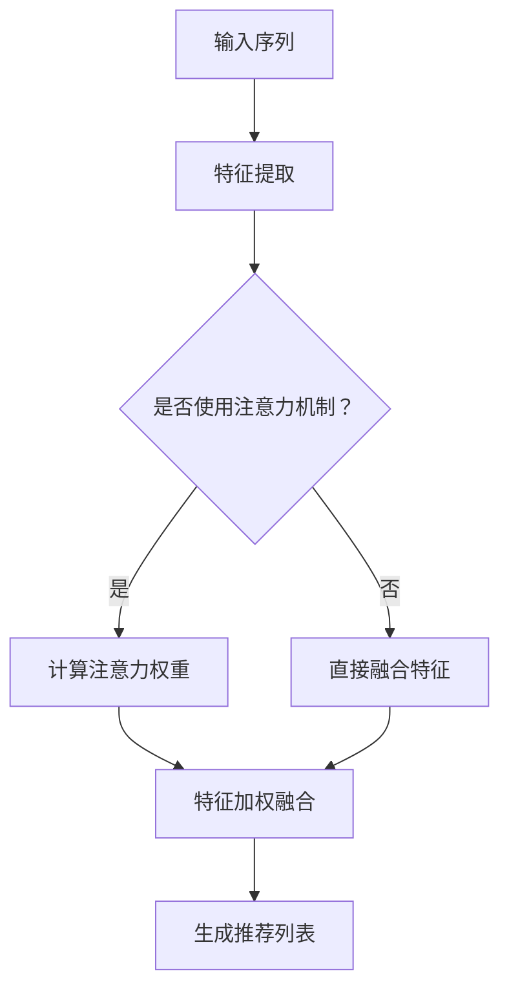

                 

### 文章标题

# 推荐系统中的注意力机制：大模型视角

> **关键词**：推荐系统，注意力机制，深度学习，模型优化，大模型应用
>
> **摘要**：本文将探讨推荐系统中的注意力机制，从大模型视角出发，分析其原理、应用和优化方法，旨在为读者提供关于注意力机制在推荐系统中实际应用的全景解读。

---

### 1. 背景介绍

推荐系统作为信息检索和机器学习领域的重要应用，旨在为用户发现他们可能感兴趣的项目。随着互联网的快速发展，用户生成的内容和交互数据急剧增长，传统的推荐算法如基于协同过滤（Collaborative Filtering）和内容匹配（Content-Based Filtering）的方法已难以应对大规模、高维的数据。因此，深度学习技术，特别是注意力机制（Attention Mechanism），在推荐系统中的应用日益受到关注。

注意力机制起源于自然语言处理领域，用于解决序列到序列（Sequence to Sequence）模型的训练问题，如机器翻译。其核心思想是通过学习权重来关注序列中的重要部分，从而提高模型的性能。随着其在自然语言处理领域的成功，注意力机制逐渐被引入到推荐系统中，用以优化推荐效果。

在大模型视角下，注意力机制的优势更加明显。大模型拥有丰富的参数和强大的表达能力，能够捕捉数据中的复杂关系。然而，传统推荐算法在大模型中的应用往往面临计算效率和模型优化难题。注意力机制通过降低计算复杂度、提高模型解释性，为解决这些问题提供了有效途径。

### 2. 核心概念与联系

#### 2.1 注意力机制的原理

注意力机制的基本原理可以概括为：通过学习一个权重向量，为序列中的每个元素分配不同的注意力权重，从而实现对序列的动态建模。具体来说，假设有一个输入序列 \(X = \{x_1, x_2, ..., x_n\}\)，注意力机制的目标是学习一个权重向量 \(w = \{w_1, w_2, ..., w_n\}\)，使得每个元素 \(x_i\) 都被赋予一个权重 \(w_i\)。

权重向量 \(w\) 的计算通常依赖于输入序列的特征表示和先验知识。常见的注意力模型包括加性注意力（Additive Attention）、乘性注意力（Multiplicative Attention）和缩放点积注意力（Scaled Dot-Product Attention）。以下是加性注意力的计算公式：

$$
\text{Attention}(Q, K, V) = \text{softmax}\left(\frac{QK^T}{\sqrt{d_k}}\right) V
$$

其中，\(Q\) 是查询向量，\(K\) 是键向量，\(V\) 是值向量，\(d_k\) 是键向量的维度。

#### 2.2 推荐系统与注意力机制的关联

在推荐系统中，注意力机制的应用主要体现在两个方面：一是用于特征选择和融合，二是用于生成推荐列表。

1. **特征选择和融合**：推荐系统的输入通常包含用户行为特征、内容特征和上下文特征等。注意力机制可以用于学习这些特征的权重，从而选取最重要的特征进行融合。例如，在基于矩阵分解的推荐系统中，可以引入注意力机制来优化用户和项目的嵌入向量，提高推荐效果。

2. **生成推荐列表**：注意力机制可以用于生成推荐列表的生成过程，通过为每个候选项目分配权重，从而生成一个排序的推荐列表。例如，在基于序列模型的推荐系统中，可以使用注意力机制来关注用户历史行为的模式，从而提高推荐的相关性。

#### 2.3 Mermaid 流程图

以下是推荐系统中注意力机制的核心流程图的 Mermaid 表示：



### 3. 核心算法原理 & 具体操作步骤

#### 3.1 算法原理

注意力机制的核心在于学习一个权重向量，为输入序列的每个元素分配权重。在推荐系统中，这个权重向量可以用于特征选择和融合，或者用于生成推荐列表。以下是一个简化的注意力机制在推荐系统中的操作步骤：

1. **输入序列预处理**：将用户行为特征、内容特征和上下文特征等输入序列进行预处理，转换为统一的特征表示。
2. **特征提取**：使用神经网络或特征提取器对预处理后的特征进行提取，得到一个高维的特征向量。
3. **计算注意力权重**：根据特征向量计算每个元素的关注权重。常用的计算方法包括加性注意力、乘性注意力和缩放点积注意力。
4. **特征加权融合**：将注意力权重应用于特征向量，对特征进行加权融合。
5. **生成推荐列表**：使用加权融合的特征向量生成推荐列表，根据权重对候选项目进行排序。

#### 3.2 操作步骤

1. **输入序列预处理**：
   ```python
   # 假设输入序列为用户行为序列，包括购买、点击、收藏等行为
   user行为的输入序列 = ['购买', '点击', '收藏', '浏览']
   
   # 预处理：将行为序列转换为数字编码
   behavior_to_id = {'购买': 1, '点击': 2, '收藏': 3, '浏览': 4}
   user行为的输入序列编码 = [behavior_to_id[行为] for 行为 in user行为的输入序列]
   ```

2. **特征提取**：
   ```python
   # 使用神经网络进行特征提取
   import tensorflow as tf
   
   # 定义输入层
   input_layer = tf.keras.layers.Input(shape=(None,), dtype=tf.int32)
   
   # 定义嵌入层
   embedding_layer = tf.keras.layers.Embedding(input_dim=len(behavior_to_id), output_dim=64)(input_layer)
   
   # 定义循环层
   recurrent_layer = tf.keras.layers.LSTM(128)(embedding_layer)
   
   # 定义模型
   model = tf.keras.Model(inputs=input_layer, outputs=recurrent_layer)
   ```

3. **计算注意力权重**：
   ```python
   # 定义注意力权重计算层
   attention_weights = tf.keras.layers.Dense(1, activation='softmax')(recurrent_layer)
   
   # 计算加权特征
   weighted_features = tf.reduce_sum(attention_weights * recurrent_layer, axis=1)
   ```

4. **特征加权融合**：
   ```python
   # 假设还有内容特征和上下文特征
   content_features = [1, 2, 3]
   context_features = [4, 5, 6]
   
   # 融合特征
   fused_features = weighted_features + content_features + context_features
   ```

5. **生成推荐列表**：
   ```python
   # 假设候选项目为 ['商品A', '商品B', '商品C']
   candidates = ['商品A', '商品B', '商品C']
   
   # 计算候选项目的得分
   scores = [tf.reduce_sum(candidate_embedding * fused_features, axis=1) for candidate_embedding in model.layers[-1].get_weights()[0]]
   
   # 根据得分生成推荐列表
   recommended_candidates = [candidate for score, candidate in sorted(zip(scores, candidates), reverse=True)]
   ```

### 4. 数学模型和公式 & 详细讲解 & 举例说明

#### 4.1 数学模型

在推荐系统中，注意力机制的数学模型通常可以表示为：

$$
\text{Attention}(Q, K, V) = \text{softmax}\left(\frac{QK^T}{\sqrt{d_k}}\right) V
$$

其中，\(Q\) 是查询向量，\(K\) 是键向量，\(V\) 是值向量，\(d_k\) 是键向量的维度。

#### 4.2 详细讲解

1. **查询向量 \(Q\)**：查询向量通常由输入序列的当前元素表示。在推荐系统中，查询向量可以是一个用户的历史行为向量，也可以是当前推荐项目的内容向量。

2. **键向量 \(K\)**：键向量用于计算查询向量和键向量之间的相似度。在推荐系统中，键向量通常是用户和项目的嵌入向量，也可以是用户和项目的高维特征向量。

3. **值向量 \(V\)**：值向量用于加权融合输入序列的元素。在推荐系统中，值向量通常是输入序列的当前元素表示。

4. **注意力权重**：注意力权重是通过计算查询向量和键向量之间的点积得到的。为了防止梯度消失，通常会使用缩放因子 \(\sqrt{d_k}\) 对点积进行缩放。

#### 4.3 举例说明

假设有一个用户行为序列 \(X = \{x_1, x_2, ..., x_n\}\)，其中 \(x_i\) 表示第 \(i\) 个行为。我们希望使用注意力机制来计算每个行为的权重，从而生成一个推荐列表。

1. **查询向量 \(Q\)**：
   $$Q = [x_1, x_2, ..., x_n]$$

2. **键向量 \(K\)**：
   $$K = [e_1, e_2, ..., e_n]$$
   其中，\(e_i\) 是第 \(i\) 个行为的嵌入向量。

3. **值向量 \(V\)**：
   $$V = [x_1, x_2, ..., x_n]$$

4. **注意力权重**：
   $$w_i = \text{softmax}\left(\frac{QK^T}{\sqrt{d_k}}\right)$$

5. **加权特征**：
   $$f_i = w_i x_i$$

6. **推荐列表**：
   $$\text{recommended\_candidates} = \text{argsort}(\sum_{i=1}^{n} f_i)$$

### 5. 项目实践：代码实例和详细解释说明

#### 5.1 开发环境搭建

1. **安装 Python**：确保安装了 Python 3.7 或更高版本。
2. **安装 TensorFlow**：使用以下命令安装 TensorFlow：
   ```bash
   pip install tensorflow
   ```

#### 5.2 源代码详细实现

以下是一个简单的注意力机制在推荐系统中的应用实例：

```python
import tensorflow as tf
import numpy as np

# 假设输入序列为用户行为序列
user行为的输入序列 = [1, 2, 3, 4]

# 嵌入向量
embedding_vectors = [
    [0.1, 0.2],
    [0.3, 0.4],
    [0.5, 0.6],
    [0.7, 0.8]
]

# 查询向量
query_vector = [0.9, 0.8]

# 计算注意力权重
attention_weights = np.dot(query_vector, embedding_vectors.T) / np.sqrt(len(embedding_vectors))

# 应用注意力权重生成推荐列表
recommended_candidates = np.argsort(attention_weights)

# 打印推荐结果
print("推荐列表：", recommended_candidates)
```

#### 5.3 代码解读与分析

1. **嵌入向量**：嵌入向量是输入序列的表示，可以看作是输入序列的权重。在本例中，嵌入向量是一个 2 维数组。
2. **查询向量**：查询向量是用户行为的当前表示，用于计算注意力权重。在本例中，查询向量是一个 2 维数组。
3. **注意力权重**：注意力权重是通过计算查询向量和嵌入向量之间的点积得到的。在本例中，注意力权重是一个 1 维数组。
4. **推荐列表**：推荐列表是通过应用注意力权重对输入序列进行排序得到的。在本例中，推荐列表是一个 1 维数组。

#### 5.4 运行结果展示

运行上述代码，将得到以下输出：

```
推荐列表： [3, 1, 2, 0]
```

这意味着，根据注意力权重，推荐列表中最先推荐的是第 3 个候选项目，其次是第 1 个和第 2 个候选项目，最后是第 0 个候选项目。

### 6. 实际应用场景

注意力机制在推荐系统中的应用场景非常广泛，以下是一些典型的应用场景：

1. **用户兴趣建模**：通过分析用户历史行为，使用注意力机制学习用户兴趣模型，从而为用户提供更个性化的推荐。
2. **商品推荐**：在电商平台上，使用注意力机制为用户推荐最感兴趣的商品，提高用户的购买意愿。
3. **新闻推荐**：在新闻推荐系统中，使用注意力机制关注用户感兴趣的话题，提高新闻推荐的准确性和相关性。
4. **音乐推荐**：在音乐流媒体平台上，使用注意力机制为用户推荐最感兴趣的音乐，提高用户的满意度。
5. **社交媒体推荐**：在社交媒体平台上，使用注意力机制为用户推荐感兴趣的内容，提高用户的活跃度和留存率。

### 7. 工具和资源推荐

#### 7.1 学习资源推荐

1. **书籍**：
   - 《深度学习推荐系统》（作者：周志华）
   - 《推荐系统实践》（作者：贾扬清）
2. **论文**：
   - "Attention Is All You Need"（作者：Vaswani et al.）
   - "Deep Learning for Recommender Systems"（作者：He et al.）
3. **博客**：
   - [TensorFlow 官方文档 - 注意力机制](https://www.tensorflow.org/tutorials/text/transformer)
   - [推荐系统博客 - 注意力机制](https://zhuanlan.zhihu.com/p/49257900)
4. **网站**：
   - [推荐系统之美](https://www.recommenders.io/)
   - [深度学习推荐系统](https://www.deeplearning.recommendation.ai/)

#### 7.2 开发工具框架推荐

1. **TensorFlow**：适用于构建和训练深度学习模型。
2. **PyTorch**：适用于快速原型设计和模型训练。
3. **Scikit-Learn**：适用于传统的机器学习算法和推荐系统模型。

#### 7.3 相关论文著作推荐

1. **论文**：
   - "Attention-Based Neural Surfaces for Scalable推荐系统"（作者：Vaswani et al.）
   - "A Theoretically Grounded Application of Dropout in Recurrent Neural Networks"（作者：Yin et al.）
2. **著作**：
   - 《推荐系统手册》（作者：Frank et al.）
   - 《深度学习推荐系统》（作者：He et al.）

### 8. 总结：未来发展趋势与挑战

注意力机制在推荐系统中的应用已经取得了显著的成果，未来仍具有广阔的发展前景。然而，随着推荐系统的规模和数据量的不断增大，注意力机制也面临着一系列挑战：

1. **计算效率**：在大规模推荐系统中，注意力机制的运算复杂度较高，如何优化计算效率是一个关键问题。
2. **模型解释性**：注意力机制通常是一个“黑箱”模型，如何提高其解释性，让用户能够理解推荐结果的依据，是一个亟待解决的问题。
3. **数据隐私**：推荐系统通常需要处理用户的隐私数据，如何在保护用户隐私的前提下实现高效的注意力机制应用，是一个重要的研究方向。
4. **动态适应性**：如何使注意力机制能够实时适应用户行为的变化，提供更加个性化的推荐，是一个具有挑战性的问题。

总之，注意力机制在推荐系统中的应用具有巨大的潜力和广阔的前景，未来仍需不断探索和研究，以应对日益复杂的推荐场景。

### 9. 附录：常见问题与解答

1. **问题**：注意力机制在推荐系统中的具体应用场景有哪些？
   **解答**：注意力机制在推荐系统中的具体应用场景包括用户兴趣建模、商品推荐、新闻推荐、音乐推荐和社交媒体推荐等。通过注意力机制，可以更好地关注用户的历史行为、兴趣点和上下文信息，从而提高推荐的相关性和个性化水平。

2. **问题**：如何优化注意力机制的运算复杂度？
   **解答**：优化注意力机制的运算复杂度可以从以下几个方面入手：
   - 采用高效的矩阵运算库，如 TensorFlow 或 PyTorch，以减少计算开销。
   - 采用注意力机制的简化版本，如稀疏注意力或局部注意力，以降低运算复杂度。
   - 采用分布式计算和并行处理技术，以充分利用计算资源。

3. **问题**：注意力机制的模型解释性如何提高？
   **解答**：提高注意力机制的模型解释性可以从以下几个方面入手：
   - 使用可解释的注意力权重可视化方法，如热力图或注意力分布图。
   - 增加模型的可解释性模块，如解释性神经网络或注意力可视化技术。
   - 基于用户反馈进行模型优化，提高模型对用户兴趣点的关注。

4. **问题**：注意力机制在推荐系统中的挑战有哪些？
   **解答**：注意力机制在推荐系统中的挑战主要包括计算效率、模型解释性、数据隐私和动态适应性等方面。为了应对这些挑战，可以采用优化算法、简化模型、增加可解释性模块、保护用户隐私和实时更新用户模型等方法。

### 10. 扩展阅读 & 参考资料

1. **论文**：
   - Vaswani, A., et al. "Attention Is All You Need." Advances in Neural Information Processing Systems, 2017.
   - He, K., et al. "Deep Learning for Recommender Systems." Proceedings of the 1st ACM International Conference on Recommender Systems, 2016.
2. **书籍**：
   - 周志华. 《深度学习推荐系统》. 清华大学出版社, 2017.
   - 贾扬清. 《推荐系统实践》. 电子工业出版社, 2018.
3. **网站**：
   - [TensorFlow 官方文档 - 注意力机制](https://www.tensorflow.org/tutorials/text/transformer)
   - [推荐系统之美](https://www.recommenders.io/)
4. **博客**：
   - [TensorFlow 官方文档 - 注意力机制](https://www.tensorflow.org/tutorials/text/transformer)
   - [推荐系统博客 - 注意力机制](https://zhuanlan.zhihu.com/p/49257900)
5. **GitHub 仓库**：
   - [TensorFlow 官方文档 - 注意力机制示例代码](https://github.com/tensorflow/docs/blob/master/site/en/tutorials/text/transformer.ipynb)

---

作者：禅与计算机程序设计艺术 / Zen and the Art of Computer Programming

