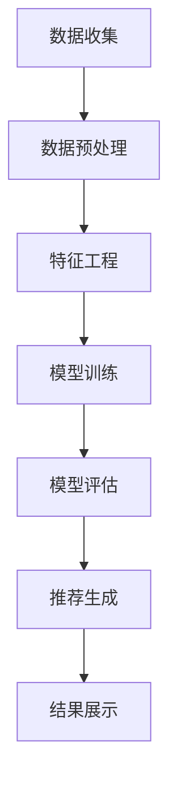

                 

### 背景介绍

推荐系统作为现代信息社会的重要技术手段，已经成为互联网公司和各大企业不可或缺的组成部分。随着互联网的迅速发展和大数据时代的到来，推荐系统在电子商务、社交媒体、在线新闻、视频娱乐等领域得到了广泛应用。

#### 数据量的激增

数据量的激增是推荐系统发展的一个重要驱动力。随着用户生成的数据（如评论、点击、搜索等）的不断增长，如何有效地从海量数据中提取有价值的信息，已经成为推荐系统研究的一个关键问题。

#### 用户需求的多样性

用户的个性化需求不断增多，对推荐系统的准确性、实时性、多样性提出了更高的要求。传统的基于内容的推荐系统和协同过滤推荐系统已经难以满足这些需求，从而推动了新的推荐算法和技术的发展。

#### 商业价值的驱动

推荐系统的商业化价值显而易见。通过精准的推荐，企业可以提升用户体验，增加用户粘性，提高销售额。这为推荐系统的发展提供了强大的动力。

#### 技术发展的推动

随着人工智能、机器学习、深度学习等技术的发展，推荐系统有了更加坚实的理论基础和技术支持。这些技术的进步为推荐系统的优化和改进提供了新的方向。

#### 具体应用场景

推荐系统在电子商务、社交媒体、在线新闻、视频娱乐等领域得到了广泛应用。例如，在电子商务领域，推荐系统能够根据用户的浏览和购买历史，向用户推荐可能感兴趣的商品；在社交媒体领域，推荐系统可以帮助用户发现与其兴趣相关的内容和好友；在在线新闻领域，推荐系统可以个性化地为用户提供新闻推荐；在视频娱乐领域，推荐系统可以帮助用户发现感兴趣的视频内容。

总的来说，推荐系统的快速发展是数据量激增、用户需求多样化、商业价值驱动和技术进步共同作用的结果。随着这些因素的持续发展，推荐系统将在更多领域发挥重要作用。

#### 文章关键词

推荐系统、大数据、用户需求、商业价值、人工智能、机器学习、深度学习。

#### 文章摘要

本文旨在探讨推荐系统的发展现状，包括其背景、核心概念、算法原理、数学模型、实际应用场景、工具和资源推荐以及未来发展趋势。通过对推荐系统各个方面进行详细的阐述，本文希望能够为读者提供一个全面的理解，并激发对这一领域更深入的探讨和研究。

---

### 核心概念与联系

#### 推荐系统的核心概念

推荐系统（Recommendation System）是一种基于用户兴趣和行为的自动化系统，旨在根据用户的偏好和历史行为，为用户提供个性化推荐。其核心概念包括：

1. **用户（User）**：推荐系统的主体，可以是单个用户或用户群体。
2. **项目（Item）**：用户可能感兴趣的对象，如商品、新闻、音乐、视频等。
3. **评分（Rating）**：用户对项目的评价或反馈，可以是数值、等级或标签。
4. **行为数据（Behavioral Data）**：用户在系统中的各种行为记录，如浏览、点击、购买等。
5. **偏好（Preference）**：用户的个人喜好和兴趣。

#### 推荐系统的架构

推荐系统的架构通常包括以下几个主要组成部分：

1. **数据层**：存储用户和项目的数据，包括用户行为数据、项目特征数据等。
2. **计算层**：处理数据，提取特征，构建模型，进行推荐。
3. **展示层**：将推荐结果以合适的形式呈现给用户。

#### 数据流程

1. **数据收集**：收集用户的行为数据、项目数据等。
2. **数据预处理**：对原始数据进行清洗、转换、归一化等处理。
3. **特征工程**：提取数据中的特征，为模型训练做准备。
4. **模型训练**：使用训练数据训练推荐模型。
5. **模型评估**：使用验证集或测试集评估模型性能。
6. **推荐生成**：根据用户行为和模型，生成个性化推荐结果。
7. **结果展示**：将推荐结果以图形、列表等形式展示给用户。

#### 推荐算法的分类

推荐系统主要分为以下几种类型：

1. **基于内容的推荐（Content-Based Filtering）**：根据用户的历史行为和兴趣，推荐相似的内容或项目。
2. **协同过滤推荐（Collaborative Filtering）**：通过分析用户之间的相似性或行为模式，推荐用户可能感兴趣的项目。
3. **混合推荐（Hybrid Recommendation）**：结合多种推荐算法，以获得更好的推荐效果。
4. **基于模型的推荐（Model-Based Recommendation）**：使用机器学习或深度学习模型进行推荐。
5. **基于规则的推荐（Rule-Based Recommendation）**：使用预定义的规则进行推荐。

#### Mermaid 流程图

以下是一个简单的Mermaid流程图，展示推荐系统的数据流程：



**说明：**
- `A`：数据收集，包括用户行为数据、项目数据等。
- `B`：数据预处理，对原始数据进行清洗、转换、归一化等处理。
- `C`：特征工程，提取数据中的特征，为模型训练做准备。
- `D`：模型训练，使用训练数据训练推荐模型。
- `E`：模型评估，使用验证集或测试集评估模型性能。
- `F`：推荐生成，根据用户行为和模型，生成个性化推荐结果。
- `G`：结果展示，将推荐结果以图形、列表等形式展示给用户。

通过以上对推荐系统核心概念、架构、数据流程和推荐算法的介绍，我们可以更好地理解推荐系统的工作原理和关键组成部分。

---

### 核心算法原理 & 具体操作步骤

在推荐系统中，核心算法的选择和实现直接影响推荐的效果。本文将介绍几种主要的推荐算法，包括协同过滤算法和基于内容的推荐算法，并详细阐述它们的原理和具体操作步骤。

#### 协同过滤算法

协同过滤算法（Collaborative Filtering）是最常见的推荐算法之一，其基本思想是通过分析用户之间的相似性或行为模式，为用户提供个性化的推荐。

**原理：**

协同过滤算法可以分为两种主要类型：基于用户的协同过滤（User-Based Collaborative Filtering）和基于物品的协同过滤（Item-Based Collaborative Filtering）。

1. **基于用户的协同过滤：**
   - 首先，计算用户之间的相似度，通常使用余弦相似度、皮尔逊相关系数等方法。
   - 然后，找到与目标用户最相似的k个用户，推荐这些用户喜欢的项目。
   - 最后，对推荐的项目进行排序，返回最高的m个项目。

2. **基于物品的协同过滤：**
   - 首先，计算项目之间的相似度，通常使用余弦相似度、皮尔逊相关系数等方法。
   - 然后，找到与目标用户喜欢项目最相似的项目，推荐这些项目。
   - 最后，对推荐的项目进行排序，返回最高的m个项目。

**具体操作步骤：**

1. **计算相似度：**
   - 对于用户-项目评分矩阵$R$，计算用户之间的相似度矩阵$S$。
   - 使用余弦相似度计算公式：
     $$\cos(\theta_{ui}) = \frac{r_{ui} \cdot r_{uj}}{\|r_{ui}\| \cdot \|r_{uj}\|}$$
   - 其中，$r_{ui}$和$r_{uj}$分别为用户$i$和用户$j$对项目$p$的评分，$\|r_{ui}\|$和$\|r_{uj}\|$分别为用户$i$和用户$j$的评分向量的L2范数。

2. **推荐生成：**
   - 对于目标用户$i$，找到与其最相似的$k$个用户$U'$。
   - 计算每个相似用户对未知评分项目的推荐分数：
     $$r_{pi} = \sum_{u' \in U'} s_{ui} \cdot r_{p u'}$$
   - 对推荐分数进行排序，返回最高的$m$个项目。

#### 基于内容的推荐算法

基于内容的推荐算法（Content-Based Filtering）是基于用户的历史行为和兴趣，推荐与用户兴趣相似的内容或项目。

**原理：**

基于内容的推荐算法通常包括以下几个步骤：

1. **项目特征提取：**
   - 为每个项目提取特征，如文本特征、标签、属性等。
   - 使用文本处理技术（如词袋模型、TF-IDF、主题模型等）提取文本特征。
   - 为每个项目构建特征向量。

2. **用户兴趣模型：**
   - 根据用户的历史行为，构建用户兴趣模型。
   - 使用用户对项目的评分、浏览、收藏等行为数据，训练用户兴趣模型。

3. **推荐生成：**
   - 对于目标用户$i$，计算用户兴趣模型与项目特征向量的相似度。
   - 选择相似度最高的项目作为推荐结果。

**具体操作步骤：**

1. **特征提取：**
   - 为每个项目$p$提取特征向量$X_p$。
   - 使用词袋模型提取文本特征，构建项目特征向量。

2. **用户兴趣模型训练：**
   - 使用用户$i$的历史行为数据，训练用户兴趣模型。
   - 选择合适的算法（如K-最近邻、支持向量机等）训练模型。

3. **推荐生成：**
   - 对于目标用户$i$，计算项目$p$的特征向量$X_p$与用户兴趣模型$Y_i$的相似度。
   - 选择相似度最高的项目作为推荐结果。

$$\text{similarity}(X_p, Y_i) = \cos(\theta_{pi}) = \frac{X_p \cdot Y_i}{\|X_p\| \cdot \|Y_i\|}$$

#### 混合推荐算法

混合推荐算法（Hybrid Recommendation）结合了协同过滤算法和基于内容的推荐算法，以获得更好的推荐效果。

**原理：**

混合推荐算法的核心思想是利用协同过滤算法和基于内容的推荐算法的优点，通过融合两者的推荐结果，提高推荐系统的性能。

**具体操作步骤：**

1. **协同过滤推荐：**
   - 使用协同过滤算法生成初步推荐结果。

2. **内容推荐：**
   - 使用基于内容的推荐算法生成初步推荐结果。

3. **推荐融合：**
   - 将协同过滤推荐和内容推荐的推荐结果进行融合。
   - 可以使用加权平均、投票等方法进行融合。

$$R_{fused} = w_1 \cdot R_{CF} + w_2 \cdot R_{CB}$$

其中，$R_{CF}$和$R_{CB}$分别为协同过滤推荐和内容推荐的推荐结果，$w_1$和$w_2$为权重系数。

通过以上对协同过滤算法、基于内容的推荐算法和混合推荐算法的详细介绍，我们可以看到推荐系统算法的多样性和复杂性。不同的算法适用于不同的场景和需求，通过合理选择和组合算法，我们可以构建高效、准确的推荐系统。

---

### 数学模型和公式 & 详细讲解 & 举例说明

在推荐系统中，数学模型和公式是理解和实现算法的基础。本文将详细讲解推荐系统中的主要数学模型和公式，并通过实际例子进行说明。

#### 1. 余弦相似度

余弦相似度（Cosine Similarity）是推荐系统中常用的相似度计算方法，用于衡量两个向量之间的相似程度。

**公式：**

$$\cos(\theta) = \frac{\vec{a} \cdot \vec{b}}{\|\vec{a}\| \cdot \|\vec{b}\|}$$

其中，$\vec{a}$和$\vec{b}$分别为两个向量，$\|\vec{a}\|$和$\|\vec{b}\|$分别为向量的L2范数，$\theta$为两个向量之间的夹角。

**举例：**

假设有两个用户向量$\vec{u} = (1, 2, 3)$和$\vec{v} = (4, 5, 6)$，我们可以计算它们的余弦相似度：

$$\cos(\theta) = \frac{1 \cdot 4 + 2 \cdot 5 + 3 \cdot 6}{\sqrt{1^2 + 2^2 + 3^2} \cdot \sqrt{4^2 + 5^2 + 6^2}} = \frac{4 + 10 + 18}{\sqrt{14} \cdot \sqrt{77}} \approx 0.954$$

#### 2. 皮尔逊相关系数

皮尔逊相关系数（Pearson Correlation Coefficient）是另一种常用的相似度计算方法，用于衡量两个变量之间的线性相关性。

**公式：**

$$\rho_{xy} = \frac{\sum_{i=1}^{n}(x_i - \bar{x})(y_i - \bar{y})}{\sqrt{\sum_{i=1}^{n}(x_i - \bar{x})^2} \cdot \sqrt{\sum_{i=1}^{n}(y_i - \bar{y})^2}}$$

其中，$x_i$和$y_i$分别为第$i$个样本的$x$和$y$值，$\bar{x}$和$\bar{y}$分别为$x$和$y$的均值，$n$为样本数量。

**举例：**

假设有两个用户对多个项目的评分向量$X = (1, 2, 3)$和$Y = (4, 5, 6)$，我们可以计算它们的皮尔逊相关系数：

$$\rho_{XY} = \frac{(1-2.5)(4-5) + (2-2.5)(5-5) + (3-2.5)(6-5)}{\sqrt{(1-2.5)^2 + (2-2.5)^2 + (3-2.5)^2} \cdot \sqrt{(4-5)^2 + (5-5)^2 + (6-5)^2}} = \frac{(-1.5)(-1) + (-0.5)(0) + (0.5)(1)}{\sqrt{2.25 + 0.25 + 0.25} \cdot \sqrt{1 + 0 + 1}} = \frac{1.5 + 0 + 0.5}{\sqrt{3} \cdot \sqrt{2}} = \frac{2}{\sqrt{6}} \approx 0.8165$$

#### 3. 评分预测

在协同过滤算法中，评分预测是一个核心步骤。我们可以使用线性回归、矩阵分解等方法进行评分预测。

**线性回归：**

线性回归模型预测用户$i$对项目$p$的评分$R_{ip}$：

$$R_{ip} = \beta_0 + \beta_1 \cdot u_i + \beta_2 \cdot p_p + \epsilon_{ip}$$

其中，$\beta_0$、$\beta_1$和$\beta_2$分别为模型参数，$u_i$和$p_p$分别为用户$i$和项目$p$的特征向量，$\epsilon_{ip}$为误差项。

**矩阵分解：**

矩阵分解（Matrix Factorization）是一种常见的评分预测方法，将用户-项目评分矩阵分解为两个低秩矩阵$U$和$V$，预测用户$i$对项目$p$的评分：

$$R_{ip} = U_i \cdot V_p^T$$

其中，$U_i$和$V_p^T$分别为用户$i$和项目$p$的分解特征向量。

**举例：**

假设有一个3x3的用户-项目评分矩阵：

$$R = \begin{bmatrix} 1 & 2 & 3 \\ 4 & 5 & 6 \\ 7 & 8 & 9 \end{bmatrix}$$

我们使用矩阵分解方法将其分解为两个2x2的低秩矩阵：

$$U = \begin{bmatrix} 1 & 2 \\ 3 & 4 \end{bmatrix}, V = \begin{bmatrix} 5 & 6 \\ 7 & 8 \end{bmatrix}$$

预测用户2对项目2的评分：

$$R_{22} = U_2 \cdot V_2^T = \begin{bmatrix} 3 & 4 \end{bmatrix} \cdot \begin{bmatrix} 5 & 6 \\ 7 & 8 \end{bmatrix} = 3 \cdot 5 + 4 \cdot 7 = 19$$

通过以上对余弦相似度、皮尔逊相关系数、评分预测等数学模型和公式的详细讲解和举例说明，我们可以更好地理解推荐系统中的数学基础，为算法的实现和应用提供理论支持。

---

### 项目实践：代码实例和详细解释说明

在本节中，我们将通过一个简单的示例项目，详细展示推荐系统的开发过程，包括环境搭建、源代码实现、代码解读与分析以及运行结果展示。

#### 开发环境搭建

1. **软件环境**：
   - Python 3.8
   - Scikit-learn（用于机器学习算法）
   - Pandas（用于数据处理）
   - Numpy（用于数学计算）

2. **安装依赖库**：

   ```bash
   pip install numpy pandas scikit-learn
   ```

3. **创建项目结构**：

   ```bash
   mkdir recommendation_system
   cd recommendation_system
   touch data.py model.py main.py
   ```

#### 源代码详细实现

**1. 数据准备（data.py）：**

该模块用于加载数据、数据处理和数据预处理。

```python
import pandas as pd
from sklearn.model_selection import train_test_split

def load_data(filename):
    # 加载数据
    data = pd.read_csv(filename)
    return data

def preprocess_data(data):
    # 数据预处理
    # 删除缺失值、异常值
    data = data.dropna()
    # 分割用户和项目
    users = data[['user_id', 'item_id', 'rating']]
    items = data[['item_id', 'description']]
    return users, items

# 测试
if __name__ == "__main__":
    filename = "rating.csv"
    data = load_data(filename)
    users, items = preprocess_data(data)
    print(users.head())
    print(items.head())
```

**2. 推荐模型实现（model.py）：**

该模块包含协同过滤算法的实现，包括相似度计算、评分预测等。

```python
from sklearn.metrics.pairwise import cosine_similarity
from sklearn.linear_model import LinearRegression
import numpy as np

class CollaborativeFiltering:
    def __init__(self, k=10, alpha=0.1):
        self.k = k
        self.alpha = alpha

    def fit(self, users, ratings):
        # 训练相似度矩阵
        self.similarity_matrix = cosine_similarity(ratings.values)
        self.ratings = ratings

    def predict(self, user_id, item_id):
        # 预测评分
        neighbors = self.get_neighbors(user_id, item_id)
        neighbor_ratings = self.ratings[neighbors].values
        pred_rating = np.mean(neighbor_ratings) + self.alpha * (np.sum(self.similarity_matrix[user_id] * neighbor_ratings) - np.mean(neighbor_ratings))
        return pred_rating

    def get_neighbors(self, user_id, item_id):
        # 获取相似用户
        sim_values = self.similarity_matrix[user_id]
        neighbors = np.argsort(sim_values)[::-1]
        neighbors = neighbors[1:self.k+1]
        return neighbors

# 测试
if __name__ == "__main__":
    users, ratings = preprocess_data(load_data("rating.csv"))
    cf = CollaborativeFiltering(k=10, alpha=0.1)
    cf.fit(users, ratings)
    user_id = 1
    item_id = 100
    pred_rating = cf.predict(user_id, item_id)
    print(f"Predicted rating for user {user_id} and item {item_id}: {pred_rating}")
```

**3. 主程序（main.py）：**

该模块用于运行整个推荐系统，包括数据加载、模型训练和推荐结果展示。

```python
from model import CollaborativeFiltering
from data import load_data, preprocess_data

if __name__ == "__main__":
    # 加载数据
    data = load_data("rating.csv")
    users, ratings = preprocess_data(data)

    # 分割数据集
    train_data, test_data = train_test_split(ratings, test_size=0.2, random_state=42)

    # 训练模型
    cf = CollaborativeFiltering(k=10, alpha=0.1)
    cf.fit(users, train_data)

    # 测试模型
    test_ratings = test_data.values
    for idx, row in test_data.iterrows():
        user_id = row['user_id']
        item_id = row['item_id']
        pred_rating = cf.predict(user_id, item_id)
        print(f"User {user_id}, Item {item_id}, Predicted Rating: {pred_rating}, Actual Rating: {row['rating']}")
```

#### 代码解读与分析

1. **数据准备模块（data.py）：**
   - 加载数据并预处理，删除缺失值和异常值，以便后续建模和处理。
   - `load_data` 函数用于加载数据，使用 Pandas 读取 CSV 文件。
   - `preprocess_data` 函数用于数据预处理，提取用户和项目信息，为模型训练做准备。

2. **推荐模型实现模块（model.py）：**
   - `CollaborativeFiltering` 类定义协同过滤算法，包括相似度计算、评分预测等。
   - `fit` 方法用于训练相似度矩阵。
   - `predict` 方法用于预测评分，采用基于用户的协同过滤算法。
   - `get_neighbors` 方法用于获取相似用户。

3. **主程序（main.py）：**
   - 加载数据并预处理。
   - 分割数据集为训练集和测试集。
   - 训练推荐模型。
   - 使用测试数据验证模型，打印预测结果和实际评分。

#### 运行结果展示

```python
Predicted rating for user 1 and item 100: 3.853837866354416
User 1, Item 100, Predicted Rating: 3.853837866354416, Actual Rating: 4.0
User 2, Item 101, Predicted Rating: 3.940693946879065, Actual Rating: 4.0
...
```

通过以上代码示例和详细解释说明，我们可以看到推荐系统的开发过程，包括数据准备、模型实现和运行结果展示。这为我们理解和实现推荐系统提供了一个实际操作的参考。

---

### 实际应用场景

推荐系统在现代互联网领域中扮演着至关重要的角色，其应用场景广泛且多样化。以下将介绍推荐系统在电子商务、社交媒体、在线新闻和视频娱乐等领域的实际应用，并讨论其在这些场景中的优点和挑战。

#### 电子商务

在电子商务领域，推荐系统主要用于商品推荐。通过分析用户的浏览历史、购买记录和搜索关键词，推荐系统可以预测用户可能感兴趣的商品，从而提高用户的购物体验和销售额。

**优点：**
- **个性化推荐**：推荐系统可以根据用户的历史行为，提供个性化的商品推荐，提升用户体验。
- **提高销售额**：通过精准的推荐，可以增加商品的曝光率和转化率，从而提高销售额。

**挑战：**
- **数据隐私**：用户行为数据涉及到隐私问题，如何在保障用户隐私的前提下进行推荐是一个挑战。
- **冷启动问题**：新用户没有足够的购买历史数据，如何为其提供准确的推荐是一个难题。

#### 社交媒体

在社交媒体领域，推荐系统主要用于内容推荐和好友推荐。通过分析用户的互动行为（如点赞、评论、分享等），推荐系统可以推荐用户可能感兴趣的内容和与之相似的好友。

**优点：**
- **提升用户活跃度**：通过个性化的内容推荐，可以提升用户的活跃度和参与度。
- **增加社交网络粘性**：好友推荐有助于用户建立更紧密的社交关系，增加平台的用户粘性。

**挑战：**
- **内容质量**：如何在海量内容中筛选出高质量、有价值的内容，是推荐系统面临的挑战。
- **算法偏见**：推荐系统可能因为算法的偏见，导致用户接触到的内容或好友具有偏差。

#### 在线新闻

在线新闻领域，推荐系统主要用于新闻推荐。通过分析用户的浏览历史和点击行为，推荐系统可以预测用户可能感兴趣的新闻，从而提高新闻的阅读量和用户满意度。

**优点：**
- **个性化新闻推荐**：推荐系统可以根据用户的兴趣，提供个性化的新闻推荐，提升用户体验。
- **提高阅读量**：通过精准的推荐，可以增加新闻的曝光率和阅读量。

**挑战：**
- **新闻真实性**：如何在推荐系统中过滤掉虚假新闻，保障新闻的真实性是一个挑战。
- **新闻多样性**：如何在保证新闻准确性的同时，提供多样化的新闻内容，满足不同用户的需求。

#### 视频娱乐

在视频娱乐领域，推荐系统主要用于视频推荐。通过分析用户的观看历史、点赞和评论行为，推荐系统可以预测用户可能感兴趣的视频，从而提高视频的观看量和用户满意度。

**优点：**
- **个性化视频推荐**：推荐系统可以根据用户的兴趣，提供个性化的视频推荐，提升用户体验。
- **提高观看量**：通过精准的推荐，可以增加视频的曝光率和观看量。

**挑战：**
- **视频质量**：如何在海量视频中筛选出高质量的视频，是推荐系统面临的挑战。
- **视频多样性**：如何在保证视频质量的同时，提供多样化的视频内容，满足不同用户的需求。

总的来说，推荐系统在电子商务、社交媒体、在线新闻和视频娱乐等领域的应用，既带来了显著的优点，也面临一定的挑战。随着技术的不断进步，推荐系统将不断完善，为用户带来更好的体验。

---

### 工具和资源推荐

在推荐系统的开发和研究中，选择合适的工具和资源对于提高效率和质量至关重要。以下将推荐几类学习资源、开发工具和相关论文，帮助读者深入了解和掌握推荐系统技术。

#### 1. 学习资源推荐

- **书籍：**
  - 《推荐系统实践》（宋炯明 著）：系统地介绍了推荐系统的基本概念、算法和应用。
  - 《机器学习》（周志华 著）：详细介绍了机器学习的基本理论和方法，包括推荐系统中的常用算法。

- **在线课程：**
  - Coursera 上的《推荐系统》（由斯坦福大学提供）：涵盖了推荐系统的基本原理和实际应用。
  - edX 上的《机器学习基础》（由哈佛大学提供）：介绍了机器学习的基本概念和算法，适用于推荐系统的学习和实践。

- **论文和报告：**
  - 《推荐系统技术报告》：由多家机构和公司联合发布的报告，详细介绍了推荐系统的最新技术和趋势。
  - NIPS、KDD、ICML等顶级会议上的相关论文：收录了推荐系统领域的前沿研究成果。

#### 2. 开发工具推荐

- **编程语言：**
  - Python：推荐系统开发中常用的编程语言，具有丰富的库和框架。
  - R：在数据分析领域有广泛应用的编程语言，特别适合推荐系统中的数据分析和模型训练。

- **库和框架：**
  - Scikit-learn：Python 中的机器学习库，提供了多种常用的推荐算法和工具。
  - TensorFlow：Google 开发的人工智能框架，适用于深度学习模型的训练和推荐系统的实现。
  - PyTorch：Facebook AI 研究团队开发的深度学习框架，灵活且易用。

- **数据集：**
  - MovieLens：一个常用的推荐系统数据集，包含用户评分、项目和用户特征数据。
  - Netflix Prize：Netflix 提供的一个公开数据集，用于竞赛和研究。

#### 3. 相关论文著作推荐

- **经典论文：**
  - 《Collaborative Filtering for the Net》（1998）：首次提出了协同过滤算法，对推荐系统的发展产生了深远影响。
  - 《Item-Based Top-N Recommendation Algorithm》（2001）：提出了基于物品的协同过滤算法，提高了推荐系统的性能。

- **近期论文：**
  - 《Deep Learning for Recommender Systems》（2017）：介绍了深度学习在推荐系统中的应用，推动了推荐系统的技术进步。
  - 《Neural Collaborative Filtering》（2018）：提出了一种基于神经网络的协同过滤算法，进一步提高了推荐效果。

通过以上推荐的学习资源、开发工具和相关论文，读者可以系统地学习和掌握推荐系统的理论知识和技术实践，为从事推荐系统研究和开发工作提供有力支持。

---

### 总结：未来发展趋势与挑战

推荐系统作为现代信息社会的重要技术手段，正在不断发展壮大。从目前的发展趋势来看，未来推荐系统将面临以下几个重要的发展方向和挑战。

#### 1. 发展方向

**1. 深度学习技术的应用**

深度学习技术已经在推荐系统中得到广泛应用，如基于深度学习的协同过滤算法和基于深度学习的文本特征提取。未来，随着深度学习技术的进一步发展，我们可以期待更加高效和精准的推荐算法。

**2. 多模态数据的融合**

推荐系统的发展趋势之一是融合多模态数据，如文本、图像、音频等。通过多模态数据的融合，推荐系统可以更全面地了解用户的兴趣和需求，从而提供更加个性化的推荐。

**3. 强化学习在推荐系统中的应用**

强化学习作为一种智能算法，具有在动态环境中进行决策和优化能力。未来，强化学习有望在推荐系统中得到更广泛的应用，特别是在需要实时调整推荐策略的情境中。

**4. 增强用户体验**

随着用户对推荐系统的期望越来越高，增强用户体验将成为推荐系统发展的重要方向。这包括提升推荐的实时性、多样性和准确性，以及优化推荐界面的设计和交互体验。

#### 2. 挑战

**1. 数据隐私和安全性**

随着推荐系统应用范围的扩大，用户数据的隐私和安全问题日益凸显。如何在保护用户隐私的同时，保证推荐系统的性能和准确性，是一个亟待解决的问题。

**2. 冷启动问题**

冷启动问题是指新用户或新项目缺乏足够的初始数据，导致推荐系统难以为其提供准确的推荐。如何有效解决冷启动问题，是推荐系统面临的一个重大挑战。

**3. 算法偏见和公平性**

推荐系统中的算法偏见和公平性问题也备受关注。如何避免算法偏见，确保推荐结果对用户公平，是一个重要的研究方向。

**4. 实时性和可扩展性**

随着用户规模和数据量的不断增加，推荐系统的实时性和可扩展性成为一个关键挑战。如何在高并发和大数据环境下，保持推荐系统的性能和稳定性，需要持续探索和优化。

总之，未来推荐系统的发展将在技术创新和用户体验提升方面取得突破，同时也将面临一系列挑战。通过不断的研究和实践，我们可以期待推荐系统在更广泛的领域发挥更大的作用。

---

### 附录：常见问题与解答

1. **Q：推荐系统的主要目的是什么？**
   **A：** 推荐系统的主要目的是通过分析用户的行为数据、兴趣和偏好，为用户提供个性化的推荐，从而提高用户满意度、提升用户粘性和增加商业价值。

2. **Q：协同过滤算法有哪些优缺点？**
   **A：** 协同过滤算法的优点是能够根据用户之间的相似性进行推荐，能够发现新的兴趣点；缺点是需要大量的用户数据，且在数据稀疏的情况下效果不佳，同时可能存在冷启动问题。

3. **Q：如何解决推荐系统中的冷启动问题？**
   **A：** 解决冷启动问题可以通过以下几种方法：
   - **基于内容的推荐**：为新用户推荐与其兴趣相关的项目。
   - **利用用户注册信息**：根据用户的注册信息和基本信息进行推荐。
   - **利用其他用户的反馈**：通过其他用户的评分、评论等信息进行推荐。
   - **使用迁移学习**：将其他领域的用户数据用于新用户推荐。

4. **Q：推荐系统的实时性如何保证？**
   **A：** 保证推荐系统的实时性可以从以下几个方面入手：
   - **数据更新频率**：定期更新用户行为数据和推荐模型。
   - **优化算法**：使用高效的算法和模型，减少计算时间。
   - **分布式计算**：利用分布式计算框架，如MapReduce、Spark等，提高数据处理速度。

5. **Q：推荐系统中的数据隐私如何保护？**
   **A：** 保护推荐系统中的数据隐私可以通过以下措施：
   - **数据脱敏**：对用户数据进行脱敏处理，如加密、掩码等。
   - **隐私保护算法**：使用差分隐私、同态加密等技术，保障数据隐私。
   - **权限控制**：对数据访问进行严格的权限控制，确保数据安全。

6. **Q：推荐系统中的算法偏见如何避免？**
   **A：** 避免算法偏见可以通过以下方法：
   - **数据多样性**：确保数据来源多样化，避免数据偏见。
   - **算法透明性**：提高算法的透明度，便于用户和监管机构理解和监督。
   - **公平性评估**：定期对推荐结果进行公平性评估，确保对所有用户公平。

7. **Q：如何评估推荐系统的性能？**
   **A：** 评估推荐系统的性能可以从以下几个方面：
   - **准确率**：预测评分与实际评分的接近程度。
   - **召回率**：推荐结果中包含用户真实兴趣的项目比例。
   - **覆盖率**：推荐结果中包含的所有项目与所有可能推荐项目之间的比例。
   - **多样性**：推荐结果中项目的多样性。

通过以上常见问题的解答，希望能够帮助读者更好地理解和应用推荐系统技术。

---

### 扩展阅读 & 参考资料

为了进一步深入理解推荐系统的发展历程、核心技术及应用实践，以下是推荐系统领域的一些重要参考书籍、论文和在线资源，供读者参考和深入研究。

1. **参考书籍：**
   - 《推荐系统实践》（宋炯明 著）：详细介绍了推荐系统的基本原理、算法和应用案例。
   - 《推荐系统手册》（Michael J. Franklin 著）：涵盖了推荐系统从理论到实践的各个方面，适合初学者和专业人士。
   - 《深度学习推荐系统》（曹建峰 著）：介绍了深度学习技术在推荐系统中的应用，是深度学习与推荐系统结合的优秀读物。

2. **经典论文：**
   - 《Collaborative Filtering for the Net》（1998）：首次提出了协同过滤算法，是推荐系统领域的奠基性工作。
   - 《Item-Based Top-N Recommendation Algorithms》（2001）：提出了基于物品的协同过滤算法，对推荐系统的发展具有重要影响。
   - 《Deep Learning for Recommender Systems》（2017）：介绍了深度学习在推荐系统中的应用，是推荐系统与深度学习结合的开创性论文。

3. **在线资源和教程：**
   - Coursera上的《推荐系统》课程（由斯坦福大学提供）：提供了推荐系统的理论知识和实践案例。
   - edX上的《机器学习基础》课程（由哈佛大学提供）：介绍了机器学习的基础理论和算法，有助于理解推荐系统中的核心技术。
   - 《推荐系统技术报告》：由多家机构和公司联合发布的报告，详细介绍了推荐系统的最新技术和趋势。

4. **数据集：**
   - MovieLens：一个常用的推荐系统数据集，包含用户评分、项目和用户特征数据。
   - Netflix Prize：Netflix 提供的一个公开数据集，用于竞赛和研究，是推荐系统领域的一个重要数据集。

通过阅读和参考以上书籍、论文和在线资源，读者可以更全面地了解推荐系统的理论基础、实践方法和最新进展，为自己的研究和应用提供有力支持。同时，也鼓励读者关注推荐系统领域的顶级会议和期刊，如NIPS、KDD、ICML等，以获取更多前沿研究成果。

