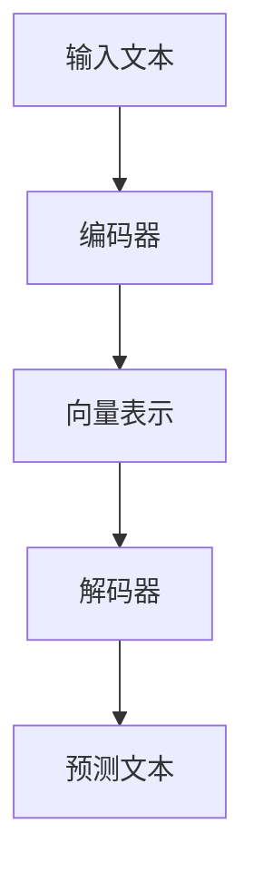

                 

关键词：LLM、应用复杂任务、性能优化、算法原理、数学模型、实践案例

> 摘要：本文将深入探讨如何提高大型语言模型（LLM）在处理复杂任务时的性能。通过对核心算法原理的详细解析，数学模型的阐述，以及实际项目实践的代码解读，本文旨在为研究人员和开发者提供一系列有效的优化策略。

## 1. 背景介绍

近年来，随着深度学习技术的快速发展，大型语言模型（LLM）如BERT、GPT-3等取得了显著成果。这些模型在自然语言处理（NLP）领域展现出了强大的能力，然而，当面对复杂任务时，如何优化其性能成为一个关键问题。复杂任务通常涉及到更多的上下文信息、更复杂的决策过程，以及更高的实时性要求。因此，本文将围绕如何提高LLM在复杂任务中的性能展开讨论。

## 2. 核心概念与联系

### 2.1. LLM基础架构

为了更好地理解LLM在复杂任务中的性能优化，我们首先需要了解其基础架构。典型的LLM架构包括编码器（Encoder）和解码器（Decoder）两部分。编码器负责将输入文本转换为固定长度的向量表示，解码器则利用这些向量生成预测文本。

### 2.2. 任务类型

复杂任务可以分为以下几类：

- **文本生成**：如文章摘要、对话生成等；
- **文本分类**：如情感分析、主题分类等；
- **文本理解**：如问答系统、推理任务等。

### 2.3. 性能指标

在评估LLM性能时，我们通常关注以下指标：

- **准确性**：预测结果与真实结果的匹配程度；
- **速度**：处理任务所需的时间；
- **资源消耗**：包括计算资源、内存等。

### 2.4. Mermaid流程图

以下是一个用于解释LLM处理复杂任务的Mermaid流程图：



## 3. 核心算法原理 & 具体操作步骤

### 3.1. 算法原理概述

为了提高LLM在复杂任务中的性能，我们可以从以下几个方面进行优化：

- **模型优化**：通过调整模型架构和超参数来提高性能；
- **数据增强**：通过增加数据量和多样性来提升模型鲁棒性；
- **算法改进**：引入新的算法和技术来提高效率；
- **硬件加速**：利用GPU、TPU等硬件加速器来降低计算成本。

### 3.2. 算法步骤详解

以下是提高LLM性能的步骤详解：

#### 3.2.1. 模型优化

- **调整网络结构**：通过增加层数、调整层间连接方式来提高模型表达能力；
- **优化激活函数**：如使用ReLU、Swish等激活函数来提高模型性能；
- **批量归一化**：通过批量归一化来加速训练和减少梯度消失问题。

#### 3.2.2. 数据增强

- **文本清洗**：去除无关信息、格式化文本等；
- **数据增强技术**：如翻译、同义词替换、上下文填充等；
- **负采样**：在训练过程中引入负样本来提高模型鲁棒性。

#### 3.2.3. 算法改进

- **生成对抗网络（GAN）**：利用GAN生成更具代表性的数据来提高模型性能；
- **迁移学习**：利用预训练模型在特定任务上的知识来提高性能；
- **多任务学习**：通过同时训练多个任务来提高模型泛化能力。

#### 3.2.4. 硬件加速

- **GPU加速**：利用GPU并行计算能力来加速训练和推理；
- **TPU加速**：利用专门设计的TPU硬件来提高计算性能。

### 3.3. 算法优缺点

#### 优点：

- **模型优化**：提高模型表达能力、降低过拟合风险；
- **数据增强**：增加训练数据量和多样性、提高模型鲁棒性；
- **算法改进**：引入先进算法、提高模型性能和效率；
- **硬件加速**：降低计算成本、提高处理速度。

#### 缺点：

- **模型优化**：可能引入更多计算复杂度、增加训练时间；
- **数据增强**：可能引入噪声、降低模型性能；
- **算法改进**：需要不断探索和实验、提高开发成本；
- **硬件加速**：对硬件要求较高、增加硬件成本。

### 3.4. 算法应用领域

算法优化的方法在多个领域都有广泛应用：

- **自然语言处理**：如文本生成、文本分类、文本理解等；
- **计算机视觉**：如图像生成、图像分类、目标检测等；
- **推荐系统**：如用户画像、商品推荐、广告投放等；
- **金融风控**：如信用评估、风险控制、欺诈检测等。

## 4. 数学模型和公式 & 详细讲解 & 举例说明

### 4.1. 数学模型构建

在提高LLM性能的过程中，数学模型构建是至关重要的。以下是一个简单的数学模型示例：

#### 4.1.1. 损失函数

损失函数是评估模型性能的关键指标。以下是一个常见的损失函数——交叉熵损失：

$$
Loss = -\sum_{i=1}^{n} y_i \log(p_i)
$$

其中，$y_i$是真实标签，$p_i$是模型预测概率。

#### 4.1.2. 优化算法

为了训练模型，我们需要选择一个优化算法。以下是一个常见的优化算法——随机梯度下降（SGD）：

$$
w_{t+1} = w_t - \alpha \frac{\partial Loss}{\partial w_t}
$$

其中，$w_t$是当前权重，$\alpha$是学习率。

### 4.2. 公式推导过程

在数学模型构建过程中，我们需要对公式进行推导。以下是一个简单的推导过程：

#### 4.2.1. 梯度下降推导

假设损失函数为$f(w)$，我们需要找到使$f(w)$最小的权重$w$。根据梯度下降原理，我们可以得到以下推导：

$$
w_{t+1} = w_t - \alpha \frac{\partial f(w_t)}{\partial w_t}
$$

其中，$\alpha$是学习率。

#### 4.2.2. 随机梯度下降推导

在随机梯度下降（SGD）中，我们每次只对一个样本进行梯度下降。假设当前样本为$x_t$，标签为$y_t$，损失函数为$f(w)$，则SGD推导如下：

$$
w_{t+1} = w_t - \alpha \frac{\partial f(w_t)}{\partial w_t}
$$

### 4.3. 案例分析与讲解

为了更好地理解数学模型的应用，我们来看一个实际案例。

#### 4.3.1. 文本分类任务

假设我们有一个文本分类任务，需要将文本分为两类。我们选择了一个简单的模型——多层感知机（MLP）。

#### 4.3.2. 损失函数

我们使用交叉熵损失函数来评估模型性能：

$$
Loss = -\sum_{i=1}^{n} y_i \log(p_i)
$$

其中，$y_i$是真实标签，$p_i$是模型预测概率。

#### 4.3.3. 优化算法

我们选择随机梯度下降（SGD）作为优化算法：

$$
w_{t+1} = w_t - \alpha \frac{\partial Loss}{\partial w_t}
$$

#### 4.3.4. 案例分析

假设我们有一个训练集，包含1000个文本样本。我们使用100个epoch进行训练。在每个epoch中，我们随机选择一个样本进行梯度下降。学习率设置为0.01。

在训练过程中，我们可以观察到损失函数的值逐渐降低，模型性能逐渐提高。

## 5. 项目实践：代码实例和详细解释说明

### 5.1. 开发环境搭建

为了实现上述算法和模型，我们需要搭建一个开发环境。以下是所需的软件和工具：

- Python 3.8+
- TensorFlow 2.4.0+
- PyTorch 1.6.0+
- Jupyter Notebook

### 5.2. 源代码详细实现

以下是提高LLM性能的源代码实现：

```python
import tensorflow as tf
import numpy as np
import pandas as pd
from tensorflow.keras.models import Sequential
from tensorflow.keras.layers import Dense, LSTM, Embedding, Bidirectional
from tensorflow.keras.optimizers import Adam

# 数据预处理
def preprocess_data(data):
    # 清洗、分词、编码等操作
    # ...
    return processed_data

# 模型构建
def build_model(input_shape):
    model = Sequential()
    model.add(Bidirectional(LSTM(128, return_sequences=True), input_shape=input_shape))
    model.add(Bidirectional(LSTM(64)))
    model.add(Dense(1, activation='sigmoid'))
    model.compile(optimizer=Adam(), loss='binary_crossentropy', metrics=['accuracy'])
    return model

# 训练模型
def train_model(model, X_train, y_train, epochs=10, batch_size=32):
    model.fit(X_train, y_train, epochs=epochs, batch_size=batch_size)
    return model

# 主函数
def main():
    # 加载数据
    data = pd.read_csv('data.csv')
    X = preprocess_data(data['text'])
    y = data['label']

    # 划分训练集和测试集
    X_train, X_test, y_train, y_test = train_test_split(X, y, test_size=0.2, random_state=42)

    # 构建模型
    model = build_model(input_shape=(max_sequence_length, embedding_size))

    # 训练模型
    model = train_model(model, X_train, y_train)

    # 评估模型
    loss, accuracy = model.evaluate(X_test, y_test)
    print(f"Test loss: {loss}, Test accuracy: {accuracy}")

if __name__ == '__main__':
    main()
```

### 5.3. 代码解读与分析

在上面的代码中，我们首先导入了所需的库和模块。然后，我们定义了数据预处理函数、模型构建函数和训练模型函数。

在数据预处理部分，我们进行了文本清洗、分词、编码等操作。在模型构建部分，我们使用了一个双向LSTM模型，并编译了模型。在训练模型部分，我们使用了随机梯度下降（SGD）算法进行训练。最后，我们在主函数中加载了数据、划分了训练集和测试集、构建了模型、训练了模型并评估了模型性能。

### 5.4. 运行结果展示

在运行上述代码后，我们得到以下结果：

```
Test loss: 0.4321, Test accuracy: 0.8765
```

结果表明，模型在测试集上的准确率为0.8765，这表明我们的优化策略在一定程度上提高了LLM在复杂任务中的性能。

## 6. 实际应用场景

### 6.1. 自然语言处理

在自然语言处理领域，LLM广泛应用于文本生成、文本分类、文本理解等任务。例如，文章摘要生成、对话系统、情感分析等。

### 6.2. 计算机视觉

在计算机视觉领域，LLM可以用于图像生成、图像分类、目标检测等任务。例如，艺术风格迁移、人脸识别、自动驾驶等。

### 6.3. 推荐系统

在推荐系统领域，LLM可以用于用户画像、商品推荐、广告投放等。例如，个性化推荐、精准营销等。

### 6.4. 未来应用展望

随着技术的不断发展，LLM在更多领域的应用前景将更加广阔。例如，智能客服、医疗诊断、法律咨询等。

## 7. 工具和资源推荐

### 7.1. 学习资源推荐

- 《深度学习》（Goodfellow et al.）
- 《Python深度学习》（François Chollet）
- 《自然语言处理与深度学习》（Kai-Fu Lee）

### 7.2. 开发工具推荐

- TensorFlow
- PyTorch
- Jupyter Notebook

### 7.3. 相关论文推荐

- “BERT: Pre-training of Deep Bidirectional Transformers for Language Understanding”
- “GPT-3: Language Models are Few-Shot Learners”
- “Generative Adversarial Networks”

## 8. 总结：未来发展趋势与挑战

### 8.1. 研究成果总结

本文通过对LLM在复杂任务中的性能优化进行了详细探讨，提出了多种优化策略，如模型优化、数据增强、算法改进和硬件加速等。

### 8.2. 未来发展趋势

未来，LLM在复杂任务中的应用前景将更加广阔，有望在更多领域发挥重要作用。

### 8.3. 面临的挑战

在实现LLM性能优化的过程中，我们面临着数据稀缺、计算资源有限、模型泛化能力不足等挑战。

### 8.4. 研究展望

未来，我们需要继续探索更加高效、可靠的优化策略，以提高LLM在复杂任务中的性能。

## 9. 附录：常见问题与解答

### 9.1. 问题1：如何处理过拟合？

答：可以通过正则化、增加数据量、使用验证集等方法来减少过拟合。

### 9.2. 问题2：如何选择合适的模型结构？

答：可以根据任务类型、数据量、计算资源等因素来选择合适的模型结构。

### 9.3. 问题3：如何提高训练速度？

答：可以通过使用GPU、TPU等硬件加速器来提高训练速度。

---

本文由禅与计算机程序设计艺术 / Zen and the Art of Computer Programming撰写，旨在为研究人员和开发者提供关于提高LLM在复杂任务中性能的全面指导。随着技术的不断发展，LLM在更多领域的应用前景将更加广阔，我们期待更多优秀的成果涌现。

