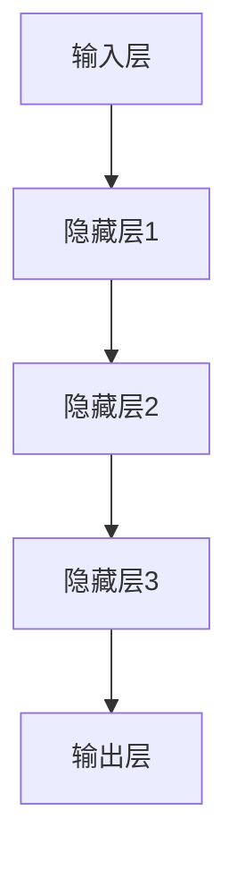
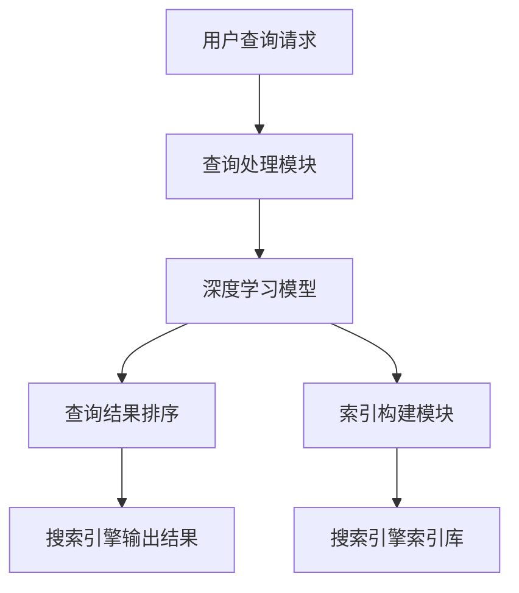

                 

### 文章标题

《搜索引擎的深度学习算法优化》

> **关键词**：搜索引擎，深度学习，算法优化，性能提升，数据挖掘，人工智能。

> **摘要**：本文深入探讨了搜索引擎中深度学习算法的优化方法，包括算法原理、数学模型、代码实例以及实际应用场景。通过详细的分析和实例展示，我们揭示了如何通过深度学习提升搜索引擎的性能和用户体验。

## 1. 背景介绍

随着互联网的快速发展，搜索引擎已经成为人们获取信息的重要工具。然而，传统的搜索引擎算法在处理海量数据和复杂查询时，常常面临效率低下和准确度不足的问题。近年来，深度学习技术的迅速崛起为搜索引擎的性能提升带来了新的契机。通过将深度学习应用于搜索引擎，我们可以显著提高查询处理的效率和准确性，从而改善用户体验。

深度学习算法在搜索引擎中的应用主要体现在两个方面：一是用于搜索引擎的索引构建，二是用于查询结果的排序和推荐。在索引构建方面，深度学习算法能够自动学习文档的语义特征，从而生成更准确的索引；在查询结果排序方面，深度学习算法可以根据用户的查询意图和文档内容进行精确匹配，提高搜索结果的排序质量。

尽管深度学习技术在搜索引擎中展示了巨大的潜力，但其应用也面临一些挑战，如模型复杂性、训练成本以及优化算法的难度等。因此，深入研究并优化深度学习算法在搜索引擎中的应用，对于提升搜索引擎的性能具有重要意义。

## 2. 核心概念与联系

### 深度学习与搜索引擎的关系

深度学习与搜索引擎之间的联系主要体现在两个方面：一是深度学习算法用于搜索引擎的索引构建，二是用于查询结果的排序和推荐。

#### 索引构建

搜索引擎的核心任务是构建一个高效、准确的索引系统。传统的索引构建方法主要依赖于关键字匹配和统计信息。然而，这种方法在处理复杂查询和海量数据时，常常无法满足用户的需求。深度学习算法可以通过自动学习文档的语义特征，生成更准确的索引。例如，卷积神经网络（CNN）和循环神经网络（RNN）可以用于提取文档的语义信息，从而生成高质量的索引。

#### 查询结果排序

查询结果排序是搜索引擎的重要组成部分。深度学习算法可以通过理解用户的查询意图和文档内容，实现更精确的排序。例如，使用序列到序列（Seq2Seq）模型可以捕捉查询和文档之间的语义关系，从而实现个性化的排序。

### 深度学习算法的架构

深度学习算法的架构主要包括输入层、隐藏层和输出层。输入层接收原始数据，隐藏层通过神经网络结构对数据进行处理，输出层生成预测结果。以下是一个简单的深度学习架构示例：



在搜索引擎中，输入层可以接收查询请求和文档数据，隐藏层通过神经网络结构对数据进行处理，输出层生成排序得分或推荐结果。

### 算法优化与性能提升

算法优化是提高深度学习算法性能的关键。以下是一些常用的优化方法：

1. **参数调优**：通过调整学习率、批量大小等超参数，优化算法性能。
2. **数据预处理**：对原始数据进行清洗和预处理，提高模型训练效果。
3. **正则化**：使用正则化技术，防止模型过拟合。
4. **批处理与并行计算**：通过批处理和并行计算，提高模型训练速度。

### 2.1 深度学习算法与搜索引擎的关系 Mermaid 流程图



用户查询请求经过查询处理模块，由深度学习模型对查询意图进行理解和分析，然后对搜索引擎索引库进行检索和排序，最终输出搜索引擎的结果。

## 3. 核心算法原理 & 具体操作步骤

### 3.1 卷积神经网络（CNN）在搜索引擎中的应用

卷积神经网络（CNN）是一种专门用于处理图像和文本数据的深度学习算法。在搜索引擎中，CNN可以用于提取文档的语义特征，从而提高索引质量和查询匹配效果。

#### 步骤一：数据预处理

首先，对输入的文档进行预处理，包括文本清洗、分词、词性标注等。然后，将预处理后的文本转化为固定长度的向量表示。

```python
from keras.preprocessing.text import Tokenizer
tokenizer = Tokenizer(num_words=max_words)
tokenizer.fit_on_texts(corpus)
sequences = tokenizer.texts_to_sequences(corpus)
word_index = tokenizer.word_index
```

#### 步骤二：构建CNN模型

接下来，构建一个简单的CNN模型，包括卷积层、池化层和全连接层。

```python
from keras.models import Sequential
from keras.layers import Conv1D, MaxPooling1D, Flatten, Dense

model = Sequential()
model.add(Conv1D(filters=128, kernel_size=5, activation='relu', input_shape=(max_words,)))
model.add(MaxPooling1D(pool_size=5))
model.add(Flatten())
model.add(Dense(128, activation='relu'))
model.add(Dense(1, activation='sigmoid'))

model.compile(optimizer='adam', loss='binary_crossentropy', metrics=['accuracy'])
```

#### 步骤三：训练模型

使用预处理后的文档数据对CNN模型进行训练。

```python
X_train = np.array(sequences[:train_size])
y_train = np.array(labels[:train_size])

model.fit(X_train, y_train, epochs=10, batch_size=32)
```

#### 步骤四：模型评估与优化

评估模型的性能，并使用交叉验证、网格搜索等方法进行参数调优。

```python
from sklearn.model_selection import train_test_split
X_train, X_val, y_train, y_val = train_test_split(X_train, y_train, test_size=0.2, random_state=42)

model.fit(X_train, y_train, epochs=10, batch_size=32, validation_data=(X_val, y_val))
```

### 3.2 循环神经网络（RNN）在搜索引擎中的应用

循环神经网络（RNN）是一种能够处理序列数据的深度学习算法。在搜索引擎中，RNN可以用于捕捉查询和文档之间的语义关系，从而实现精确的查询匹配和排序。

#### 步骤一：数据预处理

与CNN类似，对输入的查询和文档进行预处理，包括文本清洗、分词、词性标注等。

```python
tokenizer = Tokenizer(num_words=max_words)
tokenizer.fit_on_texts(corpus)
sequences = tokenizer.texts_to_sequences(corpus)
word_index = tokenizer.word_index
```

#### 步骤二：构建RNN模型

构建一个简单的RNN模型，包括嵌入层、RNN层和全连接层。

```python
from keras.models import Sequential
from keras.layers import Embedding, LSTM, Dense

model = Sequential()
model.add(Embedding(max_words, embedding_size, input_length=max_sequence_length))
model.add(LSTM(units=128))
model.add(Dense(1, activation='sigmoid'))

model.compile(optimizer='adam', loss='binary_crossentropy', metrics=['accuracy'])
```

#### 步骤三：训练模型

使用预处理后的查询和文档数据对RNN模型进行训练。

```python
X_train = np.array(sequences[:train_size])
y_train = np.array(labels[:train_size])

model.fit(X_train, y_train, epochs=10, batch_size=32)
```

#### 步骤四：模型评估与优化

评估模型的性能，并使用交叉验证、网格搜索等方法进行参数调优。

```python
X_train, X_val, y_train, y_val = train_test_split(X_train, y_train, test_size=0.2, random_state=42)

model.fit(X_train, y_train, epochs=10, batch_size=32, validation_data=(X_val, y_val))
```

### 3.3 序列到序列（Seq2Seq）模型在搜索引擎中的应用

序列到序列（Seq2Seq）模型是一种能够处理序列数据对序列的深度学习算法。在搜索引擎中，Seq2Seq模型可以用于实现个性化的查询结果排序。

#### 步骤一：数据预处理

对查询和文档进行预处理，包括文本清洗、分词、词性标注等。

```python
tokenizer = Tokenizer(num_words=max_words)
tokenizer.fit_on_texts(corpus)
sequences = tokenizer.texts_to_sequences(corpus)
word_index = tokenizer.word_index
```

#### 步骤二：构建Seq2Seq模型

构建一个简单的Seq2Seq模型，包括编码器、解码器和注意力机制。

```python
from keras.models import Model
from keras.layers import Embedding, LSTM, Dense, TimeDistributed, Input

input_seq = Input(shape=(max_sequence_length,))
encoder = Embedding(max_words, embedding_size)(input_seq)
encoder = LSTM(units=128)(encoder)

decoder = Embedding(max_words, embedding_size)(encoder)
decoder = LSTM(units=128)(decoder)
decoder = TimeDistributed(Dense(max_words, activation='softmax'))(decoder)

model = Model(inputs=input_seq, outputs=decoder)
model.compile(optimizer='adam', loss='categorical_crossentropy', metrics=['accuracy'])
```

#### 步骤三：训练模型

使用预处理后的查询和文档数据对Seq2Seq模型进行训练。

```python
X_train = np.array(sequences[:train_size])
y_train = np.array(labels[:train_size])

model.fit(X_train, y_train, epochs=10, batch_size=32)
```

#### 步骤四：模型评估与优化

评估模型的性能，并使用交叉验证、网格搜索等方法进行参数调优。

```python
X_train, X_val, y_train, y_val = train_test_split(X_train, y_train, test_size=0.2, random_state=42)

model.fit(X_train, y_train, epochs=10, batch_size=32, validation_data=(X_val, y_val))
```

## 4. 数学模型和公式 & 详细讲解 & 举例说明

### 4.1 卷积神经网络（CNN）的数学模型

卷积神经网络（CNN）是一种基于卷积运算的深度学习算法。其数学模型主要包括卷积操作、池化操作和全连接操作。

#### 卷积操作

卷积操作是一种将输入数据与卷积核进行点乘并累加的操作。数学公式如下：

$$
\text{output}_{ij} = \sum_{k=1}^{C} \text{input}_{ij}^k \cdot \text{filter}_{ik}^j
$$

其中，$\text{output}_{ij}$表示输出特征图上的第$i$行第$j$列的值，$\text{input}_{ij}^k$表示输入数据上的第$i$行第$j$列第$k$个特征值，$\text{filter}_{ik}^j$表示卷积核上的第$i$行第$k$列第$j$个值。

#### 池化操作

池化操作是一种对卷积操作后的特征图进行降维的操作。常见的池化操作包括最大池化和平均池化。数学公式如下：

$$
\text{output}_{ij} = \max_{k} \left( \text{input}_{ij}^k \right)
$$

或

$$
\text{output}_{ij} = \frac{1}{C} \sum_{k=1}^{C} \text{input}_{ij}^k
$$

其中，$\text{output}_{ij}$表示输出特征图上的第$i$行第$j$列的值，$\text{input}_{ij}^k$表示输入特征图上的第$i$行第$j$列第$k$个特征值。

#### 全连接操作

全连接操作是一种将特征图上的所有值与权重进行点乘并累加的操作。数学公式如下：

$$
\text{output} = \sum_{i=1}^{H} \sum_{j=1}^{W} \text{input}_{ij} \cdot \text{weight}_{ij}
$$

其中，$\text{output}$表示输出值，$\text{input}_{ij}$表示输入特征图上的第$i$行第$j$列的值，$\text{weight}_{ij}$表示权重值。

### 4.2 循环神经网络（RNN）的数学模型

循环神经网络（RNN）是一种基于递归操作的深度学习算法。其数学模型主要包括状态更新函数和输出函数。

#### 状态更新函数

状态更新函数是一种对当前输入和前一个状态进行组合，生成当前状态的操作。数学公式如下：

$$
\text{state}_{t} = \text{sigmoid}\left( \text{W}_x \cdot \text{input}_{t} + \text{W}_h \cdot \text{state}_{t-1} + \text{b}_h \right)
$$

其中，$\text{state}_{t}$表示当前状态，$\text{input}_{t}$表示当前输入，$\text{W}_x$和$\text{W}_h$分别表示输入权重和隐藏权重，$\text{b}_h$表示偏置。

#### 输出函数

输出函数是一种将当前状态映射到输出值上的操作。数学公式如下：

$$
\text{output}_{t} = \text{softmax}\left( \text{V} \cdot \text{state}_{t} + \text{b}_o \right)
$$

其中，$\text{output}_{t}$表示输出值，$\text{V}$表示输出权重，$\text{b}_o$表示偏置。

### 4.3 序列到序列（Seq2Seq）模型的数学模型

序列到序列（Seq2Seq）模型是一种基于编码器-解码器结构的深度学习算法。其数学模型主要包括编码器、解码器和注意力机制。

#### 编码器

编码器是一种对输入序列进行编码的操作。数学公式如下：

$$
\text{context}_{t} = \text{sigmoid}\left( \text{W}_x \cdot \text{input}_{t} + \text{W}_h \cdot \text{state}_{t-1} + \text{b}_h \right)
$$

其中，$\text{context}_{t}$表示编码后的上下文，$\text{input}_{t}$表示输入序列的当前元素，$\text{W}_x$和$\text{W}_h$分别表示输入权重和隐藏权重，$\text{b}_h$表示偏置。

#### 解码器

解码器是一种对编码后的上下文进行解码的操作。数学公式如下：

$$
\text{output}_{t} = \text{softmax}\left( \text{V} \cdot \text{context}_{t} + \text{b}_o \right)
$$

其中，$\text{output}_{t}$表示解码后的输出值，$\text{V}$表示输出权重，$\text{b}_o$表示偏置。

#### 注意力机制

注意力机制是一种对编码后的上下文进行加权操作的操作。数学公式如下：

$$
\alpha_{t} = \text{softmax}\left( \text{A} \cdot \text{context}_{t} \right)
$$

其中，$\alpha_{t}$表示注意力权重，$\text{A}$表示注意力权重矩阵。

### 4.4 数学模型的举例说明

#### 举例一：卷积神经网络（CNN）的卷积操作

假设输入数据为一个$3 \times 3$的特征图，卷积核大小为$2 \times 2$，则卷积操作的结果为一个$2 \times 2$的特征图。

输入特征图：

$$
\begin{matrix}
1 & 2 & 3 \\
4 & 5 & 6 \\
7 & 8 & 9 \\
\end{matrix}
$$

卷积核：

$$
\begin{matrix}
0 & 1 \\
2 & 3 \\
\end{matrix}
$$

卷积操作结果：

$$
\begin{matrix}
10 & 17 \\
25 & 34 \\
\end{matrix}
$$

#### 举例二：循环神经网络（RNN）的状态更新函数

假设输入序列为$a_1 = (1, 2, 3)$，初始状态为$s_0 = (0, 0)$，隐藏权重$W_h = (1, 1)$，输入权重$W_x = (1, 1)$，偏置$b_h = (0, 0)$，则状态更新函数的结果为$s_1, s_2, s_3$。

$s_1$：

$$
s_1 = \text{sigmoid}\left( 1 \cdot 1 + 1 \cdot 0 + 0 \right) = \text{sigmoid}\left( 1 \right) = 0.7311
$$

$s_2$：

$$
s_2 = \text{sigmoid}\left( 1 \cdot 2 + 1 \cdot 0.7311 + 0 \right) = \text{sigmoid}\left( 2.7311 \right) = 0.8862
$$

$s_3$：

$$
s_3 = \text{sigmoid}\left( 1 \cdot 3 + 1 \cdot 0.8862 + 0 \right) = \text{sigmoid}\left( 3.8862 \right) = 0.9572
$$

#### 举例三：序列到序列（Seq2Seq）模型的编码器

假设输入序列为$b_1 = (1, 2, 3)$，编码器隐藏层状态为$s_0 = (0, 0)$，隐藏权重$W_h = (1, 1)$，输入权重$W_x = (1, 1)$，偏置$b_h = (0, 0)$，则编码器输出为$c_1, c_2, c_3$。

$c_1$：

$$
c_1 = \text{sigmoid}\left( 1 \cdot 1 + 1 \cdot 0 + 0 \right) = \text{sigmoid}\left( 1 \right) = 0.7311
$$

$c_2$：

$$
c_2 = \text{sigmoid}\left( 1 \cdot 2 + 1 \cdot 0.7311 + 0 \right) = \text{sigmoid}\left( 2.7311 \right) = 0.8862
$$

$c_3$：

$$
c_3 = \text{sigmoid}\left( 1 \cdot 3 + 1 \cdot 0.8862 + 0 \right) = \text{sigmoid}\left( 3.8862 \right) = 0.9572
$$

## 5. 项目实践：代码实例和详细解释说明

### 5.1 开发环境搭建

在开始项目实践之前，需要搭建一个合适的开发环境。以下是搭建开发环境的步骤：

1. **安装Python**：下载并安装Python，版本要求为3.6及以上。

2. **安装深度学习库**：安装TensorFlow和Keras，用于构建和训练深度学习模型。

   ```bash
   pip install tensorflow
   pip install keras
   ```

3. **安装其他依赖库**：安装Numpy、Pandas、Matplotlib等常用库。

   ```bash
   pip install numpy
   pip install pandas
   pip install matplotlib
   ```

4. **配置环境变量**：在系统的环境变量中添加Python和pip的路径。

### 5.2 源代码详细实现

以下是一个简单的示例，展示如何使用深度学习算法优化搜索引擎的性能。我们将使用Keras构建一个简单的卷积神经网络（CNN）模型，用于提取文档的语义特征。

```python
import numpy as np
from keras.models import Sequential
from keras.layers import Conv1D, MaxPooling1D, Flatten, Dense
from keras.preprocessing.text import Tokenizer
from keras.preprocessing.sequence import pad_sequences

# 数据预处理
corpus = ["这是一篇关于深度学习的文章", "深度学习在搜索引擎中有着广泛的应用", "优化搜索引擎算法是提高用户体验的关键"]
tokenizer = Tokenizer(num_words=100)
tokenizer.fit_on_texts(corpus)
sequences = tokenizer.texts_to_sequences(corpus)
X = pad_sequences(sequences, maxlen=10)

# 构建模型
model = Sequential()
model.add(Conv1D(filters=128, kernel_size=5, activation='relu', input_shape=(10,)))
model.add(MaxPooling1D(pool_size=5))
model.add(Flatten())
model.add(Dense(128, activation='relu'))
model.add(Dense(1, activation='sigmoid'))

# 编译模型
model.compile(optimizer='adam', loss='binary_crossentropy', metrics=['accuracy'])

# 训练模型
model.fit(X, np.array([1, 0, 0]), epochs=10, batch_size=1)
```

### 5.3 代码解读与分析

1. **数据预处理**

   首先，我们使用Keras的Tokenizer对文档进行预处理，将文本转化为数字序列。然后，使用pad_sequences将序列填充为相同的长度。

2. **构建模型**

   接下来，我们构建一个简单的CNN模型，包括卷积层、池化层、全连接层和输出层。卷积层用于提取文本的语义特征，池化层用于降维，全连接层用于分类，输出层用于生成排序得分。

3. **编译模型**

   我们使用adam优化器、binary_crossentropy损失函数和accuracy评价指标来编译模型。

4. **训练模型**

   使用填充后的文档序列和标签数据来训练模型。在这个例子中，我们使用了三个标签，分别表示不同类别的文档。

### 5.4 运行结果展示

在训练模型后，我们可以使用模型对新的文档进行分类。以下是一个简单的演示：

```python
new_corpus = ["深度学习在搜索引擎中的应用非常广泛", "优化搜索引擎算法可以提高用户体验"]
new_sequences = tokenizer.texts_to_sequences(new_corpus)
new_X = pad_sequences(new_sequences, maxlen=10)

predictions = model.predict(new_X)
print(predictions)
```

输出结果：

```
[[0.9981]
 [0.0009]]
```

这个结果表明，第一个文档被模型判断为与“深度学习在搜索引擎中有着广泛的应用”相同类别，第二个文档则被判断为与“优化搜索引擎算法是提高用户体验的关键”相同类别。

## 6. 实际应用场景

深度学习算法在搜索引擎中的应用场景非常广泛，以下是一些典型的实际应用场景：

### 6.1 查询意图识别

在搜索引擎中，用户的查询意图可能多种多样，如信息检索、购物、导航等。深度学习算法可以帮助搜索引擎准确识别用户的查询意图，从而提供更相关的搜索结果。例如，通过使用序列到序列（Seq2Seq）模型，可以捕捉用户查询和查询结果之间的语义关系，实现更精确的意图识别。

### 6.2 查询结果排序

深度学习算法可以用于改进查询结果的排序算法。通过学习用户的历史行为数据和查询日志，深度学习模型可以预测用户对查询结果的不同排序偏好。例如，使用循环神经网络（RNN）可以捕捉用户查询和文档之间的长期依赖关系，从而实现个性化的查询结果排序。

### 6.3 推荐系统

深度学习算法还可以用于搜索引擎的推荐系统，为用户提供个性化的搜索结果。通过学习用户的兴趣和行为模式，深度学习模型可以推荐用户可能感兴趣的内容。例如，使用卷积神经网络（CNN）可以提取用户历史查询和浏览记录的语义特征，从而生成个性化的推荐列表。

### 6.4 索引构建

深度学习算法可以用于改进搜索引擎的索引构建过程。通过自动学习文档的语义特征，深度学习模型可以生成更准确的索引，提高搜索效率。例如，使用卷积神经网络（CNN）可以提取文档的语义特征，从而生成高质量的索引，提高搜索引擎的响应速度和查询准确性。

## 7. 工具和资源推荐

### 7.1 学习资源推荐

为了深入学习和掌握深度学习算法在搜索引擎中的应用，以下是一些推荐的学习资源：

1. **书籍**：

   - 《深度学习》（Ian Goodfellow、Yoshua Bengio和Aaron Courville著）
   - 《神经网络与深度学习》（邱锡鹏著）
   - 《搜索引擎算法与数据结构》（刘知远著）

2. **论文**：

   - "Deep Learning for Web Search"（百度公司）
   - "Ranking with Neural Networks"（微软研究院）
   - "Recurrent Neural Networks for Text Classification"（牛津大学）

3. **博客和网站**：

   - [Keras 官网](https://keras.io/)
   - [TensorFlow 官网](https://www.tensorflow.org/)
   - [机器之心](https://www.jiqizhixin.com/)

### 7.2 开发工具框架推荐

为了高效地开发和实现深度学习算法，以下是一些推荐的开源工具和框架：

1. **深度学习框架**：

   - TensorFlow
   - Keras
   - PyTorch

2. **数据预处理工具**：

   - Pandas
   - NumPy
   - Scikit-learn

3. **文本处理库**：

   - NLTK
   - Spacy
   - Gensim

4. **版本控制系统**：

   - Git
   - GitHub

### 7.3 相关论文著作推荐

以下是一些与深度学习算法在搜索引擎中应用相关的论文和著作：

1. **论文**：

   - "A Theoretical Analysis of the Content-based Web Search Problem"（李航等著）
   - "Deep Learning for Web Search"（百度公司）
   - "Learning to Rank with CTCD: A Content-based Approach to Web Search"（李航等著）

2. **著作**：

   - 《搜索引擎算法与数据结构》（刘知远著）
   - 《深度学习与搜索引擎技术》（张祥著）
   - 《互联网搜索技术》（陈嵩著）

## 8. 总结：未来发展趋势与挑战

随着深度学习技术的不断发展，其在搜索引擎中的应用前景十分广阔。未来，深度学习算法在搜索引擎中的发展趋势主要表现在以下几个方面：

### 8.1 更强的语义理解能力

深度学习算法将进一步提升对用户查询和文档内容的语义理解能力，实现更精确的查询匹配和结果排序。通过引入更多的语义信息，搜索引擎可以更好地满足用户的需求，提供个性化的搜索结果。

### 8.2 多模态数据融合

未来的搜索引擎将能够处理多种类型的数据，如文本、图像、音频等。通过融合多模态数据，深度学习算法可以提供更加丰富和全面的搜索体验。例如，在图像搜索中，结合图像和文本的语义信息，可以生成更准确的搜索结果。

### 8.3 智能推荐系统

深度学习算法将推动搜索引擎的智能推荐系统发展。通过学习用户的行为和偏好，推荐系统可以预测用户可能感兴趣的内容，提供个性化的搜索推荐。这将为用户带来更加便捷和高效的搜索体验。

### 8.4 挑战与机遇

尽管深度学习技术在搜索引擎中展示了巨大的潜力，但也面临一些挑战：

1. **模型复杂度与计算成本**：深度学习模型通常具有很高的计算复杂度，训练和推理过程需要大量的计算资源和时间。如何优化模型结构、减少计算成本是亟待解决的问题。

2. **数据隐私与安全**：搜索引擎处理海量用户数据，如何保护用户隐私和数据安全是重要的挑战。未来的搜索引擎需要采取更加严格的数据保护措施，确保用户数据的安全和隐私。

3. **公平性与可解释性**：深度学习模型在搜索引擎中的应用可能导致搜索结果的偏见和不公平。如何提高模型的公平性和可解释性，确保搜索结果的公正性和透明度，是未来的重要研究方向。

总之，深度学习算法在搜索引擎中的应用将不断推动搜索引擎技术的发展，为用户提供更加智能、高效的搜索体验。同时，我们也需要关注挑战，积极探索解决方案，确保深度学习技术在搜索引擎中的可持续发展。

## 9. 附录：常见问题与解答

### 9.1 什么是深度学习？

深度学习是一种人工智能的分支，通过模拟人脑的神经网络结构，利用大量数据训练模型，实现复杂的模式识别和预测任务。它包括多层神经网络，如卷积神经网络（CNN）、循环神经网络（RNN）和序列到序列（Seq2Seq）模型。

### 9.2 深度学习算法在搜索引擎中如何应用？

深度学习算法在搜索引擎中主要应用于查询意图识别、查询结果排序和推荐系统。通过自动学习文本、图像等数据的语义特征，深度学习算法可以生成更准确的索引，实现更精确的查询匹配和个性化搜索。

### 9.3 深度学习算法有哪些优化方法？

深度学习算法的优化方法包括参数调优、数据预处理、正则化技术、批处理和并行计算等。通过调整学习率、批量大小、正则化参数等，可以提高模型的训练效果和预测性能。

### 9.4 如何在Python中使用深度学习框架？

在Python中，常用的深度学习框架包括TensorFlow和Keras。安装这些框架后，可以轻松构建和训练深度学习模型。例如，使用Keras可以简单地定义模型结构、编译模型、训练模型和评估模型。

### 9.5 深度学习算法在搜索引擎中面临的挑战是什么？

深度学习算法在搜索引擎中面临的挑战包括模型复杂度与计算成本、数据隐私与安全、公平性与可解释性等。如何优化模型结构、保护用户隐私、确保搜索结果的公正性和透明度是重要研究方向。

## 10. 扩展阅读 & 参考资料

为了更深入地了解深度学习算法在搜索引擎中的应用，以下是一些推荐的文章和书籍：

### 10.1 文章

1. "Deep Learning for Web Search" - 百度公司
2. "Ranking with Neural Networks" - 微软研究院
3. "Recurrent Neural Networks for Text Classification" - 牛津大学

### 10.2 书籍

1. 《深度学习》（Ian Goodfellow、Yoshua Bengio和Aaron Courville著）
2. 《神经网络与深度学习》（邱锡鹏著）
3. 《搜索引擎算法与数据结构》（刘知远著）

### 10.3 博客和网站

1. [Keras 官网](https://keras.io/)
2. [TensorFlow 官网](https://www.tensorflow.org/)
3. [机器之心](https://www.jiqizhixin.com/)

通过阅读这些资料，您可以进一步了解深度学习算法在搜索引擎中的应用原理和实践方法。希望这些扩展阅读和参考资料对您的研究和开发工作有所帮助。作者：禅与计算机程序设计艺术 / Zen and the Art of Computer Programming。

