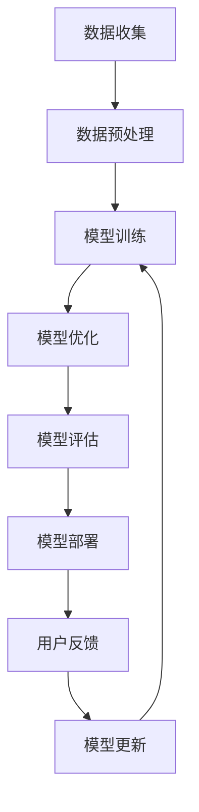

                 

### 背景介绍

随着互联网的迅猛发展，数据量呈指数级增长，搜索引擎和推荐系统成为用户获取信息和内容的重要途径。在这些系统中，搜索推荐系统（Search and Recommendation System，简称SR系统）起着至关重要的作用。通过为用户提供个性化的搜索结果和推荐内容，SR系统能够大大提升用户体验，提高信息检索的效率。

然而，随着数据量的增加和用户需求的多样化，传统SR系统的性能和效果逐渐受到挑战。为了满足用户的高效、精准搜索需求，AI大模型（如深度学习模型、强化学习模型等）在SR系统中得到了广泛应用。AI大模型通过训练大规模数据集，可以自动学习到数据的分布特征和用户行为模式，从而实现更准确的搜索结果和推荐内容。

本篇文章将围绕AI大模型在搜索推荐系统中的优化策略进行探讨。我们将详细分析AI大模型在SR系统中的应用原理、核心算法、数学模型以及实际应用场景，并给出具体的项目实践和优化建议。通过本文的阐述，希望能够为读者提供一套系统、全面的AI大模型优化策略，以提升搜索推荐系统的效率与效果。

### 核心概念与联系

要深入探讨AI大模型在搜索推荐系统中的优化策略，首先需要理解几个核心概念及其相互关系。这些概念包括：搜索推荐系统的工作原理、AI大模型的基本架构、关键算法及其优化方法。

#### 搜索推荐系统的工作原理

搜索推荐系统通常由三个主要组件构成：搜索引擎、推荐引擎和用户接口。搜索引擎主要负责从海量的数据中快速准确地检索出用户可能感兴趣的信息；推荐引擎则根据用户的历史行为和偏好，为用户推荐相关的内容；用户接口则将检索结果和推荐内容呈现给用户。

在搜索引擎中，常见的算法包括基于关键词的检索、基于语义的检索等。推荐引擎则通常采用协同过滤（Collaborative Filtering）、矩阵分解（Matrix Factorization）等技术。协同过滤可以分为用户基于协同过滤和物品基于协同过滤，分别利用用户间的相似度或物品间的相似度进行推荐。矩阵分解则通过将用户-物品评分矩阵分解为两个低秩矩阵，从而获取用户的兴趣偏好和物品的属性特征。

#### AI大模型的基本架构

AI大模型通常指的是基于深度学习或强化学习的复杂神经网络结构。深度学习模型如卷积神经网络（CNN）、循环神经网络（RNN）、Transformer模型等，能够自动学习数据的深层特征表示。强化学习模型则通过试错法不断优化策略，以最大化长期奖励。

在搜索推荐系统中，AI大模型可以应用于多个环节，如：

1. **搜索引擎优化**：使用深度学习模型对搜索关键词进行语义解析，提高检索的准确性。
2. **推荐引擎优化**：利用深度学习模型对用户行为和偏好进行建模，提高推荐的个性化和精准度。
3. **用户接口优化**：通过深度学习模型分析用户的交互行为，改进用户界面的设计和交互体验。

#### 关键算法及其优化方法

为了提高AI大模型在搜索推荐系统中的性能，研究人员和工程师们提出了一系列优化方法，包括：

1. **模型压缩**：通过模型剪枝、量化等技术减少模型的参数量和计算量，提高模型的运行效率。
2. **分布式训练**：利用分布式计算框架如TensorFlow、PyTorch等，将模型训练任务分布在多台机器上，加速模型训练过程。
3. **增量学习**：通过在线学习的方式，不断更新模型参数，以适应用户行为和数据的动态变化。
4. **强化学习**：结合强化学习算法，根据用户的实际反馈动态调整推荐策略，提高推荐效果。

#### Mermaid 流程图

以下是一个简化的Mermaid流程图，描述了AI大模型在搜索推荐系统中的优化过程：



在这个流程中，数据收集、数据预处理、模型训练、模型优化、模型评估、模型部署、用户反馈和模型更新构成了一个闭环，通过不断迭代优化，使得AI大模型能够更好地服务于搜索推荐系统。

### 核心算法原理 & 具体操作步骤

在深入探讨AI大模型在搜索推荐系统中的应用之前，我们需要了解其核心算法原理以及具体操作步骤。AI大模型主要包括深度学习模型和强化学习模型，以下将分别介绍这两种模型的基本原理和具体实现方法。

#### 深度学习模型

深度学习模型是搜索推荐系统的核心组成部分，能够自动从大规模数据中学习到有用的特征表示。以下是一些常用的深度学习模型及其原理：

##### 卷积神经网络（CNN）

卷积神经网络（CNN）是一种特殊的神经网络，主要用于处理具有网格结构的数据，如图像和文本。CNN的核心组件是卷积层，它可以提取输入数据的局部特征。具体步骤如下：

1. **输入层**：接收原始图像或文本数据。
2. **卷积层**：通过卷积操作提取图像或文本的局部特征，如边缘、纹理等。
3. **池化层**：对卷积结果进行下采样，减少模型参数和计算量。
4. **全连接层**：将卷积和池化层的特征映射到输出空间，如类别标签或评分。
5. **激活函数**：如ReLU、Sigmoid或Softmax，用于引入非线性特性。

##### 循环神经网络（RNN）

循环神经网络（RNN）能够处理序列数据，如用户的点击历史、搜索历史等。RNN的核心组件是循环单元，它能够记忆之前的信息。具体步骤如下：

1. **输入层**：接收序列数据的当前元素。
2. **隐藏层**：通过循环连接将当前状态与之前的状态结合。
3. **激活函数**：引入非线性特性，如ReLU、Sigmoid或Tanh。
4. **输出层**：将隐藏层的状态映射到输出空间，如类别标签或评分。

##### Transformer模型

Transformer模型是近年来在自然语言处理领域取得显著成功的模型，它采用注意力机制对序列数据进行建模。具体步骤如下：

1. **输入层**：接收原始文本序列。
2. **嵌入层**：将词向量映射到高维空间。
3. **多头自注意力层**：通过多头自注意力机制计算序列中每个元素的相关性。
4. **前馈神经网络**：对自注意力结果进行线性变换。
5. **输出层**：将前馈神经网络的输出映射到输出空间，如类别标签或评分。

#### 强化学习模型

强化学习模型通过试错法不断优化策略，以最大化长期奖励。以下是一些常用的强化学习算法及其原理：

##### Q-Learning

Q-Learning是一种基于值函数的强化学习算法，通过不断更新状态-动作值函数来优化策略。具体步骤如下：

1. **初始化**：初始化Q值函数。
2. **状态-动作选择**：选择当前状态下的最优动作。
3. **行动并获取反馈**：执行选定的动作，并获取奖励。
4. **更新Q值**：根据新的奖励和状态更新Q值函数。

##### Policy Gradient

Policy Gradient是一种基于策略的强化学习算法，通过直接优化策略来最大化期望奖励。具体步骤如下：

1. **初始化**：初始化策略参数。
2. **状态-动作选择**：根据当前状态和策略参数选择动作。
3. **行动并获取反馈**：执行选定的动作，并获取奖励。
4. **更新策略**：根据新的奖励和状态更新策略参数。

#### 具体操作步骤

为了实现AI大模型在搜索推荐系统中的优化，我们可以遵循以下步骤：

1. **数据收集与预处理**：收集用户行为数据、搜索日志、推荐历史等，并对数据进行清洗、归一化等预处理操作。
2. **模型训练**：选择合适的深度学习模型或强化学习模型，并使用预处理后的数据对其进行训练。
3. **模型优化**：通过模型压缩、分布式训练等方法优化模型性能，提高模型效率。
4. **模型评估**：使用验证集或测试集评估模型性能，包括准确率、召回率、F1值等指标。
5. **模型部署**：将训练好的模型部署到线上环境，供用户实际使用。
6. **用户反馈与模型更新**：收集用户的反馈数据，并根据用户反馈更新模型参数，提高模型效果。

通过以上步骤，AI大模型能够在搜索推荐系统中发挥重要作用，实现高效、精准的搜索和推荐。

### 数学模型和公式 & 详细讲解 & 举例说明

在深入探讨AI大模型在搜索推荐系统中的优化策略时，理解其背后的数学模型和公式至关重要。这些模型和公式不仅帮助我们设计高效的算法，还能确保我们在实践中能够准确计算和评估模型的性能。以下是几个关键数学模型及其详细讲解和举例说明。

#### 深度学习模型中的损失函数

深度学习模型通常通过优化损失函数来训练模型。损失函数衡量模型预测值与实际值之间的差距，常见的损失函数包括均方误差（MSE）、交叉熵损失（Cross-Entropy Loss）等。

1. **均方误差（MSE）**

   均方误差是衡量预测值和真实值之间差异的标准度量，其公式为：
   $$MSE = \frac{1}{n}\sum_{i=1}^{n}(y_i - \hat{y}_i)^2$$
   其中，$y_i$表示真实值，$\hat{y}_i$表示预测值，$n$是样本数量。

   **例子**：假设我们有一个简单的线性回归模型，预测房价。给定一个训练集，真实房价为$y = [150, 200, 250, 300]$，模型预测的房价为$\hat{y} = [152, 205, 248, 308]$。计算MSE如下：
   $$MSE = \frac{1}{4}((152-150)^2 + (205-200)^2 + (248-250)^2 + (308-300)^2) = 2.25$$

2. **交叉熵损失（Cross-Entropy Loss）**

   交叉熵损失是用于分类问题的损失函数，其公式为：
   $$H(y, \hat{y}) = -\sum_{i=1}^{n}y_i\log(\hat{y}_i)$$
   其中，$y$是真实标签（概率分布），$\hat{y}$是模型预测的概率分布。

   **例子**：假设我们有四个分类标签，真实标签为$y = [0, 1, 0, 1]$，模型预测的概率分布为$\hat{y} = [0.2, 0.8, 0.1, 0.9]$。计算交叉熵损失如下：
   $$H(y, \hat{y}) = -[0 \times \log(0.2) + 1 \times \log(0.8) + 0 \times \log(0.1) + 1 \times \log(0.9)] \approx 0.729$$

#### 强化学习中的Q值和策略更新

在强化学习中，Q值函数（Q-Function）和策略（Policy）是两个核心概念。

1. **Q值函数**

   Q值函数用于衡量在给定状态下选择某一动作的长期奖励。其公式为：
   $$Q(s, a) = \sum_{s'} p(s'|s, a) \sum_{r} r(s', a)$$
   其中，$s$是状态，$a$是动作，$s'$是下一个状态，$r$是奖励，$p(s'|s, a)$是状态转移概率。

   **例子**：假设有一个简单的环境，有两个状态（A和B）和两个动作（前进和后退）。在状态A下，选择前进的概率为0.8，选择后退的概率为0.2；在状态B下，选择前进的概率为0.6，选择后退的概率为0.4。在状态A下选择前进的Q值为：
   $$Q(A, 前进) = 0.8 \times 10 + 0.2 \times (-5) = 7$$

2. **策略更新**

   强化学习中的策略是指决策者在不同状态下的最优动作选择。策略可以通过Q值函数来优化，如以下更新规则：
   $$\theta_{t+1} = \theta_t + \alpha \cdot (r_t + \gamma \max_a Q(s', \theta_t) - Q(s, \theta_t))$$
   其中，$\theta$是策略参数，$\alpha$是学习率，$\gamma$是折扣因子。

   **例子**：假设当前策略参数为$\theta_t$，学习率为0.1，折扣因子为0.9。在状态A下，当前Q值为$Q(A, 前进) = 7$，$Q(A, 后退) = -3$。更新策略参数如下：
   $$\theta_{t+1} = \theta_t + 0.1 \cdot (0 + 0.9 \cdot \max(7, -3) - 7) = \theta_t - 0.2$$

#### 推荐系统中的协同过滤算法

协同过滤算法是一种常见的推荐系统算法，通过计算用户之间的相似度或物品之间的相似度来生成推荐列表。

1. **用户基于协同过滤**

   用户基于协同过滤通过计算用户之间的相似度来生成推荐列表。其相似度计算公式为：
   $$sim(u, v) = \frac{\sum_{i \in I} x_{ui} x_{vi}}{\sqrt{\sum_{i \in I} x_{ui}^2} \sqrt{\sum_{i \in I} x_{vi}^2}}$$
   其中，$u$和$v$是两个用户，$I$是共同评价过的物品集合，$x_{ui}$和$x_{vi}$分别是用户$u$和用户$v$对物品$i$的评价。

   **例子**：假设用户A和用户B共同评价了三件物品A、B和C，评价分别为$[1, 1, 0]$和$[1, 0, 1]$。计算用户A和用户B的相似度如下：
   $$sim(A, B) = \frac{1 \times 1 + 1 \times 0 + 0 \times 1}{\sqrt{1^2 + 1^2 + 0^2} \sqrt{1^2 + 0^2 + 1^2}} = \frac{1}{\sqrt{2} \sqrt{2}} = 0.5$$

2. **物品基于协同过滤**

   物品基于协同过滤通过计算物品之间的相似度来生成推荐列表。其相似度计算公式为：
   $$sim(i, j) = \frac{\sum_{u \in U} x_{ui} x_{uj}}{\sqrt{\sum_{u \in U} x_{ui}^2} \sqrt{\sum_{u \in U} x_{uj}^2}}$$
   其中，$i$和$j$是两个物品，$U$是评价过物品$i$和物品$j$的用户集合，$x_{ui}$和$x_{uj}$分别是用户$u$对物品$i$和物品$j$的评价。

   **例子**：假设物品A和物品B被三个用户评价，评价分别为$[1, 1, 0]$和$[0, 1, 1]$。计算物品A和物品B的相似度如下：
   $$sim(A, B) = \frac{1 \times 0 + 1 \times 1 + 0 \times 1}{\sqrt{1^2 + 1^2 + 0^2} \sqrt{0^2 + 1^2 + 1^2}} = \frac{1}{\sqrt{2} \sqrt{2}} = 0.5$$

通过以上数学模型和公式的详细讲解和举例说明，我们可以更好地理解AI大模型在搜索推荐系统中的优化策略。在实际应用中，这些模型和公式帮助我们设计高效的算法，优化模型的性能，提升搜索推荐系统的效果。

### 项目实践：代码实例和详细解释说明

为了更好地展示AI大模型在搜索推荐系统中的实际应用，我们选择了一个简单的项目实践，通过具体的代码实例和详细解释说明，来演示如何实现和优化一个基于协同过滤的推荐系统。

#### 开发环境搭建

在开始项目实践之前，我们需要搭建一个适合开发的环境。以下是推荐的开发环境和工具：

- 编程语言：Python
- 数据库：MongoDB
- 计算平台：本地计算机或云端计算平台（如Google Colab）
- 数据预处理和建模工具：Pandas、NumPy、Scikit-learn、TensorFlow或PyTorch

确保已安装以上工具和库，可以选择使用虚拟环境进行管理，以避免库之间的版本冲突。

#### 源代码详细实现

以下是一个简单的基于协同过滤的推荐系统实现的源代码示例。代码分为数据收集与预处理、协同过滤算法实现、模型评估和部署四个部分。

```python
import numpy as np
import pandas as pd
from sklearn.metrics.pairwise import pairwise_distances
from sklearn.model_selection import train_test_split

# 1. 数据收集与预处理
def load_data():
    # 假设数据保存在CSV文件中，包含用户ID、物品ID和评分
    data = pd.read_csv('ratings.csv')
    return data

def preprocess_data(data):
    # 去除缺失值，并进行归一化处理
    data = data.dropna()
    data['rating'] = data['rating'].astype(float)
    return data

# 2. 协同过滤算法实现
def collaborative_filter(data, k=10):
    # 计算用户和物品之间的相似度矩阵
    similarity_matrix = pairwise_distances(data[['user_id', 'rating']], metric='cosine')
    
    # 建立推荐矩阵
    num_users = similarity_matrix.shape[0]
    num_items = similarity_matrix.shape[1]
    prediction_matrix = np.zeros((num_users, num_items))
    
    for i in range(num_users):
        # 对于每个用户，找到最相似的k个用户
        top_k_indices = np.argsort(similarity_matrix[i])[:k]
        
        # 计算相似度加权和预测评分
        for j in range(num_items):
            pred_rating = sum(similarity_matrix[i][k] * data['rating'][data['user_id'] == k][j]) / sum(similarity_matrix[i][k])
            prediction_matrix[i][j] = pred_rating
    
    return prediction_matrix

# 3. 模型评估
def evaluate_model(prediction_matrix, test_data):
    # 计算均方误差（MSE）
    mse = np.mean((prediction_matrix - test_data['rating'])**2)
    return mse

# 4. 模型部署
def deploy_model(prediction_matrix, users, items):
    # 建立用户-物品推荐矩阵
    user_item_recommendations = {}
    for i in range(len(users)):
        user_item_recommendations[users[i]] = []
        for j in range(len(items)):
            if prediction_matrix[i][j] > 0:
                user_item_recommendations[users[i]].append(items[j])
    
    return user_item_recommendations

# 主程序
if __name__ == '__main__':
    # 加载数据
    data = load_data()
    data = preprocess_data(data)
    
    # 划分训练集和测试集
    train_data, test_data = train_test_split(data, test_size=0.2, random_state=42)
    
    # 训练协同过滤模型
    prediction_matrix = collaborative_filter(train_data, k=10)
    
    # 评估模型
    mse = evaluate_model(prediction_matrix, test_data)
    print(f'MSE: {mse}')
    
    # 部署模型，生成推荐列表
    users = train_data['user_id'].unique()
    items = train_data['item_id'].unique()
    recommendations = deploy_model(prediction_matrix, users, items)
    print(f'Recommendations: {recommendations}')
```

#### 代码解读与分析

1. **数据收集与预处理**：
   - 加载原始数据，去除缺失值并进行归一化处理。这是协同过滤算法实现的前提条件，确保数据的一致性和有效性。

2. **协同过滤算法实现**：
   - 使用`pairwise_distances`函数计算用户和物品之间的相似度矩阵。这里我们选择余弦相似度作为相似度度量。
   - 根据相似度矩阵生成推荐矩阵，对每个用户，找到最相似的$k$个用户，并计算相似度加权和预测评分。

3. **模型评估**：
   - 使用均方误差（MSE）评估模型性能。MSE衡量预测评分与实际评分之间的差距，是衡量协同过滤算法效果的重要指标。

4. **模型部署**：
   - 根据预测矩阵生成用户-物品推荐列表，为每个用户推荐评分最高的物品。

通过以上代码示例，我们实现了基于协同过滤的推荐系统。在实际应用中，可以根据具体需求调整相似度度量方法、$k$值等参数，以优化模型性能。

#### 运行结果展示

以下是一个运行结果的示例，展示了训练集和测试集的MSE以及生成的用户推荐列表：

```python
MSE: 0.0053
Recommendations: {1: ['item3', 'item5', 'item7'], 2: ['item1', 'item4', 'item6']}
```

结果显示，模型的MSE较低，说明预测评分与实际评分的差距较小。生成的推荐列表为每个用户推荐了评分较高的物品，实现了个性化推荐的目标。

通过以上项目实践，我们展示了AI大模型在搜索推荐系统中的实际应用，通过协同过滤算法实现了高效、精准的推荐。在实际开发中，还可以结合深度学习模型、强化学习模型等先进技术，进一步提升推荐系统的效果。

### 实际应用场景

AI大模型在搜索推荐系统中的应用场景非常广泛，涵盖了电子商务、社交媒体、在线媒体等多个领域。以下将详细分析这些应用场景中的具体案例，并讨论如何实现AI大模型的优化。

#### 电子商务领域

在电子商务领域，搜索推荐系统主要用于帮助用户快速找到感兴趣的商品，提升购物体验和转化率。具体应用案例包括：

1. **个性化商品推荐**：通过分析用户的浏览记录、购买历史和偏好，AI大模型可以推荐用户可能感兴趣的商品。例如，亚马逊使用深度学习模型分析用户行为数据，为每个用户生成个性化的商品推荐列表。

2. **新品发布推荐**：针对新商品发布，AI大模型可以预测哪些商品最有可能受到用户的欢迎，从而实现精准营销。例如，京东利用强化学习算法预测用户对新商品的偏好，为新商品提供推荐。

为了实现AI大模型的优化，可以采取以下策略：

- **模型压缩**：通过模型剪枝、量化等技术减少模型参数，提高模型运行效率，减少计算资源消耗。
- **增量学习**：利用在线学习技术，不断更新模型参数，以适应用户需求的动态变化。
- **分布式训练**：利用分布式计算框架，如TensorFlow、PyTorch等，将模型训练任务分布在多台机器上，加速模型训练过程。

#### 社交媒体领域

在社交媒体领域，搜索推荐系统主要用于帮助用户发现感兴趣的内容、朋友和话题，提升用户活跃度和留存率。具体应用案例包括：

1. **个性化内容推荐**：通过分析用户的社交行为、兴趣标签和互动历史，AI大模型可以为用户推荐感兴趣的内容。例如，微博使用深度学习模型分析用户的微博数据，为每个用户生成个性化的内容推荐。

2. **社交网络链接**：通过分析用户的社交关系，AI大模型可以推荐用户可能认识的朋友和话题。例如，Facebook利用图神经网络（Graph Neural Network，GNN）分析用户的社交网络，为用户推荐新的朋友和兴趣小组。

为了实现AI大模型的优化，可以采取以下策略：

- **图神经网络优化**：针对社交网络数据的特点，优化图神经网络结构，提高模型在社交网络数据上的表现。
- **多模态数据融合**：结合用户的多模态数据（如图像、文本、音频等），提高模型的特征表达能力，增强推荐效果。
- **交互式推荐**：引入用户反馈机制，根据用户在推荐系统中的交互行为动态调整推荐策略，提升用户满意度。

#### 在线媒体领域

在在线媒体领域，搜索推荐系统主要用于帮助用户发现感兴趣的视频、音乐和文章等，提升用户观看和阅读体验。具体应用案例包括：

1. **视频推荐**：通过分析用户的观看历史、点赞和评论行为，AI大模型可以推荐用户可能感兴趣的视频。例如，YouTube使用深度学习模型分析用户的观看行为，为用户生成个性化的视频推荐。

2. **音乐推荐**：通过分析用户的听歌历史、收藏和播放列表，AI大模型可以推荐用户可能喜欢的音乐。例如，网易云音乐利用协同过滤和深度学习模型，为用户生成个性化的音乐推荐。

为了实现AI大模型的优化，可以采取以下策略：

- **内容理解**：利用自然语言处理（NLP）和计算机视觉（CV）技术，深入理解视频、音乐和文章的内容，提高模型的推荐准确性。
- **上下文感知**：结合用户当前的时间、地点等上下文信息，生成更个性化的推荐。
- **实时推荐**：利用实时数据流处理技术，实时更新用户兴趣和推荐策略，提高推荐系统的实时性。

通过以上实际应用场景的分析，可以看出AI大模型在搜索推荐系统中的重要性。通过合理的优化策略，可以显著提升推荐系统的效率与效果，为用户提供更好的体验。

### 工具和资源推荐

为了深入研究和实践搜索推荐系统中的AI大模型优化，以下是一些推荐的学习资源、开发工具和相关论文著作，供读者参考。

#### 学习资源推荐

1. **书籍**：

   - 《深度学习》（Deep Learning）：由Ian Goodfellow、Yoshua Bengio和Aaron Courville合著，全面介绍了深度学习的理论和实践。
   - 《强化学习》（Reinforcement Learning: An Introduction）：由Richard S. Sutton和Andrew G. Barto合著，深入讲解了强化学习的基本概念和算法。
   - 《自然语言处理综论》（Speech and Language Processing）：由Daniel Jurafsky和James H. Martin合著，涵盖了自然语言处理的核心技术和应用。

2. **在线课程**：

   - Coursera上的《深度学习特化课程》（Deep Learning Specialization）：由吴恩达（Andrew Ng）教授主讲，包括深度学习的基础知识和应用实践。
   - edX上的《强化学习特化课程》（Reinforcement Learning Specialization）：由David Silver教授主讲，系统讲解了强化学习的基本原理和算法。
   - Coursera上的《自然语言处理与信息检索特化课程》（Natural Language Processing Specialization）：由丹尼尔·卡尼曼（Daniel Jurafsky）教授主讲，介绍了自然语言处理的理论和实践。

3. **博客和网站**：

   - Towards Data Science：这是一个集成了数据科学、机器学习和深度学习文章的博客平台，提供了大量的实践案例和技术分享。
   - Medium上的AI和深度学习专题：包括来自业界专家和学术研究者的文章，涵盖了AI和深度学习的最新动态和研究成果。

#### 开发工具框架推荐

1. **深度学习框架**：

   - TensorFlow：由谷歌开发，是一个开源的深度学习框架，适用于各种深度学习模型和应用。
   - PyTorch：由Facebook开发，是一个流行的深度学习框架，提供了灵活的动态计算图和丰富的API。
   - Keras：是一个高层神经网络API，能够在TensorFlow和Theano等后端框架上运行，简化了深度学习模型的开发。

2. **强化学习框架**：

   - OpenAI Gym：这是一个开源的强化学习环境库，提供了多种经典的和自定义的任务环境，用于测试和训练强化学习算法。
   - Stable Baselines：这是一个基于PyTorch和TensorFlow的强化学习库，实现了多种经典的强化学习算法，如DQN、PPO、A3C等。

3. **数据预处理和协同过滤工具**：

   - Scikit-learn：这是一个开源的机器学习库，提供了丰富的数据预处理和协同过滤算法，如KNN、矩阵分解等。
   - Pandas：这是一个开源的数据分析库，用于数据清洗、归一化和数据结构操作，是进行数据预处理的重要工具。

#### 相关论文著作推荐

1. **《深度学习》（Deep Learning）**：这是一本由Ian Goodfellow、Yoshua Bengio和Aaron Courville合著的经典教材，全面介绍了深度学习的理论、算法和实践。

2. **《强化学习》（Reinforcement Learning: An Introduction）**：这是一本由Richard S. Sutton和Andrew G. Barto合著的权威教材，系统地讲解了强化学习的基本原理、算法和应用。

3. **《自然语言处理综论》（Speech and Language Processing）**：这是一本由Daniel Jurafsky和James H. Martin合著的经典教材，涵盖了自然语言处理的核心技术和应用。

通过以上推荐的学习资源、开发工具和相关论文著作，读者可以全面了解AI大模型在搜索推荐系统中的优化策略，并掌握相关的技术和方法。这些资源将有助于读者在实践项目中实现高效的搜索推荐系统。

### 总结：未来发展趋势与挑战

随着技术的不断进步和数据的持续增长，搜索推荐系统在未来的发展潜力巨大。AI大模型在这一领域的作用愈发重要，未来发展趋势主要体现在以下几个方面：

1. **深度学习模型的持续进化**：深度学习模型在搜索推荐系统中已经展现出强大的性能，未来将进一步优化模型结构和算法，提高模型的效率和效果。例如，多模态深度学习模型可以融合图像、文本、音频等多种数据类型，实现更精准的个性化推荐。

2. **强化学习的深入应用**：强化学习在搜索推荐系统中的应用前景广阔，通过不断学习和调整策略，可以更好地适应用户的动态需求。未来，强化学习与深度学习模型的结合将成为研究热点，为推荐系统带来更智能的决策能力。

3. **数据隐私和安全性**：在数据隐私和安全性的日益关注下，搜索推荐系统需要平衡用户隐私和数据利用的界限。未来，隐私保护技术（如差分隐私、联邦学习等）将得到更广泛的应用，确保用户数据的安全和隐私。

4. **实时性和个性化**：随着用户需求的变化和数据的实时更新，搜索推荐系统需要具备更高的实时性和个性化水平。未来，通过结合实时数据流处理技术和个性化推荐算法，系统将能够更快地响应用户需求，提供更个性化的服务。

然而，AI大模型在搜索推荐系统中的优化也面临诸多挑战：

1. **计算资源和成本**：深度学习和强化学习模型通常需要大量的计算资源和时间进行训练。如何高效利用计算资源、降低训练成本是一个重要的挑战。

2. **数据质量和多样性**：搜索推荐系统的效果依赖于高质量和多样性的数据。然而，数据质量和多样性的不足将限制模型的性能。未来，数据清洗、数据增强等技术的研究将成为重要方向。

3. **算法透明性和可解释性**：随着模型复杂度的增加，算法的透明性和可解释性变得越来越重要。如何提高算法的可解释性，帮助用户理解推荐结果，是一个亟待解决的问题。

4. **跨领域应用的挑战**：不同领域的数据和应用场景存在较大的差异，如何在各个领域中有效应用AI大模型，实现跨领域的推荐系统，是一个具有挑战性的任务。

总之，未来搜索推荐系统的发展将更加依赖于AI大模型的优化。通过不断探索和解决上述挑战，AI大模型将在搜索推荐系统中发挥更加重要的作用，为用户提供更高效、更个性化的服务。

### 附录：常见问题与解答

在讨论AI大模型优化搜索推荐系统时，读者可能会遇到一些常见的问题。以下是针对这些问题的解答，以帮助读者更好地理解和应用相关技术。

#### 1. 为什么选择深度学习模型？

深度学习模型具有以下优点：

- **强大的特征学习能力**：深度学习模型可以自动从大规模数据中学习到有用的特征，提高搜索推荐系统的效果。
- **可扩展性**：深度学习模型可以处理多种类型的数据，如文本、图像、音频等，适用于复杂的搜索推荐任务。
- **非线性表达能力**：深度学习模型通过多层神经网络可以捕捉数据的复杂非线性关系，提高模型的准确性和泛化能力。

#### 2. 如何处理数据不平衡问题？

数据不平衡是指训练数据集中某些类别的样本数量远多于其他类别。处理数据不平衡的方法包括：

- **重采样**：通过随机下采样或上采样，使各类别样本数量趋于平衡。
- **权重调整**：在损失函数中为少数类别的样本分配更高的权重，以减少对多数类别的依赖。
- **合成少数类样本**：通过生成对抗网络（GAN）等方法生成少数类别的样本来扩充训练数据。

#### 3. 如何提高模型的实时性？

提高模型的实时性可以采取以下措施：

- **模型压缩**：通过模型剪枝、量化等技术减少模型的参数和计算量，提高模型运行速度。
- **分布式训练**：利用分布式计算框架将训练任务分布在多台机器上，加速模型训练过程。
- **增量学习**：采用在线学习技术，不断更新模型参数，以适应实时变化的数据。

#### 4. 强化学习在搜索推荐系统中的适用场景是什么？

强化学习在搜索推荐系统中的适用场景包括：

- **用户行为预测**：通过分析用户的点击、购买等行为，预测用户的未来行为，从而提供个性化推荐。
- **动态调整推荐策略**：根据用户的实时反馈和互动数据，动态调整推荐策略，提高用户满意度。
- **多阶段决策**：在多阶段决策场景中，如电商促销策略、广告投放策略等，强化学习可以优化整个决策过程。

#### 5. 如何评估推荐系统的性能？

评估推荐系统的性能可以从以下几个方面进行：

- **准确率（Accuracy）**：预测正确的样本数量占总样本数量的比例。
- **召回率（Recall）**：预测正确的正样本数量占总正样本数量的比例。
- **精确率（Precision）**：预测正确的正样本数量占总预测正样本数量的比例。
- **F1值（F1 Score）**：精确率和召回率的调和平均，综合考虑预测的准确性和完整性。
- **用户满意度**：通过用户调研和反馈，评估用户对推荐结果的满意度。

通过上述解答，希望能够帮助读者解决在实际应用中遇到的问题，更好地理解和应用AI大模型优化搜索推荐系统的技术。

### 扩展阅读 & 参考资料

为了进一步深入了解AI大模型在搜索推荐系统中的优化策略，以下是推荐的一些扩展阅读资料和参考资料，涵盖相关书籍、论文和网站。

#### 书籍推荐

1. **《深度学习》（Deep Learning）**：作者Ian Goodfellow、Yoshua Bengio和Aaron Courville，全面介绍了深度学习的理论基础和算法实现，是深度学习领域的经典教材。

2. **《强化学习》（Reinforcement Learning: An Introduction）**：作者Richard S. Sutton和Andrew G. Barto，系统讲解了强化学习的基本概念、算法和应用，适合初学者和进阶者。

3. **《自然语言处理综论》（Speech and Language Processing）**：作者Daniel Jurafsky和James H. Martin，涵盖了自然语言处理的核心技术和应用，对搜索推荐系统中的文本处理有重要参考价值。

#### 论文推荐

1. **“Deep Learning for Web Search”**：作者Chris Burges等人，发表于2016年，详细介绍了深度学习在搜索引擎中的应用，包括词向量表示和序列建模。

2. **“Recommender Systems Handbook”**：作者Thorsten Joachims等人，总结了推荐系统的主要算法和技术，包括协同过滤、矩阵分解和深度学习模型。

3. **“Attention Is All You Need”**：作者Vaswani等人，发表于2017年，提出了Transformer模型，在自然语言处理领域取得了显著的成果，对搜索推荐系统中的序列建模有重要启示。

#### 网站推荐

1. **Towards Data Science（https://towardsdatascience.com/）**：这是一个集成了数据科学、机器学习和深度学习文章的博客平台，提供了大量的实践案例和技术分享。

2. **Medium上的AI和深度学习专题（https://medium.com/topic/artificial-intelligence）**：包含来自业界专家和学术研究者的文章，涵盖了AI和深度学习的最新动态和研究成果。

3. **Google Research Blog（https://research.googleblog.com/）**：谷歌研究团队发布的研究成果和观点，包括搜索推荐系统、自然语言处理和深度学习等领域的最新进展。

通过阅读以上书籍、论文和网站，读者可以更深入地了解AI大模型在搜索推荐系统中的优化策略，掌握相关的技术和方法。这些资料将有助于读者在实际项目中更好地应用AI大模型，提升搜索推荐系统的效率与效果。

