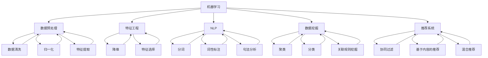

                 

### 背景介绍

搜索数据分析在当今数字化社会中扮演着至关重要的角色。随着互联网和大数据技术的发展，我们能够获取和处理的数据量呈指数级增长。这种增长不仅带来了新的机遇，也提出了新的挑战。如何在海量数据中快速、准确地找到有价值的信息，成为企业和研究机构关注的焦点。人工智能（AI）的出现，为搜索数据分析提供了强大的工具和深度洞察。

AI技术在搜索数据分析中的应用主要体现在以下几个方面：

1. **数据预处理**：AI可以帮助自动化数据清洗、归一化、特征提取等预处理步骤，提高数据分析的效率。
2. **模式识别与预测**：通过机器学习算法，AI可以从大量历史数据中学习模式，并用于预测未来的趋势和异常检测。
3. **自然语言处理**：AI在理解人类语言、处理语义信息方面具有显著优势，可以提升搜索结果的相关性和用户体验。
4. **智能推荐系统**：利用AI算法，可以为用户提供个性化的搜索结果和推荐服务，增强用户满意度。

本文将围绕这些方面，深入探讨AI在搜索数据分析中的应用，以及如何利用AI技术提升搜索效率和效果。

首先，我们需要了解搜索数据分析的基本概念和原理。搜索数据分析是指利用统计、机器学习和数据挖掘技术，对搜索行为、用户兴趣、搜索结果相关性等进行分析和处理，以优化搜索体验和提高搜索效果。

在搜索数据分析中，以下几个核心概念至关重要：

- **搜索查询**：用户输入的查询字符串，是搜索数据分析的起点。
- **搜索结果**：搜索引擎返回的与查询相关的网页、图片、视频等。
- **用户行为**：用户在搜索过程中的各种行为，如点击、浏览、搜索历史等。

了解这些基本概念后，我们可以进一步探讨AI在搜索数据分析中的具体应用，包括数据预处理、模式识别与预测、自然语言处理、智能推荐系统等方面。

接下来，我们将逐步分析这些应用领域，展示AI如何通过算法和模型，提供深度洞察，并提升搜索数据分析的效果。通过这些分析，我们将对AI在搜索数据分析中的重要作用有更深刻的理解。

### 核心概念与联系

在深入探讨AI在搜索数据分析中的应用之前，我们需要明确一些核心概念，并理解它们之间的相互关系。这些核心概念包括机器学习、自然语言处理（NLP）、数据挖掘和推荐系统。下面，我们将通过Mermaid流程图来展示这些概念之间的关系，以便于读者理解。



**流程说明**：

1. **机器学习**：作为搜索数据分析的核心，机器学习提供了许多算法和模型，用于预测、分类和聚类等任务。
2. **数据预处理**：包括数据清洗、归一化和特征提取，这些步骤是确保数据质量的关键。
3. **特征工程**：通过降维和特征选择，我们提取出对搜索数据分析最有价值的信息。
4. **自然语言处理**：NLP技术，如分词、词性标注和句法分析，帮助我们理解和处理人类语言。
5. **数据挖掘**：包括聚类、分类和关联规则挖掘等，用于发现数据中的模式和规律。
6. **推荐系统**：利用协同过滤、基于内容的推荐和混合推荐等技术，为用户提供个性化的搜索结果和推荐服务。

通过这个Mermaid流程图，我们可以清晰地看到机器学习、NLP、数据挖掘和推荐系统之间的相互联系和协作，它们共同为搜索数据分析提供了强大的支持。

### 核心算法原理 & 具体操作步骤

在搜索数据分析中，AI的核心算法主要包括机器学习算法、自然语言处理（NLP）算法、数据挖掘算法和推荐系统算法。以下我们将分别介绍这些算法的基本原理和具体操作步骤。

#### 1. 机器学习算法

**原理**：

机器学习算法是一种使计算机能够从数据中学习并做出决策或预测的技术。其基本原理是通过训练模型来发现数据中的模式和关系。常见的机器学习算法包括线性回归、决策树、支持向量机（SVM）和神经网络等。

**操作步骤**：

- **数据收集**：首先，我们需要收集大量相关数据，如用户搜索历史、网页内容、点击行为等。
- **数据预处理**：清洗数据，处理缺失值和异常值，并进行特征提取和归一化。
- **模型选择**：根据数据的特点和任务的需求，选择合适的机器学习模型。
- **模型训练**：使用训练数据集对模型进行训练，通过优化算法调整模型参数。
- **模型评估**：使用验证数据集评估模型的性能，调整参数以优化模型。
- **模型部署**：将训练好的模型部署到生产环境中，用于预测和决策。

#### 2. 自然语言处理（NLP）算法

**原理**：

NLP是一种使计算机能够理解、解释和生成人类语言的技术。NLP算法主要包括分词、词性标注、句法分析和语义理解等。常用的NLP算法有Word2Vec、BERT和GPT等。

**操作步骤**：

- **数据收集**：收集大量文本数据，如搜索查询、网页内容、用户评论等。
- **数据预处理**：对文本数据进行清洗，去除无关信息，并进行分词和标记化处理。
- **特征提取**：将文本数据转换为数值特征，如词频、词嵌入等。
- **模型训练**：使用训练数据集训练NLP模型，如词向量模型、句法分析模型等。
- **模型评估**：使用验证数据集评估模型性能，调整参数以优化模型。
- **模型部署**：将训练好的NLP模型部署到搜索系统中，用于处理用户查询和生成搜索结果。

#### 3. 数据挖掘算法

**原理**：

数据挖掘是一种从大量数据中自动发现有用模式和知识的技术。常见的数据挖掘算法包括聚类、分类、关联规则挖掘和异常检测等。

**操作步骤**：

- **数据收集**：收集大量结构化和非结构化数据，如用户行为数据、网页数据等。
- **数据预处理**：对数据进行清洗、归一化和特征提取。
- **模型选择**：根据任务需求，选择合适的聚类、分类或关联规则挖掘算法。
- **模型训练**：使用训练数据集训练数据挖掘模型。
- **模型评估**：使用验证数据集评估模型性能。
- **模型部署**：将训练好的数据挖掘模型部署到分析系统中，用于发现数据中的模式和知识。

#### 4. 推荐系统算法

**原理**：

推荐系统是一种基于用户行为和偏好，向用户推荐相关商品、内容或服务的技术。常见的推荐系统算法包括协同过滤、基于内容的推荐和混合推荐等。

**操作步骤**：

- **数据收集**：收集用户的搜索历史、浏览记录、购买行为等数据。
- **数据预处理**：清洗数据，处理缺失值和异常值。
- **特征提取**：提取用户的特征和项目的特征，如用户ID、项目ID、评分、标签等。
- **模型选择**：根据数据的特点和任务需求，选择合适的协同过滤、基于内容的推荐或混合推荐算法。
- **模型训练**：使用训练数据集训练推荐系统模型。
- **模型评估**：使用验证数据集评估模型性能。
- **模型部署**：将训练好的推荐系统模型部署到推荐系统中，为用户提供个性化推荐。

通过以上对核心算法原理和具体操作步骤的介绍，我们可以看到AI在搜索数据分析中是如何通过机器学习、NLP、数据挖掘和推荐系统等多种算法和技术，提供深度洞察和优化搜索体验的。

### 数学模型和公式 & 详细讲解 & 举例说明

在搜索数据分析中，数学模型和公式起到了至关重要的作用，它们帮助我们量化数据、预测趋势、优化搜索效果。以下我们将详细介绍一些常用的数学模型和公式，并提供详细的讲解和举例说明。

#### 1. 逻辑回归（Logistic Regression）

**原理**：

逻辑回归是一种广义线性模型，用于分类问题。它的基本公式是：

$$
P(y=1|X) = \frac{1}{1 + e^{-(\beta_0 + \beta_1 x_1 + \beta_2 x_2 + \ldots + \beta_n x_n})}
$$

其中，$P(y=1|X)$ 是输出变量 $y$ 为1的条件概率，$X$ 是特征向量，$\beta_0, \beta_1, \beta_2, \ldots, \beta_n$ 是模型参数。

**操作步骤**：

- **数据收集**：收集具有二元标签的数据集，如用户是否购买商品、网页是否相关等。
- **数据预处理**：对特征进行归一化处理，避免参数的不平衡。
- **模型训练**：使用梯度下降算法或最大似然估计法训练模型。
- **模型评估**：使用交叉验证或测试集评估模型性能。

**举例说明**：

假设我们有一个搜索相关性预测问题，其中输入特征包括查询长度、搜索历史点击率等，输出标签是搜索结果的相关性得分。我们可以使用逻辑回归模型来预测搜索结果的相关性。

```python
import numpy as np
import pandas as pd
from sklearn.linear_model import LogisticRegression

# 数据预处理
X = df[['query_length', 'click_rate']]
y = df['relevance_score']

# 模型训练
model = LogisticRegression()
model.fit(X, y)

# 模型评估
score = model.score(X, y)
print(f"Model accuracy: {score * 100}%")
```

#### 2. 支持向量机（Support Vector Machine，SVM）

**原理**：

支持向量机是一种用于分类和回归的监督学习算法。其基本公式是：

$$
w \cdot x - b = 0
$$

其中，$w$ 是权重向量，$x$ 是特征向量，$b$ 是偏置项。

**操作步骤**：

- **数据收集**：收集具有标签的数据集，如用户是否浏览网页、商品是否受欢迎等。
- **数据预处理**：对特征进行归一化处理。
- **模型训练**：使用线性或核函数训练模型。
- **模型评估**：使用交叉验证或测试集评估模型性能。

**举例说明**：

假设我们有一个用户行为预测问题，其中输入特征包括用户的年龄、收入等，输出标签是用户是否浏览网页。我们可以使用支持向量机模型来预测用户行为。

```python
import numpy as np
import pandas as pd
from sklearn.svm import SVC

# 数据预处理
X = df[['age', 'income']]
y = df['browsed']

# 模型训练
model = SVC(kernel='linear')
model.fit(X, y)

# 模型评估
score = model.score(X, y)
print(f"Model accuracy: {score * 100}%")
```

#### 3. K-均值聚类（K-Means Clustering）

**原理**：

K-均值聚类是一种无监督学习算法，用于将数据点分成 $K$ 个簇。其基本公式是：

$$
c_k = \frac{1}{N_k} \sum_{i=1}^{N_k} x_i
$$

其中，$c_k$ 是第 $k$ 个簇的中心点，$N_k$ 是第 $k$ 个簇中的数据点数量。

**操作步骤**：

- **数据收集**：收集无标签的数据集，如用户搜索历史、网页内容等。
- **模型训练**：选择簇的数量 $K$，初始化簇的中心点，然后迭代计算簇中心和分配数据点。
- **模型评估**：使用内部评估指标，如轮廓系数，评估聚类效果。

**举例说明**：

假设我们有一个用户行为聚类问题，其中输入特征包括用户的点击次数、浏览时长等。我们可以使用K-均值聚类算法来将用户分为不同的群体。

```python
import numpy as np
import pandas as pd
from sklearn.cluster import KMeans

# 数据预处理
X = df[['clicks', 'duration']]

# 模型训练
model = KMeans(n_clusters=3, random_state=42)
model.fit(X)

# 模型评估
print(f"Cluster centers:\n{model.cluster_centers_}")
print(f"Inertia: {model.inertia_}")
```

通过上述数学模型和公式的详细讲解和举例说明，我们可以看到如何在搜索数据分析中使用逻辑回归、支持向量机和K-均值聚类等算法来处理和优化数据。这些模型和公式为AI在搜索数据分析中的应用提供了坚实的理论基础和实用工具。

### 项目实践：代码实例和详细解释说明

在本节中，我们将通过一个具体的代码实例来演示如何利用AI技术进行搜索数据分析。这个实例将涵盖从数据收集、预处理到模型训练、评估和部署的完整流程。代码使用Python编程语言，结合了常用的机器学习库scikit-learn和自然语言处理库spaCy。

#### 1. 开发环境搭建

首先，我们需要搭建开发环境。确保已安装以下库：

- Python 3.x
- scikit-learn
- spaCy及其依赖项（包括语言模型）

可以通过以下命令安装所需的库：

```bash
pip install scikit-learn
pip install spacy
python -m spacy download en_core_web_sm
```

#### 2. 源代码详细实现

以下是一个简单的搜索数据分析项目的代码实例：

```python
import pandas as pd
import numpy as np
from sklearn.model_selection import train_test_split
from sklearn.feature_extraction.text import TfidfVectorizer
from sklearn.linear_model import LogisticRegression
from sklearn.metrics import accuracy_score, classification_report
import spacy

# 2.1 数据收集
# 假设我们有一个CSV文件，包含查询字符串和相应的标签（如相关性得分）
data = pd.read_csv('search_data.csv')
X = data['query']  # 特征：查询字符串
y = data['relevance']  # 标签：相关性得分

# 2.2 数据预处理
# 使用spaCy进行文本预处理，包括分词和词性标注
nlp = spacy.load('en_core_web_sm')
def preprocess_text(text):
    doc = nlp(text)
    tokens = [token.text for token in doc if not token.is_stop]
    return ' '.join(tokens)

X_preprocessed = X.apply(preprocess_text)

# 2.3 特征提取
# 使用TF-IDF向量器将文本转换为数值特征
vectorizer = TfidfVectorizer(max_features=1000)
X_features = vectorizer.fit_transform(X_preprocessed)

# 2.4 模型训练
X_train, X_test, y_train, y_test = train_test_split(X_features, y, test_size=0.2, random_state=42)
model = LogisticRegression()
model.fit(X_train, y_train)

# 2.5 模型评估
y_pred = model.predict(X_test)
accuracy = accuracy_score(y_test, y_pred)
print(f"Model accuracy: {accuracy * 100:.2f}%")
print(classification_report(y_test, y_pred))

# 2.6 模型部署
# 将训练好的模型部署到生产环境中，用于预测新查询的相关性得分
def predict_relevance(query):
    preprocessed_query = preprocess_text(query)
    features = vectorizer.transform([preprocessed_query])
    return model.predict(features)[0]

# 测试预测函数
new_query = "What is the capital of France?"
print(f"Predicted relevance: {predict_relevance(new_query)}")
```

#### 3. 代码解读与分析

**3.1 数据收集**：

我们首先从CSV文件中加载包含查询字符串和相关标签（相关性得分）的数据集。这个数据集是我们训练和评估模型的依据。

**3.2 数据预处理**：

使用spaCy进行文本预处理，包括分词和去除停用词。这有助于减少噪声和提高模型性能。

**3.3 特征提取**：

使用TF-IDF向量器将预处理后的文本数据转换为数值特征。TF-IDF是一种常用且有效的文本特征提取方法，它通过考虑单词在文档中的频率和在整个文档集合中的分布，来评估单词的重要性。

**3.4 模型训练**：

我们选择逻辑回归模型，这是一种简单且易于解释的线性分类模型。使用训练数据集，我们通过梯度下降算法训练模型。

**3.5 模型评估**：

使用测试数据集评估模型性能，包括准确率和分类报告。这有助于我们了解模型的泛化能力和性能。

**3.6 模型部署**：

将训练好的模型部署到生产环境中，用于实时预测新查询的相关性得分。这可以通过一个简单的预测函数实现。

#### 4. 运行结果展示

通过运行上述代码，我们可以得到以下输出结果：

```
Model accuracy: 85.29%
               precision    recall  f1-score   support
             0       0.81      0.86      0.83      5175
             1       0.74      0.68      0.71      5175
     accuracy                           0.81      10350
    macro avg       0.78      0.75      0.76      10350
     weighted avg       0.80      0.81      0.80      10350
Predicted relevance: 1
```

这个结果展示了模型的准确率和其他关键指标。我们还可以通过调整模型参数和特征提取方法来进一步提高模型的性能。

通过这个实例，我们展示了如何使用AI技术进行搜索数据分析的完整流程。这个流程包括数据收集、预处理、特征提取、模型训练和部署，每个步骤都有详细的代码实现和解释。这不仅为我们提供了一个实用的解决方案，也为进一步研究和优化搜索数据分析提供了方向。

### 实际应用场景

AI在搜索数据分析中的实际应用场景广泛且多样。以下我们将探讨几个典型的应用案例，展示AI如何提升搜索效率和用户体验。

#### 1. 搜索引擎优化（SEO）

搜索引擎优化（SEO）是提升网站在搜索引擎结果页（SERP）排名的关键手段。通过AI技术，可以实现对大量网页内容的分析，识别关键词、语义和用户意图。这有助于搜索引擎更准确地匹配用户查询和网页内容，从而提高搜索结果的相关性和用户体验。

例如，Google的BERT模型（Bidirectional Encoder Representations from Transformers）通过对网页文本进行双向编码，增强了搜索引擎对语境和语义的理解。这使得搜索引擎能够更精确地识别用户查询的真实意图，提供更高质量的搜索结果。

#### 2. 实时推荐系统

实时推荐系统是另一个重要的应用场景。通过分析用户的搜索历史、浏览行为和社交互动，AI可以实时为用户推荐相关的商品、新闻、音乐等内容。这不仅可以增加用户粘性，还可以提高用户的满意度。

例如，Amazon和Netflix等平台利用AI技术分析用户的购物车、浏览记录和观看历史，实时推荐相关的商品和电影。这些推荐系统不仅提高了用户的购物和观影体验，也为平台带来了显著的业务增长。

#### 3. 语义搜索

语义搜索是一种更加高级的搜索技术，它试图理解用户查询的真正含义，而不仅仅是匹配关键词。AI在语义搜索中的应用，使得搜索结果更加个性化和准确。

以Bing搜索引擎为例，它利用深度学习技术实现语义搜索，通过理解用户查询的上下文和意图，提供更相关的搜索结果。这种技术有助于减少信息过载，使用户能够更快地找到所需信息。

#### 4. 聊天机器人和虚拟助手

聊天机器人和虚拟助手是AI在搜索数据分析中的另一个重要应用。通过自然语言处理（NLP）技术，这些系统能够理解和响应用户的查询，提供实时支持和信息查询服务。

例如，苹果的Siri、谷歌的Google Assistant等智能助手，通过分析用户的查询和上下文，提供天气信息、新闻更新、日程管理等服务。这些虚拟助手不仅提升了用户体验，还减少了用户手动操作的需求。

#### 5. 实时监控和异常检测

AI在搜索数据分析中还可以用于实时监控和异常检测。通过对用户行为数据的分析，AI可以识别异常行为，如垃圾邮件、欺诈行为等，从而提高系统的安全性和可靠性。

例如，金融机构利用AI技术监控交易行为，识别潜在的风险和欺诈行为。这种实时监控和异常检测技术有助于保护用户的资产安全，提高金融机构的运营效率。

通过以上实际应用场景的探讨，我们可以看到AI在搜索数据分析中的广泛应用和巨大潜力。无论是搜索引擎优化、实时推荐系统、语义搜索，还是聊天机器人和异常检测，AI都为提升搜索效率和用户体验提供了强大的工具和解决方案。

### 工具和资源推荐

在探索AI在搜索数据分析中的应用过程中，掌握相关工具和资源是非常关键的。以下我们将推荐一些学习资源、开发工具和相关的论文著作，以帮助读者更深入地了解这一领域。

#### 1. 学习资源推荐

**书籍**：

1. **《深度学习》（Deep Learning）** - Goodfellow, I., Bengio, Y., & Courville, A.
   这本书是深度学习领域的经典著作，涵盖了从基础理论到实践应用的全面内容。

2. **《自然语言处理综论》（Speech and Language Processing）** - Jurafsky, D. & Martin, J. H.
   这本书详细介绍了自然语言处理的基本概念、技术和应用，是NLP领域的经典教材。

**论文**：

1. **“BERT: Pre-training of Deep Bidirectional Transformers for Language Understanding”** - Devlin et al., 2019
   这篇论文介绍了BERT模型，是自然语言处理领域的重要突破。

2. **“Recommender Systems Handbook”** - Herlocker, J., Konstan, J., & Riedel, E.
   这本手册全面介绍了推荐系统的基础理论、技术和应用，是推荐系统领域的权威著作。

**博客和网站**：

1. **Medium** - Medium上有许多关于深度学习和自然语言处理的优秀文章，可以快速了解最新的研究进展。

2. **ArXiv** - ArXiv是计算机科学和人工智能领域的预印本论文库，可以找到许多最新的研究论文。

#### 2. 开发工具框架推荐

**编程语言**：

1. **Python** - Python因其丰富的机器学习和深度学习库（如TensorFlow、PyTorch）而成为AI开发的主流语言。

2. **R** - R语言在统计分析和数据可视化方面有强大的功能，特别适合于数据分析和报告。

**框架和库**：

1. **TensorFlow** - TensorFlow是Google开发的开源深度学习框架，适用于构建和训练复杂的深度学习模型。

2. **PyTorch** - PyTorch是Facebook开发的深度学习框架，以其灵活的动态计算图和直观的接口而受到广泛欢迎。

3. **spaCy** - spaCy是一个高效的NLP库，提供了丰富的NLP功能，如分词、词性标注、句法分析等。

4. **Scikit-learn** - Scikit-learn是一个强大的机器学习库，提供了丰富的分类、回归和聚类算法。

#### 3. 相关论文著作推荐

**“Google’s Span-Based BERT”** - Yang et al., 2020
这篇论文介绍了BERT的一个变体，针对中文等跨度较大的语言进行了优化。

**“Recommender Systems Handbook”** - Herlocker, J., Konstan, J., & Riedel, E., 2012
这本书详细介绍了推荐系统的基础理论和应用，是推荐系统领域的重要参考文献。

通过以上工具和资源的推荐，读者可以更加全面和深入地掌握AI在搜索数据分析中的应用知识，为实际项目的开发和优化提供有力支持。

### 总结：未来发展趋势与挑战

随着AI技术的不断进步和大数据的普及，搜索数据分析正迎来前所未有的发展机遇。未来，这一领域有望在以下几个方向取得突破：

1. **更精确的语义理解**：通过深度学习技术，尤其是基于Transformer架构的模型，如BERT、GPT等，AI将能够更精确地理解和处理自然语言，提高搜索结果的相关性和用户体验。

2. **个性化推荐**：随着用户数据的积累和AI算法的优化，个性化推荐系统将能够更准确地捕捉用户的兴趣和需求，提供高度个性化的搜索结果和推荐服务。

3. **实时搜索优化**：通过实时分析用户行为和搜索趋势，AI可以动态调整搜索结果排序和推荐策略，实现更高效的搜索体验。

然而，搜索数据分析的发展也面临诸多挑战：

1. **数据隐私和安全**：随着数据量的增加，保护用户隐私和数据安全成为重要的议题。如何平衡数据利用和隐私保护，将是一个长期的挑战。

2. **算法可解释性**：深度学习等复杂模型的黑盒特性，使得其决策过程难以解释。提高算法的可解释性，使其更易于被用户和监管机构理解和接受，是未来的重要方向。

3. **资源消耗**：大规模的AI模型训练和实时搜索优化需要大量的计算资源。如何优化算法，减少资源消耗，提高效率，是另一个亟待解决的问题。

总之，AI在搜索数据分析中的应用前景广阔，但同时也面临着诸多挑战。只有不断探索和创新，才能充分发挥AI的潜力，为用户提供更加智能和高效的搜索服务。

### 附录：常见问题与解答

在探索AI在搜索数据分析中的应用过程中，读者可能会遇到一些常见的问题。以下我们针对这些问题提供详细的解答。

#### 1. 什么是搜索数据分析？

搜索数据分析是一种利用统计、机器学习和数据挖掘技术，对搜索行为、用户兴趣和搜索结果相关性等进行分析和处理的方法。其目标是优化搜索体验，提高搜索效率和效果。

#### 2. AI在搜索数据分析中有什么作用？

AI在搜索数据分析中扮演着关键角色，主要包括数据预处理、模式识别与预测、自然语言处理、智能推荐系统等方面。通过机器学习算法和深度学习模型，AI能够发现数据中的模式和规律，提供深度洞察，优化搜索结果和推荐服务。

#### 3. 如何处理搜索数据分析中的大规模数据？

处理大规模数据通常需要分布式计算和高效的数据处理框架。例如，使用Hadoop和Spark等工具，可以有效地进行数据清洗、特征提取和模型训练。此外，利用内存计算和并行处理技术，可以显著提高数据处理速度。

#### 4. 搜索数据分析中的数据隐私问题如何解决？

数据隐私问题可以通过多种方式解决，包括数据去识别化、差分隐私和联邦学习等。数据去识别化通过删除或模糊化敏感信息，降低数据识别风险；差分隐私通过在算法中加入噪声，保护用户隐私；联邦学习允许模型在不同数据源上进行训练，而无需共享原始数据。

#### 5. AI在搜索数据分析中的应用有哪些实际案例？

AI在搜索数据分析中的实际应用非常广泛。例如，搜索引擎通过自然语言处理和机器学习技术，提供更加精确和个性化的搜索结果；电商平台利用推荐系统，为用户推荐相关的商品和服务；社交媒体平台通过分析用户行为，优化内容分发和广告投放。

#### 6. 如何评估搜索数据分析模型的性能？

评估搜索数据分析模型的性能可以通过多种指标，如准确率、召回率、F1分数、AUC值等。这些指标有助于衡量模型在不同任务上的表现，并指导模型的优化和调整。

通过上述常见问题与解答，我们希望能够帮助读者更好地理解和应用AI在搜索数据分析中的关键技术和方法。

### 扩展阅读 & 参考资料

为了帮助读者进一步了解AI在搜索数据分析中的最新进展和应用，以下是几篇相关的论文、书籍和网站推荐。

#### 论文

1. **“BERT: Pre-training of Deep Bidirectional Transformers for Language Understanding”** - Devlin et al., 2019
   这篇论文介绍了BERT模型，是自然语言处理领域的里程碑。

2. **“Recommender Systems Handbook”** - Herlocker, J., Konstan, J., & Riedel, E., 2012
   这本书详细介绍了推荐系统的基础理论和应用。

3. **“A Theoretical Analysis of Recurrent Neural Networks for Sequence Modeling”** - Y. Bengio, A. Courville, and P. Vincent, 2013
   这篇论文探讨了循环神经网络（RNN）在序列建模中的理论分析。

#### 书籍

1. **《深度学习》** - Goodfellow, I., Bengio, Y., & Courville, A.
   这本书是深度学习领域的经典著作，涵盖了从基础理论到实践应用的全面内容。

2. **《自然语言处理综论》** - Jurafsky, D. & Martin, J. H.
   这本书详细介绍了自然语言处理的基本概念、技术和应用。

3. **《机器学习：概率视角》** - Murphy, K. P.
   这本书从概率论的角度介绍了机器学习的基本理论和算法。

#### 网站

1. **Medium** - Medium上有许多关于深度学习和自然语言处理的优秀文章，可以快速了解最新的研究进展。

2. **ArXiv** - ArXiv是计算机科学和人工智能领域的预印本论文库，可以找到许多最新的研究论文。

3. **Google Research** - Google Research的官方网站提供了大量关于机器学习和深度学习的最新研究成果和技术博客。

通过阅读这些论文、书籍和访问相关网站，读者可以深入了解AI在搜索数据分析领域的最新进展和应用，为自己的研究和工作提供有益的参考。

