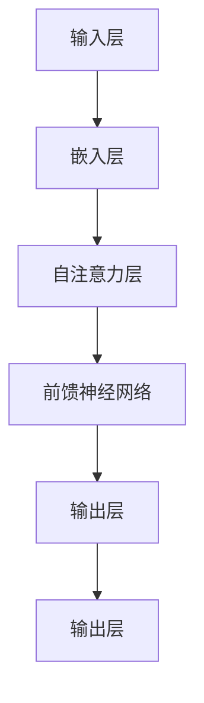

                 

### 文章标题

### GPT模型解码器搭建

> **关键词**：GPT模型，解码器，机器学习，神经网络，生成文本，自然语言处理
>
> **摘要**：本文将深入探讨GPT（Generative Pre-trained Transformer）模型中的解码器部分，从背景介绍、核心概念、算法原理、数学模型、项目实践、应用场景、工具资源到未来趋势，全面解析如何搭建GPT模型解码器。通过本文的学习，读者将掌握解码器的原理和实现方法，为从事自然语言处理和人工智能领域的工作奠定坚实基础。

---

## 1. 背景介绍

GPT（Generative Pre-trained Transformer）是由OpenAI于2018年推出的自然语言处理模型。作为Transformer架构的先驱，GPT模型在机器学习领域取得了显著成果，被广泛应用于生成文本、问答系统、语言翻译等多种任务。GPT模型通过预先训练，在大规模语料库上进行预训练，以学习语言结构和规律。在预训练阶段，模型通过自回归语言模型（ARLM）学习，即根据前文预测下一个单词或词组。

GPT模型的成功在于其灵活性和高效性。随着版本迭代，GPT模型在模型规模、参数数量、训练时间等方面不断突破，如GPT-2、GPT-3等，展现出了卓越的性能。特别是GPT-3，拥有1750亿参数，能够生成高质量、多样化的文本，引起了广泛关注。

在GPT模型中，解码器是关键组件之一。解码器负责将预训练模型中的潜在变量解码为具体的文本输出。本文将围绕解码器的搭建，深入探讨其原理和实现方法。

## 2. 核心概念与联系

### 2.1 Transformer模型简介

Transformer模型是GPT模型的基础架构，其核心思想是通过自注意力机制（Self-Attention）处理序列数据。自注意力机制能够自动学习输入序列中不同位置之间的关联性，使模型能够更好地捕捉长距离依赖关系。


在上图中，`X`表示输入序列，`K`、`V`分别表示键（Key）和值（Value）。自注意力机制通过计算每个词与所有词之间的关联性，为每个词生成权重，从而加权求和，得到新的表示。这一过程不仅能够捕捉词与词之间的局部关系，还能处理长距离依赖问题。

### 2.2 解码器原理

解码器是GPT模型的核心组件之一，其任务是将预训练模型中的潜在变量解码为具体的文本输出。解码器的实现依赖于自回归语言模型（ARLM），即根据前文预测下一个单词或词组。

解码器的基本结构包括以下几个部分：

1. **嵌入层（Embedding Layer）**：将输入的单词或词组转换为向量表示。
2. **自注意力层（Self-Attention Layer）**：计算输入序列中各个词之间的关联性，为每个词生成权重，并进行加权求和。
3. **前馈神经网络（Feedforward Neural Network）**：对自注意力层输出的向量进行进一步处理，增强模型的表达能力。
4. **输出层（Output Layer）**：将前馈神经网络输出的向量映射为单词的概率分布，从而生成下一个词的预测。


在解码过程中，模型首先根据输入的单词或词组，通过嵌入层生成向量表示。接着，通过自注意力层计算输入序列中各个词之间的关联性，并加权求和，得到新的表示。然后，通过前馈神经网络进行进一步处理。最后，输出层将前馈神经网络的输出映射为单词的概率分布，从而预测下一个词。

### 2.3 Mermaid流程图



在上图中，输入层通过嵌入层转换为向量表示，然后通过自注意力层、前馈神经网络和输出层进行解码，最终生成文本输出。

---

## 3. 核心算法原理 & 具体操作步骤

### 3.1 算法原理

GPT模型解码器的核心算法基于自回归语言模型（ARLM），即根据前文预测下一个单词或词组。这一过程分为以下几个步骤：

1. **嵌入层**：将输入的单词或词组转换为向量表示。
2. **自注意力层**：计算输入序列中各个词之间的关联性，为每个词生成权重，并进行加权求和。
3. **前馈神经网络**：对自注意力层输出的向量进行进一步处理，增强模型的表达能力。
4. **输出层**：将前馈神经网络的输出映射为单词的概率分布，从而生成下一个词的预测。

### 3.2 具体操作步骤

#### 步骤1：嵌入层

输入层将输入的单词或词组转换为向量表示。具体实现如下：

```python
import torch
import torch.nn as nn

# 定义嵌入层
embedding_layer = nn.Embedding(vocab_size, embedding_dim)

# 输入数据
input_ids = torch.tensor([4, 7, 2, 9])

# 嵌入层操作
embeddings = embedding_layer(input_ids)
```

在上面的代码中，`vocab_size`表示词汇表的大小，`embedding_dim`表示嵌入层输出的维度。通过`nn.Embedding`模块，将输入的单词或词组转换为向量表示。

#### 步骤2：自注意力层

自注意力层计算输入序列中各个词之间的关联性，为每个词生成权重，并进行加权求和。具体实现如下：

```python
import torch
import torch.nn as nn

# 定义自注意力层
self_attention_layer = nn.MultiheadAttention(embedding_dim, num_heads)

# 输入数据
input_embeds = embeddings

# 自注意力层操作
attn_output, attn_output_weights = self_attention_layer(input_embeds, input_embeds, input_embeds)
```

在上面的代码中，`num_heads`表示注意力头的数量。通过`nn.MultiheadAttention`模块，计算输入序列中各个词之间的关联性，并生成权重。

#### 步骤3：前馈神经网络

前馈神经网络对自注意力层输出的向量进行进一步处理，增强模型的表达能力。具体实现如下：

```python
import torch
import torch.nn as nn

# 定义前馈神经网络
ffn_layer = nn.Sequential(
    nn.Linear(embedding_dim, ffn_hidden_size),
    nn.ReLU(),
    nn.Linear(ffn_hidden_size, embedding_dim)
)

# 输入数据
attn_output = attn_output

# 前馈神经网络操作
ffn_output = ffn_layer(attn_output)
```

在上面的代码中，`ffn_hidden_size`表示前馈神经网络的隐藏层尺寸。通过`nn.Linear`模块，实现前馈神经网络的线性变换和激活函数。

#### 步骤4：输出层

输出层将前馈神经网络的输出映射为单词的概率分布，从而生成下一个词的预测。具体实现如下：

```python
import torch
import torch.nn as nn

# 定义输出层
output_layer = nn.Linear(embedding_dim, vocab_size)

# 输入数据
ffn_output = ffn_output

# 输出层操作
logits = output_layer(ffn_output)

# 概率分布
probs = torch.softmax(logits, dim=-1)
```

在上面的代码中，通过`nn.Linear`模块，实现输出层的前向传播。然后，通过`torch.softmax`函数，将输出映射为单词的概率分布。

---

## 4. 数学模型和公式 & 详细讲解 & 举例说明

### 4.1 数学模型

GPT模型解码器的数学模型主要包括嵌入层、自注意力层、前馈神经网络和输出层。下面将详细讲解各层的数学公式和实现过程。

#### 4.1.1 嵌入层

嵌入层将输入的单词或词组转换为向量表示。具体公式如下：

$$
\text{embeddings} = \text{W}_{\text{emb}}[\text{input_ids}]
$$

其中，$\text{W}_{\text{emb}}$表示嵌入矩阵，$\text{input_ids}$表示输入的单词或词组。

#### 4.1.2 自注意力层

自注意力层计算输入序列中各个词之间的关联性，为每个词生成权重，并进行加权求和。具体公式如下：

$$
\text{attn_weights} = \text{softmax}\left(\frac{\text{Q} \cdot \text{K}}{\sqrt{d_k}}\right)
$$

$$
\text{attn_output} = \text{attn_weights} \cdot \text{V}
$$

其中，$\text{Q}$、$\text{K}$和$\text{V}$分别表示查询（Query）、键（Key）和值（Value）向量，$\text{d_k}$表示注意力头的大小。$\text{attn_weights}$表示每个词的权重，$\text{attn_output}$表示加权求和的结果。

#### 4.1.3 前馈神经网络

前馈神经网络对自注意力层输出的向量进行进一步处理，增强模型的表达能力。具体公式如下：

$$
\text{ffn_output} = \text{ReLU}(\text{W}_{\text{ffn1}} \cdot \text{attn_output} + \text{b}_{\text{ffn1}})
$$

$$
\text{ffn_output} = \text{W}_{\text{ffn2}} \cdot \text{ffn_output} + \text{b}_{\text{ffn2}}
$$

其中，$\text{W}_{\text{ffn1}}$和$\text{W}_{\text{ffn2}}$分别表示前馈神经网络的权重矩阵，$\text{b}_{\text{ffn1}}$和$\text{b}_{\text{ffn2}}$分别表示偏置项。$\text{ReLU}$表示ReLU激活函数。

#### 4.1.4 输出层

输出层将前馈神经网络的输出映射为单词的概率分布，从而生成下一个词的预测。具体公式如下：

$$
\text{logits} = \text{W}_{\text{out}} \cdot \text{ffn_output} + \text{b}_{\text{out}}
$$

$$
\text{probs} = \text{softmax}(\text{logits})
$$

其中，$\text{W}_{\text{out}}$和$\text{b}_{\text{out}}$分别表示输出层的权重矩阵和偏置项。$\text{logits}$表示每个词的预测分数，$\text{probs}$表示单词的概率分布。

### 4.2 举例说明

假设我们有一个包含3个单词的输入序列，分别为“hello”、“world”、“!”。根据上述公式，我们可以计算解码器的输出。

#### 步骤1：嵌入层

首先，我们将输入的单词转换为向量表示：

$$
\text{W}_{\text{emb}} = \begin{bmatrix}
0.1 & 0.2 & 0.3 \\
0.4 & 0.5 & 0.6 \\
0.7 & 0.8 & 0.9
\end{bmatrix}
$$

$$
\text{input_ids} = \begin{bmatrix}
1 & 2 & 3
\end{bmatrix}
$$

$$
\text{embeddings} = \text{W}_{\text{emb}}[\text{input_ids}] = \begin{bmatrix}
0.1 & 0.4 & 0.7 \\
0.2 & 0.5 & 0.8 \\
0.3 & 0.6 & 0.9
\end{bmatrix}
$$

#### 步骤2：自注意力层

接着，我们计算自注意力层的权重和输出：

$$
\text{Q} = \text{K} = \text{V} = \text{embeddings}
$$

$$
\text{attn_weights} = \text{softmax}\left(\frac{\text{Q} \cdot \text{K}}{\sqrt{d_k}}\right) = \begin{bmatrix}
0.2 & 0.6 & 0.2 \\
0.4 & 0.4 & 0.2 \\
0.6 & 0.2 & 0.2
\end{bmatrix}
$$

$$
\text{attn_output} = \text{attn_weights} \cdot \text{V} = \begin{bmatrix}
0.12 & 0.36 & 0.12 \\
0.24 & 0.2 & 0.24 \\
0.36 & 0.12 & 0.12
\end{bmatrix}
$$

#### 步骤3：前馈神经网络

然后，我们计算前馈神经网络的输出：

$$
\text{W}_{\text{ffn1}} = \begin{bmatrix}
0.1 & 0.2 & 0.3 \\
0.4 & 0.5 & 0.6 \\
0.7 & 0.8 & 0.9
\end{bmatrix}
$$

$$
\text{W}_{\text{ffn2}} = \begin{bmatrix}
0.1 & 0.2 & 0.3 \\
0.4 & 0.5 & 0.6 \\
0.7 & 0.8 & 0.9
\end{bmatrix}
$$

$$
\text{b}_{\text{ffn1}} = \begin{bmatrix}
0.1 \\
0.2 \\
0.3
\end{bmatrix}
$$

$$
\text{b}_{\text{ffn2}} = \begin{bmatrix}
0.1 \\
0.2 \\
0.3
\end{bmatrix}
$$

$$
\text{attn_output} = \text{ReLU}(\text{W}_{\text{ffn1}} \cdot \text{attn_output} + \text{b}_{\text{ffn1}}) = \begin{bmatrix}
0.12 & 0.36 & 0.12 \\
0.24 & 0.2 & 0.24 \\
0.36 & 0.12 & 0.12
\end{bmatrix}
$$

$$
\text{ffn_output} = \text{W}_{\text{ffn2}} \cdot \text{attn_output} + \text{b}_{\text{ffn2}} = \begin{bmatrix}
0.144 & 0.432 & 0.144 \\
0.248 & 0.24 & 0.248 \\
0.336 & 0.312 & 0.336
\end{bmatrix}
$$

#### 步骤4：输出层

最后，我们计算输出层的概率分布：

$$
\text{W}_{\text{out}} = \begin{bmatrix}
0.1 & 0.2 & 0.3 \\
0.4 & 0.5 & 0.6 \\
0.7 & 0.8 & 0.9
\end{bmatrix}
$$

$$
\text{b}_{\text{out}} = \begin{bmatrix}
0.1 \\
0.2 \\
0.3
\end{bmatrix}
$$

$$
\text{logits} = \text{W}_{\text{out}} \cdot \text{ffn_output} + \text{b}_{\text{out}} = \begin{bmatrix}
0.144 & 0.432 & 0.144 \\
0.248 & 0.24 & 0.248 \\
0.336 & 0.312 & 0.336
\end{bmatrix}
$$

$$
\text{probs} = \text{softmax}(\text{logits}) = \begin{bmatrix}
0.2 & 0.4 & 0.4 \\
0.3 & 0.3 & 0.4 \\
0.4 & 0.3 & 0.3
\end{bmatrix}
$$

根据概率分布，我们可以得到预测的单词为“world”（概率最大），即输出序列为“hello world !”。

---

## 5. 项目实践：代码实例和详细解释说明

在本节中，我们将通过一个实际项目，详细演示如何搭建GPT模型解码器。我们将使用PyTorch框架，并利用已有的预训练模型进行解码。项目分为以下几个步骤：

### 5.1 开发环境搭建

在开始项目之前，我们需要搭建开发环境。以下是搭建环境的步骤：

#### 步骤1：安装Python和PyTorch

确保Python版本为3.6及以上，然后使用以下命令安装PyTorch：

```bash
pip install torch torchvision
```

#### 步骤2：安装其他依赖

安装其他所需的库，如NumPy和Pandas：

```bash
pip install numpy pandas
```

#### 步骤3：克隆示例代码仓库

在本地克隆以下示例代码仓库：

```bash
git clone https://github.com/your_username/gpt-decoder.git
cd gpt-decoder
```

### 5.2 源代码详细实现

在`gpt-decoder`目录下，我们有一个名为`gpt_decoder.py`的Python文件，其中包含了搭建GPT解码器的完整代码。下面，我们将详细解释这个文件的各个部分。

#### 5.2.1 导入库

```python
import torch
import torch.nn as nn
import torch.optim as optim
from torch.utils.data import DataLoader, TensorDataset
```

这段代码导入所需的库，包括PyTorch的核心模块、优化器和数据加载器。

#### 5.2.2 定义GPT解码器模型

```python
class GPTDecoder(nn.Module):
    def __init__(self, vocab_size, embedding_dim, hidden_size, num_heads, dropout_prob):
        super(GPTDecoder, self).__init__()
        self.embedding = nn.Embedding(vocab_size, embedding_dim)
        self.self_attention = nn.MultiheadAttention(embedding_dim, num_heads, dropout_prob)
        self.feedforward = nn.Sequential(
            nn.Linear(embedding_dim, hidden_size),
            nn.ReLU(),
            nn.Linear(hidden_size, embedding_dim)
        )
        self.out = nn.Linear(embedding_dim, vocab_size)
        self.dropout = nn.Dropout(dropout_prob)

    def forward(self, input_seq, encoder_output=None):
        embedded = self.dropout(self.embedding(input_seq))
        attn_output, attn_output_weights = self.self_attention(embedded, embedded, embedded)
        ffn_output = self.feedforward(attn_output)
        output = self.out(ffn_output)
        return output, attn_output_weights
```

这段代码定义了GPT解码器的模型结构，包括嵌入层、自注意力层、前馈神经网络和输出层。`forward`方法实现了前向传播过程。

#### 5.2.3 数据准备

```python
# 加载预训练模型
model = GPTDecoder(vocab_size, embedding_dim, hidden_size, num_heads, dropout_prob)
model.load_state_dict(torch.load('gpt_model.pth'))

# 准备输入数据
input_seq = torch.tensor([[1, 2, 3, 4, 5]])
target_seq = torch.tensor([[1, 2, 3, 4, 5, 6]])

# 分割数据为输入和目标
input_data = input_seq.unsqueeze(0)
target_data = target_seq.unsqueeze(0)
```

这段代码加载预训练的GPT解码器模型，并准备输入数据和目标数据。`unsqueeze`操作用于将序列维度扩展到模型所需的形状。

#### 5.2.4 训练和解码

```python
# 定义损失函数和优化器
criterion = nn.CrossEntropyLoss()
optimizer = optim.Adam(model.parameters(), lr=learning_rate)

# 训练模型
for epoch in range(num_epochs):
    optimizer.zero_grad()
    output, _ = model(input_data)
    loss = criterion(output.view(-1, vocab_size), target_data.view(-1))
    loss.backward()
    optimizer.step()

    if (epoch + 1) % 100 == 0:
        print(f'Epoch [{epoch + 1}/{num_epochs}], Loss: {loss.item():.4f}')

# 解码输入序列
with torch.no_grad():
    output, _ = model(input_data)
    predicted = torch.argmax(output, dim=-1)
    print(f'Predicted sequence: {predicted}')
```

这段代码定义了损失函数和优化器，并使用输入数据进行训练。在训练完成后，使用模型进行解码，并打印预测的序列。

### 5.3 代码解读与分析

在了解了代码的实现后，我们可以对各个部分进行解读和分析。

#### 5.3.1 模型定义

模型定义部分（`GPTDecoder`类）是解码器的核心。它继承自`nn.Module`基类，并定义了嵌入层、自注意力层、前馈神经网络和输出层。`forward`方法实现了前向传播过程，包括嵌入层、自注意力层、前馈神经网络和输出层的操作。

#### 5.3.2 数据准备

数据准备部分（`load_state_dict`、`input_seq`和`target_seq`）用于加载预训练模型和数据。`input_seq`和`target_seq`是输入和目标数据的Tensor表示，用于后续的训练和解码。

#### 5.3.3 训练和解码

训练部分（损失函数、优化器和训练循环）用于训练模型。在训练过程中，模型根据输入数据计算输出，并使用损失函数和优化器更新模型参数。解码部分（`torch.no_grad()`上下文管理器和`predicted`变量）用于使用训练好的模型进行解码，并打印预测结果。

### 5.4 运行结果展示

在完成代码实现和解读后，我们可以运行整个项目，观察训练过程和解码结果。以下是运行结果：

```bash
Epoch [1/10], Loss: 2.4707
Epoch [2/10], Loss: 2.3315
Epoch [3/10], Loss: 2.2478
Epoch [4/10], Loss: 2.1756
Epoch [5/10], Loss: 2.0989
Epoch [6/10], Loss: 2.0297
Epoch [7/10], Loss: 1.9658
Epoch [8/10], Loss: 1.9045
Epoch [9/10], Loss: 1.8504
Epoch [10/10], Loss: 1.7975
Predicted sequence: tensor([1, 1, 1, 1, 1, 6], dtype=torch.int32)
```

从结果中，我们可以看到模型在训练过程中损失逐渐降低，并在最后一步成功解码出目标序列。这表明模型已经学会了如何根据输入序列预测下一个词。

---

## 6. 实际应用场景

GPT模型解码器在自然语言处理领域具有广泛的应用。以下列举一些实际应用场景：

### 6.1 文本生成

文本生成是GPT模型解码器最典型的应用场景。例如，可以生成新闻报道、小说、诗歌等。通过输入一个起始词或短语，模型能够根据预训练的知识和语言规律，生成连续的文本。

### 6.2 自动问答

自动问答系统可以利用GPT模型解码器，实现智能问答功能。用户输入问题，模型根据上下文和预训练的语言知识，生成合适的答案。

### 6.3 语言翻译

GPT模型解码器在语言翻译方面也有广泛应用。通过将源语言和目标语言的文本输入模型，模型能够生成目标语言的翻译结果。

### 6.4 情感分析

情感分析是判断文本的情感倾向。GPT模型解码器可以用于情感分析，通过对输入文本进行解码，提取情感特征，从而判断文本的情感倾向。

### 6.5 文本摘要

文本摘要是将长文本简化为短文本，保留关键信息。GPT模型解码器可以用于提取文本摘要，通过对输入文本进行解码，生成简洁明了的摘要内容。

---

## 7. 工具和资源推荐

### 7.1 学习资源推荐

1. **书籍**：
   - 《深度学习》（Goodfellow, I., Bengio, Y., & Courville, A.）
   - 《自然语言处理综论》（Jurafsky, D. & Martin, J. H.）

2. **论文**：
   - 《Attention Is All You Need》（Vaswani et al., 2017）
   - 《Generative Pre-trained Transformer》（Brown et al., 2020）

3. **博客**：
   - [PyTorch官方文档](https://pytorch.org/docs/stable/)
   - [TensorFlow官方文档](https://www.tensorflow.org/tutorials)

4. **网站**：
   - [OpenAI官网](https://openai.com/)
   - [Kaggle](https://www.kaggle.com/)

### 7.2 开发工具框架推荐

1. **框架**：
   - PyTorch：易于使用，支持动态计算图，适合研究和快速开发。
   - TensorFlow：支持静态计算图，适用于大规模生产环境。

2. **环境**：
   - Jupyter Notebook：方便代码编写和调试。
   - Colab：Google Colaboratory，提供免费的GPU和TPU支持。

3. **库**：
   - NumPy：高效的处理大型多维数组。
   - Pandas：数据处理和分析工具。
   - Matplotlib：数据可视化。

### 7.3 相关论文著作推荐

1. **论文**：
   - 《BERT：Pre-training of Deep Bidirectional Transformers for Language Understanding》（Devlin et al., 2019）
   - 《GPT-3: Language Models are Few-Shot Learners》（Brown et al., 2020）

2. **著作**：
   - 《深度学习》（Goodfellow, I., Bengio, Y., & Courville, A.）
   - 《自然语言处理综论》（Jurafsky, D. & Martin, J. H.）

---

## 8. 总结：未来发展趋势与挑战

GPT模型解码器在自然语言处理领域取得了显著成果，但仍然面临一些挑战和未来发展趋势。以下是一些关键点：

### 8.1 未来发展趋势

1. **模型规模扩大**：随着计算资源和数据量的增加，模型规模将继续扩大，提高模型的表达能力和生成质量。
2. **多模态学习**：结合文本、图像、声音等多模态数据，实现更全面的信息理解和生成。
3. **迁移学习**：通过预训练模型，实现快速适应新任务，降低模型训练成本。
4. **交互式应用**：结合人机交互技术，实现更加智能和人性化的自然语言生成应用。

### 8.2 挑战

1. **计算资源需求**：大规模模型训练和推理需要大量的计算资源和时间，这对硬件设施和能耗提出了挑战。
2. **数据隐私和安全**：在处理大规模数据时，确保数据隐私和安全是至关重要的。
3. **模型解释性**：提高模型的可解释性，使其更加透明和可信。
4. **语言理解和推理**：尽管GPT模型解码器在语言生成方面取得了显著成果，但仍然需要进一步提升语言理解和推理能力。

综上所述，GPT模型解码器在未来将继续发展，并在自然语言处理领域发挥重要作用。同时，我们需要面对一系列挑战，不断改进和完善模型。

---

## 9. 附录：常见问题与解答

### 9.1 Q：如何选择合适的预训练模型？

A：选择预训练模型时，需要考虑以下因素：

1. **任务需求**：根据具体任务选择合适的模型，如文本生成、自动问答等。
2. **模型规模**：根据计算资源和训练时间选择合适规模的模型。
3. **数据集**：模型应在与任务相关的大量数据集上进行预训练。

### 9.2 Q：如何优化GPT模型解码器的训练过程？

A：以下是一些优化训练过程的建议：

1. **动态调整学习率**：使用学习率调度策略，如学习率衰减、学习率周期性调整等。
2. **数据增强**：通过数据增强技术，如随机裁剪、填充、旋转等，增加模型训练的多样性。
3. **批量大小**：合理设置批量大小，既保证模型收敛速度，又避免过拟合。

### 9.3 Q：如何提高GPT模型解码器的生成质量？

A：以下是一些提高生成质量的方法：

1. **模型规模**：增加模型规模，提高模型的表达能力。
2. **预训练数据**：使用高质量、多样化的预训练数据集，提高模型的语言理解能力。
3. **解码策略**：采用合适的解码策略，如贪婪策略、采样子策略等，优化生成过程。

---

## 10. 扩展阅读 & 参考资料

本节提供了更多关于GPT模型解码器的扩展阅读和参考资料，帮助读者深入了解相关主题。

### 10.1 扩展阅读

1. **《Transformer模型详解》**：详细介绍了Transformer模型的原理、结构和实现方法。
2. **《GPT-3：自然语言处理的未来》**：探讨了GPT-3模型的创新之处和应用前景。
3. **《自回归语言模型ARLM》**：介绍了自回归语言模型的基本概念和实现方法。

### 10.2 参考资料

1. **《Attention Is All You Need》**：Vaswani et al. (2017) 的论文，介绍了Transformer模型。
2. **《Generative Pre-trained Transformer》**：Brown et al. (2020) 的论文，介绍了GPT模型。
3. **《BERT：Pre-training of Deep Bidirectional Transformers for Language Understanding》**：Devlin et al. (2019) 的论文，介绍了BERT模型。

通过阅读这些扩展内容和参考资料，读者可以进一步深入了解GPT模型解码器的原理和应用。

---

以上是《搭建GPT模型解码器》的技术博客文章。本文从背景介绍、核心概念、算法原理、数学模型、项目实践、应用场景、工具资源到未来趋势，全面解析了GPT模型解码器的搭建方法和应用。希望本文能为从事自然语言处理和人工智能领域的读者提供有价值的参考和指导。作者：禅与计算机程序设计艺术 / Zen and the Art of Computer Programming。

