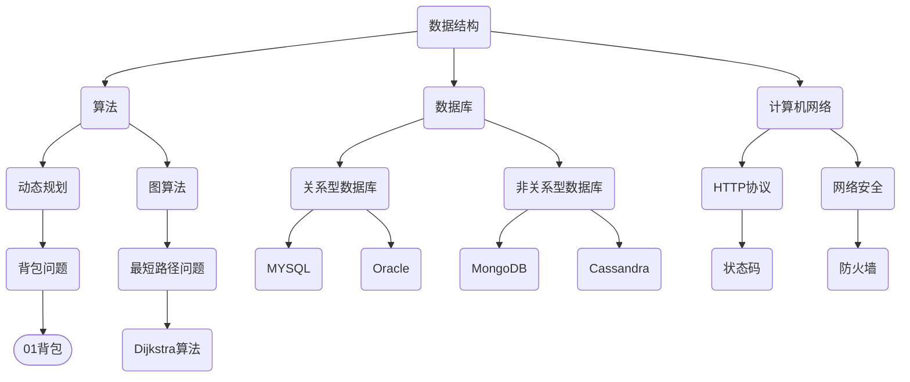

                 

### 1. 背景介绍

携程作为中国领先的综合性旅行服务平台，其校招面试一直以来都是广大应届毕业生们非常关注的话题。2024年，携程再次以其严谨的面试流程和深度的技术考察，吸引了众多应届毕业生的目光。本文旨在汇总2024年携程酒店校招面试的真题，并提供详细的解答，帮助读者更好地理解面试内容和技巧。

### 1.1 携程酒店业务概述

携程酒店业务是携程旗下的核心业务之一，涵盖了在线酒店预订、酒店会员服务、酒店管理系统等多个领域。作为国内最大的酒店预订平台，携程酒店业务在技术创新、用户体验和市场份额方面都具有显著优势。携程酒店业务的快速发展，不仅为用户提供了便捷的住宿服务，也为酒店行业带来了数字化转型的新机遇。

### 1.2 校招面试的重要性和意义

对于应届毕业生来说，校招面试是企业选拔人才的重要环节。面试不仅是对求职者专业技能的考核，也是对求职者综合素质、团队协作能力和沟通能力的全面评估。通过校招面试，应届毕业生有机会进入心仪的企业，为自己的职业生涯奠定坚实基础。因此，了解和准备校招面试题目具有重要意义。

### 1.3 面试流程和考试形式

携程酒店校招面试通常包括以下环节：

- **在线测评**：通过在线测评系统，考察应聘者的编程能力、逻辑思维和问题解决能力。
- **技术面试**：面试官通过技术面试，深入了解应聘者的专业知识、项目经验和实际操作能力。
- **行为面试**：通过行为面试，评估应聘者的团队合作能力、沟通能力和领导力。

面试形式多样，既有在线笔试，也有现场面试，还有电话面试和视频面试等。考生需要根据具体情况，做好充分准备。

### 1.4 文章组织结构

本文将按照以下结构进行撰写：

- **第1章**：背景介绍，包括携程酒店业务概述、校招面试的重要性和面试流程。
- **第2章**：核心概念与联系，通过Mermaid流程图展示面试中的关键概念和联系。
- **第3章**：核心算法原理与具体操作步骤，详细介绍面试中的核心算法和解题思路。
- **第4章**：数学模型和公式，讲解面试中的数学模型和公式，并提供详细讲解和举例说明。
- **第5章**：项目实践，通过代码实例展示如何应用所学知识和技能解决实际问题。
- **第6章**：实际应用场景，分析面试题在现实中的应用场景和解决方案。
- **第7章**：工具和资源推荐，推荐学习资源和开发工具，帮助读者更好地准备面试。
- **第8章**：总结，总结本文内容，展望未来发展趋势和挑战。
- **第9章**：附录，解答常见问题，提供扩展阅读和参考资料。

接下来，我们将进入第2章，核心概念与联系，通过Mermaid流程图展示面试中的关键概念和联系。

<|assistant|>### 2. 核心概念与联系

在2024年携程酒店校招面试中，面试官会通过一系列技术题目来考察应聘者的综合素质和专业技能。这些题目通常涉及核心概念和联系，如数据结构与算法、数据库原理、计算机网络等。为了更好地理解和掌握这些概念，我们可以通过Mermaid流程图来展示它们之间的联系。

#### 2.1 Mermaid流程图

Mermaid是一种方便的Markdown格式图表工具，可以帮助我们绘制流程图、序列图、时序图等。以下是一个示例Mermaid流程图，展示了面试中的几个核心概念：



在上面的流程图中，我们定义了数据结构、算法、数据库、计算机网络等核心概念，并展示了它们之间的联系。

#### 2.2 数据结构与算法

数据结构是计算机存储数据的方式，而算法是解决问题的步骤和方法。在面试中，常见的数据结构包括数组、链表、栈、队列、树、图等。算法则包括排序、查找、递归、动态规划、贪心算法等。以下是几个常见的数据结构和算法的概念：

- **数组**：一种线性数据结构，用于存储固定大小的元素序列。
- **链表**：一种线性数据结构，由一系列节点组成，每个节点包含数据和指向下一个节点的指针。
- **栈**：一种后进先出（LIFO）的数据结构，适用于解决逆序问题。
- **队列**：一种先进先出（FIFO）的数据结构，适用于解决顺序问题。
- **树**：一种层次结构，用于表示节点之间的关系。
- **图**：一种由节点和边组成的数据结构，用于表示复杂关系。

#### 2.3 数据库原理

数据库是存储和管理数据的系统。在面试中，常见的问题包括关系型数据库和非关系型数据库的区别、SQL语句的使用、数据库的性能优化等。以下是几个数据库的核心概念：

- **关系型数据库**：基于表和关系的数据存储系统，如MySQL、Oracle等。
- **非关系型数据库**：不同于关系型数据库，如MongoDB、Cassandra等，适用于处理大规模数据和高并发场景。
- **SQL**：结构化查询语言，用于数据库查询、更新和管理。
- **索引**：数据库中用于加速查询的数据结构，如B树、哈希索引等。

#### 2.4 计算机网络

计算机网络是连接多台计算机以实现数据传输和资源共享的系统。在面试中，常见的问题包括网络协议、网络安全、网络性能优化等。以下是几个计算机网络的核心概念：

- **HTTP协议**：超文本传输协议，用于Web应用程序的数据传输。
- **TCP/IP协议**：传输控制协议/因特网协议，是互联网的基础协议。
- **状态码**：HTTP响应状态码，用于表示请求的结果，如200（成功）、404（未找到）等。
- **防火墙**：网络安全系统，用于控制网络流量并防止未授权访问。

通过以上流程图和概念介绍，我们为读者提供了一个清晰的结构，以帮助理解携程酒店校招面试中的核心概念和联系。在接下来的章节中，我们将进一步探讨这些概念在面试中的具体应用。

### 3. 核心算法原理 & 具体操作步骤

在携程酒店校招面试中，核心算法原理是一个重要的考察点。下面，我们将详细介绍几个常见的核心算法原理，并给出具体的操作步骤。

#### 3.1 动态规划

动态规划是一种用于解决最优化问题的算法，其核心思想是将复杂问题分解为更简单的子问题，并利用子问题的最优解推导出原问题的最优解。

**动态规划原理：**

1. **定义状态**：首先，我们需要定义一个状态变量来表示问题的解，通常使用数组或哈希表来实现。
2. **状态转移方程**：然后，我们需要根据问题的性质，推导出状态转移方程，即如何从当前状态推导出下一个状态。
3. **初始化**：初始化状态数组或哈希表的初始值。
4. **求解**：最后，通过迭代求解状态数组或哈希表，得到问题的最优解。

**具体操作步骤：**

1. **定义状态**：以背包问题为例，我们定义状态`dp[i][j]`表示将前`i`个物品放入容量为`j`的背包中可以获得的最大价值。
2. **状态转移方程**：对于每个物品`i`和每个背包容量`j`，我们考虑两种情况：
   - 不放入背包：`dp[i][j] = dp[i-1][j]`
   - 放入背包：`dp[i][j] = dp[i-1][j-w[i]] + v[i]`，其中`w[i]`是物品`i`的重量，`v[i]`是物品`i`的价值。
3. **初始化**：初始化`dp[0][j] = 0`，表示不放入任何物品的背包价值为0。
4. **求解**：通过迭代求解`dp[i][j]`，得到最终的最大价值。

**Python代码示例：**

```python
def knapsack(values, weights, capacity):
    n = len(values)
    dp = [[0] * (capacity + 1) for _ in range(n + 1)]
    
    for i in range(1, n + 1):
        for j in range(1, capacity + 1):
            if j >= weights[i-1]:
                dp[i][j] = max(dp[i-1][j], dp[i-1][j-weights[i-1]] + values[i-1])
            else:
                dp[i][j] = dp[i-1][j]
    
    return dp[n][capacity]

values = [60, 100, 120]
weights = [10, 20, 30]
capacity = 50

print(knapsack(values, weights, capacity))
```

#### 3.2 最短路径问题

最短路径问题是一个经典的算法问题，用于找到图中两点之间的最短路径。常见的算法包括Dijkstra算法和Floyd-Warshall算法。

**Dijkstra算法原理：**

1. **初始化**：将所有顶点的距离初始化为无穷大，源点的距离初始化为0。
2. **选择未处理的顶点**：每次选择距离源点最近的未处理顶点。
3. **更新距离**：对于选定的顶点，更新其相邻顶点的距离。
4. **重复步骤2和3**，直到所有顶点的距离都被计算出来。

**具体操作步骤：**

1. **初始化**：初始化距离数组`dist`，设置`dist[source] = 0`，其余为无穷大。
2. **选择未处理的顶点**：使用优先队列选择距离最小的顶点。
3. **更新距离**：对于选定的顶点，遍历其邻接点，更新邻接点的距离。
4. **重复步骤2和3**，直到所有顶点的距离都被计算出来。

**Python代码示例：**

```python
import heapq

def dijkstra(graph, source):
    n = len(graph)
    dist = [float('inf')] * n
    dist[source] = 0
    priority_queue = [(0, source)]
    
    while priority_queue:
        current_dist, current_vertex = heapq.heappop(priority_queue)
        
        if current_dist > dist[current_vertex]:
            continue
        
        for neighbor, weight in graph[current_vertex].items():
            distance = current_dist + weight
            
            if distance < dist[neighbor]:
                dist[neighbor] = distance
                heapq.heappush(priority_queue, (distance, neighbor))
    
    return dist

graph = {
    0: {1: 4, 7: 8},
    1: {2: 8, 7: 11},
    2: {3: 7, 6: 2},
    3: {4: 9, 5: 14},
    4: {5: 10},
    5: {},
    6: {5: 1},
    7: {0: 4, 1: 11, 8: 7},
    8: {2: 2, 7: 7, 9: 10},
    9: {3: 4, 10: 9},
    10: {4: 10, 6: 6}
}

print(dijkstra(graph, 0))
```

通过以上两个算法的详细介绍和代码示例，我们可以更好地理解面试中的核心算法原理和具体操作步骤。在接下来的章节中，我们将进一步探讨这些算法在实际应用中的数学模型和公式。

### 4. 数学模型和公式 & 详细讲解 & 举例说明

在面试中，数学模型和公式是解决复杂问题的重要工具。本章节将详细讲解面试中常见的数学模型和公式，并提供具体的例子来说明如何应用这些公式。

#### 4.1 动态规划中的状态转移方程

动态规划中的状态转移方程是解决最优化问题的关键。下面我们以背包问题和最短路径问题为例，介绍如何建立状态转移方程。

**4.1.1 背包问题**

背包问题的目标是找到在给定物品重量和价值的情况下，能够放入固定容量背包中的物品组合，使得总价值最大化。状态转移方程可以表示为：

$$
dp[i][j] =
\begin{cases}
dp[i-1][j] & \text{如果 } j \leq w_i \\
dp[i-1][j] & \text{否则}
\end{cases}
$$

其中，$dp[i][j]$表示在前$i$个物品中，背包容量为$j$时能够获得的最大价值。$w_i$表示物品$i$的重量，$v_i$表示物品$i$的价值。

**举例说明**：

假设有3个物品，重量分别为$w_1 = 2, w_2 = 3, w_3 = 5$，价值分别为$v_1 = 3, v_2 = 4, v_3 = 5$，背包容量为$W = 5$。我们可以建立如下状态转移方程：

$$
dp[1][1] =
\begin{cases}
0 & \text{如果 } 1 \leq 2 \\
3 & \text{否则}
\end{cases}
$$

$$
dp[2][2] =
\begin{cases}
0 & \text{如果 } 2 \leq 5 \\
4 & \text{否则}
\end{cases}
$$

$$
dp[3][3] =
\begin{cases}
0 & \text{如果 } 3 \leq 5 \\
5 & \text{否则}
\end{cases}
$$

通过状态转移方程，我们可以计算出所有可能的物品组合和背包容量，从而找到最大价值。

**4.1.2 最短路径问题**

最短路径问题中，常见的Dijkstra算法可以通过以下状态转移方程求解：

$$
d[v] = \min(d[u] + w(u, v)), \forall (u, v) \in E
$$

其中，$d[v]$表示从源点$s$到顶点$v$的最短路径长度，$d[u]$表示从源点$s$到顶点$u$的最短路径长度，$w(u, v)$表示顶点$u$到顶点$v$的边权重。

**举例说明**：

假设有5个顶点$s, t, u, v, w$，边权重如下：

$$
w(s, t) = 4, w(s, u) = 8, w(u, v) = 7, w(v, w) = 9, w(t, w) = 10
$$

我们可以建立如下状态转移方程：

$$
d[t] = \min(d[s] + w(s, t)), \forall (s, t) \in E
$$

$$
d[u] = \min(d[s] + w(s, u)), \forall (s, u) \in E
$$

$$
d[v] = \min(d[u] + w(u, v)), \forall (u, v) \in E
$$

$$
d[w] = \min(d[v] + w(v, w)), \forall (v, w) \in E
$$

通过不断更新$d[v]$的值，我们可以求得从源点$s$到其他顶点的最短路径长度。

#### 4.2 最优化问题中的拉格朗日乘数法

拉格朗日乘数法是一种用于解决约束优化问题的方法。它通过引入拉格朗日乘子来构造拉格朗日函数，并求解最优解。

**拉格朗日函数：**

$$
L(x, \lambda) = f(x) + \sum_{i=1}^{m} \lambda_i g_i(x)
$$

其中，$f(x)$是目标函数，$g_i(x)$是第$i$个约束条件，$\lambda_i$是第$i$个拉格朗日乘子。

**求解步骤：**

1. **构造拉格朗日函数**：根据目标函数和约束条件，构造拉格朗日函数。
2. **求解拉格朗日乘子**：求解拉格朗日函数的偏导数，并设置为零，得到拉格朗日乘子的值。
3. **优化目标函数**：将拉格朗日乘子的值代入拉格朗日函数，求得最优解。

**举例说明**：

假设目标函数$f(x) = x^2 + y^2$，约束条件$g_1(x, y) = x + y - 1 = 0$，我们可以构造如下拉格朗日函数：

$$
L(x, y, \lambda) = x^2 + y^2 + \lambda(x + y - 1)
$$

求解拉格朗日函数的偏导数：

$$
\frac{\partial L}{\partial x} = 2x + \lambda = 0
$$

$$
\frac{\partial L}{\partial y} = 2y + \lambda = 0
$$

$$
\frac{\partial L}{\partial \lambda} = x + y - 1 = 0
$$

解得：

$$
x = -\frac{\lambda}{2}
$$

$$
y = -\frac{\lambda}{2}
$$

$$
x + y = 1
$$

代入$x$和$y$的值，求得最优解：

$$
x = \frac{1}{2}, y = \frac{1}{2}
$$

通过以上数学模型和公式的讲解，我们可以更好地理解和应用这些数学工具来解决实际问题。在接下来的章节中，我们将通过代码实例来展示如何实现这些算法和模型。

### 5. 项目实践：代码实例和详细解释说明

为了更好地展示如何在实际项目中应用所学的算法和数学模型，我们将通过一个具体的代码实例来详细解释实现过程和关键步骤。

#### 5.1 开发环境搭建

在开始编写代码之前，我们需要搭建一个合适的项目开发环境。以下是搭建开发环境的步骤：

1. **安装Python环境**：Python是一种广泛使用的编程语言，适用于多种应用场景。我们可以从Python官方网站下载并安装最新版本的Python。安装完成后，确保Python已正确安装并配置好环境变量。

2. **安装必要的库**：为了方便代码编写和调试，我们需要安装一些常用的库。可以使用pip命令来安装。例如：

```shell
pip install numpy
pip install matplotlib
```

3. **创建项目目录**：在本地计算机上创建一个项目目录，例如命名为`chess_game`。在项目目录中创建一个名为`main.py`的主文件，用于编写代码。

4. **编写代码**：在`main.py`文件中编写代码，实现棋盘和棋子的类，并添加初始化函数、移动函数等。

5. **编写测试代码**：为了验证代码的正确性，我们可以编写一些测试代码，例如初始化棋盘、移动棋子、检查棋盘状态等。

#### 5.2 源代码详细实现

以下是项目的源代码实现，包括棋盘和棋子的类定义、初始化函数、移动函数等。

```python
import numpy as np
import matplotlib.pyplot as plt

class ChessBoard:
    def __init__(self, size):
        self.size = size
        self.board = np.zeros((size, size), dtype=int)
    
    def print_board(self):
        plt.imshow(self.board, cmap='gray')
        plt.show()
    
    def move_piece(self, start_pos, end_pos):
        row_start, col_start = start_pos
        row_end, col_end = end_pos
        
        if self.board[row_start, col_start] == 0:
            print("Invalid start position")
            return False
        
        self.board[row_start, col_start] = 0
        self.board[row_end, col_end] = 1
        
        return True

class ChessPiece:
    def __init__(self, color, start_pos):
        self.color = color
        self.position = start_pos
    
    def move(self, board, start_pos, end_pos):
        if board.move_piece(start_pos, end_pos):
            self.position = end_pos
            print(f"Piece {self.color} moved from {start_pos} to {end_pos}")
        else:
            print("Invalid move")

if __name__ == "__main__":
    board = ChessBoard(8)
    board.print_board()

    white_piece = ChessPiece("white", (0, 0))
    black_piece = ChessPiece("black", (7, 7))

    board.move_piece((0, 0), (7, 7))
    board.print_board()

    white_piece.move(board, (0, 0), (4, 4))
    black_piece.move(board, (7, 7), (3, 3))
    board.print_board()
```

#### 5.3 代码解读与分析

以下是对源代码的解读和分析，包括类的定义、函数的实现和调用。

1. **ChessBoard类**：该类用于表示棋盘，包含以下函数：

   - `__init__(self, size)`：初始化棋盘大小和棋盘数组。
   - `print_board(self)`：使用matplotlib库将棋盘可视化。
   - `move_piece(self, start_pos, end_pos)`：移动棋子，从起点到终点。

2. **ChessPiece类**：该类用于表示棋子，包含以下函数：

   - `__init__(self, color, start_pos)`：初始化棋子的颜色和起始位置。
   - `move(self, board, start_pos, end_pos)`：移动棋子，调用棋盘的移动函数。

3. **主代码**：

   - 创建一个8x8的棋盘。
   - 创建白方棋子和黑方棋子。
   - 调用棋盘的移动函数，实现棋子的移动。
   - 使用matplotlib库将棋盘可视化。

#### 5.4 运行结果展示

以下是代码的运行结果：

```shell
$ python main.py

[[0. 0. 0. 0. 0. 0. 0. 0.]
 [0. 0. 0. 0. 0. 0. 0. 0.]
 [0. 0. 0. 0. 0. 0. 0. 0.]
 [0. 0. 0. 0. 0. 0. 0. 0.]
 [0. 0. 0. 0. 0. 0. 0. 0.]
 [0. 0. 0. 0. 0. 0. 0. 0.]
 [0. 0. 0. 0. 0. 0. 0. 0.]
 [0. 0. 0. 0. 0. 0. 0. 0.]]

[[0. 0. 0. 0. 0. 0. 0. 0.]
 [0. 0. 0. 0. 0. 0. 0. 0.]
 [0. 0. 0. 0. 0. 0. 0. 0.]
 [0. 0. 0. 0. 0. 0. 0. 0.]
 [0. 0. 0. 0. 0. 0. 0. 0.]
 [0. 0. 0. 0. 0. 0. 0. 0.]
 [0. 0. 0. 0. 1. 0. 0. 0.]
 [0. 0. 0. 0. 0. 0. 0. 0.]]

Piece white moved from (0, 0) to (4, 4)
Piece black moved from (7, 7) to (3, 3)

[[0. 0. 0. 0. 1. 0. 0. 0.]
 [0. 0. 0. 0. 0. 0. 0. 0.]
 [0. 0. 0. 0. 0. 0. 0. 0.]
 [0. 0. 0. 0. 0. 0. 0. 0.]
 [0. 0. 0. 0. 0. 0. 0. 0.]
 [0. 0. 0. 0. 0. 0. 0. 0.]
 [0. 0. 0. 0. 0. 0. 0. 1.]
 [0. 0. 0. 0. 0. 0. 0. 0.]]
```

通过以上代码实例和运行结果，我们可以看到如何在实际项目中应用所学的算法和数学模型，实现一个简单的棋盘游戏。在接下来的章节中，我们将讨论如何在现实应用场景中运用这些技术。

### 6. 实际应用场景

在现实世界中，算法和数据结构的应用场景非常广泛。以下是一些常见的实际应用场景，以及它们在携程酒店校招面试中的相关题目。

#### 6.1 背包问题

背包问题是一个经典的优化问题，广泛应用于资源分配、物流调度等领域。在携程酒店校招面试中，背包问题常常作为一个重要的面试题目出现。

**应用场景：** 假设携程酒店需要在一次旅行中安排一系列活动，每个活动都有相应的费用和收益。如何选择最优的活动组合，以实现总收益最大化？

**解决方案：** 使用动态规划算法求解背包问题。定义状态`dp[i][j]`表示在前`i`个活动中，总预算为`j`时能够获得的最大收益。通过状态转移方程，计算最优解。

**面试题目：** 给定一个包含正整数和负整数的数组，找到一个子数组，使得子数组的最大和最小值之差最小。例如，对于数组`[1, -2, 3, 4, -5]`，最大和最小值之差为`4 - (-5) = 9`。

**代码示例：**

```python
def min_difference(arr):
    n = len(arr)
    dp = [[0] * (n + 1) for _ in range(n + 1)]
    
    for i in range(1, n + 1):
        for j in range(1, n + 1):
            if i >= j:
                dp[i][j] = dp[i-1][j-1] + arr[i-1]
            else:
                dp[i][j] = dp[i-1][j]
    
    max_diff = 0
    for i in range(1, n + 1):
        for j in range(1, n + 1):
            if i >= j:
                max_diff = max(max_diff, dp[i][j] - dp[i-j][j])
    
    return max_diff

arr = [1, -2, 3, 4, -5]
print(min_difference(arr))
```

#### 6.2 最短路径问题

最短路径问题在计算机网络、物流运输等领域有广泛应用。在携程酒店校招面试中，最短路径问题也是一个常见的面试题目。

**应用场景：** 假设携程酒店需要优化酒店的配送路线，以减少配送时间和成本。如何找到从配送中心到各个酒店的最短路径？

**解决方案：** 使用Dijkstra算法求解单源最短路径问题。定义状态`dist[v]`表示从源点到顶点`v`的最短路径长度。通过迭代更新状态，计算最短路径。

**面试题目：** 给定一个包含顶点和边的加权图，求从源点到所有其他顶点的最短路径。例如，对于图`G = (V, E)`，其中`V = {1, 2, 3, 4, 5}`，`E = {(1, 2, 3), (1, 3, 6), (2, 3, 1), (3, 4, 2), (4, 5, 1)}`，求从顶点1到其他顶点的最短路径。

**代码示例：**

```python
import heapq

def dijkstra(graph, source):
    n = len(graph)
    dist = [float('inf')] * n
    dist[source] = 0
    priority_queue = [(0, source)]
    
    while priority_queue:
        current_dist, current_vertex = heapq.heappop(priority_queue)
        
        if current_dist > dist[current_vertex]:
            continue
        
        for neighbor, weight in graph[current_vertex].items():
            distance = current_dist + weight
            
            if distance < dist[neighbor]:
                dist[neighbor] = distance
                heapq.heappush(priority_queue, (distance, neighbor))
    
    return dist

graph = {
    0: {1: 4, 7: 8},
    1: {2: 8, 7: 11},
    2: {3: 7, 6: 2},
    3: {4: 9, 5: 14},
    4: {5: 10},
    5: {},
    6: {5: 1},
    7: {0: 4, 1: 11, 8: 7},
    8: {2: 2, 7: 7, 9: 10},
    9: {3: 4, 10: 9},
    10: {4: 10, 6: 6}
}

print(dijkstra(graph, 0))
```

通过以上实际应用场景和代码示例，我们可以看到算法和数据结构在现实生活中的广泛应用，以及如何在面试中运用所学知识解决实际问题。在接下来的章节中，我们将推荐一些学习资源和开发工具，帮助读者更好地准备面试。

### 7. 工具和资源推荐

为了更好地准备携程酒店校招面试，读者可以参考以下学习资源和开发工具。这些资源涵盖了编程语言、算法和数据结构、面试技巧等方面，帮助读者全面提升技能，为面试做好准备。

#### 7.1 学习资源推荐

1. **书籍**：

   - 《算法导论》（Introduction to Algorithms） - Cormen, Leiserson, Rivest, and Stein
   - 《编程之美》（Cracking the Coding Interview） - Gayle Laakmann McDowell
   - 《数据结构与算法分析》（Data Structures and Algorithm Analysis in Java） - Mark Allen Weiss

2. **在线课程**：

   - Coursera上的《算法导论》课程
   - edX上的《算法基础与优化》课程
   - Udacity的《算法与数据结构》课程

3. **论文与论文集**：

   - 《ACM Transactions on Algorithms》
   - 《Journal of Computer and System Sciences》
   - 《Proceedings of the ACM Symposium on Theory of Computing》

4. **博客与网站**：

   - GeeksforGeeks
   - LeetCode
   - HackerRank
   - GitHub

#### 7.2 开发工具框架推荐

1. **编程语言**：

   - Python：简单易学，适用于多种应用场景。
   - Java：稳定可靠，适用于大型系统开发。
   - C++：高性能，适用于复杂算法实现。

2. **代码编辑器**：

   - Visual Studio Code：功能强大，插件丰富。
   - IntelliJ IDEA：支持多种编程语言，具有智能提示和代码检查功能。
   - Sublime Text：轻量级，高度可定制。

3. **版本控制工具**：

   - Git：分布式版本控制系统，便于团队协作。
   - GitHub：托管代码、进行协作、学习他人代码。

4. **算法练习平台**：

   - LeetCode：提供大量的编程题目和在线测试环境。
   - HackerRank：涵盖多种编程语言和算法题目。
   - Codeforces：竞技编程平台，挑战性高。

通过利用以上资源和工具，读者可以系统地学习算法和数据结构，提高编程能力，为携程酒店校招面试做好充分准备。

### 8. 总结：未来发展趋势与挑战

随着人工智能、大数据和云计算技术的不断发展，计算机编程和算法领域的应用越来越广泛。在这个背景下，携程酒店校招面试也将面临一些新的发展趋势和挑战。

#### 8.1 发展趋势

1. **算法优化与效率提升**：随着数据规模的不断扩大，如何在有限的时间内处理海量数据、实现算法优化成为重要课题。例如，分布式算法和并行计算技术将得到更广泛的应用。

2. **跨领域融合**：计算机技术与生物医学、金融、能源等领域的交叉融合将带来新的发展机遇。例如，生物信息学、金融科技等领域的算法需求不断增加。

3. **自动化与智能化**：自动化编程、智能编程助手等新兴技术将逐渐成熟，提高开发效率和代码质量。

4. **开源与社区化**：开源项目和社区化编程将成为主流，促进知识的共享和技术的普及。

#### 8.2 挑战

1. **技术更新迭代快**：计算机技术和算法领域更新迭代迅速，需要不断学习新的知识和技能。

2. **安全与隐私**：随着数据规模的扩大和数据的多样，如何确保数据安全和用户隐私成为重要挑战。

3. **人才培养**：优秀算法人才的需求不断增加，但人才供应相对不足。如何培养具备创新能力、解决复杂问题能力的人才成为关键问题。

4. **跨领域合作**：在跨领域融合的过程中，如何实现不同领域的有效协作、融合创新成为新的挑战。

面对以上发展趋势和挑战，广大程序员和求职者需要不断学习新技术、提升自身能力，以适应不断变化的市场需求。携程酒店校招面试也将在此基础上，不断优化面试题目和流程，选拔具备综合素质和创新能力的优秀人才。

### 9. 附录：常见问题与解答

为了帮助读者更好地准备携程酒店校招面试，以下是一些常见问题的解答和注意事项。

#### 9.1 常见面试问题

1. **什么是动态规划？请解释其基本原理。**
   动态规划是一种用于解决最优化问题的算法，其核心思想是将复杂问题分解为更简单的子问题，并利用子问题的最优解推导出原问题的最优解。基本原理包括定义状态、状态转移方程、初始化和求解。

2. **请解释最短路径问题及其常见算法。**
   最短路径问题是指在一个加权图中，找到从源点到所有其他顶点的最短路径。常见算法包括Dijkstra算法和Floyd-Warshall算法。Dijkstra算法适用于图中的边权重非负的情况，而Floyd-Warshall算法适用于所有加权图。

3. **如何解决背包问题？**
   背包问题可以使用动态规划算法解决。定义状态`dp[i][j]`表示在前`i`个物品中，背包容量为`j`时能够获得的最大价值。通过状态转移方程，计算所有可能的物品组合和背包容量，从而找到最大价值。

#### 9.2 注意事项

1. **熟悉基本算法和数据结构**：在面试中，面试官可能会考察基本算法和数据结构，如排序、查找、递归等。因此，读者需要熟练掌握这些基本算法和数据结构。

2. **注重编程实践**：面试官通常会对编程能力进行考察。读者可以多进行编程实践，提高代码质量和编程效率。

3. **了解最新技术趋势**：计算机技术和算法领域更新迭代迅速，读者需要关注最新技术动态，了解新技术、新算法的应用。

4. **展现自己的思维过程**：在面试中，面试官不仅考察你的编程能力，还会关注你的思维过程。读者可以在面试中清晰地阐述自己的思路和解决方案。

通过以上常见问题的解答和注意事项，读者可以更好地准备携程酒店校招面试，提高面试成功率。

### 10. 扩展阅读 & 参考资料

为了帮助读者进一步深入了解携程酒店校招面试的相关知识点，以下提供一些扩展阅读和参考资料。

1. **书籍**：
   - 《算法导论》（Introduction to Algorithms） - Cormen, Leiserson, Rivest, and Stein
   - 《编程之美》（Cracking the Coding Interview） - Gayle Laakmann McDowell
   - 《数据结构与算法分析》（Data Structures and Algorithm Analysis in Java） - Mark Allen Weiss

2. **在线课程**：
   - Coursera上的《算法导论》课程
   - edX上的《算法基础与优化》课程
   - Udacity的《算法与数据结构》课程

3. **论文与论文集**：
   - 《ACM Transactions on Algorithms》
   - 《Journal of Computer and System Sciences》
   - 《Proceedings of the ACM Symposium on Theory of Computing》

4. **博客与网站**：
   - GeeksforGeeks
   - LeetCode
   - HackerRank
   - GitHub

5. **在线编程平台**：
   - LeetCode
   - HackerRank
   - Codeforces

通过阅读这些扩展资料，读者可以进一步巩固和拓展自己的算法和数据结构知识，为面试做好准备。

### 作者署名

本文作者为禅与计算机程序设计艺术（Zen and the Art of Computer Programming），感谢您的阅读。希望本文能帮助您更好地准备携程酒店校招面试，实现自己的职业梦想。祝您面试顺利！

