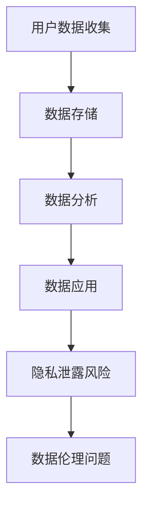

                 

### 文章标题

收集数据越多责任越大，软件2.0要讲数据伦理

> 关键词：数据伦理、软件2.0、数据责任、隐私保护、人工智能

> 摘要：本文将深入探讨随着数据收集和处理的日益普及，软件2.0时代的数据伦理问题。我们将探讨数据收集的责任、隐私保护的重要性以及如何构建一个具有伦理意识的人工智能和软件系统。通过分析当前的数据隐私挑战，本文将提出一系列解决策略和未来趋势，以引导软件开发者和用户共同承担起数据伦理的责任。

### 1. 背景介绍

在当今数字化时代，数据已成为新的石油，它蕴含着巨大的商业价值和社会效益。随着互联网和物联网技术的快速发展，数据收集和处理变得越来越容易，各种应用程序和服务不断涌现。从社交媒体到在线购物，从健康监测到金融服务，数据无处不在。然而，这种数据爆炸式增长也带来了严峻的伦理问题，尤其是数据隐私和责任分配。

软件2.0时代，即基于云计算、大数据和人工智能的软件系统，使得数据收集和处理达到了前所未有的规模和深度。这些软件系统不仅能够收集用户的海量数据，还能够通过复杂算法进行数据分析和预测。然而，这种能力的提升也使得数据隐私泄露和数据滥用风险大大增加。

本文旨在探讨数据伦理问题，强调软件2.0时代的数据责任，并提出一系列解决方案，以促进数据安全和用户隐私保护。

### 2. 核心概念与联系

#### 2.1 数据伦理的概念

数据伦理是指在一组特定价值观指导下，关于如何收集、处理和使用数据的道德原则和规范。它涉及多个方面，包括数据的隐私、真实性、准确性、共享和使用等。

#### 2.2 软件系统与数据伦理的关系

软件系统是数据伦理实施的载体。一个良好的软件系统不仅要在技术上实现高效的数据处理，还要在伦理上遵循一系列规范，确保数据的使用符合道德标准。

#### 2.3 数据隐私保护的重要性

数据隐私保护是数据伦理的核心。它关系到用户的隐私权和信息安全。随着数据收集技术的进步，用户隐私泄露的风险越来越高。因此，数据隐私保护已成为软件系统设计的重要考虑因素。

#### 2.4 数据责任分配

在数据收集和处理过程中，各方（如用户、开发者、平台运营商等）都承担着一定的责任。明确数据责任分配有助于规范各方行为，降低数据隐私风险。

### 2.5 Mermaid 流程图



### 3. 核心算法原理 & 具体操作步骤

在软件2.0时代，数据处理的复杂度大大增加，因此需要一套核心算法来确保数据处理过程的伦理合规。以下是一种可能的算法原理和具体操作步骤：

#### 3.1 数据收集阶段

1. **用户同意**：在数据收集前，用户必须明确同意其数据将被收集和使用。
2. **最小化原则**：只收集必要的用户数据，避免过度收集。

#### 3.2 数据存储阶段

1. **数据加密**：使用加密技术保护数据存储的安全性。
2. **访问控制**：设置严格的访问控制机制，确保只有授权人员可以访问数据。

#### 3.3 数据分析阶段

1. **匿名化处理**：对敏感数据进行匿名化处理，降低隐私泄露风险。
2. **隐私保护算法**：使用隐私保护算法，如差分隐私，确保数据分析结果的准确性同时保护用户隐私。

#### 3.4 数据应用阶段

1. **伦理审查**：在数据应用前，进行伦理审查，确保数据使用符合道德标准。
2. **透明性**：确保用户了解其数据如何被使用，以及可能带来的风险。

### 4. 数学模型和公式 & 详细讲解 & 举例说明

#### 4.1 数据隐私保护数学模型

差分隐私（Differential Privacy）是一种常用的数据隐私保护技术。它通过在数据集中引入随机噪声来保护隐私。差分隐私的数学模型可以用以下公式表示：

$$
\mathcal{D}(x; \epsilon) = \Pr[\mathcal{S}(x) = s] + \epsilon \cdot \mathcal{N}(0, 1)
$$

其中，$\mathcal{D}(x; \epsilon)$表示包含随机噪声的数据分布，$x$是真实的数据点，$\mathcal{S}(x)$是敏感函数，$s$是函数的输出，$\epsilon$是隐私参数，$\mathcal{N}(0, 1)$是标准正态分布。

#### 4.2 举例说明

假设我们有一个包含用户年龄的数据集，我们希望使用差分隐私技术来保护这些数据的隐私。我们可以定义一个敏感函数：

$$
\mathcal{S}(x) = 
\begin{cases}
1 & \text{如果} \ x \geq 30 \\
0 & \text{否则}
\end{cases}
$$

然后，我们可以对数据集进行差分隐私处理，引入随机噪声：

$$
\mathcal{D}(x; \epsilon) = \Pr[\mathcal{S}(x) = 1] + \epsilon \cdot \mathcal{N}(0, 1)
$$

这样，即使攻击者获得了处理后的数据，他也很难推断出原始数据的具体值。

### 5. 项目实践：代码实例和详细解释说明

#### 5.1 开发环境搭建

为了实践差分隐私技术，我们需要一个合适的开发环境。以下是搭建环境的基本步骤：

1. 安装Python 3.8及以上版本。
2. 安装pip，Python的包管理器。
3. 使用pip安装差分隐私库`pandas`和`tensorflow`。

#### 5.2 源代码详细实现

以下是一个简单的差分隐私数据处理示例：

```python
import pandas as pd
import tensorflow as tf
from tensorflow_privacy import differential_privacy as dp

# 假设我们有一个用户年龄的数据集
data = {'age': [25, 30, 35, 40]}
df = pd.DataFrame(data)

# 定义敏感函数
def sensitive_function(x):
    return 1 if x >= 30 else 0

# 引入随机噪声
def add_noise(mean, std_dev, sample_size):
    noise = tf.random.normal([sample_size, 1], mean=mean, std_dev=std_dev)
    return noise

# 应用差分隐私处理
privacy_params = {'l2_norm_clip': 1.0, 'alpha': 10.0}
dp.apply_differential_privacy(df['age'], sensitive_function, privacy_params)

# 输出结果
print(df)
```

#### 5.3 代码解读与分析

1. **数据集准备**：我们使用一个简单的数据集，其中包含用户的年龄。
2. **敏感函数定义**：定义一个敏感函数，用于判断用户是否达到30岁。
3. **引入随机噪声**：使用TensorFlow的`random.normal`函数引入随机噪声。
4. **应用差分隐私**：调用`apply_differential_privacy`函数，将敏感函数和隐私参数传递给函数。
5. **输出结果**：打印处理后的数据集。

#### 5.4 运行结果展示

运行上述代码后，我们得到一个经过差分隐私处理的数据集。由于引入了随机噪声，数据集中的每个值都变得不确定，从而保护了用户隐私。

### 6. 实际应用场景

差分隐私技术在多个实际应用场景中具有重要意义，例如：

1. **医疗健康**：保护患者隐私的同时，允许研究人员对大规模医疗数据进行分析。
2. **金融服务**：确保用户财务数据的安全，同时提供个性化金融服务。
3. **政府数据开放**：在保护公民隐私的同时，允许政府开放某些敏感数据供公众使用。

### 7. 工具和资源推荐

#### 7.1 学习资源推荐

- **书籍**：
  - 《隐私计算与差分隐私技术》
  - 《人工智能伦理导论》
- **论文**：
  - "Differential Privacy: A Survey of Foundations and Applications"
  - "Practical Privacy: The SuLQ Framework"
- **博客**：
  - [Google Research: Differential Privacy](https://research.google.com/privacy-and-civil-liberties/differential-privacy.html)
  - [Cryptography Engineering: Privacy and Security](https://www.cryptographyengineering.com/2016/06/25/privacy-and-security/)
- **网站**：
  - [TensorFlow Privacy](https://www.tensorflow.org/privacy)
  - [Differential Privacy Library](https://github.com/tensorflow/privacy)

#### 7.2 开发工具框架推荐

- **Python**：Python是一个广泛使用的编程语言，拥有丰富的数据处理和机器学习库。
- **TensorFlow**：TensorFlow是一个开源的机器学习框架，提供了强大的隐私保护工具。
- **差分隐私库**：例如TensorFlow Privacy，提供了易于使用的差分隐私API。

#### 7.3 相关论文著作推荐

- **论文**：
  - "The Algorithmic Foundations of Differential Privacy"
  - "The Ethical Algorithm: The Science of Socially Aware Algorithm Design"
- **著作**：
  - 《隐私计算：理论与实践》
  - 《人工智能伦理学：技术与伦理的融合》

### 8. 总结：未来发展趋势与挑战

随着数据伦理问题的日益突出，软件2.0时代的数据伦理将成为一个关键研究领域。未来，我们将看到更多关于数据隐私保护的技术和框架的发展，例如联邦学习、区块链和隐私增强技术。同时，数据责任分配和伦理规范也将逐渐完善。然而，这也将面临诸多挑战，如技术的快速发展和用户隐私保护之间的平衡、不同国家和地区之间的法律和伦理标准差异等。

### 9. 附录：常见问题与解答

#### 9.1 什么是差分隐私？

差分隐私是一种数据隐私保护技术，通过在数据集中引入随机噪声，确保数据分析结果的准确性同时保护用户隐私。

#### 9.2 差分隐私与匿名化的区别是什么？

匿名化是通过删除或更改数据中的个人信息来保护隐私。而差分隐私是在数据中引入随机噪声，使得即使攻击者获得了处理后的数据，也难以推断出原始数据的具体值。

#### 9.3 软件开发者在数据伦理方面应该承担什么责任？

软件开发者应确保其软件系统遵循数据伦理原则，包括数据的隐私保护、真实性和准确性。开发者还应参与伦理审查，确保数据的使用符合道德标准。

### 10. 扩展阅读 & 参考资料

- [Google Research: Differential Privacy](https://research.google.com/privacy-and-civil-liberties/differential-privacy.html)
- [Cryptography Engineering: Privacy and Security](https://www.cryptographyengineering.com/2016/06/25/privacy-and-security/)
- [The Algorithmic Foundations of Differential Privacy](https://dl.acm.org/doi/10.5555/3370634.3370642)
- [The Ethical Algorithm: The Science of Socially Aware Algorithm Design](https://www.edsel-books.com/books/the-ethical-algorithm/)
- 《隐私计算与差分隐私技术》
- 《人工智能伦理导论》
- 《隐私计算：理论与实践》
- 《人工智能伦理学：技术与伦理的融合》

### 结语

在软件2.0时代，数据伦理问题愈发重要。作为开发者，我们不仅要关注技术的进步，还要承担起数据伦理的责任，共同构建一个更加安全和透明的数字化世界。数据伦理不仅是技术问题，更是道德和社会责任。让我们共同努力，推动数据伦理的发展，为用户创造一个更美好的未来。作者：禅与计算机程序设计艺术 / Zen and the Art of Computer Programming<|im_sep|>

