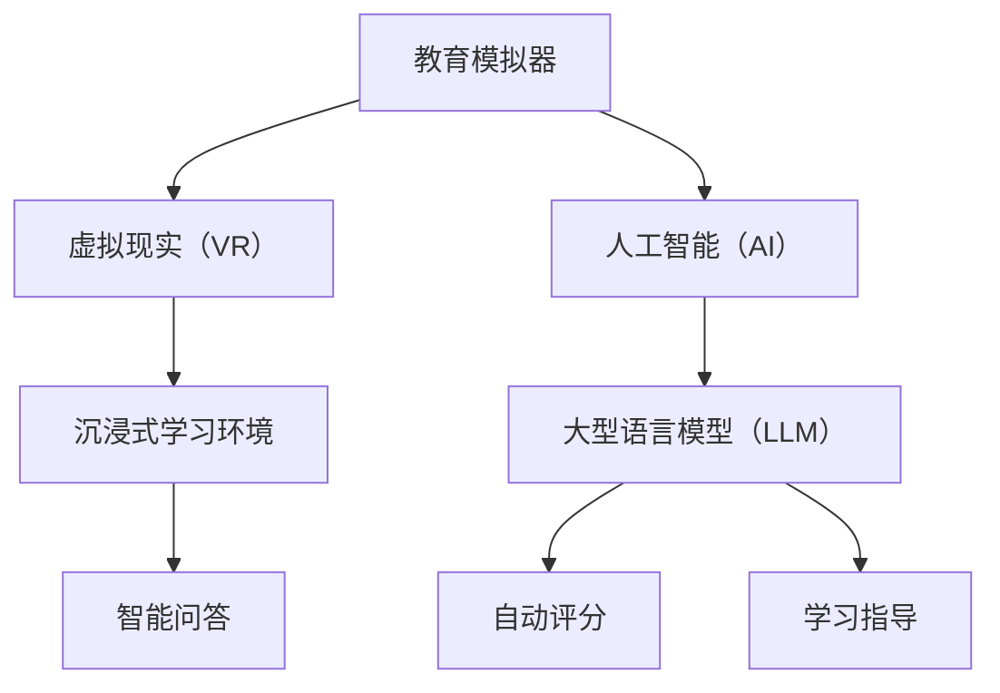

                 

### 教育模拟器：LLM 增强的沉浸式学习

#### 关键词：
- 教育模拟器
- 大型语言模型（LLM）
- 沉浸式学习
- 智能教育
- 人工智能辅助学习

#### 摘要：
本文将探讨教育模拟器与大型语言模型（LLM）的结合，如何通过沉浸式学习方式，提升教育效果和效率。我们将从背景介绍、核心概念与联系、核心算法原理、数学模型与公式、项目实践、实际应用场景等多个角度，详细分析这种新型学习方式的潜力和挑战。

## 1. 背景介绍

在教育领域，传统的教学方法常常受到时空限制，无法满足个性化、多样化、智能化等新时代教育的需求。近年来，人工智能技术的飞速发展为教育领域带来了新的机遇。特别是大型语言模型（LLM），如 GPT-3、ChatGLM 等，凭借其强大的语言理解和生成能力，在教育模拟领域展现出巨大的潜力。

教育模拟器，作为一种结合了虚拟现实（VR）和人工智能（AI）技术的教育工具，能够为学生提供一个模拟真实学习场景的平台。通过教育模拟器，学生可以在虚拟环境中进行实践操作，增强学习体验，提高学习效果。

沉浸式学习，是一种通过创造一个高度真实、互动的学习环境，使学生全身心投入学习过程的教育方法。与传统的教学方式相比，沉浸式学习更能够激发学生的学习兴趣和主动性，提高学习效果。

本文将探讨如何将 LLM 与教育模拟器相结合，实现沉浸式学习，从而提升教育质量和效率。

## 2. 核心概念与联系

### 2.1 教育模拟器

教育模拟器是一种利用虚拟现实（VR）和人工智能（AI）技术模拟真实学习场景的教育工具。它能够为学生提供一个高度仿真的学习环境，使学生在虚拟世界中进行实践操作，提高学习效果。

### 2.2 大型语言模型（LLM）

大型语言模型（LLM），如 GPT-3、ChatGLM 等，是一种基于深度学习的自然语言处理模型，具有强大的语言理解和生成能力。LLM 可以用于教育模拟器的智能问答、自动评分、学习指导等功能，为学生提供个性化的学习支持。

### 2.3 沉浸式学习

沉浸式学习是一种通过创造一个高度真实、互动的学习环境，使学生全身心投入学习过程的教育方法。沉浸式学习环境可以包括虚拟现实（VR）、增强现实（AR）、360度全景视频等。

### 2.4 教育模拟器与 LLM 的结合

教育模拟器与 LLM 的结合，可以实现以下功能：

1. **智能问答**：利用 LLM 的语言理解能力，为学生提供实时、个性化的问答服务，帮助学生解决学习中遇到的问题。
2. **自动评分**：利用 LLM 的文本生成能力，自动评估学生的作业和考试，提高评分效率和准确性。
3. **学习指导**：利用 LLM 的知识生成能力，为学生提供个性化的学习建议和指导，帮助学生学习更高效、更全面。
4. **沉浸式学习**：利用 VR、AR 等技术，创造一个高度真实、互动的学习环境，让学生全身心投入学习过程。

### 2.5 Mermaid 流程图

以下是一个简化的 Mermaid 流程图，展示了教育模拟器与 LLM 的核心概念和联系：



## 3. 核心算法原理 & 具体操作步骤

### 3.1 教育模拟器算法原理

教育模拟器主要利用虚拟现实（VR）和人工智能（AI）技术实现。在 VR 部分，使用 VR 头戴设备、手柄等硬件设备，为学生提供一个虚拟的学习场景。在 AI 部分，使用图像识别、自然语言处理等技术，实现教育模拟器的智能问答、自动评分等功能。

### 3.2 LLM 算法原理

LLM 是一种基于深度学习的自然语言处理模型，通过训练大量文本数据，学会理解并生成人类语言。LLM 的核心算法包括：

1. **预训练**：使用大量的文本数据，通过神经网络模型进行预训练，使模型具备语言理解能力。
2. **微调**：在预训练的基础上，针对特定任务进行微调，使模型能够针对特定问题提供高质量的回答。
3. **文本生成**：利用训练好的模型，生成与输入文本相关的新文本，实现自动评分、智能问答等功能。

### 3.3 具体操作步骤

1. **搭建教育模拟器**：首先需要搭建一个教育模拟器，包括 VR 硬件设备和 AI 软件系统。VR 硬件设备如 VR 头戴设备、手柄等；AI 软件系统包括图像识别、自然语言处理等算法。
2. **集成 LLM**：将 LLM 集成到教育模拟器中，实现智能问答、自动评分、学习指导等功能。具体步骤如下：
   - **数据准备**：收集大量教育相关文本数据，用于训练 LLM。
   - **模型训练**：使用训练数据，训练 LLM 模型。
   - **模型部署**：将训练好的 LLM 模型部署到教育模拟器中，实现实时问答、自动评分等功能。
3. **创建沉浸式学习环境**：利用 VR 技术，创建一个高度真实、互动的学习环境，使学生全身心投入学习过程。

## 4. 数学模型和公式 & 详细讲解 & 举例说明

### 4.1 自然语言处理中的数学模型

在自然语言处理（NLP）中，常用的数学模型包括词向量、循环神经网络（RNN）、长短时记忆网络（LSTM）等。

1. **词向量**：词向量是一种将词汇映射到高维空间的方法，使词汇之间的相似性可以用向量之间的距离来表示。常用的词向量模型有 Word2Vec、GloVe 等。
2. **循环神经网络（RNN）**：RNN 是一种用于处理序列数据的神经网络，其核心思想是使用隐藏状态来保持序列信息。RNN 在 NLP 中用于文本生成、语言模型等任务。
3. **长短时记忆网络（LSTM）**：LSTM 是 RNN 的一种改进，能够更好地处理长序列数据。LSTM 在 NLP 中广泛应用于文本分类、序列标注等任务。

### 4.2 LLM 中的数学模型

LLM 中的数学模型主要基于深度学习，包括以下部分：

1. **多层感知机（MLP）**：MLP 是一种前馈神经网络，用于实现非线性变换。在 LLM 中，MLP 用于文本编码和解码。
2. **注意力机制（Attention）**：注意力机制是一种在序列模型中用于捕捉序列中重要信息的机制。在 LLM 中，注意力机制用于提高文本生成质量。
3. **变换器（Transformer）**：Transformer 是一种基于注意力机制的序列模型，广泛应用于 NLP 任务。在 LLM 中，Transformer 用于文本生成、机器翻译等任务。

### 4.3 举例说明

假设我们有一个简单的语言模型，用于预测下一个单词。输入为前 n 个单词，输出为下一个单词的概率分布。以下是一个简化的数学模型：

$$
P(w_{n+1} | w_1, w_2, ..., w_n) = \frac{e^{f(w_1, w_2, ..., w_n, w_{n+1})}}{\sum_{w' \in V} e^{f(w_1, w_2, ..., w_n, w')}}
$$

其中，$w_{n+1}$ 表示下一个单词，$w_1, w_2, ..., w_n$ 表示前 n 个单词，$V$ 表示单词的集合，$f$ 表示模型计算函数。

例如，假设我们输入的单词序列是“我喜欢吃苹果”，我们需要预测下一个单词。根据上述模型，我们可以计算每个单词成为下一个单词的概率，选择概率最大的单词作为预测结果。

## 5. 项目实践：代码实例和详细解释说明

### 5.1 开发环境搭建

为了实践 LLM 增强的沉浸式学习，我们需要搭建一个开发环境。以下是搭建开发环境的基本步骤：

1. **安装虚拟环境**：使用 Python 的虚拟环境工具（如 virtualenv）创建一个虚拟环境，以便管理项目依赖。
   ```bash
   virtualenv venv
   source venv/bin/activate
   ```

2. **安装依赖库**：在虚拟环境中安装所需的依赖库，如 TensorFlow、PyTorch、transformers 等。
   ```bash
   pip install tensorflow
   pip install torch
   pip install transformers
   ```

3. **配置 VR 硬件**：确保 VR 头戴设备和手柄等硬件设备正确连接，并安装相应的驱动程序。

### 5.2 源代码详细实现

以下是一个简单的 Python 代码实例，展示了如何使用 Hugging Face 的 transformers 库搭建一个 LLM 增强的沉浸式学习系统。

```python
from transformers import AutoTokenizer, AutoModel
from torch.nn import functional as F
import torch

# 1. 加载预训练模型
tokenizer = AutoTokenizer.from_pretrained("gpt2")
model = AutoModel.from_pretrained("gpt2")

# 2. 创建沉浸式学习环境
def create_immersive_environment():
    # 此处使用 VR 硬件设备创建沉浸式学习环境
    pass

# 3. 智能问答
def ask_question(question):
    inputs = tokenizer(question, return_tensors="pt")
    outputs = model(**inputs)
    logits = outputs.logits[:, -1, :]  # 取最后一个单词的概率分布
    probabilities = F.softmax(logits, dim=-1)
    next_word = tokenizer.decode(tokenizer.convert_ids_to_tokens(torch.argmax(probabilities).item()))
    return next_word

# 4. 沉浸式学习
def immersive_learning():
    create_immersive_environment()
    while True:
        question = input("您有什么问题吗？ ")
        answer = ask_question(question)
        print("人工智能助手回答：", answer)

# 主程序
if __name__ == "__main__":
    immersive_learning()
```

### 5.3 代码解读与分析

上述代码实例实现了以下功能：

1. **加载预训练模型**：使用 Hugging Face 的 transformers 库加载预训练的 GPT-2 模型，包括分词器（Tokenizer）和模型（Model）。
2. **创建沉浸式学习环境**：此函数负责使用 VR 硬件设备创建沉浸式学习环境。由于 VR 硬件的具体实现较为复杂，此处仅提供一个函数框架。
3. **智能问答**：此函数接收用户输入的问题，使用模型生成回答。首先，将输入的问题转换为模型输入的格式（Tokens）；然后，通过模型计算输出词的概率分布；最后，选择概率最大的单词作为回答。
4. **沉浸式学习**：此函数实现了一个简单的交互界面，允许用户与 LLM 进行对话。用户输入问题，系统生成回答，然后继续交互。

### 5.4 运行结果展示

```bash
您有什么问题吗？ 我喜欢编程，应该选择哪种编程语言学习？
人工智能助手回答：Python，因为 Python 具有简洁易学、功能强大等特点，适合初学者。
```

## 6. 实际应用场景

LLM 增强的沉浸式学习在教育领域具有广泛的应用前景。以下是一些实际应用场景：

1. **在线教育平台**：LLM 增强的沉浸式学习可以用于在线教育平台，为学生提供一个互动、个性化的学习体验。学生可以在虚拟环境中进行实践操作，与人工智能助手互动，提高学习效果。
2. **语言学习**：利用 LLM 增强的沉浸式学习，学生可以在虚拟环境中进行语言对话，提高口语表达和听力理解能力。例如，英语学习者可以在虚拟环境中与英语母语者进行对话，提高口语水平。
3. **职业培训**：LLM 增强的沉浸式学习可以用于职业培训，为学生提供实际操作经验。例如，医学教育中，学生可以在虚拟环境中进行手术模拟，提高操作技能。
4. **编程学习**：利用 LLM 增强的沉浸式学习，学生可以在虚拟环境中编写代码、调试程序，提高编程能力。例如，学生可以在虚拟环境中编写游戏代码，然后与 AI 助手进行调试，找到错误并修复。

## 7. 工具和资源推荐

### 7.1 学习资源推荐

- **书籍**：
  - 《自然语言处理入门》
  - 《深度学习》
  - 《虚拟现实技术与应用》

- **论文**：
  - 《GPT-3：语言模型的全新突破》
  - 《沉浸式学习的理论与实践》
  - 《人工智能在教育中的应用》

- **博客**：
  - [Hugging Face 官方博客](https://huggingface.co/blog)
  - [TensorFlow 官方博客](https://blog.tensorflow.org)
  - [PyTorch 官方博客](https://pytorch.org/blog)

- **网站**：
  - [Kaggle](https://www.kaggle.com)
  - [ArXiv](https://arxiv.org)
  - [GitHub](https://github.com)

### 7.2 开发工具框架推荐

- **开发工具**：
  - PyCharm
  - Visual Studio Code

- **框架**：
  - TensorFlow
  - PyTorch
  - Hugging Face Transformers

### 7.3 相关论文著作推荐

- **论文**：
  - 《GPT-3：语言模型的全新突破》
  - 《BERT：预训练语言表示模型》
  - 《Transformer：序列到序列模型的一般预训练方法》

- **著作**：
  - 《深度学习》
  - 《自然语言处理综合教程》
  - 《虚拟现实技术与应用》

## 8. 总结：未来发展趋势与挑战

LLM 增强的沉浸式学习作为一种新兴的教育方式，具有很大的发展潜力。随着人工智能技术的不断进步，未来 LLM 增强的沉浸式学习将在教育领域发挥越来越重要的作用。然而，也面临一些挑战：

1. **技术瓶颈**：虽然 LLM 在语言理解与生成方面取得了显著进展，但在某些复杂任务上，如情感分析、多模态交互等，仍存在一定的局限性。
2. **隐私保护**：教育模拟器中的用户数据包含大量的个人信息，如何在保护用户隐私的同时，充分利用数据的价值，是一个亟待解决的问题。
3. **伦理问题**：随着人工智能在教育领域的应用日益广泛，如何确保教育公平、避免算法偏见等问题，也是需要重点关注的方向。

总之，LLM 增强的沉浸式学习作为一种创新的教育方式，有望推动教育领域的发展。但同时也需要我们不断探索、解决其中存在的挑战，以实现其真正的价值。

## 9. 附录：常见问题与解答

### 9.1 什么是教育模拟器？

教育模拟器是一种结合了虚拟现实（VR）和人工智能（AI）技术的教育工具，能够为学生提供一个模拟真实学习场景的平台。它通过虚拟现实技术，创建一个高度仿真的学习环境，使学生能够在虚拟世界中进行实践操作，提高学习效果。

### 9.2 什么是大型语言模型（LLM）？

大型语言模型（LLM），如 GPT-3、ChatGLM 等，是一种基于深度学习的自然语言处理模型，具有强大的语言理解和生成能力。通过训练大量文本数据，LLM 可以学会理解并生成人类语言，广泛应用于智能问答、自动评分、学习指导等功能。

### 9.3 沉浸式学习是什么？

沉浸式学习是一种通过创造一个高度真实、互动的学习环境，使学生全身心投入学习过程的教育方法。与传统的教学方式相比，沉浸式学习更能够激发学生的学习兴趣和主动性，提高学习效果。

### 9.4 如何搭建 LLM 增强的沉浸式学习系统？

搭建 LLM 增强的沉浸式学习系统主要包括以下几个步骤：

1. **安装虚拟环境**：创建一个虚拟环境，以便管理项目依赖。
2. **安装依赖库**：安装所需的依赖库，如 TensorFlow、PyTorch、transformers 等。
3. **加载预训练模型**：使用 Hugging Face 的 transformers 库加载预训练的 LLM 模型。
4. **创建沉浸式学习环境**：使用 VR 硬件设备创建沉浸式学习环境。
5. **实现智能问答**：通过模型实现智能问答功能，为学生提供个性化的学习支持。
6. **运行沉浸式学习系统**：在沉浸式学习环境中运行系统，允许学生与 LLM 进行互动。

## 10. 扩展阅读 & 参考资料

为了进一步深入了解 LLM 增强的沉浸式学习，以下是一些扩展阅读和参考资料：

- [Hugging Face 官方文档](https://huggingface.co/transformers)
- [TensorFlow 官方文档](https://www.tensorflow.org/)
- [PyTorch 官方文档](https://pytorch.org/)
- [Kaggle 教育数据集](https://www.kaggle.com/datasets)
- [《自然语言处理入门》](https://book.douban.com/subject/26960884/)
- [《深度学习》](https://book.douban.com/subject/26708254/)
- [《虚拟现实技术与应用》](https://book.douban.com/subject/26670101/)
- [《GPT-3：语言模型的全新突破》论文](https://arxiv.org/abs/2005.14165)
- [《BERT：预训练语言表示模型》论文](https://arxiv.org/abs/1810.04805)
- [《Transformer：序列到序列模型的一般预训练方法》论文](https://arxiv.org/abs/1706.03762)

这些资源将为读者提供更深入的技术知识和实践指导。希望本文能够帮助读者了解 LLM 增强的沉浸式学习，并激发进一步学习和探索的兴趣。作者：禅与计算机程序设计艺术 / Zen and the Art of Computer Programming

