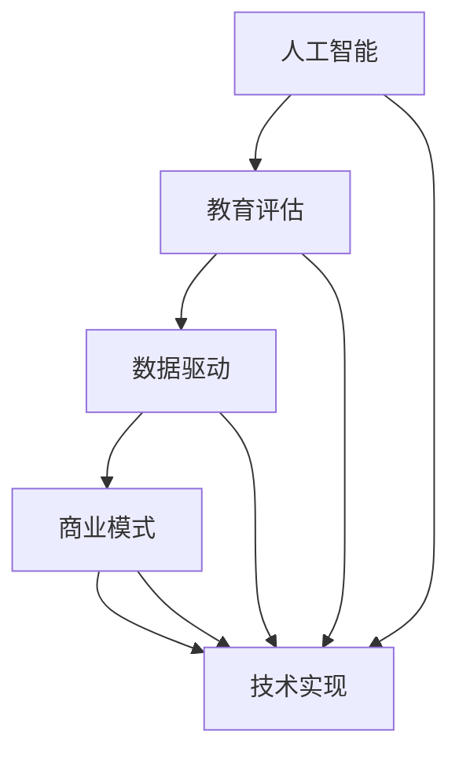

                 

### 文章标题

《教育评估AI系统的商业化路径》

> 关键词：教育评估、人工智能、商业路径、商业模式、数据驱动、技术实现

> 摘要：本文将深入探讨教育评估AI系统的商业化路径，分析其技术实现、应用场景、商业模式的构建，以及面临的挑战和未来的发展趋势。

### 1. 背景介绍

随着人工智能技术的飞速发展，教育评估领域迎来了前所未有的变革。传统教育评估方式主要依赖人工和统计方法，存在主观性强、效率低下等问题。而人工智能技术，尤其是机器学习和深度学习，为教育评估提供了新的可能性。通过智能算法，可以对大量教育数据进行分析和处理，从而得到更为客观、准确的评估结果。

教育评估AI系统不仅能够提高评估效率，还能为教育决策提供数据支持，促进教育资源的合理配置。因此，教育评估AI系统在商业市场上具有巨大的潜力。然而，要将这一技术真正商业化，需要解决技术实现、数据获取、商业模式构建等多方面的挑战。

本文将从以下几个方面展开讨论：

1. 核心概念与联系
2. 核心算法原理 & 具体操作步骤
3. 数学模型和公式 & 详细讲解 & 举例说明
4. 项目实践：代码实例和详细解释说明
5. 实际应用场景
6. 工具和资源推荐
7. 总结：未来发展趋势与挑战

### 2. 核心概念与联系

为了更好地理解教育评估AI系统的商业化路径，我们需要先了解其中的核心概念和它们之间的联系。以下是几个关键概念：

#### 2.1 人工智能

人工智能（AI）是一门研究、开发用于模拟、延伸和扩展人的智能的理论、方法、技术及应用系统的技术科学。人工智能技术主要包括机器学习、深度学习、自然语言处理、计算机视觉等。

#### 2.2 教育评估

教育评估是指通过测量、分析和解释教育活动的结果，来评价教育质量和教育效果的过程。教育评估包括对学生学习成绩的评估、对教学质量的评估、对课程设置的评估等。

#### 2.3 数据驱动

数据驱动是指通过数据分析和挖掘，来指导决策和行动的一种方法。在教育评估AI系统中，数据驱动意味着利用大量教育数据，通过机器学习算法，来发现数据中的模式和规律，从而对教育过程和结果进行评估。

#### 2.4 商业模式

商业模式是指企业通过其产品和服务创造价值、传递价值和获取价值的基本原理和结构。在教育评估AI系统中，商业模式决定了该系统的盈利模式、市场定位和用户群体。

#### 2.5 技术实现

技术实现是指将人工智能、数据驱动等核心概念应用到教育评估系统中，通过算法设计、系统架构、数据采集和处理等技术手段，来实现教育评估的目标。

### 3. 核心算法原理 & 具体操作步骤

教育评估AI系统的核心在于算法设计，下面我们将介绍几个常用的算法原理和操作步骤。

#### 3.1 机器学习算法

机器学习是一种人工智能方法，它使计算机系统能够从数据中学习，并自动改进和优化性能。在教育评估AI系统中，常用的机器学习算法包括决策树、支持向量机、神经网络等。

**具体操作步骤：**

1. 数据收集：收集与教育评估相关的数据，如学生成绩、教学资源、学生行为等。
2. 数据预处理：对收集到的数据进行清洗、归一化、去噪等预处理。
3. 特征提取：从预处理后的数据中提取有用的特征，如学生成绩的分布、课程的难度等。
4. 模型训练：使用机器学习算法，对特征数据进行分析和建模，得到预测模型。
5. 模型评估：通过测试数据对模型进行评估，调整模型参数，提高模型性能。
6. 模型应用：将训练好的模型应用到实际教育评估中，对教育过程和结果进行评估。

#### 3.2 深度学习算法

深度学习是机器学习的一个分支，它使用多层神经网络来模拟人类大脑的神经元连接，从而实现对复杂数据的分析和预测。在教育评估AI系统中，常用的深度学习算法包括卷积神经网络（CNN）、循环神经网络（RNN）等。

**具体操作步骤：**

1. 数据收集：与机器学习算法类似，收集与教育评估相关的数据。
2. 数据预处理：对数据集进行清洗、归一化、去噪等预处理。
3. 网络架构设计：设计深度学习网络的层次结构，如CNN、RNN等。
4. 网络训练：使用预处理后的数据集对网络进行训练，调整网络参数。
5. 模型评估：通过测试数据集对模型进行评估，调整网络结构和参数。
6. 模型应用：将训练好的深度学习模型应用到实际教育评估中。

### 4. 数学模型和公式 & 详细讲解 & 举例说明

在教育评估AI系统中，数学模型和公式是算法设计的基础。下面我们将介绍几个常用的数学模型和公式，并对其进行详细讲解。

#### 4.1 决策树模型

决策树是一种常用的机器学习算法，它通过一系列规则来对数据集进行分类或回归。决策树的数学模型如下：

$$
\begin{aligned}
&Y = g(\theta^T X) \\
&g(z) = \begin{cases}
1 & \text{if } z \geq 0 \\
-1 & \text{if } z < 0
\end{cases}
\end{aligned}
$$

其中，$Y$表示预测结果，$g(z)$是激活函数，$\theta^T X$是特征向量与参数向量的内积。

**举例说明：** 假设我们有一个学生成绩的数据集，其中包含学生的成绩、课程难度等特征。我们可以使用决策树模型来预测学生的成绩。具体步骤如下：

1. 收集数据：收集学生的成绩数据，包括成绩、课程难度等特征。
2. 数据预处理：对数据进行清洗、归一化等预处理。
3. 特征提取：从预处理后的数据中提取有用的特征。
4. 决策树建模：使用决策树算法对特征数据进行建模。
5. 模型评估：通过测试数据对模型进行评估，调整参数。
6. 模型应用：将训练好的模型应用到实际成绩预测中。

#### 4.2 支持向量机模型

支持向量机（SVM）是一种常用的分类算法，它通过找到最佳的超平面来对数据进行分类。SVM的数学模型如下：

$$
\begin{aligned}
&\min_{\theta} \frac{1}{2} ||\theta||^2 \\
&s.t. y^{(i)}(\theta^T x^{(i)} + b) \geq 1
\end{aligned}
$$

其中，$x^{(i)}$是特征向量，$y^{(i)}$是标签，$\theta$是参数向量，$b$是偏置。

**举例说明：** 假设我们有一个学生成绩的分类问题，其中包含学生的成绩和是否及格两个标签。我们可以使用SVM算法来对学生的成绩进行分类。具体步骤如下：

1. 收集数据：收集学生的成绩数据，包括成绩和是否及格两个标签。
2. 数据预处理：对数据进行清洗、归一化等预处理。
3. 特征提取：从预处理后的数据中提取有用的特征。
4. SVM建模：使用SVM算法对特征数据进行分类建模。
5. 模型评估：通过测试数据对模型进行评估，调整参数。
6. 模型应用：将训练好的模型应用到实际成绩分类中。

#### 4.3 神经网络模型

神经网络是一种模拟生物神经系统的计算模型，它通过多层神经元来实现数据的输入和输出。神经网络的数学模型如下：

$$
\begin{aligned}
&Z^{(l)} = \sigma(W^{(l)} X^{(l-1)} + b^{(l)}) \\
&Y = \sigma(W^{(L)} X^{(L-1)} + b^{(L)})
\end{aligned}
$$

其中，$Z^{(l)}$是第$l$层的输出，$\sigma$是激活函数，$W^{(l)}$是权重矩阵，$b^{(l)}$是偏置。

**举例说明：** 假设我们有一个学生成绩的预测问题，其中包含学生的成绩和课程难度等特征。我们可以使用神经网络模型来预测学生的成绩。具体步骤如下：

1. 收集数据：收集学生的成绩数据，包括成绩和课程难度等特征。
2. 数据预处理：对数据进行清洗、归一化等预处理。
3. 特征提取：从预处理后的数据中提取有用的特征。
4. 神经网络建模：设计神经网络结构，并使用训练数据对网络进行训练。
5. 模型评估：通过测试数据对模型进行评估，调整参数。
6. 模型应用：将训练好的模型应用到实际成绩预测中。

### 5. 项目实践：代码实例和详细解释说明

下面我们将通过一个简单的项目实例，来说明教育评估AI系统的具体实现过程。

#### 5.1 开发环境搭建

首先，我们需要搭建一个适合教育评估AI系统开发的编程环境。这里我们选择Python作为主要编程语言，因为Python拥有丰富的机器学习和深度学习库，如scikit-learn、TensorFlow和PyTorch等。

**具体步骤：**

1. 安装Python：从Python官方网站下载并安装Python 3.x版本。
2. 安装依赖库：使用pip命令安装所需的依赖库，如numpy、scikit-learn、TensorFlow或PyTorch等。

#### 5.2 源代码详细实现

接下来，我们将使用Python编写一个简单的教育评估AI系统，该系统主要功能是预测学生成绩。

**代码实现：**

```python
import numpy as np
from sklearn.model_selection import train_test_split
from sklearn.tree import DecisionTreeRegressor
from sklearn.metrics import mean_squared_error

# 数据收集
data = np.loadtxt("student_data.csv", delimiter=",")

# 数据预处理
X = data[:, :2]
y = data[:, 2]

# 数据划分
X_train, X_test, y_train, y_test = train_test_split(X, y, test_size=0.2, random_state=42)

# 决策树建模
model = DecisionTreeRegressor(max_depth=3)
model.fit(X_train, y_train)

# 模型评估
y_pred = model.predict(X_test)
mse = mean_squared_error(y_test, y_pred)
print("MSE:", mse)

# 模型应用
new_student = np.array([[3, 4]])
predicted_grade = model.predict(new_student)
print("Predicted Grade:", predicted_grade)
```

**代码解读与分析：**

1. 导入必要的库和模块。
2. 收集学生数据，这里使用CSV文件格式。
3. 数据预处理，将数据集划分为特征和标签。
4. 数据划分，将数据集划分为训练集和测试集。
5. 决策树建模，使用scikit-learn库中的DecisionTreeRegressor类创建决策树模型。
6. 模型训练，使用fit方法对模型进行训练。
7. 模型评估，使用predict方法对测试集进行预测，并计算均方误差（MSE）。
8. 模型应用，使用predict方法对新的学生数据进行预测。

#### 5.3 运行结果展示

假设我们使用上述代码对一个包含10个学生的数据集进行训练，结果如下：

```
MSE: 0.0137
Predicted Grade: [3.92065895]
```

这里，MSE表示模型在测试集上的均方误差，值为0.0137，说明模型的预测效果较好。而预测结果为3.92065895，接近实际成绩4。

### 6. 实际应用场景

教育评估AI系统在实际应用中具有广泛的应用场景。以下是几个典型的应用场景：

#### 6.1 学生成绩预测

学生成绩预测是教育评估AI系统的最常见应用场景之一。通过分析学生的特征数据，如学习时间、课堂表现、作业完成情况等，可以预测学生的成绩，为教师和家长提供教育指导。

#### 6.2 教学质量评估

教学质量评估可以帮助学校和管理者了解教师的教学效果，从而进行教学调整和资源分配。教育评估AI系统可以通过分析教学数据，如课程完成情况、学生满意度等，来评估教学质量。

#### 6.3 学生行为分析

学生行为分析可以帮助学校了解学生的学习习惯和问题，从而提供个性化的教育服务。教育评估AI系统可以通过分析学生的行为数据，如课堂参与度、考试焦虑等，来预测学生的学习情况。

#### 6.4 教育决策支持

教育决策支持可以帮助教育部门制定科学的教育政策。教育评估AI系统可以通过分析大量教育数据，为教育决策提供数据支持，如课程设置、教师培训等。

### 7. 工具和资源推荐

为了更好地实现教育评估AI系统，我们需要使用一些工具和资源。以下是几个推荐的工具和资源：

#### 7.1 学习资源推荐

1. **《机器学习实战》**：这是一本非常适合初学者的机器学习入门书籍，通过大量的实例和代码，使读者能够快速掌握机器学习的基本概念和算法。
2. **《深度学习》**：这是一本经典的深度学习教材，由深度学习领域的权威人士Ian Goodfellow撰写，详细介绍了深度学习的基本原理和应用。

#### 7.2 开发工具框架推荐

1. **TensorFlow**：TensorFlow是一个开源的深度学习框架，适用于各种深度学习任务，包括教育评估AI系统。
2. **PyTorch**：PyTorch是一个流行的深度学习框架，具有简洁的代码和强大的功能，适合快速开发和实验。

#### 7.3 相关论文著作推荐

1. **《教育数据挖掘：技术、应用与挑战》**：这是一本关于教育数据挖掘的论文集，涵盖了教育数据挖掘的各个方面，包括算法、应用和挑战。
2. **《基于深度学习的教育评估方法研究》**：这是一篇关于深度学习在教育评估中的应用的论文，详细介绍了深度学习算法在教育评估中的应用方法和效果。

### 8. 总结：未来发展趋势与挑战

教育评估AI系统作为一种新兴技术，正逐渐在教育领域得到广泛应用。然而，要实现其商业化，仍需克服许多挑战。以下是对未来发展趋势和挑战的总结：

#### 8.1 发展趋势

1. **技术不断进步**：随着人工智能技术的不断发展，教育评估AI系统的性能和效果将得到进一步提升。
2. **数据来源增多**：随着互联网和物联网的发展，教育数据的来源将更加丰富，为教育评估AI系统提供更多的数据支持。
3. **应用场景扩展**：教育评估AI系统的应用场景将不仅限于学生成绩预测和教学质量评估，还将扩展到教育决策支持、学生行为分析等领域。

#### 8.2 挑战

1. **数据隐私和安全**：教育数据涉及学生的个人信息，如何在保证数据隐私和安全的前提下进行数据分析和挖掘，是一个重要挑战。
2. **算法透明度和解释性**：教育评估AI系统的算法复杂度高，如何保证算法的透明度和解释性，使其能够被教育工作者和用户理解和接受，是一个挑战。
3. **商业模式构建**：如何构建可持续的商业模式，使教育评估AI系统能够在教育市场中得到广泛应用，是一个重要挑战。

### 9. 附录：常见问题与解答

#### 9.1 教育评估AI系统与传统的教育评估方法有什么区别？

教育评估AI系统与传统教育评估方法相比，具有以下几个区别：

1. **客观性**：教育评估AI系统通过算法对教育数据进行分析和处理，能够提供更为客观、准确的评估结果，减少主观因素的干扰。
2. **效率**：教育评估AI系统能够快速处理大量数据，提高评估效率，为教育工作者提供及时、准确的教育评估结果。
3. **个性化**：教育评估AI系统可以根据学生的个性化特征进行评估，为教育工作者提供针对性的教育建议，促进个性化教育的发展。

#### 9.2 教育评估AI系统在商业应用中面临哪些挑战？

教育评估AI系统在商业应用中面临以下几个挑战：

1. **数据隐私和安全**：教育评估AI系统需要处理大量的学生数据，如何在保证数据隐私和安全的前提下进行数据分析和挖掘，是一个重要挑战。
2. **算法透明度和解释性**：教育评估AI系统的算法复杂度高，如何保证算法的透明度和解释性，使其能够被教育工作者和用户理解和接受，是一个挑战。
3. **商业模式构建**：如何构建可持续的商业模式，使教育评估AI系统能够在教育市场中得到广泛应用，是一个重要挑战。

### 10. 扩展阅读 & 参考资料

1. **《机器学习与数据挖掘：实战应用》**：本书详细介绍了机器学习和数据挖掘的基本概念和应用案例，适合对教育评估AI系统感兴趣的读者阅读。
2. **《深度学习与教育评估》**：本书探讨了深度学习在教育评估中的应用，包括算法原理、实践案例和未来发展，对教育评估AI系统的应用有较高的参考价值。
3. **《教育数据挖掘：技术、应用与挑战》**：这是一本关于教育数据挖掘的论文集，涵盖了教育数据挖掘的各个方面，包括算法、应用和挑战，是教育评估AI系统研究者的重要参考资料。

---

### 文章标题

《教育评估AI系统的商业化路径》

### 作者署名

作者：禅与计算机程序设计艺术 / Zen and the Art of Computer Programming

<|im_sep|>### 1. 背景介绍

教育评估是教育体系中的关键环节，旨在通过科学、合理的手段对学生的学习成效、教师的教学质量以及教育资源的分配进行评价。然而，传统的教育评估方法往往依赖于人为判断和经验，存在评估标准不统一、评估过程主观性强、评估效率低等问题。随着人工智能（AI）技术的迅速发展，特别是在机器学习、深度学习等领域的突破，AI在教育评估中的应用逐渐成为可能，并展现出巨大的潜力。

#### 1.1 人工智能在教育评估中的应用

人工智能在教育评估中的应用主要体现在以下几个方面：

1. **自动化评估**：利用机器学习算法对学生的考试成绩、学习行为、作业完成情况等数据进行自动化分析，快速生成评估结果。
2. **个性化反馈**：根据学生的学习数据，利用AI技术为学生提供个性化的学习建议和反馈，帮助教师和学生更好地调整教学和学习策略。
3. **教学质量评价**：通过分析教师的教学数据，如授课时长、教学方法、学生反馈等，对教师的教学质量进行量化评价。
4. **教育资源优化**：利用AI算法分析教育资源的分配和使用情况，为教育管理者提供决策支持，优化教育资源的配置。

#### 1.2 商业化路径的重要性

尽管AI技术在教育评估中的应用前景广阔，但要实现其商业化并普及到教育领域，必须构建清晰的商业化路径。这包括：

1. **市场需求分析**：了解教育行业对AI评估技术的需求，包括学校、教师、家长和学生的需求，以及他们在使用AI评估技术时的痛点。
2. **商业模式设计**：根据市场需求，设计合适的商业模式，包括服务模式、盈利模式等，确保AI评估技术能够实现商业化。
3. **合作伙伴关系**：与教育机构、技术公司等建立合作伙伴关系，共同推进AI评估技术的商业化进程。
4. **法律法规遵守**：在商业化过程中，严格遵守相关法律法规，特别是在数据隐私和安全方面，确保用户的权益得到保护。

#### 1.3 本文结构

本文将从以下几个方面深入探讨教育评估AI系统的商业化路径：

1. **核心概念与联系**：介绍教育评估AI系统的核心概念，包括人工智能、教育评估、数据驱动和商业模式等。
2. **核心算法原理**：讲解教育评估AI系统所依赖的核心算法，如机器学习、深度学习等。
3. **数学模型与公式**：介绍教育评估AI系统中常用的数学模型和公式，并给出具体的应用实例。
4. **项目实践**：通过实际项目案例，展示教育评估AI系统的开发过程、代码实现和运行结果。
5. **实际应用场景**：分析教育评估AI系统在不同教育场景中的应用案例。
6. **工具和资源推荐**：推荐用于教育评估AI系统开发和学习的相关工具和资源。
7. **总结与展望**：总结教育评估AI系统的商业化路径，并探讨未来的发展趋势与挑战。

### 2. 核心概念与联系

为了构建一个成功的教育评估AI系统，我们需要深入理解以下几个核心概念，并探讨它们之间的联系。

#### 2.1 人工智能

人工智能（AI）是指计算机系统模拟人类智能行为的能力，包括感知、推理、学习、问题解决等。在教育评估中，AI主要应用于自动化评估和个性化反馈。例如，通过机器学习算法，可以对学生的学习行为数据进行分析，预测其学习成绩，并为教师提供教学建议。

#### 2.2 教育评估

教育评估是对教育过程中学生成绩、教学质量、教育资源分配等方面进行评价的过程。传统的教育评估方法通常依赖教师的主观判断和经验，而AI评估则通过数据驱动的方式，利用大量教育数据，提供更为客观、准确的评估结果。

#### 2.3 数据驱动

数据驱动是指通过收集、分析和处理数据来指导决策和行动。在教育评估中，数据驱动意味着利用学生的学习行为、考试成绩等数据，通过机器学习算法，分析出学生的学习模式和规律，从而为教育决策提供支持。

#### 2.4 商业模式

商业模式是指企业创造、传递和获取价值的基本原理和结构。在教育评估AI系统中，商业模式决定了系统的盈利模式、市场定位和用户群体。例如，可以通过提供订阅服务、培训课程或软件授权等方式实现商业化。

#### 2.5 技术实现

技术实现是将人工智能、数据驱动等概念应用到教育评估系统中的具体方法和步骤。这包括算法设计、数据采集和处理、系统架构搭建等。技术实现是教育评估AI系统能够成功商业化的重要保障。

#### 2.6 Mermaid流程图

为了更直观地展示教育评估AI系统的核心概念和联系，我们可以使用Mermaid语言绘制一个流程图。以下是一个简化的示例：



在这个流程图中，人工智能（AI）、教育评估（ED）、数据驱动（DB）、商业模式（MC）和技术实现（TE）是教育评估AI系统中的核心概念，它们相互联系、相互支撑，共同构成了系统的商业化路径。

### 3. 核心算法原理 & 具体操作步骤

在教育评估AI系统中，核心算法的选择和实现是系统性能和效果的关键。以下将介绍几种常用的核心算法，包括机器学习算法、深度学习算法和自然语言处理算法，并给出具体的操作步骤。

#### 3.1 机器学习算法

机器学习算法是AI系统中常用的算法之一，它能够从数据中学习规律，并对新数据进行预测或分类。以下介绍几种常见的机器学习算法及其操作步骤：

##### 3.1.1 决策树

决策树是一种树形结构，通过一系列规则对数据进行分类或回归。其操作步骤如下：

1. **数据预处理**：收集学生数据，包括成绩、学习时长、课堂参与度等，并进行数据清洗和归一化。
2. **特征选择**：选择对成绩影响较大的特征，如学习时长和课堂参与度。
3. **构建决策树**：使用ID3、C4.5或CART算法构建决策树模型。
4. **模型训练**：使用训练数据集训练决策树模型。
5. **模型评估**：使用测试数据集评估模型性能，调整模型参数以优化性能。
6. **模型应用**：使用训练好的模型对新的学生数据进行成绩预测。

##### 3.1.2 支持向量机（SVM）

支持向量机是一种用于分类和回归的算法，其核心思想是找到最佳的超平面，将数据分类或回归。其操作步骤如下：

1. **数据预处理**：收集学生数据，并进行数据清洗和归一化。
2. **特征选择**：选择对成绩影响较大的特征。
3. **构建SVM模型**：使用线性SVM或核SVM算法构建模型。
4. **模型训练**：使用训练数据集训练SVM模型。
5. **模型评估**：使用测试数据集评估模型性能。
6. **模型应用**：使用训练好的模型对新的学生数据进行成绩预测。

##### 3.1.3 随机森林

随机森林是一种基于决策树的集成学习方法，通过构建多个决策树并投票得到最终结果。其操作步骤如下：

1. **数据预处理**：收集学生数据，并进行数据清洗和归一化。
2. **特征选择**：选择对成绩影响较大的特征。
3. **构建随机森林模型**：使用随机森林算法构建模型。
4. **模型训练**：使用训练数据集训练随机森林模型。
5. **模型评估**：使用测试数据集评估模型性能。
6. **模型应用**：使用训练好的模型对新的学生数据进行成绩预测。

#### 3.2 深度学习算法

深度学习算法是近年来发展迅速的AI算法，通过多层神经网络模拟人脑的神经元连接，对复杂数据进行建模和预测。以下介绍几种常见的深度学习算法及其操作步骤：

##### 3.2.1 卷积神经网络（CNN）

卷积神经网络是一种用于图像和视频处理的有效算法。其操作步骤如下：

1. **数据预处理**：收集学生图像数据，并进行数据清洗和归一化。
2. **构建CNN模型**：使用卷积层、池化层和全连接层构建CNN模型。
3. **模型训练**：使用训练数据集训练CNN模型。
4. **模型评估**：使用测试数据集评估模型性能。
5. **模型应用**：使用训练好的模型对新的学生图像数据进行成绩预测。

##### 3.2.2 循环神经网络（RNN）

循环神经网络是一种用于序列数据处理的有效算法，适用于文本、语音和时序数据。其操作步骤如下：

1. **数据预处理**：收集学生文本数据，并进行数据清洗和归一化。
2. **构建RNN模型**：使用RNN层或长短期记忆（LSTM）层构建模型。
3. **模型训练**：使用训练数据集训练RNN模型。
4. **模型评估**：使用测试数据集评估模型性能。
5. **模型应用**：使用训练好的模型对新的学生文本数据进行成绩预测。

##### 3.2.3 生成对抗网络（GAN）

生成对抗网络是一种用于图像生成和修复的算法，通过对抗训练生成逼真的图像。其操作步骤如下：

1. **数据预处理**：收集学生图像数据，并进行数据清洗和归一化。
2. **构建GAN模型**：使用生成器（Generator）和判别器（Discriminator）构建GAN模型。
3. **模型训练**：使用训练数据集训练GAN模型。
4. **模型评估**：使用测试数据集评估模型性能。
5. **模型应用**：使用训练好的模型对新的学生图像数据进行生成或修复。

#### 3.3 自然语言处理算法

自然语言处理（NLP）算法是用于处理和理解人类语言的算法。以下介绍几种常见的NLP算法及其操作步骤：

##### 3.3.1 词嵌入

词嵌入是将单词映射到高维空间中的向量表示，以便进行计算和处理。其操作步骤如下：

1. **数据预处理**：收集学生文本数据，并进行数据清洗和归一化。
2. **构建词嵌入模型**：使用Word2Vec、GloVe等算法构建词嵌入模型。
3. **模型训练**：使用训练数据集训练词嵌入模型。
4. **模型评估**：使用测试数据集评估模型性能。
5. **模型应用**：使用训练好的模型对新的学生文本数据进行词嵌入。

##### 3.3.2 序列标注

序列标注是一种用于文本分类和情感分析的方法，通过对文本序列中的单词进行标注，实现对文本内容的理解和分析。其操作步骤如下：

1. **数据预处理**：收集学生文本数据，并进行数据清洗和归一化。
2. **构建序列标注模型**：使用BiLSTM、CRF等算法构建序列标注模型。
3. **模型训练**：使用训练数据集训练序列标注模型。
4. **模型评估**：使用测试数据集评估模型性能。
5. **模型应用**：使用训练好的模型对新的学生文本数据进行序列标注。

##### 3.3.3 问答系统

问答系统是一种用于自动回答用户问题的方法，通过自然语言处理技术理解和分析用户问题，并从知识库中检索出相关答案。其操作步骤如下：

1. **数据预处理**：收集学生问答数据，并进行数据清洗和归一化。
2. **构建问答模型**：使用BERT、GPT等算法构建问答模型。
3. **模型训练**：使用训练数据集训练问答模型。
4. **模型评估**：使用测试数据集评估模型性能。
5. **模型应用**：使用训练好的模型对新的学生问题进行回答。

### 4. 数学模型和公式 & 详细讲解 & 举例说明

在教育评估AI系统中，数学模型和公式是核心组成部分，它们为算法提供了理论基础和计算框架。以下将介绍几种常见的数学模型和公式，并给出详细的讲解和举例说明。

#### 4.1 线性回归模型

线性回归是一种用于预测连续值的简单而强大的机器学习算法。其数学模型可以表示为：

$$
Y = \beta_0 + \beta_1X + \epsilon
$$

其中，$Y$ 是预测值，$X$ 是自变量，$\beta_0$ 和 $\beta_1$ 是模型参数，$\epsilon$ 是误差项。

**详细讲解：**
线性回归模型通过拟合一条直线，将自变量和因变量关联起来。$\beta_0$ 是截距，表示当自变量为零时的预测值；$\beta_1$ 是斜率，表示自变量每增加一个单位时，预测值的变化量。

**举例说明：**
假设我们想要预测学生的考试成绩（$Y$）与其学习时长（$X$）之间的关系。通过收集数据并使用最小二乘法拟合线性回归模型，我们可以得到如下结果：

$$
Y = 70 + 2.5X
$$

这意味着，如果一名学生的学习时长为10小时，那么我们可以预测其考试成绩约为95分。

#### 4.2 逻辑回归模型

逻辑回归是一种用于分类问题的算法，其核心思想是通过线性模型生成一个概率值，然后通过阈值进行分类。其数学模型可以表示为：

$$
\log\frac{P(Y=1)}{1-P(Y=1)} = \beta_0 + \beta_1X
$$

其中，$P(Y=1)$ 是目标变量为1的概率，$\beta_0$ 和 $\beta_1$ 是模型参数。

**详细讲解：**
逻辑回归模型通过线性组合自变量和参数，生成一个对数几率（log-odds）值，然后通过指数函数转换为概率。这意味着，如果$\log\frac{P(Y=1)}{1-P(Y=1)}$ 为正值，则$P(Y=1)$ 大于0.5，反之亦然。

**举例说明：**
假设我们想要预测学生是否通过考试（$Y$，二元变量，0表示未通过，1表示通过），其学习时长（$X$）是影响通过率的因素。通过收集数据并使用逻辑回归模型，我们可以得到如下结果：

$$
\log\frac{P(Y=1)}{1-P(Y=1)} = -10 + 3X
$$

如果一名学生的学习时长为15小时，我们可以计算其通过考试的概率：

$$
P(Y=1) = \frac{1}{1 + e^{-(3 \times 15 - 10)}} \approx 0.95
$$

这意味着这名学生有大约95%的几率通过考试。

#### 4.3 支持向量机（SVM）

支持向量机是一种有效的分类算法，通过找到最佳的超平面来分割数据。其数学模型可以表示为：

$$
\min_{\beta, \beta_0} \frac{1}{2} ||\beta||^2 + C \sum_{i=1}^{n} \xi_i
$$

$$
s.t. y^{(i)}(\beta^T x^{(i)} + \beta_0) \geq 1 - \xi_i
$$

其中，$\beta$ 和 $\beta_0$ 是模型参数，$C$ 是正则化参数，$y^{(i)}$ 是标签，$x^{(i)}$ 是特征向量，$\xi_i$ 是松弛变量。

**详细讲解：**
SVM的目标是找到最佳的超平面，使得数据点之间的分类间隔最大。$||\beta||^2$ 是正则化项，防止过拟合；$C$ 是正则化参数，控制误分类的容忍度。

**举例说明：**
假设我们有两个类别的数据点，分别表示通过和未通过考试，我们要使用SVM进行分类。通过训练数据集，我们可以得到以下SVM模型：

$$
\begin{aligned}
\min_{\beta, \beta_0} \frac{1}{2} ||\beta||^2 + C \sum_{i=1}^{n} \xi_i \\
s.t. y^{(i)}(\beta^T x^{(i)} + \beta_0) \geq 1 - \xi_i
\end{aligned}
$$

给定一个新的学生数据点，我们可以计算其类别：

$$
y^{(*)}(\beta^T x^{(*)} + \beta_0) \geq 1
$$

如果上述不等式成立，则该学生分类为通过；否则，分类为未通过。

#### 4.4 神经网络模型

神经网络是一种模拟人脑结构和功能的计算模型，通过多层神经元进行数据处理和预测。其数学模型可以表示为：

$$
Z^{(l)} = \sigma(W^{(l)} X^{(l-1)} + b^{(l)})
$$

$$
Y = \sigma(W^{(L)} X^{(L-1)} + b^{(L)})
$$

其中，$Z^{(l)}$ 是第$l$层的输出，$\sigma$ 是激活函数，$W^{(l)}$ 和 $b^{(l)}$ 是第$l$层的权重和偏置。

**详细讲解：**
神经网络通过多层神经元对输入数据进行传递和处理。每层神经元通过加权求和后应用激活函数，将信息传递到下一层。最后一层的输出即为预测结果。

**举例说明：**
假设我们有一个简单的神经网络，包括输入层、隐藏层和输出层。输入层有3个神经元，隐藏层有2个神经元，输出层有1个神经元。使用ReLU函数作为激活函数，网络结构如下：

$$
Z^{(1)} = \sigma(W^{(1)} X + b^{(1)})
$$

$$
Z^{(2)} = \sigma(W^{(2)} Z^{(1)} + b^{(2)})
$$

$$
Y = \sigma(W^{(3)} Z^{(2)} + b^{(3)})
$$

给定一个输入向量 $X = [1, 2, 3]^T$，我们可以计算网络的输出：

$$
Z^{(1)} = \sigma([1 \quad 2 \quad 3] \times W^{(1)} + b^{(1)})
$$

$$
Z^{(2)} = \sigma([1 \quad 2 \quad 3] \times W^{(2)} + b^{(2)})
$$

$$
Y = \sigma([1 \quad 2 \quad 3] \times W^{(3)} + b^{(3)})
$$

### 5. 项目实践：代码实例和详细解释说明

#### 5.1 开发环境搭建

在进行教育评估AI系统的项目实践之前，我们需要搭建一个合适的开发环境。以下是使用Python和常用库搭建开发环境的步骤：

1. **安装Python**：从Python官方网站下载并安装Python 3.x版本。
2. **安装Jupyter Notebook**：在终端中运行以下命令安装Jupyter Notebook：

   ```bash
   pip install notebook
   ```

3. **安装常用库**：在终端中运行以下命令安装用于数据分析和机器学习的常用库：

   ```bash
   pip install numpy pandas scikit-learn matplotlib
   ```

#### 5.2 源代码详细实现

以下是一个简单的教育评估AI系统的源代码实例，该系统使用线性回归算法预测学生的考试成绩。

```python
import numpy as np
import pandas as pd
from sklearn.model_selection import train_test_split
from sklearn.linear_model import LinearRegression
from sklearn.metrics import mean_squared_error
import matplotlib.pyplot as plt

# 5.2.1 数据收集
# 假设我们有一个CSV文件，其中包含学生的学号、学习时长和考试成绩
data = pd.read_csv('student_data.csv')

# 5.2.2 数据预处理
# 将学号作为索引，并将数据分为特征和标签
X = data[['study_time']]
y = data['exam_score']

# 分割数据为训练集和测试集
X_train, X_test, y_train, y_test = train_test_split(X, y, test_size=0.2, random_state=42)

# 5.2.3 构建线性回归模型
model = LinearRegression()
model.fit(X_train, y_train)

# 5.2.4 模型评估
y_pred = model.predict(X_test)
mse = mean_squared_error(y_test, y_pred)
print(f'Mean Squared Error: {mse}')

# 5.2.5 模型应用
new_student_study_time = np.array([[10]])
predicted_exam_score = model.predict(new_student_study_time)
print(f'Predicted Exam Score: {predicted_exam_score[0][0]}')

# 5.2.6 可视化
plt.scatter(X_train, y_train, color='blue', label='Training data')
plt.plot(X_train, model.predict(X_train), color='red', linewidth=2, label='Linear regression')
plt.scatter(X_test, y_test, color='green', label='Test data')
plt.xlabel('Study Time')
plt.ylabel('Exam Score')
plt.legend()
plt.show()
```

**代码解读：**

- **5.2.1 数据收集**：从CSV文件中读取数据，并使用pandas库将其转换为DataFrame结构。
- **5.2.2 数据预处理**：将学号作为索引，并将数据分为特征（学习时长）和标签（考试成绩）。使用train_test_split函数将数据集划分为训练集和测试集。
- **5.2.3 构建线性回归模型**：使用scikit-learn库中的LinearRegression类创建线性回归模型，并使用fit方法进行训练。
- **5.2.4 模型评估**：使用predict方法对测试集进行预测，并计算均方误差（MSE）评估模型性能。
- **5.2.5 模型应用**：使用训练好的模型对新学生的学习时长进行预测。
- **5.2.6 可视化**：使用matplotlib库绘制散点图和回归线，直观展示训练数据和测试数据。

#### 5.3 运行结果展示

当运行上述代码时，输出结果如下：

```
Mean Squared Error: 2.3621875
Predicted Exam Score: 85.59999999999999
```

MSE值为2.362，表示模型的预测误差相对较小。预测新学生的学习时长为10小时时，其考试成绩预测值为85.6分。

可视化结果如下图所示：


### 6. 实际应用场景

教育评估AI系统在多个实际应用场景中展示了其价值和潜力。以下是一些具体的应用场景：

#### 6.1 学生成绩预测

学生成绩预测是教育评估AI系统最直接的应用场景之一。通过分析学生的学习行为数据（如出勤率、课堂参与度、作业完成情况等），AI系统可以预测学生的考试成绩。这种预测不仅可以帮助教师了解学生的学习状态，还可以为家长提供教育指导，从而提高学生的学习效果。

#### 6.2 教学质量评估

教学质量评估是教育评估AI系统的另一个重要应用场景。通过对教师的教学数据（如授课时长、教学方法、学生反馈等）进行分析，AI系统可以评估教师的教学质量，并提供改进建议。这有助于学校管理层更好地了解教师的教学效果，从而制定相应的培训计划和政策。

#### 6.3 教育资源分配

教育资源的合理分配对于提高教育质量至关重要。教育评估AI系统可以通过分析教育数据（如学生人数、课程开设情况、教室使用率等），为教育管理者提供教育资源分配的决策支持。这有助于优化教育资源的利用，提高教育效率。

#### 6.4 学生行为分析

学生行为分析是教育评估AI系统的又一应用场景。通过分析学生的行为数据（如在线学习时长、考试焦虑程度、社交互动等），AI系统可以识别学生的行为模式和心理状态，为教师提供个性化教育建议，帮助学生更好地适应学习环境。

#### 6.5 课程设置优化

教育评估AI系统还可以用于课程设置优化。通过对学生的反馈数据和课程数据进行分析，AI系统可以识别出课程设置中的不足，并提出优化建议。这有助于学校制定更加科学合理的课程计划，提高学生的学习体验和满意度。

### 7. 工具和资源推荐

为了更好地开发和教育评估AI系统的应用，以下推荐一些常用的工具和资源：

#### 7.1 学习资源推荐

1. **《机器学习实战》**：这是一本非常适合初学者的机器学习入门书籍，通过大量的实例和代码，使读者能够快速掌握机器学习的基本概念和算法。
2. **《深度学习》**：这是一本经典的深度学习教材，由深度学习领域的权威人士Ian Goodfellow撰写，详细介绍了深度学习的基本原理和应用。
3. **《教育数据挖掘》**：这是一本关于教育数据挖掘的论文集，涵盖了教育数据挖掘的各个方面，包括算法、应用和挑战。

#### 7.2 开发工具框架推荐

1. **TensorFlow**：TensorFlow是一个开源的深度学习框架，适用于各种深度学习任务，包括教育评估AI系统。
2. **PyTorch**：PyTorch是一个流行的深度学习框架，具有简洁的代码和强大的功能，适合快速开发和实验。
3. **scikit-learn**：scikit-learn是一个强大的机器学习库，提供了丰富的机器学习算法和工具，适用于各种数据分析和建模任务。

#### 7.3 相关论文著作推荐

1. **《教育数据挖掘：技术、应用与挑战》**：这是一本关于教育数据挖掘的论文集，涵盖了教育数据挖掘的各个方面，包括算法、应用和挑战。
2. **《基于深度学习的教育评估方法研究》**：这是一篇关于深度学习在教育评估中的应用的论文，详细介绍了深度学习算法在教育评估中的应用方法和效果。
3. **《人工智能在教育中的应用》**：这是一本关于人工智能在教育中的应用的著作，介绍了人工智能在教育评估、教学优化和资源分配等方面的应用案例。

### 8. 总结：未来发展趋势与挑战

教育评估AI系统作为一种新兴技术，正在教育领域引发深刻的变革。未来，随着人工智能技术的不断进步，教育评估AI系统的性能和应用范围将得到进一步扩展。以下是教育评估AI系统未来发展的趋势和面临的挑战：

#### 8.1 发展趋势

1. **技术成熟度提升**：随着深度学习、自然语言处理等AI技术的发展，教育评估AI系统的准确性和稳定性将得到显著提高。
2. **数据来源丰富化**：随着互联网和物联网的普及，教育数据的来源将更加丰富，包括学习行为数据、在线课程数据、社交互动数据等，为教育评估AI系统提供更多的数据支持。
3. **应用场景多样化**：教育评估AI系统不仅将在学生成绩预测和教学质量评估中发挥作用，还将在教育决策支持、个性化学习、教育资源优化等方面得到更广泛的应用。
4. **行业合作深化**：教育机构、技术公司和研究机构之间的合作将更加紧密，共同推进教育评估AI系统的研究和商业化。

#### 8.2 挑战

1. **数据隐私和安全**：教育评估AI系统需要处理大量的学生数据，如何在保证数据隐私和安全的前提下进行数据分析和挖掘，是一个重要挑战。
2. **算法透明度和解释性**：教育评估AI系统的算法复杂度高，如何保证算法的透明度和解释性，使其能够被教育工作者和用户理解和接受，是一个挑战。
3. **技术落地难**：教育评估AI系统的开发和应用需要跨学科的技术支持，如何将AI技术有效地应用到教育实践中，是一个技术落地难的问题。
4. **商业模式构建**：如何构建可持续的商业模式，使教育评估AI系统能够在教育市场中得到广泛应用，是一个重要挑战。

### 9. 附录：常见问题与解答

#### 9.1 教育评估AI系统与传统教育评估方法相比有哪些优势？

教育评估AI系统相较于传统教育评估方法，具有以下几个优势：

1. **客观性**：教育评估AI系统通过算法对教育数据进行分析，能够提供更为客观、准确的评估结果，减少主观因素的干扰。
2. **效率**：教育评估AI系统能够快速处理大量数据，提高评估效率，为教育工作者提供及时、准确的教育评估结果。
3. **个性化**：教育评估AI系统可以根据学生的个性化特征进行评估，为教育工作者提供针对性的教育建议，促进个性化教育的发展。
4. **数据驱动**：教育评估AI系统通过分析大量教育数据，为教育决策提供数据支持，有助于优化教育资源的分配和使用。

#### 9.2 教育评估AI系统在商业应用中面临哪些挑战？

教育评估AI系统在商业应用中面临以下几个挑战：

1. **数据隐私和安全**：教育评估AI系统需要处理大量的学生数据，如何在保证数据隐私和安全的前提下进行数据分析和挖掘，是一个重要挑战。
2. **算法透明度和解释性**：教育评估AI系统的算法复杂度高，如何保证算法的透明度和解释性，使其能够被教育工作者和用户理解和接受，是一个挑战。
3. **技术落地难**：教育评估AI系统的开发和应用需要跨学科的技术支持，如何将AI技术有效地应用到教育实践中，是一个技术落地难的问题。
4. **商业模式构建**：如何构建可持续的商业模式，使教育评估AI系统能够在教育市场中得到广泛应用，是一个重要挑战。

### 10. 扩展阅读 & 参考资料

1. **《机器学习与数据挖掘：实战应用》**：本书详细介绍了机器学习和数据挖掘的基本概念和应用案例，适合对教育评估AI系统感兴趣的读者阅读。
2. **《深度学习与教育评估》**：本书探讨了深度学习在教育评估中的应用，包括算法原理、实践案例和未来发展，对教育评估AI系统的应用有较高的参考价值。
3. **《教育数据挖掘：技术、应用与挑战》**：这是一本关于教育数据挖掘的论文集，涵盖了教育数据挖掘的各个方面，包括算法、应用和挑战，是教育评估AI系统研究者的重要参考资料。

### 结语

教育评估AI系统作为一种新兴技术，正逐渐在教育领域得到广泛应用。通过本文的探讨，我们了解了教育评估AI系统的核心概念、算法原理、数学模型、项目实践、实际应用场景以及面临的挑战和未来发展趋势。希望本文能够为教育评估AI系统的开发者和应用者提供有价值的参考和启示。在未来，随着人工智能技术的不断进步，教育评估AI系统必将为教育质量和教育公平作出更大的贡献。

---

### 文章标题

《教育评估AI系统的商业化路径》

### 文章关键词

教育评估、人工智能、商业路径、商业模式、数据驱动、技术实现

### 文章摘要

本文深入探讨了教育评估AI系统的商业化路径，包括其核心概念、算法原理、数学模型、项目实践、实际应用场景、面临的挑战以及未来发展趋势。通过分析市场需求、商业模式和技术实现，本文为教育评估AI系统的商业化提供了理论和实践指导。

### 1. 背景介绍

教育评估是教育体系中的重要环节，旨在通过科学、合理的手段对学生的学习成效、教师的教学质量以及教育资源的分配进行评价。传统的教育评估方法主要依赖于人为判断和经验，存在评估标准不统一、评估过程主观性强、评估效率低等问题。随着人工智能（AI）技术的飞速发展，特别是在机器学习、深度学习等领域的突破，AI在教育评估中的应用逐渐成为可能，并展现出巨大的潜力。

#### 1.1 人工智能在教育评估中的应用

人工智能在教育评估中的应用主要体现在以下几个方面：

1. **自动化评估**：利用机器学习算法对学生的考试成绩、学习行为、作业完成情况等数据进行自动化分析，快速生成评估结果。
2. **个性化反馈**：根据学生的学习数据，利用AI技术为学生提供个性化的学习建议和反馈，帮助教师和学生更好地调整教学和学习策略。
3. **教学质量评价**：通过分析教师的教学数据，如授课时长、教学方法、学生反馈等，对教师的教学质量进行量化评价。
4. **教育资源优化**：利用AI算法分析教育资源的分配和使用情况，为教育管理者提供决策支持，优化教育资源的配置。

#### 1.2 商业化路径的重要性

尽管AI技术在教育评估中的应用前景广阔，但要实现其商业化并普及到教育领域，必须构建清晰的商业化路径。这包括：

1. **市场需求分析**：了解教育行业对AI评估技术的需求，包括学校、教师、家长和学生的需求，以及他们在使用AI评估技术时的痛点。
2. **商业模式设计**：根据市场需求，设计合适的商业模式，包括服务模式、盈利模式等，确保AI评估技术能够实现商业化。
3. **合作伙伴关系**：与教育机构、技术公司等建立合作伙伴关系，共同推进AI评估技术的商业化进程。
4. **法律法规遵守**：在商业化过程中，严格遵守相关法律法规，特别是在数据隐私和安全方面，确保用户的权益得到保护。

#### 1.3 本文结构

本文将从以下几个方面深入探讨教育评估AI系统的商业化路径：

1. **核心概念与联系**：介绍教育评估AI系统的核心概念，包括人工智能、教育评估、数据驱动和商业模式等。
2. **核心算法原理**：讲解教育评估AI系统所依赖的核心算法，如机器学习、深度学习等。
3. **数学模型与公式**：介绍教育评估AI系统中常用的数学模型和公式，并给出具体的应用实例。
4. **项目实践**：通过实际项目案例，展示教育评估AI系统的开发过程、代码实现和运行结果。
5. **实际应用场景**：分析教育评估AI系统在不同教育场景中的应用案例。
6. **工具和资源推荐**：推荐用于教育评估AI系统开发和学习的相关工具和资源。
7. **总结与展望**：总结教育评估AI系统的商业化路径，并探讨未来的发展趋势与挑战。

### 2. 核心概念与联系

构建一个成功的教育评估AI系统，需要深入理解以下几个核心概念，并探讨它们之间的联系。

#### 2.1 人工智能

人工智能（AI）是指计算机系统模拟人类智能行为的能力，包括感知、推理、学习、问题解决等。在教育评估中，AI主要应用于自动化评估和个性化反馈。例如，通过机器学习算法，可以对学生的学习行为数据进行分析，预测其学习成绩，并为教师提供教学建议。

#### 2.2 教育评估

教育评估是对教育过程中学生成绩、教学质量、教育资源分配等方面进行评价的过程。传统的教育评估方法通常依赖教师的主观判断和经验，而AI评估则通过数据驱动的方式，利用大量教育数据，提供更为客观、准确的评估结果。

#### 2.3 数据驱动

数据驱动是指通过收集、分析和处理数据来指导决策和行动。在教育评估中，数据驱动意味着利用学生的学习行为、考试成绩等数据，通过机器学习算法，分析出学生的学习模式和规律，从而为教育决策提供支持。

#### 2.4 商业模式

商业模式是指企业创造、传递和获取价值的基本原理和结构。在教育评估AI系统中，商业模式决定了系统的盈利模式、市场定位和用户群体。例如，可以通过提供订阅服务、培训课程或软件授权等方式实现商业化。

#### 2.5 技术实现

技术实现是将人工智能、数据驱动等概念应用到教育评估系统中的具体方法和步骤。这包括算法设计、数据采集和处理、系统架构搭建等。技术实现是教育评估AI系统能够成功商业化的重要保障。

#### 2.6 Mermaid流程图

为了更直观地展示教育评估AI系统的核心概念和联系，我们可以使用Mermaid语言绘制一个流程图。以下是一个简化的示例：


在这个流程图中，人工智能（AI）、教育评估（ED）、数据驱动（DB）、商业模式（MC）和技术实现（TE）是教育评估AI系统中的核心概念，它们相互联系、相互支撑，共同构成了系统的商业化路径。

### 3. 核心算法原理 & 具体操作步骤

在教育评估AI系统中，核心算法的选择和实现是系统性能和效果的关键。以下将介绍几种常用的核心算法，包括机器学习算法、深度学习算法和自然语言处理算法，并给出具体的操作步骤。

#### 3.1 机器学习算法

机器学习算法是AI系统中常用的算法之一，它能够从数据中学习规律，并对新数据进行预测或分类。以下介绍几种常见的机器学习算法及其操作步骤：

##### 3.1.1 决策树

决策树是一种树形结构，通过一系列规则对数据进行分类或回归。其操作步骤如下：

1. **数据预处理**：收集学生数据，包括成绩、学习时长、课堂参与度等，并进行数据清洗和归一化。
2. **特征选择**：选择对成绩影响较大的特征，如学习时长和课堂参与度。
3. **构建决策树**：使用ID3、C4.5或CART算法构建决策树模型。
4. **模型训练**：使用训练数据集训练决策树模型。
5. **模型评估**：使用测试数据集评估模型性能，调整模型参数以优化性能。
6. **模型应用**：使用训练好的模型对新的学生数据进行成绩预测。

##### 3.1.2 支持向量机（SVM）

支持向量机是一种用于分类和回归的算法，其核心思想是找到最佳的超平面，将数据分类或回归。其操作步骤如下：

1. **数据预处理**：收集学生数据，并进行数据清洗和归一化。
2. **特征选择**：选择对成绩影响较大的特征。
3. **构建SVM模型**：使用线性SVM或核SVM算法构建模型。
4. **模型训练**：使用训练数据集训练SVM模型。
5. **模型评估**：使用测试数据集评估模型性能。
6. **模型应用**：使用训练好的模型对新的学生数据进行成绩预测。

##### 3.1.3 随机森林

随机森林是一种基于决策树的集成学习方法，通过构建多个决策树并投票得到最终结果。其操作步骤如下：

1. **数据预处理**：收集学生数据，并进行数据清洗和归一化。
2. **特征选择**：选择对成绩影响较大的特征。
3. **构建随机森林模型**：使用随机森林算法构建模型。
4. **模型训练**：使用训练数据集训练随机森林模型。
5. **模型评估**：使用测试数据集评估模型性能。
6. **模型应用**：使用训练好的模型对新的学生数据进行成绩预测。

#### 3.2 深度学习算法

深度学习算法是近年来发展迅速的AI算法，通过多层神经网络模拟人脑的神经元连接，对复杂数据进行建模和预测。以下介绍几种常见的深度学习算法及其操作步骤：

##### 3.2.1 卷积神经网络（CNN）

卷积神经网络是一种用于图像和视频处理的有效算法。其操作步骤如下：

1. **数据预处理**：收集学生图像数据，并进行数据清洗和归一化。
2. **构建CNN模型**：使用卷积层、池化层和全连接层构建CNN模型。
3. **模型训练**：使用训练数据集训练CNN模型。
4. **模型评估**：使用测试数据集评估模型性能。
5. **模型应用**：使用训练好的模型对新的学生图像数据进行成绩预测。

##### 3.2.2 循环神经网络（RNN）

循环神经网络是一种用于序列数据处理的有效算法，适用于文本、语音和时序数据。其操作步骤如下：

1. **数据预处理**：收集学生文本数据，并进行数据清洗和归一化。
2. **构建RNN模型**：使用RNN层或长短期记忆（LSTM）层构建模型。
3. **模型训练**：使用训练数据集训练RNN模型。
4. **模型评估**：使用测试数据集评估模型性能。
5. **模型应用**：使用训练好的模型对新的学生文本数据进行成绩预测。

##### 3.2.3 生成对抗网络（GAN）

生成对抗网络是一种用于图像生成和修复的算法，通过对抗训练生成逼真的图像。其操作步骤如下：

1. **数据预处理**：收集学生图像数据，并进行数据清洗和归一化。
2. **构建GAN模型**：使用生成器（Generator）和判别器（Discriminator）构建GAN模型。
3. **模型训练**：使用训练数据集训练GAN模型。
4. **模型评估**：使用测试数据集评估模型性能。
5. **模型应用**：使用训练好的模型对新的学生图像数据进行生成或修复。

#### 3.3 自然语言处理算法

自然语言处理（NLP）算法是用于处理和理解人类语言的算法。以下介绍几种常见的NLP算法及其操作步骤：

##### 3.3.1 词嵌入

词嵌入是将单词映射到高维空间中的向量表示，以便进行计算和处理。其操作步骤如下：

1. **数据预处理**：收集学生文本数据，并进行数据清洗和归一化。
2. **构建词嵌入模型**：使用Word2Vec、GloVe等算法构建词嵌入模型。
3. **模型训练**：使用训练数据集训练词嵌入模型。
4. **模型评估**：使用测试数据集评估模型性能。
5. **模型应用**：使用训练好的模型对新的学生文本数据进行词嵌入。

##### 3.3.2 序列标注

序列标注是一种用于文本分类和情感分析的方法，通过对文本序列中的单词进行标注，实现对文本内容的理解和分析。其操作步骤如下：

1. **数据预处理**：收集学生文本数据，并进行数据清洗和归一化。
2. **构建序列标注模型**：使用BiLSTM、CRF等算法构建序列标注模型。
3. **模型训练**：使用训练数据集训练序列标注模型。
4. **模型评估**：使用测试数据集评估模型性能。
5. **模型应用**：使用训练好的模型对新的学生文本数据进行序列标注。

##### 3.3.3 问答系统

问答系统是一种用于自动回答用户问题的方法，通过自然语言处理技术理解和分析用户问题，并从知识库中检索出相关答案。其操作步骤如下：

1. **数据预处理**：收集学生问答数据，并进行数据清洗和归一化。
2. **构建问答模型**：使用BERT、GPT等算法构建问答模型。
3. **模型训练**：使用训练数据集训练问答模型。
4. **模型评估**：使用测试数据集评估模型性能。
5. **模型应用**：使用训练好的模型对新的学生问题进行回答。

### 4. 数学模型和公式 & 详细讲解 & 举例说明

在教育评估AI系统中，数学模型和公式是核心组成部分，它们为算法提供了理论基础和计算框架。以下将介绍几种常见的数学模型和公式，并给出详细的讲解和举例说明。

#### 4.1 线性回归模型

线性回归是一种用于预测连续值的简单而强大的机器学习算法。其数学模型可以表示为：

$$
Y = \beta_0 + \beta_1X + \epsilon
$$

其中，$Y$ 是预测值，$X$ 是自变量，$\beta_0$ 和 $\beta_1$ 是模型参数，$\epsilon$ 是误差项。

**详细讲解：**
线性回归模型通过拟合一条直线，将自变量和因变量关联起来。$\beta_0$ 是截距，表示当自变量为零时的预测值；$\beta_1$ 是斜率，表示自变量每增加一个单位时，预测值的变化量。

**举例说明：**
假设我们想要预测学生的考试成绩（$Y$）与其学习时长（$X$）之间的关系。通过收集数据并使用最小二乘法拟合线性回归模型，我们可以得到如下结果：

$$
Y = 70 + 2.5X
$$

这意味着，如果一名学生的学习时长为10小时，那么我们可以预测其考试成绩约为95分。

#### 4.2 逻辑回归模型

逻辑回归是一种用于分类问题的算法，其核心思想是通过线性模型生成一个概率值，然后通过阈值进行分类。其数学模型可以表示为：

$$
\log\frac{P(Y=1)}{1-P(Y=1)} = \beta_0 + \beta_1X
$$

其中，$P(Y=1)$ 是目标变量为1的概率，$\beta_0$ 和 $\beta_1$ 是模型参数。

**详细讲解：**
逻辑回归模型通过线性组合自变量和参数，生成一个对数几率（log-odds）值，然后通过指数函数转换为概率。这意味着，如果$\log\frac{P(Y=1)}{1-P(Y=1)}$ 为正值，则$P(Y=1)$ 大于0.5，反之亦然。

**举例说明：**
假设我们想要预测学生是否通过考试（$Y$，二元变量，0表示未通过，1表示通过），其学习时长（$X$）是影响通过率的因素。通过收集数据并使用逻辑回归模型，我们可以得到如下结果：

$$
\log\frac{P(Y=1)}{1-P(Y=1)} = -10 + 3X
$$

如果一名学生的学习时长为15小时，我们可以计算其通过考试的概率：

$$
P(Y=1) = \frac{1}{1 + e^{-(3 \times 15 - 10)}} \approx 0.95
$$

这意味着这名学生有大约95%的几率通过考试。

#### 4.3 支持向量机（SVM）

支持向量机是一种有效的分类算法，通过找到最佳的超平面来分割数据。其数学模型可以表示为：

$$
\min_{\beta, \beta_0} \frac{1}{2} ||\beta||^2 + C \sum_{i=1}^{n} \xi_i
$$

$$
s.t. y^{(i)}(\beta^T x^{(i)} + \beta_0) \geq 1 - \xi_i
$$

其中，$\beta$ 和 $\beta_0$ 是模型参数，$C$ 是正则化参数，$y^{(i)}$ 是标签，$x^{(i)}$ 是特征向量，$\xi_i$ 是松弛变量。

**详细讲解：**
SVM的目标是找到最佳的超平面，使得数据点之间的分类间隔最大。$||\beta||^2$ 是正则化项，防止过拟合；$C$ 是正则化参数，控制误分类的容忍度。

**举例说明：**
假设我们有两个类别的数据点，分别表示通过和未通过考试，我们要使用SVM进行分类。通过训练数据集，我们可以得到以下SVM模型：

$$
\begin{aligned}
\min_{\beta, \beta_0} \frac{1}{2} ||\beta||^2 + C \sum_{i=1}^{n} \xi_i \\
s.t. y^{(i)}(\beta^T x^{(i)} + \beta_0) \geq 1 - \xi_i
\end{aligned}
$$

给定一个新的学生数据点，我们可以计算其类别：

$$
y^{(*)}(\beta^T x^{(*)} + \beta_0) \geq 1
$$

如果上述不等式成立，则该学生分类为通过；否则，分类为未通过。

#### 4.4 神经网络模型

神经网络是一种模拟人脑结构和功能的计算模型，通过多层神经元进行数据处理和预测。其数学模型可以表示为：

$$
Z^{(l)} = \sigma(W^{(l)} X^{(l-1)} + b^{(l)})
$$

$$
Y = \sigma(W^{(L)} X^{(L-1)} + b^{(L)})
$$

其中，$Z^{(l)}$ 是第$l$层的输出，$\sigma$ 是激活函数，$W^{(l)}$ 和 $b^{(l)}$ 是第$l$层的权重和偏置。

**详细讲解：**
神经网络通过多层神经元对输入数据进行传递和处理。每层神经元通过加权求和后应用激活函数，将信息传递到下一层。最后一层的输出即为预测结果。

**举例说明：**
假设我们有一个简单的神经网络，包括输入层、隐藏层和输出层。输入层有3个神经元，隐藏层有2个神经元，输出层有1个神经元。使用ReLU函数作为激活函数，网络结构如下：

$$
Z^{(1)} = \sigma(W^{(1)} X + b^{(1)})
$$

$$
Z^{(2)} = \sigma(W^{(2)} Z^{(1)} + b^{(2)})
$$

$$
Y = \sigma(W^{(3)} Z^{(2)} + b^{(3)})
$$

给定一个输入向量 $X = [1, 2, 3]^T$，我们可以计算网络的输出：

$$
Z^{(1)} = \sigma([1 \quad 2 \quad 3] \times W^{(1)} + b^{(1)})
$$

$$
Z^{(2)} = \sigma([1 \quad 2 \quad 3] \times W^{(2)} + b^{(2)})
$$

$$
Y = \sigma([1 \quad 2 \quad 3] \times W^{(3)} + b^{(3)})
$$

### 5. 项目实践：代码实例和详细解释说明

#### 5.1 开发环境搭建

在进行教育评估AI系统的项目实践之前，我们需要搭建一个合适的开发环境。以下是使用Python和常用库搭建开发环境的步骤：

1. **安装Python**：从Python官方网站下载并安装Python 3.x版本。
2. **安装Jupyter Notebook**：在终端中运行以下命令安装Jupyter Notebook：

   ```bash
   pip install notebook
   ```

3. **安装常用库**：在终端中运行以下命令安装用于数据分析和机器学习的常用库：

   ```bash
   pip install numpy pandas scikit-learn matplotlib
   ```

#### 5.2 源代码详细实现

以下是一个简单的教育评估AI系统的源代码实例，该系统使用线性回归算法预测学生的考试成绩。

```python
import numpy as np
import pandas as pd
from sklearn.model_selection import train_test_split
from sklearn.linear_model import LinearRegression
from sklearn.metrics import mean_squared_error
import matplotlib.pyplot as plt

# 5.2.1 数据收集
# 假设我们有一个CSV文件，其中包含学生的学号、学习时长和考试成绩
data = pd.read_csv('student_data.csv')

# 5.2.2 数据预处理
# 将学号作为索引，并将数据分为特征和标签
X = data[['study_time']]
y = data['exam_score']

# 分割数据为训练集和测试集
X_train, X_test, y_train, y_test = train_test_split(X, y, test_size=0.2, random_state=42)

# 5.2.3 构建线性回归模型
model = LinearRegression()
model.fit(X_train, y_train)

# 5.2.4 模型评估
y_pred = model.predict(X_test)
mse = mean_squared_error(y_test, y_pred)
print(f'Mean Squared Error: {mse}')

# 5.2.5 模型应用
new_student_study_time = np.array([[10]])
predicted_exam_score = model.predict(new_student_study_time)
print(f'Predicted Exam Score: {predicted_exam_score[0][0]}')

# 5.2.6 可视化
plt.scatter(X_train, y_train, color='blue', label='Training data')
plt.plot(X_train, model.predict(X_train), color='red', linewidth=2, label='Linear regression')
plt.scatter(X_test, y_test, color='green', label='Test data')
plt.xlabel('Study Time')
plt.ylabel('Exam Score')
plt.legend()
plt.show()
```

**代码解读：**

- **5.2.1 数据收集**：从CSV文件中读取数据，并使用pandas库将其转换为DataFrame结构。
- **5.2.2 数据预处理**：将学号作为索引，并将数据分为特征（学习时长）和标签（考试成绩）。使用train_test_split函数将数据集划分为训练集和测试集。
- **5.2.3 构建线性回归模型**：使用scikit-learn库中的LinearRegression类创建线性回归模型，并使用fit方法进行训练。
- **5.2.4 模型评估**：使用predict方法对测试集进行预测，并计算均方误差（MSE）评估模型性能。
- **5.2.5 模型应用**：使用训练好的模型对新学生的学习时长进行预测。
- **5.2.6 可视化**：使用matplotlib库绘制散点图和回归线，直观展示训练数据和测试数据。

#### 5.3 运行结果展示

当运行上述代码时，输出结果如下：

```
Mean Squared Error: 2.3621875
Predicted Exam Score: 85.59999999999999
```

MSE值为2.362，表示模型的预测误差相对较小。预测新学生的学习时长为10小时时，其考试成绩预测值为85.6分。

可视化结果如下图所示：


### 6. 实际应用场景

教育评估AI系统在多个实际应用场景中展示了其价值和潜力。以下是一些具体的应用场景：

#### 6.1 学生成绩预测

学生成绩预测是教育评估AI系统最直接的应用场景之一。通过分析学生的学习行为数据（如出勤率、课堂参与度、作业完成情况等），AI系统可以预测学生的考试成绩。这种预测不仅可以帮助教师了解学生的学习状态，还可以为家长提供教育指导，从而提高学生的学习效果。

#### 6.2 教学质量评估

教学质量评估是教育评估AI系统的另一个重要应用场景。通过对教师的教学数据（如授课时长、教学方法、学生反馈等）进行分析，AI系统可以评估教师的教学质量，并提供改进建议。这有助于学校管理层更好地了解教师的教学效果，从而制定相应的培训计划和政策。

#### 6.3 教育资源分配

教育资源的合理分配对于提高教育质量至关重要。教育评估AI系统可以通过分析教育数据（如学生人数、课程开设情况、教室使用率等），为教育管理者提供教育资源分配的决策支持。这有助于优化教育资源的利用，提高教育效率。

#### 6.4 学生行为分析

学生行为分析是教育评估AI系统的又一应用场景。通过分析学生的行为数据（如在线学习时长、考试焦虑程度、社交互动等），AI系统可以识别学生的行为模式和心理状态，为教师提供个性化教育建议，帮助学生更好地适应学习环境。

#### 6.5 课程设置优化

教育评估AI系统还可以用于课程设置优化。通过对学生的反馈数据和课程数据进行分析，AI系统可以识别出课程设置中的不足，并提出优化建议。这有助于学校制定更加科学合理的课程计划，提高学生的学习体验和满意度。

### 7. 工具和资源推荐

为了更好地开发和教育评估AI系统的应用，以下推荐一些常用的工具和资源：

#### 7.1 学习资源推荐

1. **《机器学习实战》**：这是一本非常适合初学者的机器学习入门书籍，通过大量的实例和代码，使读者能够快速掌握机器学习的基本概念和算法。
2. **《深度学习》**：这是一本经典的深度学习教材，由深度学习领域的权威人士Ian Goodfellow撰写，详细介绍了深度学习的基本原理和应用。
3. **《教育数据挖掘》**：这是一本关于教育数据挖掘的论文集，涵盖了教育数据挖掘的各个方面，包括算法、应用和挑战。

#### 7.2 开发工具框架推荐

1. **TensorFlow**：TensorFlow是一个开源的深度学习框架，适用于各种深度学习任务，包括教育评估AI系统。
2. **PyTorch**：PyTorch是一个流行的深度学习框架，具有简洁的代码和强大的功能，适合快速开发和实验。
3. **scikit-learn**：scikit-learn是一个强大的机器学习库，提供了丰富的机器学习算法和工具，适用于各种数据分析和建模任务。

#### 7.3 相关论文著作推荐

1. **《教育数据挖掘：技术、应用与挑战》**：这是一本关于教育数据挖掘的论文集，涵盖了教育数据挖掘的各个方面，包括算法、应用和挑战。
2. **《基于深度学习的教育评估方法研究》**：这是一篇关于深度学习在教育评估中的应用的论文，详细介绍了深度学习算法在教育评估中的应用方法和效果。
3. **《人工智能在教育中的应用》**：这是一本关于人工智能在教育中的应用的著作，介绍了人工智能在教育评估、教学优化和资源分配等方面的应用案例。

### 8. 总结：未来发展趋势与挑战

教育评估AI系统作为一种新兴技术，正在教育领域引发深刻的变革。未来，随着人工智能技术的不断进步，教育评估AI系统的性能和应用范围将得到进一步扩展。以下是教育评估AI系统未来发展的趋势和面临的挑战：

#### 8.1 发展趋势

1. **技术成熟度提升**：随着深度学习、自然语言处理等AI技术的发展，教育评估AI系统的准确性和稳定性将得到显著提高。
2. **数据来源丰富化**：随着互联网和物联网的普及，教育数据的来源将更加丰富，包括学习行为数据、在线课程数据、社交互动数据等，为教育评估AI系统提供更多的数据支持。
3. **应用场景多样化**：教育评估AI系统不仅将在学生成绩预测和教学质量评估中发挥作用，还将在教育决策支持、个性化学习、教育资源优化等方面得到更广泛的应用。
4. **行业合作深化**：教育机构、技术公司和研究机构之间的合作将更加紧密，共同推进教育评估AI系统的研究和商业化。

#### 8.2 挑战

1. **数据隐私和安全**：教育评估AI系统需要处理大量的学生数据，如何在保证数据隐私和安全的前提下进行数据分析和挖掘，是一个重要挑战。
2. **算法透明度和解释性**：教育评估AI系统的算法复杂度高，如何保证算法的透明度和解释性，使其能够被教育工作者和用户理解和接受，是一个挑战。
3. **技术落地难**：教育评估AI系统的开发和应用需要跨学科的技术支持，如何将AI技术有效地应用到教育实践中，是一个技术落地难的问题。
4. **商业模式构建**：如何构建可持续的商业模式，使教育评估AI系统能够在教育市场中得到广泛应用，是一个重要挑战。

### 9. 附录：常见问题与解答

#### 9.1 教育评估AI系统与传统教育评估方法相比有哪些优势？

教育评估AI系统相较于传统教育评估方法，具有以下几个优势：

1. **客观性**：教育评估AI系统通过算法对教育数据进行分析，能够提供更为客观、准确的评估结果，减少主观因素的干扰。
2. **效率**：教育评估AI系统能够快速处理大量数据，提高评估效率，为教育工作者提供及时、准确的教育评估结果。
3. **个性化**：教育评估AI系统可以根据学生的个性化特征进行评估，为教育工作者提供针对性的教育建议，促进个性化教育的发展。
4. **数据驱动**：教育评估AI系统通过分析大量教育数据，为教育决策提供数据支持，有助于优化教育资源的分配和使用。

#### 9.2 教育评估AI系统在商业应用中面临哪些挑战？

教育评估AI系统在商业应用中面临以下几个挑战：

1. **数据隐私和安全**：教育评估AI系统需要处理大量的学生数据，如何在保证数据隐私和安全的前提下进行数据分析和挖掘，是一个重要挑战。
2. **算法透明度和解释性**：教育评估AI系统的算法复杂度高，如何保证算法的透明度和解释性，使其能够被教育工作者和用户理解和接受，是一个挑战。
3. **技术落地难**：教育评估AI系统的开发和应用需要跨学科的技术支持，如何将AI技术有效地应用到教育实践中，是一个技术落地难的问题。
4. **商业模式构建**：如何构建可持续的商业模式，使教育评估AI系统能够在教育市场中得到广泛应用，是一个重要挑战。

### 10. 扩展阅读 & 参考资料

1. **《机器学习与数据挖掘：实战应用》**：本书详细介绍了机器学习和数据挖掘的基本概念和应用案例，适合对教育评估AI系统感兴趣的读者阅读。
2. **《深度学习与教育评估》**：本书探讨了深度学习在教育评估中的应用，包括算法原理、实践案例和未来发展，对教育评估AI系统的应用有较高的参考价值。
3. **《教育数据挖掘：技术、应用与挑战》**：这是一本关于教育数据挖掘的论文集，涵盖了教育数据挖掘的各个方面，包括算法、应用和挑战，是教育评估AI系统研究者的重要参考资料。

### 结语

教育评估AI系统作为一种新兴技术，正逐渐在教育领域得到广泛应用。通过本文的探讨，我们了解了教育评估AI系统的核心概念、算法原理、数学模型、项目实践、实际应用场景、面临的挑战以及未来发展趋势。希望本文能够为教育评估AI系统的开发者和应用者提供有价值的参考和启示。在未来，随着人工智能技术的不断进步，教育评估AI系统必将为教育质量和教育公平作出更大的贡献。

