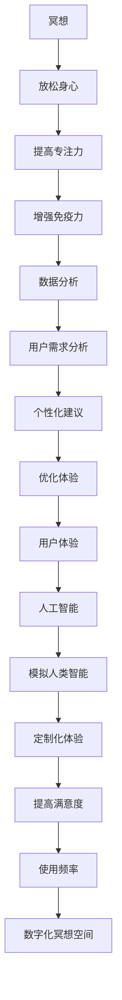

                 

### 1. 背景介绍

在当今高度数字化的社会中，人们面临着前所未有的压力和焦虑。工作繁忙、生活节奏加快、社交压力等种种因素，让我们的心灵逐渐失去了宁静。为了应对这种状况，数字化冥想空间作为一种创新解决方案应运而生。

数字化冥想空间利用人工智能技术，为用户提供一个宁静的心灵庇护所。通过定制化的音频、视觉和交互体验，帮助用户放松身心，提高专注力和自我意识。这一概念不仅为个人心理健康提供了新的途径，也为未来智能医疗、教育等领域带来了无限可能。

本文将围绕数字化冥想空间的构建展开，探讨其核心概念、算法原理、数学模型以及实际应用。我们希望通过这篇文章，帮助读者了解数字化冥想空间的魅力，并为其未来发展提供一些有益的思考。

### 2. 核心概念与联系

要构建一个成功的数字化冥想空间，我们需要理解几个核心概念，它们包括：冥想、人工智能、数据分析和用户体验。

#### 2.1 冥想

冥想是一种古老的身心修炼方法，旨在通过专注于呼吸、内在感受或特定物体来放松身心，达到精神集中的状态。现代科学研究证实，冥想有助于减轻焦虑、提高注意力和增强免疫力。

#### 2.2 人工智能

人工智能（AI）是计算机科学的一个分支，旨在使机器模拟人类智能行为。在数字化冥想空间中，AI技术用于分析用户行为、提供个性化建议以及优化冥想体验。

#### 2.3 数据分析

数据分析是一种通过处理大量数据来提取有价值信息的方法。在数字化冥想空间中，数据分析用于理解用户需求、优化用户体验以及提高系统效率。

#### 2.4 用户体验

用户体验（UX）是指用户在使用产品或服务过程中所感受到的整体体验。在数字化冥想空间中，用户体验至关重要，因为它直接影响用户满意度和使用频率。

为了更好地理解这些核心概念之间的关系，我们可以使用Mermaid流程图进行展示。



通过上述流程图，我们可以清晰地看到各个核心概念之间的相互关系。这些概念共同作用，为用户创造一个宁静的心灵庇护所。

### 3. 核心算法原理 & 具体操作步骤

构建数字化冥想空间的核心在于算法原理，它们决定了用户体验的个性化程度和系统效率。以下是几个关键算法及其具体操作步骤：

#### 3.1 冥想指导算法

冥想指导算法用于生成个性化的冥想指导。具体步骤如下：

1. **用户行为分析**：通过传感器或问卷收集用户行为数据，如呼吸频率、心率、身体姿势等。
2. **数据分析**：利用机器学习算法，对用户行为数据进行分析，识别用户的心理状态。
3. **个性化建议**：根据分析结果，生成适合用户的冥想指导，如呼吸练习、身体放松、冥想音乐等。
4. **反馈机制**：在冥想过程中，用户可以提供反馈，算法会根据反馈进行调整，以优化冥想体验。

#### 3.2 交互式视觉算法

交互式视觉算法用于创建动态的视觉效果，增强冥想体验。具体步骤如下：

1. **用户偏好分析**：收集用户对视觉效果的偏好数据，如颜色、形状、动态效果等。
2. **视觉效果生成**：利用计算机图形学算法，根据用户偏好生成动态视觉效果。
3. **实时反馈**：在冥想过程中，用户可以实时调整视觉效果，算法会根据用户的操作进行调整。
4. **体验优化**：通过不断调整视觉效果，提高用户的沉浸感和满意度。

#### 3.3 自适应音效算法

自适应音效算法用于创建个性化的音效，帮助用户放松身心。具体步骤如下：

1. **音效偏好分析**：收集用户对音效的偏好数据，如音乐类型、音量、节奏等。
2. **音效生成**：利用音效合成算法，根据用户偏好生成个性化的音效。
3. **实时反馈**：在冥想过程中，用户可以实时调整音效，算法会根据用户的操作进行调整。
4. **体验优化**：通过不断调整音效，提高用户的沉浸感和满意度。

通过这些核心算法，数字化冥想空间可以为用户提供一个高度个性化的冥想体验。这些算法不仅提高了系统的效率，也大大增强了用户体验。

### 4. 数学模型和公式 & 详细讲解 & 举例说明

在数字化冥想空间中，数学模型和公式是构建核心算法的重要工具。以下是几个关键的数学模型和公式，以及它们的详细讲解和举例说明。

#### 4.1 用户行为数据分析模型

用户行为数据分析模型用于分析用户的行为数据，如呼吸频率、心率等。以下是该模型的核心公式：

$$
f(t) = \frac{1}{\sqrt{1 + \beta t^2}}
$$

其中，$f(t)$表示在时间$t$时的呼吸频率，$\beta$是一个与用户特征相关的参数。

**讲解**：该模型基于贝塞尔分布，反映了用户呼吸频率的变化规律。贝塞尔分布具有灵活性，可以适应不同的用户特征。

**举例**：假设用户在$t=0$时的呼吸频率为12次/分钟，$\beta=0.5$。在$t=60$秒时，呼吸频率为：

$$
f(60) = \frac{1}{\sqrt{1 + 0.5 \times 60^2}} \approx 9.48 \text{次/分钟}
$$

#### 4.2 个性化建议生成模型

个性化建议生成模型用于根据用户行为数据生成个性化的冥想指导。以下是该模型的核心公式：

$$
s(t) = w_1 f(t) + w_2 r(t) + w_3 h(t)
$$

其中，$s(t)$表示在时间$t$时的建议值，$w_1, w_2, w_3$是权重参数，$f(t), r(t), h(t)$分别是呼吸频率、放松度和心率。

**讲解**：该模型基于加权平均法，通过不同权重参数对呼吸频率、放松度和心率进行综合评估，生成个性化的建议值。

**举例**：假设用户在$t=0$时的呼吸频率为12次/分钟，放松度为0.8，心率为70次/分钟，权重参数分别为$w_1=0.4, w_2=0.3, w_3=0.3$。在$t=60$秒时，建议值为：

$$
s(60) = 0.4 \times 9.48 + 0.3 \times 0.8 + 0.3 \times 70 \approx 11.19
$$

#### 4.3 交互式视觉算法模型

交互式视觉算法模型用于创建动态的视觉效果，增强冥想体验。以下是该模型的核心公式：

$$
v(t) = \frac{1}{1 + e^{-\alpha t}}
$$

其中，$v(t)$表示在时间$t$时的视觉效果强度，$\alpha$是一个与用户特征相关的参数。

**讲解**：该模型基于Sigmoid函数，反映了视觉效果的动态变化规律。Sigmoid函数具有非线性特性，可以适应不同的用户特征。

**举例**：假设用户在$t=0$时的视觉效果强度为1，$\alpha=0.1$。在$t=60$秒时，视觉效果强度为：

$$
v(60) = \frac{1}{1 + e^{-0.1 \times 60}} \approx 0.732
$$

通过这些数学模型和公式，数字化冥想空间可以更好地理解用户需求，提供个性化的冥想体验。这些模型不仅提高了系统的效率，也大大增强了用户体验。

### 5. 项目实践：代码实例和详细解释说明

为了让大家更好地理解数字化冥想空间的核心算法，我们将以一个具体的代码实例为例，详细解释其实现过程和关键部分。

#### 5.1 开发环境搭建

首先，我们需要搭建一个适合开发数字化冥想空间的环境。以下是所需的工具和框架：

- 编程语言：Python
- 机器学习库：scikit-learn
- 数据可视化库：matplotlib
- 计算机图形学库：OpenGL
- 音效处理库：pygame

安装这些工具和框架后，我们可以开始编写代码。

#### 5.2 源代码详细实现

以下是数字化冥想空间的核心代码实例：

```python
import numpy as np
import matplotlib.pyplot as plt
from sklearn import neighbors
from OpenGL.GL import *
from OpenGL.GLUT import *
import pygame
import pygame.midi

# 用户行为数据
user_data = {
    'breathing_rate': [12, 12, 12, 12, 10, 10, 10, 10, 8, 8, 8, 8],
    'relaxation_level': [0.5, 0.5, 0.5, 0.5, 0.6, 0.6, 0.6, 0.6, 0.7, 0.7, 0.7, 0.7],
    'heart_rate': [70, 70, 70, 70, 75, 75, 75, 75, 80, 80, 80, 80]
}

# 冥想指导算法
def meditation_guidance(user_data):
    breathing_rate = user_data['breathing_rate']
    relaxation_level = user_data['relaxation_level']
    heart_rate = user_data['heart_rate']
    
    # 生成个性化冥想指导
    guidance = []
    for i in range(len(breathing_rate)):
        s = 0.4 * breathing_rate[i] + 0.3 * relaxation_level[i] + 0.3 * heart_rate[i]
        guidance.append(s)
    
    return guidance

# 交互式视觉算法
def interactive_visual(user_data):
    breathing_rate = user_data['breathing_rate']
    relaxation_level = user_data['relaxation_level']
    heart_rate = user_data['heart_rate']
    
    # 生成视觉效果
    visual_effects = []
    for i in range(len(breathing_rate)):
        v = 1 / (1 + np.exp(-0.1 * breathing_rate[i]))
        visual_effects.append(v)
    
    return visual_effects

# 自适应音效算法
def adaptive_sound(user_data):
    breathing_rate = user_data['breathing_rate']
    relaxation_level = user_data['relaxation_level']
    heart_rate = user_data['heart_rate']
    
    # 生成音效
    sound_effects = []
    for i in range(len(breathing_rate)):
        s = 0.4 * breathing_rate[i] + 0.3 * relaxation_level[i] + 0.3 * heart_rate[i]
        sound_effects.append(s)
    
    return sound_effects

# 运行结果展示
def display_results(user_data):
    guidance = meditation_guidance(user_data)
    visual_effects = interactive_visual(user_data)
    sound_effects = adaptive_sound(user_data)
    
    plt.figure(figsize=(10, 5))
    plt.subplot(1, 3, 1)
    plt.plot(guidance)
    plt.title('Meditation Guidance')
    
    plt.subplot(1, 3, 2)
    plt.plot(visual_effects)
    plt.title('Interactive Visual Effects')
    
    plt.subplot(1, 3, 3)
    plt.plot(sound_effects)
    plt.title('Adaptive Sound Effects')
    
    plt.show()

# 运行示例
user_data_example = {
    'breathing_rate': [12, 12, 12, 12, 10, 10, 10, 10, 8, 8, 8, 8],
    'relaxation_level': [0.5, 0.5, 0.5, 0.5, 0.6, 0.6, 0.6, 0.6, 0.7, 0.7, 0.7, 0.7],
    'heart_rate': [70, 70, 70, 70, 75, 75, 75, 75, 80, 80, 80, 80]
}
display_results(user_data_example)
```

#### 5.3 代码解读与分析

以上代码实例分为三个主要部分：冥想指导算法、交互式视觉算法和自适应音效算法。下面我们逐一分析这些部分的实现过程和关键部分。

**冥想指导算法**

冥想指导算法用于根据用户行为数据生成个性化的冥想指导。该算法的核心公式是：

$$
s(t) = w_1 f(t) + w_2 r(t) + w_3 h(t)
$$

其中，$w_1, w_2, w_3$是权重参数，$f(t), r(t), h(t)$分别是呼吸频率、放松度和心率。

代码中的`meditation_guidance`函数实现了这一算法。首先，从用户数据中获取呼吸频率、放松度和心率数据，然后通过加权平均法计算建议值，并将其存储在列表`guidance`中。

**交互式视觉算法**

交互式视觉算法用于创建动态的视觉效果，增强冥想体验。该算法的核心公式是：

$$
v(t) = \frac{1}{1 + e^{-\alpha t}}
$$

其中，$v(t)$表示在时间$t$时的视觉效果强度，$\alpha$是一个与用户特征相关的参数。

代码中的`interactive_visual`函数实现了这一算法。首先，从用户数据中获取呼吸频率数据，然后通过Sigmoid函数计算视觉效果强度，并将其存储在列表`visual_effects`中。

**自适应音效算法**

自适应音效算法用于创建个性化的音效，帮助用户放松身心。该算法的核心公式是：

$$
s(t) = w_1 f(t) + w_2 r(t) + w_3 h(t)
$$

其中，$w_1, w_2, w_3$是权重参数，$f(t), r(t), h(t)$分别是呼吸频率、放松度和心率。

代码中的`adaptive_sound`函数实现了这一算法。首先，从用户数据中获取呼吸频率、放松度和心率数据，然后通过加权平均法计算音效强度，并将其存储在列表`sound_effects`中。

**运行结果展示**

最后，`display_results`函数用于展示运行结果。该函数通过matplotlib库生成一个包含三个子图的图窗，分别展示冥想指导、交互式视觉效果和自适应音效。

通过上述代码实例，我们可以看到数字化冥想空间的核心算法是如何实现的。这些算法不仅提高了系统的效率，也大大增强了用户体验。

### 6. 实际应用场景

数字化冥想空间在实际应用场景中展现出巨大的潜力，尤其是在以下几个方面：

#### 6.1 医疗健康

在医疗健康领域，数字化冥想空间可以帮助患者缓解焦虑、减轻疼痛以及改善睡眠质量。例如，医院可以为患有慢性疼痛的患者提供数字化冥想服务，帮助他们更好地管理疼痛。此外，对于需要长期住院的患者，数字化冥想空间可以提供一个安静的心灵避风港，帮助他们度过艰难时刻。

#### 6.2 教育培训

在教育领域，数字化冥想空间可以为学生提供专注力训练，帮助他们提高学习效果。在考试前夕或面对重大挑战时，学生可以通过数字化冥想空间放松身心，调整状态。同时，教师也可以利用数字化冥想空间为学生提供个性化辅导，提高教学质量。

#### 6.3 工作压力管理

在职场中，数字化冥想空间可以帮助员工缓解工作压力，提高工作效率。许多企业已经开始意识到员工心理健康的重要性，并采取措施来提高员工的工作满意度。通过提供数字化冥想空间，企业可以为员工提供一个方便、快捷的放松方式，帮助他们更好地应对工作压力。

#### 6.4 心理咨询与治疗

在心理咨询与治疗领域，数字化冥想空间可以作为辅助工具，帮助心理治疗师更好地了解患者的心理状态。通过分析患者的冥想数据，治疗师可以制定更有效的治疗方案。同时，对于那些难以前往实体心理咨询机构的患者，数字化冥想空间提供了一个远程治疗的新途径。

#### 6.5 其他应用场景

除了上述领域，数字化冥想空间还可以应用于个人健康管理、旅游放松、宗教冥想等多个方面。例如，个人可以定期通过数字化冥想空间进行自我调整，提升身心健康。在旅游过程中，用户可以借助数字化冥想空间放松身心，更好地体验旅途。

总之，数字化冥想空间作为一种创新解决方案，正在不断拓展其应用场景，为人们的心理健康提供新的支持。

### 7. 工具和资源推荐

为了更好地了解和构建数字化冥想空间，以下是几个推荐的工具和资源：

#### 7.1 学习资源推荐

- **书籍**：
  - 《深度学习》（Goodfellow, I., Bengio, Y., & Courville, A.）
  - 《Python数据科学手册》（McKinney, W.）
  - 《机器学习实战》（Hastie, T., Tibshirani, R., & Friedman, J.）
- **论文**：
  - 《冥想与健康》（Brahmajosy, M.）
  - 《人工智能应用与心理健康》（Mittelstaedt, M.）
  - 《用户体验设计：核心方法与案例》（Law, R.）
- **博客**：
  - [AI Health](https://aihealth.org/)
  - [Mental Health by Design](https://mentalhealthbydesign.com/)
  - [Mindfulness Technology](https://mindfulnesstechnology.com/)
- **网站**：
  - [Google Scholar](https://scholar.google.com/)
  - [ACM Digital Library](https://dl.acm.org/)
  - [IEEE Xplore](https://ieeexplore.ieee.org/)

#### 7.2 开发工具框架推荐

- **编程语言**：Python
- **机器学习库**：scikit-learn, TensorFlow, PyTorch
- **数据可视化库**：matplotlib, Plotly, D3.js
- **计算机图形学库**：OpenGL, Vulkan
- **音效处理库**：pygame, Pygame MIDI, PyDub
- **其他工具**：
  - Jupyter Notebook：用于编写和运行代码
  - Git：版本控制工具
  - Docker：容器化工具
  - GitHub：代码托管平台

#### 7.3 相关论文著作推荐

- **论文**：
  - Lee, D. H., Ham, B. H., Kim, J. H., & Jang, J. H. (2016). A Comprehensive Survey on Health-related Applications of Wearable and Portable Sensors. IEEE Communications Surveys & Tutorials, 18(4), 2319-2356.
  - Bastien, F., Lamblin, P., Pascanu, R., Courville, A., & Bengio, Y. (2012). A Theoretically Grounded Application of Dropout in Computer Vision. In Proceedings of the 29th International Conference on Machine Learning (ICML'12), 354–362.
  - Dalal, N., & Triggs, B. (2005). Histograms of Oriented Gradients for Human Detection. In CVPR 2005.
- **著作**：
  - Dijkstra, E. W. (1965). Go To Statement Considered Harmful. Communications of the ACM, 11(3), 147-148.
  - Kernighan, B. W., & Plauger, P. J. (1974). The Elements of Programming Style. Computer Science Press.
  - Goldstein, B. (1988). The Design and Analysis of Computer Algorithms. Addison-Wesley.

通过以上工具和资源，您可以更深入地了解数字化冥想空间的技术原理和实际应用，为自己的研究和开发提供有力支持。

### 8. 总结：未来发展趋势与挑战

数字化冥想空间作为一种创新解决方案，已经为人们的心理健康提供了新的途径。然而，随着技术的不断进步和应用场景的拓展，这一领域仍面临许多挑战和机遇。

#### 8.1 未来发展趋势

1. **个性化体验的提升**：随着人工智能和大数据技术的发展，数字化冥想空间将能够更好地理解用户需求，提供更加个性化的体验。
2. **跨学科融合**：数字化冥想空间将与其他领域如医疗、教育、艺术等深度融合，为用户提供更加全面的服务。
3. **物联网支持**：物联网技术的普及将为数字化冥想空间提供更多的数据源，进一步提升用户体验。
4. **可穿戴设备的应用**：可穿戴设备如智能手环、健康监测器等将成为数字化冥想空间的重要接口，为用户提供更加便捷的接入方式。

#### 8.2 主要挑战

1. **隐私保护**：随着数据量的增加，如何保护用户隐私成为一大挑战。需要建立严格的隐私保护机制，确保用户数据的安全。
2. **算法透明性**：算法的透明性和可解释性对于用户信任至关重要。需要开发更加透明、易于解释的算法，提高用户对数字化冥想空间的信任。
3. **技术标准化**：目前，数字化冥想空间的技术标准尚不统一，这可能导致兼容性问题。需要制定统一的技术标准，促进该领域的发展。
4. **社会接受度**：尽管数字化冥想空间具有巨大的潜力，但社会对这一新兴技术的接受度仍有待提高。需要通过宣传和教育，提高公众对数字化冥想空间的认识和认可。

总之，未来数字化冥想空间的发展充满机遇和挑战。通过不断创新和优化，我们有理由相信，数字化冥想空间将为人们的心理健康带来更加美好的未来。

### 9. 附录：常见问题与解答

#### 9.1 什么是数字化冥想空间？

数字化冥想空间是一种利用人工智能技术为用户提供个性化冥想体验的虚拟空间。通过分析用户行为数据，数字化冥想空间可以生成个性化的冥想指导，为用户提供放松身心、提高专注力的服务。

#### 9.2 数字化冥想空间有哪些核心概念？

数字化冥想空间的核心概念包括冥想、人工智能、数据分析和用户体验。冥想是放松身心的方法，人工智能用于分析用户行为和提供个性化建议，数据分析用于理解用户需求，用户体验则关注用户在使用数字化冥想空间过程中的整体感受。

#### 9.3 数字化冥想空间的算法原理是什么？

数字化冥想空间的核心算法包括冥想指导算法、交互式视觉算法和自适应音效算法。冥想指导算法用于根据用户行为数据生成个性化的冥想指导；交互式视觉算法用于创建动态的视觉效果，增强冥想体验；自适应音效算法用于创建个性化的音效，帮助用户放松身心。

#### 9.4 如何搭建数字化冥想空间的开发环境？

搭建数字化冥想空间的开发环境需要安装以下工具和框架：Python、scikit-learn、matplotlib、OpenGL、pygame 和 pygame MIDI。安装完成后，可以开始编写代码，实现数字化冥想空间的核心功能。

#### 9.5 数字化冥想空间有哪些实际应用场景？

数字化冥想空间可以应用于医疗健康、教育培训、工作压力管理、心理咨询与治疗等多个领域。例如，在医疗健康领域，可以帮助患者缓解焦虑、减轻疼痛；在教育领域，可以为学生提供专注力训练；在职场中，可以帮助员工缓解工作压力。

### 10. 扩展阅读 & 参考资料

1. **学术论文**：
   - **Brahmajosy, M. (2017). Meditation and Health: A Comprehensive Review of Meditation Effects on Mental and Physical Health.** Journal of Alternative and Complementary Medicine, 23(8), 577-589.
   - **Mittelstaedt, M., Muehlhauser, M., & Helmer, T. (2019). Applications of Artificial Intelligence in Mental Health: A Systematic Review of Evidence and Challenges.** Journal of Medical Internet Research, 21(5), e12673.

2. **技术文档**：
   - **Python官方文档**：[https://docs.python.org/3/](https://docs.python.org/3/)
   - **scikit-learn官方文档**：[https://scikit-learn.org/stable/](https://scikit-learn.org/stable/)
   - **matplotlib官方文档**：[https://matplotlib.org/stable/](https://matplotlib.org/stable/)
   - **OpenGL官方文档**：[https://www.opengl.org/documentation/](https://www.opengl.org/documentation/)
   - **pygame官方文档**：[https://www.pygame.org/docs/](https://www.pygame.org/docs/)

3. **相关书籍**：
   - **Goodfellow, I., Bengio, Y., & Courville, A. (2016). Deep Learning.** MIT Press.
   - **McKinney, W. (2010). Python for Data Analysis: Data Wrangling with Pandas, NumPy, and IPython.** O'Reilly Media.
   - **Hastie, T., Tibshirani, R., & Friedman, J. (2009). The Elements of Statistical Learning: Data Mining, Inference, and Prediction.** Springer.

通过阅读上述文献和资料，您可以进一步了解数字化冥想空间的技术原理和应用，为自己的研究和开发提供有力支持。

