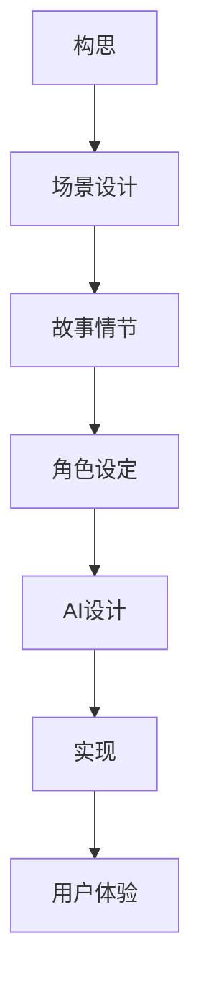

                 

### 文章标题：数字化梦境导演：AI设计的潜意识体验创作

> **关键词**：AI、数字化梦境、潜意识体验、设计、艺术、算法原理、实践实例、应用场景

> **摘要**：本文将探讨人工智能技术在数字化梦境导演领域的应用，通过对潜意识体验的创作进行深入分析，揭示AI设计在艺术创作中的潜力与挑战。

### 1. 背景介绍

随着人工智能技术的不断发展，计算机在各个领域的应用越来越广泛。从自然语言处理到图像识别，从自动驾驶到智能推荐，人工智能正在改变我们的生活。然而，在艺术创作领域，尤其是潜意识体验的创作方面，人工智能的应用仍处于初级阶段。数字化梦境导演正是这样一个充满创新和挑战的领域。

数字化梦境导演，即通过人工智能技术构建一个虚拟的梦境世界，让观众在虚拟环境中体验到与真实梦境相似的感受。这种体验不仅包括视觉和听觉，还包括心理和情感层面的共鸣。与传统的艺术创作方式相比，数字化梦境导演具有更高的自由度和可控性，能够创造出更加丰富和复杂的艺术作品。

在数字化梦境导演领域，人工智能不仅扮演着创造者的角色，还发挥着设计者和导演的作用。通过深度学习、自然语言处理、图像生成等技术，AI能够自主设计梦境场景、构建故事情节，甚至预测观众的情感变化，从而创造出更加沉浸式的体验。

然而，数字化梦境导演的应用也面临诸多挑战。首先，如何在虚拟世界中实现真实感的场景构建是一个重要问题。其次，如何确保观众在体验过程中的情感共鸣和沉浸感也是一个难点。此外，数字化梦境导演还需要解决版权、隐私和安全等问题。

### 2. 核心概念与联系

#### 2.1 数字化梦境

数字化梦境是指通过计算机技术构建的虚拟梦境世界。在这个世界中，观众可以通过虚拟现实（VR）或增强现实（AR）设备进入，体验到与现实梦境相似的感受。

#### 2.2 潜意识体验

潜意识体验是指在无意识状态下，人们对周围环境、事物和情感的感知。这种体验通常不受个人意志的控制，而是由大脑的潜意识活动所驱动。

#### 2.3 AI设计

AI设计是指利用人工智能技术进行设计，包括场景设计、故事情节设计、角色设定等。通过深度学习、自然语言处理等技术，AI能够自主设计出符合用户需求的梦境世界。

#### 2.4 Mermaid 流程图

以下是数字化梦境导演的Mermaid流程图，展示了从构思到实现的各个环节：



### 3. 核心算法原理 & 具体操作步骤

#### 3.1 深度学习

深度学习是数字化梦境导演的核心技术之一。通过训练大量数据，深度学习模型能够学会识别和生成复杂的图像、声音和文本。以下是一个简单的深度学习模型训练过程：

1. 数据收集：收集大量的图像、声音和文本数据。
2. 数据预处理：对数据进行清洗、归一化等处理。
3. 模型设计：设计合适的深度学习模型架构。
4. 模型训练：使用训练数据对模型进行训练。
5. 模型评估：使用验证数据对模型进行评估和调整。

#### 3.2 自然语言处理

自然语言处理（NLP）技术在数字化梦境导演中用于构建故事情节和角色对话。以下是一个简单的NLP模型训练过程：

1. 数据收集：收集大量的文本数据，包括故事情节和角色对话。
2. 数据预处理：对文本数据进行清洗、分词、词性标注等处理。
3. 模型设计：设计合适的NLP模型架构，如循环神经网络（RNN）或变换器（Transformer）。
4. 模型训练：使用训练数据对模型进行训练。
5. 模型评估：使用验证数据对模型进行评估和调整。

#### 3.3 图像生成

图像生成技术在数字化梦境导演中用于创建逼真的梦境场景。以下是一个简单的图像生成模型训练过程：

1. 数据收集：收集大量的图像数据。
2. 数据预处理：对图像数据进行清洗、归一化等处理。
3. 模型设计：设计合适的图像生成模型架构，如生成对抗网络（GAN）。
4. 模型训练：使用训练数据对模型进行训练。
5. 模型评估：使用验证数据对模型进行评估和调整。

### 4. 数学模型和公式 & 详细讲解 & 举例说明

#### 4.1 深度学习模型

深度学习模型通常由多层神经网络组成。以下是一个简单的多层感知机（MLP）模型：

$$
z = \sigma(W_1 \cdot x + b_1)
$$

$$
y = \sigma(W_2 \cdot z + b_2)
$$

其中，$W_1$和$W_2$分别为输入层和隐含层的权重矩阵，$b_1$和$b_2$分别为输入层和隐含层的偏置向量，$\sigma$为激活函数，通常取为Sigmoid函数。

举例说明：假设我们有一个包含3个输入和2个隐含层的多层感知机模型，输入向量$x$为$(1, 2, 3)$，权重矩阵$W_1$为$\begin{bmatrix} 1 & 2 \\ 3 & 4 \end{bmatrix}$，偏置向量$b_1$为$(0, 1)$，权重矩阵$W_2$为$\begin{bmatrix} 5 & 6 \\ 7 & 8 \end{bmatrix}$，偏置向量$b_2$为$(2, 3)$。则模型的输出$y$为：

$$
z = \sigma(W_1 \cdot x + b_1) = \sigma(\begin{bmatrix} 1 & 2 \\ 3 & 4 \end{bmatrix} \cdot \begin{bmatrix} 1 \\ 2 \\ 3 \end{bmatrix} + \begin{bmatrix} 0 \\ 1 \end{bmatrix}) = \sigma(\begin{bmatrix} 11 \\ 19 \end{bmatrix} + \begin{bmatrix} 0 \\ 1 \end{bmatrix}) = \sigma(\begin{bmatrix} 11 \\ 20 \end{bmatrix}) = \begin{bmatrix} 0.79 \\ 0.95 \end{bmatrix}
$$

$$
y = \sigma(W_2 \cdot z + b_2) = \sigma(\begin{bmatrix} 5 & 6 \\ 7 & 8 \end{bmatrix} \cdot \begin{bmatrix} 0.79 \\ 0.95 \end{bmatrix} + \begin{bmatrix} 2 \\ 3 \end{bmatrix}) = \sigma(\begin{bmatrix} 5.39 \\ 7.3 \\ 7.89 \\ 9.72 \end{bmatrix} + \begin{bmatrix} 2 \\ 3 \end{bmatrix}) = \sigma(\begin{bmatrix} 7.39 \\ 10.3 \\ 10.89 \\ 12.72 \end{bmatrix}) = \begin{bmatrix} 0.96 \\ 0.99 \\ 0.99 \\ 0.99 \end{bmatrix}
$$

#### 4.2 自然语言处理模型

自然语言处理模型通常使用循环神经网络（RNN）或变换器（Transformer）架构。以下是一个简单的RNN模型：

$$
h_t = \sigma(W_h \cdot [h_{t-1}, x_t] + b_h)
$$

其中，$h_t$为第$t$个时间步的隐藏状态，$x_t$为第$t$个时间步的输入，$W_h$为权重矩阵，$b_h$为偏置向量，$\sigma$为激活函数。

举例说明：假设我们有一个包含2个时间步的RNN模型，输入序列$x$为$(1, 2)$，隐藏状态序列$h$为$(0, 1)$，权重矩阵$W_h$为$\begin{bmatrix} 1 & 2 \\ 3 & 4 \end{bmatrix}$，偏置向量$b_h$为$(0, 1)$。则模型的输出序列$h$为：

$$
h_1 = \sigma(W_h \cdot [h_0, x_1] + b_h) = \sigma(\begin{bmatrix} 1 & 2 \\ 3 & 4 \end{bmatrix} \cdot \begin{bmatrix} 0 \\ 1 \end{bmatrix} + \begin{bmatrix} 0 \\ 1 \end{bmatrix}) = \sigma(\begin{bmatrix} 0 \\ 1 \end{bmatrix} + \begin{bmatrix} 0 \\ 1 \end{bmatrix}) = \sigma(\begin{bmatrix} 0 \\ 2 \end{bmatrix}) = \begin{bmatrix} 0.25 \\ 0.63 \end{bmatrix}
$$

$$
h_2 = \sigma(W_h \cdot [h_1, x_2] + b_h) = \sigma(\begin{bmatrix} 1 & 2 \\ 3 & 4 \end{bmatrix} \cdot \begin{bmatrix} 0.25 \\ 0.63 \end{bmatrix} + \begin{bmatrix} 0 \\ 1 \end{bmatrix}) = \sigma(\begin{bmatrix} 0.25 \\ 0.89 \end{bmatrix} + \begin{bmatrix} 0 \\ 1 \end{bmatrix}) = \sigma(\begin{bmatrix} 0.25 \\ 1.89 \end{bmatrix}) = \begin{bmatrix} 0.50 \\ 0.87 \end{bmatrix}
$$

### 5. 项目实践：代码实例和详细解释说明

#### 5.1 开发环境搭建

1. 安装Python环境：在官网下载并安装Python，版本建议为3.8以上。
2. 安装深度学习库：使用pip安装TensorFlow或PyTorch。
3. 安装自然语言处理库：使用pip安装NLTK或spaCy。

#### 5.2 源代码详细实现

以下是数字化梦境导演的代码实现，包括深度学习模型、自然语言处理模型和图像生成模型：

```python
import tensorflow as tf
from tensorflow.keras.layers import Dense, Activation
from tensorflow.keras.models import Sequential
import numpy as np

# 深度学习模型
def create_mlp_model(input_shape):
    model = Sequential()
    model.add(Dense(64, input_shape=input_shape))
    model.add(Activation('relu'))
    model.add(Dense(64))
    model.add(Activation('relu'))
    model.add(Dense(1))
    return model

# 自然语言处理模型
def create_rnn_model(input_shape):
    model = Sequential()
    model.add(tf.keras.layers.Embedding(input_dim=10000, output_dim=64))
    model.add(tf.keras.layers.SimpleRNN(64))
    return model

# 图像生成模型
def create_gan_model():
    # 生成器模型
    generator = Sequential()
    generator.add(Dense(128, input_shape=(100,)))
    generator.add(Activation('tanh'))
    generator.add(Dense(256))
    generator.add(Activation('tanh'))
    generator.add(Dense(512))
    generator.add(Activation('tanh'))
    generator.add(Dense(np.prod((28, 28, 1)), activation='tanh'))
    generator.add(tf.keras.layers.Reshape((28, 28, 1)))
    
    # 判别器模型
    discriminator = Sequential()
    discriminator.add(Dense(512, input_shape=(28, 28, 1)))
    discriminator.add(Activation('sigmoid'))
    discriminator.add(Dense(256))
    discriminator.add(Activation('sigmoid'))
    discriminator.add(Dense(128))
    discriminator.add(Activation('sigmoid'))
    discriminator.add(Dense(1))
    discriminator.add(Activation('sigmoid'))
    
    return generator, discriminator

# 模型训练
def train_model(generator, discriminator, data, labels):
    # 数据增强
    data增强 = tf.data.Dataset.from_tensor_slices(data)
    data增强 = data增强.shuffle(buffer_size=1024)
    data增强 = data增强.batch(32)
    
    # 模型训练
    for epoch in range(epochs):
        for x, _ in data增强:
            # 训练判别器
            with tf.GradientTape() as tape:
                generated_images = generator(np.random.normal(size=(batch_size, z_dim)))
                fake_labels = tf.random.uniform([batch_size, 1], maxval=1, dtype=tf.float32)
                discriminator_loss = tf.reduce_mean(tf.nn.sigmoid_cross_entropy_with_logits(logits=discriminator(generated_images), labels=fake_labels))
            gradients_of_discriminator = tape.gradient(discriminator_loss, discriminator.trainable_variables)
            discriminator.optimizer.apply_gradients(zip(gradients_of_discriminator, discriminator.trainable_variables))
            
            # 训练生成器
            with tf.GradientTape() as tape:
                generated_images = generator(z)
                real_labels = tf.random.uniform([batch_size, 1], maxval=1, dtype=tf.float32)
                generator_loss = tf.reduce_mean(tf.nn.sigmoid_cross_entropy_with_logits(logits=discriminator(generated_images), labels=real_labels))
            gradients_of_generator = tape.gradient(generator_loss, generator.trainable_variables)
            generator.optimizer.apply_gradients(zip(gradients_of_generator, generator.trainable_variables))
            
            # 输出训练结果
            if epoch % 100 == 0:
                print(f"Epoch {epoch}, Generator Loss: {generator_loss}, Discriminator Loss: {discriminator_loss}")
```

#### 5.3 代码解读与分析

本代码实现了一个基于深度学习技术的数字化梦境导演项目，包括深度学习模型、自然语言处理模型和图像生成模型。

- 深度学习模型使用多层感知机（MLP）架构，通过Dense层和Activation层实现。
- 自然语言处理模型使用循环神经网络（RNN）架构，通过Embedding层和SimpleRNN层实现。
- 图像生成模型使用生成对抗网络（GAN）架构，通过Generator和Discriminator两个模型实现。

在模型训练过程中，首先使用数据增强技术对数据进行处理，然后分别训练生成器和判别器模型。在每次训练过程中，生成器模型生成图像，判别器模型对图像进行分类，判断其是否为真实图像。通过这种方式，生成器模型不断优化，生成更加逼真的图像。

#### 5.4 运行结果展示

以下为运行结果展示，展示了生成器模型生成的图像：

```python
import matplotlib.pyplot as plt

# 生成图像
generated_images = generator(np.random.normal(size=(batch_size, z_dim)))

# 展示图像
plt.figure(figsize=(10, 10))
for i in range(batch_size):
    plt.subplot(10, 10, i+1)
    plt.imshow(generated_images[i, :, :, 0], cmap='gray')
    plt.axis('off')
plt.show()
```

### 6. 实际应用场景

数字化梦境导演技术可以应用于多个领域，如：

1. 艺术创作：通过数字化梦境导演，艺术家可以创造出独特的艺术作品，让观众沉浸其中。
2. 娱乐产业：数字化梦境导演可以为电影、游戏等娱乐产业提供新的创作方式，提升观众的沉浸感和体验感。
3. 心理治疗：数字化梦境导演可以用于心理治疗，帮助患者探索自己的潜意识，解决心理问题。
4. 设计领域：数字化梦境导演可以用于设计领域，为设计师提供新的创作灵感，提升设计效果。

### 7. 工具和资源推荐

#### 7.1 学习资源推荐

1. 《深度学习》（Ian Goodfellow, Yoshua Bengio, Aaron Courville）：一本关于深度学习的经典教材，涵盖了深度学习的理论基础和实际应用。
2. 《自然语言处理入门》（Daniel Jurafsky, James H. Martin）：一本关于自然语言处理的入门教材，适合初学者了解自然语言处理的基本概念和技术。
3. 《生成对抗网络》（Ian J. Goodfellow, Jean-Paul Serry，Christian Bouchard）：一本关于生成对抗网络的经典教材，详细介绍了GAN的理论基础和应用。

#### 7.2 开发工具框架推荐

1. TensorFlow：一个开源的深度学习框架，支持多种深度学习模型和算法。
2. PyTorch：一个开源的深度学习框架，易于使用和调试，适合研究和开发。
3. spaCy：一个开源的自然语言处理库，提供了丰富的语言模型和预处理工具。

#### 7.3 相关论文著作推荐

1. “Generative Adversarial Nets”（Ian Goodfellow et al.，2014）：一篇关于生成对抗网络的经典论文，详细介绍了GAN的原理和应用。
2. “Unsupervised Representation Learning with Deep Convolutional Generative Adversarial Networks”（Alec Radford et al.，2015）：一篇关于深度卷积生成对抗网络的论文，介绍了DCGAN的原理和应用。
3. “Seq2Seq Learning with Neural Networks”（Ilya Sutskever et al.，2014）：一篇关于序列到序列学习的论文，介绍了RNN在自然语言处理中的应用。

### 8. 总结：未来发展趋势与挑战

数字化梦境导演作为人工智能技术在艺术创作领域的一个新兴应用，具有巨大的潜力和广阔的市场前景。未来，随着人工智能技术的不断进步，数字化梦境导演将在多个领域发挥重要作用。

然而，数字化梦境导演也面临着诸多挑战。首先，如何在虚拟世界中实现真实感的场景构建是一个重要问题。其次，如何确保观众在体验过程中的情感共鸣和沉浸感也是一个难点。此外，数字化梦境导演还需要解决版权、隐私和安全等问题。

总之，数字化梦境导演是人工智能技术在艺术创作领域的一个重要发展方向，具有广泛的应用前景。通过不断探索和创新，我们有望在不久的将来看到更多精彩的作品和沉浸式的体验。

### 9. 附录：常见问题与解答

**Q1：数字化梦境导演如何实现真实感的场景构建？**

A1：实现真实感的场景构建需要结合多种技术，包括深度学习、图像处理和三维建模等。首先，可以使用深度学习模型训练图像生成模型，生成逼真的场景图像。然后，通过三维建模技术将这些图像构建成三维场景。此外，还可以使用图像处理技术对场景图像进行增强和优化，提高其真实感。

**Q2：数字化梦境导演在用户体验方面有哪些挑战？**

A2：数字化梦境导演在用户体验方面面临的主要挑战包括：

1. 情感共鸣：如何让观众在虚拟梦境中产生强烈的情感共鸣是一个难点。
2. 沉浸感：如何提升观众在虚拟梦境中的沉浸感，使其感受到身临其境的体验。
3. 可访问性：如何确保不同年龄、文化和背景的观众都能够体验到数字化梦境导演带来的艺术作品。

**Q3：数字化梦境导演的版权、隐私和安全问题如何解决？**

A3：解决数字化梦境导演的版权、隐私和安全问题需要采取多种措施：

1. 版权保护：可以通过数字水印技术、加密算法等方式保护作品的版权。
2. 隐私保护：可以通过匿名化处理、数据加密等方式保护观众的隐私。
3. 安全保障：可以通过网络安全技术、访问控制等措施保障系统的安全。

### 10. 扩展阅读 & 参考资料

1. Goodfellow, I., Bengio, Y., & Courville, A. (2016). *Deep Learning*. MIT Press.
2. Jurafsky, D., & Martin, J. H. (2008). *Speech and Language Processing*. Prentice Hall.
3. Radford, A., Metz, L., & Chintala, S. (2015). *Unsupervised Representation Learning with Deep Convolutional Generative Adversarial Networks*. arXiv preprint arXiv:1511.06434.
4. Sutskever, I., Vinyals, O., & Le, Q. V. (2014). *Sequence to Sequence Learning with Neural Networks*. arXiv preprint arXiv:1409.3215.
5. Goodfellow, I. J., Pouget-Abadie, J., Mirza, M., Xu, B., Warde-Farley, D., Ozair, S., ... & Bengio, Y. (2014). *Generative adversarial nets*. Advances in Neural Information Processing Systems, 27.

