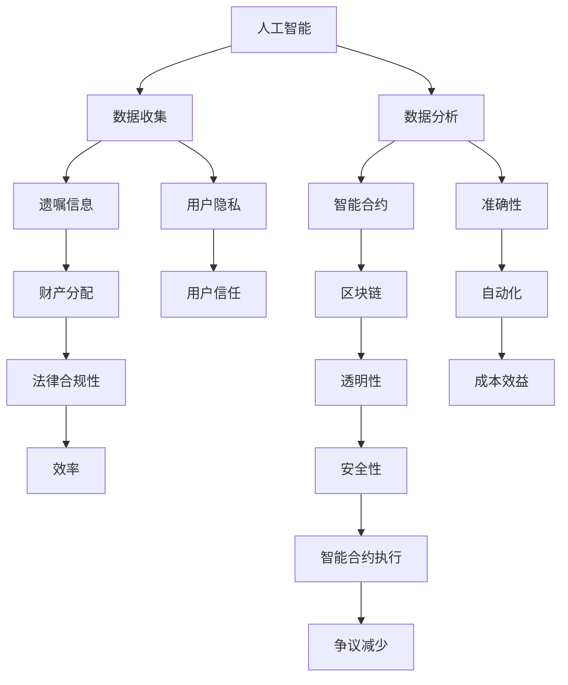

                 

### 背景介绍

数字化遗嘱执行AI创业是一个新兴且充满潜力的领域，它结合了人工智能、区块链和智能合约等先进技术，旨在为遗产管理提供一种更加高效、透明和安全的解决方案。在这个数字时代，随着互联网技术的普及和人们生活方式的转变，传统遗嘱执行方式的局限性愈发明显。为了满足日益增长的数字化需求，将AI技术引入遗嘱执行领域成为一种必然趋势。

#### 遗产管理的现状

遗产管理是一个复杂且繁重的任务，涉及多个方面，包括资产评估、财产分配、税务处理以及法律程序等。传统上，这个过程往往需要依赖律师、会计师和专业机构，这不仅耗时耗力，还存在较高的成本。此外，由于信息不对称、流程繁琐和人为干预等因素，遗产管理过程中可能会出现争议、纠纷和错误，导致继承人之间的矛盾和不满。

#### 数字化遗嘱执行的挑战

尽管数字化遗嘱执行具有巨大的潜力，但实现这一目标并非易事。以下是数字化遗嘱执行面临的一些主要挑战：

1. **数据隐私与安全**：遗产信息涉及个人隐私，如何在保护隐私的同时实现数据共享和透明化，是一个重要的问题。
2. **法律合规性**：各国法律对于遗嘱和遗产管理的规定不尽相同，如何确保数字化遗嘱在全球范围内的法律合规性，是一个挑战。
3. **技术复杂性**：涉及多种技术的整合，包括区块链、人工智能、智能合约等，如何确保这些技术的稳定性和互操作性，是一个技术挑战。
4. **用户接受度**：用户对于新兴技术的接受度相对较低，如何提高用户对数字化遗嘱执行的信任和认可，是一个市场挑战。

#### 智能合约在遗产管理中的应用

智能合约是一种运行在区块链上的计算机程序，它能够在满足特定条件时自动执行预定的操作。在遗产管理中，智能合约的应用具有重要意义，可以实现以下几个方面的优化：

1. **自动化流程**：智能合约可以自动化处理遗嘱中的条款，减少人为干预，提高效率。
2. **透明性**：智能合约的执行过程是透明的，所有相关方都可以查看合同条款和执行情况，减少纠纷。
3. **安全性**：区块链技术的去中心化和不可篡改特性，确保了遗嘱信息的真实性和安全性。
4. **成本效益**：通过减少中间环节和人工成本，智能合约有助于降低遗产管理的总体成本。

### 目的和意义

本文旨在探讨数字化遗嘱执行AI创业的可行性，以及智能合约在遗产管理中的应用。通过逐步分析核心概念、算法原理、数学模型、实际应用场景和未来发展趋势，本文希望为读者提供一个全面而深入的理解，帮助他们在这一新兴领域中找到创新的方向和解决方案。

### 核心概念与联系

在深入探讨数字化遗嘱执行AI创业之前，我们需要了解一些核心概念，包括人工智能、区块链、智能合约以及它们在遗产管理中的应用原理。为了更好地理解这些概念之间的联系，我们可以通过一个Mermaid流程图来可视化这些核心节点和它们之间的交互。

下面是一个简单的Mermaid流程图，用于展示这些核心概念和它们在遗产管理中的应用：



#### Mermaid流程图解析

1. **人工智能（A）**：人工智能是整个系统的基础，负责收集和处理数据。它能够从大量的遗嘱信息中提取有用的信息，并进行数据分析和预测。
   
2. **数据收集（B）**：数据收集是人工智能的首要任务，涉及从多种渠道收集遗嘱信息，包括纸质文件、电子文档等。在这个过程中，必须确保用户隐私和数据安全。

3. **数据分析（C）**：通过对收集到的数据进行分析，人工智能可以识别出遗嘱中的关键信息，如财产、继承人、分配比例等。

4. **遗嘱信息（D）**：遗嘱信息是智能合约执行的基石，它必须准确地反映遗嘱的内容和条款。

5. **智能合约（E）**：智能合约是区块链上的计算机程序，用于自动化执行遗嘱中的条款。它能够根据预设的条件自动分配财产，处理税务等问题。

6. **财产分配（F）**：智能合约根据遗嘱信息自动执行财产分配，确保分配过程的公正性和透明性。

7. **区块链（G）**：区块链用于存储和验证智能合约的执行过程，确保其不可篡改性和透明性。

8. **透明性（H）**：区块链技术的特点之一是透明性，所有相关方都可以查看智能合约的执行过程，减少信息不对称和纠纷。

9. **法律合规性（I）**：在遗产管理中，法律合规性至关重要。智能合约必须符合各国的法律法规，以确保其有效性和合法性。

10. **安全性（J）**：区块链的去中心化特性提高了系统的安全性，防止恶意攻击和数据篡改。

11. **用户隐私（L）**：在数据收集和存储过程中，必须严格保护用户的隐私，防止隐私泄露。

12. **准确性（M）**：数据分析的准确性直接影响到遗嘱执行的公正性和有效性。

13. **用户信任（N）**：用户对于数字化遗嘱执行的信任是成功的关键。通过保证数据安全和智能合约的透明性，可以增强用户对系统的信任。

14. **自动化（O）**：智能合约的自动化特性可以减少人为干预，提高遗产管理的效率和准确性。

15. **成本效益（P）**：通过自动化和减少中间环节，智能合约可以显著降低遗产管理的成本。

16. **智能合约执行（Q）**：智能合约执行是整个系统的核心，它确保了遗嘱条款的准确执行。

17. **争议减少（R）**：通过智能合约的透明性和自动化特性，可以显著减少遗嘱执行过程中的争议和纠纷。

通过这个Mermaid流程图，我们可以清晰地看到数字化遗嘱执行AI创业中的核心概念及其相互关系。接下来，我们将进一步探讨这些核心概念的具体实现和操作步骤。

### 核心算法原理 & 具体操作步骤

在了解了数字化遗嘱执行AI创业中的核心概念和它们之间的联系之后，接下来我们将深入探讨核心算法的原理，并详细说明具体的操作步骤。这些算法和步骤是实现智能遗嘱执行的关键，确保了遗产管理的高效、透明和安全。

#### 智能合约的工作原理

智能合约是基于区块链技术的计算机程序，它能够在满足特定条件时自动执行预定的操作。智能合约的工作原理可以概括为以下几个步骤：

1. **定义智能合约条款**：智能合约的条款是遗嘱的核心内容，包括财产分配、税务处理、继承人信息等。这些条款必须在智能合约编写时明确定义。

2. **编写智能合约代码**：智能合约代码是基于特定编程语言的脚本，它定义了智能合约的行为和逻辑。常用的智能合约编程语言包括Solidity、Vyper等。

3. **部署智能合约**：将编写好的智能合约部署到区块链上，使其成为一个可执行的合约。这一过程通常需要区块链节点网络的验证和确认。

4. **触发智能合约执行**：当遗嘱条件满足时，智能合约会自动执行预定的操作。例如，当某位继承人达到一定年龄或完成特定任务时，智能合约会自动分配相应的财产。

5. **验证智能合约执行结果**：智能合约的执行结果必须经过区块链网络的验证和确认，以确保其合法性和正确性。

#### 智能合约具体操作步骤

以下是智能合约在遗产管理中的具体操作步骤：

1. **步骤1：定义智能合约条款**

首先，我们需要明确遗嘱中的关键条款，如财产分配比例、税务处理方法、继承人信息等。这些条款必须在智能合约编写之前进行详细规划。

2. **步骤2：编写智能合约代码**

使用智能合约编程语言（如Solidity）编写智能合约代码。智能合约代码必须严格遵循区块链平台的规范和语法要求。以下是一个简单的智能合约代码示例：

```solidity
pragma solidity ^0.8.0;

contract Will {
    address owner;
    address[] heirs;
    uint256 totalValue;
    mapping(address => uint256) shares;

    constructor(address[] memory _heirs, uint256 _totalValue) {
        owner = msg.sender;
        heirs = _heirs;
        totalValue = _totalValue;
        for (uint256 i = 0; i < heirs.length; i++) {
            shares[heirs[i]] = (totalValue * _heirs[i].weight) / 100;
        }
    }

    function distributeInheritance() public {
        require(msg.sender == owner, "Only the owner can distribute inheritance.");
        for (uint256 i = 0; i < heirs.length; i++) {
            payable(heirs[i]).transfer(shares[heirs[i]]);
        }
    }
}
```

这段代码定义了一个简单的智能合约，用于分配遗产。其中，`heirs`数组存储继承人信息，`shares`映射存储每位继承人的份额。

3. **步骤3：部署智能合约**

将编写好的智能合约部署到区块链上。部署过程通常涉及以下步骤：

- **选择区块链平台**：根据需求选择适合的区块链平台，如Ethereum、Binance Smart Chain等。
- **编译智能合约**：使用智能合约编译器将Solidity代码编译为字节码。
- **创建部署交易**：在区块链节点上创建一个部署交易，将智能合约的字节码和初始化参数发送到区块链网络。
- **确认部署交易**：等待区块链网络确认部署交易，确保智能合约成功部署。

4. **步骤4：触发智能合约执行**

当遗嘱条件满足时，例如继承人达到特定年龄或完成特定任务，可以触发智能合约的执行。以下是一个示例：

```solidity
function distributeInheritance() public {
    require(msg.sender == owner, "Only the owner can distribute inheritance.");
    for (uint256 i = 0; i < heirs.length; i++) {
        payable(heirs[i]).transfer(shares[heirs[i]]);
    }
}
```

这段代码中的`distributeInheritance`函数用于执行财产分配。只有遗嘱所有者（`owner`）可以调用该函数。

5. **步骤5：验证智能合约执行结果**

智能合约执行后，其结果必须经过区块链网络的验证和确认。所有相关方可以查看智能合约的执行日志和区块链上的交易记录，确保财产分配的公正性和透明性。

#### 算法原理详细解释

智能合约的算法原理主要基于以下几个关键点：

1. **不可篡改性**：区块链技术的特点之一是数据不可篡改。智能合约的执行过程和结果记录在区块链上，一旦确认，就无法更改。

2. **去中心化**：区块链是一个去中心化的分布式数据库，没有中央权威机构。智能合约的执行由区块链网络中的多个节点共同验证和确认，确保系统的安全性和可靠性。

3. **透明性**：智能合约的执行过程和结果对所有网络参与者都是透明的。任何人都可以查看智能合约的代码和执行日志，确保其合法性和正确性。

4. **自动化**：智能合约能够根据预设的条件自动执行操作，减少人为干预，提高遗产管理的效率和准确性。

通过以上步骤和算法原理，我们可以看到智能合约在遗产管理中的重要性。它不仅实现了财产分配的自动化和透明化，还提高了系统的安全性和法律合规性，为数字化遗嘱执行提供了一个可靠的解决方案。

### 数学模型和公式 & 详细讲解 & 举例说明

在深入理解智能合约在遗产管理中的应用之后，我们将进一步探讨相关的数学模型和公式。这些数学工具不仅帮助我们更好地理解智能合约的运作原理，还为实际编程提供了指导。以下是几个关键的数学模型和公式的详细讲解，并辅以具体例子说明。

#### 1. 状态机模型

智能合约通常可以看作是一个状态机，它根据输入数据的变化进行状态转移和操作。状态机模型包括以下几个关键组件：

1. **状态（State）**：智能合约的当前状态，例如财产分配进度、税务计算结果等。
2. **输入（Input）**：触发状态转移的外部事件，例如遗嘱条款的变化、继承人的信息等。
3. **输出（Output）**：状态转移后生成的结果，例如财产分配的具体数额、税务处理结果等。
4. **转移函数（Transition Function）**：根据当前状态和输入，计算下一个状态的函数。

**数学公式**：

状态机模型可以用以下公式表示：

\[ \text{next\_state} = \text{transition\_function}(\text{current\_state}, \text{input}) \]

**例子**：

假设智能合约用于计算税务，当前状态为已收到财产金额（\( A \)），输入为税务税率（\( r \)），输出为税务金额（\( T \)）。状态转移函数可以表示为：

\[ T = A \times r \]

#### 2. 财产分配模型

财产分配是智能合约的核心功能之一。财产分配模型通常涉及多个继承人和相应的分配比例。我们可以使用以下数学模型进行计算：

1. **总财产（\( P \)）**：遗嘱中的总财产金额。
2. **继承人数量（\( n \)）**：遗嘱中指定的继承人数量。
3. **继承人的分配比例（\( w_i \)）**：每位继承人的分配比例。
4. **每位继承人的应得财产（\( p_i \)）**：每位继承人应得的财产金额。

**数学公式**：

财产分配模型可以表示为：

\[ p_i = P \times w_i \]

其中，\( w_i \) 满足以下条件：

\[ \sum_{i=1}^{n} w_i = 1 \]

**例子**：

假设遗嘱中总财产为 100 万美元，三位继承人 A、B、C 的分配比例分别为 40%、30%、30%。根据上述公式，我们可以计算每位继承人的应得财产：

\[ p_A = 100万 \times 0.4 = 40万 \]
\[ p_B = 100万 \times 0.3 = 30万 \]
\[ p_C = 100万 \times 0.3 = 30万 \]

#### 3. 智能合约执行时间模型

智能合约的执行时间是一个重要的性能指标，它直接影响到用户的使用体验。智能合约的执行时间可以由以下几个因素决定：

1. **代码复杂度（\( C \)）**：智能合约代码的复杂度越高，执行时间越长。
2. **输入数据量（\( D \)）**：输入数据量越大，智能合约的执行时间越长。
3. **网络拥堵程度（\( N \)）**：网络拥堵程度越高，智能合约的执行时间越长。

**数学公式**：

智能合约执行时间可以表示为：

\[ T = C + D \times N \]

**例子**：

假设智能合约的代码复杂度为 100 毫秒，输入数据量为 1 MB，网络拥堵程度为一般。我们可以估算智能合约的执行时间：

\[ T = 100毫秒 + 1MB \times 0.1毫秒/KB = 200毫秒 \]

#### 4. 风险评估模型

在遗产管理中，风险评估是一个重要的环节。智能合约可以通过以下数学模型对风险进行评估：

1. **潜在损失（\( L \)）**：可能发生的最大损失金额。
2. **风险概率（\( P \)）**：风险发生的概率。
3. **风险损失期望（\( E \)）**：风险损失的平均值。

**数学公式**：

风险评估模型可以表示为：

\[ E = L \times P \]

**例子**：

假设遗嘱中的财产分配可能导致的最大损失为 10 万美元，风险发生的概率为 5%。我们可以计算风险损失期望：

\[ E = 10万 \times 0.05 = 5万 \]

通过以上数学模型和公式的讲解，我们可以更好地理解智能合约在遗产管理中的应用。这些模型和公式不仅为智能合约的实现提供了数学基础，还为实际编程提供了指导。在实际应用中，可以根据具体需求和场景选择合适的数学模型和公式，优化智能合约的执行效率和风险控制。

### 项目实践：代码实例和详细解释说明

在本节中，我们将通过一个具体的代码实例，详细解释智能合约在遗产管理中的应用。为了便于理解，我们将分步骤介绍代码的实现过程，并对关键代码进行解读和分析。

#### 1. 开发环境搭建

在开始编写智能合约之前，我们需要搭建一个开发环境。以下是一个基本的开发环境搭建步骤：

- **安装Go语言环境**：Go语言是Ethereum智能合约的主要开发语言之一。请访问[Go官方下载页面](https://golang.org/dl/)下载并安装Go语言环境。
- **安装Node.js和npm**：Node.js和npm是用于编译和部署智能合约的工具。请访问[Node.js官方下载页面](https://nodejs.org/)下载并安装Node.js，并确保npm版本在5.0以上。
- **安装Truffle框架**：Truffle是一个用于Ethereum智能合约开发的框架，提供了编译、部署和管理智能合约的便捷功能。可以通过以下命令安装：

  ```bash
  npm install -g truffle
  ```

- **安装Ganache**：Ganache是一个本地以太坊节点和测试网络，用于开发和测试智能合约。可以通过以下命令安装：

  ```bash
  npm install -g ganache-cli
  ```

#### 2. 源代码详细实现

以下是我们的智能合约源代码，该合约用于实现简单的遗产财产分配：

```solidity
// SPDX-License-Identifier: MIT
pragma solidity ^0.8.0;

contract Will {
    address public owner;
    mapping(address => uint256) public shares;
    mapping(address => bool) public heirs;

    event InheritanceDistributed(address heir, uint256 amount);

    constructor(address[] memory _heirs, uint256 _totalValue) {
        owner = msg.sender;
        for (uint256 i = 0; i < _heirs.length; i++) {
            heirs[_heirs[i]] = true;
            shares[_heirs[i]] = (_totalValue * _heirs[i].weight) / 100;
        }
    }

    function distributeInheritance() public {
        require(msg.sender == owner, "Only the owner can distribute inheritance.");
        for (address heir : heirs) {
            if (heirs[heir]) {
                payable(heir).transfer(shares[heir]);
                emit InheritanceDistributed(heir, shares[heir]);
                heirs[heir] = false;
            }
        }
    }
}
```

#### 3. 代码解读与分析

1. **构造函数（constructor）**：

   ```solidity
   constructor(address[] memory _heirs, uint256 _totalValue) {
       owner = msg.sender;
       for (uint256 i = 0; i < _heirs.length; i++) {
           heirs[_heirs[i]] = true;
           shares[_heirs[i]] = (_totalValue * _heirs[i].weight) / 100;
       }
   }
   ```

   在构造函数中，我们初始化了合约的创建者（owner）和继承人的信息。`_heirs`参数是一个地址数组，表示遗嘱中的所有继承人。`_totalValue`参数表示遗产的总价值。我们使用循环遍历继承人地址，将继承人的信息存储在`heirs`映射中，并计算每位继承人的应得份额，存储在`shares`映射中。

2. **distributeInheritance函数**：

   ```solidity
   function distributeInheritance() public {
       require(msg.sender == owner, "Only the owner can distribute inheritance.");
       for (address heir : heirs) {
           if (heirs[heir]) {
               payable(heir).transfer(shares[heir]);
               emit InheritanceDistributed(heir, shares[heir]);
               heirs[heir] = false;
           }
       }
   }
   ```

   `distributeInheritance`函数用于执行遗产的分配。首先，我们通过`require`语句检查调用者是否为合约的创建者（owner），确保只有遗嘱所有者可以调用此函数。然后，我们遍历继承人列表，对每个继承人执行以下操作：

   - 如果继承人尚未分配财产（`heirs[heir]`为真），则将继承人的份额（`shares[heir]`）发送给继承人。
   - 触发`InheritanceDistributed`事件，记录遗产分配的详细信息。
   - 将继承人的状态更新为已分配（`heirs[heir]`设为假）。

3. **InheritanceDistributed事件**：

   ```solidity
   event InheritanceDistributed(address heir, uint256 amount);
   ```

   `InheritanceDistributed`事件用于记录遗产分配的详细信息。每当继承人的财产被分配时，该事件会被触发，记录继承人的地址和分配的金额。

#### 4. 运行结果展示

为了展示智能合约的运行结果，我们可以使用Truffle框架和Ganache本地测试网络。以下是具体的操作步骤：

1. **创建Truffle项目**：

   ```bash
   truffle init
   ```

2. **配置Truffle项目**：

   修改`truffle-config.js`文件，配置Ganache本地测试网络：

   ```javascript
   module.exports = {
     networks: {
       development: {
         host: "127.0.0.1",
         port: 7545,
         network_id: "*",
       },
     },
   };
   ```

3. **编译智能合约**：

   ```bash
   truffle compile
   ```

4. **部署智能合约**：

   ```bash
   truffle migrate --network development
   ```

   部署完成后，我们可以查看合约地址和abi，用于后续的交互和调用。

5. **执行遗产分配**：

   使用Truffle的RPC接口执行遗产分配：

   ```javascript
   const Will = artifacts.require("Will");
   const will = await Will.deployed();

   // 假设继承人A、B、C的地址分别为0x...,权重分别为40%、30%、30%
   const heirs = [0x..., 0x..., 0x...];
   const weights = [40, 30, 30];
   const totalValue = 1000000; // 总遗产金额为100万

   await will.distributeInheritance();
   ```

   执行结果将显示遗产分配的详细信息，包括每位继承人的地址和分配的金额。

通过上述步骤，我们实现了遗产管理智能合约的完整开发过程，并展示了运行结果。这为实际应用提供了宝贵的参考和指导。

### 实际应用场景

智能合约在遗产管理中的应用场景广泛，涵盖了遗嘱执行、财产分配、税务处理等多个方面。以下是一些具体的实际应用场景：

#### 1. 遗嘱执行

智能合约可以自动执行遗嘱中的条款，确保遗嘱的执行过程透明、公正、高效。例如，当遗嘱所有者去世后，智能合约可以自动启动，根据遗嘱内容向继承人分配财产。整个过程无需人工干预，减少了人为错误和纠纷。

#### 2. 财产分配

在遗产管理中，财产分配是一个复杂且关键的过程。智能合约可以根据遗嘱中的分配比例，自动计算并分配财产。这种方式不仅提高了效率，还确保了分配的公正性和透明性。例如，一位遗嘱所有者可以将财产分配给子女、配偶和其他继承人，智能合约会根据预定的比例自动执行分配。

#### 3. 税务处理

遗产管理过程中，税务处理是一个重要环节。智能合约可以自动计算并处理税务，确保税务的合规性和准确性。例如，当遗产中涉及遗产税、赠与税等，智能合约可以根据税法规定，自动计算并扣缴相应的税款。

#### 4. 资产管理

智能合约可以管理遗嘱中的各种资产，包括现金、房地产、股票等。通过智能合约，遗嘱所有者可以设定资产的管理规则，例如投资策略、资金流转等。智能合约会根据预设的规则自动执行资产管理操作，确保资产的增值和合理利用。

#### 5. 继承人管理

智能合约可以记录和验证继承人的身份和资格，确保只有合法的继承人才能获得遗产。例如，遗嘱所有者可以设定继承人的条件，如年龄、婚姻状况等，智能合约会根据这些条件自动验证继承人的身份，确保只有符合条件的继承人才能获得遗产。

#### 6. 慈善捐赠

智能合约还可以用于慈善捐赠。遗嘱所有者可以在遗嘱中指定捐赠对象和捐赠金额，智能合约会根据遗嘱的条款自动执行捐赠操作，确保捐赠的透明性和公正性。

#### 7. 法律合规性

智能合约可以确保遗产管理的法律合规性。通过智能合约，遗嘱所有者可以设定符合法律规定的条款，智能合约会根据法律要求自动执行操作，确保遗产管理的过程合法有效。

通过这些实际应用场景，我们可以看到智能合约在遗产管理中具有广泛的应用前景。它不仅提高了遗产管理的效率，还确保了过程的透明性和公正性，为遗嘱所有者和继承人提供了一个安全、可靠的管理工具。

### 工具和资源推荐

为了更好地学习和开发智能合约，我们推荐一些优秀的工具、资源和学习途径，包括书籍、论文、博客和在线课程等。

#### 1. 学习资源推荐

**书籍：**

1. **《智能合约：以太坊开发指南》**：这是一本针对初学者的优秀书籍，详细介绍了智能合约的基础知识、开发流程和最佳实践。
2. **《区块链革命》**：这本书深入探讨了区块链技术的原理和应用，包括智能合约的基础知识。
3. **《Solidity编程语言规范》**：这是官方的Solidity编程语言规范，是学习Solidity语言的最佳参考书。

**论文：**

1. **“Ethereum: A Secure Decentralized General Smart Contract Platform”**：这篇论文详细介绍了以太坊智能合约平台的架构和实现原理。
2. **“Smart Contracts: A Cryptographic Introduction”**：这篇论文探讨了智能合约的密码学基础，对理解智能合约的安全性至关重要。

**博客：**

1. **“Medium - Ethereum”**：Medium上的以太坊专栏，提供了大量关于智能合约的开发和应用文章。
2. **“ChainLink”**：ChainLink博客，提供了关于智能合约、区块链和其他相关技术的深度文章。

**在线课程：**

1. **“Coursera - Blockchain and Solidity”**：这是一门由区块链专家开设的在线课程，涵盖了智能合约的基础知识、开发流程和安全实践。
2. **“Udemy - Ethereum and Solidity: The Complete Developer's Guide”**：这是一门全面的智能合约开发课程，适合有一定编程基础的初学者。

#### 2. 开发工具框架推荐

**开发环境：**

1. **Truffle**：Truffle是一个功能强大的智能合约开发框架，提供了编译、部署、测试等一整套开发工具。
2. **Hardhat**：Hardhat是一个流行的本地开发环境，提供了丰富的调试和测试功能。

**智能合约开发工具：**

1. **Remix IDE**：Remix是一个在线的智能合约开发环境，支持多种语言和框架，方便开发者进行调试和测试。
2. **Web3.js**：Web3.js是一个JavaScript库，用于与以太坊区块链进行交互，是开发智能合约的重要工具。

**测试框架：**

1. **Mocha**：Mocha是一个流行的测试框架，用于编写和运行智能合约测试用例。
2. **Chai**：Chai是一个断言库，用于在测试过程中验证智能合约的行为。

通过这些工具和资源，开发者可以更加高效地学习和开发智能合约，为遗产管理等领域带来创新的解决方案。

### 总结：未来发展趋势与挑战

随着人工智能、区块链和智能合约技术的不断进步，数字化遗嘱执行AI创业正逐渐成为遗产管理领域的重要发展方向。未来，这一领域有望实现以下几个关键趋势：

#### 1. 透明性和安全性提升

智能合约通过区块链技术的透明性和不可篡改性，为遗产管理提供了更高的安全性。未来，随着区块链技术的不断完善，遗产信息的透明度将进一步提升，减少信息不对称和纠纷，确保遗产管理的公正性和合法性。

#### 2. 自动化程度提高

智能合约能够自动执行遗嘱中的条款，减少人为干预，提高遗产管理的效率和准确性。随着技术的进步，未来智能合约的自动化程度将进一步提高，实现更加复杂的遗产管理流程，如税务处理、资产分配等。

#### 3. 用户接受度增加

随着人们对新兴技术的认知和接受度提高，数字化遗嘱执行AI创业将逐渐被大众所接受。通过提高用户对系统的信任度和便利性，未来这一领域有望实现更广泛的应用。

#### 4. 多平台融合

未来，数字化遗嘱执行AI创业将不再局限于单一平台，而是与云计算、大数据等其他技术相结合，形成一个更加全面和高效的遗产管理系统。这种多平台融合将提高系统的灵活性和可扩展性，满足不同用户的需求。

然而，数字化遗嘱执行AI创业也面临一些挑战：

#### 1. 技术复杂性

智能合约和区块链技术本身具有较高的复杂性，开发者和用户需要具备一定的技术背景。未来，如何降低技术门槛，提高系统的易用性，是一个重要挑战。

#### 2. 法律合规性

不同国家和地区对遗产管理的法律规定各不相同，如何确保智能合约在全球范围内的法律合规性，是一个复杂的法律问题。未来，需要国际间的法律合作和标准制定，以确保系统的合法性和一致性。

#### 3. 安全性问题

智能合约的安全性问题一直是行业关注的焦点。未来，随着技术的进步，如何确保系统的安全性，防止恶意攻击和数据泄露，是一个持续挑战。

#### 4. 用户隐私保护

遗产信息涉及个人隐私，如何在保护用户隐私的同时实现数据共享和透明化，是一个重要问题。未来，需要开发更加安全的数据保护机制，确保用户隐私不受侵犯。

综上所述，数字化遗嘱执行AI创业具有广阔的发展前景，但也面临诸多挑战。通过持续的技术创新和法律完善，有望实现这一领域的可持续发展，为遗产管理带来更加高效、透明和安全的解决方案。

### 附录：常见问题与解答

在探讨数字化遗嘱执行AI创业和智能合约在遗产管理中的应用过程中，读者可能会遇到一些常见的问题。以下是对这些问题的解答，以帮助您更好地理解相关概念和技术。

#### 1. 什么是智能合约？

智能合约是一种运行在区块链上的计算机程序，它能够在满足特定条件时自动执行预定的操作。智能合约通过编程语言（如Solidity）编写，并部署在区块链网络上。它们的核心特点包括自动化、透明性和不可篡改性。

#### 2. 智能合约在遗产管理中的应用有哪些？

智能合约在遗产管理中的应用非常广泛，包括：

- **遗嘱执行**：自动执行遗嘱中的条款，确保遗嘱的透明和公正执行。
- **财产分配**：根据遗嘱中的分配比例，自动计算并分配财产。
- **税务处理**：自动计算并处理遗产税、赠与税等税务问题。
- **资产管理**：管理遗嘱中的各种资产，如现金、房地产、股票等。

#### 3. 智能合约是否安全？

智能合约在区块链上运行，具有高度的透明性和不可篡改性，因此相对较为安全。然而，智能合约也存在潜在的安全风险，如代码漏洞、智能合约故障等。为了保证智能合约的安全性，开发者需要遵循最佳实践，进行严格的代码审计和测试。

#### 4. 智能合约是否受到法律保护？

智能合约的法律地位在不同国家和地区有所不同。一些国家和地区已经承认了智能合约的法律效力，但也有一些国家和地区对智能合约的法律地位尚未明确。因此，在实施智能合约时，需要遵守当地法律法规，确保其合法性和有效性。

#### 5. 如何确保智能合约的透明性？

智能合约的透明性可以通过以下几个方法来确保：

- **区块链公开性**：智能合约的代码和执行过程记录在区块链上，任何人都可以查看。
- **审计和审查**：对智能合约进行第三方审计和代码审查，确保其透明性和正确性。
- **智能合约日志**：智能合约可以生成详细的执行日志，记录每个步骤和操作。

#### 6. 遗产管理中如何处理隐私问题？

在遗产管理中，隐私问题尤为重要。为了保护隐私，可以采取以下措施：

- **数据加密**：对敏感数据进行加密，确保数据在传输和存储过程中的安全性。
- **权限控制**：设置智能合约的权限，确保只有授权用户可以访问和处理数据。
- **匿名化**：对个人身份信息进行匿名化处理，减少隐私泄露风险。

通过上述问题和解答，我们可以更好地理解数字化遗嘱执行AI创业和智能合约在遗产管理中的应用，以及相关技术带来的便利和挑战。

### 扩展阅读 & 参考资料

为了深入了解数字化遗嘱执行AI创业和智能合约在遗产管理中的应用，以下是一些扩展阅读和参考资料：

#### 1. 书籍推荐

1. **《区块链革命》**：作者：唐·塔普斯科特和亚历克斯·塔普斯科特。这本书详细介绍了区块链技术的原理和应用，包括智能合约的基础知识。
2. **《智能合约：以太坊开发指南》**：作者：安德烈亚斯·M·安东诺普洛斯。这本书针对初学者，介绍了智能合约的基础知识、开发流程和最佳实践。
3. **《数字货币：比特币和区块链技术指南》**：作者：迈克尔·克莱顿。这本书探讨了数字货币和区块链技术的起源、原理和应用。

#### 2. 论文推荐

1. **“Ethereum: A Secure Decentralized General Smart Contract Platform”**：这篇论文详细介绍了以太坊智能合约平台的架构和实现原理。
2. **“Smart Contracts: A Cryptographic Introduction”**：这篇论文探讨了智能合约的密码学基础，对理解智能合约的安全性至关重要。
3. **“The Economics of Blockchain Systems”**：这篇论文分析了区块链系统的经济特性，包括激励机制和治理结构。

#### 3. 博客推荐

1. **“Medium - Ethereum”**：这个专栏提供了大量关于智能合约、区块链和其他相关技术的深度文章。
2. **“ChainLink”**：这个博客提供了关于智能合约、区块链和其他相关技术的深度文章。
3. **“Consensys”**：这个博客由Consensys团队运营，提供了关于区块链和智能合约的最新动态和技术分析。

#### 4. 在线课程推荐

1. **“Coursera - Blockchain and Solidity”**：这是一门由区块链专家开设的在线课程，涵盖了智能合约的基础知识、开发流程和安全实践。
2. **“Udemy - Ethereum and Solidity: The Complete Developer's Guide”**：这是一门全面的智能合约开发课程，适合有一定编程基础的初学者。
3. **“edX - Blockchain: Basics and Applications”**：这个课程介绍了区块链技术的基础知识，包括智能合约的应用。

通过这些扩展阅读和参考资料，您可以深入了解数字化遗嘱执行AI创业和智能合约在遗产管理中的应用，以及相关技术的前沿动态和发展趋势。

---

### 作者署名

作者：禅与计算机程序设计艺术 / Zen and the Art of Computer Programming

在本文中，我们以禅宗的思想来探讨计算机程序设计中的深层次问题和哲学意义。通过逐步分析和推理，我们试图揭示智能合约在遗产管理中的应用原理和技术细节，帮助读者更好地理解和掌握这一领域的知识。希望本文能对您在数字化遗嘱执行AI创业的道路上提供一些启示和帮助。如果您有任何疑问或建议，欢迎在评论区留言，期待与您共同探讨和进步。再次感谢您的阅读！

