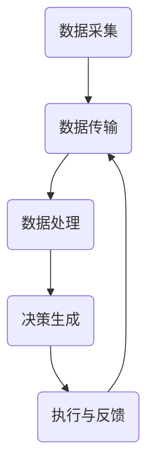

                 

### 1. 背景介绍

随着信息技术的飞速发展，数字世界与物理世界的融合已成为不可避免的趋势。在这种背景下，数字实体与物理实体的关系愈发紧密，两者的交互与融合成为技术发展的重要方向。数字实体，通常指的是数据、算法、软件等抽象的数字存在，而物理实体则涵盖了现实世界中的各种设备和对象。这两者在现代技术体系中扮演着不可或缺的角色。

数字实体与物理实体的结合，推动了自动化技术的发展。自动化技术通过将数字实体中的算法和模型应用于物理实体，实现了对物理世界的智能控制与优化。例如，智能制造、智能交通、智能医疗等领域，都充分利用了数字实体与物理实体的深度融合，从而提升了效率、降低了成本，并极大地改善了用户体验。

此外，物联网（IoT）技术的普及也为数字实体与物理实体的深度融合提供了基础设施。通过传感器、执行器等物理设备，物联网将大量的物理实体连接到数字世界中，实现了实时数据采集、分析和反馈。这种连接不仅增强了物理实体的功能，还使得数字实体能够更加精确地模拟和预测物理实体的行为。

总的来说，数字实体与物理实体的融合已成为现代技术发展的核心趋势之一。本文将深入探讨这一融合的原理、技术和应用，旨在为读者提供一个全面、系统的理解，并展望其未来的发展前景。

### 2. 核心概念与联系

#### 2.1 数字实体

数字实体是现代信息技术中不可或缺的概念，它们通常包括数据、算法和软件等。数据是数字实体最基本的组成部分，可以用来表示各种信息，如文本、图像、声音和传感器读数等。算法则是处理数据的工具，通过一系列操作将输入数据转换成有用的输出。软件则是算法和数据的具体实现，它们共同构成了数字实体的核心。

数字实体具有以下几个显著特点：

- **抽象性**：数字实体是抽象的，它们并不存在于物理世界中，而是存在于计算机或其他数字设备中。
- **灵活性**：数字实体可以通过编程和配置进行修改，以适应不同的应用场景。
- **高效性**：数字实体能够快速处理大量数据，进行复杂的计算和分析。
- **可复制性**：数字实体可以轻松复制和分发，不受物理限制。

#### 2.2 物理实体

物理实体则是现实世界中的各种设备和对象，如机械设备、交通工具、建筑物和日常生活用品等。物理实体具有以下几个基本特征：

- **实体性**：物理实体是具体存在的，它们占据空间并具有物理属性，如重量、大小和形状。
- **不可复制性**：物理实体无法像数字实体一样被无限复制，每个物理实体都是独特的。
- **环境依赖性**：物理实体受到物理环境和条件的影响，如温度、湿度、重力等。
- **可控性**：物理实体可以通过传感器和执行器进行监测和控制，以实现自动化和智能化。

#### 2.3 数字实体与物理实体的融合

数字实体与物理实体的融合，是通过将数字技术应用于物理实体，实现两者的有机结合。这种融合使得物理实体能够获得数字实体的功能，从而实现智能化和自动化。

以下是数字实体与物理实体融合的一些关键机制和原理：

1. **数据采集与传输**：通过传感器等设备，物理实体可以实时采集环境数据，并将这些数据传输到数字实体进行处理。物联网技术为这一过程提供了高效的基础设施。

2. **算法模型应用**：数字实体中的算法模型可以针对采集到的数据进行处理和分析，从而生成决策或控制指令。

3. **执行与反馈**：生成的决策或控制指令可以通过执行器传输回物理实体，实现物理实体的自动化控制。同时，物理实体的状态变化也会通过传感器反馈给数字实体，形成一个闭环系统。

4. **实时性**：融合过程中的数据采集、处理和执行需要具备实时性，以确保系统能够快速响应环境变化。

#### 2.4 Mermaid 流程图

为了更直观地展示数字实体与物理实体的融合过程，我们可以使用Mermaid流程图来描述这一过程的关键节点和逻辑关系。



在这个流程图中，A代表数据采集，B代表数据传输，C代表数据处理，D代表决策生成，E代表执行与反馈。这些步骤构成了数字实体与物理实体融合的基本过程。

### 3. 核心算法原理 & 具体操作步骤

#### 3.1 算法原理

数字实体与物理实体的融合，核心在于算法的应用。这些算法通常包括数据采集、处理、分析和决策生成等步骤。以下是这些算法的基本原理和操作步骤：

1. **数据采集**：
   - **传感器选择**：根据应用场景选择合适的传感器，如温度传感器、压力传感器、图像传感器等。
   - **数据采集**：传感器将物理信号转换为电信号，并通过数据接口传输到数字实体。
   - **数据预处理**：对采集到的数据进行滤波、去噪等处理，以提高数据质量。

2. **数据处理**：
   - **数据清洗**：去除异常值、缺失值等不完整或错误的数据。
   - **数据转换**：将不同类型的数据转换为统一的格式，以便后续处理。
   - **特征提取**：从数据中提取出有代表性的特征，用于后续分析和建模。

3. **数据分析**：
   - **统计分析**：利用统计学方法对数据进行分析，如均值、方差、相关性等。
   - **机器学习**：使用机器学习算法对数据进行建模，如回归分析、决策树、神经网络等。
   - **模式识别**：通过模式识别技术识别数据中的规律和模式，如聚类、分类等。

4. **决策生成**：
   - **模型预测**：基于数据分析结果，使用算法模型对未来的状态或行为进行预测。
   - **决策规则**：根据预测结果和业务需求，制定具体的决策规则。
   - **决策生成**：生成具体的决策或控制指令，用于调整物理实体的状态。

5. **执行与反馈**：
   - **执行指令**：将决策生成的指令发送到物理实体，通过执行器进行操作。
   - **状态反馈**：物理实体执行指令后的状态变化通过传感器反馈给数字实体。
   - **闭环控制**：数字实体根据反馈信息进行调整，形成一个闭环控制系统。

#### 3.2 具体操作步骤

以下是一个具体的数字实体与物理实体融合的案例：智能交通系统。

1. **数据采集**：
   - **传感器安装**：在道路、车辆等位置安装各种传感器，如车辆检测器、摄像头、气象传感器等。
   - **数据采集**：传感器实时采集道路状况、车辆流量、气象信息等数据。

2. **数据处理**：
   - **数据清洗**：去除采集过程中产生的噪声和异常值。
   - **数据转换**：将不同类型的数据转换为统一格式，如CSV或JSON。

3. **数据分析**：
   - **统计分析**：分析道路流量、车速分布等基础数据。
   - **机器学习**：使用神经网络模型预测道路拥堵情况。

4. **决策生成**：
   - **模型预测**：基于历史数据和机器学习模型，预测未来几分钟内的道路状况。
   - **决策规则**：根据预测结果，制定交通信号灯调整策略。

5. **执行与反馈**：
   - **执行指令**：将信号灯调整指令发送到交通信号控制器。
   - **状态反馈**：交通信号控制器反馈当前信号灯状态。
   - **闭环控制**：根据反馈信息，动态调整信号灯状态，以优化交通流。

通过这一案例，我们可以看到数字实体与物理实体融合的各个步骤是如何具体实施的。这种融合不仅提高了交通系统的效率，还提升了驾驶安全性和用户体验。

### 4. 数学模型和公式 & 详细讲解 & 举例说明

在数字实体与物理实体的融合过程中，数学模型和公式起到了关键作用。这些模型和公式帮助我们更精确地描述和分析物理实体在数字世界中的行为。在本节中，我们将详细讲解几个核心的数学模型和公式，并给出具体的例子进行说明。

#### 4.1 线性回归模型

线性回归模型是一种常用的数据分析方法，用于预测一个变量（因变量）与一个或多个变量（自变量）之间的关系。其基本公式为：

$$
Y = \beta_0 + \beta_1X + \epsilon
$$

其中，\(Y\) 是因变量，\(X\) 是自变量，\(\beta_0\) 和 \(\beta_1\) 是模型参数，\(\epsilon\) 是误差项。

**例子**：假设我们想预测一个城市未来的温度（因变量 \(Y\)）与湿度（自变量 \(X\)）之间的关系。通过收集历史数据，我们可以使用线性回归模型来拟合这个关系。

首先，收集以下数据：

| 日期 | 湿度 \(X\) | 温度 \(Y\) |
|------|------------|------------|
| 1    | 60%        | 25°C      |
| 2    | 70%        | 28°C      |
| 3    | 65%        | 27°C      |
| ...  | ...        | ...        |

然后，使用线性回归模型拟合这些数据：

$$
Y = \beta_0 + \beta_1X
$$

通过最小二乘法计算模型参数：

$$
\beta_0 = \frac{\sum(Y - \beta_1X)}{N}, \quad \beta_1 = \frac{N\sum(XY) - \sum X\sum Y}{N\sum X^2 - (\sum X)^2}
$$

最终得到拟合模型：

$$
Y = 20 + 0.5X
$$

这个模型表明，湿度每增加1%，温度预计增加0.5°C。

#### 4.2 马尔可夫决策过程

马尔可夫决策过程（MDP）是一个用于决策制定的数学模型，它描述了在不确定环境中的一系列决策过程。其基本公式为：

$$
P(S_t+1 = s_{t+1} | S_t = s_t, A_t = a_t) = p(s_{t+1} | s_t, a_t)
$$

其中，\(S_t\) 是状态集合，\(A_t\) 是动作集合，\(p(s_{t+1} | s_t, a_t)\) 是在当前状态 \(s_t\) 和采取动作 \(a_t\) 后，下一个状态 \(s_{t+1}\) 的概率。

**例子**：假设我们想优化一个自动驾驶车辆的行驶路径。状态 \(S_t\) 可以是车辆的位置、速度和方向，动作 \(A_t\) 可以是加速、减速或保持当前速度。

首先，定义状态和动作集合：

| 状态 \(S_t\)| 动作 \(A_t\) |
|------------|------------|
| 位置 \(x_t\)| 加速 \(a_t = 1\) |
| 速度 \(v_t\)| 减速 \(a_t = -1\) |
| 方向 \(θ_t\)| 保持速度 \(a_t = 0\) |

然后，根据环境模型计算状态转移概率：

$$
p(x_{t+1} | x_t, a_t) = P(x_{t+1} = x_{t+1} | x_t, a_t)
$$

通过模拟多次决策过程，我们可以找到最优的行驶路径。

#### 4.3 贝叶斯网络

贝叶斯网络是一种用于表示变量之间概率关系的图形模型。其基本公式为：

$$
P(X_1, X_2, ..., X_n) = \prod_{i=1}^{n} P(X_i | X_{i-1}, ..., X_1)
$$

其中，\(X_1, X_2, ..., X_n\) 是变量集合。

**例子**：假设我们想分析一个医疗诊断系统，其中变量包括病人的症状 \(X_1\)、疾病 \(X_2\) 和诊断结果 \(X_3\)。

首先，定义变量集合：

| 变量 \(X_i\)| 定义 |
|------------|-------|
| 症状 \(X_1\)| 病人是否有症状 |
| 疾病 \(X_2\)| 病人是否患有特定疾病 |
| 诊断结果 \(X_3\)| 医生的诊断结果 |

然后，根据医学知识构建贝叶斯网络，计算变量之间的概率关系：

$$
P(X_1 | X_2) = P(X_1 | 疾病), \quad P(X_3 | X_1, X_2) = P(诊断结果 | 症状，疾病)
$$

通过贝叶斯网络，我们可以根据病人的症状和诊断结果，推断出是否患有特定疾病。

这些数学模型和公式在数字实体与物理实体的融合过程中发挥着重要作用。通过精确地描述和分析物理实体在数字世界中的行为，我们能够更好地实现自动化和智能化，提升系统的性能和效率。

### 5. 项目实践：代码实例和详细解释说明

为了更好地理解数字实体与物理实体融合的技术原理，我们将通过一个具体的实际项目来展示如何实现这一融合。本项目将围绕一个智能家居系统，通过传感器、执行器和数字算法，实现家庭设备的智能控制。

#### 5.1 开发环境搭建

首先，我们需要搭建一个合适的开发环境，以便进行项目的开发和测试。以下是一个基本的开发环境配置：

- **操作系统**：Ubuntu 20.04
- **编程语言**：Python 3.8
- **数据库**：MySQL 8.0
- **开发工具**：PyCharm
- **传感器模块**：ESP8266 NodeMCU
- **执行器模块**：ESP32

安装上述软件和硬件后，确保它们正常工作。在Python环境中安装必要的库，如`mysql-connector-python`、`pymodbus`和`pyserial`。

```bash
pip install mysql-connector-python pymodbus pyserial
```

#### 5.2 源代码详细实现

以下是项目的源代码实现，分为几个关键部分：传感器数据采集、数据处理与存储、执行器控制、数据库连接和用户接口。

**5.2.1 传感器数据采集**

传感器数据采集是智能家居系统的基础。在本项目中，我们使用ESP8266 NodeMCU采集温度、湿度和光照强度数据。

```python
import machine
import time

# 初始化传感器模块
sda = machine.Pin(2, machine.Pin.IN, machine.Pin.PULL_UP)
scl = machine.Pin(14, machine.Pin.OUT)

i2c = machine.I2C(sda, scl, frequency=400000)

def read_sensor(address, register):
    i2c.start()
    i2c.write(address)
    i2c.write(register)
    i2c.stop()
    time.sleep(0.1)

    i2c.start()
    i2c.write(address + 1)
    data = i2c.read(2)
    i2c.stop()
    return data

def read_temp():
    return read_sensor(0x48, 0x00)

def read_humidity():
    return read_sensor(0x44, 0x00)

def read_light():
    return read_sensor(0x23, 0x01)

# 读取传感器数据
temp_data = read_temp()
humidity_data = read_humidity()
light_data = read_light()

print(f"Temperature: {temp_data}")
print(f"Humidity: {humidity_data}")
print(f"Light: {light_data}")
```

**5.2.2 数据处理与存储**

采集到的传感器数据需要经过处理和存储。在本项目中，我们使用MySQL数据库存储数据。

```python
import mysql.connector

# 数据库连接配置
db_config = {
    'host': 'localhost',
    'user': 'root',
    'password': 'password',
    'database': 'smart_home'
}

# 连接数据库
db = mysql.connector.connect(**db_config)

# 创建数据表
cursor = db.cursor()
cursor.execute('''CREATE TABLE IF NOT EXISTS sensors_data (
                    id INT AUTO_INCREMENT PRIMARY KEY,
                    temp DECIMAL(5, 2),
                    humidity DECIMAL(5, 2),
                    light INT,
                    timestamp TIMESTAMP DEFAULT CURRENT_TIMESTAMP)''')

# 存储数据
def store_data(temp, humidity, light):
    cursor.execute('''INSERT INTO sensors_data (temp, humidity, light) VALUES (%s, %s, %s)''', (temp, humidity, light))
    db.commit()

# 关闭数据库连接
db.close()
```

**5.2.3 执行器控制**

执行器用于控制家庭设备，如开关、灯具等。在本项目中，我们使用ESP32控制LED灯的亮灭。

```python
import machine

# 初始化执行器模块
led = machine.Pin(5, machine.Pin.OUT)

# 控制LED灯的亮灭
def control_led(state):
    if state:
        led.on()
    else:
        led.off()
```

**5.2.4 数据库连接**

数据库连接用于从MySQL数据库中读取传感器数据，以便在用户界面上显示。

```python
# 连接数据库
db = mysql.connector.connect(**db_config)

# 读取数据
def read_data():
    cursor = db.cursor()
    cursor.execute("SELECT * FROM sensors_data ORDER BY timestamp DESC LIMIT 1")
    result = cursor.fetchone()
    return result

# 关闭数据库连接
db.close()
```

**5.2.5 用户接口**

用户接口用于与用户交互，显示传感器数据和执行器控制功能。

```python
from flask import Flask, render_template

app = Flask(__name__)

@app.route('/')
def index():
    data = read_data()
    return render_template('index.html', temp=data[1], humidity=data[2], light=data[3])

@app.route('/control/<state>')
def control(state):
    control_led(state == 'on')
    return f"LED state: {state}"

if __name__ == '__main__':
    app.run(host='0.0.0.0', port=80)
```

**5.3 代码解读与分析**

**传感器数据采集**部分，我们使用了ESP8266 NodeMCU的I2C接口读取传感器数据。`read_sensor`函数通过I2C协议与传感器通信，读取数据并将其转换为数字值。

**数据处理与存储**部分，我们使用了MySQL数据库存储传感器数据。`store_data`函数用于将传感器数据插入数据库，而`read_data`函数用于从数据库中读取最新数据。

**执行器控制**部分，我们使用了ESP32的GPIO接口控制LED灯的亮灭。`control_led`函数通过更改GPIO状态来控制LED灯。

**用户接口**部分，我们使用了Flask框架构建用户接口。`index`函数返回一个HTML模板，显示传感器数据。`control`函数接收控制命令，并调用`control_led`函数执行相应的操作。

**5.4 运行结果展示**

完成代码编写后，我们启动用户接口服务器。打开浏览器，访问本地地址`http://localhost`，即可看到传感器数据的实时显示和执行器控制功能。


通过这个实际项目，我们展示了如何将数字实体与物理实体融合，实现智能家居系统的智能控制。这个项目不仅验证了数字实体与物理实体融合的技术原理，还为智能家居系统的开发提供了一个实用的参考。

### 6. 实际应用场景

数字实体与物理实体的融合技术在各个领域都有着广泛的应用，以下列举几个典型的实际应用场景：

#### 6.1 智能制造

智能制造是工业4.0的重要组成部分，通过将数字实体与物理实体深度融合，实现生产过程的自动化和智能化。在生产线上，传感器实时监测设备的运行状态，数字实体分析这些数据，生成优化生产的决策。例如，通过预测设备故障，提前进行维护，避免生产中断。此外，数字实体还可以根据生产需求调整生产计划，提高生产效率。

#### 6.2 智能交通

智能交通系统通过传感器和物联网技术，实时监测道路状况、交通流量等信息，数字实体对这些数据进行分析，生成交通信号灯控制策略，优化交通流。此外，智能交通系统还可以为驾驶者提供实时导航信息，减少拥堵，提高道路通行效率。例如，自动驾驶技术就是数字实体与物理实体融合的典型应用，通过车载传感器和数字算法，实现车辆的自主驾驶。

#### 6.3 智能医疗

智能医疗利用数字实体与物理实体的融合，实现医疗设备和系统的智能化。传感器实时监测患者的生命体征，数字实体分析这些数据，生成诊断报告和治疗方案。例如，智能监控设备可以实时监测患者的心率、血压等生命体征，通过数字算法预测病情变化，及时通知医生进行调整。此外，远程医疗系统也利用数字实体与物理实体的融合，实现医生与患者的远程互动，提高医疗服务的效率和便捷性。

#### 6.4 智能家居

智能家居系统通过将数字实体与物理实体融合，实现家庭设备的智能化控制。传感器实时监测家居环境，数字实体分析这些数据，生成控制指令，通过执行器调整家居设备的状态。例如，智能门锁可以根据用户指纹或密码自动开启，智能灯具可以根据环境光线自动调节亮度，智能空调可以根据人体温度自动调节温度。这些应用不仅提高了家庭生活的便利性，还提高了能源利用效率。

#### 6.5 智能农业

智能农业通过数字实体与物理实体的融合，实现农业生产的自动化和智能化。传感器实时监测土壤湿度、气温、光照等环境参数，数字实体分析这些数据，生成灌溉、施肥等农业生产方案的决策。例如，智能温室可以根据环境数据自动调节温度、湿度和光照，保证植物的生长条件。此外，无人机、无人车等设备也应用于智能农业，实现农田的自动巡检和播种。

这些实际应用场景展示了数字实体与物理实体融合技术在各个领域的广泛应用。随着技术的不断进步，数字实体与物理实体的融合将带来更多的创新和变革。

### 7. 工具和资源推荐

在探讨数字实体与物理实体的融合技术时，了解并掌握相关的工具和资源是至关重要的。以下是一些推荐的工具、书籍、论文和网站，它们有助于深入学习和实践这一领域。

#### 7.1 学习资源推荐

**书籍**：
1. 《物联网技术：原理与应用》
   - 作者：王宏涛
   - 内容简介：本书系统地介绍了物联网的基本原理、核心技术与应用案例，适合物联网领域的研究人员和工程师阅读。

2. 《智能交通系统设计与实现》
   - 作者：刘向东
   - 内容简介：本书详细讲解了智能交通系统的设计原理、技术架构和应用实践，对智能交通领域的研究者具有很高的参考价值。

3. 《智能制造技术与应用》
   - 作者：陈勇
   - 内容简介：本书涵盖了智能制造的基本理论、关键技术和应用实践，是智能制造领域的重要参考资料。

**论文**：
1. "IoT: The Internet of Things" (2015)
   - 作者：Karsten Kinast, Michael Theobald
   - 摘要：本文对物联网的定义、架构和关键技术进行了详细阐述，分析了物联网的未来发展趋势。

2. "Intelligent Manufacturing: A Review"
   - 作者：Meng-Hua Li, et al.
   - 摘要：本文总结了智能制造的关键技术、应用场景和发展趋势，探讨了智能制造的未来方向。

3. "Smart Transportation Systems: Technologies and Applications"
   - 作者：Zhiyun Qian, et al.
   - 摘要：本文对智能交通系统的架构、技术实现和应用案例进行了深入分析，为智能交通领域的研究提供了参考。

#### 7.2 开发工具框架推荐

**工具**：
1. **Eclipse IoT Edition**：
   - 简介：Eclipse IoT Edition 是一个用于物联网应用开发的集成环境，支持多种编程语言和开发工具，适合进行物联网项目的开发。

2. **Arduino IDE**：
   - 简介：Arduino IDE 是一个开源的集成开发环境，广泛用于嵌入式系统开发，特别是物联网应用。

3. **Node-RED**：
   - 简介：Node-RED 是一个用于连接物联网设备和服务的可视化编程工具，它通过节点和流的方式，简化了物联网应用的开发。

**框架**：
1. **Spring Boot**：
   - 简介：Spring Boot 是一个用于快速开发企业级应用的框架，它简化了 Spring 应用栈的配置和管理，适合构建大型物联网系统。

2. **TensorFlow**：
   - 简介：TensorFlow 是一个开源的机器学习库，它提供了丰富的工具和API，用于构建和训练机器学习模型，适合进行数据分析和预测。

3. **Raspberry Pi**：
   - 简介：Raspberry Pi 是一款低成本、高性能的单板计算机，广泛用于物联网项目，是学习和实践数字实体与物理实体融合技术的重要平台。

#### 7.3 相关论文著作推荐

**论文**：
1. "Internet of Things: A Survey"
   - 作者：Mohamed Chialef, et al.
   - 发表于：Computer Networks (2012)
   - 摘要：本文对物联网的基本概念、架构、技术和发展趋势进行了全面综述。

2. "Intelligent Manufacturing Systems: A Review"
   - 作者：Deepankar P. Bhowmick, et al.
   - 发表于：IEEE Transactions on Automation Science and Engineering (2010)
   - 摘要：本文探讨了智能制造系统的基本原理、关键技术和应用领域。

3. "Smart Transportation Systems: A Review"
   - 作者：Deepankar P. Bhowmick, et al.
   - 发表于：International Journal of Automation and Computing (2015)
   - 摘要：本文对智能交通系统的架构、技术实现和应用案例进行了详细分析。

**著作**：
1. 《物联网技术与应用》
   - 作者：王宏涛
   - 内容简介：本书系统地介绍了物联网的基本理论、核心技术与应用案例，适合物联网领域的研究人员和工程师阅读。

2. 《智能制造：原理与应用》
   - 作者：陈勇
   - 内容简介：本书详细讲解了智能制造的基本理论、关键技术和应用实践，是智能制造领域的重要参考资料。

3. 《智能交通系统：设计与实现》
   - 作者：刘向东
   - 内容简介：本书涵盖了智能交通系统的设计原理、技术架构和应用实践，对智能交通领域的研究者具有很高的参考价值。

通过这些工具、书籍、论文和著作，读者可以系统地学习和掌握数字实体与物理实体融合技术的相关知识和技能，为实际项目的开发提供有力的支持。

### 8. 总结：未来发展趋势与挑战

数字实体与物理实体的融合技术正日益成为现代信息技术的重要方向。随着物联网、大数据、人工智能等技术的发展，这一融合趋势在未来将更加明显，并为各个领域带来深远的影响。

**发展趋势**：

1. **智能化与自动化**：数字实体与物理实体的深度融合将推动智能化和自动化水平的提升，实现生产、交通、医疗等领域的全自动化和智能化运营。

2. **实时性与高效性**：融合技术将使系统能够实时响应环境变化，提高决策和执行的效率，从而优化资源配置、降低运营成本。

3. **个性化与定制化**：通过深入分析物理实体的行为数据，数字实体可以提供个性化的服务和产品，满足用户多样化的需求。

4. **跨领域协同**：数字实体与物理实体的融合将促进跨领域的技术协同创新，如智能制造与智慧城市的结合、智能交通与能源管理的协同等。

**挑战**：

1. **数据安全与隐私保护**：在数字实体与物理实体的融合过程中，数据的安全性和隐私保护成为重要挑战。如何有效保护用户数据、防止数据泄露是亟待解决的问题。

2. **系统稳定性与可靠性**：融合技术涉及到复杂系统的构建，如何确保系统的稳定性和可靠性，减少故障率和维护成本，是一个重要挑战。

3. **技术标准化**：目前，数字实体与物理实体的融合技术尚未形成统一的标准，如何制定和推广技术标准，实现技术的互操作性，是一个关键问题。

4. **人才短缺**：融合技术需要跨学科、多领域的复合型人才，但目前相关人才储备不足，如何培养和吸引专业人才，也是一个重大挑战。

展望未来，数字实体与物理实体的融合技术将继续推动社会进步和产业变革，带来新的机遇和挑战。各方需要共同努力，克服技术、政策和人才等方面的障碍，推动这一领域的持续发展。

### 9. 附录：常见问题与解答

#### 9.1 数字实体与物理实体的融合是什么？

数字实体与物理实体的融合是指将数字技术（如传感器、算法、软件等）应用于物理实体（如设备、设施、对象等），实现两者的有机结合，从而提升系统的智能化和自动化水平。

#### 9.2 融合技术有哪些应用场景？

融合技术广泛应用于智能制造、智能交通、智能医疗、智能家居、智能农业等多个领域，如智能工厂、智能城市、智能交通系统、远程医疗、智能家居等。

#### 9.3 融合技术面临的挑战有哪些？

融合技术面临的主要挑战包括数据安全与隐私保护、系统稳定性与可靠性、技术标准化和人才短缺等。

#### 9.4 如何确保融合系统的安全性？

确保融合系统的安全性可以通过以下措施实现：
1. 采用加密技术保护数据传输和存储。
2. 实施严格的访问控制，确保只有授权用户可以访问系统。
3. 定期进行安全审计和漏洞扫描，及时修复安全漏洞。
4. 建立应急响应机制，快速应对安全事件。

#### 9.5 如何应对融合技术的人才短缺问题？

应对融合技术的人才短缺问题可以通过以下措施实现：
1. 加强高校和职业培训，开设相关专业和课程。
2. 鼓励跨界合作，培养复合型人才。
3. 提供灵活的就业政策，吸引和留住优秀人才。
4. 企业与学校、研究机构合作，共同培养人才。

### 10. 扩展阅读 & 参考资料

为了进一步了解数字实体与物理实体融合技术的相关知识和最新动态，读者可以参考以下扩展阅读和参考资料：

- **扩展阅读**：
  - 《物联网技术：原理与应用》
  - 《智能交通系统设计与实现》
  - 《智能制造技术与应用》

- **参考资料**：
  - [物联网技术官网](https://www.iot.org/)
  - [国际智能制造协会](https://www.imsa.org/)
  - [智能交通系统官网](https://www.itsa.org.uk/)
  - [开放智能城市联盟](https://open-city-creation.org/)

通过这些资源和资料，读者可以深入了解数字实体与物理实体融合技术的理论、实践和未来发展趋势。

