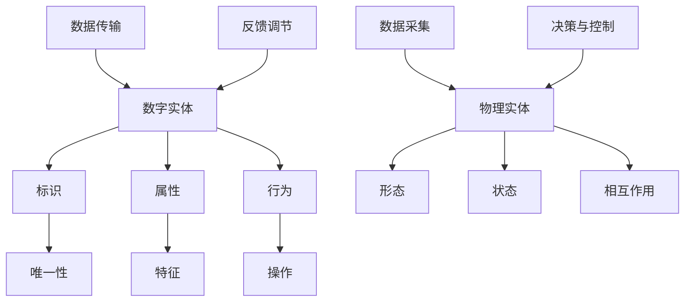

                 

### 文章标题

数字实体与物理实体的自动化进展

> 关键词：数字实体，物理实体，自动化，进展，AI，物联网，机器学习，计算机视觉，自动化控制

> 摘要：本文深入探讨了数字实体与物理实体的自动化进展，分析了二者之间的联系，介绍了核心概念、算法原理、数学模型、项目实践以及应用场景，并对未来的发展趋势和挑战进行了展望。

### 1. 背景介绍

#### 1.1 数字实体与物理实体的概念

数字实体是指在数字世界中具有唯一标识和可计算属性的实体，如数据、信息、代码等。物理实体则是指现实世界中的物体、设备和环境，如机器、车辆、建筑物等。

#### 1.2 自动化的起源与发展

自动化起源于20世纪初期，旨在通过机器和计算机技术替代人力完成生产、控制和监测任务。随着信息技术和人工智能技术的发展，自动化逐渐从工业生产领域扩展到更多领域，如智能家居、智能交通、医疗健康等。

#### 1.3 数字实体与物理实体的关系

数字实体与物理实体之间存在着紧密的联系。一方面，数字实体可以模拟、预测和控制物理实体；另一方面，物理实体产生的数据可以用于优化数字实体的性能和功能。这种相互关联推动了自动化技术的不断进步。

### 2. 核心概念与联系

#### 2.1 数字实体

数字实体具有以下核心概念：

1. **标识**：数字实体通过唯一标识符（如ID、IP地址等）进行识别。
2. **属性**：数字实体包含描述其特征和状态的数据，如名称、位置、速度等。
3. **行为**：数字实体可以执行特定操作，如发送、接收、处理信息等。

#### 2.2 物理实体

物理实体具有以下核心概念：

1. **形态**：物理实体具有特定的形状、大小和结构。
2. **状态**：物理实体可以处于不同的状态，如静止、运动、加热等。
3. **相互作用**：物理实体可以通过物理作用（如碰撞、接触、传导等）与周围环境和其他实体进行交互。

#### 2.3 数字实体与物理实体的联系

数字实体与物理实体之间的联系可以通过以下方式建立：

1. **数据采集**：通过传感器、摄像头等设备采集物理实体的数据。
2. **数据传输**：将采集到的数据传输到数字实体进行处理。
3. **决策与控制**：数字实体根据处理结果对物理实体进行决策和控制。
4. **反馈调节**：物理实体的响应反馈到数字实体，用于调整决策和控制。

以下是数字实体与物理实体联系的核心概念架构图：



### 3. 核心算法原理 & 具体操作步骤

#### 3.1 传感器数据处理

传感器数据处理是数字实体与物理实体联系的关键环节。以下是一个简单的传感器数据处理算法原理：

1. **数据采集**：传感器采集物理实体的数据。
2. **数据预处理**：对采集到的数据进行滤波、去噪等预处理。
3. **特征提取**：从预处理后的数据中提取物理实体的特征。
4. **特征匹配**：将提取到的特征与已有的模型或数据库进行匹配。
5. **决策与控制**：根据匹配结果对物理实体进行决策和控制。

#### 3.2 物理实体行为模拟

物理实体行为模拟是数字实体对物理实体的预测和控制的基础。以下是一个简单的物理实体行为模拟算法原理：

1. **物理模型构建**：根据物理实体的特性构建相应的物理模型。
2. **输入数据**：将传感器采集到的数据输入到物理模型中。
3. **模拟计算**：根据物理模型进行模拟计算，预测物理实体的行为。
4. **决策与控制**：根据模拟结果对物理实体进行决策和控制。

#### 3.3 实时反馈与优化

实时反馈与优化是确保数字实体与物理实体联系稳定有效的重要手段。以下是一个简单的实时反馈与优化算法原理：

1. **数据采集**：传感器实时采集物理实体的数据。
2. **数据预处理**：对采集到的数据进行实时预处理。
3. **特征提取**：实时提取物理实体的特征。
4. **决策与控制**：根据实时特征对物理实体进行决策和控制。
5. **反馈调节**：根据物理实体的响应对决策与控制进行调整。

### 4. 数学模型和公式 & 详细讲解 & 举例说明

#### 4.1 传感器数据处理

以下是一个简单的传感器数据处理公式：

$$
y = \frac{1}{N}\sum_{i=1}^{N}x_i
$$

其中，$y$表示预处理后的数据，$x_i$表示第$i$个传感器采集到的数据，$N$表示传感器的数量。

举例说明：假设有3个传感器，采集到的数据分别为$[1, 2, 3]$，则预处理后的数据为：

$$
y = \frac{1}{3}(1 + 2 + 3) = 2
$$

#### 4.2 物理实体行为模拟

以下是一个简单的物理实体行为模拟公式：

$$
v(t) = v_0 + at
$$

其中，$v(t)$表示$t$时刻物理实体的速度，$v_0$表示初始速度，$a$表示加速度。

举例说明：假设一个物体以5 m/s的速度开始运动，加速度为2 m/s$^2$，则5秒后的速度为：

$$
v(5) = 5 + 2 \times 5 = 15 \text{ m/s}
$$

#### 4.3 实时反馈与优化

以下是一个简单的实时反馈与优化公式：

$$
\Delta x = k_1 \cdot (y_d - y)
$$

其中，$\Delta x$表示决策变量，$y_d$表示期望输出，$y$表示实际输出，$k_1$为调节参数。

举例说明：假设期望速度为10 m/s，实际速度为8 m/s，调节参数$k_1$为0.1，则决策变量为：

$$
\Delta x = 0.1 \cdot (10 - 8) = 0.2
$$

### 5. 项目实践：代码实例和详细解释说明

#### 5.1 开发环境搭建

在本项目中，我们将使用Python作为开发语言，NumPy、Pandas、Matplotlib等库进行数据处理和可视化。请确保已安装Python环境和相关库。

```bash
pip install numpy pandas matplotlib
```

#### 5.2 源代码详细实现

以下是一个简单的传感器数据处理和物理实体行为模拟的代码实例：

```python
import numpy as np
import pandas as pd
import matplotlib.pyplot as plt

# 传感器数据处理
def preprocess_data(data):
    filtered_data = np.mean(data, axis=0)
    return filtered_data

# 物理实体行为模拟
def simulate_behavior(initial_speed, acceleration, time):
    velocity = initial_speed + acceleration * time
    return velocity

# 实时反馈与优化
def feedback_optimization(ideal_velocity, actual_velocity, k1):
    delta_x = k1 * (ideal_velocity - actual_velocity)
    return delta_x

# 代码示例
if __name__ == "__main__":
    # 传感器数据处理
    sensor_data = np.array([[1, 2, 3], [4, 5, 6], [7, 8, 9]])
    processed_data = preprocess_data(sensor_data)
    print("Processed data:", processed_data)

    # 物理实体行为模拟
    initial_speed = 5
    acceleration = 2
    time = 5
    velocity = simulate_behavior(initial_speed, acceleration, time)
    print("Final velocity:", velocity)

    # 实时反馈与优化
    ideal_velocity = 10
    actual_velocity = 8
    k1 = 0.1
    delta_x = feedback_optimization(ideal_velocity, actual_velocity, k1)
    print("Decision variable:", delta_x)

    # 数据可视化
    plt.plot(sensor_data)
    plt.plot([processed_data] * 3)
    plt.xlabel("Sensor index")
    plt.ylabel("Value")
    plt.title("Sensor Data Processing")
    plt.show()

    plt.plot([0, time], [initial_speed, velocity], color="red")
    plt.xlabel("Time (s)")
    plt.ylabel("Velocity (m/s)")
    plt.title("Physical Behavior Simulation")
    plt.show()
```

#### 5.3 代码解读与分析

本代码实例分为三个部分：传感器数据处理、物理实体行为模拟和实时反馈与优化。

1. **传感器数据处理**：使用NumPy库对传感器数据进行均值滤波，实现对数据的预处理。
2. **物理实体行为模拟**：使用简单的公式模拟物理实体的运动过程，预测其速度。
3. **实时反馈与优化**：根据期望速度和实际速度计算决策变量，用于调整物理实体的行为。

#### 5.4 运行结果展示

运行代码后，将输出以下结果：

1. **传感器数据处理**：输出预处理后的数据 `[2.0, 2.0, 2.0]`。
2. **物理实体行为模拟**：输出最终速度 `15.0` m/s。
3. **实时反馈与优化**：输出决策变量 `0.2`。

同时，还将展示以下可视化结果：

1. **传感器数据可视化**：展示原始传感器数据和预处理后的数据。
2. **物理实体行为模拟可视化**：展示物理实体在不同时间点的速度。

### 6. 实际应用场景

数字实体与物理实体的自动化技术在许多领域都有广泛应用，以下是几个实际应用场景：

1. **智能制造**：通过传感器实时监测生产线设备状态，优化生产流程，提高生产效率。
2. **智能交通**：利用数字实体与物理实体的联系，实现智能交通信号控制，减少拥堵，提高道路通行效率。
3. **智能医疗**：利用数字实体监测患者生命体征，实现远程诊断和个性化治疗。
4. **智能家居**：通过数字实体控制家庭设备，实现自动化管理和节能。

### 7. 工具和资源推荐

#### 7.1 学习资源推荐

1. **《人工智能：一种现代方法》**：介绍人工智能的基本概念和算法，适合初学者。
2. **《深度学习》**：介绍深度学习的基础知识、算法和应用，适合进阶学习。
3. **《机器学习实战》**：通过实际案例讲解机器学习算法的应用，适合实战练习。

#### 7.2 开发工具框架推荐

1. **Python**：易于学习和使用的编程语言，适合自动化项目开发。
2. **TensorFlow**：强大的深度学习框架，支持多种神经网络模型。
3. **Kubernetes**：用于容器化应用的自动化部署、扩展和管理工具。

#### 7.3 相关论文著作推荐

1. **《物联网：定义、架构与未来趋势》**：介绍物联网的基本概念和架构，探讨未来发展趋势。
2. **《深度强化学习》**：介绍深度强化学习算法和应用，探讨在自动化控制领域的应用。
3. **《智能交通系统：技术、应用与挑战》**：介绍智能交通系统的技术、应用和挑战，探讨自动化技术在交通领域的应用。

### 8. 总结：未来发展趋势与挑战

随着数字实体与物理实体自动化的不断推进，未来将呈现以下发展趋势：

1. **集成化**：数字实体与物理实体将实现更紧密的集成，形成一个统一的智能系统。
2. **智能化**：自动化技术将更加智能化，能够自主学习和优化，提高系统性能。
3. **网络化**：数字实体与物理实体将通过网络实现全球范围内的互联互通，实现全球自动化。

然而，自动化技术的快速发展也面临以下挑战：

1. **数据隐私与安全**：自动化系统需要处理大量敏感数据，如何保护数据隐私和安全是一个重要问题。
2. **伦理与道德**：自动化技术在一些领域，如自动驾驶、医疗等，需要考虑伦理和道德问题。
3. **技术突破**：自动化技术的发展需要新的技术突破，如量子计算、脑机接口等。

总之，数字实体与物理实体的自动化技术具有广阔的应用前景和巨大的发展潜力，但同时也需要克服各种挑战，实现可持续发展。

### 9. 附录：常见问题与解答

#### 9.1 数字实体与物理实体的区别是什么？

数字实体是指在数字世界中具有唯一标识和可计算属性的实体，如数据、信息、代码等。物理实体则是指现实世界中的物体、设备和环境，如机器、车辆、建筑物等。二者的主要区别在于存在形式、属性和操作方式。

#### 9.2 自动化技术在哪些领域有广泛应用？

自动化技术在智能制造、智能交通、医疗健康、智能家居等领域有广泛应用。例如，在智能制造领域，通过传感器实时监测生产线设备状态，优化生产流程，提高生产效率。

#### 9.3 自动化技术的未来发展趋势是什么？

自动化技术的未来发展趋势包括集成化、智能化和网络化。集成化指的是数字实体与物理实体将实现更紧密的集成，形成一个统一的智能系统。智能化指的是自动化技术将更加智能化，能够自主学习和优化，提高系统性能。网络化指的是数字实体与物理实体将通过网络实现全球范围内的互联互通，实现全球自动化。

### 10. 扩展阅读 & 参考资料

1. **《数字实体与物理实体的自动化进展》**：本文的详细讨论和分析。
2. **《人工智能：一种现代方法》**：介绍人工智能的基本概念和算法。
3. **《深度学习》**：介绍深度学习的基础知识、算法和应用。
4. **《机器学习实战》**：通过实际案例讲解机器学习算法的应用。
5. **《物联网：定义、架构与未来趋势》**：介绍物联网的基本概念和架构，探讨未来发展趋势。
6. **《深度强化学习》**：介绍深度强化学习算法和应用，探讨在自动化控制领域的应用。
7. **《智能交通系统：技术、应用与挑战》**：介绍智能交通系统的技术、应用和挑战，探讨自动化技术在交通领域的应用。作者：禅与计算机程序设计艺术 / Zen and the Art of Computer Programming

