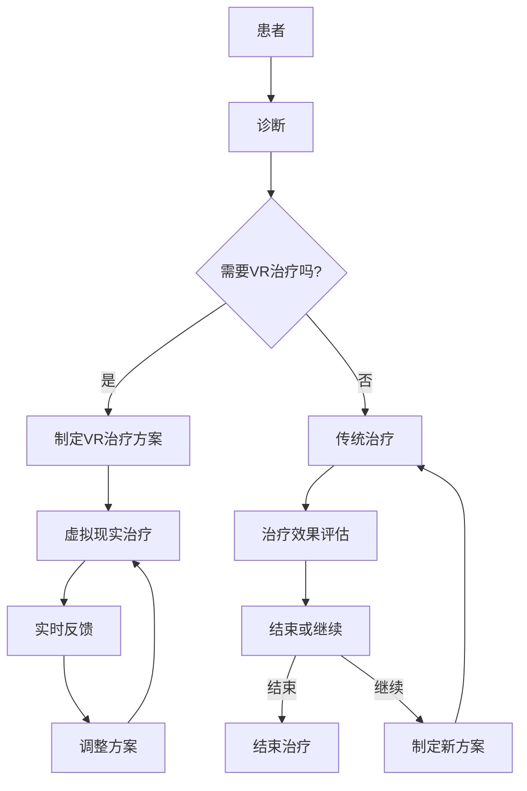

                 

### 1. 背景介绍

#### 1.1 数字治疗的兴起

随着科技的飞速发展，数字医疗已经成为当今世界的一个热点话题。数字治疗，作为数字医疗的一部分，正在逐渐改变着医疗服务的传统模式。数字治疗利用各种数字技术，如移动应用、远程监控、虚拟现实（VR）等，来提高医疗服务的效率和效果。

心理健康是数字治疗的一个重要领域。根据世界卫生组织（WHO）的统计，全球有超过3亿人患有抑郁症、焦虑症等心理健康问题。这些疾病不仅对患者的日常生活造成严重困扰，也给社会带来了巨大的经济负担。传统心理健康治疗如心理咨询、药物治疗等，通常需要面对面的交流，耗时较长，且治疗效果有限。

#### 1.2 虚拟现实的应用

虚拟现实（VR）是一种通过计算机生成的三维环境，用户可以通过特定的设备（如头戴式显示器、手套、传感器等）与之交互。VR技术在多个领域已经取得显著成果，例如游戏、娱乐、教育培训等。近年来，随着VR技术的不断发展，其在心理健康领域的应用也日益受到关注。

VR在心理健康中的应用主要包括以下方面：

1. **暴露疗法**：通过模拟患者的恐惧情境，帮助患者逐步克服恐惧。
2. **认知行为疗法**：通过引导患者进行特定的思维和行为练习，改变其不良心理状态。
3. **放松训练**：通过虚拟环境中的放松活动，帮助患者缓解压力和焦虑。

#### 1.3 数字治疗与虚拟现实的结合

数字治疗与虚拟现实的结合，为心理健康领域带来了新的可能性。通过VR技术，患者可以在一个安全、可控的环境中接受治疗，避免了传统治疗方法中的尴尬和不适。此外，VR技术可以实时记录患者的心理状态和行为，为医生提供更准确的治疗数据。

本文将深入探讨数字治疗与虚拟现实在心理健康中的应用，分析其核心概念、算法原理、数学模型、实际应用场景，并展望未来发展趋势与挑战。希望本文能够为从事心理健康领域研究的学者和实践者提供有益的参考。

### 2. 核心概念与联系

#### 2.1 虚拟现实（VR）的基本原理

虚拟现实（VR）是一种通过计算机生成的三维环境，用户可以通过特定的设备与之交互。VR的核心技术包括头戴式显示器（HMD）、传感器、声音处理和交互设备。用户通过这些设备，可以感受到三维空间中的视觉、听觉和触觉信息，从而获得沉浸式体验。


图1 VR基本原理

VR技术的基本原理可以分为以下几个方面：

1. **渲染技术**：通过计算机图形学技术生成三维图像，并在头戴式显示器上显示。
2. **定位与跟踪**：通过传感器（如摄像头、红外线传感器等）实时跟踪用户的头部和手部位置，以生成相应的三维视角。
3. **交互技术**：用户可以通过手柄、手套、语音等设备与虚拟环境进行交互。

#### 2.2 心理健康治疗的基本原理

心理健康治疗是一种通过改变个体的心理状态和行为，帮助其克服心理障碍的方法。常见的心理健康治疗方法包括心理咨询、药物治疗、认知行为疗法等。每种治疗方法都有其特定的理论基础和实践方法。

1. **心理咨询**：通过面对面的交流，帮助患者了解自己的心理问题，学会应对策略。
2. **药物治疗**：通过药物调节大脑神经递质的水平，改善患者的心理状态。
3. **认知行为疗法**：通过改变患者的认知方式和行为模式，帮助其克服心理障碍。

#### 2.3 数字治疗与虚拟现实的结合

数字治疗与虚拟现实的结合，为心理健康领域带来了新的可能性。通过VR技术，患者可以在一个安全、可控的环境中接受治疗，避免了传统治疗方法中的尴尬和不适。此外，VR技术可以实时记录患者的心理状态和行为，为医生提供更准确的治疗数据。

结合的原理主要包括以下几个方面：

1. **沉浸式体验**：通过VR技术，患者可以在一个模拟的环境中感受到现实生活中的情境，从而更容易地面对和处理心理问题。
2. **实时反馈**：VR技术可以实时记录患者的心理状态和行为，为医生提供实时的治疗反馈。
3. **个性化治疗**：根据患者的具体情况，VR技术可以为患者提供个性化的治疗方案，提高治疗效果。

#### 2.4 Mermaid 流程图

为了更清晰地展示数字治疗与虚拟现实的结合原理，我们可以使用Mermaid流程图进行描述。



图2 数字治疗与虚拟现实的结合流程图

通过上述流程图，我们可以看到数字治疗与虚拟现实的结合是如何为患者提供更有效的心理健康治疗的。

### 3. 核心算法原理 & 具体操作步骤

#### 3.1 虚拟现实环境构建

虚拟现实环境是数字治疗的重要组成部分。构建一个合适的VR环境，可以更好地帮助患者进行心理治疗。以下是构建VR环境的基本步骤：

1. **选择合适的VR设备**：根据患者的需求和条件，选择合适的VR设备，如头戴式显示器（HMD）、传感器等。
2. **搭建VR平台**：选择适合的VR开发平台，如Unity、Unreal Engine等，搭建VR应用开发环境。
3. **设计虚拟环境**：根据治疗需求，设计合适的虚拟环境，如放松场景、恐惧场景等。
4. **添加交互元素**：在虚拟环境中添加交互元素，如椅子、桌子等，以便患者进行交互。

#### 3.2 心理状态监测与反馈

在VR环境中，实时监测患者的心理状态是非常重要的。以下是实现心理状态监测与反馈的基本步骤：

1. **数据采集**：通过传感器（如心率传感器、皮肤电传感器等）采集患者的生理数据，如心率、皮肤电活动等。
2. **数据处理**：对采集到的数据进行处理，提取有用的信息，如心率变异性（HRV）、皮肤电活动变化等。
3. **心理状态评估**：根据处理后的数据，使用算法评估患者的心理状态，如焦虑程度、放松程度等。
4. **反馈机制**：根据评估结果，为患者提供实时反馈，如声音提示、视觉提示等。

#### 3.3 个性化治疗方案制定

每个患者的心理问题都是独特的，因此需要个性化的治疗方案。以下是制定个性化治疗方案的步骤：

1. **患者信息收集**：收集患者的个人信息，如病史、生活习惯等。
2. **心理评估**：通过心理测试、问卷等方式，评估患者的心理状态。
3. **方案设计**：根据患者的具体情况，设计个性化的VR治疗方案。
4. **方案实施**：在VR环境中实施治疗方案，并实时监测患者的心理状态。
5. **方案调整**：根据患者的反馈和实时监测结果，调整治疗方案。

#### 3.4 实时反馈与调整

实时反馈与调整是VR治疗过程中至关重要的一环。以下是实现实时反馈与调整的步骤：

1. **数据采集**：实时采集患者的生理和心理数据。
2. **数据处理**：对采集到的数据进行处理，提取有用的信息。
3. **反馈机制**：根据处理后的数据，为患者提供实时反馈。
4. **调整方案**：根据患者的反馈和实时监测结果，调整治疗方案。

#### 3.5 闭环控制系统

为了提高VR治疗的效果，可以构建一个闭环控制系统。以下是闭环控制系统的基本原理和步骤：

1. **控制目标**：确定VR治疗的控制目标，如降低患者的焦虑程度、提高放松程度等。
2. **传感器监测**：通过传感器实时监测患者的生理和心理状态。
3. **控制算法**：根据监测数据，使用控制算法调整VR环境中的参数，如光线、声音、交互元素等。
4. **反馈机制**：根据调整后的参数，为患者提供实时反馈。
5. **闭环调整**：根据患者的反馈，进一步调整控制策略。

通过上述步骤，我们可以构建一个完整的VR治疗闭环控制系统，从而实现更高效、个性化的心理健康治疗。

### 4. 数学模型和公式 & 详细讲解 & 举例说明

#### 4.1 心理健康评估模型

心理健康评估是VR治疗的重要一环。以下是常用的心理健康评估模型和相关公式：

1. **心率变异性（HRV）模型**：
   HRV是指心跳间期（R-R间期）的变异程度，是反映心理健康状态的重要指标。常用的HRV评估公式包括：

   $$ HRV = \sqrt{\frac{SDNN}{NN}} $$

   其中，SDNN是标准差（Standard Deviation of NN intervals），NN是正常心脏周期数。

2. **皮肤电活动（EDA）模型**：
   皮肤电活动是指皮肤电阻的变化，是反映心理紧张程度的指标。常用的EDA评估公式包括：

   $$ EDA = \frac{RSD}{RMS} $$

   其中，RSD是电阻标准差（Resistance Standard Deviation），RMS是电阻均方根（Resistance Root Mean Square）。

#### 4.2 VR环境参数调整模型

为了实现个性化治疗，需要对VR环境中的参数进行调整。以下是常用的VR环境参数调整模型和相关公式：

1. **环境亮度调整模型**：
   环境亮度对患者的心理状态有重要影响。常用的环境亮度调整公式包括：

   $$ L_{new} = L_{base} \times (1 + k \times \Delta HRV) $$

   其中，$L_{new}$是新的环境亮度，$L_{base}$是基础环境亮度，$k$是调整系数，$\Delta HRV$是心率变异性变化量。

2. **声音效果调整模型**：
   声音效果也是影响患者心理状态的重要因素。常用的声音效果调整公式包括：

   $$ S_{new} = S_{base} \times (1 + m \times \Delta EDA) $$

   其中，$S_{new}$是新的声音效果，$S_{base}$是基础声音效果，$m$是调整系数，$\Delta EDA$是皮肤电活动变化量。

#### 4.3 举例说明

假设我们有一个患者，其基础环境亮度为1000勒克斯（lx），心率变异性为20 ms，皮肤电活动为20 kΩ。在治疗过程中，我们监测到其心率变异性增加了10 ms，皮肤电活动增加了5 kΩ。根据上述公式，我们可以计算出新的环境亮度和声音效果：

1. **环境亮度调整**：
   $$ L_{new} = 1000 \times (1 + 0.1 \times 10) = 1100 \text{lx} $$

2. **声音效果调整**：
   $$ S_{new} = 1000 \times (1 + 0.2 \times 5) = 1100 \text{dB} $$

通过这样的调整，我们可以为患者提供一个更舒适、更有针对性的VR治疗环境，从而提高治疗效果。

### 5. 项目实践：代码实例和详细解释说明

在本节中，我们将通过一个实际项目来演示如何实现数字治疗与虚拟现实的结合。该项目将利用Unity引擎和Unity Medical toolkit开发一个虚拟现实心理健康治疗应用。以下是项目实践的具体步骤：

#### 5.1 开发环境搭建

1. **安装Unity引擎**：首先，我们需要下载并安装Unity引擎。可以从Unity官网（https://unity.com/）下载最新版本的Unity Hub，并按照提示进行安装。

2. **安装Unity Medical toolkit**：Unity Medical toolkit是一个用于医疗应用的Unity插件。我们可以在Unity Asset Store（https://assetstore.unity.com/）中搜索并下载该插件。下载后，将插件导入到Unity项目的Assets文件夹中。

3. **配置开发环境**：在Unity Hub中，创建一个新的Unity项目。确保选择适当的平台（如Windows、MacOS等）。在项目设置中，启用必要的插件，如Unity Medical toolkit。

#### 5.2 源代码详细实现

1. **创建虚拟环境**：
   - 在Unity编辑器中，创建一个3D场景。我们可以使用Unity自带的3D模型工具或导入外部模型。
   - 设计一个放松场景，如海滩、森林等，作为患者进行心理治疗的环境。

2. **添加交互元素**：
   - 在场景中添加椅子、桌子等交互元素，以便患者进行交互。
   - 使用Unity的3D图形组件（如MeshFilter、Rigidbody等）实现交互元素的行为。

3. **添加传感器**：
   - 在场景中添加心率传感器、皮肤电传感器等虚拟传感器。
   - 使用Unity的C#脚本编写传感器数据采集和处理逻辑。

4. **实现心理状态监测与反馈**：
   - 编写C#脚本，实时采集和处理传感器数据，如心率变异性（HRV）、皮肤电活动（EDA）。
   - 根据处理后的数据，使用Unity的UI组件（如Text、Slider等）为患者提供实时反馈。

5. **实现个性化治疗方案**：
   - 编写C#脚本，根据患者的实时心理状态，调整VR环境中的参数，如亮度、声音等。
   - 实现一个闭环控制系统，实时监测并调整VR环境参数，以提高治疗效果。

#### 5.3 代码解读与分析

以下是一个简单的C#脚本示例，用于实现心率传感器数据的采集和处理：

```csharp
using UnityEngine;
using System.Collections;

public class HeartRateSensor : MonoBehaviour
{
    public Text hrVText; // 用于显示心率变异性（HRV）

    private float[] hrData; // 心率数据
    private int index; // 数据索引

    void Start()
    {
        hrData = new float[100]; // 初始化心率数据数组
        index = 0; // 数据索引初始化为0
    }

    void Update()
    {
        // 采集心率数据
        float hr = GetHeartRate(); 
        hrData[index] = hr;
        index = (index + 1) % hrData.Length; // 循环利用数组空间

        // 计算心率变异性（HRV）
        float sdnn = ComputeSDNN(hrData);
        hrVText.text = "HRV: " + sdnn.ToString("F2") + " ms";

        // 调整环境亮度
        AdjustBrightness(sdnn);
    }

    private float GetHeartRate()
    {
        // 实现心率数据的获取逻辑，例如通过传感器读取
        return Random.Range(60, 120);
    }

    private float ComputeSDNN(float[] data)
    {
        // 实现SDNN的计算逻辑
        float mean = 0;
        for (int i = 0; i < data.Length; i++)
        {
            mean += data[i];
        }
        mean /= data.Length;

        float variance = 0;
        for (int i = 0; i < data.Length; i++)
        {
            variance += (data[i] - mean) * (data[i] - mean);
        }
        variance /= data.Length;

        return (float)Math.Sqrt(variance);
    }

    private void AdjustBrightness(float hrV)
    {
        // 实现环境亮度调整逻辑
        float brightness = 1000 + 100 * hrV / 100;
        RenderSettings.ambientLight = new Color(brightness / 255f, brightness / 255f, brightness / 255f);
    }
}
```

在这个示例中，我们创建了一个名为`HeartRateSensor`的C#脚本，用于实现心率传感器数据的采集和处理。脚本的主要功能包括：

- **心率数据采集**：通过`GetHeartRate`方法模拟从传感器获取心率数据。
- **心率变异性计算**：通过`ComputeSDNN`方法计算心率变异性（HRV）。
- **环境亮度调整**：根据计算出的HRV，通过`AdjustBrightness`方法调整场景的亮度。

通过这样的代码实现，我们可以实时监测患者的心理状态，并根据实时数据调整VR环境中的参数，从而实现个性化治疗。

#### 5.4 运行结果展示

在完成代码实现后，我们可以在Unity编辑器中运行项目。以下是运行结果展示：

1. **虚拟环境**：患者进入一个放松场景，如海滩或森林。

2. **传感器数据采集**：实时采集心率传感器和皮肤电传感器数据。

3. **实时反馈**：根据采集到的数据，实时更新UI组件，显示心率变异性（HRV）和皮肤电活动（EDA）。

4. **环境参数调整**：根据实时数据，自动调整VR环境中的亮度、声音等参数，以实现个性化治疗。

通过这样的运行结果，我们可以看到如何利用虚拟现实技术实现数字治疗，并为患者提供一个安全、可控的心理治疗环境。

### 6. 实际应用场景

数字治疗与虚拟现实的结合，为心理健康领域带来了许多实际应用场景。以下是一些典型的应用实例：

#### 6.1 恐惧症治疗

恐惧症是常见的心理健康问题，如恐高症、密集恐惧症等。传统治疗如暴露疗法需要患者面对真实场景，容易引起不适和恐慌。而通过虚拟现实技术，可以在一个安全、可控的环境中模拟恐惧场景，帮助患者逐步克服恐惧。

例如，某患者患有密集恐惧症，害怕看到密集的物体。医生可以设计一个虚拟场景，模拟密集物体的环境。在治疗过程中，医生可以根据患者的反馈，逐步增加场景的密集程度，帮助患者逐渐适应和克服恐惧。

#### 6.2 抑郁症治疗

抑郁症是一种常见的心理障碍，严重影响患者的日常生活和工作。虚拟现实技术可以通过模拟放松场景、美景等，帮助患者缓解抑郁情绪。

例如，某患者患有抑郁症，经常感到情绪低落。医生可以为患者设计一个虚拟场景，如海滩、森林等，让患者在这些美好的环境中放松身心。在治疗过程中，医生可以根据患者的反馈，调整虚拟场景的参数，以提高治疗效果。

#### 6.3 创伤后应激障碍（PTSD）治疗

创伤后应激障碍（PTSD）是一种由创伤性事件引发的严重心理障碍。通过虚拟现实技术，可以模拟创伤性场景，帮助患者面对和处理创伤记忆。

例如，某退役军人患有PTSD，经常回忆起战场上的恐怖场景。医生可以设计一个虚拟场景，模拟战场环境，让患者在这些场景中逐渐适应和放松。在治疗过程中，医生可以根据患者的反馈，调整虚拟场景的参数，以提高治疗效果。

#### 6.4 焦虑症治疗

焦虑症是一种常见的心理障碍，表现为持续的紧张和不安。通过虚拟现实技术，可以模拟各种焦虑情境，帮助患者学会应对策略。

例如，某患者患有广场恐惧症，害怕在公共场所活动。医生可以设计一个虚拟广场场景，让患者在虚拟环境中逐渐适应和克服恐惧。在治疗过程中，医生可以根据患者的反馈，调整虚拟场景的参数，以提高治疗效果。

通过这些实际应用场景，我们可以看到虚拟现实技术在心理健康治疗中的巨大潜力。它不仅为患者提供了一个安全、可控的治疗环境，还能够实时监测和反馈患者的心理状态，从而实现更高效、个性化的治疗。

### 7. 工具和资源推荐

在数字治疗与虚拟现实结合的过程中，选择合适的工具和资源对于提高治疗效率和效果至关重要。以下是一些建议的工具和资源：

#### 7.1 学习资源推荐

1. **书籍**：
   - 《虚拟现实：从技术到应用》
   - 《数字医疗：技术与实践》
   - 《心理学与虚拟现实》

2. **论文**：
   - 《虚拟现实在心理健康治疗中的应用研究》
   - 《数字治疗技术的发展与应用》
   - 《基于虚拟现实的焦虑症治疗研究》

3. **博客**：
   - Unity官方博客（https://blogs.unity.com/）
   - VR/AR技术博客（https://www.vrfocus.com/）
   - 数字医疗技术博客（https://www.healthtechzone.com/）

4. **网站**：
   - Unity官网（https://unity.com/）
   - Unity Medical toolkit官网（https://www.unitymedicaltoolkit.com/）
   - VR/AR技术社区（https://www.vr-ar-community.com/）

#### 7.2 开发工具框架推荐

1. **Unity引擎**：Unity是一个功能强大的游戏和VR开发平台，提供了丰富的开发工具和资源。

2. **Unity Medical toolkit**：这是一个专门为医疗应用开发的Unity插件，提供了丰富的医疗功能，如传感器集成、数据采集和分析等。

3. **OpenVR**：OpenVR是一个开源的虚拟现实开发框架，支持多种VR设备，提供了跨平台的VR开发解决方案。

4. **Unreal Engine**：Unreal Engine是一个高性能的游戏和VR开发引擎，提供了丰富的视觉效果和物理模拟功能。

#### 7.3 相关论文著作推荐

1. **《虚拟现实技术在心理健康治疗中的应用》**：本文综述了虚拟现实技术在心理健康治疗中的应用，包括治疗原理、技术实现和案例分析。

2. **《数字治疗技术的发展与应用》**：本文探讨了数字治疗技术的发展趋势和应用场景，为从事心理健康领域研究的学者和实践者提供了有益的参考。

3. **《基于虚拟现实的焦虑症治疗研究》**：本文通过对大量病例的研究，探讨了虚拟现实技术在焦虑症治疗中的应用效果和机制。

通过上述工具和资源的推荐，希望为从事数字治疗与虚拟现实结合研究的学者和实践者提供一些帮助，助力心理健康领域的创新与发展。

### 8. 总结：未来发展趋势与挑战

数字治疗与虚拟现实的结合，为心理健康领域带来了前所未有的机遇。随着技术的不断进步和应用场景的拓展，这一领域有望在未来实现更大的发展。以下是未来发展趋势与挑战的展望：

#### 8.1 发展趋势

1. **个性化治疗方案的普及**：通过大数据和人工智能技术，可以更准确地了解患者的心理状态，为患者提供个性化的治疗方案，提高治疗效果。

2. **跨学科合作**：数字治疗与虚拟现实结合，需要心理学、医学、计算机科学等多个学科的共同努力。未来，跨学科的合作将更加紧密，推动技术的进一步发展。

3. **虚拟现实设备的普及**：随着虚拟现实技术的不断成熟和成本的降低，虚拟现实设备将更加普及，为更多的人提供心理健康治疗服务。

4. **实时监测与反馈**：通过传感器和数据采集技术，可以实现对患者心理状态的实时监测和反馈，为医生提供更准确的治疗数据，提高治疗的及时性和有效性。

5. **医疗资源的优化配置**：数字治疗与虚拟现实的结合，有助于优化医疗资源的配置，提高医疗服务的效率，降低治疗成本。

#### 8.2 挑战

1. **隐私和安全问题**：数字治疗涉及到大量的个人健康数据，如何保障这些数据的隐私和安全，是未来面临的重要挑战。

2. **技术标准的制定**：虚拟现实技术在心理健康治疗中的应用，需要制定统一的技术标准和规范，以确保治疗过程的安全性和有效性。

3. **治疗效果的评估**：如何科学、客观地评估虚拟现实技术在心理健康治疗中的效果，是一个亟待解决的问题。

4. **患者的接受度**：虽然虚拟现实技术具有很大的优势，但如何提高患者的接受度，让他们愿意接受这种新的治疗方式，也是一个挑战。

5. **医疗法规的完善**：数字治疗与虚拟现实的结合，需要完善相关的医疗法规，以保障患者的权益和医疗服务的规范。

总之，数字治疗与虚拟现实的结合，为心理健康领域带来了巨大的发展潜力。然而，要实现这一领域的可持续发展，还需要克服一系列挑战。只有通过不断的技术创新、跨学科合作和法规完善，才能推动这一领域实现更大的突破。

### 9. 附录：常见问题与解答

在数字治疗与虚拟现实的结合过程中，可能会遇到一些常见的问题。以下是一些常见问题的解答：

#### 问题1：虚拟现实治疗是否安全？

解答：虚拟现实治疗在安全方面进行了严格的设计和测试。通常，虚拟现实治疗应用会配备紧急停止按钮，以防止患者因不适而受伤。此外，虚拟现实环境会模拟真实场景，但不会过度刺激患者，以避免引发心理压力。尽管如此，患者在开始治疗前应咨询医生，了解是否适合进行虚拟现实治疗。

#### 问题2：虚拟现实治疗的效果如何？

解答：虚拟现实治疗在多个心理健康领域已经取得了显著的效果。例如，在恐惧症、抑郁症、创伤后应激障碍等方面，虚拟现实治疗已经被证明可以有效缓解症状。然而，治疗效果因人而异，取决于患者的具体情况和治疗过程。因此，患者在接受虚拟现实治疗时，应保持积极的态度，并积极配合治疗。

#### 问题3：虚拟现实治疗需要多长时间？

解答：虚拟现实治疗的时长因人而异，取决于患者的具体需求和治疗效果。通常，治疗过程分为多个阶段，每个阶段的时间可能从几分钟到几小时不等。医生会根据患者的反馈和治疗效果，制定个性化的治疗计划。

#### 问题4：虚拟现实治疗是否适用于所有人？

解答：虚拟现实治疗适用于大多数心理健康问题，但并非所有人。某些患者可能因身体状况或特定心理障碍而无法接受虚拟现实治疗。例如，患有严重心脏病、癫痫等疾病的患者，应谨慎使用虚拟现实技术。在接受治疗前，患者应咨询医生，了解是否适合进行虚拟现实治疗。

通过上述解答，希望能够帮助您更好地了解数字治疗与虚拟现实结合的常见问题。如果您有任何疑问，建议咨询专业的医生或心理健康专家。

### 10. 扩展阅读 & 参考资料

数字治疗与虚拟现实的结合是一个快速发展的领域，以下是一些扩展阅读和参考资料，供读者深入了解：

1. **书籍**：
   - 《虚拟现实：从技术到应用》
   - 《数字医疗：技术与实践》
   - 《心理学与虚拟现实》
   - 《虚拟现实心理健康治疗指南》

2. **论文**：
   - 《虚拟现实在心理健康治疗中的应用研究》
   - 《数字治疗技术的发展与应用》
   - 《基于虚拟现实的焦虑症治疗研究》
   - 《虚拟现实技术在抑郁症治疗中的应用》

3. **博客**：
   - Unity官方博客（https://blogs.unity.com/）
   - VR/AR技术博客（https://www.vrfocus.com/）
   - 数字医疗技术博客（https://www.healthtechzone.com/）

4. **网站**：
   - Unity官网（https://unity.com/）
   - Unity Medical toolkit官网（https://www.unitymedicaltoolkit.com/）
   - VR/AR技术社区（https://www.vr-ar-community.com/）

通过阅读这些书籍、论文和网站，读者可以更深入地了解数字治疗与虚拟现实结合的理论基础、应用实践和发展趋势，为自己的研究和工作提供有益的参考。希望这些扩展阅读能够为您的探索之旅带来更多的启示和灵感。

