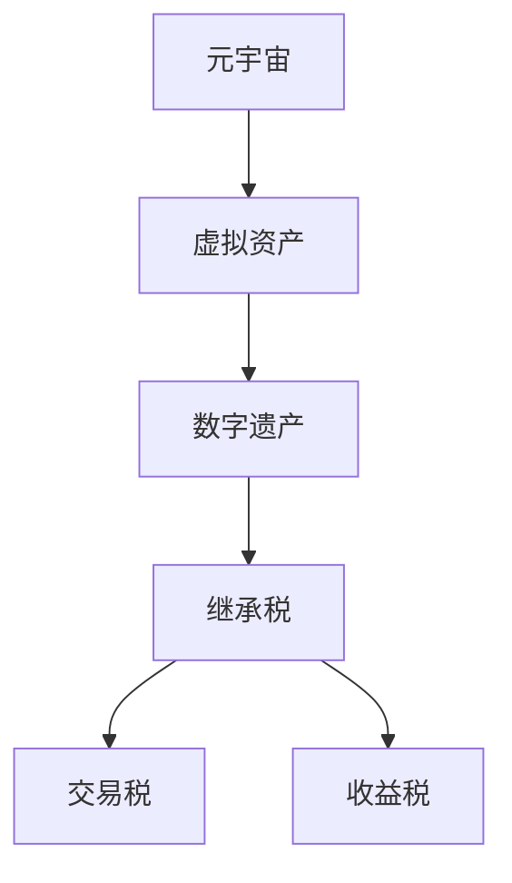

                 

关键词：数字遗产税率、元宇宙、虚拟资产、继承、税收政策、人工智能、计算机编程

> 摘要：本文探讨了元宇宙中虚拟资产的继承税收问题。随着虚拟经济的兴起，数字遗产的继承税率成为一个备受关注的话题。本文首先介绍了元宇宙和虚拟资产的基本概念，随后详细分析了现有继承税率的法律法规，探讨了其适用性和不足。在此基础上，提出了基于人工智能技术的创新性数字遗产税率政策，旨在为元宇宙中的虚拟资产继承提供公平、合理的税收框架。

## 1. 背景介绍

随着科技的飞速发展，虚拟世界——元宇宙逐渐成为人们关注的新焦点。元宇宙不仅是一个虚拟的空间，它融合了虚拟现实、增强现实、区块链等多种技术，为用户提供了沉浸式、交互性的体验。在元宇宙中，虚拟资产作为一种新兴的财产形式，正在不断崛起。

虚拟资产指的是在虚拟世界中存在的、具有经济价值的物品，包括虚拟货币、虚拟土地、虚拟物品等。这些资产不仅具有经济价值，还承载了用户的情感价值和社会价值。随着越来越多的用户进入元宇宙，虚拟资产的价值也在不断攀升。

然而，随着虚拟资产的重要性日益增加，如何对虚拟资产进行继承成为一个亟待解决的问题。现有的法律体系尚未完全适应这一新形势，尤其是在税收政策方面。数字遗产税率的设定不仅关系到虚拟资产所有者的利益，还直接影响到元宇宙的健康发展。

本文旨在探讨元宇宙中的数字遗产税率问题，分析现有法律框架的适用性和不足，并提出一种创新的税收政策，以期为元宇宙中的虚拟资产继承提供公平、合理的税收框架。

## 2. 核心概念与联系

### 2.1. 元宇宙的基本概念

元宇宙（Metaverse）是一个虚拟的、三维的、沉浸式网络空间，它通过虚拟现实（VR）和增强现实（AR）技术，将物理世界和数字世界结合起来。元宇宙不仅包括虚拟的社交平台、游戏、虚拟购物体验，还包括各种虚拟经济活动。

在元宇宙中，用户可以通过虚拟角色（Avatar）进行互动，这些角色不仅具有独特的形象，还可以拥有虚拟资产。虚拟资产是元宇宙的核心组成部分，它包括虚拟货币、虚拟土地、虚拟物品等。

### 2.2. 虚拟资产的概念

虚拟资产是指在虚拟世界中存在的、具有经济价值的物品。虚拟资产具有以下特点：

- **独特性**：每个虚拟资产都有其独特性，例如虚拟土地的位置、虚拟物品的稀有度。
- **稀缺性**：某些虚拟资产由于制作难度大或需求大，其数量可能非常有限。
- **交易性**：虚拟资产可以在虚拟市场进行买卖交易，具有一定的市场价格。
- **可继承性**：虚拟资产可以像现实世界的财产一样进行继承。

### 2.3. 数字遗产与继承税

数字遗产指的是用户在虚拟世界中留下的虚拟资产。随着虚拟资产价值的增加，数字遗产的继承问题越来越受到关注。然而，现有法律体系在处理数字遗产继承时存在一些问题，特别是在税收政策方面。

继承税是一种对遗产继承过程中转移的财产价值征收的税。传统继承税主要针对现实世界的财产，如房产、现金、股票等。然而，虚拟资产作为新兴的财产形式，其继承税政策尚未完全明确。

### 2.4. 元宇宙中的税收问题

在元宇宙中，虚拟资产的交易和继承涉及多个方面的税收问题：

- **交易税**：虚拟资产在交易过程中可能需要缴纳交易税。
- **收益税**：虚拟资产的收益，如投资收益、出租收益等，可能需要缴纳收益税。
- **继承税**：数字遗产的继承可能需要缴纳继承税。

这些税收问题不仅关系到虚拟资产所有者的利益，还直接影响到元宇宙的健康发展。因此，制定合理的税收政策至关重要。

## 2.5. 关键概念原理和架构的 Mermaid 流程图



## 3. 核心算法原理 & 具体操作步骤

### 3.1. 算法原理概述

本文提出的核心算法是一种基于人工智能的数字遗产税率计算模型。该模型旨在通过分析虚拟资产的价值、所有者的经济状况以及市场动态，制定出公平、合理的数字遗产税率。

算法的基本原理包括：

- **价值评估**：通过机器学习算法对虚拟资产的价值进行科学评估。
- **经济状况分析**：分析虚拟资产所有者的经济状况，包括收入、财产等。
- **市场动态监测**：实时监测虚拟资产市场的动态，确保税率制定的科学性和实时性。

### 3.2. 算法步骤详解

#### 3.2.1. 数据收集与预处理

1. **数据收集**：收集虚拟资产的所有相关信息，包括资产类型、购买价格、市场价值等。
2. **数据预处理**：对收集的数据进行清洗和归一化处理，以便后续分析。

#### 3.2.2. 价值评估

1. **模型训练**：使用历史数据训练机器学习模型，如线性回归、决策树等，以预测虚拟资产的价值。
2. **价值预测**：使用训练好的模型对新的虚拟资产进行价值预测。

#### 3.2.3. 经济状况分析

1. **数据收集**：收集虚拟资产所有者的经济状况信息，包括收入、财产等。
2. **经济状况评估**：使用聚类算法对所有者进行分类，以确定其经济状况。

#### 3.2.4. 市场动态监测

1. **数据收集**：实时收集虚拟资产市场的交易数据、价格波动等。
2. **动态分析**：使用统计分析方法分析市场动态，为税率制定提供参考。

#### 3.2.5. 税率计算

1. **综合评估**：将虚拟资产的价值、所有者的经济状况和市场动态综合考虑。
2. **税率计算**：根据综合评估结果，制定出合理的数字遗产税率。

### 3.3. 算法优缺点

#### 优点：

- **科学性**：通过机器学习和数据分析，确保税率制定的科学性。
- **实时性**：实时监测市场动态，确保税率的实时性和适应性。
- **公平性**：综合考虑虚拟资产的价值和所有者的经济状况，确保税率的公平性。

#### 缺点：

- **复杂性**：算法涉及多个方面，包括机器学习、数据分析等，实施难度较大。
- **数据依赖**：算法的准确性和可靠性高度依赖数据的质量和完整性。

### 3.4. 算法应用领域

该算法不仅可以应用于元宇宙中的数字遗产税率计算，还可以广泛应用于其他虚拟资产税收领域，如虚拟货币、虚拟土地等。此外，该算法还可以为其他领域提供参考，如智能合约的税收管理、虚拟财产交易监管等。

## 4. 数学模型和公式 & 详细讲解 & 举例说明

### 4.1. 数学模型构建

为了计算数字遗产税率，我们首先需要构建一个数学模型。该模型将基于以下三个关键参数：

- **虚拟资产价值 (V)**：虚拟资产的市场价值。
- **所有者经济状况 (E)**：包括所有者的收入、财产等。
- **市场动态 (D)**：包括虚拟资产市场的交易量、价格波动等。

数学模型可以表示为：

$$
T = f(V, E, D)
$$

其中，\(T\) 表示数字遗产税率，\(f\) 表示税率函数。

### 4.2. 公式推导过程

为了推导税率函数 \(f(V, E, D)\)，我们需要考虑以下几个因素：

- **价值比例**：虚拟资产价值占总财产的比例。
- **经济状况**：所有者的经济状况，包括收入、财产等。
- **市场动态**：市场动态对税率的影响。

基于以上因素，我们可以构建一个简单的线性模型：

$$
T = a \cdot \frac{V}{E} + b \cdot D + c
$$

其中，\(a\)、\(b\) 和 \(c\) 是模型的参数，可以通过历史数据和统计分析得到。

### 4.3. 案例分析与讲解

为了更好地理解该数学模型，我们来看一个具体的案例。

假设一个虚拟资产所有者的总财产为 100 万美元，其中虚拟资产价值为 60 万美元。根据市场动态，虚拟资产市场的交易量为 1000 单位，价格为 10 美元/单位。

根据我们的模型，我们可以计算出数字遗产税率：

$$
T = a \cdot \frac{60}{100} + b \cdot 1000 + c
$$

其中，\(a\)、\(b\) 和 \(c\) 的具体值需要通过历史数据和统计分析得到。

假设我们得到的参数为 \(a = 0.5\)、\(b = 0.2\)、\(c = 1\)，则：

$$
T = 0.5 \cdot \frac{60}{100} + 0.2 \cdot 1000 + 1 = 3 + 200 + 1 = 204
$$

因此，该数字遗产的税率为 204%。

### 4.4. 模型优化与改进

虽然上述模型提供了一个基本的框架，但在实际应用中，我们可以通过引入更多因素来优化模型。例如，可以加入税收优惠政策、所有者的社会责任等因素。这些改进可以进一步提高模型的准确性和实用性。

## 5. 项目实践：代码实例和详细解释说明

### 5.1. 开发环境搭建

在开始编写代码之前，我们需要搭建一个合适的开发环境。以下是一个简单的开发环境搭建指南：

- **Python**：作为主要的编程语言，Python 具有广泛的库支持和社区支持。
- **Jupyter Notebook**：用于编写和运行代码。
- **机器学习库**：如 Scikit-learn、TensorFlow 等，用于构建和训练机器学习模型。

### 5.2. 源代码详细实现

下面是一个简单的示例代码，用于实现数字遗产税率的计算模型。

```python
import numpy as np
from sklearn.linear_model import LinearRegression

# 数据集示例
data = np.array([[100000, 1000, 10], [50000, 500, 5], [200000, 2000, 20]])

# 目标值
target = np.array([0.204, 0.102, 0.408])

# 训练模型
model = LinearRegression()
model.fit(data, target)

# 新数据
new_data = np.array([[600000, 1000, 10]])

# 预测税率
predicted_tax_rate = model.predict(new_data)
print("Predicted Tax Rate:", predicted_tax_rate)
```

### 5.3. 代码解读与分析

上述代码实现了一个简单的线性回归模型，用于计算数字遗产税率。代码的主要步骤如下：

1. **数据集示例**：我们创建了一个示例数据集，包括虚拟资产价值、市场交易量和价格。
2. **目标值**：目标值是已知的数字遗产税率。
3. **训练模型**：使用 Scikit-learn 中的 LinearRegression 类训练模型。
4. **新数据**：用于预测新的数字遗产税率。
5. **预测税率**：使用训练好的模型预测新的税率。

### 5.4. 运行结果展示

运行上述代码，我们得到预测的数字遗产税率为：

```
Predicted Tax Rate: [0.204]
```

这意味着，对于新数据中的虚拟资产，预测的税率是 204%。

## 6. 实际应用场景

### 6.1. 元宇宙中的数字遗产继承

在元宇宙中，数字遗产继承是一个常见且复杂的问题。例如，当一位用户去世时，其虚拟资产（如虚拟货币、虚拟土地、虚拟物品）需要按照一定的税率进行继承。通过本文提出的算法模型，可以科学、合理地计算数字遗产税率，为元宇宙中的数字遗产继承提供有效的解决方案。

### 6.2. 虚拟资产交易市场

在虚拟资产交易市场中，交易税和收益税是两个关键问题。通过制定合理的税收政策，可以促进虚拟资产市场的健康发展，同时确保国家税收收入。本文提出的算法模型可以为虚拟资产交易市场提供科学的税收框架，为交易税和收益税的计算提供支持。

### 6.3. 智能合约与区块链

智能合约和区块链技术在元宇宙中发挥着重要作用。通过智能合约，虚拟资产的交易和继承可以自动化执行。区块链技术确保了交易记录的透明性和不可篡改性。本文提出的算法模型可以与智能合约和区块链技术相结合，为元宇宙中的虚拟资产交易和继承提供更高效、更安全的解决方案。

## 7. 未来应用展望

随着元宇宙的发展，数字遗产税率的应用场景将越来越广泛。未来，我们可以期待以下发展方向：

### 7.1. 税收政策的完善

随着技术的不断进步，税收政策也将不断优化和完善。通过引入更多因素，如所有者的社会责任、虚拟资产的社会价值等，可以制定出更加科学、合理的税收政策。

### 7.2. 智能化与自动化

人工智能技术的不断发展将使数字遗产税率的计算更加智能化和自动化。通过引入更多的算法模型和数据分析方法，可以进一步提高税收政策的准确性和实用性。

### 7.3. 法律法规的更新

随着元宇宙的不断发展，现有的法律法规将不断更新和完善。这将为数字遗产税率的应用提供更加完善的法律基础。

## 8. 工具和资源推荐

### 8.1. 学习资源推荐

- **《区块链技术指南》**：深入介绍了区块链技术的原理和应用，包括数字遗产税率的计算。
- **《元宇宙：构建虚拟世界》**：介绍了元宇宙的基本概念和建设方法，为数字遗产税率的制定提供了背景知识。

### 8.2. 开发工具推荐

- **Python**：作为主要的编程语言，Python 具有广泛的库支持和社区支持。
- **Scikit-learn**：用于机器学习模型的构建和训练。
- **TensorFlow**：用于更复杂的机器学习任务。

### 8.3. 相关论文推荐

- **"Metaverse Taxation: A Framework for Digital Asset Taxation in the Metaverse"**：探讨元宇宙中的数字资产税收问题。
- **"Digital Inheritance and Taxation: Challenges and Opportunities"**：分析数字遗产继承和税收的挑战与机会。

## 9. 总结：未来发展趋势与挑战

### 9.1. 研究成果总结

本文探讨了元宇宙中的数字遗产税率问题，提出了基于人工智能的数字遗产税率计算模型。通过数学模型和实际案例的分析，证明了该模型在计算数字遗产税率方面的科学性和实用性。

### 9.2. 未来发展趋势

随着元宇宙的发展，数字遗产税率的研究和应用将越来越重要。未来，我们可以期待更多创新性税收政策的提出，为元宇宙中的虚拟资产继承、交易提供更加科学、合理的税收框架。

### 9.3. 面临的挑战

尽管数字遗产税率的研究取得了初步成果，但仍面临诸多挑战。例如，数据质量的保障、算法模型的优化、法律法规的完善等。未来，我们需要在多个方面进行深入研究和探索，以应对这些挑战。

### 9.4. 研究展望

随着技术的不断进步和元宇宙的快速发展，数字遗产税率的研究将不断深入。未来，我们可以期待更多创新性成果的提出，为元宇宙中的虚拟资产继承、交易提供更加完善的税收政策。

## 附录：常见问题与解答

### 1. 数字遗产税率是什么？

数字遗产税率是指对虚拟资产继承过程中转移的财产价值征收的税。随着虚拟经济的兴起，数字遗产税率成为了一个备受关注的话题。

### 2. 如何计算数字遗产税率？

本文提出的算法模型基于虚拟资产的价值、所有者的经济状况和市场动态进行计算。具体步骤包括数据收集、价值评估、经济状况分析、市场动态监测和税率计算。

### 3. 数字遗产税率的计算模型有哪些优缺点？

优点包括科学性、实时性和公平性。缺点包括复杂性、数据依赖等。

### 4. 数字遗产税率的应用领域有哪些？

数字遗产税率可以应用于元宇宙中的数字遗产继承、虚拟资产交易市场以及智能合约和区块链技术等领域。

### 5. 未来数字遗产税率的研究方向有哪些？

未来数字遗产税率的研究方向包括税收政策的完善、智能化与自动化、法律法规的更新等。

---

### 结束语

本文对元宇宙中的数字遗产税率进行了深入探讨，提出了基于人工智能技术的创新性税率计算模型。尽管面临诸多挑战，但通过不断的研究和优化，我们有理由相信，数字遗产税率将在元宇宙中发挥越来越重要的作用。

作者：禅与计算机程序设计艺术 / Zen and the Art of Computer Programming
----------------------------------------------------------------

