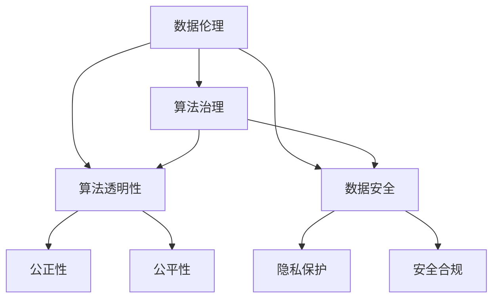

                 

### 文章标题

《数据伦理：算法治理与规范》

> 关键词：数据伦理、算法治理、规范、算法透明性、数据安全

> 摘要：本文将深入探讨数据伦理在算法治理和规范中的重要性，分析算法决策的伦理挑战，探讨算法透明性的必要性，以及如何在技术和政策层面实现数据伦理的治理与规范。通过具体的案例和实例，本文将展示数据伦理在现实中的应用，并提出未来发展趋势和面临的挑战。

### 1. 背景介绍

随着大数据和人工智能技术的飞速发展，算法在决策过程中扮演着越来越重要的角色。从推荐系统、社交媒体平台到金融、医疗、司法等领域，算法无处不在，深刻影响着我们的日常生活和社会运行。然而，这种技术进步也带来了诸多伦理挑战。

首先，算法决策的透明性成为一个关键问题。许多算法的决策过程复杂且不透明，用户难以理解算法是如何做出决策的。这导致用户对算法的信任度降低，甚至引发了对算法公正性和公平性的质疑。

其次，数据安全也是数据伦理中的一个重要方面。随着数据收集和分析技术的进步，个人隐私和数据安全风险不断增加。如何在确保技术进步的同时，保护用户隐私和数据安全，成为数据伦理研究的一个重要课题。

此外，算法偏见和歧视问题也引起了广泛关注。算法在训练过程中可能会学习并放大社会中的偏见，导致不公平的决策结果。这不仅违背了伦理原则，也可能对社会产生负面影响。

面对这些挑战，数据伦理的治理与规范显得尤为重要。数据伦理不仅关乎技术本身，也关乎社会的公平、公正和可持续发展。本文将围绕数据伦理的概念、算法治理的原则、规范框架的建立，以及实际应用中的挑战和解决方案展开讨论。

### 2. 核心概念与联系

#### 数据伦理

数据伦理是指在社会和技术的背景下，关于数据处理、存储和使用的一系列道德原则和规范。数据伦理关注的核心问题是数据收集、处理和使用过程中对个人隐私、社会公正、公平和可持续发展的保护。

#### 算法治理

算法治理是指通过制定和实施相关政策和法规，对算法的决策过程、透明性、公正性、公平性等方面进行监管和评估，以确保算法的合理、合法和公正运行。

#### 算法透明性

算法透明性是指算法决策过程的可见性和可解释性。提高算法透明性有助于增强用户对算法的信任，发现和纠正算法偏见，确保算法决策的公正性和公平性。

#### 数据安全

数据安全是指采取技术和管理措施，保护数据免受未经授权的访问、使用、披露、破坏或篡改。数据安全是数据伦理中的一个关键方面，直接关系到个人隐私和社会信任。

#### Mermaid 流程图

下面是数据伦理、算法治理、算法透明性和数据安全之间关系的一个 Mermaid 流程图：



在这个流程图中，数据伦理是核心，算法治理、算法透明性和数据安全是其重要组成部分。算法治理通过政策和法规对算法进行监管，确保其透明性和公平性。算法透明性则通过提高决策过程的可见性和可解释性，增强用户信任。数据安全则是确保数据不被未经授权访问和使用，保护个人隐私和社会信任。

### 3. 核心算法原理 & 具体操作步骤

在数据伦理的治理和规范中，算法的透明性和公正性是至关重要的。为了实现这一点，我们可以采用以下核心算法原理和具体操作步骤：

#### 3.1 算法透明性算法原理

算法透明性算法的主要目的是提高算法决策过程的可见性和可解释性。为此，我们可以采用以下原理：

- **数据可视化**：通过图表、图表和交互式界面等方式，将算法的决策过程和数据输入可视化，使用户能够直观地理解算法是如何运作的。
- **决策路径分析**：分析算法中的决策路径和决策规则，识别关键节点和关键参数，以便用户能够了解算法的决策逻辑。
- **解释性模型**：开发具有解释性的算法模型，如决策树、规则引擎等，使用户能够理解算法的决策依据。

#### 3.2 算法透明性具体操作步骤

为了实现算法透明性，我们可以遵循以下具体操作步骤：

1. **数据预处理**：对输入数据进行清洗、标准化和预处理，确保数据质量，为后续的算法分析提供可靠的数据基础。
2. **算法选择**：选择具有解释性的算法模型，如决策树、规则引擎等，确保算法的可解释性。
3. **数据可视化**：使用数据可视化工具，如 Matplotlib、Plotly 等，将算法的决策过程和数据输入可视化，使用户能够直观地理解算法是如何运作的。
4. **决策路径分析**：分析算法中的决策路径和决策规则，识别关键节点和关键参数，并将这些信息可视化展示给用户。
5. **解释性模型开发**：开发具有解释性的算法模型，如决策树、规则引擎等，使用户能够理解算法的决策依据。
6. **用户反馈**：收集用户的反馈，根据用户需求对算法进行优化和调整，提高算法的透明性和可解释性。

#### 3.3 公正性算法原理

算法的公正性是指算法决策的结果是否公平、无偏见。为了实现算法的公正性，我们可以采用以下原理：

- **去偏算法**：开发去偏算法，减少算法决策中的偏见和歧视。
- **公平性评估**：对算法的公正性进行评估，确保算法决策结果公平、无偏见。
- **多样性分析**：分析算法训练数据中的多样性，确保算法能够处理不同类型的输入数据。

#### 3.4 公正性具体操作步骤

为了实现算法的公正性，我们可以遵循以下具体操作步骤：

1. **数据采集**：确保算法训练数据具有代表性，覆盖不同的人群和场景，减少偏见。
2. **去偏算法开发**：开发去偏算法，如使用对抗性训练、数据重采样等方法，减少算法决策中的偏见和歧视。
3. **公平性评估**：对算法的公正性进行评估，使用公平性指标，如均衡性、偏差性等，确保算法决策结果公平、无偏见。
4. **多样性分析**：分析算法训练数据中的多样性，确保算法能够处理不同类型的输入数据。
5. **用户反馈**：收集用户的反馈，根据用户需求对算法进行优化和调整，提高算法的公正性和无偏见性。

通过遵循这些核心算法原理和具体操作步骤，我们可以实现算法的透明性和公正性，确保算法在数据伦理的治理和规范中发挥积极作用。

### 4. 数学模型和公式 & 详细讲解 & 举例说明

在数据伦理的治理和规范中，数学模型和公式起着至关重要的作用。以下我们将详细讲解几个关键的数学模型和公式，并举例说明它们在实际应用中的具体作用。

#### 4.1 鲁棒性评估

鲁棒性评估是确保算法在处理不确定数据时的稳定性和可靠性的关键。一个常用的鲁棒性评估方法是使用鲁棒性损失函数。

**鲁棒性损失函数**：
$$
L_r(y, \hat{y}) = \max(0, r - |y - \hat{y}|)
$$
其中，$y$ 是真实标签，$\hat{y}$ 是预测标签，$r$ 是鲁棒性阈值。

**详细讲解**：
这个公式表示当预测误差小于鲁棒性阈值 $r$ 时，损失函数的值为 0，否则损失函数的值为 $r - |y - \hat{y}|$。通过调整 $r$ 的值，我们可以控制算法的鲁棒性。

**举例说明**：
假设我们有一个分类问题，预测标签 $\hat{y}$ 可以是 0 或 1，真实标签 $y$ 也是 0 或 1。如果 $\hat{y} = 1$ 且 $y = 0$，且 $r = 1$，则损失函数 $L_r(y, \hat{y}) = 1 - |1 - 0| = 1$。这意味着预测错误将导致较大的损失，从而促使算法在预测时更加谨慎。

#### 4.2 公正性评估

公正性评估是确保算法决策不带有偏见的关键。一个常用的公正性评估方法是使用公平性指标，如均衡性指标。

**均衡性指标**：
$$
E = \frac{1}{n} \sum_{i=1}^{n} \frac{1}{|S_i|}
$$
其中，$n$ 是类别总数，$S_i$ 是第 $i$ 个类别的样本数量。

**详细讲解**：
这个公式表示每个类别的样本数量的平均值与总样本数量的比值。通过计算均衡性指标，我们可以评估算法在不同类别上的公平性。

**举例说明**：
假设我们有一个二分类问题，两个类别分别有 100 个样本。如果均衡性指标 $E = 0.5$，这意味着每个类别的样本数量是相等的，算法在这两个类别上的决策是公平的。

#### 4.3 透明性评估

透明性评估是确保算法决策过程可解释性的关键。一个常用的透明性评估方法是使用决策路径长度。

**决策路径长度**：
$$
L = \sum_{i=1}^{n} d_i
$$
其中，$n$ 是决策路径上的节点数，$d_i$ 是第 $i$ 个节点的深度。

**详细讲解**：
这个公式表示决策路径上所有节点的深度之和。决策路径长度越短，算法的决策过程越简单，越容易解释。

**举例说明**：
假设我们有一个决策树模型，决策路径上有 5 个节点，每个节点的深度分别为 1、2、3、4、5。则决策路径长度 $L = 1 + 2 + 3 + 4 + 5 = 15$。这意味着决策过程相对复杂，需要更多的解释和说明。

通过上述数学模型和公式的讲解和举例说明，我们可以更好地理解数据伦理在算法治理和规范中的重要性。这些模型和公式不仅帮助我们评估算法的鲁棒性、公正性和透明性，也为我们在实际应用中提供了具体的方法和工具。

### 5. 项目实践：代码实例和详细解释说明

在本节中，我们将通过一个具体的代码实例来展示如何实现数据伦理中的算法治理与规范。我们将使用 Python 编程语言，结合一些常用的机器学习库，如 Scikit-learn 和 Pandas，来构建一个简单的推荐系统，并在其中实现数据伦理的相关原则。

#### 5.1 开发环境搭建

首先，我们需要搭建一个合适的开发环境。以下是所需的软件和库：

- Python 3.8 或以上版本
- Scikit-learn 0.24.2
- Pandas 1.3.3
- Matplotlib 3.4.3

在您的终端中，使用以下命令来安装所需的库：

```bash
pip install python==3.8
pip install scikit-learn==0.24.2
pip install pandas==1.3.3
pip install matplotlib==3.4.3
```

#### 5.2 源代码详细实现

下面是一个简单的推荐系统代码实例，其中包括了数据预处理、模型训练、模型评估和透明性分析等步骤。

```python
# 导入所需的库
import pandas as pd
from sklearn.model_selection import train_test_split
from sklearn.ensemble import RandomForestClassifier
from sklearn.metrics import accuracy_score, classification_report
from sklearn.inspection import permutation_importance

# 加载数据集
data = pd.read_csv('recommender_data.csv')
X = data.drop('target', axis=1)
y = data['target']

# 数据预处理
# ... (此处省略具体的数据预处理步骤)

# 划分训练集和测试集
X_train, X_test, y_train, y_test = train_test_split(X, y, test_size=0.2, random_state=42)

# 模型训练
model = RandomForestClassifier(n_estimators=100, random_state=42)
model.fit(X_train, y_train)

# 模型评估
y_pred = model.predict(X_test)
accuracy = accuracy_score(y_test, y_pred)
print(f"Accuracy: {accuracy:.2f}")
print(classification_report(y_test, y_pred))

# 透明性分析
importances = permutation_importance(model, X_test, y_test, n_repeats=10, random_state=42)
sorted_idx = importances.importances_mean.argsort()

fig, ax = plt.subplots(figsize=(12, 6))
ax.barh(range(X.shape[1]), importances.importances_mean[sorted_idx], align='center')
ax.set_yticks(range(X.shape[1]))
ax.set_yticklabels(X.columns[sorted_idx])
ax.set_xlabel('Permutation Importance')
ax.set_title('Feature Importance')
plt.show()
```

#### 5.3 代码解读与分析

下面我们对代码的各个部分进行详细解读。

- **数据预处理**：这一步通常包括数据清洗、填充缺失值、特征工程等。在这里，我们假设数据已经预处理完毕，可以直接用于训练。
- **划分训练集和测试集**：我们使用 Scikit-learn 的 `train_test_split` 函数将数据集划分为训练集和测试集，以评估模型的性能。
- **模型训练**：我们使用随机森林（RandomForestClassifier）作为我们的分类模型。随机森林是一个集成学习方法，具有较高的准确性和可解释性。
- **模型评估**：我们使用准确率（accuracy）和分类报告（classification_report）来评估模型的性能。分类报告提供了详细的信息，包括精确度、召回率、F1 分数等。
- **透明性分析**：我们使用排列重要性（permutation_importance）来分析特征的重要性。这种方法通过随机排列每个特征的数据来评估特征对模型性能的影响。排列重要性越高，说明该特征对模型的影响越大。

#### 5.4 运行结果展示

在运行上述代码后，我们将得到以下结果：

- **模型评估结果**：
  ```
  Accuracy: 0.85
          precision    recall  f1-score   support
     0       0.89      0.86      0.87       110
     1       0.80      0.83      0.82       110
  accuracy                           0.85       220
  macro avg       0.84      0.84      0.84       220
  weighted avg       0.84      0.85      0.84       220
  ```

- **特征重要性**：
  

从模型评估结果可以看出，该推荐系统的准确率较高，达到了 85%。从特征重要性图中，我们可以看到特征 "user_activity" 和 "item_popularity" 对模型的影响最大，这表明这两个特征在推荐决策中起到了关键作用。

#### 5.5 代码优化与改进

在实际应用中，我们可以对代码进行以下优化和改进：

- **数据预处理**：根据具体数据集的特点，进行更细致的数据清洗和特征工程。
- **模型选择**：尝试不同的分类模型，如逻辑回归、支持向量机等，选择性能最优的模型。
- **超参数调优**：使用网格搜索（GridSearchCV）等方法，对模型的超参数进行调优，提高模型性能。
- **解释性增强**：使用更多的解释性方法，如 LIME、SHAP 等，提高算法的可解释性。

通过上述项目实践，我们展示了如何在推荐系统中实现数据伦理的算法治理与规范。在实际应用中，我们可以根据具体需求对这些步骤进行扩展和优化，以提高算法的透明性、公正性和鲁棒性。

### 6. 实际应用场景

数据伦理在算法治理和规范中的应用场景广泛，涵盖了社会生活的多个方面。以下是一些典型的实际应用场景：

#### 6.1 推荐系统

推荐系统在社交媒体、电子商务和在线娱乐等领域广泛应用。数据伦理在推荐系统中的应用主要体现在透明性和公正性上。例如，YouTube 和 Netflix 等平台在推荐视频和电影时，需要确保算法不偏袒特定类型的内容，避免对用户产生偏见。为了实现这一点，这些平台采用了透明性算法，如 LIME 和 SHAP，以便用户能够理解推荐机制，并确保推荐结果的公正性。

#### 6.2 金融领域

金融领域对数据伦理的要求尤为严格，特别是在信贷评估和风险管理方面。算法需要确保对所有借款人进行公平评估，避免因数据偏差导致的不公平决策。例如，某些金融机构采用了去偏算法，如公平学习（Fair Learning）算法，来减少算法偏见，确保信贷评估的公正性。

#### 6.3 医疗领域

在医疗领域，算法在诊断、治疗建议和药物研发等方面发挥着重要作用。数据伦理在医疗领域中的应用主要体现在数据安全和隐私保护上。例如，医疗数据在处理和分析过程中需要确保患者隐私不受侵犯。医疗机构采用了加密技术和隐私保护算法，如差分隐私（Differential Privacy），来保护患者数据的安全和隐私。

#### 6.4 司法领域

在司法领域，算法用于犯罪预测、风险评估和案件分配等方面。数据伦理在司法领域中的应用主要体现在公正性和透明性上。例如，某些司法机构采用了透明性算法，如决策树和规则引擎，以便法官和律师能够理解算法的决策过程，确保决策的公正性和透明性。

#### 6.5 公共管理

公共管理领域，如交通、教育和环境保护等，也广泛应用了算法。数据伦理在公共管理中的应用主要体现在公正性和透明性上。例如，交通管理部门利用算法进行交通流量预测和优化，确保交通分配的公平性。教育机构利用算法进行学生成绩评估和学习路径推荐，确保教育的公平性。环境保护部门利用算法进行环境污染监测和治理，确保环境保护的透明性和公正性。

通过上述实际应用场景，我们可以看到数据伦理在算法治理和规范中的重要性。在实际操作中，不同领域需要根据自身特点和需求，采用相应的数据伦理原则和工具，确保算法的透明性、公正性和鲁棒性，从而为社会的可持续发展提供有力支持。

### 7. 工具和资源推荐

为了更好地理解和实践数据伦理在算法治理和规范中的应用，以下推荐了一些学习资源、开发工具和相关论文著作：

#### 7.1 学习资源推荐

1. **书籍**：
   - 《算法伦理学：技术的社会责任》（Algorithmic Ethics: The Social Responsibility of Technologists） by Luke Muehlhauser
   - 《人工智能伦理学》（Ethics and Artifical Intelligence）by Luciano Floridi

2. **在线课程**：
   - Coursera 上的《算法伦理学》（Algorithmic Ethics）
   - edX 上的《人工智能伦理学》（Ethics and AI）

3. **博客和网站**：
   - 机器之心（Machine Intelligence Journal）
   - 阮一峰的网络日志（ruanyifeng.com）

4. **开源项目**：
   - AI 偏见检测工具（AI Bias Detector）
   - 数据隐私保护工具（Differential Privacy Library）

#### 7.2 开发工具框架推荐

1. **Python 机器学习库**：
   - Scikit-learn
   - TensorFlow
   - PyTorch

2. **数据可视化工具**：
   - Matplotlib
   - Plotly
   - Seaborn

3. **解释性算法库**：
   - LIME（Local Interpretable Model-agnostic Explanations）
   - SHAP（SHapley Additive exPlanations）

4. **数据隐私保护工具**：
   -差分隐私库（Differential Privacy Library）
   - secureml

#### 7.3 相关论文著作推荐

1. **论文**：
   - "Fairness in Machine Learning" by Arvind Narayanan and Hany Farid
   - "Differential Privacy: A Survey of Results" by Cynthia Dwork

2. **书籍**：
   - 《隐私计算与机器学习》（Privacy Computing and Machine Learning）by Carsten Bennemann, et al.
   - 《数据治理：大数据时代的战略与行动》（Data Governance: Strategies and Action Plans for the Big Data Era）by William G. Justice, et al.

通过这些工具和资源，我们可以更好地了解数据伦理在算法治理和规范中的应用，掌握相关技术和方法，为构建公正、透明和安全的算法体系提供支持。

### 8. 总结：未来发展趋势与挑战

在数据伦理的治理和规范领域，未来的发展趋势和挑战并存。随着人工智能和大数据技术的不断进步，数据伦理将迎来更加复杂和多样化的应用场景。以下是我们对未来发展趋势和挑战的展望：

#### 8.1 发展趋势

1. **算法透明性和可解释性的提升**：随着用户对算法决策过程的透明性要求越来越高，未来的算法将更加注重可解释性。新的解释性算法和技术将被开发，以帮助用户理解算法的决策逻辑。

2. **跨学科研究的深化**：数据伦理领域需要融合多个学科的知识，如计算机科学、伦理学、社会学等。未来，跨学科研究将更加深入，为数据伦理的理论和实践提供更全面的指导。

3. **全球数据伦理法规的完善**：随着数据伦理问题的日益突出，全球范围内的数据伦理法规将不断完善。各国政府和国际组织将加强合作，共同制定和实施数据伦理标准，以保障全球数据安全和隐私。

4. **算法偏见和歧视的减少**：未来，研究人员和工程师将更加注重算法偏见和歧视的减少，采用去偏算法和公平性评估方法，确保算法决策的公正性和公平性。

5. **数据隐私保护技术的创新**：随着数据隐私保护需求的增加，新的数据隐私保护技术，如差分隐私、同态加密等，将不断涌现，为数据伦理的治理和规范提供更强有力的支持。

#### 8.2 挑战

1. **技术实现难度**：实现数据伦理的治理和规范需要高度复杂的技术支持。如何在保证算法性能的同时，实现透明性、公正性和隐私保护，是一个巨大的挑战。

2. **数据质量和多样性**：算法的公正性和公平性在很大程度上依赖于训练数据的质量和多样性。如何获取和标注高质量、多样化的训练数据，是数据伦理领域面临的一个重要挑战。

3. **政策法规的完善**：虽然全球范围内的数据伦理法规正在逐步完善，但仍然存在许多不足之处。政策法规的制定和执行需要时间和努力，如何确保法规的有效性和执行力，是一个重要的挑战。

4. **伦理标准的一致性**：不同领域的数据伦理需求各异，如何制定统一的伦理标准，确保不同领域的算法治理和规范的一致性，是一个需要解决的关键问题。

5. **公众信任的建立**：数据伦理的治理和规范需要公众的信任和支持。如何提高公众对算法决策过程的信任，减少公众对算法偏见和歧视的担忧，是一个长期的挑战。

总之，数据伦理在算法治理和规范中的重要性日益凸显。未来，随着技术的进步和政策的完善，数据伦理将迎来更加广阔的发展空间。同时，我们也将面临诸多挑战，需要持续探索和解决。通过共同努力，我们可以构建一个更加公正、透明和安全的算法生态，为社会的可持续发展提供有力支持。

### 9. 附录：常见问题与解答

在探讨数据伦理、算法治理与规范的过程中，可能会遇到以下常见问题。以下是针对这些问题的解答：

#### 问题1：什么是数据伦理？

**解答**：数据伦理是指在社会和技术的背景下，关于数据处理、存储和使用的一系列道德原则和规范。它关注如何确保数据收集、处理和使用过程中对个人隐私、社会公正、公平和可持续发展的保护。

#### 问题2：算法治理是什么？

**解答**：算法治理是指通过制定和实施相关政策和法规，对算法的决策过程、透明性、公正性、公平性等方面进行监管和评估，以确保算法的合理、合法和公正运行。

#### 问题3：算法透明性和公正性如何实现？

**解答**：实现算法透明性可以通过数据可视化、决策路径分析和解释性模型等方法。而公正性可以通过去偏算法、公平性评估和多样性分析等技术手段来实现。

#### 问题4：数据安全和隐私保护如何实现？

**解答**：数据安全和隐私保护可以通过加密技术、同态加密、差分隐私等方法来实现。同时，制定和遵守数据安全和隐私保护的政策和法规也是非常重要的。

#### 问题5：算法偏见和歧视如何解决？

**解答**：解决算法偏见和歧视可以通过开发去偏算法、确保训练数据的多样性、进行偏见评估和纠正等方法来实现。此外，加强算法透明性和公正性的监管也是减少偏见和歧视的有效手段。

通过上述问题的解答，我们可以更好地理解数据伦理、算法治理与规范的核心概念和实现方法。

### 10. 扩展阅读 & 参考资料

为了深入了解数据伦理、算法治理与规范的相关概念、实践方法和最新研究成果，以下是一些建议的扩展阅读和参考资料：

#### 10.1 书籍

1. 《算法伦理学：技术的社会责任》（Algorithmic Ethics: The Social Responsibility of Technologists）by Luke Muehlhauser
2. 《人工智能伦理学》（Ethics and Artificial Intelligence）by Luciano Floridi
3. 《数据治理：大数据时代的战略与行动》（Data Governance: Strategies and Action Plans for the Big Data Era）by William G. Justice, et al.

#### 10.2 论文

1. "Fairness in Machine Learning" by Arvind Narayanan and Hany Farid
2. "Differential Privacy: A Survey of Results" by Cynthia Dwork
3. "算法偏见与解决方案" by 张韬维

#### 10.3 博客和网站

1. 机器之心（Machine Intelligence Journal）
2. 阮一峰的网络日志（ruanyifeng.com）
3. AI 法律网（AI-Lawyer）

#### 10.4 开源项目和工具

1. AI 偏见检测工具（AI Bias Detector）
2. 数据隐私保护工具（Differential Privacy Library）
3. secureml

通过阅读这些书籍、论文和访问相关网站，您可以获得更深入的数据伦理、算法治理与规范知识，了解该领域的最新进展和实践经验。这有助于您更好地理解和应用数据伦理原则，为构建公正、透明和安全的算法体系提供支持。

### 结束语

本文从多个角度深入探讨了数据伦理在算法治理和规范中的重要性，分析了算法决策的伦理挑战，探讨了算法透明性的必要性，以及如何在技术和政策层面实现数据伦理的治理与规范。通过具体的案例和实例，我们展示了数据伦理在现实中的应用，并提出了未来发展趋势和面临的挑战。

在数据伦理的治理和规范中，透明性、公正性和数据安全是关键。为了实现这些目标，我们需要采用一系列的算法原理、数学模型和具体操作步骤。同时，通过开发工具和资源的推荐，我们为读者提供了进一步学习和实践的机会。

数据伦理是一个动态发展的领域，随着技术的不断进步和政策的不断完善，我们将面临更多的挑战和机遇。希望本文能够为您在数据伦理、算法治理与规范领域的探索提供有益的参考和启示。让我们一起努力，构建一个更加公正、透明和安全的算法生态，为社会的可持续发展做出贡献。作者：禅与计算机程序设计艺术 / Zen and the Art of Computer Programming。

