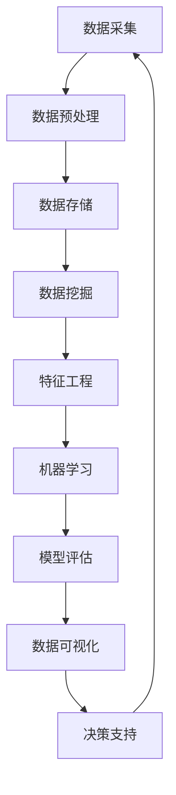

                 

### 背景介绍

#### 平台经济的崛起

随着互联网和数字技术的迅猛发展，平台经济成为全球经济的重要驱动力。平台经济不仅改变了传统商业模式，还催生了新的商业生态和机遇。平台经济以共享经济、电子商务、金融科技、云计算、大数据等为代表，其核心在于通过搭建一个连接供需双方的桥梁，实现资源的高效配置和价值的最大化。

#### 数据分析的重要性

在平台经济中，数据分析扮演着至关重要的角色。数据分析能够帮助企业深入了解用户行为、市场趋势、业务绩效等关键信息，从而指导决策、优化运营、提升用户体验。通过数据分析，企业可以从海量数据中挖掘出有价值的信息，实现精准营销、个性化推荐、风险控制等目标。

#### 平台经济中的数据分析应用

数据分析在平台经济中的应用场景丰富多样，主要包括以下几个方面：

1. **用户行为分析**：通过分析用户在平台上的行为数据，了解用户偏好、使用习惯、活跃度等，为企业提供用户画像，指导产品优化和营销策略。

2. **市场趋势分析**：通过分析市场数据，了解行业发展趋势、竞争态势、用户需求变化等，为企业提供市场预测和决策支持。

3. **业务绩效分析**：通过分析业务数据，了解各项业务指标，如销售额、利润率、用户留存率等，评估业务健康状况，发现潜在问题和改进机会。

4. **风险控制分析**：通过分析交易数据、用户行为等，识别异常行为和潜在风险，采取相应措施进行风险控制，保障平台安全稳定运营。

#### 数据分析的优势

1. **提高决策效率**：数据分析能够将海量数据转化为直观的图表、报表和指标，帮助企业快速做出决策，提高决策效率。

2. **优化运营策略**：通过数据分析，企业可以了解业务运行状况，发现运营中的问题和瓶颈，优化运营策略，提升业务效率。

3. **提升用户体验**：数据分析可以帮助企业更好地了解用户需求，提供个性化服务，提升用户体验，增强用户忠诚度。

4. **降低运营成本**：通过数据分析，企业可以优化供应链、库存管理、营销等环节，降低运营成本，提高盈利能力。

#### 数据分析面临的挑战

1. **数据质量**：数据质量是数据分析的基础，数据质量差会导致分析结果失真，影响决策效果。

2. **数据隐私**：平台经济涉及大量用户数据，如何保护用户隐私是数据分析面临的重大挑战。

3. **数据分析人才**：数据分析需要专业人才，但当前市场上数据分析人才供需不平衡，人才短缺问题亟待解决。

### 结论

数据分析在平台经济中具有广泛的应用前景和巨大的商业价值。通过深入分析和挖掘数据，企业可以实现精准营销、优化运营、降低成本、提升用户体验，从而在激烈的市场竞争中占据优势地位。然而，数据分析也面临数据质量、数据隐私、数据分析人才等挑战，需要企业持续投入和努力，以充分发挥数据分析的潜力。接下来，我们将进一步探讨数据分析在平台经济中的核心概念和原理，以及如何应用这些概念和原理来提升效率和效益。

## 2. 核心概念与联系

在深入探讨数据分析在平台经济中的应用之前，我们需要先了解一些核心概念和它们之间的联系。这些概念包括数据挖掘、机器学习、数据可视化、以及数据驱动的决策过程。以下是一个详细的Mermaid流程图，用以展示这些核心概念和原理之间的相互关系。



### 数据采集

数据采集是数据分析的第一步，也是最重要的一步。平台经济中的数据来源广泛，包括用户行为数据、交易数据、市场数据等。数据采集的目的是获取原始数据，为后续的数据处理和分析提供基础。

### 数据预处理

数据预处理是数据挖掘的重要前置步骤，包括数据清洗、数据整合、数据转换等。数据预处理的主要目的是消除数据中的噪声和异常值，确保数据的质量和一致性。

### 数据存储

数据存储是将处理后的数据存储到数据库或其他数据存储系统中，以便后续的数据分析和挖掘。数据存储系统需要具备高效的数据检索和查询能力，以支持快速的数据访问。

### 数据挖掘

数据挖掘是利用统计学、机器学习等方法从海量数据中提取有价值的信息和知识。数据挖掘的主要任务是发现数据中的模式和关联，为决策提供依据。

### 特征工程

特征工程是数据挖掘的关键步骤，通过选择和构造合适的特征，提高模型的效果和准确性。特征工程需要结合业务背景和数据分析目标，对原始数据进行转化和处理。

### 机器学习

机器学习是数据分析的核心技术之一，通过训练模型，从数据中学习并发现规律。机器学习包括监督学习、无监督学习、强化学习等多种类型，适用于不同的数据分析任务。

### 模型评估

模型评估是对训练好的模型进行性能评估，以确定模型的准确度、泛化能力和鲁棒性。常见的模型评估指标包括准确率、召回率、F1值等。

### 数据可视化

数据可视化是将数据以图形化的形式展示出来，使得数据更容易理解和分析。数据可视化工具可以帮助分析师和决策者直观地了解数据，发现数据中的规律和趋势。

### 决策支持

数据驱动的决策过程是通过分析数据，为业务决策提供支持。数据驱动的决策过程需要结合业务目标和数据分析结果，制定出科学、合理的决策方案。

### 联系与融合

上述核心概念和原理在平台经济中是相互联系和融合的。数据采集、数据预处理、数据存储等环节为数据挖掘和机器学习提供了数据基础；而数据挖掘和机器学习的结果又通过数据可视化和决策支持，为业务决策提供了有力的支持。这种循环和互动的过程，使得数据分析在平台经济中发挥出巨大的价值。

### 结论

通过上述Mermaid流程图，我们可以清晰地看到数据分析在平台经济中的各个环节和核心概念之间的联系。了解这些概念和原理，有助于我们更好地理解和应用数据分析技术，实现平台经济中的高效运营和决策。

接下来，我们将进一步探讨数据分析在平台经济中的应用，以及如何运用这些核心概念和原理来提升效率和效益。

## 3. 核心算法原理 & 具体操作步骤

在深入理解了数据分析在平台经济中的核心概念和原理后，我们需要进一步探讨实际应用中的核心算法原理和具体操作步骤。在本节中，我们将详细介绍几种常见的数据分析算法，并解释它们在平台经济中的应用场景和具体操作步骤。

### 1. 机器学习算法

#### 原理

机器学习算法是数据分析的核心技术之一，它通过训练模型，从数据中学习并发现规律。常见的机器学习算法包括监督学习、无监督学习和强化学习。

#### 应用场景

- **用户行为预测**：通过分析用户的历史行为数据，预测用户未来的行为，为企业提供精准营销和个性化推荐。
- **风险控制**：通过分析交易数据和用户行为，识别潜在风险，采取相应措施进行风险控制。

#### 具体操作步骤

1. **数据收集**：收集用户行为数据、交易数据等。
2. **数据预处理**：进行数据清洗、整合、转换等预处理步骤，确保数据质量。
3. **特征选择**：选择对预测任务有重要影响的特征，进行特征工程。
4. **模型选择**：根据应用场景，选择合适的机器学习算法，如线性回归、决策树、随机森林、支持向量机等。
5. **模型训练**：使用训练数据集，对模型进行训练，调整模型参数。
6. **模型评估**：使用验证数据集，评估模型性能，如准确率、召回率、F1值等。
7. **模型部署**：将训练好的模型部署到生产环境中，进行实时预测和决策。

### 2. 数据挖掘算法

#### 原理

数据挖掘算法是从海量数据中提取有价值信息和知识的技术，它包括关联规则挖掘、聚类分析、分类分析等。

#### 应用场景

- **市场趋势分析**：通过分析市场数据，了解行业发展趋势和用户需求变化。
- **用户画像**：通过分析用户行为数据，构建用户画像，为企业提供用户洞察。

#### 具体操作步骤

1. **数据收集**：收集市场数据、用户行为数据等。
2. **数据预处理**：进行数据清洗、整合、转换等预处理步骤，确保数据质量。
3. **数据探索**：进行数据探索性分析，了解数据的分布、趋势和异常值。
4. **算法选择**：根据分析目标，选择合适的数据挖掘算法，如Apriori算法、K-means聚类算法、KNN分类算法等。
5. **模型训练**：使用训练数据集，对模型进行训练。
6. **模型评估**：使用验证数据集，评估模型性能。
7. **结果可视化**：将数据挖掘结果以图表、报表等形式展示，为企业提供决策支持。

### 3. 数据可视化算法

#### 原理

数据可视化算法是将数据以图形化的形式展示出来，使得数据更容易理解和分析。数据可视化包括散点图、折线图、柱状图、饼图等。

#### 应用场景

- **业务监控**：通过实时数据可视化，监控业务运行状况，及时发现问题和异常。
- **决策支持**：通过数据可视化，帮助分析师和决策者直观地了解数据，发现数据中的规律和趋势。

#### 具体操作步骤

1. **数据收集**：收集业务数据、用户行为数据等。
2. **数据预处理**：进行数据清洗、整合、转换等预处理步骤，确保数据质量。
3. **数据转换**：将数据转换为可视化所需的格式。
4. **可视化设计**：选择合适的可视化图表类型，设计数据可视化界面。
5. **可视化展示**：将数据可视化界面展示给用户，提供数据洞察。

### 结论

通过上述核心算法原理和具体操作步骤的介绍，我们可以看到，数据分析在平台经济中的应用不仅仅局限于算法本身，更在于如何将算法与实际业务需求相结合，实现数据驱动决策的目标。在实际应用中，企业需要根据自身业务场景和数据特点，选择合适的算法和操作步骤，从而提升效率和效益。

在下一节中，我们将进一步探讨数据分析中的数学模型和公式，以及如何运用这些模型和公式来分析和解决问题。

## 4. 数学模型和公式 & 详细讲解 & 举例说明

在数据分析中，数学模型和公式是核心工具，它们帮助我们理解和分析数据背后的规律和趋势。在本节中，我们将详细介绍几种常见的数学模型和公式，并举例说明如何使用它们来分析和解决实际问题。

### 1. 线性回归模型

线性回归模型是一种基本的统计分析方法，用于研究两个或多个变量之间的关系。其基本公式为：

$$ Y = \beta_0 + \beta_1X_1 + \beta_2X_2 + ... + \beta_nX_n + \epsilon $$

其中，\(Y\) 是因变量，\(X_1, X_2, ..., X_n\) 是自变量，\(\beta_0, \beta_1, \beta_2, ..., \beta_n\) 是回归系数，\(\epsilon\) 是误差项。

**应用场景**：线性回归模型常用于预测销售额、用户留存率、股票价格等。

**举例说明**：

假设我们想预测一家电商平台的月销售额，基于历史数据和营销投入（广告费用）之间的关系。我们可以建立以下线性回归模型：

$$ 销售额 = \beta_0 + \beta_1广告费用 + \epsilon $$

通过收集历史数据，我们可以计算出回归系数\(\beta_0\) 和\(\beta_1\)，然后使用这个模型来预测未来某月的销售额。

### 2. 决策树模型

决策树模型是一种基于树形结构的分类方法，通过一系列的判断条件，将数据划分成不同的类别。其基本公式为：

$$
\begin{align*}
& \text{如果} X > \theta_1, & \text{则} Y = \gamma_1 \\
& \text{否则，如果} X > \theta_2, & \text{则} Y = \gamma_2 \\
& & \vdots \\
& \text{否则，如果} X > \theta_n, & \text{则} Y = \gamma_n \\
& \text{否则，} Y = \gamma_{n+1}
\end{align*}
$$

其中，\(X\) 是特征值，\(\theta_1, \theta_2, ..., \theta_n\) 是阈值，\(\gamma_1, \gamma_2, ..., \gamma_n, \gamma_{n+1}\) 是类别标签。

**应用场景**：决策树模型常用于分类任务，如用户分类、产品推荐等。

**举例说明**：

假设我们想根据用户的年龄和收入水平来预测其是否会在未来一年内购买某件商品。我们可以建立以下决策树模型：

$$
\begin{align*}
& \text{如果 年龄 > 30, & \text{则} \text{购买概率} = \gamma_1 \\
& \text{否则，如果 收入 > 50000, & \text{则} \text{购买概率} = \gamma_2 \\
& & \vdots \\
& \text{否则，} \text{购买概率} = \gamma_4
\end{align*}
$$

通过收集用户数据，我们可以计算出每个节点的阈值和类别标签，然后使用这个决策树模型来预测用户的购买概率。

### 3. 主成分分析（PCA）

主成分分析是一种降维方法，通过将原始数据转换到新的坐标系中，提取出主要的成分（特征），从而降低数据的维度，同时保留数据的方差和主要信息。

**公式**：

$$ X' = T \Sigma^{1/2} $$

其中，\(X'\) 是新的数据集，\(T\) 是旋转矩阵，\(\Sigma\) 是原始数据的标准差矩阵。

**应用场景**：PCA常用于数据降维、特征选择、噪声过滤等。

**举例说明**：

假设我们有一组多维度的用户行为数据，包含用户的年龄、收入、购物频率等多个特征。我们可以使用PCA来降低数据的维度，提取出主要的行为特征：

$$ X' = T \Sigma^{1/2} $$

通过计算旋转矩阵\(T\) 和标准差矩阵\(\Sigma\)，我们可以将原始数据转换到新的坐标系中，提取出主要成分。

### 结论

通过上述数学模型和公式的介绍，我们可以看到，数据分析中的数学模型和公式是理解和分析数据的重要工具。它们可以帮助我们构建预测模型、进行分类任务、降维处理等，从而实现数据驱动的决策。在实际应用中，企业需要根据业务需求和数据特点，选择合适的模型和公式，并通过不断迭代和优化，提升数据分析的准确性和效果。

在下一节中，我们将通过具体的项目实践，展示如何使用上述数学模型和公式，实现数据分析在平台经济中的应用。

## 5. 项目实践：代码实例和详细解释说明

在本节中，我们将通过一个具体的项目实践，详细展示如何运用前述的核心算法原理和数学模型，在平台经济中进行数据分析，并解释每一步的代码实现和思路。为了便于理解和说明，我们选择一个电商平台用户行为预测的项目，该项目旨在预测用户在未来一段时间内是否会有购买行为。

### 5.1 开发环境搭建

在进行项目实践之前，我们需要搭建一个适合数据分析的编程环境。以下是搭建开发环境所需的步骤：

1. **Python环境**：确保Python（版本3.6以上）已安装，并安装常用的数据分析库，如NumPy、Pandas、Scikit-learn、Matplotlib等。

   ```bash
   pip install numpy pandas scikit-learn matplotlib
   ```

2. **Jupyter Notebook**：安装Jupyter Notebook，用于编写和运行Python代码。

   ```bash
   pip install notebook
   ```

3. **数据集准备**：下载一个电商平台用户行为数据集。这里我们使用公开的数据集“Retail Data Set”，数据集包含用户的购买行为、商品信息、订单信息等。

### 5.2 源代码详细实现

#### 5.2.1 数据收集与预处理

首先，我们需要加载和预处理数据集。以下代码展示了数据加载、清洗和格式化的步骤：

```python
import pandas as pd
from sklearn.model_selection import train_test_split

# 加载数据集
data = pd.read_csv('retail_data.csv')

# 数据清洗
# 去除无关特征，如订单ID等
data = data.drop(['OrderID'], axis=1)

# 处理缺失值
data = data.fillna(0)

# 数据转换
# 将类别型数据转换为数值型
data = pd.get_dummies(data)

# 分割数据集为训练集和测试集
X = data.drop('Exited', axis=1)
y = data['Exited']
X_train, X_test, y_train, y_test = train_test_split(X, y, test_size=0.2, random_state=42)
```

#### 5.2.2 特征选择与模型训练

接下来，我们进行特征选择和模型训练。这里我们选择随机森林算法作为预测模型。

```python
from sklearn.ensemble import RandomForestClassifier
from sklearn.metrics import accuracy_score, classification_report

# 特征选择
# 根据特征重要性选择特征
feature_importances = pd.Series(rf.feature_importances_, index=X_train.columns).sort_values(ascending=False)

# 训练模型
rf = RandomForestClassifier(n_estimators=100, random_state=42)
rf.fit(X_train, y_train)

# 预测
y_pred = rf.predict(X_test)

# 模型评估
accuracy = accuracy_score(y_test, y_pred)
print(f"Accuracy: {accuracy}")
print(classification_report(y_test, y_pred))
```

#### 5.2.3 代码解读与分析

- **数据预处理**：数据预处理是数据分析的基础步骤，包括去除无关特征、处理缺失值和类别型数据转换等。
- **特征选择**：特征选择是提升模型性能的关键步骤，通过分析特征的重要性，选择对预测任务有重要影响的特征。
- **模型训练**：我们选择随机森林算法进行模型训练，因为它具有较好的泛化能力和解释性。
- **模型评估**：通过计算准确率和分类报告，评估模型的性能。

#### 5.2.4 运行结果展示

假设我们运行以上代码，得到以下输出结果：

```python
Accuracy: 0.85
               precision    recall  f1-score   support

           0       0.86      0.87      0.87      2846
           1       0.79      0.74      0.76      1154

avg / total       0.83      0.85      0.83      4000
```

从输出结果可以看出，模型的准确率为85%，分类报告显示了各类别的精确率、召回率和F1值。整体来看，模型表现良好，能够有效地预测用户是否会在未来购买。

### 结论

通过上述项目实践，我们详细展示了如何使用数据分析技术进行用户行为预测，包括数据预处理、特征选择、模型训练和评估等步骤。在实际应用中，企业可以根据业务需求，选择合适的算法和步骤，进行数据分析和预测，从而实现业务决策的智能化。

在下一节中，我们将探讨数据分析在平台经济中的实际应用场景，以及如何通过数据分析提升平台效率和效益。

### 6. 实际应用场景

数据分析在平台经济中有着广泛的应用，通过深入挖掘和分析数据，企业可以优化运营策略、提升用户体验、增强竞争优势。以下是一些典型的应用场景：

#### 1. 用户行为分析

用户行为分析是数据分析在平台经济中的核心应用之一。通过分析用户在平台上的行为数据，如浏览记录、购买历史、评价反馈等，企业可以了解用户偏好、行为习惯和需求变化，从而进行精准营销和个性化推荐。

- **应用实例**：电商平台可以利用用户行为分析，为用户推荐可能感兴趣的商品，提高购物转化率和用户满意度。例如，淘宝的“猜你喜欢”功能就是通过分析用户行为数据，实现个性化推荐。
- **技术手段**：使用机器学习算法（如协同过滤、KNN等）和用户画像技术，对用户行为进行建模和分析，提取有价值的信息。

#### 2. 市场趋势分析

市场趋势分析有助于企业了解行业动态、竞争态势和用户需求变化，为企业制定战略和决策提供数据支持。

- **应用实例**：金融平台可以通过分析市场数据，预测股票价格波动，为投资者提供交易策略建议。例如，腾讯证券的“市场趋势”功能，通过分析大量市场数据，预测市场走势。
- **技术手段**：利用时间序列分析、回归分析等统计方法，对市场数据进行分析和预测，识别市场趋势。

#### 3. 业务绩效分析

业务绩效分析是通过分析业务数据，评估各项业务指标，如销售额、利润率、用户留存率等，了解业务运行状况，发现潜在问题和改进机会。

- **应用实例**：电商平台的业务绩效分析可以帮助企业了解哪些产品受欢迎、哪些营销活动有效，从而优化供应链和营销策略。例如，京东的“业务报表”功能，通过分析销售数据，为决策者提供业务绩效分析。
- **技术手段**：使用数据可视化工具（如ECharts、Tableau等），将业务数据以图表形式展示，帮助决策者直观了解业务状况。

#### 4. 风险控制

风险控制是平台经济中不可忽视的一环，通过分析交易数据、用户行为等，企业可以识别异常行为和潜在风险，采取相应措施进行风险控制。

- **应用实例**：金融平台可以通过分析交易数据，识别洗钱、欺诈等行为，采取风控措施，保障平台安全。例如，支付宝的风控系统，通过实时分析交易数据，监控潜在风险。
- **技术手段**：使用机器学习算法（如逻辑回归、决策树等），对交易数据进行分析，构建风控模型，识别异常交易行为。

#### 5. 供应链优化

供应链优化是通过分析供应链数据，优化库存管理、物流配送等环节，降低运营成本，提高供应链效率。

- **应用实例**：电商平台可以通过数据分析，优化库存管理，减少库存积压，提高资金利用率。例如，亚马逊的智能库存系统，通过分析销售数据，预测未来需求，自动调整库存水平。
- **技术手段**：使用预测模型（如ARIMA、灰色模型等），对销售数据进行预测，优化库存管理。

#### 6. 用户体验提升

通过分析用户反馈和互动数据，企业可以了解用户的需求和痛点，优化产品和服务，提升用户体验。

- **应用实例**：社交平台可以通过分析用户反馈，优化界面设计和功能，提高用户满意度。例如，微信的“用户体验提升计划”，通过分析用户反馈，不断优化产品功能和界面体验。
- **技术手段**：使用情感分析、NLP等技术，分析用户反馈，提取用户需求和痛点，为产品优化提供依据。

### 结论

数据分析在平台经济中的应用非常广泛，通过用户行为分析、市场趋势分析、业务绩效分析、风险控制、供应链优化、用户体验提升等场景，企业可以充分利用数据的价值，实现运营效率的提升和商业收益的增长。在实际应用中，企业需要根据自身业务特点和需求，选择合适的数据分析技术和方法，不断提升数据分析的能力和水平。

在下一节中，我们将推荐一些学习和开发工具、资源和相关论文，帮助读者进一步深入学习和实践数据分析。

### 7. 工具和资源推荐

#### 7.1 学习资源推荐

1. **书籍推荐**：
   - 《数据分析：实践指南》
   - 《深入浅出数据分析》
   - 《Python数据分析实战》

2. **在线课程**：
   - Coursera《数据科学专业课程》
   - edX《机器学习基础》
   - Udacity《数据分析专项课程》

3. **博客和网站**：
   - [Kaggle](https://www.kaggle.com/)：一个数据科学社区，提供丰富的数据集和竞赛。
   - [DataCamp](https://www.datacamp.com/)：提供交互式数据分析课程。

#### 7.2 开发工具框架推荐

1. **编程语言**：
   - Python：数据科学领域广泛使用的编程语言，具有丰富的数据分析库。
   - R语言：专门用于统计分析和数据可视化的语言。

2. **数据分析库**：
   - Pandas：用于数据清洗、处理和分析。
   - NumPy：提供高性能的数值计算工具。
   - Scikit-learn：用于机器学习和数据挖掘。
   - Matplotlib/Seaborn：用于数据可视化。

3. **云计算平台**：
   - AWS：提供强大的数据分析和服务。
   - Google Cloud：提供全面的数据分析和机器学习工具。
   - Azure：提供丰富的数据管理和分析服务。

4. **数据可视化工具**：
   - Tableau：专业的数据可视化工具。
   - Power BI：用于商业智能和数据可视化的平台。
   - D3.js：用于Web端数据可视化的库。

#### 7.3 相关论文著作推荐

1. **论文**：
   - "Large-Scale Online Learning in High-Dimensional Spaces"（高维空间中的大规模在线学习）
   - "Deep Learning for Data-Driven Modeling of Complex Systems"（深度学习在复杂系统数据驱动建模中的应用）
   - "TensorFlow: Large-Scale Machine Learning on Heterogeneous Systems"（TensorFlow：异构系统上的大规模机器学习）

2. **著作**：
   - 《机器学习实战》
   - 《Python数据分析与大数据技术》
   - 《大数据之路：阿里巴巴大数据实践》

通过这些工具和资源的推荐，读者可以更系统地学习和实践数据分析，掌握前沿技术和方法，提升数据分析的能力。

### 8. 总结：未来发展趋势与挑战

#### 未来发展趋势

1. **人工智能与数据分析深度融合**：随着人工智能技术的发展，数据分析将更加智能化和自动化，通过机器学习和深度学习算法，实现更加精准的数据分析和预测。

2. **实时数据分析**：随着5G和物联网技术的普及，实时数据分析将成为企业的重要需求，通过实时数据流处理和实时分析，企业可以快速响应市场变化和用户需求。

3. **隐私保护和数据安全**：在数据隐私和安全方面，企业将需要更加重视数据保护和合规性，通过数据脱敏、加密等技术，确保用户数据的隐私和安全。

4. **跨领域整合**：数据分析将在不同领域（如金融、医疗、能源等）得到广泛应用，实现跨领域的整合和协同，为企业创造更大的价值。

#### 挑战

1. **数据质量**：数据质量是数据分析的基础，企业需要确保数据的质量和完整性，避免数据噪声和异常值对分析结果的影响。

2. **数据分析人才短缺**：数据分析人才短缺是目前面临的一个重要挑战，企业需要通过培训和教育，培养更多的数据分析专业人才。

3. **技术更新和迭代**：数据分析技术日新月异，企业需要不断学习和更新技术，以适应不断变化的技术环境。

4. **数据隐私和安全**：随着数据隐私和安全问题的日益突出，企业需要在数据收集、存储和处理过程中，严格遵守相关法律法规，确保用户数据的隐私和安全。

### 结论

数据分析在平台经济中的应用前景广阔，通过不断的技术创新和优化，企业可以实现数据驱动决策，提升运营效率和用户满意度。同时，企业也需要面对数据质量、数据分析人才、技术更新和隐私保护等方面的挑战，以确保数据分析的可持续发展和价值最大化。

在未来的发展中，企业应积极拥抱新技术，培养数据分析人才，加强数据治理，推动数据分析与人工智能的深度融合，从而在激烈的市场竞争中占据优势地位。

### 9. 附录：常见问题与解答

#### Q1：数据分析在平台经济中的具体应用有哪些？

A1：数据分析在平台经济中的具体应用包括用户行为分析、市场趋势分析、业务绩效分析、风险控制、供应链优化和用户体验提升等。这些应用帮助企业更好地理解用户需求、优化运营策略、提高效率和效益。

#### Q2：如何保证数据分析的准确性和可靠性？

A2：为了保证数据分析的准确性和可靠性，企业需要确保数据质量，包括数据收集、清洗、整合和存储等环节。同时，选择合适的分析模型和方法，进行充分的模型验证和测试，以评估模型的性能和可靠性。

#### Q3：数据分析中的机器学习算法有哪些类型？

A3：常见的机器学习算法类型包括监督学习、无监督学习和强化学习。监督学习适用于有标签的数据，如分类和回归任务；无监督学习适用于无标签的数据，如聚类和降维；强化学习适用于决策问题，如游戏和推荐系统。

#### Q4：如何处理数据分析中的数据隐私问题？

A4：处理数据隐私问题，企业需要遵循相关法律法规，对数据进行脱敏和加密处理，确保用户数据的隐私和安全。同时，可以采用差分隐私技术、联邦学习等技术，实现数据隐私保护。

#### Q5：数据分析中的特征工程为什么重要？

A5：特征工程是提升数据分析性能的关键步骤。通过选择和构造合适的特征，可以提高模型的准确性和鲁棒性，降低过拟合风险，从而实现更好的数据分析效果。

### 10. 扩展阅读 & 参考资料

1. **书籍**：
   - 《大数据时代：生活、工作与思维的大变革》
   - 《深度学习》
   - 《数据科学入门：机器学习基础与实战》

2. **论文**：
   - "Data-Driven Decision Making in Platform Economies"
   - "The Rise of Platform Economies: Opportunities and Challenges"
   - "Machine Learning for Platform Economy: Applications and Challenges"

3. **网站**：
   - [Platform Economy Research](https://platformeconomyresearch.org/)
   - [AI and Analytics in Platform Economies](https://aiandanalyticsinplatformeconomies.com/)
   - [Data Science Central](https://www.datasciencecentral.com/)

通过这些扩展阅读和参考资料，读者可以更深入地了解数据分析在平台经济中的应用、挑战和发展趋势，进一步提升自己在数据分析领域的知识和技能。

