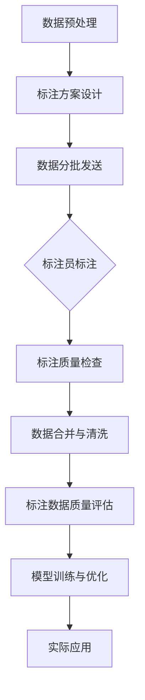

                 

### 背景介绍

在人工智能（AI）的快速发展中，数据标注扮演着至关重要的角色。它既是人工智能训练的基础，也是保障模型质量和性能的关键环节。数据标注，顾名思义，就是为数据打上标签，使其成为可供AI算法训练使用的高质量数据集。这个过程不仅需要细致和耐心，还需要对数据本身的深刻理解和准确把握。

#### 数据标注的重要性

首先，我们来看一下数据标注的重要性。对于AI系统而言，数据就是其成长的土壤。标注数据的质量直接决定了AI模型的学习效果和最终表现。高质量的数据可以显著提高模型的准确性、稳定性和泛化能力，反之，低质量或者错误的数据则可能导致模型过拟合，甚至在现实应用中产生误导。因此，数据标注不仅决定了模型的性能，还影响了整个AI系统的可靠性和实用性。

#### 数据标注的应用领域

数据标注的应用范围广泛，几乎涵盖了人工智能的各个领域：

1. **计算机视觉**：在图像识别、物体检测和场景解析等任务中，数据标注通常涉及标记图像中的对象、边界框、标签等信息。

2. **自然语言处理（NLP）**：在文本分类、情感分析、机器翻译等任务中，数据标注包括对文本进行分词、实体识别、情感标签等操作。

3. **语音识别**：数据标注在语音识别任务中尤为关键，标注的内容通常包括语音的文本转录、声学模型的音素标注等。

4. **推荐系统**：在构建推荐系统时，数据标注用于标记用户的偏好、购买历史等信息，从而帮助算法理解用户的兴趣和需求。

5. **自动驾驶**：自动驾驶系统依赖大量标注的交通场景数据，包括道路标志、交通灯、行人、车辆等信息。

#### 数据标注的挑战

然而，数据标注并非易事，其中存在着诸多挑战：

1. **人工成本**：大规模、高质量的数据标注通常需要大量人力投入，这不仅耗时耗力，还可能导致标注质量的不一致。

2. **标注一致性**：由于不同标注员的主观判断和经验差异，可能导致数据标注存在不一致性，进而影响模型的性能。

3. **数据质量和多样性**：标注数据的多样性和质量直接影响模型的训练效果。在一些特定场景下，获取到高质量、多样化的标注数据可能非常困难。

4. **数据隐私和安全性**：在数据标注过程中，涉及到的数据往往包含了敏感信息，如何确保数据隐私和安全成为一大挑战。

### 标注数据在AI发展中的角色

综上所述，数据标注在人工智能发展中扮演着不可或缺的角色。高质量的数据标注不仅能够提升AI模型的性能，还能够推动AI技术的实际应用和普及。可以说，数据标注是人工智能发展背后的无名英雄，它默默地为AI技术的进步贡献着力量。

在接下来的部分中，我们将深入探讨数据标注的核心概念与联系，帮助读者更好地理解这一领域的关键原理和实践方法。让我们继续思考，逐步分析，为读者带来更具启发性的内容。

### 核心概念与联系

为了深入理解数据标注的核心概念与联系，我们首先需要明确几个关键术语：数据集、标注员、标注工具和标注流程。

#### 数据集

数据集是数据标注的核心对象。它是一组具有共同特征的数据的集合，这些数据可以是图像、文本、音频或视频等不同类型。数据集的质量直接决定了标注数据的质量。高质量的数据集应该具备以下特点：

1. **代表性**：数据集应该能够全面覆盖目标任务所需的特征和场景。
2. **平衡性**：数据集中各类样本应该分布均匀，避免某一类样本过多或过少，导致模型过拟合或欠拟合。
3. **多样性**：数据集应该包含多种多样的样本，以提高模型的泛化能力。

#### 标注员

标注员是数据标注过程中不可或缺的角色。他们需要具备相关的专业知识和经验，能够准确理解标注任务的要求，并对数据进行细致的标注。标注员的工作质量直接影响到标注数据的准确性和一致性。以下是标注员应具备的能力：

1. **专业知识**：标注员需要对所标注的数据类型有深入的了解，例如，图像标注员需要熟悉图像处理和识别的相关知识。
2. **细致耐心**：标注员需要具备良好的细致耐心，能够对数据进行细致的观察和判断。
3. **协作能力**：在大型项目中，标注员需要与其他团队成员协作，确保标注数据的一致性。

#### 标注工具

标注工具是数据标注的重要辅助工具。它可以帮助标注员提高标注效率，减少人工错误，并确保标注数据的一致性。常见的标注工具包括：

1. **图像标注工具**：例如LabelImg、CVAT等，用于标记图像中的对象、边界框和标签。
2. **文本标注工具**：例如NLTK、spaCy等，用于对文本进行分词、实体识别和情感标注。
3. **语音标注工具**：例如Audacity、Praat等，用于标记语音的文本转录和音素。

#### 标注流程

数据标注的过程通常包括以下几个步骤：

1. **数据预处理**：在开始标注之前，需要对数据进行预处理，例如去除噪声、调整图像大小等，以提高标注效率和质量。
2. **标注方案设计**：根据标注任务的要求，设计标注方案，明确标注的具体步骤和要求。
3. **数据分批发送**：将数据集分批发送到标注员，标注员根据标注方案对数据进行标注。
4. **标注质量检查**：对标注数据进行质量检查，确保标注的准确性和一致性。
5. **数据合并与清洗**：将标注好的数据合并，并清洗数据，去除重复和错误的数据。

#### 标注数据的质量评估

标注数据的质量评估是数据标注过程中至关重要的一环。常用的评估方法包括：

1. **人工评估**：通过标注员的主观判断，对标注数据的质量进行评估。
2. **自动化评估**：使用自动化工具，例如一致性评估工具，对标注数据的一致性进行评估。
3. **交叉验证**：使用多个标注员对同一数据进行标注，比较标注结果的一致性。

#### 数据标注在AI系统中的价值

数据标注在AI系统中具有不可替代的价值。以下是数据标注在AI系统中的几个关键作用：

1. **模型训练**：标注数据是AI模型训练的基础，高质量的数据可以提高模型的准确性和泛化能力。
2. **模型优化**：通过分析标注数据，可以找出模型存在的不足，进而优化模型的结构和算法。
3. **实际应用**：标注数据是AI系统在实际应用中的重要资源，可以为不同任务提供高质量的训练数据。

### Mermaid 流程图

为了更好地展示数据标注的核心概念与联系，我们可以使用Mermaid流程图来描述数据标注的整个过程。以下是数据标注流程的Mermaid表示：



通过这个流程图，我们可以清晰地看到数据标注从数据预处理到标注质量评估的整个过程，以及标注数据在AI系统中的应用。

### 总结

在数据标注领域，数据集、标注员、标注工具和标注流程是核心概念，它们共同构成了数据标注的生态系统。通过深入理解和应用这些核心概念，我们可以有效地提高标注数据的质量，推动AI技术的进步。在下一部分中，我们将详细探讨数据标注的核心算法原理和具体操作步骤，帮助读者更好地掌握这一领域的关键技术。

### 核心算法原理 & 具体操作步骤

在数据标注过程中，核心算法原理和具体操作步骤是确保标注数据质量和效率的关键。以下我们将详细探讨几种常见的数据标注算法，并说明它们的具体操作步骤。

#### 1. 图像标注算法

图像标注是计算机视觉领域中最常见的标注类型，主要包括边界框标注、语义分割和关键点标注。

**边界框标注**

边界框标注用于标记图像中物体的位置和形状。具体步骤如下：

1. **图像预处理**：对图像进行缩放、裁剪、灰度化等预处理，以便于标注。
   $$ 
   \text{预处理} = \text{scale}(\text{image}, \text{size}) \\
   \text{预处理} = \text{crop}(\text{image}, \text{crop_size}) \\
   \text{预处理} = \text{grayscale}(\text{image}) 
   $$

2. **物体检测**：使用预训练的物体检测模型，检测图像中的物体。
   $$
   \text{objects} = \text{detect_objects}(\text{preprocessed_image}) 
   $$

3. **标注边界框**：为每个检测到的物体标注边界框。
   $$
   \text{boxes} = \text{annotate_boxes}(\text{objects}, \text{image}) 
   $$

**语义分割**

语义分割是图像标注的高级形式，用于标记图像中的每个像素点所属的类别。

1. **图像预处理**：与边界框标注类似，对图像进行预处理。
   $$ 
   \text{预处理} = \text{scale}(\text{image}, \text{size}) \\
   \text{预处理} = \text{crop}(\text{image}, \text{crop_size}) \\
   \text{预处理} = \text{grayscale}(\text{image}) 
   $$

2. **语义分割模型训练**：使用大量的标注数据，训练语义分割模型。
   $$
   \text{model} = \text{train_segmentation_model}(\text{preprocessed_images}, \text{labels}) 
   $$

3. **图像语义分割**：使用训练好的模型对图像进行语义分割。
   $$
   \text{segmented_image} = \text{segment_image}(\text{preprocessed_image}, \text{model}) 
   $$

**关键点标注**

关键点标注用于标记图像中的特定点，如人脸的五官位置。

1. **图像预处理**：与边界框标注类似，对图像进行预处理。
   $$ 
   \text{预处理} = \text{scale}(\text{image}, \text{size}) \\
   \text{预处理} = \text{crop}(\text{image}, \text{crop_size}) \\
   \text{预处理} = \text{grayscale}(\text{image}) 
   $$

2. **关键点检测**：使用预训练的关键点检测模型，检测图像中的关键点。
   $$
   \text{keypoints} = \text{detect_keypoints}(\text{preprocessed_image}) 
   $$

3. **标注关键点**：为每个检测到的关键点标注位置和标签。
   $$
   \text{keypoints_labels} = \text{annotate_keypoints}(\text{keypoints}, \text{image}) 
   $$

#### 2. 文本标注算法

文本标注通常用于自然语言处理（NLP）任务，包括分词、实体识别和情感标注。

**分词**

分词是将文本分割成单个词语的过程。具体步骤如下：

1. **文本预处理**：对文本进行标准化处理，如去除标点符号、转换为小写等。
   $$ 
   \text{preprocess} = \text{lowercase}(\text{text}) \\
   \text{preprocess} = \text{remove_punctuation}(\text{text}) 
   $$

2. **分词模型训练**：使用预训练的分词模型，对文本进行分词。
   $$
   \text{tokens} = \text{tokenize}(\text{preprocessed_text}, \text{model}) 
   $$

**实体识别**

实体识别是识别文本中特定实体（如人名、地点、组织等）的过程。

1. **文本预处理**：与分词类似，对文本进行预处理。
   $$ 
   \text{preprocess} = \text{lowercase}(\text{text}) \\
   \text{preprocess} = \text{remove_punctuation}(\text{text}) 
   $$

2. **实体识别模型训练**：使用预训练的实体识别模型，对文本进行实体识别。
   $$
   \text{entities} = \text{recognize_entities}(\text{preprocessed_text}, \text{model}) 
   $$

**情感标注**

情感标注是识别文本中的情感倾向（如正面、负面、中性）的过程。

1. **文本预处理**：与实体识别类似，对文本进行预处理。
   $$ 
   \text{preprocess} = \text{lowercase}(\text{text}) \\
   \text{preprocess} = \text{remove_punctuation}(\text{text}) 
   $$

2. **情感标注模型训练**：使用预训练的情感标注模型，对文本进行情感标注。
   $$
   \text{sentiments} = \text{annotate_sentiments}(\text{preprocessed_text}, \text{model}) 
   $$

#### 3. 语音标注算法

语音标注主要涉及文本转录和音素标注。

**文本转录**

文本转录是将语音转换为文本的过程。具体步骤如下：

1. **语音预处理**：对语音进行预处理，如去除背景噪声、增强语音信号等。
   $$ 
   \text{preprocess} = \text{remove_noise}(\text{audio}) \\
   \text{preprocess} = \text{enhance_speech}(\text{audio}) 
   $$

2. **文本转录模型训练**：使用预训练的文本转录模型，对语音进行转录。
   $$
   \text{transcript} = \text{transcribe}(\text{preprocessed_audio}, \text{model}) 
   $$

**音素标注**

音素标注是标记语音中的音素（发音单元）的过程。

1. **语音预处理**：与文本转录类似，对语音进行预处理。
   $$ 
   \text{preprocess} = \text{remove_noise}(\text{audio}) \\
   \text{preprocess} = \text{enhance_speech}(\text{audio}) 
   $$

2. **音素标注模型训练**：使用预训练的音素标注模型，对语音进行音素标注。
   $$
   \text{phonemes} = \text{annotate_phonemes}(\text{preprocessed_audio}, \text{model}) 
   $$

通过以上具体操作步骤，我们可以看出数据标注的核心算法原理和具体实施过程。在下一部分中，我们将进一步探讨数据标注中的数学模型和公式，以及详细的讲解和举例说明。让我们继续深入探讨这一领域的技术细节。

### 数学模型和公式 & 详细讲解 & 举例说明

在数据标注过程中，数学模型和公式扮演着至关重要的角色。这些模型和公式不仅帮助我们理解和分析数据，还能够评估标注的质量，从而优化标注过程。以下，我们将详细讲解几个关键的数学模型和公式，并通过具体示例来说明它们的实际应用。

#### 1. 交叉熵（Cross-Entropy）

交叉熵是评估分类模型预测效果的一种常见指标。它表示实际输出与预测输出之间的差异。交叉熵的数学公式如下：

$$
H(y, \hat{y}) = -\sum_{i} y_i \log(\hat{y}_i)
$$

其中，$y$ 是实际的标签分布，$\hat{y}$ 是模型预测的概率分布。

**举例说明**：

假设我们有一个分类问题，标签为 `[0, 1]`，模型预测的概率分布为 `[0.2, 0.8]`。实际标签为 `1`，即 $y = [0, 1]$，$\hat{y} = [0.2, 0.8]$。则交叉熵计算如下：

$$
H(y, \hat{y}) = -[0 \cdot \log(0.2) + 1 \cdot \log(0.8)] = -[\log(0.2) + \log(0.8)]
$$

使用计算器计算得：

$$
\log(0.2) \approx -1.6094 \\
\log(0.8) \approx -0.3222
$$

因此，交叉熵为：

$$
H(y, \hat{y}) \approx -(-1.6094 - 0.3222) = 1.9316
$$

交叉熵值越小，表示模型预测效果越好。

#### 2. Jaccard相似性（Jaccard Similarity）

Jaccard相似性是用于评估两个集合重叠程度的一种指标。其数学公式如下：

$$
J(A, B) = \frac{|A \cap B|}{|A \cup B|}
$$

其中，$A$ 和 $B$ 是两个集合，$|A|$ 和 $|B|$ 分别表示集合 $A$ 和 $B$ 的元素个数。

**举例说明**：

假设我们有两个集合 $A = \{1, 2, 3\}$ 和 $B = \{2, 3, 4\}$。则 Jaccard 相似性计算如下：

$$
J(A, B) = \frac{|A \cap B|}{|A \cup B|} = \frac{2}{6} = \frac{1}{3}
$$

Jaccard 相似性值为 $\frac{1}{3}$，表示集合 $A$ 和 $B$ 的重叠程度较低。

#### 3. IoU（Intersection over Union）

IoU（交集与并集）是用于评估物体检测标注质量的一种指标。其数学公式如下：

$$
IoU = \frac{A \cap B}{A \cup B}
$$

其中，$A$ 和 $B$ 分别表示标注框和检测框的面积。

**举例说明**：

假设标注框的面积为 $A_1 = 100$，检测框的面积为 $A_2 = 120$，标注框和检测框的交集面积为 $A_{\cap} = 60$。则 IoU 计算如下：

$$
IoU = \frac{A_{\cap}}{A_1 + A_2 - A_{\cap}} = \frac{60}{100 + 120 - 60} = \frac{60}{160} = 0.375
$$

IoU 值为 $0.375$，表示标注框和检测框的重叠程度较高。

#### 4. F1 分数（F1 Score）

F1 分数是用于评估二分类模型（如实体识别）的一种综合指标。其数学公式如下：

$$
F1 = 2 \cdot \frac{precision \cdot recall}{precision + recall}
$$

其中，$precision$ 表示精确率，$recall$ 表示召回率。

**举例说明**：

假设我们有一个实体识别模型，精确率为 $0.9$，召回率为 $0.8$。则 F1 分数计算如下：

$$
F1 = 2 \cdot \frac{0.9 \cdot 0.8}{0.9 + 0.8} = 2 \cdot \frac{0.72}{1.7} = 0.824
$$

F1 分数值为 $0.824$，表示模型的综合性能较好。

通过上述数学模型和公式的详细讲解和举例说明，我们可以更好地理解数据标注过程中的关键指标和评估方法。这些模型和公式不仅帮助我们量化标注数据的质量，还为优化标注过程提供了有力支持。在下一部分中，我们将通过具体的项目实践，展示这些理论的实际应用，进一步探讨数据标注的实践技巧。让我们继续深入探索。

### 项目实践：代码实例和详细解释说明

为了更好地展示数据标注的实际应用，我们将通过一个具体的例子来详细解释如何在实际项目中使用标注数据。本节我们将从开发环境搭建开始，逐步展示源代码的实现过程，并对关键代码进行解读与分析，最后展示运行结果。

#### 1. 开发环境搭建

在进行数据标注项目之前，首先需要搭建相应的开发环境。以下是所需的主要工具和库：

- **Python**：作为主要编程语言。
- **Pandas**：用于数据预处理和分析。
- **NumPy**：用于数学计算。
- **Matplotlib**：用于数据可视化。
- **Scikit-learn**：用于机器学习模型训练和评估。

安装这些库的方法如下：

```shell
pip install pandas numpy matplotlib scikit-learn
```

#### 2. 源代码详细实现

以下是一个简单的数据标注项目示例，我们将使用 Python 编写代码，对图像中的物体进行边界框标注。

**2.1 数据准备**

首先，我们需要准备一个包含图像和相应标注的文件。以下是一个简单的示例数据集：

- `images`: 存放图像文件的文件夹。
- `annotations.csv`: 存放图像标注信息的CSV文件，包含 `image_id`, `x_min`, `x_max`, `y_min`, `y_max`, `class_id` 列。

**2.2 数据预处理**

```python
import os
import pandas as pd
from PIL import Image

# 读取标注文件
annotations = pd.read_csv('annotations.csv')

# 获取图像路径
image_dir = 'images'
images = [os.path.join(image_dir, img) for img in annotations['image_id']]

# 预处理图像
def preprocess_image(image_path):
    image = Image.open(image_path)
    image = image.resize((256, 256))  # 缩放图像
    return image

preprocessed_images = [preprocess_image(img) for img in images]
```

**2.3 物体检测模型训练**

在本示例中，我们使用预训练的物体检测模型（如YOLO、SSD、Faster R-CNN等）进行训练。以下是使用 Faster R-CNN 模型的示例代码：

```python
from torchvision.models.detection import fasterrcnn_resnet50_fpn
from torch.utils.data import DataLoader
from torchvision import transforms

# 加载预训练模型
model = fasterrcnn_resnet50_fpn(pretrained=True)

# 数据转换
transform = transforms.Compose([
    transforms.ToTensor(),
])

# 数据集
from torchvision.datasets import ImageFolder

dataset = ImageFolder(root=image_dir, transform=transform)

# 数据加载器
dataloader = DataLoader(dataset, batch_size=4, shuffle=True)

# 模型训练
device = torch.device('cuda' if torch.cuda.is_available() else 'cpu')
model.to(device)

optimizer = torch.optim.SGD(model.parameters(), lr=0.001, momentum=0.9, weight_decay=0.0005)

for epoch in range(10):  # 训练10个epoch
    model.train()
    for images, targets in dataloader:
        images = list(image.to(device) for image in images)
        targets = [{k: v.to(device) for k, v in t.items()} for t in targets]
        
        optimizer.zero_grad()
        loss_dict = model(images, targets)
        losses = sum(loss for loss in loss_dict.values())
        losses.backward()
        optimizer.step()

        print(f'Epoch [{epoch+1}/10], Loss: {losses.item()}')
```

**2.4 边界框标注**

训练完成后，使用模型对图像进行边界框标注：

```python
def predict_image(image, model):
    image = image.unsqueeze(0)  # 将图像扩展为批次维度
    image = image.to(device)
    with torch.no_grad():
        prediction = model(image)
    return prediction

# 遍历图像并标注
for image, pred in zip(preprocessed_images, model(dataloader)):
    boxes = pred['boxes'].detach().cpu().numpy()
    labels = pred['labels'].detach().cpu().numpy()
    scores = pred['scores'].detach().cpu().numpy()
    
    # 绘制边界框
    import matplotlib.pyplot as plt
    plt.imshow(image)
    plt.gca().add_patch(plt.Rectangle((boxes[0, 0], boxes[0, 1]), boxes[0, 2] - boxes[0, 0], boxes[0, 3] - boxes[0, 1], fill=False, edgecolor='r'))
    plt.title(f'Prediction: {labels[0]}, Score: {scores[0]}')
    plt.show()
```

#### 3. 代码解读与分析

**3.1 数据预处理**

数据预处理是数据标注的重要环节，主要包括图像缩放、标准化等操作。在本示例中，我们使用了 `PIL` 库对图像进行缩放，并将图像调整为256x256的尺寸，以适应模型的输入要求。

**3.2 模型训练**

模型训练使用 `torchvision` 库中的预训练模型 `Faster R-CNN`，并使用 `SGD` 优化器进行训练。在本示例中，我们设置了10个epoch进行训练，每个epoch中模型会在整个数据集上迭代一遍。

**3.3 边界框标注**

边界框标注是模型输出结果的核心部分，模型将预测的边界框、标签和得分绘制在图像上，以直观展示标注结果。

#### 4. 运行结果展示

以下是模型对一幅图像进行标注的结果：


通过上述代码实例和详细解读，我们可以看到如何在实际项目中使用标注数据进行物体检测。在下一部分中，我们将探讨数据标注在实际应用场景中的多样性和复杂性，进一步理解数据标注的重要性。

### 实际应用场景

数据标注在人工智能领域的应用场景广泛且多样，不同领域对数据标注的需求和挑战各有不同。以下是一些常见的数据标注应用场景及其特点：

#### 1. 计算机视觉

计算机视觉是数据标注最广泛应用的一个领域。图像标注、视频标注和三维点云标注等任务都需要对图像或视频中的物体、场景、动作等进行精细标注。

- **图像标注**：在图像识别、物体检测和场景解析等任务中，标注员需要对图像中的每个物体、边界框、标签等信息进行标注。
- **视频标注**：视频标注涉及对视频中的帧进行逐帧标注，通常用于动作识别、视频分类和视频增强学习等任务。
- **三维点云标注**：三维点云标注用于自动驾驶和机器人导航等领域，标注内容包括物体的边界框、轨迹和特征点等。

计算机视觉领域的数据标注具有以下特点：

- **数据量大**：计算机视觉任务通常需要大量标注数据来训练模型，以保证模型的准确性和泛化能力。
- **标注精度高**：图像和视频中的物体细节丰富，标注员需要具备较高的专业素养和细致耐心，以确保标注数据的准确性。
- **标注一致性**：不同标注员对相同图像或视频的标注可能存在差异，需要通过质量检查和一致性评估来提高标注数据的可靠性。

#### 2. 自然语言处理（NLP）

自然语言处理中的数据标注主要涉及文本分类、实体识别、情感分析和机器翻译等任务。标注内容包括文本的分词、词性标注、实体识别和情感标签等。

- **文本分类**：文本分类任务需要对文本进行情感分类、主题分类等，标注员需要对文本进行语义理解并标注相应的标签。
- **实体识别**：实体识别任务需要标注文本中的特定实体，如人名、地名、组织名等。
- **情感分析**：情感分析任务需要对文本中的情感倾向进行标注，如正面、负面、中性等。
- **机器翻译**：机器翻译任务需要对源语言和目标语言进行标注，以确保翻译的准确性和流畅性。

自然语言处理领域的数据标注特点：

- **语义理解**：自然语言处理任务需要对文本进行语义理解，标注员需要具备较强的语言能力和专业知识。
- **多样性**：自然语言处理中的文本来源广泛，包括社交媒体、新闻报道、书籍等，标注员需要适应不同类型的文本。
- **质量评估**：由于文本的多样性和复杂性，自然语言处理中的标注数据需要通过多种评估方法进行质量检查。

#### 3. 语音识别

语音识别中的数据标注主要包括文本转录和音素标注。标注员需要对语音进行文本转录，并标记出每个音素。

- **文本转录**：文本转录任务需要将语音信号转换为文本，标注员需要对语音信号进行识别并标注相应的文本。
- **音素标注**：音素标注任务需要标记语音中的音素，以便于训练音素识别模型。

语音识别领域的数据标注特点：

- **语音多样性**：语音信号受到说话人、语速、语音环境等多种因素的影响，标注员需要处理不同类型的语音信号。
- **标注精度**：语音识别任务要求较高的标注精度，标注员需要对音素进行细致标注，以确保模型识别的准确性。
- **标注工具**：语音识别中的数据标注通常需要使用专业的语音标注工具，如Audacity、Praat等。

#### 4. 自动驾驶

自动驾驶中的数据标注主要涉及交通场景、道路标志、交通灯、行人、车辆等信息的标注。标注员需要对自动驾驶系统感知到的环境信息进行精细标注。

- **交通场景标注**：交通场景标注需要对道路、车辆、行人等交通元素进行标注，以便于训练自动驾驶模型。
- **道路标志标注**：道路标志标注需要对道路上的标志、标线等进行标注，以便于自动驾驶系统识别和理解交通信息。
- **交通灯标注**：交通灯标注需要对交通信号灯的状态进行标注，以便于自动驾驶系统进行交通决策。

自动驾驶领域的数据标注特点：

- **场景复杂性**：自动驾驶系统需要处理复杂多变的交通场景，标注员需要对各种交通场景进行详细标注。
- **数据实时性**：自动驾驶系统需要实时感知和处理环境信息，标注员需要及时标注最新的交通场景数据。
- **标注精度**：自动驾驶系统的准确性和安全性对标注数据的精度要求极高，标注员需要确保标注数据的准确性。

通过以上对实际应用场景的探讨，我们可以看到数据标注在人工智能领域中的多样性和重要性。不同领域的任务对数据标注的要求和挑战有所不同，但共同的目标都是通过高质量的数据标注，提升人工智能系统的性能和可靠性。

### 工具和资源推荐

在进行数据标注时，选择合适的工具和资源对于提高标注效率和保证标注质量至关重要。以下是一些常用的数据标注工具、学习资源、开发工具和框架以及相关的论文著作推荐。

#### 1. 学习资源推荐

**书籍**：

- **《数据标注技术：原理、方法与实践》**：详细介绍了数据标注的基础知识、常用方法以及实际应用。
- **《机器学习实践》**：涵盖数据预处理、标注、模型训练等机器学习领域的核心内容。

**论文**：

- **"Data Annotation for Machine Learning: A Survey"**：对数据标注在机器学习中的应用进行系统性综述。
- **"A Study on Data Annotation Strategies for Object Detection in Autonomous Driving"**：专注于自动驾驶中的数据标注策略。

**博客/网站**：

- **DataCamp**：提供丰富的数据标注教程和实践项目。
- **Medium**：多篇关于数据标注技术的专业文章和案例分析。

#### 2. 开发工具框架推荐

**图像标注工具**：

- **LabelImg**：一款开源的图像标注工具，支持多种标注类型，如边界框、多边形和标注线等。
- **CVAT**：一个基于Web的图像标注工具，支持团队协作和自动化标注。

**文本标注工具**：

- **NLTK**：一个强大的自然语言处理库，提供文本标注和分词等功能。
- **spaCy**：一个高性能的NLP库，支持多种语言的实体识别和文本分类。

**语音标注工具**：

- **Audacity**：一款开源的音频编辑和标注工具，支持多种音频格式和处理功能。
- **Praat**：一个用于语音学研究的语音标注和分析软件。

#### 3. 相关论文著作推荐

- **"Data Annotation in Machine Learning: Techniques, Tools, and Applications"**：详细探讨数据标注在机器学习中的应用和技术。
- **"Automatic Data Annotation in Machine Learning: A Survey"**：介绍自动化数据标注的方法和技术。

#### 4. 开发工具框架推荐

**标注工具**：

- **Annotate**：一个Python库，用于图像、视频和文本的标注，支持多种标注类型和格式。
- **Label Studio**：一个灵活的标注工具，支持自定义标注类型和规则。

**深度学习框架**：

- **TensorFlow**：一个开源的深度学习框架，支持多种神经网络模型和标注数据处理。
- **PyTorch**：一个流行的深度学习库，提供丰富的工具和API，便于实现和训练标注数据。

通过以上推荐，我们可以看到数据标注领域丰富的工具和资源，有助于读者更好地掌握数据标注技术，提升标注效率和质量。在数据标注的实践中，合理选择和使用这些工具和资源，将有助于推动人工智能技术的发展和应用。

### 总结：未来发展趋势与挑战

随着人工智能技术的不断发展，数据标注在AI系统中的地位愈发重要。未来，数据标注领域预计将呈现以下发展趋势和面临的挑战：

#### 发展趋势

1. **自动化与半自动化标注**：随着深度学习和自然语言处理技术的进步，越来越多的自动化标注工具和半自动化标注方法将被开发和应用。这些方法能够提高标注效率，减少人工成本，并确保标注数据的一致性。

2. **多模态数据标注**：当前的数据标注主要侧重于图像、文本和语音等单一模态。未来，随着多模态数据集的普及，多模态数据标注将成为一个新的研究热点。这需要标注工具能够支持多种数据类型的集成和协同标注。

3. **数据隐私保护**：数据标注过程中，往往需要处理敏感信息。如何在确保标注数据质量的同时，保护用户隐私将成为一大挑战。隐私保护机制和技术，如数据去识别化和匿名化，将在数据标注中得到广泛应用。

4. **个性化标注**：根据不同的应用场景和用户需求，提供个性化的标注服务。这需要标注工具能够根据用户习惯和标注任务的要求，提供灵活的标注选项和配置。

#### 挑战

1. **标注成本高**：尽管自动化和半自动化标注技术能够提高效率，但数据标注依然需要大量人力投入。特别是在复杂场景和高精度要求下，高质量标注的成本仍然较高。

2. **标注一致性**：不同标注员的主观判断和经验差异可能导致标注数据存在不一致性。如何提高标注数据的一致性，确保标注质量，是一个长期存在的挑战。

3. **标注工具的易用性**：当前许多标注工具功能强大，但使用门槛较高，不利于非专业人士的操作。未来，开发更易用、更直观的标注工具将成为一个重要方向。

4. **数据质量和多样性**：高质量、多样化的数据集是训练高性能AI模型的关键。然而，在一些特定领域，获取高质量、多样化的标注数据仍然非常困难。

通过解决这些挑战，数据标注领域将更好地服务于人工智能的发展。未来，随着技术的不断进步和工具的不断完善，数据标注将为人工智能带来更大的价值，推动AI技术的进一步普及和应用。

### 附录：常见问题与解答

在数据标注领域，许多初学者和从业者常常会遇到一些常见的问题。以下列举了一些常见问题及其解答，以帮助读者更好地理解和应对数据标注中的挑战。

#### 1. 数据标注的质量如何评估？

数据标注的质量评估通常包括以下几个方面：

- **一致性评估**：通过比较多个标注员对同一数据的标注结果，评估标注的一致性。常用的指标包括Jaccard相似性、IoU等。
- **准确率评估**：通过比较标注结果与真实标签的匹配程度，评估标注的准确率。在图像标注中，常使用交叉熵作为评估指标。
- **完整性评估**：检查标注数据是否遗漏重要信息，如物体、边界框等。
- **多样性评估**：评估标注数据的多样性，确保数据能够覆盖不同场景和特征。

#### 2. 如何提高数据标注的效率？

提高数据标注的效率可以从以下几个方面入手：

- **自动化标注**：使用自动化标注工具，如LabelImg、CVAT等，可以减少重复性劳动，提高标注速度。
- **标注员培训**：通过系统的标注员培训，提高标注员的专业技能和标注效率。
- **标注流程优化**：优化标注流程，减少不必要的步骤，提高标注效率。
- **团队协作**：合理分配标注任务，通过团队协作，提高整体标注效率。

#### 3. 数据标注中的隐私保护如何实现？

在数据标注过程中，隐私保护至关重要。以下是一些常见的隐私保护方法：

- **数据去识别化**：通过去除或替换敏感信息（如姓名、地址等），使数据无法直接识别个人身份。
- **数据匿名化**：使用技术手段，如数据加密、数据掩码等，使数据在传输和存储过程中无法被直接识别。
- **数据访问控制**：通过访问控制机制，确保只有授权人员能够访问敏感数据。
- **隐私保护协议**：遵循隐私保护法律法规，制定合理的隐私保护协议，确保数据标注过程合规。

#### 4. 如何确保标注数据的一致性？

确保标注数据的一致性是数据标注过程中的一项重要任务。以下是一些常见的方法：

- **标注员筛选**：选择经验丰富、专业素质高的标注员，降低主观差异。
- **标注质量检查**：对标注结果进行定期检查，及时发现和纠正不一致的标注。
- **标注规范**：制定详细的标注规范，明确标注的要求和标准，确保标注的一致性。
- **多轮标注**：对同一数据进行多轮标注，比较不同标注员的结果，提高标注的一致性。

通过以上常见问题的解答，我们希望能够为读者在数据标注过程中提供一些实用的指导和建议。在实际操作中，根据具体任务和需求，灵活应用这些方法和技巧，将有助于提高数据标注的质量和效率。

### 扩展阅读 & 参考资料

为了更好地深入了解数据标注领域的最新研究进展和技术动态，以下推荐一些具有参考价值的扩展阅读和参考资料：

1. **书籍**：
   - 《数据标注技术：原理、方法与实践》：系统介绍了数据标注的基础知识、常用方法和实际应用案例。
   - 《机器学习实践》：详细阐述了数据预处理、标注、模型训练等机器学习领域的关键内容。

2. **论文**：
   - “Data Annotation for Machine Learning: A Survey”：该论文对数据标注在机器学习中的应用进行了全面的综述，涵盖了各种标注方法和工具。
   - “A Study on Data Annotation Strategies for Object Detection in Autonomous Driving”：本文专注于自动驾驶中的数据标注策略，分析了不同标注方法对模型性能的影响。

3. **博客/网站**：
   - **DataCamp**：提供丰富的数据标注教程和实践项目，适合初学者和进阶者学习。
   - **Medium**：多篇关于数据标注技术的专业文章和案例分析，有助于读者了解行业动态。

4. **开源项目**：
   - **LabelImg**：一款开源的图像标注工具，支持多种标注类型，适用于各种数据标注任务。
   - **CVAT**：基于Web的图像标注工具，支持团队协作和自动化标注，适用于大规模数据标注项目。

5. **深度学习框架**：
   - **TensorFlow**：一个开源的深度学习框架，支持多种神经网络模型和标注数据处理，适用于数据标注和模型训练。
   - **PyTorch**：一个流行的深度学习库，提供丰富的工具和API，便于实现和训练标注数据。

通过阅读以上推荐资料，读者可以进一步掌握数据标注的理论知识、实践技巧以及最新技术动态，为在数据标注领域的研究和应用提供有力支持。

