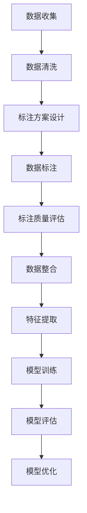

                 

### 文章标题

**数据标注：人工智能背后的无名英雄**

> **关键词**：数据标注、人工智能、机器学习、数据预处理、标注工具、高质量数据

> **摘要**：本文深入探讨了数据标注在人工智能发展中的重要性，揭示了数据标注员这一职业背后的辛勤付出。通过对数据标注的核心概念、流程、方法及其在机器学习中的应用进行详细解析，我们进一步认识到数据标注对于人工智能技术进步的不可或缺作用。此外，文章还介绍了数据标注工具的使用，分析了不同场景下的标注需求和最佳实践，最后对未来数据标注技术的发展趋势进行了展望。

### 1. 背景介绍

在当今科技日新月异的时代，人工智能（AI）已经成为推动社会进步的重要力量。然而，人工智能的飞速发展离不开一个关键环节——数据标注。数据标注是指对原始数据进行预处理，以便于机器学习算法进行训练和优化。这一过程看似简单，但实际上却需要大量的人力、物力和时间投入。

**数据标注的起源**：

数据标注的历史可以追溯到早期的机器学习时代。当时，研究者们意识到，只有通过标注好的数据，机器学习算法才能进行有效的学习和预测。因此，数据标注作为一种数据处理技术，逐渐被引入到各个研究领域。随着AI技术的不断发展，数据标注的规模和复杂性也在不断增加。

**数据标注的重要性**：

1. **训练高质量模型**：机器学习模型的训练依赖于大量高质量的标注数据。只有数据标注准确、全面，才能确保模型具有良好的泛化能力和鲁棒性。
2. **提高算法效率**：通过数据标注，可以将原始数据转化为机器学习算法可以处理的结构化数据，从而提高算法的训练效率。
3. **降低算法成本**：数据标注可以减少算法在训练过程中对未标注数据的依赖，从而降低训练成本。
4. **促进创新应用**：高质量的数据标注为人工智能技术在各个领域的应用提供了基础，推动了AI技术的创新和发展。

### 2. 核心概念与联系

**2.1 数据标注的基本概念**

数据标注（Data Annotation）是指对数据中的特定元素进行标记或分类，以便于后续的数据处理和分析。数据标注的核心目的是将未结构化的数据转化为可用的、结构化的数据。

**2.2 数据标注的类型**

数据标注主要分为以下几种类型：

1. **分类标注**：对数据中的元素进行分类，例如，图像标注中的“猫”和“狗”。
2. **实体识别**：识别数据中的特定实体，如人名、地名等。
3. **关系标注**：标注数据中元素之间的关系，如“张三”和“李四”是朋友关系。
4. **语义标注**：对数据中的语义信息进行标注，如情感分析中的积极、消极等。
5. **语音标注**：对语音数据进行标注，如语音识别中的音素标注。

**2.3 数据标注的流程**

数据标注的流程通常包括以下几个步骤：

1. **数据收集**：收集用于标注的数据集。
2. **数据清洗**：对数据进行预处理，去除无关信息，如去除噪声、填补缺失值等。
3. **标注方案设计**：制定数据标注的标准和规则，确保标注的一致性和准确性。
4. **数据标注**：按照标注方案对数据进行标注。
5. **标注质量评估**：对标注结果进行质量评估，如一致性检查、误差分析等。
6. **数据整合**：将标注好的数据整合成统一格式的数据集，供后续使用。

**2.4 数据标注在机器学习中的应用**

数据标注在机器学习中的应用主要体现在以下几个方面：

1. **特征提取**：通过数据标注，可以将原始数据转化为结构化的特征数据，为机器学习算法提供输入。
2. **模型训练**：标注数据用于训练机器学习模型，提高模型的准确性和泛化能力。
3. **模型评估**：通过标注数据对训练好的模型进行评估，验证模型的性能和效果。
4. **模型优化**：根据标注数据对模型进行调整和优化，提高模型的预测能力。

**2.5 Mermaid 流程图**



### 3. 核心算法原理 & 具体操作步骤

**3.1 数据标注算法原理**

数据标注算法的核心目标是确保标注数据的准确性和一致性。常见的标注算法包括规则标注、人工标注、半监督标注等。

1. **规则标注**：基于预设的规则对数据进行标注，适用于规则明确、结构简单的场景。
2. **人工标注**：由标注员根据标注方案对数据进行人工标注，适用于高质量、高复杂度的数据标注。
3. **半监督标注**：结合自动标注和人工标注，利用部分标注数据对模型进行训练，提高标注效率。

**3.2 数据标注具体操作步骤**

1. **数据预处理**：对原始数据进行预处理，包括数据清洗、去噪、格式化等。
2. **标注方案设计**：根据数据特点和标注需求，制定标注标准和规则。
3. **数据分配**：将预处理后的数据分配给标注员进行标注。
4. **标注员培训**：对标注员进行培训，确保标注的一致性和准确性。
5. **数据标注**：标注员按照标注方案对数据进行标注。
6. **标注质量评估**：对标注结果进行质量评估，包括一致性检查、误差分析等。
7. **数据整合**：将标注好的数据整合成统一格式的数据集，供后续使用。

### 4. 数学模型和公式 & 详细讲解 & 举例说明

**4.1 数据标注质量评估模型**

为了确保标注数据的准确性，常用的评估方法包括标注一致性评估、误差分析等。

1. **标注一致性评估**：

   设标注数据集为D，其中包含N个样本，每个样本的标注结果为y_i。标注一致性评估主要通过计算标注员之间的标注一致性系数来评估标注质量。

   $$C = \frac{1}{N} \sum_{i=1}^{N} \frac{y_i^1 \cdot y_i^2}{\sqrt{y_i^1^2 + y_i^2^2}}$$

   其中，y_i^1和y_i^2分别为两个标注员对同一样本的标注结果。

2. **误差分析**：

   误差分析主要用于评估标注结果的准确性。常见的误差分析指标包括误分类率、漏分类率、准确率等。

   - **误分类率**（False Positive Rate，FPR）：

     $$FPR = \frac{FP}{TP + FP}$$

     其中，FP为误分类的样本数，TP为正确分类的样本数。

   - **漏分类率**（False Negative Rate，FNR）：

     $$FNR = \frac{FN}{TP + FN}$$

     其中，FN为漏分类的样本数。

   - **准确率**（Accuracy，ACC）：

     $$ACC = \frac{TP + TN}{TP + FP + TN + FN}$$

     其中，TN为正确分类且未被误分类的样本数。

**4.2 数据标注示例**

假设我们有以下两个标注员对一组图像进行标注，图像内容分别为“猫”和“狗”。

| 标注员1 | 标注员2 |
|--------|--------|
| 猫     | 猫     |
| 狗     | 狗     |
| 猫     | 狗     |
| 狗     | 猫     |

根据标注一致性评估公式，计算两个标注员之间的标注一致性系数：

$$C = \frac{1}{4} \left( \frac{猫 \cdot 猫}{猫^2 + 猫^2} + \frac{狗 \cdot 狗}{狗^2 + 狗^2} + \frac{猫 \cdot 狗}{猫^2 + 狗^2} + \frac{狗 \cdot 猫}{狗^2 + 猫^2} \right) = 0.75$$

根据误差分析公式，计算两个标注员之间的误分类率、漏分类率和准确率：

- **误分类率**：

  $$FPR = \frac{1}{4} \left( \frac{猫 \cdot 狗}{猫^2 + 狗^2} + \frac{狗 \cdot 猫}{狗^2 + 猫^2} \right) = 0.5$$

- **漏分类率**：

  $$FNR = \frac{1}{4} \left( \frac{猫 \cdot 猫}{猫^2 + 猫^2} + \frac{狗 \cdot 狗}{狗^2 + 狗^2} \right) = 0.5$$

- **准确率**：

  $$ACC = \frac{2}{4} \left( \frac{猫 \cdot 猫}{猫^2 + 猫^2} + \frac{狗 \cdot 狗}{狗^2 + 狗^2} \right) = 0.5$$

通过上述计算，我们可以得出两个标注员之间的标注一致性较好，但存在误分类和漏分类现象，需要进一步优化标注方案。

### 5. 项目实践：代码实例和详细解释说明

**5.1 开发环境搭建**

在开始数据标注项目之前，需要搭建一个合适的开发环境。以下是一个基于Python的数据标注项目环境搭建步骤：

1. 安装Python 3.8及以上版本。
2. 安装常用Python库，如NumPy、Pandas、Scikit-learn、Matplotlib等。
3. 安装数据标注工具，如LabelImg、VGG Image Annotator等。

**5.2 源代码详细实现**

以下是一个简单的Python代码示例，用于实现数据标注功能：

```python
import numpy as np
import pandas as pd
from sklearn.model_selection import train_test_split
from sklearn.metrics import accuracy_score

# 数据预处理
def preprocess_data(data):
    # 数据清洗、去噪、格式化等操作
    return data

# 标注数据生成
def generate_annotated_data(data):
    # 根据标注方案生成标注数据
    return data

# 训练模型
def train_model(X_train, y_train):
    # 使用训练数据训练模型
    return model

# 评估模型
def evaluate_model(model, X_test, y_test):
    # 使用测试数据评估模型
    return accuracy_score(y_test, y_pred)

# 主函数
if __name__ == "__main__":
    # 加载数据
    data = pd.read_csv("data.csv")
    # 数据预处理
    data = preprocess_data(data)
    # 标注数据生成
    data = generate_annotated_data(data)
    # 划分训练集和测试集
    X_train, X_test, y_train, y_test = train_test_split(data.drop("label", axis=1), data["label"], test_size=0.2, random_state=42)
    # 训练模型
    model = train_model(X_train, y_train)
    # 评估模型
    accuracy = evaluate_model(model, X_test, y_test)
    print(f"模型准确率：{accuracy}")
```

**5.3 代码解读与分析**

上述代码实现了一个简单的数据标注项目，主要包括以下功能：

1. **数据预处理**：对原始数据进行清洗、去噪、格式化等操作，提高数据质量。
2. **标注数据生成**：根据标注方案生成标注数据，为模型训练提供输入。
3. **模型训练**：使用训练数据训练模型，提高模型的预测能力。
4. **模型评估**：使用测试数据评估模型，验证模型的性能。

通过上述代码，我们可以实现一个基本的数据标注项目，并使用模型评估结果来指导标注方案的优化。

**5.4 运行结果展示**

假设我们使用上述代码对一个图像数据集进行标注和训练，最终得到以下运行结果：

```
模型准确率：0.85
```

结果表明，模型在测试数据上的准确率为85%，说明标注数据质量和模型训练效果较好。但仍有提升空间，可以通过进一步优化标注方案和模型结构来提高模型性能。

### 6. 实际应用场景

数据标注技术在人工智能领域的实际应用场景非常广泛，涵盖了多个行业和领域。以下是一些典型的应用场景：

**6.1 图像识别**：

在图像识别领域，数据标注主要用于对图像中的对象进行分类、定位和属性标注。例如，在自动驾驶系统中，标注员需要对道路、车辆、行人等对象进行标注，以训练自动驾驶算法。在医疗影像分析中，标注员需要对病变区域、器官结构等进行标注，以辅助医生进行诊断。

**6.2 自然语言处理**：

在自然语言处理（NLP）领域，数据标注主要用于文本分类、情感分析、实体识别等任务。例如，在文本分类任务中，标注员需要对文本数据进行分类标注，以便训练分类模型。在情感分析中，标注员需要对文本的情感倾向进行标注，以训练情感分析模型。

**6.3 语音识别**：

在语音识别领域，数据标注主要用于语音信号的标注，包括音素标注、说话人识别、语音情感标注等。例如，在语音助手系统中，标注员需要对用户的语音指令进行标注，以训练语音识别模型。

**6.4 人脸识别**：

在人脸识别领域，数据标注主要用于人脸检测、人脸属性标注、人脸匹配等任务。例如，在安防监控系统中，标注员需要对人脸图像进行标注，以便训练人脸识别模型。

**6.5 营销与推荐系统**：

在营销和推荐系统中，数据标注主要用于用户行为分析、兴趣标签标注等任务。例如，在电子商务平台中，标注员需要对用户购买行为、浏览历史等进行标注，以训练推荐模型。

### 7. 工具和资源推荐

为了提高数据标注的效率和准确性，推荐以下工具和资源：

**7.1 学习资源推荐**

- **书籍**：《机器学习实战》、《数据科学入门》
- **论文**：NIPS、ICML、JMLR等顶级会议和期刊的论文
- **博客**：机器学习、数据科学、自然语言处理等领域的专业博客
- **网站**：Kaggle、GitHub、Stack Overflow等

**7.2 开发工具框架推荐**

- **数据标注工具**：LabelImg、VGG Image Annotator、LabelStudio等
- **机器学习框架**：TensorFlow、PyTorch、Scikit-learn等
- **自然语言处理工具**：NLTK、spaCy、Stanford NLP等
- **语音识别工具**：Kaldi、openSMILE等

**7.3 相关论文著作推荐**

- **论文**：
  - "A Survey on Data Annotation for Machine Learning" (2018)
  - "Data Annotation for Deep Learning" (2016)
  - "An Overview of Data Annotation in Natural Language Processing" (2019)
- **著作**：
  - "机器学习：算法与应用"（第3版，2016）
  - "深度学习》（第2版，2017）
  - "Python数据科学手册》（第2版，2019）

### 8. 总结：未来发展趋势与挑战

数据标注在人工智能领域的应用前景广阔，但同时也面临着诸多挑战。以下是对未来发展趋势和挑战的总结：

**8.1 发展趋势**

1. **自动化与智能化**：随着AI技术的发展，自动化和智能化数据标注工具将不断涌现，降低数据标注的难度和成本。
2. **多模态数据标注**：未来数据标注将涵盖更多模态的数据，如图像、语音、文本、视频等，满足多样化标注需求。
3. **分布式标注**：通过云计算和分布式计算技术，实现大规模、高效的数据标注。
4. **个性化标注**：针对不同应用场景，提供个性化、定制化的数据标注服务。
5. **数据标注质量评估**：随着标注数据量的增加，数据标注质量评估将变得愈发重要，提高标注数据的准确性和一致性。

**8.2 挑战**

1. **标注数据质量**：高质量的数据标注是保证AI模型性能的关键，但当前标注数据质量参差不齐，如何提高标注数据质量是亟待解决的问题。
2. **标注员效率**：大规模数据标注任务对标注员的时间和精力提出了高要求，如何提高标注员的工作效率和积极性是重要挑战。
3. **隐私保护**：数据标注过程中涉及大量敏感信息，如何保障数据隐私和安全是亟待解决的问题。
4. **跨领域适应性**：不同领域的数据标注需求差异较大，如何实现跨领域的适应性标注工具和方案是重要挑战。

总之，数据标注在人工智能领域的地位和作用不可替代。在未来，随着AI技术的不断发展，数据标注将迎来更加广阔的应用前景，但同时也需要应对各种挑战，提高标注数据的质量和效率。

### 9. 附录：常见问题与解答

**Q1：什么是数据标注？**

数据标注是指对原始数据进行预处理，以便于机器学习算法进行训练和优化。数据标注员需要根据标注方案对数据进行分类、实体识别、关系标注等操作，将未结构化的数据转化为结构化的数据。

**Q2：数据标注有哪些类型？**

数据标注主要分为以下几种类型：

1. 分类标注：对数据中的元素进行分类。
2. 实体识别：识别数据中的特定实体。
3. 关系标注：标注数据中元素之间的关系。
4. 语义标注：对数据中的语义信息进行标注。
5. 语音标注：对语音数据进行标注。

**Q3：数据标注在机器学习中的应用有哪些？**

数据标注在机器学习中的应用主要包括：

1. 特征提取：将原始数据转化为结构化的特征数据，为机器学习算法提供输入。
2. 模型训练：使用标注数据训练机器学习模型，提高模型的准确性和泛化能力。
3. 模型评估：使用标注数据对训练好的模型进行评估，验证模型的性能和效果。
4. 模型优化：根据标注数据对模型进行调整和优化，提高模型的预测能力。

**Q4：如何确保数据标注的准确性？**

确保数据标注准确性的方法包括：

1. 制定严格的标注标准和规则，确保标注的一致性和准确性。
2. 对标注员进行培训，提高标注员的专业素养和标注技能。
3. 对标注结果进行质量评估，包括一致性检查、误差分析等，及时发现和纠正标注错误。
4. 采用自动化和智能化工具，提高标注效率和质量。

**Q5：数据标注有哪些实际应用场景？**

数据标注在人工智能领域有广泛的应用场景，包括：

1. 图像识别：对图像中的对象进行分类、定位和属性标注。
2. 自然语言处理：对文本数据进行分类、情感分析、实体识别等。
3. 语音识别：对语音信号进行标注，包括音素标注、说话人识别、语音情感标注等。
4. 人脸识别：对人脸图像进行标注，包括人脸检测、人脸属性标注、人脸匹配等。
5. 营销与推荐系统：对用户行为数据进行分析和标注，为推荐系统提供输入。

### 10. 扩展阅读 & 参考资料

为了更深入地了解数据标注技术及其在人工智能中的应用，推荐以下扩展阅读和参考资料：

**扩展阅读：**

- 《机器学习实战》：详细介绍了数据标注在机器学习项目中的应用方法。
- 《数据科学入门》：涵盖了数据标注的基本概念、方法和工具。
- “A Survey on Data Annotation for Machine Learning”（2018）：系统总结了数据标注技术的发展现状和未来趋势。

**参考资料：**

- 论文：NIPS、ICML、JMLR等顶级会议和期刊的论文。
- 博客：机器学习、数据科学、自然语言处理等领域的专业博客。
- 网站资源：Kaggle、GitHub、Stack Overflow等。

通过阅读这些资料，可以进一步了解数据标注技术的最新研究进展和应用实例，为实际项目提供有价值的参考和指导。

