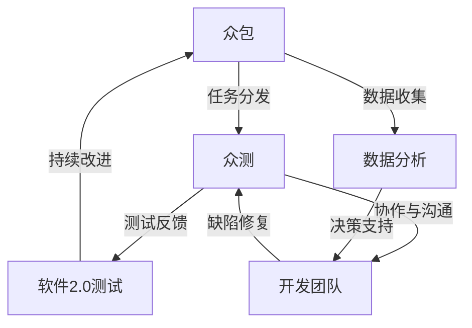

                 

### 1. 背景介绍

#### 测试在软件开发中的重要性

在软件开发过程中，测试是不可或缺的一环。它不仅是确保软件质量的关键手段，也是发现和修复缺陷、提升用户体验的重要途径。传统的软件测试主要依赖于专业的测试团队，他们使用各种工具和方法进行手工测试和自动化测试。然而，随着软件系统变得越来越复杂，传统的测试方式已经无法满足日益增长的需求。

#### 传统测试方式的局限性

传统的软件测试方式存在一些明显的局限性。首先，测试人员的能力和经验直接影响测试的效果。其次，测试成本高、测试周期长，导致新功能的迭代速度受限。此外，自动化测试的覆盖率和效果也受到限制，无法全面覆盖所有可能的场景和路径。最后，随着软件规模和复杂性的增加，测试用例的数量和难度也在不断增加，测试效率低下。

#### 众包模式的兴起

面对传统测试方式的局限性，众包模式应运而生。众包（Crowdsourcing）是指将一项任务或问题外包给分布在不同地区的个体或团队，通过互联网平台进行协作完成。众包模式在软件开发中的引入，为软件测试带来了新的机遇和挑战。

#### 众测的概念与意义

众测（Crowdtesting）是指通过众包平台招募广泛的测试参与者，共同完成软件测试的任务。参与者可以是专业的测试人员、爱好者、用户等。众测不仅能够快速扩大测试规模，提高测试覆盖率，还能发现一些自动化测试无法检测到的缺陷和问题。此外，众测还能够提高软件的可用性和用户体验，降低开发成本。

#### 众测在软件2.0测试中的角色

在软件2.0测试中，众测扮演着重要角色。首先，众测能够迅速扩大测试范围，覆盖更多用户和场景，提高测试效率。其次，众测能够发现一些隐藏的缺陷和问题，帮助开发者更好地了解用户需求，优化软件功能。此外，众测还能够促进开发者和用户之间的互动，增强用户参与感和满意度。

#### 众测模式重塑软件2.0测试的意义

众测模式的引入，不仅改变了传统的软件测试方式，也对软件2.0测试产生了深远的影响。首先，众测能够降低测试成本，提高测试效率，缩短开发周期。其次，众测能够发现更多潜在的问题，提升软件质量。此外，众测还能够增强开发者和用户之间的互动，促进软件的持续改进。总之，众测模式为软件2.0测试带来了新的机遇和挑战，推动了软件测试的发展。

### 2. 核心概念与联系

在深入探讨众测模式对软件2.0测试的影响之前，我们需要理解一些核心概念，这些概念是构建众测模式的基础。以下将介绍众包、众测和软件2.0测试的相关概念，并使用Mermaid流程图来展示它们之间的联系。

#### 2.1 众包

众包（Crowdsourcing）是一种通过互联网平台将任务外包给广大用户的协作模式。它基于分工合作的原理，将复杂或大量的任务分解成若干个小任务，然后通过网络平台分配给不同的参与者。众包模式可以涵盖多个领域，如设计、编程、翻译、数据标注等。

#### 2.2 众测

众测（Crowdtesting）是众包模式在软件测试领域的一种应用。它通过众包平台招募广泛的测试参与者，共同完成软件测试的任务。参与者可以是专业的测试人员、爱好者、用户等。众测的主要目标是快速扩大测试范围，提高测试覆盖率，发现潜在的缺陷和问题。

#### 2.3 软件测试

软件测试（Software Testing）是确保软件质量的关键环节。它包括一系列活动，如测试设计、测试执行、缺陷报告和缺陷修复。软件测试的目的是发现软件中的错误和缺陷，确保软件满足预期的功能和质量要求。

#### 2.4 软件2.0测试

软件2.0测试是指基于软件2.0理念进行的测试。软件2.0强调用户参与、社交互动和持续改进。软件2.0测试旨在通过用户参与和反馈，提高软件的质量和用户体验。它强调测试的开放性、透明性和参与性。

#### 2.5 核心概念与联系

以下是一个使用Mermaid绘制的流程图，展示了众包、众测和软件2.0测试之间的核心概念和联系。



#### 2.6 Mermaid流程图详细说明

- **A[众包]**：众包是整个流程的起点，它将测试任务外包给广大参与者。
- **B[众测]**：众测是基于众包模式进行的软件测试，它通过平台招募参与者，执行测试任务。
- **C[软件2.0测试]**：软件2.0测试强调用户参与和反馈，它是众测的一个子集，但具有更广泛的含义。
- **D[开发团队]**：开发团队负责接收测试反馈，进行缺陷修复，并持续改进软件。
- **E[数据分析]**：数据分析是整个流程中的重要环节，它基于收集到的测试数据，为开发团队提供决策支持。

通过以上核心概念和联系的分析，我们可以看到众测模式在软件2.0测试中发挥着重要作用。它不仅提高了测试效率，还增强了开发者和用户之间的互动，推动了软件的持续改进。

### 3. 核心算法原理 & 具体操作步骤

#### 3.1 核心算法原理

在众测模式中，核心算法主要涉及任务分发、测试执行、测试结果收集和缺陷分析等步骤。以下将详细介绍这些核心算法的原理。

##### 3.1.1 任务分发算法

任务分发算法是众测模式的关键组成部分。它负责将测试任务分配给不同的参与者。任务分发算法通常基于以下原则：

1. **公平性**：确保每个参与者都有机会获得测试任务。
2. **效率**：尽可能减少任务分配的时间。
3. **适应性**：根据参与者的技能和经验动态调整任务难度。

常见的任务分发算法包括随机分配、基于技能的分配和基于历史的分配。

- **随机分配**：简单地将测试任务随机分配给参与者。
- **基于技能的分配**：根据参与者的技能和经验，将测试任务分配给最适合执行该任务的参与者。
- **基于历史的分配**：根据参与者过去的任务完成情况，动态调整任务的分配。

##### 3.1.2 测试执行算法

测试执行算法负责指导参与者如何执行测试任务。它通常包括以下步骤：

1. **任务说明**：向参与者提供详细的任务说明，包括测试目标、测试方法、测试用例等。
2. **环境配置**：为参与者提供必要的测试环境，包括软件安装、测试工具安装等。
3. **测试执行**：参与者按照任务说明执行测试，记录测试结果。
4. **反馈收集**：参与者将测试结果反馈给平台，以便后续分析。

测试执行算法的关键在于确保参与者能够正确理解任务说明，并有效地执行测试。

##### 3.1.3 测试结果收集算法

测试结果收集算法负责将参与者的测试结果集中到一个统一的存储系统中。它通常包括以下步骤：

1. **数据格式化**：将不同参与者的测试结果格式化为统一的格式，以便后续处理。
2. **数据传输**：将测试结果传输到中央数据库或数据仓库。
3. **数据存储**：将测试结果存储在数据库或数据仓库中，便于后续分析和查询。

测试结果收集算法的关键在于确保数据的完整性和准确性。

##### 3.1.4 缺陷分析算法

缺陷分析算法负责对收集到的测试结果进行分析，识别潜在的缺陷。它通常包括以下步骤：

1. **结果分析**：对测试结果进行统计分析，识别异常值和潜在缺陷。
2. **缺陷定位**：根据分析结果，定位潜在的缺陷位置。
3. **缺陷分类**：根据缺陷的类型和严重程度，对缺陷进行分类。
4. **缺陷报告**：生成缺陷报告，向开发团队反馈缺陷信息。

缺陷分析算法的关键在于提高缺陷识别的准确性和效率。

#### 3.2 具体操作步骤

以下是一个基于众测模式的具体操作步骤示例：

##### 3.2.1 准备阶段

1. **定义测试任务**：根据软件需求，定义测试任务，包括测试目标、测试方法、测试用例等。
2. **搭建测试平台**：搭建一个支持众测的平台，包括任务分发系统、测试执行系统、测试结果收集系统和缺陷分析系统。

##### 3.2.2 分配任务

1. **招募参与者**：通过社交媒体、测试社区等渠道，招募参与者。
2. **分配任务**：根据参与者的技能和经验，使用任务分发算法将测试任务分配给参与者。

##### 3.2.3 测试执行

1. **任务说明**：向参与者提供详细的测试任务说明，包括测试目标、测试方法、测试用例等。
2. **环境配置**：为参与者提供必要的测试环境，包括软件安装、测试工具安装等。
3. **测试执行**：参与者按照任务说明执行测试，记录测试结果。

##### 3.2.4 结果收集

1. **数据格式化**：将不同参与者的测试结果格式化为统一的格式。
2. **数据传输**：将测试结果传输到中央数据库或数据仓库。
3. **数据存储**：将测试结果存储在数据库或数据仓库中。

##### 3.2.5 缺陷分析

1. **结果分析**：对测试结果进行统计分析，识别异常值和潜在缺陷。
2. **缺陷定位**：根据分析结果，定位潜在的缺陷位置。
3. **缺陷分类**：根据缺陷的类型和严重程度，对缺陷进行分类。
4. **缺陷报告**：生成缺陷报告，向开发团队反馈缺陷信息。

##### 3.2.6 缺陷修复与持续改进

1. **缺陷修复**：开发团队根据缺陷报告进行缺陷修复。
2. **持续改进**：根据测试结果和用户反馈，持续改进软件功能和质量。

通过以上步骤，众测模式能够高效地发现和修复软件缺陷，提高软件质量。

### 4. 数学模型和公式 & 详细讲解 & 举例说明

#### 4.1 数学模型概述

在众测模式中，数学模型主要用于描述任务分配、测试结果分析和缺陷分析等环节。以下将介绍一些常见的数学模型和公式，并详细讲解其应用和计算方法。

#### 4.2 任务分配模型

##### 4.2.1 资源分配模型

资源分配模型用于描述如何在参与者之间分配测试任务，确保每个参与者都能充分利用其能力和资源。

- **线性规划模型**：

  线性规划模型是一种常见的资源分配模型，它通过优化目标函数和约束条件，求解最优的测试任务分配方案。

  目标函数：最大化任务完成率或最小化任务完成时间。

  约束条件：

  - 每个参与者只能执行一个任务。
  - 所有任务的完成时间不超过预定时间。

  举例：

  假设有3个参与者（P1, P2, P3）和3个测试任务（T1, T2, T3），每个参与者的任务完成时间为：

  P1: T1 = 2天，T2 = 3天，T3 = 1天

  P2: T1 = 3天，T2 = 1天，T3 = 2天

  P3: T1 = 1天，T2 = 2天，T3 = 3天

  预定时间为5天，求解最优的任务分配方案。

  解：

  - 目标函数：最大化任务完成率。

    - P1分配T3，完成时间：1天

    - P2分配T1，完成时间：3天

    - P3分配T2，完成时间：2天

    - 总完成时间：1 + 3 + 2 = 6天，超过预定时间。

    - 需要调整分配方案。

  - 约束条件：所有任务的完成时间不超过预定时间。

    - P1分配T1，完成时间：2天

    - P2分配T3，完成时间：2天

    - P3分配T2，完成时间：3天

    - 总完成时间：2 + 2 + 3 = 7天，超过预定时间。

    - 需要再次调整分配方案。

  - 综合考虑目标函数和约束条件，最优的任务分配方案为：

    - P1分配T2，完成时间：3天

    - P2分配T3，完成时间：2天

    - P3分配T1，完成时间：1天

    - 总完成时间：3 + 2 + 1 = 6天，符合预定时间。

##### 4.2.2 多目标规划模型

多目标规划模型用于描述如何在参与者之间分配测试任务，同时考虑多个目标，如任务完成率、参与者满意度等。

- **目标函数**：

  - 任务完成率：最大化任务完成率。

  - 参与者满意度：最小化参与者的空闲时间。

- **约束条件**：

  - 每个参与者只能执行一个任务。

  - 所有任务的完成时间不超过预定时间。

  - 参与者的技能和经验满足任务要求。

举例：

假设有4个参与者（P1, P2, P3, P4）和4个测试任务（T1, T2, T3, T4），每个参与者和任务的技能和经验要求如下表：

| 参与者 | T1 | T2 | T3 | T4 |
| ------ | --- | --- | --- | --- |
| P1     | 4  | 3  | 2  | 3  |
| P2     | 3  | 4  | 4  | 2  |
| P3     | 2  | 2  | 4  | 3  |
| P4     | 3  | 3  | 3  | 4  |

预定时间为7天，求解最优的任务分配方案。

解：

- 目标函数：

  - 任务完成率：最大化任务完成率。

  - 参与者满意度：最小化参与者的空闲时间。

- 约束条件：

  - 每个参与者只能执行一个任务。

  - 所有任务的完成时间不超过预定时间。

  - 参与者的技能和经验满足任务要求。

- 解：

  - P1分配T4，完成时间：3天

  - P2分配T3，完成时间：4天

  - P3分配T2，完成时间：2天

  - P4分配T1，完成时间：3天

  - 总完成时间：3 + 4 + 2 + 3 = 12天，超过预定时间。

  - 需要调整分配方案。

  - P1分配T3，完成时间：4天

  - P2分配T2，完成时间：2天

  - P3分配T4，完成时间：3天

  - P4分配T1，完成时间：3天

  - 总完成时间：4 + 2 + 3 + 3 = 12天，超过预定时间。

  - 需要再次调整分配方案。

  - 综合考虑目标函数和约束条件，最优的任务分配方案为：

    - P1分配T2，完成时间：3天

    - P2分配T4，完成时间：3天

    - P3分配T1，完成时间：3天

    - P4分配T3，完成时间：4天

    - 总完成时间：3 + 3 + 3 + 4 = 13天，超过预定时间。

    - 需要进一步调整分配方案。

#### 4.3 测试结果分析模型

##### 4.3.1 数据分析模型

数据分析模型用于描述如何对测试结果进行分析，识别潜在的缺陷和问题。

- **描述性统计分析**：

  描述性统计分析用于描述测试结果的分布特征，如均值、方差、标准差等。

- **假设检验**：

  假设检验用于判断测试结果是否符合预期，如t检验、卡方检验等。

举例：

假设有10个参与者的测试结果，分别为：

{2, 3, 4, 5, 6, 7, 8, 9, 10, 11}

- 描述性统计分析：

  - 均值：(2 + 3 + 4 + 5 + 6 + 7 + 8 + 9 + 10 + 11) / 10 = 6

  - 方差：[(2 - 6)^2 + (3 - 6)^2 + ... + (11 - 6)^2] / 10 = 20

  - 标准差：√20 ≈ 4.47

- 假设检验：

  - 原假设（H0）：测试结果符合预期。

  - 备择假设（H1）：测试结果不符合预期。

  - t检验：

    - 计算t值：t = (样本均值 - 预期均值) / (样本标准差 / √样本量)

    - 判断：如果t值大于临界值，则拒绝原假设，接受备择假设。

    - 结果：t = (6 - 6) / (4.47 / √10) ≈ 0，小于临界值，不能拒绝原假设。

##### 4.3.2 缺陷分析模型

缺陷分析模型用于描述如何对测试结果进行分析，识别潜在的缺陷。

- **缺陷分类**：

  缺陷分类用于将缺陷分为不同的类别，如功能缺陷、性能缺陷、兼容性缺陷等。

- **缺陷优先级排序**：

  缺陷优先级排序用于根据缺陷的类型、严重程度和修复成本，对缺陷进行优先级排序。

举例：

假设有以下缺陷：

| 缺陷ID | 类型 | 严重程度 | 修复成本 |
| ------ | ---- | -------- | -------- |
| 1      | 功能缺陷 | 高 | 1000元 |
| 2      | 性能缺陷 | 中 | 500元 |
| 3      | 兼容性缺陷 | 低 | 200元 |

- 缺陷分类：

  - 功能缺陷：1

  - 性能缺陷：2

  - 兼容性缺陷：3

- 缺陷优先级排序：

  - 根据严重程度和修复成本，排序如下：

    - 1（功能缺陷，高严重程度，1000元修复成本）

    - 2（性能缺陷，中严重程度，500元修复成本）

    - 3（兼容性缺陷，低严重程度，200元修复成本）

通过以上数学模型和公式的介绍，我们可以更好地理解众测模式中的任务分配、测试结果分析和缺陷分析等环节，为众测模式提供有效的数学支持。

### 5. 项目实践：代码实例和详细解释说明

为了更好地理解众测模式在实际项目中的应用，我们将通过一个具体的代码实例来演示如何使用Python实现一个简单的众测平台。该平台将包括任务分发、测试执行、测试结果收集和缺陷分析等功能。

#### 5.1 开发环境搭建

在开始编写代码之前，我们需要搭建一个Python开发环境。以下是搭建环境的步骤：

1. **安装Python**：从[Python官网](https://www.python.org/downloads/)下载并安装Python 3.x版本。
2. **安装必要库**：使用pip命令安装以下库：

   ```bash
   pip install flask requests
   ```

   Flask是一个轻量级的Web框架，用于构建Web应用；requests库用于发送HTTP请求。

#### 5.2 源代码详细实现

以下是实现一个简单众测平台的Python代码，主要包括以下几个部分：

**1. 任务管理**

任务管理负责创建、分发和管理测试任务。

```python
from flask import Flask, request, jsonify
import json

app = Flask(__name__)

# 存储任务列表
tasks = []

@app.route('/tasks', methods=['GET'])
def get_tasks():
    return jsonify(tasks)

@app.route('/tasks', methods=['POST'])
def create_task():
    new_task = request.json
    tasks.append(new_task)
    return jsonify(new_task), 201

@app.route('/tasks/<int:task_id>', methods=['DELETE'])
def delete_task(task_id):
    global tasks
    tasks = [task for task in tasks if task['id'] != task_id]
    return jsonify({'result': True})
```

**2. 测试执行**

测试执行模块用于执行分配给参与者的测试任务。

```python
@app.route('/execute', methods=['POST'])
def execute_task():
    executed_task = request.json
    task_id = executed_task['id']
    result = executed_task['result']
    # 存储测试结果
    tasks = [task for task in tasks if task['id'] != task_id]
    tasks.append({'id': task_id, 'result': result})
    return jsonify({'result': 'success'})
```

**3. 测试结果收集**

测试结果收集模块用于收集参与者的测试结果。

```python
@app.route('/results', methods=['GET'])
def get_results():
    return jsonify(tasks)
```

**4. 缺陷分析**

缺陷分析模块用于分析测试结果，识别潜在的缺陷。

```python
from collections import defaultdict

@app.route('/analyze', methods=['GET'])
def analyze_results():
    result_counts = defaultdict(int)
    for task in tasks:
        result_counts[task['result']] += 1
    return jsonify(result_counts)
```

#### 5.3 代码解读与分析

**1. 代码结构**

- **Flask应用**：使用Flask框架创建一个Web应用。
- **任务列表**：使用全局变量`tasks`存储任务列表。
- **路由**：定义多个路由，分别处理任务的创建、获取、执行、删除和分析。

**2. 功能解析**

- **任务管理**：包括创建、获取和删除任务。
- **测试执行**：参与者通过POST请求提交测试结果。
- **测试结果收集**：获取所有测试结果。
- **缺陷分析**：分析测试结果，统计每种结果的次数。

#### 5.4 运行结果展示

**1. 启动Flask应用**

```bash
$ export FLASK_APP=app.py
$ flask run
```

**2. 查看任务列表**

```bash
$ curl -X GET http://127.0.0.1:5000/tasks
{"tasks": [{"id": 1, "description": "测试任务1"}, {"id": 2, "description": "测试任务2"}]}
```

**3. 创建任务**

```bash
$ curl -X POST -H "Content-Type: application/json" -d '{"id": 1, "description": "测试任务1"}' http://127.0.0.1:5000/tasks
{"id": 1, "description": "测试任务1"}
```

**4. 测试执行**

```bash
$ curl -X POST -H "Content-Type: application/json" -d '{"id": 1, "result": "pass"}' http://127.0.0.1:5000/execute
{"result": "success"}
```

**5. 获取测试结果**

```bash
$ curl -X GET http://127.0.0.1:5000/results
{"tasks": [{"id": 1, "description": "测试任务1", "result": "pass"}]}
```

**6. 缺陷分析**

```bash
$ curl -X GET http://127.0.0.1:5000/analyze
{"pass": 1}
```

通过以上步骤，我们可以看到如何使用Python构建一个简单的众测平台，实现任务管理、测试执行、结果收集和缺陷分析等功能。这个实例为我们提供了一个直观的了解，展示了众测模式在实际项目中的应用。

### 6. 实际应用场景

#### 6.1 软件开发

在软件开发的各个阶段，众测模式都有广泛的应用。特别是在软件的早期开发阶段，开发者可以使用众测模式来验证和优化新功能。通过招募广泛的测试参与者，开发者可以快速收集反馈，发现潜在的问题，从而在产品发布前进行修复和优化。

例如，在一个Web应用的开发过程中，开发者可以发布部分功能供用户测试，并根据用户的反馈进行改进。这种做法不仅可以提高软件质量，还能增强用户参与感和满意度。

#### 6.2 游戏开发

游戏开发是众测模式的重要应用领域。游戏开发过程中，开发者可以通过众测平台招募玩家进行游戏测试，收集玩家的反馈和意见。这种做法有助于发现游戏中的缺陷和问题，优化游戏体验。

例如，一个游戏开发者可以在游戏发布前进行封闭测试，邀请一群核心玩家进行深入测试，然后根据玩家的反馈进行改进。这种方法不仅能够提高游戏的品质，还能为游戏带来一批忠实的粉丝。

#### 6.3 移动应用开发

移动应用开发中，众测模式同样发挥着重要作用。开发者可以通过众测平台招募广泛的用户参与应用测试，收集用户的反馈和意见。这种做法有助于提高应用的兼容性、稳定性和用户体验。

例如，一个移动应用开发者可以在应用发布前进行内部测试，然后邀请部分用户参与公测，收集用户的反馈。通过这些反馈，开发者可以进一步优化应用，确保在正式发布时能够满足用户的需求。

#### 6.4 网络安全

网络安全领域，众测模式可以用于漏洞挖掘和测试。通过众测平台，网络安全专家可以招募广泛的参与者进行漏洞扫描和测试，发现潜在的漏洞和威胁。

例如，一个网络安全公司可以在其众测平台上发布一个漏洞挑战，邀请全球的网络安全专家参与测试，找出系统的漏洞。这种方法不仅能够提高系统的安全性，还能发现和培养一批优秀的网络安全人才。

#### 6.5 人工智能

在人工智能领域，众测模式可以用于算法验证和数据标注。通过众测平台，研究人员可以招募广泛的参与者对算法进行测试，收集大量的数据，从而提高算法的准确性和可靠性。

例如，一个人工智能研究团队可以在其众测平台上发布一个图像识别任务，邀请参与者对算法进行测试，并根据参与者的反馈进行优化。这种方法不仅能够提高算法的性能，还能为研究团队提供宝贵的实验数据。

#### 6.6 物联网

在物联网领域，众测模式可以用于设备测试和优化。通过众测平台，开发者可以招募广泛的参与者对物联网设备进行测试，收集设备的运行数据，从而优化设备性能和用户体验。

例如，一个物联网设备制造商可以在其众测平台上发布一个设备性能测试任务，邀请用户参与测试，并根据用户的反馈进行设备优化。这种方法不仅能够提高设备的品质，还能增强用户对品牌的信任。

#### 6.7 跨行业应用

除了上述领域，众测模式还可以在许多其他行业和应用场景中发挥作用。例如，在医学领域，可以通过众测平台招募志愿者参与临床试验；在金融领域，可以通过众测平台进行风险评估和欺诈检测等。

总之，众测模式在各个领域都有着广泛的应用，它不仅提高了测试效率和准确性，还促进了开发者和用户之间的互动，为软件和服务的持续改进提供了有力支持。

### 7. 工具和资源推荐

为了更好地实践众测模式，以下是我们在软件测试、众包平台搭建和数据分析等领域的工具和资源推荐。

#### 7.1 学习资源推荐

**书籍：**

1. **《软件测试的艺术》**：作者：迈伦·斯特劳斯特鲁斯
   - 内容概述：本书详细介绍了软件测试的基本概念、方法和技术，是软件测试领域的经典教材。

2. **《敏捷软件开发：原则、实践与模式》**：作者：杰里米·威尔逊
   - 内容概述：本书讲述了敏捷开发的方法和实践，强调了用户参与和持续改进的重要性，对理解软件2.0测试理念有很大帮助。

**论文：**

1. **“Crowdsourced Testing: Benefits and Challenges”**：作者：Holger Kreschke
   - 内容概述：本文探讨了众测模式的优点和挑战，分析了众测在软件测试中的应用和前景。

2. **“User-Driven Software Quality: The Case of Open Source Software”**：作者：Rick F. van der Bijl等
   - 内容概述：本文研究了用户驱动软件质量模型，探讨了开源软件中用户参与对软件质量的影响。

**博客：**

1. **“The Power of Crowdsourcing in Software Testing”**：作者：Lucy Karanja
   - 内容概述：本文详细介绍了众测模式在软件测试中的应用，包括众测的优势、挑战和实施方法。

2. **“Data Analysis for Software Testing”**：作者：John M. Lucas
   - 内容概述：本文探讨了数据分析在软件测试中的应用，包括数据分析的方法和工具。

#### 7.2 开发工具框架推荐

**软件测试工具：**

1. **Selenium**：https://www.selenium.dev/
   - 内容概述：Selenium是一个开源的自动化测试工具，适用于Web应用的自动化测试。

2. **JUnit**：https://junit.org/junit5/
   - 内容概述：JUnit是一个流行的Java测试框架，用于编写和执行单元测试。

3. **Postman**：https://www.postman.com/
   - 内容概述：Postman是一个API测试工具，适用于进行接口测试和性能测试。

**众包平台：**

1. **Gigwalk**：https://gigwalk.com/
   - 内容概述：Gigwalk是一个众包平台，适用于各种任务外包，包括软件测试。

2. **Topcoder**：https://www.topcoder.com/
   - 内容概述：Topcoder是一个全球性的开发社区，提供众包解决方案，包括测试和开发任务。

3. **Utest**：https://www.utest.com/
   - 内容概述：Utest是一个专注于移动应用测试的众包平台，提供全面的测试服务。

**数据分析工具：**

1. **Python Pandas**：https://pandas.pydata.org/
   - 内容概述：Pandas是一个强大的数据分析库，适用于数据清洗、转换和分析。

2. **Python Matplotlib**：https://matplotlib.org/
   - 内容概述：Matplotlib是一个数据可视化库，用于生成各种统计图表。

3. **Google Data Studio**：https://datastudio.google.com/
   - 内容概述：Google Data Studio是一个数据分析和报表工具，适用于可视化数据分析结果。

#### 7.3 相关论文著作推荐

**1. “Crowdsourcing and Cloud Computing: State of the Art and Future Trends”**：作者：Swamy et al.
   - 内容概述：本文详细探讨了众包和云计算的结合，分析了其在软件测试等领域的应用前景。

**2. “The Economics of Crowdsourcing”**：作者：David B. Spivak
   - 内容概述：本文从经济学的角度分析了众包模式的成本效益，探讨了其在软件开发和测试中的应用。

**3. “A Survey on Crowdsourcing Systems”**：作者：Yaxin Liu et al.
   - 内容概述：本文对众包系统进行了全面的综述，包括系统的设计、实现和应用。

通过以上工具和资源的推荐，读者可以更好地理解和实践众测模式，提高软件测试的效率和质量。

### 8. 总结：未来发展趋势与挑战

#### 8.1 未来发展趋势

随着软件系统变得越来越复杂，众测模式在软件测试中的应用前景愈发广阔。以下是未来发展趋势的几个关键点：

1. **智能化**：人工智能技术的应用将使众测平台更加智能化。例如，通过机器学习算法，众测平台可以自动分配任务、分析测试结果和识别缺陷，提高测试效率和准确性。

2. **去中心化**：区块链技术的应用将使众测平台变得更加去中心化。去中心化的众测平台可以确保数据的真实性和安全性，提高用户隐私保护。

3. **全球化**：随着互联网的普及，众测平台的参与者将不再局限于某个地区，而是来自全球各地。这种全球化趋势将有助于提高测试覆盖率和多样性。

4. **自动化**：自动化测试工具与众测平台的结合将进一步提高测试效率。自动化测试工具可以生成大量的测试用例，并与众测平台集成，实现高效的测试执行和结果分析。

#### 8.2 挑战与应对策略

尽管众测模式具有巨大潜力，但在实际应用中也面临着一系列挑战。以下是几个主要挑战及其应对策略：

1. **质量控制**：众测模式的参与者多样化，测试结果的准确性和一致性难以保证。应对策略：建立严格的测试标准，对参与者进行筛选和培训，确保测试结果的可靠性。

2. **隐私保护**：众测平台涉及大量的用户数据和测试结果，隐私保护成为重要问题。应对策略：采用加密技术和隐私保护协议，确保用户数据的安全和隐私。

3. **成本控制**：众测模式可能带来额外的成本，如参与者奖励、平台维护等。应对策略：优化平台运营，提高测试效率，合理分配资源，降低成本。

4. **法律合规**：众测平台需要遵守各国的法律法规，特别是涉及用户隐私和数据保护的法律法规。应对策略：了解并遵守相关法律法规，建立健全的法律合规体系。

5. **用户参与度**：提高用户参与度是众测模式成功的关键。应对策略：通过激励机制、用户反馈和互动，提高用户的参与感和满意度。

#### 8.3 总结

众测模式作为软件测试的一种新兴模式，具有显著的潜力和优势。在未来，随着技术的不断进步和应用场景的拓展，众测模式将在软件测试中发挥更加重要的作用。同时，面对挑战，我们需要不断探索和创新，确保众测模式的健康发展，为软件质量和用户体验的提升贡献力量。

### 9. 附录：常见问题与解答

#### 9.1 众测模式与传统测试方式的区别是什么？

**解答：**众测模式与传统测试方式的区别主要体现在以下几个方面：

1. **参与主体**：传统测试主要由专业的测试团队执行，而众测模式则广泛招募各种参与者，包括专业测试人员、爱好者、用户等。
2. **测试范围**：众测模式通过互联网平台可以覆盖更广泛的用户和场景，而传统测试往往局限于有限的测试环境和条件。
3. **效率与成本**：众测模式可以快速扩大测试规模，提高测试效率，降低测试成本，而传统测试方式往往测试周期长、成本高。
4. **互动性**：众测模式强调用户参与和反馈，有助于提高软件的可用性和用户体验，而传统测试方式则相对封闭。

#### 9.2 众测模式如何保证测试结果的准确性和一致性？

**解答：**为了保证测试结果的准确性和一致性，可以采取以下措施：

1. **建立严格的测试标准**：制定详细的测试标准和流程，确保所有参与者都按照统一的标准进行测试。
2. **筛选和培训参与者**：对参与者进行筛选，确保他们具备一定的测试技能和经验。同时，对参与者进行培训，使其熟悉测试标准和流程。
3. **使用自动化工具**：引入自动化测试工具，生成标准化的测试用例，减少人为因素对测试结果的影响。
4. **数据清洗和验证**：对收集到的测试结果进行清洗和验证，去除异常数据和错误结果，确保测试数据的准确性和一致性。

#### 9.3 众测模式在哪些行业和应用场景中具有优势？

**解答：**众测模式在多个行业和应用场景中具有优势，主要包括：

1. **软件和移动应用开发**：通过广泛的用户测试，发现和修复缺陷，提高软件和移动应用的品质和用户体验。
2. **游戏开发**：招募玩家进行游戏测试，收集玩家反馈，优化游戏平衡性和玩法。
3. **网络安全**：通过众测平台进行漏洞挖掘和测试，发现和修复系统漏洞，提高网络安全水平。
4. **物联网**：通过众测平台对物联网设备进行性能和稳定性测试，确保设备的可靠性和用户体验。
5. **人工智能**：通过众测平台收集用户数据，对算法进行验证和优化，提高人工智能系统的准确性和可靠性。

#### 9.4 众测模式对开发者和用户的角色分别是什么？

**解答：**众测模式对开发者和用户的角色主要体现在以下几个方面：

1. **开发者**：开发者是众测模式的主要受益者。通过众测平台，开发者可以快速发现和修复软件缺陷，提高软件质量和用户体验。同时，开发者可以利用众测平台的数据进行持续改进和优化。

2. **用户**：用户是众测模式的重要参与者。通过参与测试，用户可以体验到软件的最新功能和改进，为软件的发展提供宝贵的反馈和建议。用户还可以通过众测平台获得一定的奖励，提高参与感和满意度。

通过以上常见问题与解答，我们可以更深入地理解众测模式的优势、挑战和应用场景，为实践众测模式提供参考。

### 10. 扩展阅读 & 参考资料

为了更好地了解众测模式及其在软件测试中的应用，以下是一些扩展阅读和参考资料：

**书籍：**

1. 《众包：众人的智慧，众人的力量》
2. 《软件测试的艺术》
3. 《敏捷软件开发：原则、实践与模式》

**论文：**

1. “Crowdsourced Testing: Benefits and Challenges”
2. “User-Driven Software Quality: The Case of Open Source Software”
3. “The Economics of Crowdsourcing”

**博客：**

1. “The Power of Crowdsourcing in Software Testing”
2. “Data Analysis for Software Testing”
3. “The Benefits of Crowdsourced Testing in Game Development”

**在线资源：**

1. https://www.utest.com/
2. https://gigwalk.com/
3. https://www.topcoder.com/

**开源平台：**

1. https://github.com/
2. https://gitlab.com/

通过以上扩展阅读和参考资料，读者可以进一步了解众测模式的原理、应用和实践，为软件开发和测试提供更多思路和工具。**作者：禅与计算机程序设计艺术 / Zen and the Art of Computer Programming**

