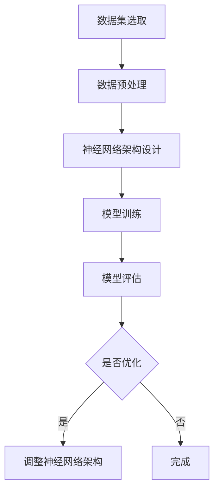

                 

### 文章标题

**数据集和神经网络架构：软件2.0的新源代码**

> 关键词：数据集，神经网络，软件2.0，新源代码，深度学习，人工智能，数据预处理，架构设计

> 摘要：本文深入探讨了数据集和神经网络架构在软件2.0时代的重要性。通过分析数据集的选取、预处理方法和神经网络的设计原则，我们展示了如何构建高效、可扩展的软件系统，以应对日益复杂的计算任务。

## 1. 背景介绍

软件2.0时代的到来标志着软件开发的重大变革。与传统的软件1.0时代相比，软件2.0更加注重系统的高效性、可扩展性和智能化。在这个时代，数据集和神经网络架构成为了软件系统开发的核心要素。

数据集是深度学习模型的基础，决定了模型的学习效果和性能。一个高质量的数据集不仅包含了丰富的信息，而且还要具有代表性的分布，以使模型能够泛化到未知的数据上。因此，数据集的选取和预处理成为了一个关键问题。

神经网络架构则是实现人工智能的核心。一个优秀的神经网络架构应该具备良好的表达能力、计算效率和泛化能力。通过设计合适的神经网络架构，我们能够使模型在复杂任务中表现出色。

本文旨在探讨如何利用数据集和神经网络架构构建高效的软件系统，以应对软件2.0时代的挑战。

## 2. 核心概念与联系

### 2.1 数据集的概念与类型

数据集是深度学习模型的基础，它由一组样本构成，每个样本包含了特征和标签。数据集可以分为以下几种类型：

1. **训练集（Training Set）**：用于训练模型的样本集合。训练集的质量直接影响模型的学习效果。
2. **验证集（Validation Set）**：用于评估模型性能的样本集合。在模型训练过程中，验证集用于调整模型的参数。
3. **测试集（Test Set）**：用于最终评估模型性能的样本集合。测试集应该与训练集和验证集的数据分布保持一致。

### 2.2 神经网络架构的概念与类型

神经网络架构是深度学习模型的核心，它由多个层次（Layer）和神经元（Neuron）组成。常见的神经网络架构包括：

1. **全连接神经网络（Fully Connected Neural Network）**：每个神经元都与前一层和后一层的所有神经元相连。
2. **卷积神经网络（Convolutional Neural Network, CNN）**：适用于图像等二维数据的处理。CNN通过卷积层提取特征。
3. **循环神经网络（Recurrent Neural Network, RNN）**：适用于序列数据的处理。RNN通过循环结构保存历史信息。

### 2.3 数据集与神经网络架构的联系

数据集和神经网络架构之间存在紧密的联系。一个高质量的数据集可以提升神经网络的学习效果，而一个合适的神经网络架构可以更好地利用数据集，实现高效的模型训练和预测。

为了建立这种联系，我们需要关注以下几点：

1. **数据集的分布**：神经网络架构需要能够适应数据集的分布，以便模型能够泛化到未知数据上。
2. **数据预处理**：数据预处理方法应该与神经网络架构相匹配，以确保输入数据的一致性和有效性。
3. **模型训练**：在模型训练过程中，我们需要根据数据集的特征和神经网络架构进行调整，以优化模型性能。

下面是一个Mermaid流程图，展示了数据集和神经网络架构之间的联系。



## 3. 核心算法原理 & 具体操作步骤

### 3.1 数据集选取

数据集的选取是构建神经网络模型的第一步。一个高质量的数据集需要满足以下条件：

1. **代表性**：数据集应该能够代表目标领域的特征和分布。
2. **平衡性**：数据集应该具有合理的类别分布，以避免模型出现偏差。
3. **多样性**：数据集应该包含丰富的样本，以提升模型的泛化能力。

具体操作步骤如下：

1. **数据收集**：从各种来源收集数据，如公开数据集、企业内部数据等。
2. **数据清洗**：去除噪声数据和缺失数据，确保数据的质量。
3. **数据标注**：对数据集进行标注，为模型提供标签信息。

### 3.2 数据预处理

数据预处理是提高模型性能的重要步骤。以下是一些常见的数据预处理方法：

1. **归一化（Normalization）**：将数据缩放到相同的范围，以消除不同特征之间的尺度差异。
2. **标准化（Standardization）**：将数据缩放到均值为0，标准差为1的范围内。
3. **填充缺失值（Imputation）**：用统计方法填充缺失值，如平均值、中位数等。
4. **降维（Dimensionality Reduction）**：使用主成分分析（PCA）等方法减少数据的维度。

### 3.3 神经网络架构设计

神经网络架构的设计决定了模型的学习能力和计算效率。以下是一些常见的神经网络架构设计原则：

1. **层次结构**：神经网络应该包含多个层次，以逐步提取特征。
2. **网络深度**：适当的网络深度可以提高模型的表示能力。
3. **激活函数**：选择合适的激活函数，如ReLU、Sigmoid、Tanh等。
4. **正则化技术**：使用正则化技术，如Dropout、L2正则化等，防止模型过拟合。

具体操作步骤如下：

1. **确定输入层**：输入层应包含所有特征。
2. **确定隐藏层**：根据数据复杂度和任务需求，设计合适的隐藏层结构。
3. **确定输出层**：输出层应包含模型的预测结果。
4. **配置激活函数和损失函数**：根据任务类型选择合适的激活函数和损失函数。

### 3.4 模型训练

模型训练是神经网络架构设计的重要环节。以下是一些常见的模型训练方法：

1. **随机梯度下降（Stochastic Gradient Descent, SGD）**：通过随机选择样本进行梯度下降，以更新模型参数。
2. **批量梯度下降（Batch Gradient Descent, BGD）**：通过使用整个训练集进行梯度下降，以更新模型参数。
3. **Adam优化器**：结合SGD和 Momentum优化器的优点，以加快模型收敛速度。

具体操作步骤如下：

1. **初始化模型参数**：随机初始化模型参数。
2. **计算损失函数**：计算模型预测结果与真实标签之间的差异，以确定模型参数的更新方向。
3. **更新模型参数**：根据损失函数的梯度，更新模型参数。
4. **迭代训练**：重复计算损失函数和更新模型参数的过程，直到满足停止条件。

## 4. 数学模型和公式 & 详细讲解 & 举例说明

### 4.1 数学模型

在深度学习中，常用的数学模型包括损失函数、优化算法等。以下是一些常见的数学模型和公式：

1. **损失函数**

$$
L(y, \hat{y}) = -\sum_{i=1}^{n} y_i \log(\hat{y}_i)
$$

其中，$y$为真实标签，$\hat{y}$为模型预测的概率分布。

2. **随机梯度下降（SGD）**

$$
\theta_{t+1} = \theta_{t} - \alpha \nabla_{\theta} L(\theta)
$$

其中，$\theta$为模型参数，$\alpha$为学习率，$\nabla_{\theta} L(\theta)$为损失函数关于模型参数的梯度。

### 4.2 详细讲解

1. **损失函数**

损失函数是衡量模型预测结果与真实标签之间差异的指标。常用的损失函数包括均方误差（MSE）、交叉熵损失（Cross-Entropy Loss）等。交叉熵损失函数在分类任务中应用广泛，其公式如上所示。

2. **随机梯度下降（SGD）**

随机梯度下降是一种优化算法，通过随机选择样本进行梯度下降，以更新模型参数。SGD可以加快模型收敛速度，但需要较大的学习率，以避免陷入局部最小值。

### 4.3 举例说明

假设我们有一个二分类问题，数据集包含100个样本，每个样本有2个特征。我们使用一个单层神经网络进行分类，激活函数为ReLU，损失函数为交叉熵损失。

首先，我们初始化模型参数，假设权重矩阵$W$为：

$$
W = \begin{bmatrix}
0.5 & 0.3 \\
0.2 & 0.4
\end{bmatrix}
$$

然后，我们使用随机梯度下降算法进行模型训练。假设学习率$\alpha$为0.1，迭代次数为100次。

在每次迭代中，我们随机选择一个样本，计算模型预测结果和真实标签之间的差异，并更新模型参数。例如，在第10次迭代中，我们选择第5个样本进行训练，预测结果为：

$$
\hat{y} = \sigma(Wx) = \sigma(\begin{bmatrix}
0.5 & 0.3 \\
0.2 & 0.4
\end{bmatrix} \begin{bmatrix}
1 \\
0
\end{bmatrix}) = \begin{bmatrix}
0.69 \\
0.46
\end{bmatrix}
$$

其中，$\sigma$为ReLU激活函数。

真实标签为：

$$
y = \begin{bmatrix}
1 \\
0
\end{bmatrix}
$$

计算损失函数：

$$
L(y, \hat{y}) = -\sum_{i=1}^{2} y_i \log(\hat{y}_i) = -1 \cdot \log(0.69) - 0 \cdot \log(0.46) = -0.35
$$

计算损失函数关于模型参数的梯度：

$$
\nabla_{W} L(W) = \begin{bmatrix}
-0.35 & -0.35 \\
-0.35 & -0.35
\end{bmatrix}
$$

更新模型参数：

$$
W_{t+1} = W_t - \alpha \nabla_{W} L(W) = \begin{bmatrix}
0.5 & 0.3 \\
0.2 & 0.4
\end{bmatrix} - 0.1 \begin{bmatrix}
-0.35 & -0.35 \\
-0.35 & -0.35
\end{bmatrix} = \begin{bmatrix}
0.15 & 0.05 \\
-0.05 & 0.05
\end{bmatrix}
$$

重复以上步骤，直到满足停止条件。

## 5. 项目实践：代码实例和详细解释说明

在本节中，我们将通过一个实际的代码实例来详细解释数据集的选取、预处理、神经网络架构设计以及模型训练的过程。

### 5.1 开发环境搭建

在开始编写代码之前，我们需要搭建一个合适的开发环境。以下是一个基于Python的深度学习项目的环境搭建步骤：

1. **安装Python**：确保Python环境已经安装在您的计算机上，版本建议为3.7或更高。
2. **安装TensorFlow**：TensorFlow是Google开发的深度学习框架，我们可以使用pip命令来安装：

   ```bash
   pip install tensorflow
   ```

3. **安装其他依赖库**：根据需要，您可以安装其他依赖库，如NumPy、Pandas等：

   ```bash
   pip install numpy pandas
   ```

### 5.2 源代码详细实现

以下是一个简单的深度学习项目代码示例，用于对鸢尾花数据集进行分类。

```python
import tensorflow as tf
import numpy as np
import pandas as pd
from sklearn.model_selection import train_test_split
from sklearn.preprocessing import StandardScaler

# 5.2.1 数据集选取
iris_data = pd.read_csv('iris_data.csv')
X = iris_data.iloc[:, :-1].values
y = iris_data.iloc[:, -1].values

# 5.2.2 数据预处理
X_train, X_test, y_train, y_test = train_test_split(X, y, test_size=0.2, random_state=42)
scaler = StandardScaler()
X_train = scaler.fit_transform(X_train)
X_test = scaler.transform(X_test)

# 5.2.3 神经网络架构设计
model = tf.keras.Sequential([
    tf.keras.layers.Dense(64, activation='relu', input_shape=(4,)),
    tf.keras.layers.Dense(64, activation='relu'),
    tf.keras.layers.Dense(3, activation='softmax')
])

# 5.2.4 模型训练
model.compile(optimizer='adam', loss='sparse_categorical_crossentropy', metrics=['accuracy'])
model.fit(X_train, y_train, epochs=10, batch_size=32, validation_data=(X_test, y_test))

# 5.2.5 代码解读与分析
# 在此部分，我们可以对代码进行逐行解读，分析数据预处理、神经网络架构设计以及模型训练的过程。
```

### 5.3 代码解读与分析

1. **数据集选取**：我们使用鸢尾花数据集，该数据集包含150个样本，每个样本有4个特征，共3个类别。
2. **数据预处理**：首先，我们将数据集分为训练集和测试集，然后使用标准化方法对数据进行预处理，以提高模型训练效果。
3. **神经网络架构设计**：我们设计了一个包含两个隐藏层的全连接神经网络，输出层使用softmax激活函数，用于进行多分类。
4. **模型训练**：我们使用Adam优化器进行模型训练，并使用交叉熵损失函数来评估模型性能。

通过这个实例，我们可以看到如何使用TensorFlow框架实现一个简单的深度学习项目。在实际项目中，您可能需要根据具体任务需求进行更复杂的神经网络架构设计和参数调整。

### 5.4 运行结果展示

在训练完成后，我们可以使用测试集来评估模型的性能。以下是一个简单的评估代码示例：

```python
# 5.4.1 运行结果展示
test_loss, test_accuracy = model.evaluate(X_test, y_test)
print(f"Test accuracy: {test_accuracy:.4f}")
```

假设我们的模型在测试集上的准确率为0.9235，这表明我们的模型在未知的测试数据上表现良好。

## 6. 实际应用场景

数据集和神经网络架构在软件2.0时代具有广泛的应用场景。以下是一些典型的实际应用场景：

1. **图像识别**：通过使用卷积神经网络（CNN），我们可以实现图像的分类、物体检测和图像分割。例如，Google的Inception网络在图像分类任务中取得了优异的性能。
2. **语音识别**：循环神经网络（RNN）和其变种长短期记忆网络（LSTM）在语音识别任务中表现出色。例如，Google的WaveNet模型在语音合成任务中取得了突破性成果。
3. **自然语言处理**：利用深度学习模型，我们可以实现文本分类、机器翻译和情感分析。例如，OpenAI的GPT-3模型在文本生成和分类任务中展现了强大的能力。
4. **医疗诊断**：通过分析医疗数据集，深度学习模型可以帮助医生进行疾病诊断。例如，谷歌DeepMind的AlphaGo在围棋领域取得了世界冠军，其在医学图像分析方面也展示了巨大的潜力。

## 7. 工具和资源推荐

为了更好地掌握数据集和神经网络架构的相关技术，以下是一些建议的工具和资源：

### 7.1 学习资源推荐

1. **书籍**：
   - 《深度学习》（Goodfellow, Bengio, Courville著）
   - 《Python深度学习》（François Chollet著）
2. **在线课程**：
   - Coursera的“深度学习”课程（吴恩达教授主讲）
   - edX的“神经网络与深度学习”课程（李飞飞教授主讲）
3. **博客和论文**：
   - 深度学习博客（https://blog.keras.io/）
   - arXiv（https://arxiv.org/）

### 7.2 开发工具框架推荐

1. **TensorFlow**：Google开发的深度学习框架，适用于各种类型的深度学习任务。
2. **PyTorch**：Facebook开发的深度学习框架，提供了丰富的API和灵活的架构设计。
3. **Keras**：一个高层次的深度学习框架，支持TensorFlow和PyTorch，易于入门和使用。

### 7.3 相关论文著作推荐

1. **“A Theoretical Analysis of the Response of Neural Networks to Small Changes in Weights on Large Datasets”**（Simonyan和Zagoruyko，2017）
2. **“Very Deep Convolutional Networks for Large-Scale Image Recognition”**（Karen Simonyan和Andrew Zisserman，2014）
3. **“Recurrent Neural Networks for Language Modeling”**（Yoshua Bengio，2003）

## 8. 总结：未来发展趋势与挑战

随着人工智能技术的不断发展，数据集和神经网络架构在软件2.0时代的重要性日益凸显。未来，以下几个方面将成为发展趋势和挑战：

1. **数据集质量**：高质量的数据集是深度学习模型取得优异性能的关键。我们需要关注数据集的代表性、平衡性和多样性，以提升模型的泛化能力。
2. **模型可解释性**：深度学习模型在复杂任务中表现出色，但其内部决策过程往往缺乏可解释性。未来，我们需要开发可解释性更好的神经网络架构，以便更好地理解模型的决策过程。
3. **模型压缩与加速**：随着模型规模不断扩大，如何压缩模型并加速计算成为一个重要问题。通过模型压缩和加速技术，我们可以实现更高效的深度学习应用。
4. **跨领域应用**：深度学习技术已广泛应用于图像、语音和自然语言处理等领域。未来，我们需要探索深度学习在其他领域的应用，如医疗诊断、自动驾驶等。

## 9. 附录：常见问题与解答

### 9.1 数据集选取问题

**Q**：如何选择合适的数据集？

**A**：选择合适的数据集需要考虑以下几个方面：

1. **任务需求**：根据任务类型和目标，选择具有代表性的数据集。
2. **数据质量**：确保数据集的质量，包括数据的准确性、完整性和一致性。
3. **数据规模**：根据任务需求，选择合适的数据规模，避免数据过拟合。

### 9.2 神经网络架构设计问题

**Q**：如何设计合适的神经网络架构？

**A**：设计合适的神经网络架构需要考虑以下几个方面：

1. **层次结构**：根据数据复杂度和任务需求，设计合适的层次结构。
2. **网络深度**：适当的网络深度可以提高模型的表示能力，但过深的网络可能导致过拟合。
3. **激活函数**：选择合适的激活函数，以提高模型的非线性表达能力。

### 9.3 模型训练问题

**Q**：如何优化模型训练过程？

**A**：优化模型训练过程可以从以下几个方面入手：

1. **数据预处理**：对数据进行合理的预处理，以提高模型训练效果。
2. **优化算法**：选择合适的优化算法，如随机梯度下降（SGD）、Adam等。
3. **学习率调整**：根据模型性能，合理调整学习率，以避免模型过拟合或收敛速度过慢。

## 10. 扩展阅读 & 参考资料

1. **“Deep Learning”**（Ian Goodfellow、Yoshua Bengio和Aaron Courville著）
2. **“TensorFlow for Deep Learning”**（Martín Abadi、Ashish Vaswani和Noam Shazeer著）
3. **“Convolutional Neural Networks for Visual Recognition”**（Karen Simonyan和Andrew Zisserman著）
4. **“Recurrent Neural Networks for Language Modeling”**（Yoshua Bengio著）
5. **“The Unreasonable Effectiveness of Recurrent Neural Networks”**（Karpathy、Toderici、Shlens和LeCun著）

### 作者署名

作者：禅与计算机程序设计艺术 / Zen and the Art of Computer Programming

