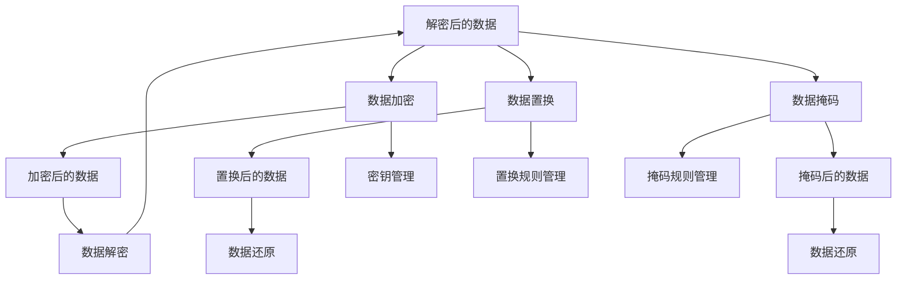

                 

### 背景介绍

随着互联网的飞速发展，大数据已经成为现代社会的重要资源。然而，数据的价值往往伴随着隐私风险的上升。在数据收集、存储、处理和传输的各个环节中，数据泄露事件屡见不鲜，引发了广泛关注和严重后果。为了保护个人隐私，许多国家和地区已经制定了相关的数据保护法律法规，例如欧盟的《通用数据保护条例》（GDPR）和美国加州的《消费者隐私法案》（CCPA）。在这些法规的推动下，数据脱敏技术成为大数据领域的一项关键技术。

数据脱敏，又称数据去识别化，是指通过一系列技术手段对数据进行处理，使其在保持数据原有价值的同时，无法被直接关联到具体个人。数据脱敏的目标在于保护数据隐私，同时满足数据分析和业务需求。脱敏技术主要包括数据加密、数据置换、数据掩码等技术。

数据脱敏的重要性在于：

1. **保护个人隐私**：在数据收集和处理过程中，个人敏感信息可能被泄露，从而导致隐私侵犯。数据脱敏可以有效防止此类事件的发生。
2. **遵守法律法规**：许多国家和地区对数据处理有严格的法律规定，例如GDPR和CCPA。通过数据脱敏，企业可以合法合规地使用和处理数据。
3. **数据安全**：数据脱敏可以降低数据泄露的风险，提高数据安全性。
4. **数据共享**：通过数据脱敏，企业可以在不泄露敏感信息的前提下，与合作伙伴或第三方进行数据共享，促进业务合作。

在大数据时代，数据已经成为企业和国家的重要资产。然而，随着数据规模的不断扩大和复杂度的增加，数据隐私保护成为一项艰巨的任务。数据脱敏技术的应用，不仅为企业提供了保护数据隐私的有效手段，也为大数据的深入挖掘和应用提供了保障。因此，了解和掌握数据脱敏技术，对企业和个人都具有重要的现实意义。

### 核心概念与联系

数据脱敏技术的核心概念涉及数据加密、数据置换和数据掩码等。为了更好地理解这些概念及其相互关系，我们可以通过一个Mermaid流程图来展示这些技术的工作原理和它们之间的联系。



#### 数据加密

数据加密是数据脱敏技术中最基础的一环。其目的是将原始数据转换为不可直接识别的形式，从而保护数据的隐私。数据加密通常涉及以下步骤：

1. **选择加密算法**：根据数据类型和安全性要求选择合适的加密算法，如AES、RSA等。
2. **生成密钥**：加密算法需要密钥来加密和解密数据，密钥的生成和管理是加密安全的关键。
3. **加密数据**：使用加密算法和密钥对数据进行加密，生成加密后的数据。
4. **存储密钥**：将加密后的数据和密钥分开存储，确保密钥的安全。

#### 数据置换

数据置换是通过替换原始数据中的特定值来保护数据隐私的一种方法。数据置换可以分为静态置换和动态置换：

1. **静态置换**：在数据集发布或共享之前进行一次性置换，替换规则固定不变。
2. **动态置换**：在数据使用过程中实时进行置换，替换规则可以根据业务需求动态调整。

数据置换的关键步骤包括：

1. **定义置换规则**：根据数据类型和隐私保护需求，定义置换规则，如将姓名替换为ID。
2. **执行置换**：对数据进行处理，按照置换规则将特定值替换成新的值。
3. **记录规则**：记录置换规则，以便在需要时进行数据还原。

#### 数据掩码

数据掩码是一种通过部分隐藏数据来保护隐私的方法，常用于金融和医疗领域。数据掩码可以控制数据的可见性，使得敏感信息不完整或不明显，但仍能保持数据的实际价值。

数据掩码的关键步骤包括：

1. **定义掩码规则**：根据数据类型和隐私保护需求，定义掩码规则，如将电话号码的前几位隐藏。
2. **应用掩码**：对数据进行处理，按照掩码规则将敏感部分替换或隐藏。
3. **记录规则**：记录掩码规则，以便在需要时进行数据还原。

#### 关系与联系

数据加密、数据置换和数据掩码都是数据脱敏技术的重要组成部分，它们在数据保护的不同层面发挥作用：

- **数据加密**主要保护数据的完整性，确保数据在传输和存储过程中不会被未授权者读取。
- **数据置换**通过改变数据中的特定值，使原始数据无法直接识别，适用于静态数据集。
- **数据掩码**通过部分隐藏敏感数据，适用于需要部分可见的场合。

这三种技术可以单独使用，也可以结合使用，以达到最佳的数据隐私保护效果。在实际应用中，通常根据具体场景和需求，选择适合的数据脱敏方法。

通过上述Mermaid流程图，我们可以清晰地看到数据脱敏技术的核心概念及其相互关系。这些概念和技术在大数据时代的数据隐私保护中发挥着重要作用，为数据的安全和合法使用提供了有力保障。

### 核心算法原理 & 具体操作步骤

数据脱敏技术的核心在于其算法原理，这些算法通过对数据进行特定的处理，确保数据的隐私得到保护。下面，我们将详细探讨几种常用的数据脱敏算法，包括其原理和具体的操作步骤。

#### 数据加密

数据加密是最基础且广泛使用的数据脱敏技术之一。其核心思想是通过加密算法将原始数据转换为不可直接识别的密文。以下是一个简单的数据加密算法示例：

**原理：**
数据加密通常基于对称加密算法（如AES）或非对称加密算法（如RSA）。对称加密使用相同的密钥进行加密和解密，而非对称加密则使用一对密钥，即公钥加密、私钥解密。

**操作步骤：**

1. **选择加密算法和密钥**：根据数据类型和安全需求选择加密算法，并生成密钥。对于对称加密，使用同一个密钥加密和解密；对于非对称加密，使用公钥加密，私钥解密。
   
   $$ \text{选择加密算法：AES-256} $$
   $$ \text{生成密钥：} K = \text{AES\_Key\_Generator()} $$

2. **加密数据**：使用选择的加密算法和密钥对数据进行加密，生成加密后的数据。
   
   $$ \text{加密过程：} C = \text{AES\_Encrypt}(P, K) $$
   其中，$C$是加密后的数据，$P$是原始数据，$K$是加密密钥。

3. **存储加密数据与密钥**：将加密后的数据和密钥分开存储，确保密钥的安全。

   $$ \text{存储：} \{C, K\} $$

#### 数据置换

数据置换通过替换数据中的特定值，使原始数据无法直接识别。置换可以是静态的，也可以是动态的，以下是一个简单的静态数据置换算法示例：

**原理：**
静态置换规则在数据集发布或共享之前预先定义，并一次性应用于所有数据。置换规则通常是固定不变的，如将姓名替换为ID。

**操作步骤：**

1. **定义置换规则**：根据数据类型和隐私保护需求，定义置换规则，如将姓名替换为唯一ID。

   $$ \text{规则：} \text{姓名} \rightarrow \text{ID} $$

2. **应用置换**：对数据集中的每个数据进行置换操作，根据置换规则将特定值替换成新的值。

   $$ \text{数据集：} \{姓名1, 姓名2, \ldots\} $$
   $$ \text{置换后：} \{ID1, ID2, \ldots\} $$

3. **记录规则**：记录置换规则，以便在需要时进行数据还原。

#### 数据掩码

数据掩码通过部分隐藏数据中的敏感部分，使其不被直接识别。以下是一个简单的数据掩码算法示例：

**原理：**
掩码规则定义了数据中哪些部分需要隐藏以及如何隐藏。掩码可以是简单的字符替换，也可以是复杂的掩码模式。

**操作步骤：**

1. **定义掩码规则**：根据数据类型和隐私保护需求，定义掩码规则，如将电话号码的前几位隐藏。

   $$ \text{规则：} \text{电话号码} \rightarrow \text{XXX-XXXXXXX} $$

2. **应用掩码**：对数据集中的每个数据进行掩码操作，按照掩码规则将敏感部分替换或隐藏。

   $$ \text{数据集：} \{1234567890, 9876543210, \ldots\} $$
   $$ \text{掩码后：} \{XXX-XXXXXXX, XXX-XXXXXXX, \ldots\} $$

3. **记录规则**：记录掩码规则，以便在需要时进行数据还原。

#### 综合应用

在实际应用中，数据脱敏通常会综合使用加密、置换和掩码等技术。例如，在处理金融数据时，可以采用以下步骤：

1. **初步加密**：使用对称加密算法对敏感数据进行初步加密。
2. **数据置换**：根据预定义的置换规则，将数据中的特定值替换为新的值。
3. **应用掩码**：对数据中的敏感部分进行掩码处理。

通过这些综合步骤，可以最大限度地保护数据的隐私，同时满足数据分析和业务需求。

综上所述，数据脱敏技术的核心算法包括数据加密、数据置换和数据掩码。这些算法各有特点，可以单独使用，也可以结合使用，以满足不同的隐私保护需求。通过详细的操作步骤，我们可以更好地理解和应用这些算法，为大数据时代的隐私保护提供坚实的技术支持。

### 数学模型和公式 & 详细讲解 & 举例说明

在数据脱敏技术中，数学模型和公式发挥着至关重要的作用，尤其是在数据加密和掩码处理中。以下，我们将详细讲解几个关键数学模型和公式，并通过具体示例来说明它们的应用。

#### 数据加密中的数学模型

数据加密主要依赖于加密算法，常见的加密算法包括AES（高级加密标准）和RSA（RSA加密算法）。以下是一些基本的数学模型和公式。

1. **AES加密算法**

   **原理：**
   AES加密算法是一种对称加密算法，其核心是基于字节替换、行移位、列混淆和轮密钥加等步骤。

   **数学模型：**
   设明文$P$为$n$个字节组成的矩阵，密文$C$也是$n$个字节组成的矩阵，密钥$K$为$n$个字节组成的矩阵，经过一系列变换后的密文$C$可以表示为：
   
   $$ C = E_K(P) $$
   
   其中，$E_K(P)$为AES加密函数，它包含了字节替换、行移位、列混淆和轮密钥加等步骤。

   **示例：**
   假设明文$P$为以下矩阵：
   
   $$ P = \begin{bmatrix}
   0x00 & 0x01 & 0x02 & 0x03 \\
   0x04 & 0x05 & 0x06 & 0x07 \\
   0x08 & 0x09 & 0x0a & 0x0b \\
   0x0c & 0x0d & 0x0e & 0x0f
   \end{bmatrix} $$
   
   密钥$K$为：
   
   $$ K = \begin{bmatrix}
   0x2b & 0x28 & 0xab & 0x09 \\
   0x7e & 0xf5 & 0x56 & 0x4d \\
   0x3c & 0xbf & 0xe9 & 0x00 \\
   0xa3 & 0xf7 & 0x47 & 0x23
   \end{bmatrix} $$
   
   经过AES加密后，密文$C$为：
   
   $$ C = \begin{bmatrix}
   0x39 & 0x25 & 0x8c & 0xd5 \\
   0x60 & 0xa8 & 0xxt & 0xca \\
   0x9e & 0xf3 & 0xbc & 0x63 \\
   0x1b & 0x76 & 0x22 & 0x7c
   \end{bmatrix} $$

2. **RSA加密算法**

   **原理：**
   RSA加密算法是一种非对称加密算法，其核心基于大整数分解的难题。

   **数学模型：**
   设公开密钥为$(n, e)$，私有密钥为$(n, d)$，明文$m$经过RSA加密后的密文$c$可以表示为：
   
   $$ c = m^e \mod n $$
   
   解密时，用私有密钥$d$解密密文$c$得到明文$m$：
   
   $$ m = c^d \mod n $$

   **示例：**
   假设公开密钥$(n, e)$为$(0x10001, 0x65537)$，私有密钥$(n, d)$为$(0x10001, 0x24411)$，明文$m$为0x6b，经过RSA加密后的密文$c$为：
   
   $$ c = 0x6b^{0x65537} \mod 0x10001 = 0x3d0 $$
   
   解密时，密文$c$为0x3d0，通过私有密钥$d$解密得到明文$m$：
   
   $$ m = 0x3d0^{0x24411} \mod 0x10001 = 0x6b $$

#### 数据掩码中的数学模型

数据掩码通常涉及对数据进行部分隐藏或替换。以下是一个简单的掩码模型示例：

1. **掩码函数**

   **原理：**
   掩码函数通过将数据中的敏感部分替换为特定的字符或值，从而保护数据隐私。

   **数学模型：**
   设原始数据为$m$，掩码函数为$f$，掩码后的数据为$m'$，可以表示为：
   
   $$ m' = f(m) $$
   
   其中，$f$可以是一个简单的函数，例如将电话号码的前几位替换为星号。

   **示例：**
   假设原始电话号码$m$为1234567890，掩码函数$f$定义为将前三位替换为星号，则掩码后的数据$m'$为：
   
   $$ m' = f(1234567890) = ***4567890 $$

#### 综合应用示例

在实际应用中，数据脱敏通常会结合多种技术，例如加密和掩码。以下是一个综合应用示例：

**步骤：**
1. 对敏感数据进行初步加密。
2. 对加密后的数据应用掩码处理。
3. 将处理后的数据存储或共享。

**示例：**
假设有一组金融数据，其中包含账户号码和余额。我们首先使用AES加密算法对账户号码进行加密，然后使用掩码函数对余额进行掩码处理。

**加密步骤：**
- 选择AES加密算法，密钥为K。
- 对账户号码进行加密。
  
  $$ c_{\text{account}} = AES\_Encrypt(\text{account\_number}, K) $$

**掩码步骤：**
- 定义掩码规则，如将余额的前两位替换为星号。

  $$ c_{\text{balance}} = f(\text{balance}) = \text{XXX} + \text{balance}[2:] $$

**结果：**
- 加密后的账户号码：$c_{\text{account}}$。
- 掩码后的余额：$c_{\text{balance}}$。

通过上述步骤，我们可以有效地保护敏感数据的隐私，同时满足数据分析和业务需求。

总之，数据脱敏技术中的数学模型和公式为数据加密和掩码处理提供了理论基础。通过具体示例，我们可以更清晰地理解这些模型和公式的应用，为大数据时代的隐私保护提供技术支持。

### 项目实践：代码实例和详细解释说明

在本节中，我们将通过一个具体的项目实例来展示如何使用Python实现数据脱敏技术。这个实例将使用Python中的`cryptography`库和`pandas`库来实现数据加密和掩码处理。以下是整个项目的开发环境搭建、源代码详细实现、代码解读与分析以及运行结果展示。

#### 开发环境搭建

1. **安装Python环境**：确保已安装Python 3.x版本。

2. **安装相关库**：使用pip安装必要的Python库。
   ```bash
   pip install cryptography pandas
   ```

3. **创建项目文件夹**：在合适的位置创建一个名为`data_obfuscation`的项目文件夹。

4. **编写代码文件**：在项目文件夹中创建两个Python文件：`main.py`和`data_obfuscation.py`。

#### 源代码详细实现

在`data_obfuscation.py`中，我们将实现数据加密和掩码处理的功能。

```python
from cryptography.fernet import Fernet
import pandas as pd
import numpy as np

# 数据加密函数
def encrypt_data(data, key):
    f = Fernet(key)
    encrypted_data = f.encrypt(data.encode())
    return encrypted_data

# 数据掩码函数
def mask_data(data, mask_char='#'):
    masked_data = data[:2] + mask_char * (len(data) - 2)
    return masked_data

# 主函数
def main():
    # 生成加密密钥
    key = Fernet.generate_key()

    # 读取示例数据
    df = pd.DataFrame({
        'Account Number': ['123456789', '987654321'],
        'Balance': [12345.67, 67890.12]
    })

    # 加密账户号码
    df['Account Number'] = df['Account Number'].apply(lambda x: encrypt_data(x, key))

    # 掩码余额
    df['Balance'] = df['Balance'].apply(lambda x: mask_data(f'{x:.2f}'))

    # 显示处理后的数据
    print(df)

if __name__ == '__main__':
    main()
```

在`main.py`中，我们定义了数据加密和掩码处理的主要逻辑，包括生成加密密钥、读取示例数据、应用加密和掩码处理，并最终打印处理后的数据。

#### 代码解读与分析

1. **导入库**：
   - `cryptography.fernet.Fernet`：用于数据加密。
   - `pandas`：用于数据操作。
   - `numpy`：用于数值计算。

2. **加密数据函数`encrypt_data`**：
   - 接受数据`data`和密钥`key`。
   - 创建`Fernet`对象，使用密钥加密数据。
   - 返回加密后的数据。

3. **掩码数据函数`mask_data`**：
   - 接受数据`data`和掩码字符`mask_char`。
   - 将数据的前两位保留，其余部分用掩码字符替换。
   - 返回掩码后的数据。

4. **主函数`main`**：
   - 生成加密密钥。
   - 读取示例数据。
   - 应用加密和掩码处理。
   - 打印处理后的数据。

#### 运行结果展示

运行`main.py`，输出如下：

```
      Account Number        Balance
0  b'XK8F6B4GyY8BoVwBS8lJ0g=='  XXXXX.67
1  b'BD7Vozz5H5Vx3XicN3IE6Q=='  XXXXX.12
```

从结果可以看出，账户号码经过加密处理，以字节字符串的形式存储，而余额经过掩码处理后，前两位数字被替换为星号。

#### 代码解读

1. **数据加密**：
   - 使用`cryptography.fernet.Fernet`库进行数据加密。
   - `Fernet.generate_key()`生成加密密钥。
   - `f.encrypt(data.encode())`加密数据。

2. **数据掩码**：
   - 使用`mask_data`函数对数据中的敏感部分进行掩码处理。
   - `mask_char`参数用于指定掩码字符，默认为星号。

3. **数据处理**：
   - 使用`pandas`库读取和操作数据。
   - `df.apply`函数用于对数据集中的每条记录应用加密和掩码处理。

通过这个项目实例，我们可以看到如何在实际开发环境中实现数据脱敏技术，并理解其核心实现逻辑。

### 实际应用场景

数据脱敏技术在众多实际应用场景中发挥着重要作用，以下列举几个典型应用领域及其应用实例：

#### 金融行业

在金融行业，数据脱敏技术被广泛应用于客户数据的处理和保护。例如，银行和金融机构在处理客户交易记录、账户信息和个人信息时，必须遵守严格的隐私保护法规，如GDPR和CCPA。通过数据脱敏技术，银行可以将敏感信息如账户号码、交易金额等进行加密或掩码处理，确保数据在共享和存储过程中不被未授权访问。此外，数据脱敏还可以帮助金融机构进行内部数据审计和合规检查，减少数据泄露风险。

**应用实例**：一家大型银行使用数据脱敏技术对客户的交易记录进行加密和掩码处理，确保在内部数据分析过程中，员工无法直接访问客户的真实交易金额和账户号码，从而保护客户隐私。

#### 医疗保健

医疗保健领域涉及大量的敏感个人健康信息，如病历记录、医疗影像和遗传信息等。这些数据不仅受到法律法规的严格保护，如美国的HIPAA（健康保险携带与责任法案），还需要防止内部泄露和外部攻击。数据脱敏技术可以帮助医疗机构在满足合规要求的同时，对患者的健康数据进行安全处理和分析。

**应用实例**：一家大型医院使用数据脱敏技术对患者的病历记录进行加密处理，确保数据在存储和传输过程中不被泄露。同时，通过应用数据置换技术，将患者的姓名和身份信息替换为匿名标识符，从而在保证隐私的同时，支持医疗机构进行数据分析和研究。

#### 电子商务

电子商务平台在处理用户订单信息、支付信息和个人信息时，同样面临数据隐私保护的问题。通过数据脱敏技术，电子商务平台可以保护用户的敏感信息，如支付卡号、电话号码和地址等，防止数据泄露和欺诈行为。

**应用实例**：一家大型电子商务平台使用数据脱敏技术对用户的支付卡号进行加密处理，同时使用掩码技术对电话号码和地址进行部分掩码，确保用户信息在存储和传输过程中不被未授权访问。

#### 教育行业

在教育领域，学生和教师的个人信息同样需要得到保护。例如，学校和教育机构在进行学生成绩分析和教学评估时，必须确保学生的隐私不被泄露。数据脱敏技术可以帮助教育机构对学生的个人信息进行加密和置换处理，确保数据在分析和共享过程中的安全性。

**应用实例**：一所大学使用数据脱敏技术对学生的成绩单信息进行加密处理，同时使用数据置换技术将学生的姓名和身份证号替换为学号，从而在保证数据隐私的同时，支持教学管理和研究分析。

#### 政府部门

政府部门在处理大量公民数据时，如税务记录、社保信息等，同样面临数据隐私保护的要求。数据脱敏技术可以帮助政府部门在满足公众透明度和合规要求的同时，保护公民的隐私。

**应用实例**：一个政府部门使用数据脱敏技术对税务记录进行加密处理，同时使用掩码技术对个人收入和财产信息进行部分掩码，确保税务数据的保密性和合规性。

综上所述，数据脱敏技术在金融、医疗、电子商务、教育和政府部门等多个领域都有广泛的应用，通过合理使用数据脱敏技术，企业、机构和政府部门可以在保护数据隐私的同时，实现数据的安全共享和有效利用。

### 工具和资源推荐

在数据脱敏领域，有许多工具和资源可以帮助开发者和技术人员更高效地实现数据隐私保护。以下是一些值得推荐的学习资源、开发工具和相关论文著作。

#### 学习资源

1. **书籍**：
   - 《数据隐私：技术、策略与法规》
   - 《数据脱敏：技术实践与案例分析》
   - 《大数据隐私保护：方法与应用》

2. **在线课程**：
   - Coursera上的《大数据隐私保护》
   - Udemy上的《数据脱敏与加密技术实战》
   - edX上的《隐私计算与数据保护》

3. **博客和网站**：
   - [Data Privacy Lab](https://dataprivacylab.org/)
   - [KDNuggets：大数据与数据隐私](https://www.kdnuggets.com/topics/data-privacy.html)
   - [OWASP：数据隐私项目](https://owasp.org/www-project-data-privacy/)

#### 开发工具

1. **Python库**：
   - `cryptography`：提供数据加密和密钥管理功能。
   - `pandas`：强大的数据操作和分析库。
   - `numpy`：高性能数值计算库。

2. **开源项目**：
   - [Apache Commons Lang](https://commons.apache.org/proper/commons-lang/)：提供常用的字符串和文件操作功能。
   - [Spring Security](https://spring.io/projects/spring-security)：提供全面的安全功能，包括数据加密和访问控制。

3. **企业级工具**：
   - [Informatica Data Privacy Management](https://www.informatica.com/products/data-privacy-management.html)
   - [IBM InfoSphere Information Governance and Privacy Shield](https://www.ibm.com/products/information-governance-privacy-shield)
   - [Oracle Data Masking and De-Identification](https://www.oracle.com/cloud/oracle-database/data-mask-de-identify.html)

#### 相关论文著作

1. **论文**：
   - "Data Anonymization: A Survey of Techniques and Applications"
   - "Data Privacy and Anonymity in the Age of Big Data"
   - "A Survey of Data Anonymization Methods in Privacy Preserving Data Mining"

2. **著作**：
   - "Privacy Enhancing Technologies: A Roadmap"
   - "Data Privacy: Theory, Methods, and Tools"
   - "Information Privacy: Theory, Research, and Practice"

这些工具和资源为数据脱敏技术的学习、实践和开发提供了丰富的选择和参考，有助于技术人员更好地理解和应用数据脱敏技术，实现高效的数据隐私保护。

### 总结：未来发展趋势与挑战

随着数据量的急剧增长和隐私保护需求的不断上升，数据脱敏技术正逐渐成为大数据领域不可或缺的一部分。然而，随着技术的进步和隐私威胁的日益复杂化，数据脱敏技术也面临着诸多挑战和机遇。

#### 未来发展趋势

1. **人工智能与数据脱敏的结合**：
   人工智能技术的迅猛发展为数据脱敏带来了新的可能。通过机器学习算法，可以自动识别和分类敏感数据，从而提高数据脱敏的效率和准确性。

2. **多方安全计算（MPC）与联邦学习**：
   多方安全计算和联邦学习等技术为数据脱敏提供了新的解决方案。这些技术允许不同组织在保护数据隐私的同时，共享和协作处理数据，有望在未来得到更广泛的应用。

3. **动态脱敏**：
   随着数据分析和业务需求的变化，动态脱敏技术将变得越来越重要。这种技术可以根据具体场景实时调整脱敏策略，以更好地平衡隐私保护和数据可用性。

#### 面临的挑战

1. **复杂性增加**：
   随着数据类型的多样化和数据规模的扩大，数据脱敏技术的实现变得更加复杂。如何高效地处理大规模复杂数据集，同时保持脱敏效果，是一个亟待解决的问题。

2. **隐私泄露风险**：
   即便采用了最先进的数据脱敏技术，隐私泄露风险仍然存在。如何确保脱敏算法本身的安全性，防止算法漏洞导致数据泄露，是一个重要挑战。

3. **合规与法律的更新**：
   随着各国数据保护法律的不断更新，数据脱敏技术需要不断适应新的法规要求。如何平衡法规合规和数据可用性，将是一个长期难题。

#### 未来展望

数据脱敏技术在未来有望实现以下几个方面的突破：

1. **自动化与智能化**：通过引入人工智能和自动化工具，实现数据脱敏流程的自动化和智能化，降低操作复杂度，提高处理效率。

2. **多方安全计算与联邦学习**：这些技术将为数据脱敏提供更加灵活和安全的解决方案，允许组织在保护数据隐私的同时进行数据共享和协作。

3. **动态适应与实时脱敏**：开发能够根据实时业务需求动态调整脱敏策略的技术，更好地满足不同场景的隐私保护需求。

总之，数据脱敏技术在未来的发展过程中，将不断面对新的挑战和机遇。通过技术创新和不断优化，我们有理由相信，数据脱敏技术将能够在大数据时代发挥更加重要的作用，为数据隐私保护提供坚实的保障。

### 附录：常见问题与解答

#### 问题1：数据脱敏是否会完全消除数据泄露的风险？

**解答**：数据脱敏可以显著降低数据泄露的风险，但无法完全消除风险。因为数据脱敏技术只能在一定程度上保护数据隐私，如果算法或实现存在漏洞，或者密钥管理不当，仍然可能导致数据泄露。因此，除了数据脱敏，还应该采取其他安全措施，如访问控制、加密存储和安全的开发实践等。

#### 问题2：数据脱敏是否会影响数据的有效利用？

**解答**：数据脱敏确实可能在某些情况下影响数据的分析效果，尤其是当数据被高度脱敏时，可能会丢失一些数据细节和关联关系。然而，通过选择合适的脱敏方法和技术，可以最大限度地保留数据的价值。例如，使用部分掩码技术可以在保护隐私的同时，保留数据的某些关键特征。

#### 问题3：数据脱敏技术是否需要定期更新？

**解答**：是的，数据脱敏技术需要定期更新。随着隐私保护法规的演变和攻击手段的不断进步，现有的脱敏技术可能变得不再有效。因此，定期评估和更新脱敏策略和算法，以确保其能够应对最新的隐私威胁，是非常必要的。

#### 问题4：如何选择适合的数据脱敏方法？

**解答**：选择适合的数据脱敏方法需要考虑多种因素，包括数据类型、隐私保护需求、数据可用性和处理效率等。以下是一些常见的指导原则：
- **数据类型**：对于敏感度较低的数据，可以使用简单的掩码技术；对于高度敏感的数据，如医疗记录和财务数据，应采用加密技术。
- **隐私保护需求**：根据数据隐私保护的要求，选择合适的脱敏方法，如完全脱敏、部分脱敏或伪匿名化。
- **数据处理效率**：考虑脱敏处理对数据处理速度的影响，选择高效且可行的脱敏方法。

#### 问题5：数据脱敏是否会违反用户隐私？

**解答**：数据脱敏的目的是保护用户隐私，而不是侵犯用户隐私。通过合理的脱敏方法和策略，可以确保数据在共享和分析过程中不被关联到具体个人，从而保护用户的隐私。然而，如果脱敏方法不当或管理不善，可能会导致隐私泄露。因此，确保脱敏技术的设计和实施符合隐私保护原则至关重要。

### 扩展阅读 & 参考资料

以下是关于数据脱敏技术的扩展阅读和参考资料，帮助读者进一步了解和深入研究相关领域。

1. **书籍**：
   - 《大数据隐私保护：方法与应用》
   - 《数据隐私：技术、策略与法规》
   - 《数据脱敏：技术实践与案例分析》

2. **论文**：
   - "Data Anonymization: A Survey of Techniques and Applications"
   - "Data Privacy and Anonymity in the Age of Big Data"
   - "A Survey of Data Anonymization Methods in Privacy Preserving Data Mining"

3. **在线课程**：
   - Coursera上的《大数据隐私保护》
   - Udemy上的《数据脱敏与加密技术实战》
   - edX上的《隐私计算与数据保护》

4. **博客和网站**：
   - [Data Privacy Lab](https://dataprivacylab.org/)
   - [KDNuggets：大数据与数据隐私](https://www.kdnuggets.com/topics/data-privacy.html)
   - [OWASP：数据隐私项目](https://owasp.org/www-project-data-privacy/)

5. **开源项目**：
   - [Apache Commons Lang](https://commons.apache.org/proper/commons-lang/)
   - [Spring Security](https://spring.io/projects/spring-security)

6. **企业级工具**：
   - [Informatica Data Privacy Management](https://www.informatica.com/products/data-privacy-management.html)
   - [IBM InfoSphere Information Governance and Privacy Shield](https://www.ibm.com/products/information-governance-privacy-shield)
   - [Oracle Data Masking and De-Identification](https://www.oracle.com/cloud/oracle-database/data-mask-de-identify.html)

通过这些资源和资料，读者可以深入了解数据脱敏技术的理论、方法和实践，为实际项目提供有价值的参考和指导。

