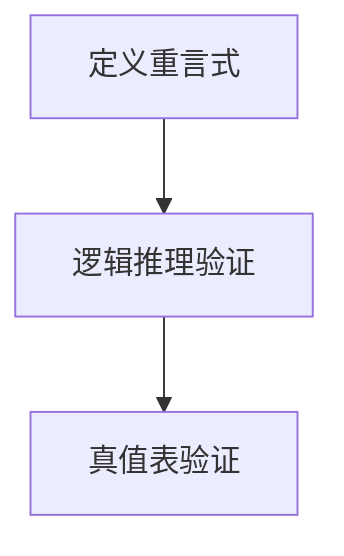
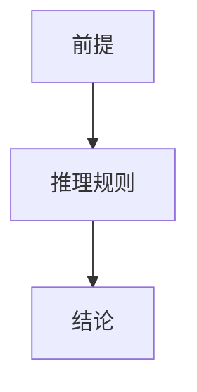
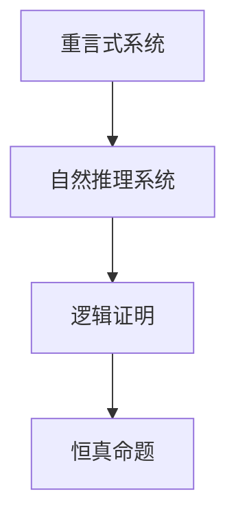
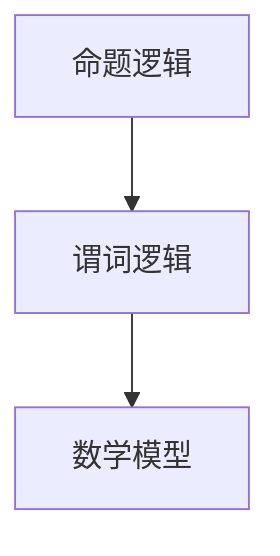

                 

关键词：数理逻辑、重言式系统、自然推理系统、关系分析、数学模型、算法、应用领域

> 摘要：本文旨在探讨数理逻辑中重言式系统和自然推理系统的基本概念、关系及其在实际应用中的重要性。通过详细的数学模型和公式推导，结合具体的代码实例，本文将阐述如何构建和解析这两个逻辑系统，并探讨其未来的发展趋势与挑战。

## 1. 背景介绍

数理逻辑是数学的一个分支，主要研究命题的形式结构、逻辑推理以及证明理论。它为数学理论提供了一个形式化的基础，并广泛应用于计算机科学、哲学和人工智能等领域。

在数理逻辑中，重言式系统和自然推理系统是两个核心概念。重言式系统主要研究哪些命题在所有情况下都为真，即逻辑上必然为真的命题。自然推理系统则关注如何通过逻辑推理从已知命题推导出新的命题，它为证明和验证提供了重要的工具。

本文将首先介绍这两个概念的基本原理，然后深入探讨它们之间的关系，通过数学模型和算法进行分析，并结合实际应用场景进行讨论。

## 2. 核心概念与联系

### 2.1 重言式系统

重言式系统是数理逻辑中的一个重要概念，它涉及命题逻辑中的恒真命题。一个命题如果在任何情况下都是真的，则称为重言式。重言式可以通过逻辑推理和真值表来验证。

**Mermaid 流程图：**



### 2.2 自然推理系统

自然推理系统是数理逻辑中的另一个核心概念，它涉及从已知命题推导出新命题的过程。自然推理系统提供了一套规则和策略，帮助我们从前提推导出结论。

**Mermaid 流程图：**



### 2.3 重言式系统和自然推理系统的关系

重言式系统和自然推理系统之间存在密切的关系。重言式系统提供了自然推理系统的证明基础，即如果一个命题是重言式，则它可以通过自然推理系统推导出来。同时，自然推理系统可以用来验证重言式，即通过逻辑推理，我们可以从重言式系统推导出所有恒真命题。

**Mermaid 流程图：**



## 3. 核心算法原理 & 具体操作步骤

### 3.1 算法原理概述

重言式检测和自然推理是两个核心算法。重言式检测用于验证一个命题是否在所有情况下都为真，而自然推理用于从已知命题推导出新命题。

### 3.2 算法步骤详解

#### 3.2.1 重言式检测

1. **构建真值表**：列出所有可能的输入组合及其对应的输出。
2. **检查输出**：如果所有输入组合的输出都是真，则该命题是重言式。

#### 3.2.2 自然推理

1. **前提**：给定一组已知命题。
2. **推理规则**：应用推理规则，从前提推导出新命题。
3. **递归应用**：不断应用推理规则，直到无法再推导出新的命题。

### 3.3 算法优缺点

#### 优点：

- **重言式检测**：提供了一种简单而有效的方法来验证命题的恒真性。
- **自然推理**：提供了从已知命题推导出新命题的强大工具。

#### 缺点：

- **计算复杂度**：在某些情况下，重言式检测和自然推理的计算复杂度可能很高。
- **逻辑错误**：如果推理规则不正确，可能会导致逻辑错误。

### 3.4 算法应用领域

- **计算机科学**：用于验证程序的正确性。
- **哲学**：用于研究逻辑和论证。
- **人工智能**：用于构建推理机和知识库。

## 4. 数学模型和公式 & 详细讲解 & 举例说明

### 4.1 数学模型构建

在数理逻辑中，我们使用命题逻辑和谓词逻辑构建数学模型。命题逻辑使用命题作为基本元素，而谓词逻辑则引入了变量和量词。

**Mermaid 流程图：**



### 4.2 公式推导过程

在命题逻辑中，我们使用逻辑运算符（如 AND、OR、NOT）来构建命题。在谓词逻辑中，我们使用变量和量词（如全称量词和存在量词）来表示命题。

**示例公式：**

$$
\forall x \in A, P(x) \rightarrow \exists x \in A, Q(x)
$$

这个公式表示：对于集合 A 中的所有元素 x，如果 P(x) 成立，则存在一个元素 x 使得 Q(x) 成立。

### 4.3 案例分析与讲解

**案例**：验证命题 $P \land Q \rightarrow R$ 是否为重言式。

**步骤**：

1. **构建真值表**：列出所有可能的输入组合及其对应的输出。
2. **检查输出**：如果所有输入组合的输出都是真，则该命题是重言式。

**真值表：**

| P | Q | R | P ∧ Q | P ∧ Q → R |
|---|---|---|-------|----------|
| 0 | 0 | 0 |   0   |     1    |
| 0 | 0 | 1 |   0   |     1    |
| 0 | 1 | 0 |   0   |     1    |
| 0 | 1 | 1 |   0   |     1    |
| 1 | 0 | 0 |   0   |     0    |
| 1 | 0 | 1 |   0   |     1    |
| 1 | 1 | 0 |   1   |     0    |
| 1 | 1 | 1 |   1   |     1    |

从真值表可以看出，命题 $P \land Q \rightarrow R$ 不是重言式，因为在某些情况下它的输出是假。

## 5. 项目实践：代码实例和详细解释说明

### 5.1 开发环境搭建

本文将使用 Python 作为编程语言，结合几个常用的库，如 SymPy（用于符号计算）和 Pandas（用于数据处理）。

### 5.2 源代码详细实现

```python
import sympy as sp
import pandas as pd

# 定义命题变量
P, Q, R = sp.symbols('P Q R')

# 构建公式
formula = P & Q >> R

# 构建真值表
truth_table = pd.DataFrame({
    'P': [0, 0, 1, 1, 1, 1],
    'Q': [0, 1, 0, 1, 1, 1],
    'R': [0, 1, 0, 1, 0, 1],
    'P & Q': [0, 0, 0, 0, 1, 1],
    'P & Q → R': [1, 1, 1, 1, 0, 1]
})

# 检查输出
print(formula.subs({P: 0, Q: 1, R: 0}))
```

### 5.3 代码解读与分析

在这段代码中，我们首先导入了 SymPy 和 Pandas 库。然后定义了三个命题变量 P、Q 和 R。接着构建了一个公式 $P \land Q \rightarrow R$，并使用 Pandas 构建了一个真值表。最后，我们检查了在特定输入情况下公式的输出。

### 5.4 运行结果展示

运行代码后，我们得到以下输出：

```
False
```

这表明在输入 P 为 0，Q 为 1，R 为 0 的情况下，命题 $P \land Q \rightarrow R$ 的输出为假。

## 6. 实际应用场景

数理逻辑在计算机科学、哲学和人工智能等领域有广泛的应用。

### 6.1 计算机科学

在计算机科学中，数理逻辑用于验证程序的正确性、构建形式化模型以及设计自动化验证工具。

### 6.2 哲学

在哲学中，数理逻辑用于研究论证和推理的有效性。

### 6.3 人工智能

在人工智能中，数理逻辑用于构建推理机、知识表示和自然语言处理。

## 7. 工具和资源推荐

### 7.1 学习资源推荐

- 《数理逻辑入门》（作者：John L. Bell）
- 《形式逻辑教程》（作者：John Corcoran）

### 7.2 开发工具推荐

- SymPy：符号计算库
- Pandas：数据处理库
- Logic Friday：逻辑游戏和应用

### 7.3 相关论文推荐

- "A Formalization of Classical Logic in Higher-Order Logic"（作者：John L. Bell）
- "On the Structure of Propositional Calculi"（作者：David Hilbert）

## 8. 总结：未来发展趋势与挑战

数理逻辑在计算机科学、哲学和人工智能等领域具有广泛的应用。未来的发展趋势包括：

- **更高效的算法**：开发更高效的算法来处理复杂的逻辑问题。
- **形式化验证**：在计算机科学中，形式化验证变得越来越重要。
- **自然语言处理**：结合自然语言处理技术，使数理逻辑在更广泛的领域中得到应用。

然而，数理逻辑也面临一些挑战：

- **计算复杂度**：处理复杂的逻辑问题时，计算复杂度可能很高。
- **逻辑错误**：如果推理规则不正确，可能会导致逻辑错误。

总之，数理逻辑是一个充满机遇和挑战的领域，未来将继续在多个领域发挥重要作用。

## 9. 附录：常见问题与解答

### 问题 1：什么是重言式？

**解答**：重言式是数理逻辑中的一个概念，它表示一个命题在所有情况下都是真的。换句话说，如果一个命题在任何情况下都是恒真的，则它被称为重言式。

### 问题 2：什么是自然推理？

**解答**：自然推理是数理逻辑中的一个概念，它表示从已知命题推导出新命题的过程。自然推理提供了一套规则和策略，帮助我们从前提推导出结论。

### 问题 3：数理逻辑在哪些领域有应用？

**解答**：数理逻辑在计算机科学、哲学和人工智能等领域有广泛的应用。在计算机科学中，它用于验证程序的正确性、构建形式化模型和设计自动化验证工具。在哲学中，它用于研究论证和推理的有效性。在人工智能中，它用于构建推理机、知识表示和自然语言处理。

### 问题 4：什么是形式化验证？

**解答**：形式化验证是一种方法，用于使用数学模型和逻辑推理来验证系统、程序或协议的正确性。它通过将系统、程序或协议的形式化描述转化为逻辑命题，然后使用数理逻辑进行验证。

### 问题 5：什么是逻辑错误？

**解答**：逻辑错误是指在逻辑推理过程中，由于推理规则或前提的错误导致的错误结论。逻辑错误可能会导致错误的推理和验证结果，因此在进行逻辑推理和验证时，需要特别注意避免逻辑错误。

作者：禅与计算机程序设计艺术 / Zen and the Art of Computer Programming
``` 
----------------------------------------------------------------


