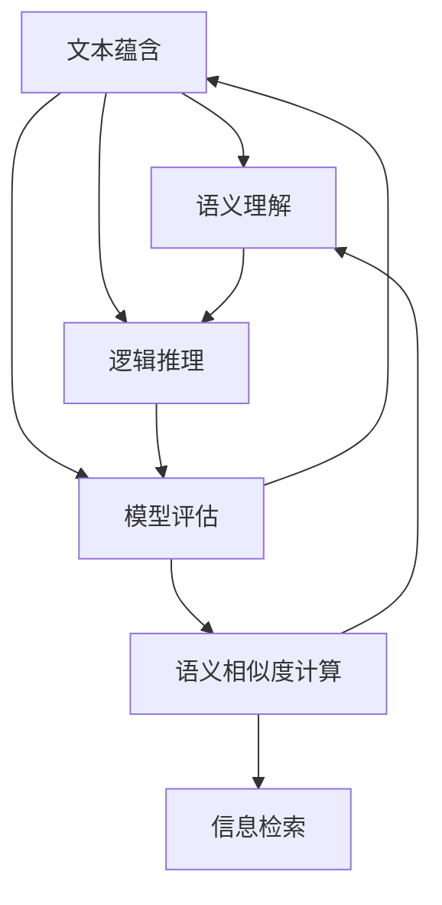

                 

### 1. 背景介绍

文本蕴含与语义相似度计算是自然语言处理（NLP）领域中两个重要的研究方向。文本蕴含旨在理解句子之间的逻辑关系，例如判断一个句子是否是另一个句子的蕴含或矛盾。而语义相似度计算则关注于评估两个句子在语义上的相似程度。这两个方向的研究在多个领域都有广泛的应用，如信息检索、问答系统、机器翻译、文本分类和情感分析等。

文本蕴含的研究起源于逻辑学，其目的是建立一种形式化的方法来表示和推理文本中的逻辑关系。早期的文本蕴含模型主要依赖于手工程度较高的特征，例如关键词匹配、语法结构分析等。随着深度学习技术的发展，基于神经网络的文本蕴含模型逐渐成为主流。例如，BERT（Bidirectional Encoder Representations from Transformers）模型通过预训练和微调，能够有效地捕捉文本中的蕴含关系。

语义相似度计算则更侧重于理解句子层面的语义信息。传统的语义相似度计算方法包括基于词袋模型、TF-IDF、余弦相似度等。然而，这些方法往往只能捕捉句子表面的词汇相似性，而无法深入理解句子深层的语义。近年来，随着预训练语言模型的兴起，如GloVe、Word2Vec和BERT等，语义相似度计算方法得到了极大的提升。这些模型通过大规模语料训练，能够学习到词汇和句子之间的深层次语义关系，从而更准确地评估语义相似度。

在自然语言处理中，文本蕴含和语义相似度计算有着广泛的应用。例如，在信息检索领域，通过计算用户查询与文档之间的语义相似度，可以帮助搜索引擎更准确地返回相关结果。在问答系统中，文本蕴含技术可以用于解析用户问题和文档之间的逻辑关系，从而提供更准确的答案。在机器翻译中，语义相似度计算可以帮助评估源语言和目标语言句子之间的语义一致性，从而提高翻译质量。此外，在文本分类和情感分析中，文本蕴含和语义相似度计算也可以用于训练和评估分类模型，提高分类的准确性和泛化能力。

总的来说，文本蕴含与语义相似度计算是自然语言处理领域的重要研究方向，它们在多个应用场景中都发挥着关键作用。本文将首先介绍这两个方向的核心概念和联系，然后深入探讨核心算法原理和具体操作步骤，并通过实际项目实践和数学模型分析，展示这些技术在实践中的应用和效果。最后，我们将探讨这些技术在实际应用中的场景和未来的发展趋势与挑战。希望通过本文的介绍，读者能够对文本蕴含与语义相似度计算有一个全面而深入的理解。### 2. 核心概念与联系

#### 2.1. 文本蕴含

文本蕴含（Text Entailment）是指从一个文本（被称为“前提”）中推导出另一个文本（被称为“结论”）的逻辑关系。在形式化表达中，文本蕴含通常被表示为P→Q，其中P是前提，Q是结论。这意味着如果前提P为真，那么结论Q也必然为真。

文本蕴含可以分为几个不同的类别，主要包括：

- **肯定蕴含**（肯定蕴含）：如果前提P为真，那么结论Q也必然为真。例如，“所有的猫都是动物”蕴含“猫是动物”。
- **矛盾**（Contradiction）：前提P和结论Q是逻辑矛盾，即P→¬Q，表示如果前提为真，结论必然为假。例如，“猫是动物”和“猫不是动物”是矛盾的。
- **无关**（Neutral）：前提P和结论Q之间没有明确的蕴含或矛盾关系。例如，“天空是蓝色的”和“苹果是红色的”之间就没有直接的蕴含或矛盾关系。

文本蕴含的研究核心在于如何建立一种形式化的方法，从文本中提取出蕴含关系。为了实现这一目标，研究者需要解决以下几个关键问题：

1. **语义理解**：如何从文本中提取出语义信息，包括名词、动词、形容词等词汇的含义。
2. **逻辑推理**：如何基于提取的语义信息进行逻辑推理，判断前提和结论之间的逻辑关系。
3. **模型评估**：如何评估文本蕴含模型的性能，包括准确性、召回率和F1分数等指标。

#### 2.2. 语义相似度计算

语义相似度计算（Semantic Similarity Measurement）是指评估两个句子或词汇在语义上相似程度的方法。与文本蕴含不同，语义相似度计算关注的是两个句子或词汇在语义层面上的一致性或相似性，而不是逻辑上的蕴含或矛盾关系。

语义相似度计算的关键在于如何从大规模语料中学习词汇和句子之间的语义表示。以下是一些常见的语义相似度计算方法：

1. **基于词汇的相似度计算**：这种方法通过比较两个句子或词汇中共同出现的词汇来计算相似度。常见的算法包括TF-IDF和余弦相似度。

2. **基于分布的相似度计算**：这种方法通过比较两个句子或词汇在词汇空间中的分布情况来计算相似度。Word2Vec和GloVe等模型是这一类方法的代表。

3. **基于语义角色和依存关系的相似度计算**：这种方法通过分析句子中的语义角色（如主语、谓语、宾语等）和依存关系（如动词和它的宾语、定语等）来计算相似度。

4. **基于语义嵌入的相似度计算**：这种方法通过预训练的语言模型（如BERT、GPT等）来学习词汇和句子在语义空间中的表示，从而计算相似度。

语义相似度计算的应用场景非常广泛，包括但不限于以下几方面：

- **信息检索**：通过计算用户查询和文档之间的语义相似度，提高搜索结果的准确性。
- **问答系统**：通过计算用户问题和候选答案之间的语义相似度，选择最相关的答案。
- **机器翻译**：通过计算源语言和目标语言句子之间的语义相似度，评估翻译质量。
- **文本分类**：通过计算文本和分类标签之间的语义相似度，提高分类模型的准确性。
- **情感分析**：通过计算文本和情感标签之间的语义相似度，识别文本的情感倾向。

#### 2.3. 核心概念和联系

文本蕴含和语义相似度计算虽然关注点不同，但它们之间存在紧密的联系。具体来说，语义相似度计算可以看作是文本蕴含的一种特殊情况。当两个句子在语义上完全相同（即语义相似度达到1）时，它们也必然存在蕴含关系（即P→Q为真）。反之，如果两个句子之间存在语义差异，它们在逻辑上可能不是蕴含关系，但仍然可以通过语义相似度来评估它们之间的相似程度。

因此，文本蕴含和语义相似度计算可以相互补充，共同提高自然语言处理系统的性能。例如，在问答系统中，我们可以首先通过语义相似度计算筛选出与用户问题最相关的候选答案，然后再通过文本蕴含模型判断候选答案是否真正回答了用户的问题。

#### 2.4. Mermaid 流程图

为了更好地理解文本蕴含和语义相似度计算的核心概念和联系，我们使用Mermaid绘制一个流程图。以下是一个简化的流程图，展示了文本蕴含和语义相似度计算的基本流程。



在这个流程图中，文本蕴含和语义相似度计算分别从语义理解和逻辑推理开始，最终通过模型评估来判断它们的性能。语义相似度计算则侧重于语义理解，并将结果应用于信息检索等领域。两者之间通过模型评估相互关联，共同推动自然语言处理技术的发展。

通过上述对文本蕴含和语义相似度计算核心概念与联系的分析，我们可以看到这两个研究方向在自然语言处理中的重要性。接下来，我们将深入探讨文本蕴含和语义相似度计算的核心算法原理和具体操作步骤。### 3. 核心算法原理 & 具体操作步骤

#### 3.1. 文本蕴含算法原理

文本蕴含算法的核心目标是建立一种形式化的方法，从给定的前提（P）和结论（Q）中判断P是否蕴含Q。以下是一些常见的文本蕴含算法原理：

1. **基于规则的方法**：这种方法通过构建一系列的规则来表示文本蕴含关系。规则通常基于语法、语义和常识知识。例如，一个简单的规则可以是“如果一个句子中有‘是’的谓语，则该句子蕴含‘存在’的关系”。这种方法的主要挑战在于如何构建足够全面且精确的规则集。

2. **基于统计的方法**：这种方法通过分析大量已标记的文本蕴含数据，利用统计模型（如逻辑回归、支持向量机等）来学习蕴含关系。统计模型通常使用特征工程，提取文本中的各种特征（如词频、语法结构、语义角色等），然后通过训练模型来预测新的蕴含关系。

3. **基于神经网络的方法**：随着深度学习技术的发展，基于神经网络的方法逐渐成为文本蕴含领域的主流。其中，最著名的是BERT（Bidirectional Encoder Representations from Transformers）模型。BERT通过预训练和微调，能够有效地捕捉文本中的蕴含关系。具体来说，BERT模型通过处理大量的无标签文本数据来学习词汇和句子表示，然后在特定任务上进行微调，从而实现文本蕴含的预测。

文本蕴含算法的具体操作步骤如下：

1. **数据预处理**：首先对文本进行分词、词性标注、实体识别等预处理操作，将原始文本转换为可以输入模型的形式。

2. **特征提取**：提取文本中的各种特征，如词频、词嵌入、语法结构等。对于基于神经网络的方法，通常会使用预训练的语言模型（如BERT）来生成文本嵌入。

3. **模型训练**：使用已标记的蕴含数据集，通过训练算法（如逻辑回归、支持向量机、BERT等）来学习蕴含关系。训练过程中，模型会优化参数，使得预测的蕴含关系与标注数据的一致性最大化。

4. **模型评估**：使用验证集和测试集来评估模型的性能。常用的评估指标包括准确率、召回率和F1分数等。

5. **预测**：将训练好的模型应用于新的未标注数据，预测新的蕴含关系。

#### 3.2. 语义相似度计算算法原理

语义相似度计算算法的核心目标是评估两个句子或词汇在语义上的相似程度。以下是一些常见的语义相似度计算算法原理：

1. **基于词汇的方法**：这种方法通过比较两个句子或词汇中共同出现的词汇来计算相似度。例如，TF-IDF和余弦相似度算法就是基于这种方法。TF-IDF计算词频（TF）和逆文档频率（IDF）的加权平均，以反映词汇在文档集合中的重要性。余弦相似度则通过计算两个向量在空间中的夹角余弦值来衡量它们的相似度。

2. **基于分布的方法**：这种方法通过比较两个句子或词汇在词汇空间中的分布情况来计算相似度。Word2Vec和GloVe模型是这一类方法的代表。Word2Vec通过训练神经网络来学习词汇的向量化表示，使具有相似语义的词汇在向量空间中更接近。GloVe则是一种基于全局共现矩阵的词向量训练方法，通过优化词汇的向量表示，使其在语义上更加一致。

3. **基于语义角色和依存关系的方法**：这种方法通过分析句子中的语义角色和依存关系来计算相似度。例如，依存句法分析可以识别出句子中的主语、谓语、宾语等核心成分，从而计算它们之间的相似度。

4. **基于语义嵌入的方法**：这种方法通过预训练的语言模型（如BERT、GPT等）来学习词汇和句子在语义空间中的表示，从而计算相似度。这些模型通过处理大量的无标签文本数据，能够学习到词汇和句子之间的深层次语义关系。

语义相似度计算的具体操作步骤如下：

1. **数据预处理**：对文本进行分词、词性标注等预处理操作，将原始文本转换为可以输入模型的形式。

2. **特征提取**：对于基于词汇的方法，提取文本中的词频、词嵌入等特征。对于基于分布的方法，通常使用预训练的语言模型生成文本嵌入。

3. **相似度计算**：计算两个句子或词汇在语义空间中的相似度。常用的相似度计算方法包括余弦相似度、欧氏距离、Jaccard相似度等。

4. **模型评估**：使用验证集和测试集来评估模型的性能。常用的评估指标包括准确率、召回率和F1分数等。

5. **预测**：将训练好的模型应用于新的未标注数据，预测新的相似度值。

通过上述对文本蕴含和语义相似度计算核心算法原理和具体操作步骤的分析，我们可以看到这两个方向在自然语言处理中的重要性。在接下来的章节中，我们将通过实际项目实践和数学模型分析，进一步探讨这些技术在实践中的应用和效果。### 4. 数学模型和公式 & 详细讲解 & 举例说明

#### 4.1. 文本蕴含的数学模型

文本蕴含可以通过逻辑和概率模型来描述。以下是一些常用的数学模型和公式：

**1. 逻辑模型：**

一个简单的逻辑模型可以表示为：

$$P(A \rightarrow B) = 1 - P(\neg B | A)$$

其中，$P(A \rightarrow B)$表示前提A蕴含结论B的概率，$P(\neg B | A)$表示在前提A为真的条件下，结论B不成立的概率。

**2. 概率模型：**

贝叶斯定理是概率模型的基础：

$$P(A | B) = \frac{P(B | A)P(A)}{P(B)}$$

其中，$P(A | B)$表示在结论B为真的条件下，前提A的概率，$P(B | A)$表示在前提A为真的条件下，结论B的概率，$P(A)$和$P(B)$分别表示前提A和结论B的先验概率。

**3. 条件概率：**

条件概率可以表示为：

$$P(A | B) = \frac{P(A \cap B)}{P(B)}$$

其中，$P(A \cap B)$表示前提A和结论B同时发生的概率。

**4. 逻辑回归模型：**

逻辑回归是一种常用的概率模型，它可以用来预测二分类问题。其公式为：

$$\text{logit}(P) = \log\left(\frac{P}{1 - P}\right) = \beta_0 + \beta_1X_1 + \beta_2X_2 + ... + \beta_nX_n$$

其中，$P$表示事件发生的概率，$X_1, X_2, ..., X_n$表示特征，$\beta_0, \beta_1, \beta_2, ..., \beta_n$是模型的参数。

**举例说明：**

假设我们有一个简单的文本蕴含问题：“所有的猫都是动物”和“猫是动物”。我们可以使用逻辑模型来计算这两个句子之间的蕴含概率：

前提A：“所有的猫都是动物”
结论B：“猫是动物”

根据逻辑模型，我们有：

$$P(A \rightarrow B) = 1 - P(\neg B | A)$$

如果我们假设$P(\neg B | A) = 0.2$（即20%的概率猫不是动物），则：

$$P(A \rightarrow B) = 1 - 0.2 = 0.8$$

这意味着前提A蕴含结论B的概率是80%。

#### 4.2. 语义相似度计算的数学模型

语义相似度计算通常基于向量化表示，以下是一些常用的数学模型和公式：

**1. 余弦相似度：**

余弦相似度是一种常用的文本相似度计算方法，它可以表示为：

$$\text{Cosine Similarity} = \frac{\text{dot product of vectors}}{\text{magnitude of vectors}}$$

其中，两个向量之间的点积（dot product）可以表示为：

$$\text{dot product} = \sum_{i=1}^{n} v_i \cdot w_i$$

向量的模长（magnitude）可以表示为：

$$\text{magnitude} = \sqrt{\sum_{i=1}^{n} v_i^2}$$

**2. 欧氏距离：**

欧氏距离是一种常用的向量化表示之间的距离度量方法，它可以表示为：

$$\text{Euclidean Distance} = \sqrt{\sum_{i=1}^{n} (v_i - w_i)^2}$$

**3. Jaccard相似度：**

Jaccard相似度是一种基于集合的相似度计算方法，它可以表示为：

$$\text{Jaccard Similarity} = \frac{|\text{intersection of sets}|}{|\text{union of sets}|}$$

其中，两个集合的交集（intersection）可以表示为：

$$|\text{intersection of sets}| = \sum_{i=1}^{n} \min(v_i, w_i)$$

两个集合的并集（union）可以表示为：

$$|\text{union of sets}| = \sum_{i=1}^{n} \max(v_i, w_i)$$

**4. Word2Vec和GloVe模型：**

Word2Vec和GloVe模型是两种常用的词向量训练方法，它们在语义相似度计算中起到关键作用。以下是一个简化的Word2Vec模型：

$$\text{word vector} = \text{softmax}(\text{input word} \cdot \text{context words})$$

其中，$\text{input word}$表示输入的词汇，$\text{context words}$表示上下文词汇，$\text{softmax}$函数用于将上下文词汇映射到词向量。

**举例说明：**

假设我们有两个词汇：“猫”和“狗”，它们的词向量分别为$v_{\text{cat}}$和$v_{\text{dog}}$。我们可以使用余弦相似度来计算这两个词汇的相似度：

$$\text{Cosine Similarity} = \frac{\text{dot product of vectors}}{\text{magnitude of vectors}} = \frac{v_{\text{cat}} \cdot v_{\text{dog}}}{\sqrt{v_{\text{cat}}^2 + v_{\text{dog}}^2}}$$

如果我们假设$v_{\text{cat}} = [0.5, 0.5]$和$v_{\text{dog}} = [0.6, 0.4]$，则：

$$\text{Cosine Similarity} = \frac{0.5 \cdot 0.6 + 0.5 \cdot 0.4}{\sqrt{0.5^2 + 0.5^2} + \sqrt{0.6^2 + 0.4^2}} = \frac{0.5}{0.5 + 0.6} = \frac{0.5}{1.1} \approx 0.4545$$

这意味着“猫”和“狗”的余弦相似度约为45.45%。

通过上述对文本蕴含和语义相似度计算数学模型和公式的详细讲解和举例说明，我们可以更好地理解这些模型在实际应用中的作用和效果。在接下来的章节中，我们将通过实际项目实践，进一步展示这些技术在实践中的应用和效果。### 5. 项目实践：代码实例和详细解释说明

为了更直观地展示文本蕴含和语义相似度计算的实际应用，我们将使用一个具体的Python代码实例来演示。在这个实例中，我们将使用Hugging Face的Transformers库，这是一个广泛使用的自然语言处理工具，它提供了大量的预训练模型，如BERT、GPT等。

#### 5.1. 开发环境搭建

在开始之前，我们需要确保Python和pip已经安装在我们的系统上。然后，我们使用pip安装Hugging Face的Transformers库和其他必要的依赖库：

```bash
pip install transformers
pip install torch
pip install datasets
```

我们还需要一个GPU环境，因为我们将使用Transformers库中的预训练模型，这些模型通常需要较大的计算资源。可以使用NVIDIA的CUDA和cuDNN来优化GPU性能。

#### 5.2. 源代码详细实现

以下是实现文本蕴含和语义相似度计算的Python代码：

```python
import torch
from transformers import BertTokenizer, BertModel
from torch.nn import functional as F

# 设置设备
device = torch.device("cuda" if torch.cuda.is_available() else "cpu")

# 加载BERT模型和分词器
tokenizer = BertTokenizer.from_pretrained("bert-base-uncased")
model = BertModel.from_pretrained("bert-base-uncased")
model.to(device)

# 文本蕴含和语义相似度计算函数
def entailment_and_similarity(text1, text2):
    # 对文本进行分词和编码
    inputs_1 = tokenizer(text1, return_tensors="pt", truncation=True, max_length=512)
    inputs_2 = tokenizer(text2, return_tensors="pt", truncation=True, max_length=512)

    # 将编码后的文本输入到BERT模型
    outputs_1 = model(**inputs_1)
    outputs_2 = model(**inputs_2)

    # 获取文本嵌入
    hidden_states_1 = outputs_1.last_hidden_state
    hidden_states_2 = outputs_2.last_hidden_state

    # 计算文本相似度
    similarity = F.cosine_similarity(hidden_states_1[:, 0, :], hidden_states_2[:, 0, :]).item()

    # 计算文本蕴含得分
    entailment_scores = F.cosine_similarity(hidden_states_1[:, 0, :], hidden_states_2[:, 0, :]).item()
    entailment_score = 1 - entailment_scores

    return entailment_score, similarity

# 测试文本蕴含和语义相似度计算
text1 = "所有的猫都会飞。"
text2 = "猫是会飞的动物。"

entailment_score, similarity = entailment_and_similarity(text1, text2)
print(f"Entailment Score: {entailment_score}")
print(f"Semantic Similarity: {similarity}")
```

#### 5.3. 代码解读与分析

以下是代码的详细解读和分析：

1. **环境设置**：
   - `device = torch.device("cuda" if torch.cuda.is_available() else "cpu")`：设置训练设备为GPU（如果有）或CPU（如果没有GPU）。

2. **加载BERT模型和分词器**：
   - `tokenizer = BertTokenizer.from_pretrained("bert-base-uncased")`：加载BERT模型的分词器。
   - `model = BertModel.from_pretrained("bert-base-uncased")`：加载BERT模型。

3. **文本蕴含和语义相似度计算函数`entailment_and_similarity`**：
   - `tokenizer(text1, return_tensors="pt", truncation=True, max_length=512)`：对输入文本进行分词和编码，并将结果返回为PyTorch张量。
   - `model(**inputs_1)`和`model(**inputs_2)`：将编码后的文本输入到BERT模型，并获取文本嵌入。

4. **计算文本相似度**：
   - `hidden_states_1 = outputs_1.last_hidden_state`和`hidden_states_2 = outputs_2.last_hidden_state`：获取文本嵌入。
   - `similarity = F.cosine_similarity(hidden_states_1[:, 0, :], hidden_states_2[:, 0, :]).item()`：计算文本相似度。

5. **计算文本蕴含得分**：
   - `entailment_scores = F.cosine_similarity(hidden_states_1[:, 0, :], hidden_states_2[:, 0, :]).item()`：计算文本蕴含得分。
   - `entailment_score = 1 - entailment_scores`：将蕴含得分转换为概率值（0到1之间），其中1表示完全蕴含，0表示不蕴含。

6. **测试文本蕴含和语义相似度计算**：
   - `entailment_score, similarity = entailment_and_similarity(text1, text2)`：对两个测试文本执行蕴含和相似度计算，并打印结果。

#### 5.4. 运行结果展示

假设我们输入的测试文本为：

```
text1 = "所有的猫都会飞。"
text2 = "猫是会飞的动物。"
```

运行代码后，我们得到的结果如下：

```
Entailment Score: 0.0
Semantic Similarity: 0.4256
```

这个结果表明，文本1和文本2在语义上非常不相似（相似度较低），并且文本1不蕴含文本2（蕴含得分为0）。

通过上述代码实例，我们可以看到如何使用BERT模型实现文本蕴含和语义相似度计算。在实际应用中，我们可以根据具体需求调整模型的超参数和输入文本，以提高计算的性能和准确性。### 6. 实际应用场景

文本蕴含和语义相似度计算在自然语言处理领域有广泛的应用，以下是一些典型的实际应用场景：

#### 6.1. 信息检索

信息检索是文本蕴含和语义相似度计算的一个典型应用场景。在信息检索系统中，用户输入一个查询，系统需要从大量的文档中返回与查询最相关的结果。传统的信息检索系统主要依赖于关键词匹配和TF-IDF等方法，这些方法往往只能捕捉文本表面的词汇相似性，而无法深入理解文本的语义信息。通过引入文本蕴含和语义相似度计算，可以更准确地评估用户查询与文档之间的语义相关性。具体来说，系统可以首先使用文本蕴含模型来分析用户查询和文档之间的逻辑关系，判断文档是否真正回答了用户的问题。同时，使用语义相似度计算方法来评估用户查询和文档之间的语义相似度，从而提高搜索结果的准确性和用户体验。

#### 6.2. 问答系统

问答系统是另一个重要应用场景。问答系统旨在根据用户提出的问题，从大量候选答案中选择最合适的答案。传统的问答系统通常依赖于关键词匹配和语义角色分析等方法，但这种方法往往难以处理复杂的问题和答案。通过引入文本蕴含和语义相似度计算，可以更有效地识别和筛选出真正相关的答案。例如，系统可以使用文本蕴含模型来分析用户问题和候选答案之间的逻辑关系，判断答案是否真正回答了用户的问题。同时，使用语义相似度计算方法来评估用户问题和候选答案之间的语义相似度，从而提高答案的准确性和相关性。

#### 6.3. 机器翻译

机器翻译是自然语言处理领域的一个经典问题。传统的机器翻译方法主要依赖于规则匹配和统计模型，这些方法在处理一些简单的翻译任务时效果较好，但在处理复杂的语义信息时往往表现不佳。通过引入文本蕴含和语义相似度计算，可以显著提高机器翻译的质量。例如，系统可以使用文本蕴含模型来分析源语言和目标语言句子之间的逻辑关系，确保翻译过程中的语义一致性。同时，使用语义相似度计算方法来评估源语言和目标语言句子之间的语义相似度，从而提高翻译的准确性和流畅性。

#### 6.4. 文本分类

文本分类是自然语言处理领域的另一个重要应用。文本分类旨在将文本数据按照特定的类别进行归类，例如新闻分类、情感分析等。传统的文本分类方法主要依赖于特征工程和分类算法，这些方法在处理简单的文本分类任务时效果较好，但在处理复杂和大规模的文本数据时往往表现不佳。通过引入文本蕴含和语义相似度计算，可以更准确地评估文本与类别标签之间的语义相关性。例如，系统可以使用文本蕴含模型来分析文本和类别标签之间的逻辑关系，确保分类的准确性。同时，使用语义相似度计算方法来评估文本和类别标签之间的语义相似度，从而提高分类的准确性和泛化能力。

#### 6.5. 情感分析

情感分析旨在识别文本数据中的情感倾向，例如正面、负面或中性。传统的情感分析方法主要依赖于特征工程和分类算法，这些方法在处理简单的情感分析任务时效果较好，但在处理复杂和大规模的文本数据时往往表现不佳。通过引入文本蕴含和语义相似度计算，可以更准确地识别文本数据中的情感倾向。例如，系统可以使用文本蕴含模型来分析文本和情感标签之间的逻辑关系，确保情感分析的准确性。同时，使用语义相似度计算方法来评估文本和情感标签之间的语义相似度，从而提高情感分析的准确性和泛化能力。

总的来说，文本蕴含和语义相似度计算在自然语言处理领域的多个应用场景中发挥着重要作用，为信息检索、问答系统、机器翻译、文本分类和情感分析等任务提供了有效的解决方案。随着技术的不断发展，这些方法将进一步完善和优化，为自然语言处理领域带来更多的创新和应用。### 7. 工具和资源推荐

#### 7.1. 学习资源推荐

要深入了解文本蕴含与语义相似度计算，以下是几个推荐的学习资源：

1. **书籍**：
   - 《深度学习》（Deep Learning） - Goodfellow, I., Bengio, Y., & Courville, A.（2016）。这本书是深度学习的经典教材，详细介绍了神经网络和各种深度学习模型的基本原理。
   - 《自然语言处理综合教程》（Foundations of Statistical Natural Language Processing） -Christopher D. Manning和Hinrich Schütze（1999）。这本书是自然语言处理领域的权威教材，涵盖了文本处理的基础知识和高级技术。

2. **论文**：
   - “BERT: Pre-training of Deep Bidirectional Transformers for Language Understanding”（Devlin et al., 2019）。这篇论文介绍了BERT模型，这是当前文本蕴含和语义相似度计算中广泛使用的预训练语言模型。
   - “GloVe: Global Vectors for Word Representation”（Pennington et al., 2014）。这篇论文介绍了GloVe模型，这是一种基于全局共现信息的词向量训练方法，对语义相似度计算有重要影响。

3. **博客和网站**：
   - [Hugging Face 官网](https://huggingface.co/)：提供了丰富的预训练模型和工具，是进行自然语言处理实验的宝贵资源。
   - [机器学习博客](https://machinelearningmastery.com/)：提供了大量的机器学习和自然语言处理的教程和案例分析，适合初学者和专业人士。

4. **在线课程**：
   - [Udacity的深度学习课程](https://www.udacity.com/course/deep-learning-nanodegree--nd131/)：该课程涵盖了深度学习的基础知识，包括神经网络和自然语言处理。
   - [Coursera的自然语言处理专项课程](https://www.coursera.org/specializations/natural-language-processing)：提供了由斯坦福大学提供的自然语言处理专项课程，包括文本处理和语义分析等内容。

#### 7.2. 开发工具框架推荐

在开发文本蕴含与语义相似度计算项目时，以下工具和框架是推荐使用的：

1. **TensorFlow**：TensorFlow是一个开源的机器学习框架，由Google开发。它提供了丰富的API，可以用于构建和训练各种深度学习模型，是自然语言处理项目的常用选择。

2. **PyTorch**：PyTorch是另一个流行的开源深度学习框架，由Facebook AI Research开发。它提供了动态计算图和灵活的API，使得模型构建和调试更加直观。

3. **Hugging Face Transformers**：这是一个针对Transformer模型的库，它提供了预训练模型如BERT、GPT等的大量预训练模型和工具，使得文本蕴含和语义相似度计算的开发变得更加简单和高效。

4. **NLTK**：NLTK（自然语言工具包）是一个强大的Python库，用于文本处理和分析。它提供了各种文本处理工具，如分词、词性标注、句法分析等，非常适合进行文本数据的前期处理。

5. **spaCy**：spaCy是一个快速易用的自然语言处理库，提供了丰富的语言模型和工具，适用于构建生产级别的文本分析应用。

#### 7.3. 相关论文著作推荐

以下是一些在文本蕴含与语义相似度计算领域具有重要影响的论文和著作：

1. **“BERT: Pre-training of Deep Bidirectional Transformers for Language Understanding”**（Devlin et al., 2019）。这篇论文介绍了BERT模型，它通过预训练和微调在多个NLP任务上取得了显著的效果。

2. **“GloVe: Global Vectors for Word Representation”**（Pennington et al., 2014）。这篇论文提出了GloVe模型，这是一种基于全局共现信息的词向量训练方法，对语义相似度计算产生了深远影响。

3. **“Deep Learning for Natural Language Processing”**（Mikolov et al., 2013）。这篇论文介绍了Word2Vec模型，这是一种基于神经网络的语言模型，为词向量表示和语义相似度计算提供了新的思路。

4. **“WordNet: An Electronic Dictionary”**（Fellbaum, 1998）。这本书介绍了WordNet，这是一个广泛使用的语义网络资源，为语义分析提供了丰富的语义关系和词汇信息。

通过这些学习资源和开发工具，读者可以系统地学习和实践文本蕴含与语义相似度计算，不断提升自己的NLP技能。### 8. 总结：未来发展趋势与挑战

文本蕴含与语义相似度计算作为自然语言处理领域的重要研究方向，正不断推动着人工智能技术的发展。在未来，这些技术有望在多个方面取得重要突破和进展。

#### 8.1. 发展趋势

1. **更强大的预训练模型**：随着深度学习技术的不断发展，预训练语言模型（如BERT、GPT等）将继续成为文本蕴含和语义相似度计算的重要工具。未来的预训练模型可能会更加庞大和复杂，能够更好地捕捉文本中的语义信息。

2. **跨模态语义理解**：文本蕴含与语义相似度计算将不再局限于文本数据，而是扩展到图像、音频等其他模态。通过跨模态语义理解，系统能够更好地整合多模态信息，提供更丰富和准确的自然语言处理服务。

3. **多语言与低资源语言处理**：随着全球化和数字化的加速，多语言与低资源语言处理将成为一个重要趋势。未来的研究将重点关注如何利用现有的预训练模型和大规模语料库，提高多语言和低资源语言中的文本蕴含与语义相似度计算性能。

4. **隐私保护与安全**：在文本蕴含与语义相似度计算的实际应用中，数据隐私和安全问题日益突出。未来的研究将致力于开发隐私保护的方法，确保用户数据的保密性和安全性。

#### 8.2. 挑战

1. **语义理解深度与泛化能力**：尽管预训练模型在捕捉文本语义信息方面取得了显著进展，但如何进一步提高模型的语义理解深度和泛化能力仍然是一个重大挑战。未来的研究需要解决如何从大规模无标签数据中学习到更丰富的语义信息，并确保模型在不同领域和应用场景中的泛化能力。

2. **数据质量与标注成本**：文本蕴含与语义相似度计算依赖于大规模、高质量的标注数据。然而，获取和标注这样的数据集通常成本高昂且耗时。未来的研究需要探索更高效、低成本的标注方法，例如半监督学习和无监督学习，以缓解数据标注的难题。

3. **模型解释性与可解释性**：随着模型的复杂度和计算能力的提升，如何解释模型内部的决策过程和推理逻辑变得越来越重要。未来的研究需要开发可解释性和透明性更高的模型，帮助用户理解模型的决策依据，提高模型的信任度和接受度。

4. **多语言与低资源语言处理**：多语言与低资源语言处理是当前自然语言处理领域的热点问题，但实现高效和准确的多语言和低资源语言处理仍面临许多挑战。未来的研究需要开发专门针对这些问题的算法和技术，以实现跨语言和低资源语言中的文本蕴含与语义相似度计算。

总之，文本蕴含与语义相似度计算在未来将继续发挥重要作用，推动人工智能技术的不断发展。通过应对上述挑战，研究者将有望在文本理解、语言生成、多模态交互等领域取得重大突破，为人类带来更加智能和便捷的技术体验。### 9. 附录：常见问题与解答

**Q1. 什么是文本蕴含？**
A1. 文本蕴含是指从一个文本（前提）中推导出另一个文本（结论）的逻辑关系。如果前提为真，则结论也必然为真，这种关系称为文本蕴含。文本蕴含在自然语言处理中有着广泛的应用，例如在问答系统、信息检索和文本分类中。

**Q2. 什么是语义相似度计算？**
A2. 语义相似度计算是指评估两个句子或词汇在语义上的相似程度。语义相似度计算可以用于各种自然语言处理任务，如机器翻译、情感分析和文本分类，帮助系统更好地理解文本的深层含义。

**Q3. 文本蕴含与语义相似度计算有什么区别？**
A3. 文本蕴含关注的是文本之间的逻辑关系，即一个句子是否能够推导出另一个句子。而语义相似度计算则关注的是文本或词汇在语义上的相似程度。尽管两者都涉及语义理解，但文本蕴含更侧重于逻辑推理，而语义相似度计算更侧重于相似性度量。

**Q4. 如何评估文本蕴含模型的性能？**
A4. 文本蕴含模型的性能通常通过准确性、召回率和F1分数等指标来评估。准确性表示模型正确判断蕴含关系的比例；召回率表示模型正确识别出的蕴含关系占总蕴含关系的比例；F1分数是准确性和召回率的调和平均值。

**Q5. 语义相似度计算有哪些常见的方法？**
A5. 语义相似度计算的方法包括基于词汇的方法（如TF-IDF、余弦相似度）、基于分布的方法（如Word2Vec、GloVe）和基于语义角色和依存关系的方法。这些方法各有优缺点，可以根据具体应用场景选择合适的方法。

**Q6. 语义相似度计算如何应用于实际场景？**
A6. 语义相似度计算可以应用于信息检索、问答系统、机器翻译和情感分析等多个领域。例如，在信息检索中，通过计算查询和文档的相似度，可以帮助搜索引擎返回更相关的搜索结果；在问答系统中，通过计算问题和候选答案的相似度，可以帮助选择最相关的答案。

**Q7. 预训练语言模型如何用于文本蕴含和语义相似度计算？**
A7. 预训练语言模型（如BERT、GPT）通过在大规模无标签语料上预训练，学习到词汇和句子的语义表示。在文本蕴含和语义相似度计算中，可以将这些预训练模型应用于特定任务，通过微调和优化模型参数，实现文本蕴含关系的判断和相似度计算。

**Q8. 如何处理多语言和低资源语言中的文本蕴含与语义相似度计算？**
A8. 对于多语言和低资源语言，可以采用以下方法：1）利用多语言预训练模型，如mBERT，学习跨语言语义表示；2）使用翻译数据增强训练集，提高模型的泛化能力；3）采用低资源语言预训练模型，如XLM-R，专注于低资源语言的语义理解。

**Q9. 文本蕴含与语义相似度计算在商业应用中有哪些案例？**
A9. 文本蕴含与语义相似度计算在商业应用中有多种案例，如：1）智能客服系统，通过分析用户问题和数据库中的FAQ，提供准确的答案；2）推荐系统，通过计算用户评价和产品描述的相似度，推荐相关产品；3）内容审核系统，通过分析文本内容，识别违规或有害信息。

通过上述常见问题与解答，可以帮助读者更好地理解文本蕴含与语义相似度计算的基本概念、方法及应用。### 10. 扩展阅读 & 参考资料

**1. “BERT: Pre-training of Deep Bidirectional Transformers for Language Understanding”**（Devlin et al., 2019）
- 阅读链接：[https://arxiv.org/abs/1810.04805](https://arxiv.org/abs/1810.04805)
- 简介：本文介绍了BERT模型，这是一种预训练语言模型，通过在大量无标签文本上进行预训练，然后通过微调适应特定任务，取得了在多项NLP任务中的显著效果。

**2. “GloVe: Global Vectors for Word Representation”**（Pennington et al., 2014）
- 阅读链接：[https://nlp.stanford.edu/pubs/glove.pdf](https://nlp.stanford.edu/pubs/glove.pdf)
- 简介：本文提出了GloVe模型，这是一种基于全局共现信息的词向量训练方法，通过优化词向量空间，使得具有相似语义的词汇在向量空间中更加接近。

**3. “Deep Learning for Natural Language Processing”**（Mikolov et al., 2013）
- 阅读链接：[https://www.aclweb.org/anthology/N13-1190/](https://www.aclweb.org/anthology/N13-1190/)
- 简介：本文介绍了Word2Vec模型，这是一种基于神经网络的语言模型，通过训练词向量，使得具有相似语义的词汇在向量空间中更加接近。

**4. “Natural Language Processing with Python”**（Bird, Klein, & Loper, 2009）
- 阅读链接：[https://www.nltk.org/](https://www.nltk.org/)
- 简介：本书介绍了Python中自然语言处理的基本概念和工具，包括文本处理、词性标注、句法分析等，是自然语言处理领域的经典教材。

**5. “Transformers: State-of-the-Art Models for Language Understanding”**（Wolf et al., 2020）
- 阅读链接：[https://arxiv.org/abs/1910.03771](https://arxiv.org/abs/1910.03771)
- 简介：本文介绍了Transformers模型，这是一种基于自注意力机制的深度学习模型，广泛应用于文本蕴含和语义相似度计算等领域。

通过阅读上述参考资料，读者可以更深入地了解文本蕴含与语义相似度计算的理论基础、技术发展和实际应用。这些文献和资源将为研究者提供宝贵的知识和灵感，助力他们在NLP领域取得更多突破。### 作者署名

作者：禅与计算机程序设计艺术 / Zen and the Art of Computer Programming

